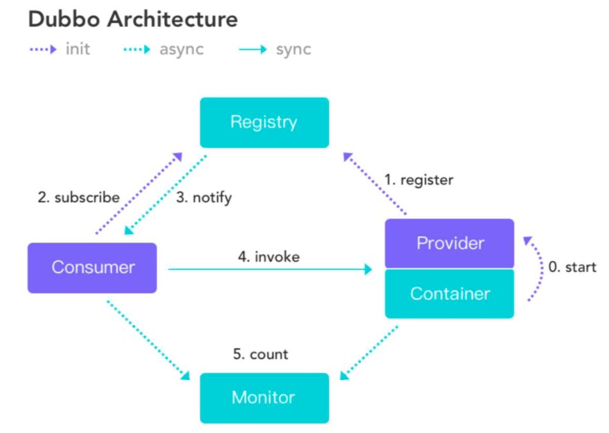
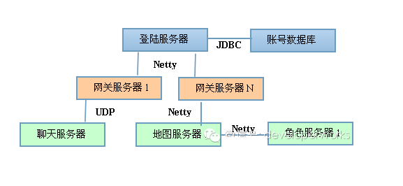
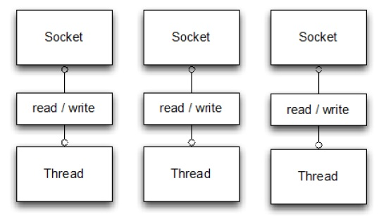
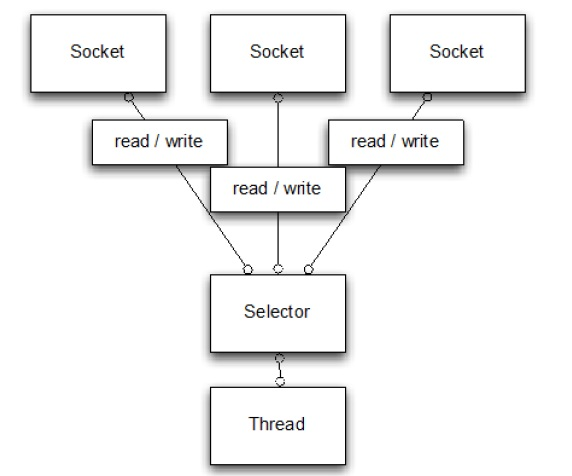
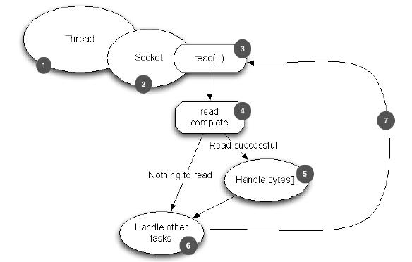
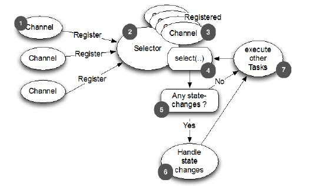
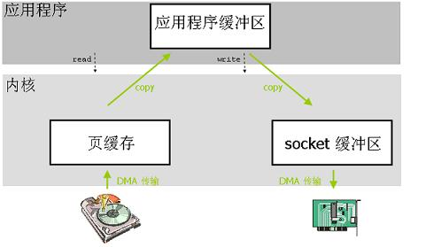
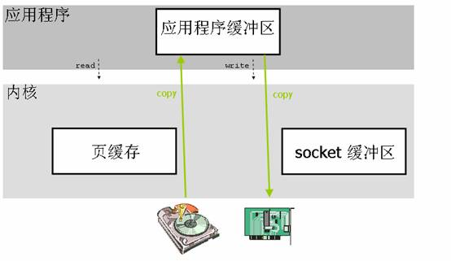

# 1、Netty是什么

**Netty是什么？**

- 本质：JBoss做的一个Jar包
- 目的：快速开发高性能、高可靠性的网络服务器和客户端程序
- 优点：提供异步的、事件驱动的网络应用程序框架和工具
- 通俗的说：一个好使的处理Socket的东东

**如果没有Netty？**

- 远古：java.net + java.io
- 近代：java.nio
- 其他：Mina，Grizzly

顺便说一下， Netty的作者是Trustin Lee是一个韩国人，另外一个著名的网络编程框架——Mina，也是他开发的。二者在很多方面都十分相似，它们的线程模型也是基本一致 。不过Netty社区的活跃程度要Mina高得多。

# 2、Netty VS java.nio

JDK 原生也有一套网络应用程序 API，但是存在一系列问题，主要如下：

- NIO 的类库和 API 繁杂，使用麻烦。你需要熟练掌握 `Selector`、`ServerSocketChannel`、`SocketChannel`、`ByteBuffer` 等。
- 需要具备其他的额外技能做铺垫。例如熟悉 Java 多线程编程，因为 NIO 编程涉及到 Reactor 模式，你必须对多线程和网路编程非常熟悉，才能编写出高质量的 NIO 程序。
- 可靠性能力补齐，开发工作量和难度都非常大。例如客户端面临断连重连、网络闪断、半包读写、失败缓存、网络拥塞和异常码流的处理等等。 NIO 编程的特点是功能开发相对容易，但是可靠性能力补齐工作量和难度都非常大。
- JDK NIO 的 Bug。例如臭名昭著的 Epoll Bug，它会导致 Selector 空轮询，最终导致 CPU 100%。 官方声称在 JDK 1.6 版本的 update 18 修复了该问题，但是直到 JDK 1.7 版本该问题仍旧存在，只不过该 Bug 发生概率降低了一些而已，它并没有被根本解决。

Netty 对 JDK 自带的 NIO 的 API 进行封装，解决上述问题，主要特点有：

- 设计优雅，适用于各种传输类型的统一 API 阻塞和非阻塞 Socket；基于灵活且可扩展的事件模型，可以清晰地分离关注点；高度可定制的线程模型 - 单线程，一个或多个线程池；真正的无连接数据报套接字支持（自 3.1 起）。
- 使用方便，详细记录的 Javadoc，用户指南和示例；没有其他依赖项，JDK 5（Netty 3.x）或 6（Netty 4.x）就足够了。
- 高性能，吞吐量更高，延迟更低；减少资源消耗；最小化不必要的内存复制。
- 安全，完整的 SSL/TLS 和 StartTLS 支持。
- 社区活跃，不断更新，社区活跃，版本迭代周期短，发现的 Bug 可以被及时修复，同时，更多的新功能会被加入。

# 3、应用场景

作为当前最流行的NIO框架，Netty在互联网领域、大数据分布式计算领域、游戏行业、通信行业等获得了广泛的应用，一些业界著名的开源组件也基于Netty的NIO框架构建。

- **互联网行业**

随着网站规模的不断扩大，系统并发访问量也越来越高，传统基于 Tomcat 等 Web 容器的垂直架构已经无法满足需求，需要拆分应用进行服务化，以提高开发和维护效率。从组网情况看，垂直的架构拆分之后，系统采用分布式部署，各个节点之间 需要远程服务调用，高性能的 RPC 框架必不可少，Netty 作为异步高性能的通信框架，往往作为基础通信组件被这些 RPC 框架使用。

阿里分布式服务框架 Dubbo 默认使用 Netty 作为基础通信组件，用于实现各进程节点之间的内部通信。它的架构图如下：



其中，服务提供者和服务消费者之间，服务提供者、服务消费者和性能统计节点之间使用 Netty 进行异步/同步通信。

除了 Dubbo 之外，淘宝的消息中间件 RocketMQ 的消息生产者和消息消费者之间，也采用 Netty 进行高性能、异步通信。

除了阿里系和淘宝系之外，很多其它的大型互联网公司或者电商内部也已经大量使用 Netty 构建高性能、分布式的网络服务器。

- **游戏行业**

无论是手游服务端、还是大型的网络游戏，Java 语言得到了越来越广泛的应用。Netty 作为高性能的基础通信组件，它本身提供了 TCP/UDP 和 HTTP 协议栈，非常方便定制和开发私有协议栈。账号登陆服务器、地图服务器之间可以方便的通过 Netty 进行高性能的通信，架构示意图如下：




- **大数据领域**

经典的 Hadoop 的高性能通信和序列化组件 Avro 的 RPC 框架，默认采用 Netty 进行跨节点通信，它的 Netty Service 基于 Netty 框架二次封装实现。

从Spark1.3.1版本开始，为了解决大块数据（如Shuffle）的传输问题，Spark引入了Netty通信框架，到了1.6.0版本，Netty完成取代了Akka，承担Spark内部所有的RPC通信以及数据流传输。

大数据计算往往采用多个计算节点和一个/N个汇总节点进行分布式部署，各节点之间存在海量的数据交换。由于 Netty 的综合性能是目前各个成熟 NIO 框架中最高的，因此，往往会被选中用作大数据各节点间的通信。

- **企业软件**

企业和 IT 集成需要 ESB，Netty 对多协议支持、私有协议定制的简洁性和高性能是 ESB RPC 框架的首选通信组件。事实上，很多企业总线厂商会选择 Netty 作为基础通信组件，用于企业的 IT 集成。

- **通信行业**

Netty 的异步高性能、高可靠性和高成熟度的优点，使它在通信行业得到了大量的应用。

# 4、为什么Netty受欢迎

如上所述，Netty是一款很受大公司青睐的框架，之所以这么受欢迎，大体上原因有三：

- 并发高
- 传输快
- 封装好

## 4.1 Netty为什么并发高

Netty是一款基于NIO（Nonblocking I/O，非阻塞IO）开发的网络通信框架，对比于BIO（Blocking I/O，阻塞IO），它的并发性能得到了很大提高。






从这两图可以看出，NIO的单线程能处理连接的数量比BIO要高出很多，而为什么单线程能处理更多的连接呢？原因就是图二中出现的`Selector`。

当一个连接建立之后，有两个步骤要做，第一步是接收完客户端发过来的全部数据，第二步是服务端处理完请求业务之后返回response给客户端。NIO和BIO的区别主要是在第一步。

在BIO中，等待客户端发数据这个过程是阻塞的，这样就造成了一个线程只能处理一个请求的情况，而机器能支持的最大线程数是有限的，这就是为什么BIO不能支持高并发的原因。

而NIO中，当一个Socket建立好之后，Thread并不会阻塞去接受这个Socket，而是将这个请求交给Selector，Selector会不断的去遍历所有的Socket，一旦有一个Socket建立完成就会通知Thread，然后Thread处理完数据再返回给客户端——**这个过程是不阻塞的**，这样就能让一个Thread处理更多的请求了。

下面两张图是基于BIO的处理流程和netty的处理流程，有助于理解两种方式的差别：





## 4.2 Netty为什么传输快

我们知道，Java的内存有堆内存、栈内存和字符串常量池等等，其中堆内存是占用内存空间最大的一块，也是Java对象存放的地方，一般我们的数据如果需要从IO读取到堆内存，中间需要经过Socket缓冲区，也就是说一个数据会被拷贝两次才能到达终点，如果数据量大，就会造成不必要的资源浪费。

Netty针对这种情况，使用了NIO中的另一大特性——**零拷贝**，当需要接收数据的时候，会在堆内存之外开辟一块内存，数据就直接从IO读到了那块内存中去，在Netty里面通过`ByteBuf`可以直接对这些数据进行直接操作，从而加快了传输速度。

下两图就介绍了两种拷贝方式的区别：






## 4.3 为什么说Netty封装好

> Talk is cheap. Show me the code.

没有对比就没有伤害，上代码。

阻塞I/O：

```java
public class PlainOioServer {

    public void serve (int port) throws IOException {
        final ServerSocket socket = new ServerSocket(port);
        try {
            for (; ; ) {
                final Socket clientSocket = socket.accept();
                System.out.println("Accepted connection from " + clientSocket);

                new Thread(new Runnable() {
                    @Override
                    public void run () {
                        OutputStream out;
                        try {
                            out = clientSocket.getOutputStream();
                            out.write("Hi!\r\n".getBytes(Charset.forName("UTF-8")));
                            out.flush();
                            clientSocket.close();

                        } catch (IOException e) {
                            e.printStackTrace();
                            try {
                                clientSocket.close();
                            } catch (IOException ex) {
                                // ignore on close
                            }
                        }
                    }
                }).start();
            }
        } catch (IOException e) {
            e.printStackTrace();
        }
    }
}
```

非阻塞IO：

```java
public class PlainNioServer {
    
    public void serve (int port) throws IOException {
        ServerSocketChannel serverChannel = ServerSocketChannel.open();
        serverChannel.configureBlocking(false);
        ServerSocket ss = serverChannel.socket();
        InetSocketAddress address = new InetSocketAddress(port);
        ss.bind(address);
        Selector selector = Selector.open();
        serverChannel.register(selector, SelectionKey.OP_ACCEPT);
        final ByteBuffer msg = ByteBuffer.wrap("Hi!\r\n".getBytes());
        for (; ; ) {
            try {
                selector.select();
            } catch (IOException ex) {
                ex.printStackTrace();
                // handle exception
                break;
            }
            Set<SelectionKey> readyKeys = selector.selectedKeys();
            Iterator<SelectionKey> iterator = readyKeys.iterator();
            while (iterator.hasNext()) {
                SelectionKey key = iterator.next();
                iterator.remove();
                try {
                    if (key.isAcceptable()) {
                        ServerSocketChannel server = (ServerSocketChannel) key.channel();
                        SocketChannel client = server.accept();
                        client.configureBlocking(false);
                        client.register(selector, SelectionKey.OP_WRITE | SelectionKey.OP_READ, msg.duplicate());
                        System.out.println("Accepted connection from " + client);
                    }
                    if (key.isWritable()) {
                        SocketChannel client = (SocketChannel) key.channel();
                        ByteBuffer buffer = (ByteBuffer) key.attachment();
                        while (buffer.hasRemaining()) {
                            if (client.write(buffer) == 0) {
                                break;
                            }
                        }
                        client.close();
                    }
                } catch (IOException ex) {
                    key.cancel();
                    try {
                        key.channel().close();
                    } catch (IOException cex) {
                        // 在关闭时忽略
                    }
                }
            }
        }
    }
}
```

Netty：

```java
public class NettyOioServer {

    public void server(int port) throws Exception {
        final ByteBuf buf = Unpooled.unreleasableBuffer(
                Unpooled.copiedBuffer("Hi!\r\n", Charset.forName("UTF-8")));
        EventLoopGroup group = new OioEventLoopGroup();
        try {
            ServerBootstrap b = new ServerBootstrap();        

            b.group(group)                                    
                    .channel(OioServerSocketChannel.class)
                    .localAddress(new InetSocketAddress(port))
                    .childHandler(new ChannelInitializer<SocketChannel>() {
                        @Override
                        public void initChannel(SocketChannel ch)
                                throws Exception {
                            ch.pipeline().addLast(new ChannelInboundHandlerAdapter() {            
                                @Override
                                public void channelActive(ChannelHandlerContext ctx) throws Exception {
                                    ctx.writeAndFlush(buf.duplicate()).addListener(ChannelFutureListener.CLOSE);
                                }
                            });
                        }
                    });
            ChannelFuture f = b.bind().sync();  
            f.channel().closeFuture().sync();
        } finally {
            group.shutdownGracefully().sync();        
        }
    }
}
```


