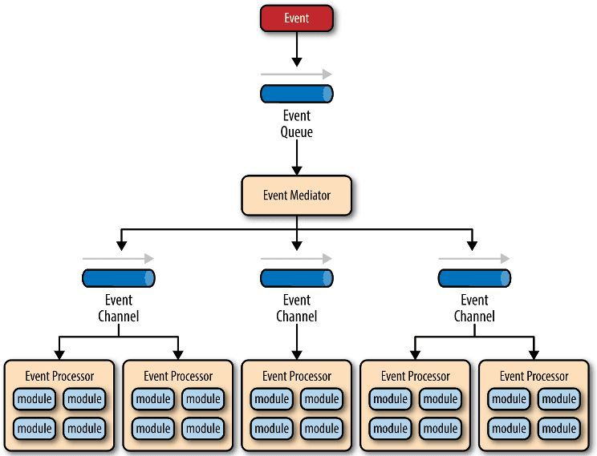
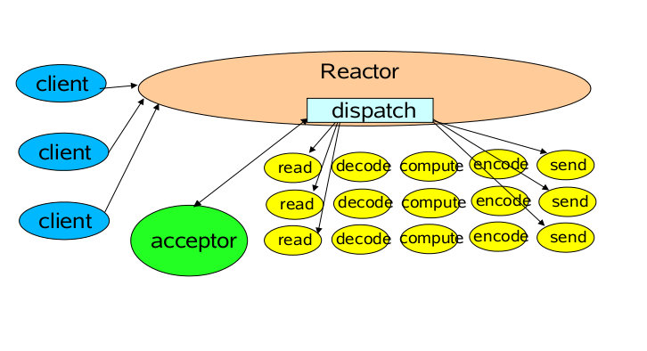
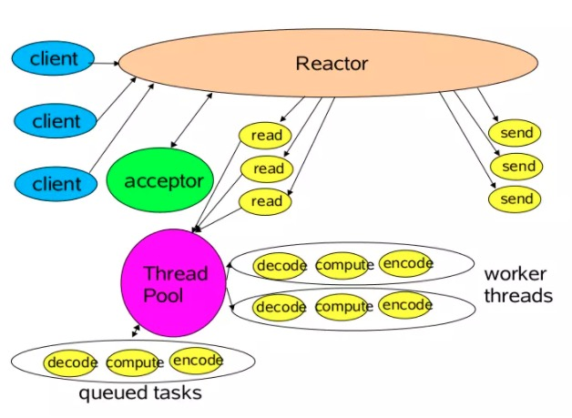
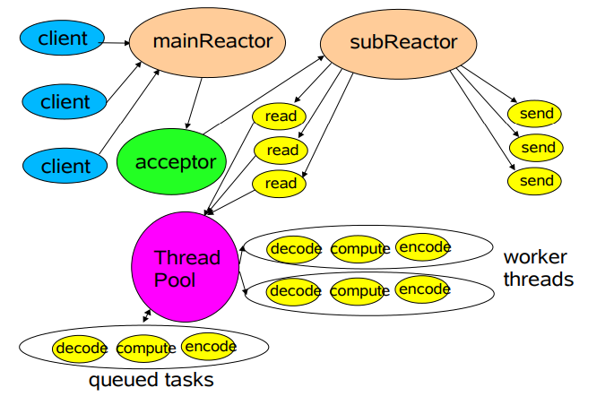
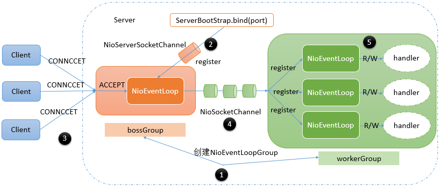

# 1、事件驱动模型

通常，我们设计一个事件处理模型的程序有两种思路：

- 轮询方式，线程不断轮询访问相关事件发生源有没有发生事件，有发生事件就调用事件处理逻辑。
- 事件驱动方式，发生事件，主线程把事件放入事件队列，在另外线程不断循环消费事件列表中的事件，调用事件对应的处理逻辑处理事件。事件驱动方式也被称为消息通知方式，其实是设计模式中观察者模式的思路。

以 GUI 的逻辑处理为例，说明两种逻辑的不同：

- 轮询方式，线程不断轮询是否发生按钮点击事件，如果发生，调用处理逻辑。
- 事件驱动方式，发生点击事件把事件放入事件队列，在另外线程消费的事件列表中的事件，根据事件类型调用相关事件处理逻辑。

这里借用 O'Reilly 大神关于事件驱动模型解释图：



主要包括 4 个基本组件：

- 事件队列（event queue）：接收事件的入口，存储待处理事件。
- 分发器（event mediator）：将不同的事件分发到不同的业务逻辑单元。
- 事件通道（event channel）：分发器与处理器之间的联系渠道。
- 事件处理器（event processor）：实现业务逻辑，处理完成后会发出事件，触发下一步操作。

可以看出，相对传统轮询模式，事件驱动有如下优点：

- 可扩展性好，分布式的异步架构，事件处理器之间高度解耦，可以方便扩展事件处理逻辑。
- 高性能，基于队列暂存事件，能方便并行异步处理事件。

# 2、Reactor 线程模型

Reactor 模型是指通过一个或多个输入同时传递给服务处理器的服务请求的事件驱动处理模式。

服务端程序处理传入多路请求，并将它们同步分派给请求对应的处理线程，Reactor 模式也叫 Dispatcher 模式，即 I/O 多了复用统一监听事件，收到事件后分发(Dispatch 给某进程)，是编写高性能网络服务器的必备技术之一。

取决于 Reactor 的数量和 Hanndler 线程数量的不同，Reactor 模型有 3 个变种：

## 2.1 单线程模型



Reactor内部通过selector 监控连接事件，收到事件后通过dispatch进行分发，如果是连接建立的事件，则由Acceptor处理，Acceptor通过accept接受连接，并创建一个Handler来处理连接后续的各种事件，如果是读写事件，直接调用连接对应的Handler来处理。

Handler完成read->业务处理(decode->compute->encode)->send的全部流程。

这种模型好处是简单，坏处却很明显，当某个Handler阻塞时，会导致其他客户端的handler和accpetor都得不到执行，无法做到高性能，只适用于业务处理非常快速的场景。

## 2.2 多线程模型



主线程中，Reactor对象通过selector监控连接事件，收到事件后通过dispatch进行分发，如果是连接建立事件，则由Acceptor处理，Acceptor通过accept接收连接，并创建一个Handler来处理后续事件，而**Handler只负责响应事件，不进行业务操作，也就是只进行read读取数据和write写出数据，业务处理交给一个线程池进行处理**。

线程池分配一个线程完成真正的业务处理，然后将响应结果交给主进程的Handler处理，Handler将结果send给client。

单Reactor承当所有事件的监听和响应，而当我们的服务端遇到大量的客户端同时进行连接，或者在请求连接时执行一些耗时操作，比如身份认证，权限检查等，这种瞬时的高并发就容易成为性能瓶颈。

## 2.3 主从多线程模型



存在多个Reactor，**每个Reactor都有自己的selector选择器，线程和dispatch**。

主线程中的mainReactor通过自己的selector监控连接建立事件，收到事件后通过Accpetor接收，将新的连接分配给某个子线程。

子线程中的subReactor将mainReactor分配的连接加入连接队列中通过自己的selector进行监听，并创建一个Handler用于处理后续事件

Handler完成read->业务处理->send的完整业务流程。

# 3、Netty中的Reactor线程模型

## 3.1 启动流程

上面提到的几种线程模型，在我们编写的基于netty的应用中都有可能出现，甚至可能会不用reactor线程。具体属于哪一种情况，要看我们的代码是如何编写的。

我们先以一个使用了reactor线程模型的netty服务端的典型代码进行说明：

```java
EventLoopGroup bossGroup = new NioEventLoopGroup(1);
EventLoopGroup workerGroup = new NioEventLoopGroup(3);
ServerBootstrap b = new ServerBootstrap(); 
b.group(bossGroup, workerGroup)
.channel(NioServerSocketChannel.class)
.handler(new LoggingHandler(LogLevel.INFO))
.option(ChannelOption.SO_BACKLOG, 128)
.attr(AttributeKey.valueOf("ssc.key"),"scc.value")
.childHandler(new ChannelInitializer<SocketChannel>() {
  @Override
  public void initChannel(SocketChannel ch) throws Exception {
    ch.pipeline().addLast(new DiscardServerHandler());
  }
}) 
.childOption(ChannelOption.SO_KEEPALIVE, true); 
.childAttr(AttributeKey.valueOf("sc.key"),"sc.value")
.bind(port);
```

在上述代码片段中代码很少，却包含了一个复杂reactor线程模型，如下所示：



图中大致包含了5个步骤：

- 设置服务端ServerBootStrap启动参数

- 通过ServerBootStrap的`bind`方法启动服务端，`bind`方法会在`bossGroup`中注册NioServerScoketChannel，监听客户端的连接请求

- Client发起连接CONNECT请求，`bossGroup`中的NioEventLoop不断轮循是否有新的客户端请求，如果有，ACCEPT事件触发

- ACCEPT事件触发后，`bossGroup`中NioEventLoop会通过NioServerSocketChannel获取到对应的代表客户端的NioSocketChannel，并将其注册到`workerGroup`中

- `workerGroup`中的NioEventLoop不断检测自己管理的NioSocketChannel是否有读写事件准备好，如果有的话，调用对应的ChannelHandler进行处理

## 3.2 源码解析

ServerBootStrap继承自AbstractBootstrap，其代表服务端的启动类，当调用其`bind`方法时，表示启动服务端。在启动之前，我们会调用`group`、`channel`、`handler`、`option`、`attr`、`childHandler`、`childOption`、`childAttr`等方法来设置一些启动参数。

### 3.2.1 `group`方法

`group()`可以认为是设置执行任务的线程池，在Netty中，EventLoopGroup 的作用类似于线程池，每个EventLoopGroup中包含多个EventLoop对象，代表不同的线程。特别的，我们创建的是2个EventLoopGroup的子类NioEventLoopGroup的实例：bossGroup、workerGroup， 所以实际上包含的是多个NioEventLoop对象。

在创建`bossGroup` 、`workerGroup` 时，分别传入了构造参数1和3，这对应了上图中红色部分的`bossGroup `中只有1个NioEventLoop，绿色部分的`workerGroup` 中有3个NioEventLoop。

特别的，如果我们创建NioEventLoopGroup 的时候，没有指定参数，或者传入的是0，那么这个NioEventLoopGroup包含的NioEventLoop个数将会是：`cpu核数*2`。

具体可参见NioEventLoopGroup的父类MultithreadEventLoopGroup构造时的相关代码：

```java
public abstract class MultithreadEventLoopGroup extends MultithreadEventExecutorGroup implements EventLoopGroup {
    private static final InternalLogger logger = InternalLoggerFactory.getInstance(MultithreadEventLoopGroup.class);
  
    private static final int DEFAULT_EVENT_LOOP_THREADS = Math.max(1, SystemPropertyUtil.getInt("io.netty.eventLoopThreads", NettyRuntime.availableProcessors() * 2));//默认线程数量，cpu核数*2

    //...
}
```

在创建完`bossGroup` 和`workerGroup` 之后，我们把其当做参数传递给了ServerBootStrap<通过调用带有2个参数的`group`方法。在这个方法中，会把`bossGroup` 当做参数传递给ServerBootStrap的父类AbstractBootstrap来进行维护，`workerGroup` 则由ServerBootStrap自己维护。

之后，我们可以调用ServerBootStrap 的group()方法来获取parentGroup 的引用，这个方法父类AbstractBootstrap继承的。另外可以通过调用ServerBootStrap自己定义的`childGroup()`方法来获取`workerGroup`的引用。

`io.netty.bootstrap.ServerBootstrap`：

```java
private volatile EventLoopGroup childGroup;   //ServerBootStrap自己维护childGroup
//...
public ServerBootstrap group(EventLoopGroup parentGroup, EventLoopGroup childGroup) {
        super.group(parentGroup);//将parentGroup传递给父类AbstractBootstrap处理
        if (childGroup == null) {
            throw new NullPointerException("childGroup");
        } else if (this.childGroup != null) {
            throw new IllegalStateException("childGroup set already");
        } else {
            this.childGroup = childGroup;
            return this;
        }
    }
```

`io.netty.bootstrap.AbstractBootstrap`：

```java
volatile EventLoopGroup group;  //这个字段将会被设置为parentGroup
//...
public B group(EventLoopGroup group) {
        if (group == null) {
            throw new NullPointerException("group");
        } else if (this.group != null) {
            throw new IllegalStateException("group set already");
        } else {
            this.group = group;
            return this.self();
        }
    }
```

### 3.2.2 `channel`方法

`channel()`继承自AbstractBootstrap，用于构造通道的工厂类ChannelFactory实例，在之后需要创建通道实例，例如NioServerSocketChannel的时候，通过调用`ChannelFactory.newChannel()`方法来创建。

`channel`方法内部隐含的调用了`channelFactory`方法，我们也可以直接调用这个方法。

```java
//这个工厂类最终创建的通道实例，就是channel方法指定的NioServerSocketChannel
private volatile ChannelFactory<? extends C> channelFactory;
//...	
public B channel(Class<? extends C> channelClass) {
        if (channelClass == null) {
            throw new NullPointerException("channelClass");
        } else {
            return this.channelFactory(new AbstractBootstrap.BootstrapChannelFactory(channelClass));
        }
    }

    public B channelFactory(ChannelFactory<? extends C> channelFactory) {
        if (channelFactory == null) {
            throw new NullPointerException("channelFactory");
        } else if (this.channelFactory != null) {
            throw new IllegalStateException("channelFactory set already");
        } else {
            this.channelFactory = channelFactory;
            return this.self();
        }
    }
```

### 3.2.3 `handler`、`option`、`attr`方法

`handler`、`option`、`attr`方法，都是从AbstractBootstrap中继承的。这些方法设置的参数，将会被应用到NioServerSocketChannel实例上，由于NioServerSocketChannel一般只会创建一个，因此这些参数通常只会应用一次。源码如下所示：

```java
private final Map<ChannelOption<?>, Object> options = new LinkedHashMap();
private final Map<AttributeKey<?>, Object> attrs = new LinkedHashMap();
private volatile ChannelHandler handler;
//...

public <T> B option(ChannelOption<T> option, T value) {
        if (option == null) {
            throw new NullPointerException("option");
        } else {
            if (value == null) {
                synchronized(this.options) {
                    this.options.remove(option);
                }
            } else {
                synchronized(this.options) {
                    this.options.put(option, value);
                }
            }

            return this.self();
        }
    }

    public <T> B attr(AttributeKey<T> key, T value) {
        if (key == null) {
            throw new NullPointerException("key");
        } else {
            if (value == null) {
                synchronized(this.attrs) {
                    this.attrs.remove(key);
                }
            } else {
                synchronized(this.attrs) {
                    this.attrs.put(key, value);
                }
            }

            return this.self();
        }
    }

    public B handler(ChannelHandler handler) {
        if (handler == null) {
            throw new NullPointerException("handler");
        } else {
            this.handler = handler;
            return this.self();
        }
    }
```

而`childHandler`、`childOption`、`childAttr`方法是ServerBootStrap自己定义的，这些方法设置的参数，将会被应用到NioSocketChannel实例上，由于服务端每次接受到一个客户端连接，就会创建一个NioSocketChannel实例，因此每个NioSocketChannel实例都会应用这些方法设置的参数。

```java
    
private final Map<ChannelOption<?>, Object> childOptions = new LinkedHashMap();
private final Map<AttributeKey<?>, Object> childAttrs = new LinkedHashMap();
private volatile ChannelHandler childHandler;
//...
public <T> ServerBootstrap childOption(ChannelOption<T> childOption, T value) {
        if (childOption == null) {
            throw new NullPointerException("childOption");
        } else {
            if (value == null) {
                synchronized(this.childOptions) {
                    this.childOptions.remove(childOption);
                }
            } else {
                synchronized(this.childOptions) {
                    this.childOptions.put(childOption, value);
                }
            }

            return this;
        }
    }

    public <T> ServerBootstrap childAttr(AttributeKey<T> childKey, T value) {
        if (childKey == null) {
            throw new NullPointerException("childKey");
        } else {
            if (value == null) {
                this.childAttrs.remove(childKey);
            } else {
                this.childAttrs.put(childKey, value);
            }

            return this;
        }
    }

    public ServerBootstrap childHandler(ChannelHandler childHandler) {
        if (childHandler == null) {
            throw new NullPointerException("childHandler");
        } else {
            this.childHandler = childHandler;
            return this;
        }
    }
```

也就是说，以上六个方法都是一 一对应的:

- `handler`-->`childHandler` ：分别用于设置NioServerSocketChannel和NioSocketChannel的处理器链，也就是当有一个NIO事件的时候，应该按照怎样的步骤进行处理。
- `option`-->`childOption`：分别用于设置NioServerSocketChannel和 NioSocketChannel的TCP连接参数，在ChannelOption类中可以看到Netty支持的所有TCP连接参数。
- `attr`-->`childAttr`：用于给channel设置一个key/value，之后可以根据key获取


`ChannelOption`中的定义了一些TCP连接相关的参数，常用的参数如下：

- ChannelOption.SO_KEEPALIVE

  是否启用心跳保活机制，默认false。

  套接字本身是有一套心跳保活机制的，不过默认的设置并不像我们一厢情愿的那样有效。在双方TCP套接字建立连接后（即都进入ESTABLISHED状态）并且在两个小时左右上层没有任何数据传输的情况下，这套机制才会被激活。实际上这套机制只是操作系统底层使用的一个被动机制，原理上不应该被上层应用层使用。当系统关闭一个由KEEPALIVE机制检查出来的死连接时，是不会主动通知上层应用的，只有在调用相应的IO操作在返回值中检查出来。

- ChannelOption.SO_SNDBUF

  发送缓冲区的大小设置，默认为8K。

- ChannelOption.SO_RCVBUF

  接收缓冲区大小设置，默认为8K。该属性既可以在ServerSocket实例中设置，也可以在Socket实例中设置。

- ChannelOption.TCP_NODELAY

  是否一有数据就马上发送。在TCP/IP协议中，无论发送多少数据，总是要在数据前面加上协议头，同时，对方接收到数据，也需要发送ACK表示确认。为了尽可能的利用网络带宽，TCP总是希望尽可能的发送足够大的数据。这里就涉及到一个名为Nagle的算法，该算法的目的就是为了尽可能发送大块数据，避免网络中充斥着许多小数据块。

- TCP_NODELAY选项，就是用于启用或关于Nagle算法。如果要求高实时性，有数据发送时就马上发送，就将该选项设置为true关闭Nagle算法；如果要减少发送次数减少网络交互，就设置为false等累积一定大小后再发送。默认为false。

- ChannelOption.SO_BACKLOG

  用于构造服务端套接字ServerSocket对象，标识当服务器请求处理线程全满时，用于临时存放已完成三次握手的请求的队列的最大长度。如果未设置或所设置的值小于1，Java将使用默认值50。在Netty中，这个值默认是去读取文件`/proc/sys/net/core/somaxconn`的值，如果没有读到，默认取值为3072(参见：`NetUtil.SOMAXCONN`)。


### 3.2.4 `bind`方法

**调用`bind`方法，就相当于启动了服务端**。启动的核心逻辑都是在`bind`方法中。

`bind`方法内部，会创建一个NioServerSocketChannel实例，并将其在`parentGroup`中进行注册。`parentGroup`在接受到注册请求时，会从自己的管理的NioEventLoop中，选择一个进行注册。一旦注册完成，我们就可以通过NioServerSocketChannel检测有没有新的客户端连接的到来。

如果一步一步追踪ServerBootStrap.bind方法的调用链，最终会定位到ServerBootStrap 父类AbstractBootstrap的`doBind`方法，相关源码如下：

```java
    private ChannelFuture doBind(final SocketAddress localAddress) {
        final ChannelFuture regFuture = this.initAndRegister();
        final Channel channel = regFuture.channel();
        if (regFuture.cause() != null) {
            return regFuture;
        } else if (regFuture.isDone()) {
            ChannelPromise promise = channel.newPromise();
            doBind0(regFuture, channel, localAddress, promise);
            return promise;
        } else {
            final AbstractBootstrap.PendingRegistrationPromise promise = new AbstractBootstrap.PendingRegistrationPromise(channel);
            regFuture.addListener(new ChannelFutureListener() {
                public void operationComplete(ChannelFuture future) throws Exception {
                    Throwable cause = future.cause();
                    if (cause != null) {
                        promise.setFailure(cause);
                    } else {
                        promise.executor = channel.eventLoop();
                        AbstractBootstrap.doBind0(regFuture, channel, localAddress, promise);
                    }

                }
            });
            return promise;
        }
    }
```

`doBind`方法中，最重要的调用的方法是`initAndRegister`，这个方法主要完成3个任务：

- 创建NioServerSocketChannel实例，这是通过之前创建的ChannelFactory实例的newChannel方法完成

- 初始化NioServerSocketChannel，即将我们前面通过handler，option，attr等方法设置的参数应用到NioServerSocketChannel上

- 将NioServerSocketChannel 注册到parentGroup中，parentGroup会选择其中一个NioEventLoop来运行这个NioServerSocketChannel要完成的功能，即监听客户端的连接。


```java
    final ChannelFuture initAndRegister() {
        Channel channel = null;

        try {
            channel = this.channelFactory().newChannel(); //1、创建NioServerSocketChannel实例
            this.init(channel);//2、初始化NioServerSocketChannel，这是一个抽象方法，ServerBootStrap对此进行了覆盖
        } catch (Throwable var3) {
            if (channel != null) {
                channel.unsafe().closeForcibly();
            }

            return (new DefaultChannelPromise(channel, GlobalEventExecutor.INSTANCE)).setFailure(var3);
        }

        ChannelFuture regFuture = this.group().register(channel);//3、NioServerSocketChannel注册到parentGroup中
        if (regFuture.cause() != null) {
            if (channel.isRegistered()) {
                channel.close();
            } else {
                channel.unsafe().closeForcibly();
            }
        }

        return regFuture;
    }
```

ServerBootStrap实现了AbstractBootstrap的抽象方法`init`，对NioServerSocketChannel进行初始化，这是典型的模板设计模式，即父类运行过程中会调用多个方法，子类对特定的方法进行覆写。

在这里，`init`方法主要是为NioServerSocketChannel设置运行参数，也就是我们前面通过调用ServerBootStrap的`option`、`attr`、`handler`等方法指定的参数。

特别需要注意的是，除了我们通过`handler`方法为NioServerSocketChannel 指定的ChannelHandler之外(在我们这里是LoggingHandler)，ServerBootStrap的`init`方法总是会帮我们在NioServerSocketChannel 的处理器链的最后添加一个默认的处理器ServerBootstrapAcceptor。

从ServerBootstrapAcceptor 名字上可以看出来，它是客户端连接请求的处理器。当接受到一个客户端请求之后，Netty会将创建一个代表客户端的NioSocketChannel对象。而我们通过ServerBoodStrap指定的`channelHandler`、`childOption`、`childAtrr`、`childGroup`等参数，也需要设置到NioSocketChannel中。但是明显现在，由于只是服务端刚启动，没有接收到任何客户端请求，还没有任何NioSocketChannel实例，因此这些参数要保存到ServerBootstrapAcceptor中，等到接收到客户端连接的时候，再将这些参数进行设置，我们可以看到这些参数通过构造方法传递给了ServerBootstrapAcceptor。

```java
    void init(Channel channel) throws Exception { //入参类型就是NioServerSocketChannel
        //为NioServerSocketChannel设置option方法设置的参数  
        Map<ChannelOption<?>, Object> options = this.options();
        synchronized(options) {
            setChannelOptions(channel, options, logger);
        }

        //为NioServerSocketChannel设置attr方法设置的参数
        Map<AttributeKey<?>, Object> attrs = this.attrs();
        synchronized(attrs) {
            Iterator var5 = attrs.entrySet().iterator();

            while(true) {
                if (!var5.hasNext()) {
                    break;
                }

                Entry<AttributeKey<?>, Object> e = (Entry)var5.next();
                AttributeKey<Object> key = (AttributeKey)e.getKey();
                channel.attr(key).set(e.getValue());
            }
        }
     
        ChannelPipeline p = channel.pipeline();
        final EventLoopGroup currentChildGroup = this.childGroup;
        final ChannelHandler currentChildHandler = this.childHandler;
        final Entry[] currentChildOptions;
        synchronized(this.childOptions) {
            currentChildOptions = (Entry[])this.childOptions.entrySet().toArray(newOptionArray(this.childOptions.size()));
        }

        final Entry[] currentChildAttrs;
        synchronized(this.childAttrs) {
            currentChildAttrs = (Entry[])this.childAttrs.entrySet().toArray(newAttrArray(this.childAttrs.size()));
        }

        p.addLast(new ChannelHandler[]{new ChannelInitializer<Channel>() {
            public void initChannel(final Channel ch) throws Exception {
                final ChannelPipeline pipeline = ch.pipeline();
                ChannelHandler handler = ServerBootstrap.this.handler();
                if (handler != null) {//为NioServerSocketChannel设置通过handler方法指定的处理器
                    pipeline.addLast(new ChannelHandler[]{handler});
                }

                ch.eventLoop().execute(new Runnable() {
                    public void run() {
                      //为NioSocketChannel设置默认的处理器ServerBootstrapAcceptor，并将相关参数通过构造方法传给ServerBootstrapAcceptor
                        pipeline.addLast(new ChannelHandler[]{new ServerBootstrap.ServerBootstrapAcceptor(ch, currentChildGroup, currentChildHandler, currentChildOptions, currentChildAttrs)});
                    }
                });
            }
        }});
    }
```

 在初始化完成之后，ServerBootStrap通过调用`register`方法将NioServerSocketChannel注册到了`parentGroup`中。

从较高的层面来说，`parentGroup` 的类型是NioEventLoopGroup，一个NioEventLoopGroup可能会管理多个NioEventLoop，对于通道的注册，NioEventLoopGroup会从多个NioEventLoop中选择一个来执行真正的注册。之后这个通道的nio事件，也都是由这个NioEventLoop来处理。也就是说，**一个通道只能由一个NioEventLoop来处理，一个NioEventLoop可以处理多个通道**，通道与NioEventLoop是多对一的关系。