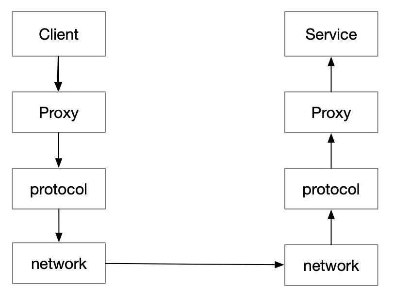
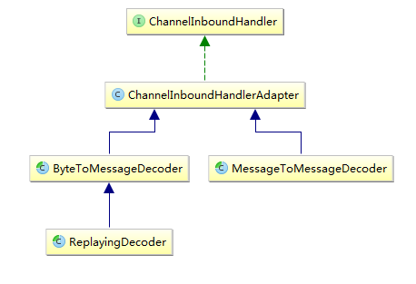
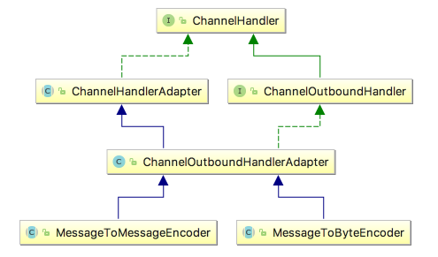
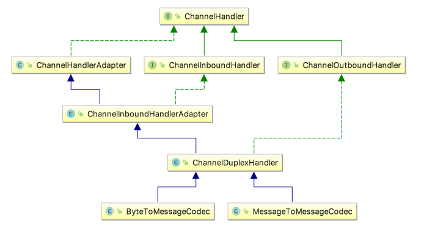

# 1、RPC

在微服务大行其道的今天，分布式系统越来越重要，实现服务化首先就要考虑服务之间如何通信，也就是**RPC**。

> RPC，全称为Remote Procedure Call，即远程过程调用，它是一个计算机通信协议。它允许像调用本地服务一样调用远程服务。

一次RPC调动过程可以简化为下图：



- client 会调用本地动态代理 proxy
- 这个代理会将调用通过协议转序列化字节流
- 通过网络框架（比如Netty），将字节流发送到服务端
- 服务端在受到这个字节流后，会根据协议，反序列化为原始的调用，利用反射原理调用服务方提供的方法
- 如果请求有返回值，又需要把结果根据协议序列化后，再通过 网络框架 返回给调用方

RPC框架有很多，比较知名的如阿里的Dubbo、google的gRPC、Go语言的rpcx、Apache的thrift。当然了，还有Spring Cloud，不过对于Spring Cloud来说，RPC只是它的一个功能模块。

RPC框架让调用方像调用本地函数一样调用远程服务，那么如何做到这一点呢？

在使用的时候，调用方是直接调用本地函数，传入相应参数，其他细节它不用管，至于通讯细节交给RPC框架来实现。实际上RPC框架采用代理类的方式，具体来说是动态代理的方式，在运行时动态创建新的类，也就是代理类，在该类中实现通讯的细节问题，比如参数序列化。

当然不光是序列化，我们还需要约定一个双方通信的协议格式，规定好协议格式，比如请求参数的数据类型，请求的参数，请求的方法名等，这样根据格式进行序列化后进行网络传输，然后服务端收到请求对象后按照指定格式进行解码，这样服务端才知道具体该调用哪个方法，传入什么样的参数。

刚才又提到网络传输，RPC框架重要的一环也就是网络传输，服务是部署在不同主机上的，如何高效的进行网络传输，尽量不丢包，保证数据完整无误的快速传递出去？实际上，就是利用我们今天的主角——Netty。

再次总结下一个RPC框架需要重点关注哪几个点：

- 代理 （动态代理）
- 通讯协议
- 序列化
- 网络传输

下面以Netty为基础来实现一个简易的RPC框架。

# 2、Protocol

其实作为 RPC 的协议，只需要考虑一个问题，就是怎么把一次本地方法的调用，变成能够被网络传输的字节流。

## 2.1 请求体与响应体

首先要定义方法的调用和返回，两个对象实体：

```java
//请求体
public class RpcRequest {
    private String id; //调用编号
    private String className;// 类名
    private String methodName;// 方法名
    private Class<?>[] parameterTypes;// 参数类型
    private Object[] parameters;// 参数列表
}

//响应体
public class RpcResponse {
    private String requestId; //对应的调用编号
    private int code; //响应码
    private String msg; //异常信息
    private Object data; //调用结果
}
```

## 2.2 序列化与反序列化

确定了需要序列化的对象实体，就要确定序列化的协议，实现两个方法，序列化和反序列化：

```java
public interface Serialization {
    <T> byte[] serialize (T obj);
    <T> T deSerialize (byte[] data, Class<T> clz);
}
```

可选用的序列化的协议很多，比如：

- jdk 的序列化方法。（不推荐，不利于之后的跨语言调用）
- json 可读性强，但是序列化速度慢，体积大。
- protobuf，kyro，Hessian 等都是优秀的序列化框架，也可按需选择。

为了简单和便于调试，我们就选择 json 作为序列化协议，使用FastJSON作为解析框架：

```java
public class FastJsonSerialization implements Serialization {
    @Override
    public <T> byte[] serialize (T obj) {
        return JSON.toJSONBytes(obj);
    }

    @Override
    public <T> T deSerialize (byte[] data, Class<T> clz) {
        return JSON.parseObject(data, clz);
    }
}
```


## 2.3 编解与解码

TCP无消息保护边界, 需要在消息接收端处理消息边界问题，也就是我们所说的**粘包**、**拆包**问题，可以通过自定义通信协议的方式来解决。

通信协议就是通信双方约定好的数据格式，发送方按照这个数据格式来发送，接受方按照这个格式来解析。典型的协议包括：定长协议、特殊字符分隔符协议、报文头指定Length等。在确定了使用什么通信协议的情况下，发送方和接收方要完成的工作不同：

- **编码：**发送方要将发送的二进制数据转换成协议规定的格式的二进制数据流，称之为**编码**(encode)，编码功能由编码器(encoder)完成。
- **解码：**接收方需要根据协议的格式，对二进制数据进行解析，称之为**解码**(decode)，解码功能由解码器(decoder)完成。
- **编解码：**如果有一种组件，既能编码，又能解码，则称之为**编码解码器**(codec)。这种组件在发送方和接收方都可以使用。

Netty提供了一套完善的编解码框架，不论是公有协议/私有协议，我们都可以在这个框架的基础上，非常容易的实现相应的编码/解码器。输入的数据是在`ChannelInboundHandler`中处理的，数据输出是在`ChannelOutboundHandler`中处理的。因此编码器/解码器实际上是这两个接口的特殊实现类，不过它们的作用仅仅是编码/解码。

### 2.3.1 编码器

对于解码器，Netty中主要提供了抽象基类`ByteToMessageDecoder`和`MessageToMessageDecoder`。



通常，ByteToMessageDecoder解码后内容会得到一个ByteBuf实例列表，每个ByteBuf实例都包含了一个完整的报文信息。可以直接把这些ByteBuf实例直接交给之后的ChannelInboundHandler处理，或者将这些包含了完整报文信息的ByteBuf实例解析封装到不同的Java对象实例后，再交其处理。不管哪一种情况，之后的ChannelInboundHandler在处理时不需要在考虑粘包、拆包问题。

不过，ByteToMessageDecoder提供的一些常见的实现类：

- **FixedLengthFrameDecoder：**定长协议解码器，我们可以指定固定的字节数算一个完整的报文
- **LineBasedFrameDecoder：**行分隔符解码器，遇到\n或者\r\n，则认为是一个完整的报文
- **DelimiterBasedFrameDecoder：**分隔符解码器，与LineBasedFrameDecoder类似，只不过分隔符可以自己指定
- **LengthFieldBasedFrameDecoder：**长度编码解码器，将报文划分为报文头/报文体，根据报文头中的Length字段确定报文体的长度，因此报文提的长度是可变的
- **JsonObjectDecoder：**json格式解码器，当检测到匹配数量的"{" 、”}”或”[””]”时，则认为是一个完整的json对象或者json数组。

这些实现类，都只是将接收到的二进制数据，解码成包含完整报文信息的ByteBuf实例后，就直接交给了之后的ChannelInboundHandler处理。之所以不将ByteBuf中的信息封装到Java对象中，道理很简单，Netty根本不知道开发者想封装到什么对象中，甚至不知道报文中的具体内容是什么，因此不如直接把包含了完整报文信息的ByteBuf实例，交给开发人员来自己解析封装。

而`MessageToMessageDecoder`则是将一个本身就包含完整报文信息的对象转换成另一个Java对象。一个比较容易的理解的类比案例是Java Web编程，通常客户端浏览器发送过来的二进制数据，已经被web容器(如tomcat)解析成了一个HttpServletRequest对象，但是我们还是需要将HttpServletRequest中的数据提取出来，封装成我们自己的POJO类，也就是从一个Java对象(HttpServletRequest)转换成另一个Java对象(我们的POJO类)。

### 2.3.2 解码器

与ByteToMessageDecoder和MessageToMessageDecoder相对应，Netty提供了对应的编码器实现`MessageToByteEncoder`和`MessageToMessageEncoder`，二者都实现`ChannelOutboundHandler`接口。



相对来说，编码器比解码器的实现要更加简单，原因在于解码器除了要按照协议解析数据，还要要处理粘包、拆包问题；而编码器只要将数据转换成协议规定的二进制格式发送即可。

### 2.3.3 编码解码器

编码解码器同时具有编码与解码功能，特点同时实现了ChannelInboundHandler和ChannelOutboundHandler接口，因此在数据输入和输出时都能进行处理。Netty提供提供了一个ChannelDuplexHandler适配器类，编码解码器的抽象基类 `ByteToMessageCodec` 、`MessageToMessageCodec`都继承与此类，如下：



# 3、Server

Netty作为高性能的NIO通信框架，在很多RPC框架中都有它的身影。我们也采用它当做通信服务器。

```java
public class RpcServer implements ApplicationContextAware, InitializingBean {

    private static final Logger logger = LoggerFactory.getLogger(RpcServer.class);

    //注册表，用于存储暴露出去的RPC服务
    private RpcProviderRegistry rpcServiceRegistry = new RpcProviderRegistry();

    EventLoopGroup bossGroup = null;
    EventLoopGroup workGroup = null;

    private String host;
    private int port;

    public RpcServer(String host, int port) {
        this.host = host;
        this.port = port;
    }

    @Override
    public void afterPropertiesSet () throws Exception {
        start();
    }

    @Override
    public void setApplicationContext (ApplicationContext applicationContext) throws BeansException {
        Map<String, Object> beanMap = applicationContext.getBeansWithAnnotation(RpcService.class);
        beanMap.forEach((beanName, bean) -> {
            Class<?>[] interfaces = bean.getClass().getInterfaces();
            String interfaceName = interfaces[0].getName();
            logger.info("find rpc service: " + interfaceName);

            //被@RpcService标注的bean，会被自动注册为RPC服务
            rpcServiceRegistry.registerServiceBean(interfaceName, bean);
        });
    }

    /**
     * 启动服务器
    */
    private void start () {

        //Netty 是基于 Reacotr 模型的，所以需要初始化两组线程 boss 和 worker
        // boss 负责分发请求，worker 负责执行相应的 handler
        bossGroup = new NioEventLoopGroup(1);
        workGroup = new NioEventLoopGroup(4);

        ServerBootstrap bootstrap = new ServerBootstrap();
        bootstrap.group(bossGroup, workGroup)
                .channel(NioServerSocketChannel.class)
                .option(ChannelOption.SO_BACKLOG, 128)
                .childOption(ChannelOption.SO_KEEPALIVE, true)
                .childOption(ChannelOption.TCP_NODELAY, true)
                .childHandler(new RpcServerChannelInitializer(rpcServiceRegistry));//注册编解码器、服务处理器等

        try {
            ChannelFuture cf = bootstrap.bind(host, port).sync();
            logger.info("rpc server started");
            cf.channel().closeFuture().sync();
        } catch (Exception e) {
            e.printStackTrace();
            bossGroup.shutdownGracefully();
            workGroup.shutdownGracefully();
        }

    }

}
```

为了自动化一点，这里用了一点“奇巧淫技”，`RpcServer`继承了`ApplicationContextAware`接口，在Spring容器启动时，会扫描出被自定义注解`@RpcService`标记的bean，放到`RpcProviderRegistry`，其实就相当于一个beanName——》bean实例的Map，便于RpcServerHandler获取Rpc服务。

`RpcServerChannelInitializer`用于初始化`ChannelPipeline`，注册服务端的编码器、解码器，以及服务处理的handler：

```java
public class RpcServerChannelInitializer extends ChannelInitializer<SocketChannel> {

    private RpcProviderRegistry rpcServiceRegistry;

    public RpcServerChannelInitializer (RpcProviderRegistry rpcServiceRegistry) {
        this.rpcServiceRegistry = rpcServiceRegistry;
    }

    @Override
    protected void initChannel (SocketChannel ch) throws Exception {

        ChannelPipeline pipeline = ch.pipeline();

        //InboundHandler，执行顺序为注册顺序
        pipeline.addLast(new LengthFieldBasedFrameDecoder(65535,0,4));
        pipeline.addLast(new CommonRpcDecoder(new FastJsonSerialization(), RpcRequest.class));

        //OutboundHandler，执行顺序为注册顺序的逆序
        pipeline.addLast(new CommonRpcEncoder(new FastJsonSerialization(), RpcResponse.class));
        pipeline.addLast(new RpcServerHandler(rpcServiceRegistry));

    }
```

我们选择`LengthFieldBasedFrameDecoder`来处理粘包、拆包问题，也就是说，客户端写入的请求报文要遵循“报文长度 + 报文体”的数据格式。

`RpcServerHandler`继承自`ChannelInboundHandlerAdapter`，有数据流入时会触发`channelRead`方法，数据处理事通过Java的反射实现的：

```java
@Override
public void channelRead(ChannelHandlerContext ctx, Object msg) throws Exception {

  logger.info("channelRead: " + JSON.toJSONString(msg));

  if (msg instanceof  RpcRequest) {
    //收到了RPC请求
    RpcRequest request = (RpcRequest)msg;
    RpcResponse response = new RpcResponse();
    response.setRequestId(request.getId());

    try {
      Object data = handle(request); //处理数据
      response.setData(data);
    } catch (Exception e) {
      e.printStackTrace();
      response.setMsg(e.getMessage());
      response.setCode(-1);
    }

    //调用结果写入
    ctx.writeAndFlush(response);
  }

  ctx.fireChannelRead(msg);
}

private Object handle (RpcRequest request) throws Exception {

  //从注册表获取对应的服务
  String interfaceName = request.getClassName();
  Object serviceBean = rpcServiceRegistry.getServiceBean(interfaceName);
  if (serviceBean == null) {
    throw new Exception("no service provider: " + interfaceName);
  }

  Class<?> clazz = serviceBean.getClass();
  String methodName = request.getMethodName();
  Class<?>[] parameterTypes = request.getParameterTypes();
  Object[] parameters = request.getParameters();

  //利用反射，触发方法调用
  Method method = clazz.getMethod(methodName, parameterTypes);
  method.setAccessible(true);
  return method.invoke(serviceBean, parameters);
}
```

# 4、Client

与Server端类似，Client也需要借助Netty来实现网络通信，只不过比Server端要简单些：

```java
public class RpcClient {

    private static final Logger logger = LoggerFactory.getLogger(RpcClient.class);

    private InetSocketAddress remoteAddress; //服务器地址

    public RpcClient(InetSocketAddress remoteAddress) {
        this.remoteAddress = remoteAddress;
    }

    private AtomicBoolean connected = new AtomicBoolean(false);

    private Channel channel; //连接服务器成功后，会获取一个Channel
    private RpcResponsePool rpcResponsePool; //存储RPC的调用结果

    public void connect () {

        EventLoopGroup loopGroup = new NioEventLoopGroup();
        rpcResponsePool = new RpcResponsePool();

        Bootstrap bootstrap = new Bootstrap();
        bootstrap.group(loopGroup).
                channel(NioSocketChannel.class)
                .option(ChannelOption.SO_KEEPALIVE, true)
                .option(ChannelOption.TCP_NODELAY, true)
                .handler(new RpcClientChannelInitializer(rpcResponsePool)); //注册编解码器、客户端处理器等

        try {
            //连接服务器
            channel = bootstrap.connect(remoteAddress).sync().channel();
            logger.info("connect rpc server success");
        } catch (Exception e) {
            e.printStackTrace();
            loopGroup.shutdownGracefully();
        }
    }

    public RpcResponse sendRequest (RpcRequest request) throws InterruptedException {
        if (connected.compareAndSet(false, true)) { //防止重复连接
            connect ();
        }

        channel.writeAndFlush(request).sync(); //发送完成之前，会阻塞住

        return rpcResponsePool.takeResponse(request.getId());
    }

}
```

Netty 是一个异步框架，所有的返回都是基于 Future 和 Callback 机制。但是在上面的`sendRequest`方法中，将RPC的调用由异步转为了同步。也就是说，发起RPC调用后，调用方会阻塞在这里，直到服务端的处理结果返回。具体来说，有两个关键点：

- 第一是往channe写入后，调用了`sync()`方法，在数据写入完成之前，线程会阻塞住；
- 第二是依靠`RpcResponsePool`里面的同步队列`SynchronousQueue`，`SynchronousQueue`是一个容量为0的阻塞队列，对于每一个take的线程会阻塞直到有一个put的线程放入元素为止。

```java
public class RpcResponsePool {

    //requestID ——》 调用结果
    private ConcurrentHashMap<String, SynchronousQueue<RpcResponse>> queueMap = new ConcurrentHashMap<>();

    public void putRequest (String requestId) {
        //建立request的同步队列
        SynchronousQueue<RpcResponse> queue = new SynchronousQueue<>();
        queueMap.put(requestId, queue);
    }

    public void putResponse (RpcResponse response) {
        queueMap.get(response.getRequestId()).offer(response);
    }

    public RpcResponse takeResponse (String requestId) {
        RpcResponse response = null;
        try {
            //在requestId对应的response放入之前，会阻塞在这里
            response =  queueMap.get(requestId).take();
            queueMap.remove(requestId);

        } catch (InterruptedException e) {
            e.printStackTrace();
        }

        return response;
    }
}
```

到这里可以解释下，为什么要在 `RpcRequest` 和 `RpcResponse` 中增加一个 ID了：因为 netty 中的 channel 是会被多个线程使用的。当一个结果异步的返回后，并不知道是哪个线程返回的。这个时候就需要利用一个 Map，建立 ID 和 `RpcResponse` 的映射。这样请求的线程只要使用对应的 ID 就能获取，相应的返回结果。


客户端同样也需要注册编解码器与收发数据的处理器等：

```java
public class RpcClientChannelInitializer extends ChannelInitializer<SocketChannel> {

    private RpcResponsePool rpcResponsePool;

    public RpcClientChannelInitializer(RpcResponsePool rpcResponsePool) {
        this.rpcResponsePool = rpcResponsePool;
    }

    @Override
    protected void initChannel (SocketChannel ch) throws Exception {

        ChannelPipeline pipeline = ch.pipeline();

        pipeline.addLast(new LengthFieldBasedFrameDecoder(65535,0,4));
        pipeline.addLast(new CommonRpcEncoder(new FastJsonSerialization(), RpcRequest.class));
        pipeline.addLast(new CommonRpcDecoder(new FastJsonSerialization(), RpcResponse.class));

        pipeline.addLast(new RpcClientHandler(rpcResponsePool)); //即使InboundHandler，又是OutboundHandler，必须放在最后

    }

}
```

与Server端的不同，`RpcClientHandler`是`ChannelDuplexHandler`的子类，在数据写入时（收到RpcResponse），触发`write`方法；数据读取时（发送RpcRequest），触发`channelRead`方法。

```java
public class RpcClientHandler extends ChannelDuplexHandler {

    private static final Logger logger = LoggerFactory.getLogger(RpcClientHandler.class);

    private RpcResponsePool rpcResponsePool;

    public RpcClientHandler(RpcResponsePool rpcResponsePool) {
        this.rpcResponsePool = rpcResponsePool;
    }

    @Override
    public void channelRead (ChannelHandlerContext ctx, Object msg) throws Exception {
        if (msg instanceof RpcResponse) {
            logger.info("receive server response: " + JSON.toJSONString(msg));
            RpcResponse resp = (RpcResponse) msg;

            //接收到RPC结果，放到RpcResponsePool中，匹配发送时放入的请求ID
            rpcResponsePool.putResponse(resp);
        }
        super.channelRead(ctx, msg);
    }

    @Override
    public void write (ChannelHandlerContext ctx, Object msg, ChannelPromise promise) throws Exception {
        if (msg instanceof RpcRequest) {
            logger.info("send request: " + JSON.toJSONString(msg));
            RpcRequest req = (RpcRequest) msg;

            //发送请求之前，先将请求ID，放入放到RpcResponsePool
            rpcResponsePool.putRequest(req.getId());
        }
        super.write(ctx, msg, promise);
    }
}
```

至此，客户端与服务端的通信已经打通，但是还有一点非常重要的事情没有做，如何让客户端对RPC的调用无感知，也就是像调用本地方法那样调用远程服务？答案是利用动态代理，将Netty的通信细节屏蔽掉。

```java
public class RpcConsumerRegistry implements BeanFactoryPostProcessor {

    private List<RpcConsumerConfig> configList; //RPC服务的配置信息

    @Override
    public void postProcessBeanFactory (ConfigurableListableBeanFactory configurableListableBeanFactory) throws BeansException {
        if (CollectionUtils.isEmpty(configList)) {
            return;
        }

        //将代理类注册为Spring的bean
        configList.forEach(config -> {
            Object beanInstance = createProxy(config);
            configurableListableBeanFactory.registerSingleton(config.getBeanId(), beanInstance);
        });
    }

    /**
     * 创建远程服务的本地代理
    */
    public <T> T createProxy(RpcConsumerConfig config) throws BeansException{
        try {
            Class<?> clazz = Class.forName(config.getInterfaceClass());

            InetSocketAddress remoteAddress = InetSocketAddress.createUnresolved(config.getServerHost(), config.getServerPort());
            RpcClient rpcClient = new RpcClient(remoteAddress);

            RpcInvoker invoker = new RpcInvoker(rpcClient);
            return (T) Proxy.newProxyInstance(clazz.getClassLoader(), new Class<?>[]{clazz}, invoker);
        } catch (ClassNotFoundException e) {
            throw new BeanCreationException(e.getMessage());
        }
    }
}
```

`RpcConsumerConfig`用于配置远程服务的信息，每个服务都会生成一个代理类，并注册到Spring容器当中。这里使用的是JDK的动态代理，所以还需要一个`InvocationHandler`来处理真正的业务逻辑：

```java
public class RpcInvoker implements InvocationHandler {

    private static final Logger logger = LoggerFactory.getLogger(RpcInvoker.class);

    private RpcClient rpcClient;

    public RpcInvoker (RpcClient rpcClient) {
        this.rpcClient = rpcClient;
    }

    @Override
    public Object invoke (Object proxy, Method method, Object[] args) throws Throwable {

        RpcRequest r = new RpcRequest();
        r.setId(UUID.randomUUID().toString());
        r.setClassName(method.getDeclaringClass().getName());
        r.setMethodName(method.getName());
        r.setParameterTypes(method.getParameterTypes());
        r.setParameters(args);

        //通过Netty的发送请求，并接受调用结果
        RpcResponse response = rpcClient.sendRequest(r);
        if (response.getCode() == -1) {
            throw new RuntimeException("invoke rpc service failed: " + response.getMsg());
        }

        return response.getData();
    }

}
```

 `invoke` 方法主要做了三件事：

- 生成 RequestId
- 拼装 RpcRequest
- 调用 Transports 发送请求，获取结果

# 5、Test

假设服务端定义了一个查询当前时间的接口：

```java
public interface TimeService {
    String getTime(); //返回服务器的当前时间
}
```

并将其实现，暴露出去：

```java
@RpcService //被标记为服务提供者
@Component
public class TimeServiceImpl implements TimeService {

    private static final String TIME_PATTERN = "yyyy-MM-dd HH:mm:ss";

    @Override
    public String getTime () {
        LocalDateTime now = LocalDateTime.now();
        String timeResp = now.format(DateTimeFormatter.ofPattern(TIME_PATTERN));
        return timeResp;
    }

}
```

服务端配置好IP与端口号，启动即可：

```java
@Configuration
public class RpcServerConfig {

    @Value("${rpc.server.host}")
    private String host;

    @Value("${rpc.server.port}")
    private int port;

    @Bean
    public RpcServer rpcServer() {
        return new RpcServer(host, port);
    }
}

@SpringBootApplication
public class ServerApp {

    public static void main(String [] args) {
        ConfigurableApplicationContext context = SpringApplication.run(ServerApp.class);
    }
}
```

服务端启动后，会监听指定端口，等待请求。


客户端依赖服务端的API包，在自己的类当中引入`TimeService`：

```java
@Component
public class TimeEchoService {

    @Autowired
    private TimeService timeService; //直接注入RPC服务

    public void printBeiJingTime () {
        String time = timeService.getTime();
        System.out.println("当前北京时间为：" + time);
    }
}
```

客户端的jar包中并没有`TimeService`的实现类，但是通过动态代理我们模拟了一个实现类，并将其注册到Spring容器当中，如此一来``TimeService`就可以被当做本都服务一样，使用`@Autowired`等注解来操纵、管理。当发生真正的调用时，代理类会与远程服务交互，完成字节传输、序列化、反序列化、对象转换等事务，达到上层无感知的效果。

客户端的配置与启动方式如下：

```java
@Configuration
public class RpcClientConfig {

    @Bean
    public List<RpcConsumerConfig> rpcConsumerConfigList() {

        List<RpcConsumerConfig> configList = Lists.newArrayList();

        //服务提供者的配置信息
        RpcConsumerConfig timeServiceConfig = new RpcConsumerConfig();
        timeServiceConfig.setServerHost("127.0.0.1");
        timeServiceConfig.setServerPort(13888);
        timeServiceConfig.setInterfaceClass("clf.winner.netty.rpc.test.server.api.TimeService");
        timeServiceConfig.setBeanId("timeService");

        configList.add(timeServiceConfig);

        return configList;
    }

    @Bean
    public static RpcConsumerRegistry rpcConsumerRegistry(List<RpcConsumerConfig> rpcConsumerConfigList) {
        RpcConsumerRegistry registry = new RpcConsumerRegistry();
        registry.setConfigList(rpcConsumerConfigList);

        return registry;
    }

}

@SpringBootApplication
public class ClientApp {

    public static void main(String [] args) {

        ConfigurableApplicationContext context = SpringApplication.run(ClientApp.class);

        TimeEchoService timeEchoService = (TimeEchoService)context.getBean("timeEchoService");

        timeEchoService.printBeiJingTime();

    }

}
```


完整代码的GitHub地址：[sample-netty-rpc](https://github.com/Winner2015/sample-netty-rpc)

当然，以上代码只是包含最基础的远程调用功能，实际上一个完整的RPC框架还需要很多其他功能，比如服务的自动注册与发现（可利用ZooKeeper实现）、负载均衡、心跳检测、服务治理等。

