Nginx ("engine x")是一款轻量级的Web 服务器/反向代理服务器及电子邮件（IMAP/POP3）代理服务器。由俄罗斯的程序设计师Igor Sysoev所开发，供俄国大型的入口网站及搜索引擎Rambler使用。

Nginx代码完全用C语言写成，其特点是占有内存少，并发能力强。官方测试号称最多能够支撑5万并发连接，在实际生产环境中跑到2~3万的并发连接数没什么压力。

说到Web服务器，Apache服务器和IIS服务器是两大巨头；但是运行速度更快、更灵活的Nginx 正在迎头赶上。Nginx到底有多火呢？据统计，全球活跃的网站中使用了Nginx的占比高达12.18%，中国大陆但凡你能说得上名字的网站几乎都在使用Nginx，比如百度、京东、新浪、网易、腾讯、淘宝等。

先来扫一下盲，看看“代理”到底是个什么玩意儿。

# 1、正向代理

有公就有母，有正就有反，阴阳共济，相辅相成。了解反向代理之前，先来看看什么是正向代理。

我们平常所说的**代理服务器**（Proxy Server）提供的就是正向代理服务，其功能是代理网络用户去取得网络信息。代理位于Web客户端和Web服务器之间，扮演“中间人”的角色。

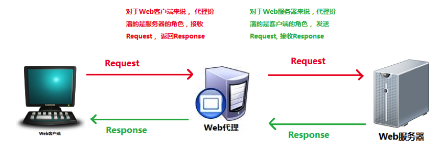

HTTP的代理服务器既是Web服务器又是Web客户端。一个完整的代理请求过程为：客户端首先与代理服务器创建连接，接着根据代理服务器所使用的代理协议，请求对目标服务器创建连接、或者获得目标服务器的指定资源，然后代理服务器再将拿到的资源返回给客户端。

可是，我们的请求为什么不直来直往，而要多此一举的通过代理服务器来转达呢？代理服务器的作用大大的，通过它可以实现多种功能：

## 1.1 共享IP地址

比如，某个局域网内有十台电脑需要上网，但是只分配了一个IP地址。这时候就可以将唯一的IP地址赋予代理服务器，通过NAT（Network Address Translation）协议，让十台电脑都能与外网连通。发送至外网的请求一律通过代理服务器转发，代理服务器收到回应时，再转发给内网的请求者。

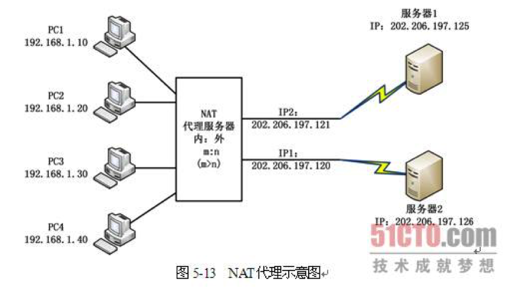

## 1.2 高速缓存

大部分代理服务器都具有缓存的功能，就好像一个大的Cache，它有很大的存储空间，它不断将新取得数据存储到它本地的存储器上，如果浏览器所请求的数据在它本机的存储器上已经存在而且是最新的，那么它就不重新从Web服务器取数据，而直接将存储器上的数据传给用户的浏览器，这样就能显著提高浏览速度。

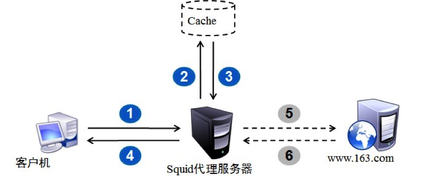

## 1.3 过滤器

外面的世界很精彩，外面的世界也很危险。有了代理服务器，妈妈再也不用担心我的安全。

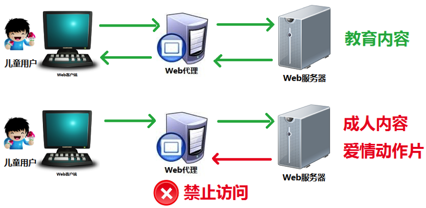

如果把天朝的整个网络看做一个超大的局域网，我们只要访问境外的网站，都会经过一个代理服务器，就是备受“欢迎”的“长城防火墙”，也称“中国国家防火墙”，用于自动审查和过滤监控。这么看来，最担心我们安全的还得说是祖国母亲。

## 1.4 突破自身IP的访问限制

道高一尺，魔高一丈。代理服务器是矛是盾，看你怎么用。
所谓的中国多媒体公众信息网和教育网都是独立的大型国家级局域网，是与国际互联网隔绝的。出于各种需要，某些集团或个人在两网之间开设了代理服务器，借助这些代理服务器的地址，就可以利访问国外网站，俗称翻墙。

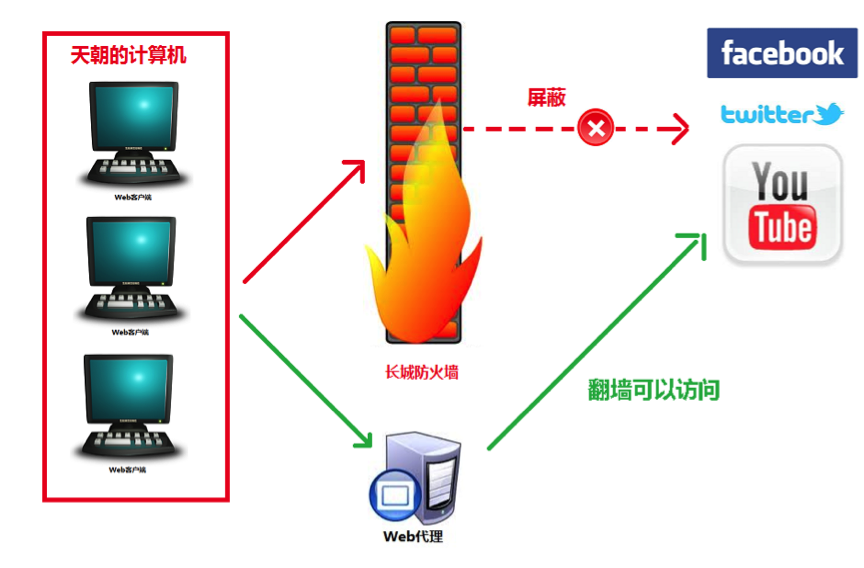

注意，正向代理与Nginx一毛钱关系都没有，以上内容只是为了引出反向代理的概念。

# 2、 反向代理

正向代理是代理客户端来向Internet发送请求，而反向代理是代理服务端来接受Internet上的请求。

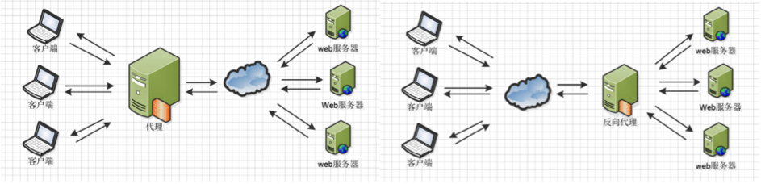

正向代理中，proxy和client同属一个LAN，对server透明； 反向代理中，proxy和server同属一个LAN，对client透明。 实际上proxy在两种代理中做的事都是代为收发请求和响应，不过从结构上来看正好左右互换了下。

再用两个例子来比较一下正向代理与反向代理的区别。

- 正向代理

A同学在大众创业、万众创新的大时代背景下开启他的创业之路，目前他遇到的最大的一个问题就是启动资金，于是他决定去找马云爸爸借钱，可想而知，最后碰一鼻子灰回来了，情急之下，他想到一个办法，找关系开后门，经过一番消息打探，原来A同学的大学老师王老师是马云的同学，于是A同学找到王老师，托王老师帮忙去马云那借500万过来，当然最后事成了。不过马云并不知道这钱是A同学借的，马云是借给王老师的，最后由王老师转交给A同学。这里的王老师在这个过程中扮演了一个非常关键的角色，就是代理，也可以说是正向代理，王老师代替A同学办这件事，这个过程中，真正借钱的人是谁，马云是不知道的，这点非常关键。

我们常说的代理也就是只正向代理，正向代理的过程，它隐藏了真实的请求客户端，服务端不知道真实的客户端是谁，客户端请求的服务都被代理服务器代替来请求，某些上网工具扮演的就是典型的正向代理角色。用浏览器访问 http://www.google.com 时，被残忍的block，于是你可以在国外搭建一台代理服务器，让代理帮我去请求google.com，代理把请求返回的相应结构再返回给我。

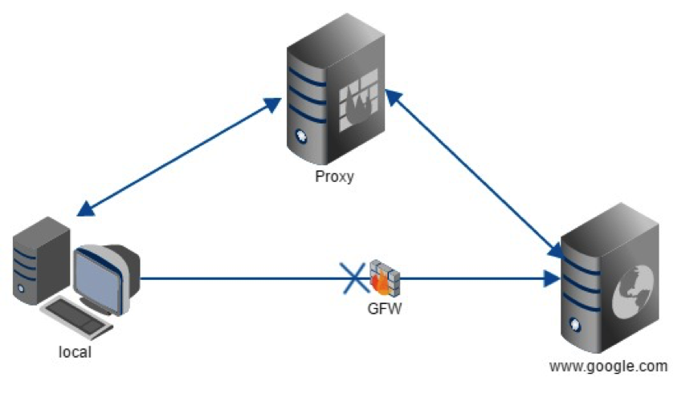

- 反向代理

大家都有过这样的经历，拨打10086客服电话，可能一个地区的10086客服有几个或者几十个，你永远都不需要关心在电话那头的是哪一个，叫什么，男的，还是女的，漂亮的还是帅气的，你都不关心，你关心的是你的问题能不能得到专业的解答，你只需要拨通了10086的总机号码，电话那头总会有人会回答你，只是有时慢有时快而已。那么这里的10086总机号码就是我们说的反向代理。客户不知道真正提供服务人的是谁。
反向代理隐藏了真实的服务端，当我们请求 www.baidu.com 的时候，就像拨打10086一样，背后可能有成千上万台服务器为我们服务，但具体是哪一台，你不知道，也不需要知道，你只需要知道反向代理服务器是谁就好了，www.baidu.com 就是我们的反向代理服务器，反向代理服务器会帮我们把请求转发到真实的服务器那里去。

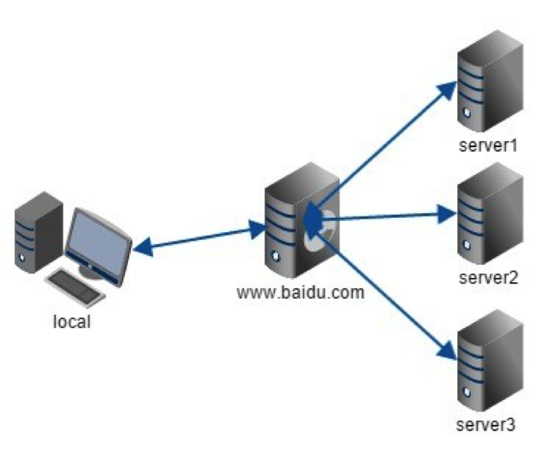

使用反向代理的优势有很多，比如，隐藏和保护服务器资源、负载均衡，缓存静态内容，加密和SSL加速等。

# 3、 Nginx的功能

Nginx的启动特别简单，并且几乎可以做到7*24不间断运行，即使运行数个月也不需要重新启动。还能够不间断服务的情况下进行软件版本的升级。

Nginx在做反向代理时，能够提供性能稳定并且灵活配置的转发功能。Nginx可以根据不同的正则匹配，采取不同的转发策略，比如图片文件结尾的走文件服务器，动态页面走web服务器。Nginx还对可以对返回结果进行异常判断，如果被分发的服务器存在异常，会将请求重新转发给另外一台服务器，然后自动去除异常服务器。

## 3.1 保护服务器

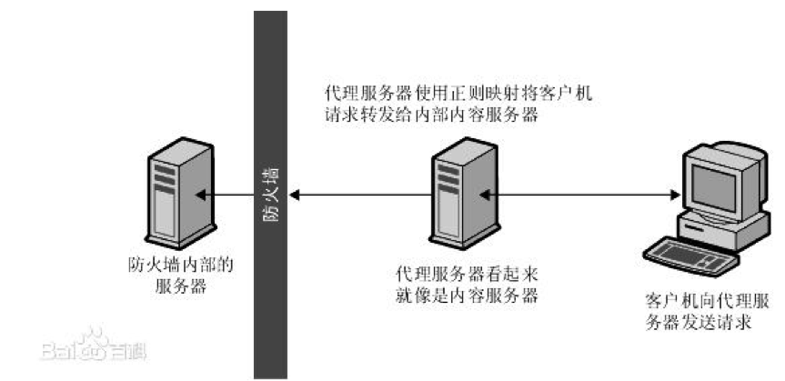

当客户机向站点提出请求时，请求将转到代理服务器。然后，代理服务器通过防火墙中的特定通路，将客户机的请求发送到内容服务器。内容服务器再通过该通道将结果回传给代理服务器。代理服务器将检索到的信息发送给客户机，好像代理服务器就是实际的内容服务器。如果内容服务器返回错误消息，代理服务器会先行截取该消息并更改标头中列出的任何 URL，然后再将消息发送给客户机。如此可防止外部客户机获取内部内容服务器的重定向URL。

这样，代理服务器就在安全数据库和可能的恶意攻击之间提供了又一道屏障。与有权访问整个数据库的情况相对比，就算是侥幸攻击成功，作恶者充其量也仅限于访问单个事务中所涉及的信息。未经授权的用户无法访问到真正的内容服务器，因为防火墙通路只允许代理服务器有权进行访问。

## 3.2负载均衡

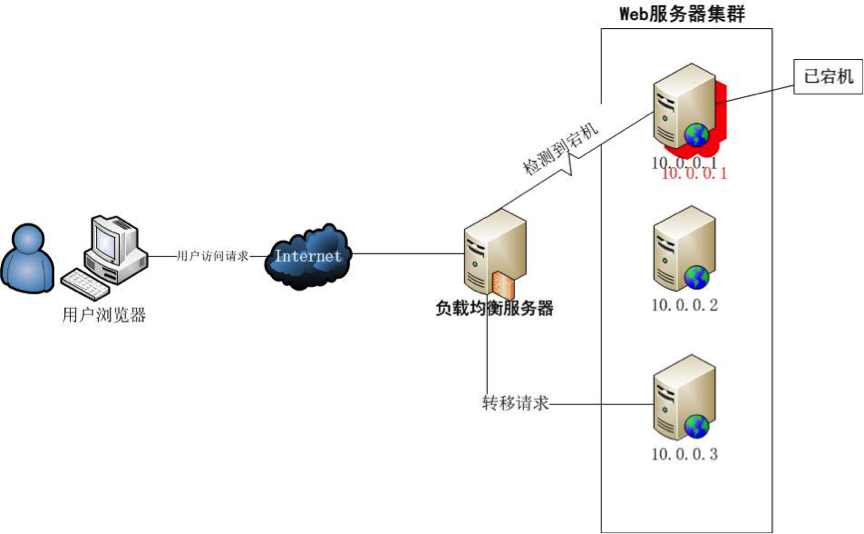

负载均衡服务器的作用是平衡集群中各个服务器的负载压力。

Nginx内置的负载均衡策略有3种：轮询，加权轮询，IP hash。同时支持扩展策略，完全可以自己写一套规则交给Nginx去执行。

- 轮询

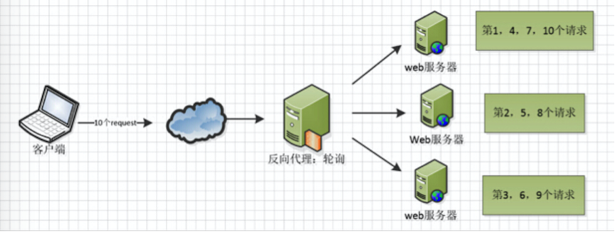

这种策略简单易行，将请求平均的分配给每个服务器去处理。

- 加权轮询

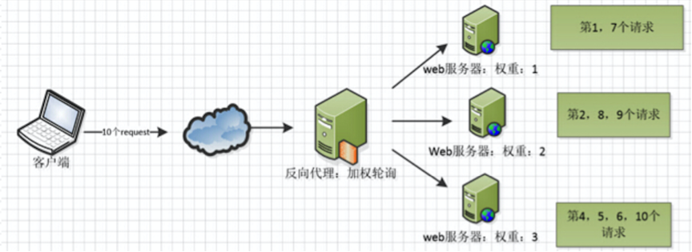

升级版的轮询策略，权重越大的服务器会被分配越多的请求数量。

- IP hash

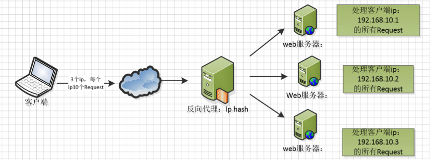

对客户端请求的IP进行hash操作，然后根据hash结果将同一个客户端IP的请求分发给同一台服务器进行处理，可以解决session不共享的问题。

## 3.3 web缓存

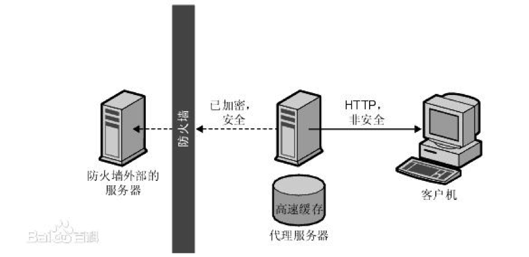

Nginx可以对不同的文件做不同的缓存处理，配置灵活，并且支持FastCGI_Cache，主要用于对FastCGI的动态程序进行缓存。配合着第三方的ngx_cache_purge，对制定的URL缓存内容可以的进行增删管理。