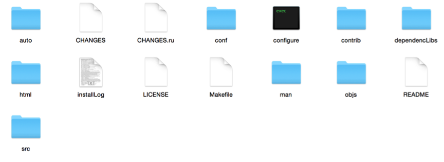
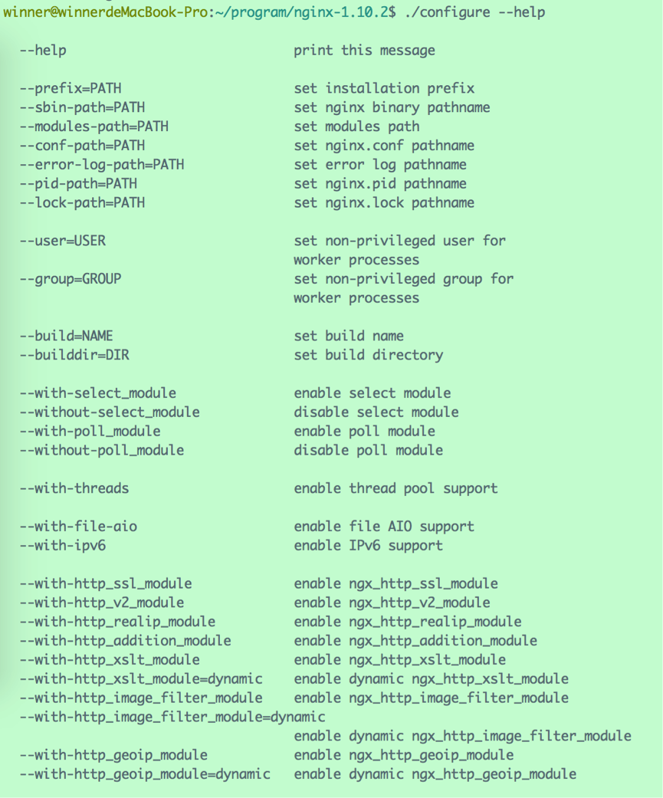
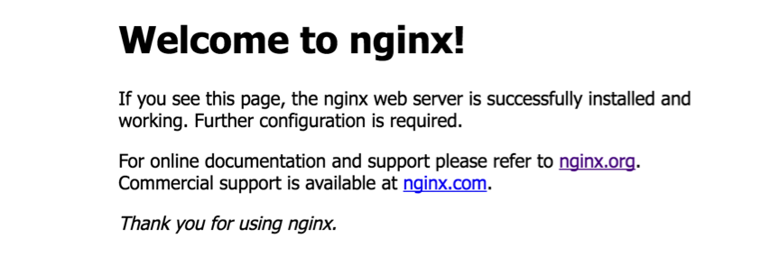
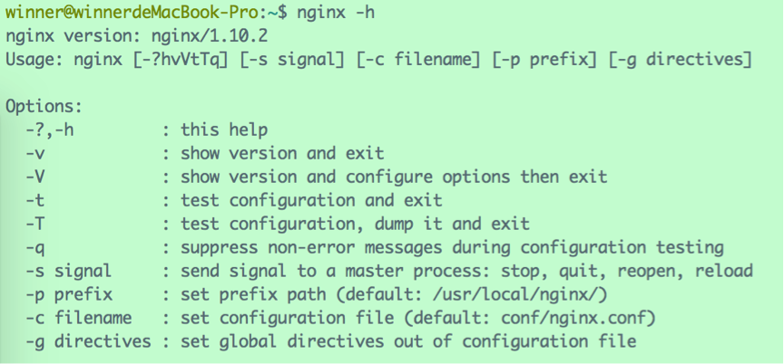

首先从官网上http://nginx.org/下载最新的stable version源码，当前最新版本为nginx-1.10.2.tar.gz。

# 1、 configure

解压之后，会发现里面有一个名为“configure”的文件：

configure本身是一个Shell脚本，中间会调用`<nginx-source-path>/auto/`目录下别的脚本执行各种任务。根据不同的用途，auto目录下面的脚本各司其职，有检查编译器版本的，有检查操作系统版本的，有检查标准库版本的，有检查模块依赖情况的，有关于安装的，有关于初始化的，有关于多线程检查的等等。configure作为一个总驱动，调用这些脚本去生成版本信息头文件、默认被包含的模块的声明代码和makefile文件，版本信息头文件和默认被包含的模块的声明代码被放置在新创建的objs目录下。

插段广告，先来普及一下有关makefile的知识。

一般来说，无论是C还是C++，首先要把源文件编译成中间代码文件，在Windows下也就是 .obj 文件，UNIX下是 .o 文件，即 Object File，这个动作叫做**编译**（compile），每个源文件都应该对应于一个中间目标文件（O文件或是OBJ文件）。然后再把大量的Object File合成执行文件，这个动作叫作**链接**（link）。

编译时，编译器需要保证语法的正确，函数与变量的正确。对于后者，通常是需要告诉编译器头文件的所在位置（头文件中应该只是声明，而定义应该放在C/C++文件中），只要所有的语法正确，编译器就可以编译出中间目标文件。

链接时，主要是链接函数和全局变量，所以，我们可以使用这些中间目标文件（O文件或是OBJ文件）来链接我们的应用程序。链接器并不管函数所在的源文件，只管函数的中间目标文件（Object File），在大多数时候，由于源文件太多，编译生成的中间目标文件太多，而在链接时需要明显地指出中间目标文件名，这对于编译很不方便，所以，我们要给中间目标文件打个包，在Windows下这种包叫“库文件”（Library File），也就是 .lib 文件，在UNIX下，是Archive File，也就是 .a 文件。

总结一下，源文件首先会生成中间目标文件，再由中间目标文件生成执行文件。在编译时，编译器只检测程序语法，和函数、变量是否被声明。如果函数未被声明，编译器会给出一个警告，但可以生成Object File。而在链接程序时，链接器会在所有的Object File中找寻函数的实现，如果找不到，那到就会报链接错误（Linker Error）。

Linux下的make命令用于编译源代码，但是它执行之前需要一个 makefile 文件以告诉它需要怎么样去编译和链接程序。

广告完毕，继续来说Nginx。

由于我们下载下来的是源码，需要编译后才能安装。在编译安装Nginx之前，我们需要使用configure命令做大量“幕后”工作，包括检测操作系统内核和已经安装的软件，参数解析，中间目录生成以及根据各种参数生成的.c文件、makefile文件等。

所以，第一步需要运行configure脚本，该命令可以携带多种参数，使用`configure --help`查看参数列表：

例如：

- `--prefix=<path>`：指定Nginx安装路径，默认为` /usr/local/nginx`。
- `--sbin-path=<path>` ：指定Nginx可执行文件安装路径，默认为`<prefix>/sbin/nginx`。
- `--conf-path=<path>` ：指定配置文件路径，默认为`<prefix>/conf/nginx.conf`。
- `--pid-path=<path>` ：指定pid文件路径，默认为 `<prefix>/logs/nginx.pid`。

**注意**，Nginx的一些模块需要依赖其他lib库，如果系统没有安装，运行configure命令的时候会报这样的错误：

> ./configure: error: the HTTP rewrite module requires the PCRE library.You can either disable the module by using --without-http_rewrite_module option, or install the PCRE library into the system, or build the PCRE library statically from the source with nginx by using --with-pcre=<path> option.

一般需要提前安装三个lib库：

- rewrite模块依赖的**PCRE库**
  PCRE(Perl Compatible Regular Expressions)是一个Perl库，包括 perl 兼容的正则表达式库。Rewrite 主要的功能就是实现URL的重写，Nginx的Rewrite依赖PCRE库来实现正则匹配。
- gzip模块依赖的 **zlib 库**
  我们在Linux中经常会用到后缀为“.gz”的文件，它们就是gzip格式的。现今已经成为Internet 上使用非常普遍的一种数据压缩格式，或者说一种文件格式。
  HTTP协议上的GZIP编码是一种用来改进WEB应用程序性能的技术。大流量的WEB站点常常使用GZIP压缩技术来让用户感受更快的速度。这一般是指WWW服务器中安装的一个功能，当有人来访问这个服务器中的网站时，服务器就将网页内容压缩后传输到来访的电脑浏览器中显示出来。一般对纯文本内容可压缩到原大小的40%。
  zlib是一个通用的压缩开源库，提供了在内存中压缩和解压的函数，包括对解压后数据的校验。Nginx依赖zlib库来实现gzip格式的数据压缩。
- ssl 模块依赖的**openssl库**
  SSL是Secure Sockets Layer（安全套接层协议）的缩写，可以在Internet上提供秘密性传输。OpenSSL 是一个安全套接字层密码库，囊括主要的密码算法、常用的密钥和证书封装管理功能及SSL协议。
  Nginx依赖openssl库实现https安全连接等方面的功能。

# 2、make && make install

make是Linux下的编译命令，它根据makefile文件中描述的规则来自动进行编译。

make install是Linux下的安装命令。

可以直接输入`make && make install`一并完成编译与安装操作。默认的安装路径为`/usr/local/nginx`。

安装完毕后，输入`nginx -v`如果出现如下的版本信息，证明安装成功：

> nginx version: nginx/1.10.2

使用`nginx`命令启动Nginx，浏览器输入`127.0.0.1:80`，会看到Nginx的默认页面：

# 3、常用命令

使用`nginx -h`可列出所有可使用的命令列表： 

常用命令如下：

- nginx
  启动Nginx，可以利用“-c”参数指定要使用的配置文件。
- nginx –s stop
  停止Nginx，等效于“nginx –s quit”。“-s”代表采用向 Nginx 发送信号。注：stop是快速停止nginx，可能并不保存相关信息；quit是完整有序的停止nginx，并保存相关信息。
- nginx –s reload
  重载配置，修改配置文件后需要使用该命令使之生效。
- nginx –v
  查看Nginx的版本信息。
- nginx –t
  检查配置文件是否正确。
- nginx –c filename
  指定配置文件的路径为“filename”。默认路径为“conf/nginx.conf”
- nginx -g
  临时指定一些全局配置项，以使新的配置项生效，例如：`nginx -g "pid /var/nginx/test.pid"`，意味着会把pid文件写到/var/nginx/test.pid中。

`-g`参数的约束条件是指定的配置项不能与默认路径下的nginx.conf中的配置项相冲突，否则无法启动。就像上例那样，类似这样的配置项：`pid logs/nginx.pid`，是不能存在于默认的nginx.conf中的。

另一个约束条件是，以`-g`方式启动的Nginx服务执行其他命令行时，需要把`-g`参数也带上，否则可能出现配置项不匹配的情形。例如，如果要停止Nginx服务，那么需要执行下面代码：

`nginx -g "pid /var/nginx/test.pid;" -s stop` 

如果不带上`-g "pid /var/nginx/test.pid;"`，那么找不到pid文件，也会出现无法停止服务的情况。