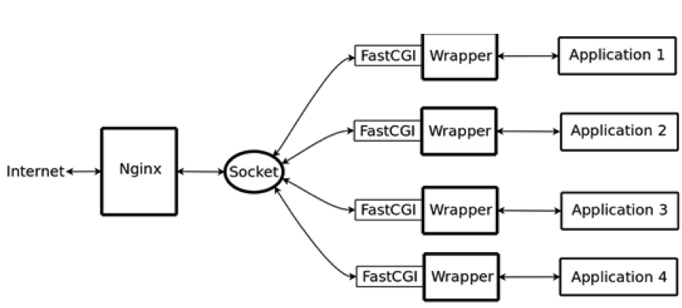

一个简单的配置文件如下：

```
#定义Nginx运行的用户及用户组
user  userName  userGroupName;

#工作进程数目，根据硬件调整，通常等于CPU数量或者2倍于CPU
worker_processes  1;

#错误日志路径与级别，级别选项：debug|info|notice|warn|error|crit|alert|emerg
error_log  logs/error.log debug;

#pid（进程标识符）存放路径
pid  logs/nginx.pid;

events {

    #每个工作进程的最大连接数量
    worker_connections  1024;

    #连接超时时间,这里指的是http层面的keep-alive并非tcp的keepalive
    keepalive_timeout  60;

    #指定IO模型，linux建议epoll，FreeBSD建议采用kqueue，window下不指定
    use  epoll;

}

#设置http服务器
http {

    #文件扩展名与文件类型映射表
    include  mime.types;

    #默认文件类型
    default_type  text/html;

    #日志格式设置,main为日志格式的名称可在后文中引用
    log_format  main  '$remote_addr - $remote_user [$time_local] "$request" '
                      '$status $body_bytes_sent "$http_referer" '
                      '"$http_user_agent" "$http_x_forwarded_for"';

    #访问日志路径、格式    
    access_log  logs/access.log  main;        
    

    #sendfile指令指定 nginx 是否调用sendfile 函数（zero copy 方式）来输出文件，对于普通应用，必须设为on。    
    #如果用来进行下载等应用磁盘IO重负载应用，可设置为off，以平衡磁盘与网络IO处理速度，降低系统uptime。    
    sendfile  on;   

    #允许或禁止使用socket的TCP_CORK的选项，此选项仅在使用sendfile的时候使用    
    tcp_nopush  on;    

    #超时时间    
    keepalive_timeout  65;    

    #是否开启gzip压缩    
    #gzip  on;

    #虚拟主机配置，下可以有多个location用来表示不同的反向代理        
    server {	
   
    	#监听端口        
			listen       80;			

			#主机名，默认为本机        
			server_name  127.0.0.1;	 

			#编码       
			charset utf-8;	

			#访问日志        
			access_log  logs/host.access.log  main;	

			#根路径“/” 的访问规则         
			location / {	
      
				#网站根目录            
				root   html;	    
	    
				#默认网页            
				index  index.html index.htm index.php;        
			}


			#发生404错误时跳转到/404.html页面        
			error_page  404  /404.html;

			#配置名为“static_file_server”的主机，按照权重负载均衡
			upstream static_file_server {
				server 192.168.2.1:8080 weight=1;
				server 192.168.2.2:8080 weight=2;
				server 192.168.2.3:8080 weight=3;     
    	}

			#正则表达式，配置以“.js”、“.css”结尾的路径的访问规则
			location ~ .*\.(js|css)?$ {

				#将该类请求转发至static_file_server
				proxy_pass  http://static_file_server/

				#设置浏览器缓存过期时间	    
				expires  600;
        
				#关闭重定向	    
				proxy_redirect  off;	    
	    
				#以下三行，目的是将代理服务器收到的用户的信息传到真实服务器上	    
				proxy_set_header  Host $host;	    
        proxy_set_header  X-Real-IP $remote_addr;	    
	    	proxy_set_header  X-Forwarded-For $proxy_add_x_forwarded_for;

		    #拒绝的ip
				deny  127.0.0.1; 

		    #允许的ip 
        allow  172.18.5.54;  
			}
		}
}
```

# 1、 内置变量

在log_format配置项当中，使用了很多Nginx的内置变量，一些变量代表了客户端请求头部的一些字段，如：`$http_user_agent`, `$http_cookie`等等，由于这些变量会在请求中定义，所以可能无法保证他们是存在的或者说可以定义到一些别的地方（例如遵循一定的规范）。

常用变量如下：

| **变量名**             | **说明**                                                     |
| ---------------------- | ------------------------------------------------------------ |
| **$args**              | 请求行中的参数，同**$query_string**                          |
| **$content_length**    | 请求头中的Content-length字段                                 |
| **$content_type**      | 请求头中的Content-Type字段                                   |
| **$document_root**     | 当前请求在root指令中指定的值                                 |
| **$document_uri**      | 不带请求参数的当前URI，不包含主机名，同**$uri**              |
| **$host**              | 请求中的主机头字段，如果请求中的主机头不可用，则为服务器处理请求的服务器名称 |
| **$http_user_agent**   | 客户浏览器信息                                               |
| **$http_cookie**       | 客户端cookie信息                                             |
| **$remote_addr**       | 客户端的IP地址                                               |
| **$remote_port**       | 客户端的端口                                                 |
| **$remote_user**       | 经过Auth Basic Module验证的用户名                            |
| **$request_file_name** | 当前请求的文件路径，由root或alias指令与URI请求生成           |
| **$request_method**    | 这个变量是客户端请求的动作，通常为GET或POST                  |
| **$request_uri**       | 包含请求参数的原始URI，不包含主机名                          |
| **$server_addr**       | 服务器地址                                                   |
| **$server_name**       | 服务器名称                                                   |
| **$server_port**       | 请求到达服务器的端口号                                       |
| **$server_protocol**   | 请求使用的协议，通常是HTTP/1.0或HTTP/1.1                     |
| **$scheme**            | HTTP方法（如http，https）                                    |


例如，对于URL：http://localhost:88/test1/test2/test.php

- **$host**：localhost
- **$server_port**：88
- **$request_uri**：http://localhost:88/test1/test2/test.php
- **$document_uri**：/test1/test2/test.php
- **$document_root**：/var/www/html
- **$request_filename**：/var/www/html/test1/test2/test.php

# 2、 负载均衡配置

**upstream**用于配置负载均衡。Nginx的upstream目前支持4种方式的分配：

- **轮询（默认）**

每个请求按时间顺序逐一分配到不同的后端服务器，如果后端服务器down掉，能自动剔除。

- **weight**

指定轮询几率，weight和访问比率成正比，用于后端服务器性能不均的情况。

例如：

```s
upstream bakend {
	server 192.168.0.14 weight=10;
	server 192.168.0.15 weight=10;
}
```

-  **ip_hash**

每个请求按访问ip的hash结果分配，这样每个访客固定访问一个后端服务器，可以解决session的问题。

例如：

```
upstream bakend {
	ip_hash;
	server 192.168.0.14:88;
	server 192.168.0.15:80;
}
```

- **fair（第三方）**

按后端服务器的响应时间来分配请求，响应时间短的优先分配。

```
upstream backend {
	server server1;
	server server2;
	fair;
}
```

- **url_hash（第三方）**

按访问url的hash结果来分配请求，使每个url定向到同一个后端服务器，后端服务器为缓存时比较有效。

例：在upstream中加入hash语句，server语句中不能写入weight等其他的参数，hash_method是使用的hash算法

```
upstream backend {
	server squid1:3128;
	server squid2:3128;
	hash $request_uri;
	hash_method crc32;
}
```

此外，在负载机器的IP可以附带状态参数，例如

```
upstream bakend{
  ip_hash;
  server 127.0.0.1:9090 down;
  server 127.0.0.1:8080 weight=2;
  server 127.0.0.1:6060;
  server 127.0.0.1:7070 backup;
}
```

每个设备的状态设置为:

- down：表示单前的server暂时不参与负载
- weight：该值越大，负载的权重就越大。
- backup：其它所有的非backup机器down或者忙的时候，请求backup机器。所以这台机器压力会最轻。

# 3、 正则匹配

正则匹配规则：

- `=`开头表示精确匹配

- `^~` 开头表示uri以某个常规字符串开头，不是正则匹配

- `~` 开头表示区分大小写的正则匹配

- `~*` 开头表示不区分大小写的正则匹配

- `$`结尾表示以某字符串结尾的正则匹配

- `!~`和`!~`分别为区分大小写不匹配及不区分大小写不匹配 的正则

- `/` 通用匹配，任何请求都会匹配到

看几个实例：

```
location = / {
 \#通用匹配, 如果没有其它匹配,任何请求都会匹配到
 [ configuration A ] 
}

location / {
 \# 因为所有的地址都以 / 开头，所以这条规则将匹配到所有请求
 \# 但是正则和最长字符串会优先匹配
 [ configuration B ] 
}
 
location /documents/ {
 \# 匹配任何以 /documents/ 开头的地址，匹配符合以后，还要继续往下搜索
 \# 只有后面的正则表达式没有匹配到时，这一条才会采用这一条
 [ configuration C ] 
}
 
location ~ /documents/Abc {
 \# 匹配任何以 /documents/ 开头的地址，匹配符合以后，还要继续往下搜索
 \# 只有后面的正则表达式没有匹配到时，这一条才会采用这一条
 [ configuration CC ] 
} 

location ^~ /images/ {
 \# 匹配任何以 /images/ 开头的地址，匹配符合以后，停止往下搜索正则，采用这一条。
 [ configuration D ] 
} 

location ~* \.(gif|jpg|jpeg)$ {
 \# 匹配所有以 gif,jpg或jpeg 结尾的请求
 \# 然而，所有请求 /images/ 下的图片会被 config D 处理，因为 ^~ 到达不了这一条正则
 [ configuration E ] 
} 

location /images/ {
 \# 字符匹配到 /images/，继续往下，会发现 ^~ 存在
 [ configuration F ] 
}

location /images/abc {
 \# 最长字符匹配到 /images/abc，继续往下，会发现 ^~ 存在
 \# F与G的放置顺序是没有关系的
 [ configuration G ] 
} 

location ~ /images/abc/ {
 \# 只有去掉 config D 才有效：先最长匹配 config G 开头的地址，继续往下搜索，匹配到这一条正则，采用
  [ configuration H ] 
}
```

配置的优先级遵循以下规则：

> (location =) > (location 完整路径) > (location ^~ 路径) > (location ~,~* 正则顺序) > (location 部分起始路径) > (/)

上面的匹配结果 按照上面的location写法，以下的匹配示例成立：

- `/` -> config A：精确完全匹配，即使/index.html也匹配不了
- `/downloads/download.html` -> config B：匹配B以后，往下没有任何匹配，采用B
- `/images/1.gif` -> configuration D：匹配到F，往下匹配到D，停止往下
- `/images/abc/def` -> config D：最长匹配到G，往下匹配D，停止往下。你可以看到 任何以/images/开头的都会匹配到D并停止，FG写在这里是没有任何意义的，H是永远轮不到的，这里只是为了说明匹配顺序
- `/documents/document.html` -> config C：匹配到C，往下没有任何匹配，采用C
- `/documents/1.jpg` -> configuration E：匹配到C，往下正则匹配到E
- `/documents/Abc.jpg` -> config CC：最长匹配到C，往下正则顺序匹配到CC，不会往下到E

 

所以实际使用中，有三个匹配规则定义可作参考：

- 规则1

直接匹配网站根，通过域名访问网站首页比较频繁，使用这个会加速处理，官网如是说。这里是直接转发给后端应用服务器了，也可以是一个静态首页

```
location = / {
  proxy_pass http://tomcat:8080/index
}
```

- 规则2

处理静态文件请求是nginx作为http服务器的强项，有两种配置模式，目录匹配或后缀匹配，任选其一或搭配使用：

```
location ^~ /static/ {
  root /webroot/static/;
}

location ~* \.(gif|jpg|jpeg|png|css|js|ico)$ {
  root /webroot/res/;
}
```

- 规则3

通用规则，用来转发动态请求到后端应用服务器，非静态文件请求就默认是动态请求，自己根据实际把握

```
location / {
  proxy_pass http://tomcat:8080/
}
```

# 4、 rewrite配置

rewrite功能就是，使用nginx提供的全局变量或自己设置的变量，结合正则表达式和标志位实现url重写以及重定向。rewrite只能放在`server{}`,`location{}`,`if{}`中，并且只能对域名后边的除传递参数外的字符串起作用，例如 http://seanlook.com/a/we/index.php?id=1&u=str 只对/a/we/index.php重写。语法:

``rewrite regex replacement [flag]`

如果想对域名或参数字符串起作用，可以使用全局变量匹配，也可以使用proxy_pass反向代理。

表面看rewrite和location功能有点像，都能实现跳转，主要区别在于**rewrite是在同一域名内更改获取资源的路径**，而location是对一类路径做控制访问或反向代理，可以proxy_pass到其他机器。很多情况下rewrite也会写在location里，它们的执行顺序是：

- 执行server块的rewrite指令

- 执行location匹配

- 执行选定的location中的rewrite指令


如果其中某步URI被重写，则重新循环执行1-3，直到找到真实存在的文件；循环超过10次，则返回500 Internal Server Error错误。

 

flag标志位用法如下：

- last : 相当于Apache的[L]标记，表示完成rewrite

- break : 停止执行当前虚拟主机的后续rewrite指令集

- redirect : 返回302临时重定向，地址栏会显示跳转后的地址

- permanent : 返回301永久重定向，地址栏会显示跳转后的地址


因为301和302不能简单的只返回状态码，还必须有重定向的URL，这就是return指令无法返回301,302的原因了。这里 last 和 break 区别有点难以理解：last一般写在server和if中，而break一般使用在location中； last不终止重写后的url匹配，即新的url会再从server走一遍匹配流程，而break终止重写后的匹配；break和last都能组织继续执行后面的rewrite指令。

 

还有一个if指令，非常有用，语法为

```
if(condition){
	...
}
```

对给定的条件condition进行判断。如果为真，大括号内的rewrite指令将被执行，if条件(conditon)可以是如下任何内容：

- 当表达式只是一个变量时，如果值为空或任何以0开头的字符串都会当做false

- 直接比较变量和内容时，使用=或!=

- ~正则表达式匹配，~*不区分大小写的匹配，!~区分大小写的不匹配
  - -f和!-f用来判断是否存在文件
  - -d和!-d用来判断是否存在目录
  - -e和!-e用来判断是否存在文件或目录
  - -x和!-x用来判断文件是否可执行

 

例如：

```
if ($http_user_agent ~ MSIE) {
  rewrite ^(.*)$ /msie/$1 break;
} //如果UA包含"MSIE"，rewrite请求到/msid/目录下

if ($http_cookie ~* "id=([^;]+)(?:;|$)") {
  set $id $1;
 } //如果cookie匹配正则，设置变量$id等于正则引用部分

if ($request_method = POST) {
  return 405;
} //如果提交方法为POST，则返回状态405（Method not allowed）。return不能返回301,302
 
if ($slow) {
  limit_rate 10k;
} //限速，$slow可以通过 set 指令设置

if (!-f $request_filename){
  break;
  proxy_pass http://127.0.0.1; 
} //如果请求的文件名不存在，则反向代理到localhost 。这里的break也是停止rewrite检查

if ($args ~ post=140){
  rewrite ^ http://example.com/ permanent;
} //如果query string中包含"post=140"，永久重定向到example.com

location ~* \.(gif|jpg|png|swf|flv)$ {
  valid_referers none blocked www.jefflei.com www.leizhenfang.com;
  if ($invalid_referer) {
    return 404;
  } //防盗链
}
```

#  5、FastCGI配置

Nginx本身是不支持对外部程序的直接调用或者解析，所有的外部程序（包括PHP）必须通过**FastCGI接口**来调用。FastCGI接口在Linux下是socket，（这个socket可以是文件socket，也可以是ip socket）。为了调用CGI程序，还需要一个FastCGI的wrapper（wrapper可以理解为用于启动另一个程序的程序），这个wrapper绑定在某个固定socket上，如端口或者文件socket。当Nginx将CGI请求发送给这个socket的时候，通过FastCGI接口，wrapper接纳到请求，然后派生出一个新的线程，这个线程调用解释器或者外部程序处理脚本并读取返回数据；接着，wrapper再将返回的数据通过FastCGI接口，沿着固定的socket传递给Nginx；最后，Nginx将返回的数据发送给客户端。



以下为Nginx支持PHP的配置示例：

```
location ~ \.php$ {

  root      html;

  fastcgi_pass  127.0.0.1:9000;

  fastcgi_index index.php;

  fastcgi_param SCRIPT_FILENAME /scripts$fastcgi_script_name;

  include    fastcgi_params;

}
```

通过location指令，将所有以php为后缀的文件都交给127.0.0.1:9000来处理，而这里的IP地址和端口就是FastCGI进程监听的IP地址和端口。 fastcgi_param指令指定放置PHP动态程序的主目录，也就是$fastcgi_script_name前面指定的路径，建议将这个目录与Nginx虚拟主机指定的根目录保持一致，当然也可以不一致。 fastcgi_params文件是FastCGI进程的一个参数配置文件，在安装Nginx后，会默认生成一个这样的文件，这里通过include指令将FastCGI参数配置文件包含了进来。


