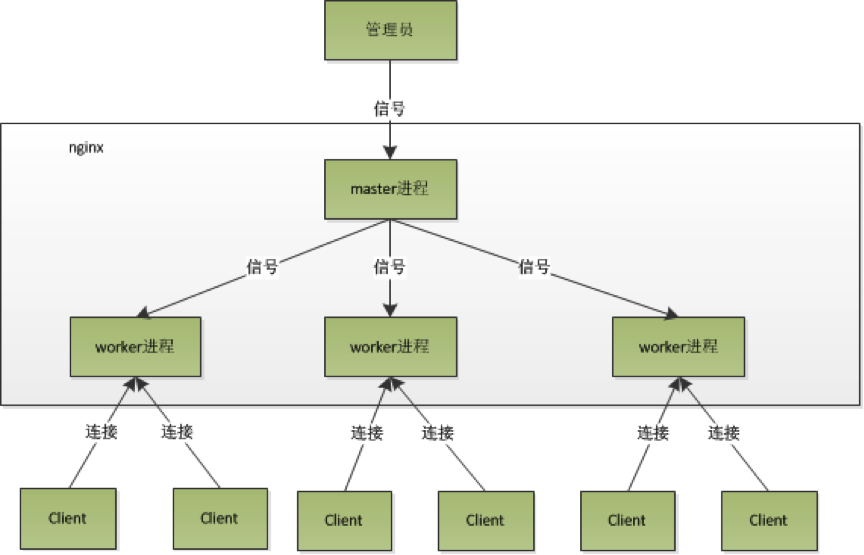
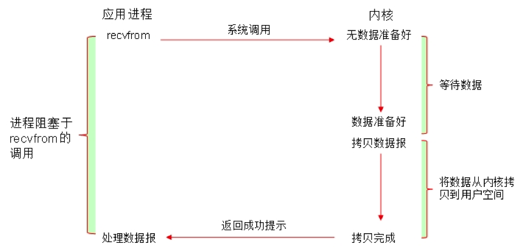
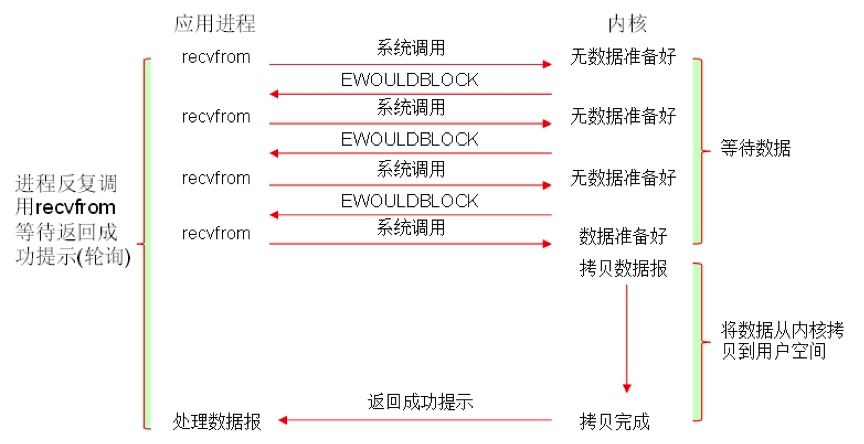
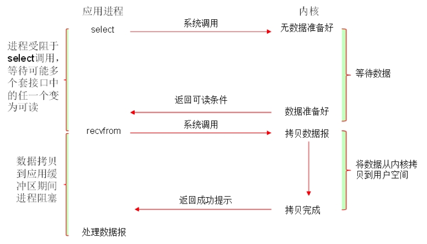
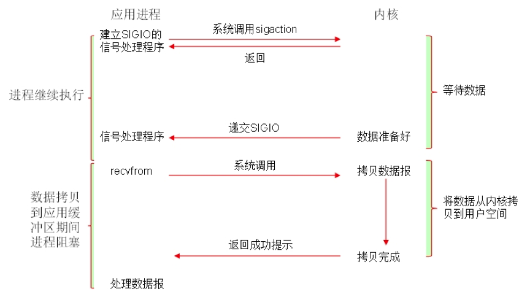
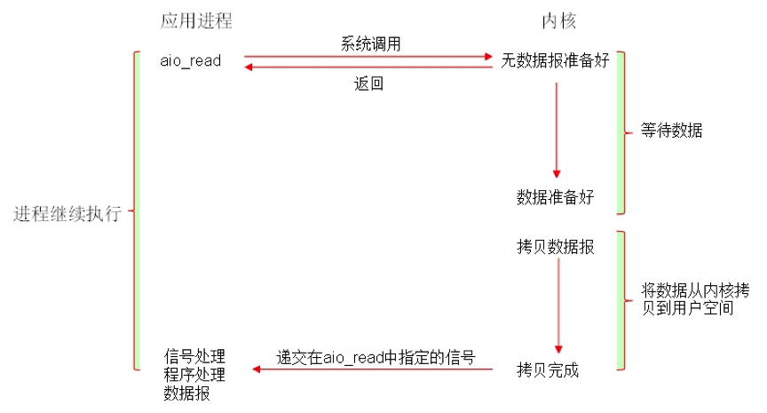

众所周知，nginx性能高，而nginx的高性能与其架构是分不开的

# 1、 进程模型

Nginx在启动后，会有一个master进程和多个worker进程。master进程主要用来管理worker进程，包含：接收来自外界的信号，向各worker进程发送信号，监控worker进程的运行状态，当worker进程退出后(异常情况下)，会自动重新启动新的worker进程。而基本的网络事件，则是放在worker进程中来处理了。多个worker进程之间是对等的，他们同等竞争来自客户端的请求，各进程互相之间是独立的。一个请求，只可能在一个worker进程中处理，一个worker进程，不可能处理其它进程的请求。worker进程的个数是可以设置的，一般我们会设置与机器cpu核数一致，这里面的原因与nginx的进程模型以及事件处理模型是分不开的。nginx的进程模型，可以由下图来表示：

master进程会接收来自外界发来的信号，再根据信号做不同的事情。所以我们要控制nginx，只需要向master进程发送信号就行了。比如kill -HUP pid，则是告诉nginx，从容地重启nginx，我们一般用这个信号来重启nginx（等效于高级命令：nginx -s reload），或重新加载配置，因为是从容地重启，因此服务是不中断的。master进程在接收到HUP信号后是怎么做的呢？首先master进程在接到信号后，会先重新加载配置文件，然后再启动新的worker进程，并向所有老的worker进程发送信号，告诉他们可以光荣退休了。新的worker在启动后，就开始接收新的请求，而老的worker在收到来自master的信号后，就不再接收新的请求，并且在当前进程中的所有未处理完的请求处理完成后，再退出。

worker进程之间是平等的，每个进程，处理请求的机会也是一样的。当我们提供80端口的http服务时，一个连接请求过来，每个进程都有可能处理这个连接。首先，每个worker进程都是从master进程fork过来，在master进程里面，先建立好需要listen的socket（listenfd）之后，然后再fork出多个worker进程。所有worker进程的listenfd会在新连接到来时变得可读，为保证只有一个进程处理该连接，所有worker进程在注册listenfd读事件前抢accept_mutex，抢到互斥锁的那个进程注册listenfd读事件，在读事件里调用accept接受该连接。当一个worker进程在accept这个连接之后，就开始读取请求，解析请求，处理请求，产生数据后，再返回给客户端，最后才断开连接，这样一个完整的请求就是这样的了。我们可以看到，一个请求，完全由worker进程来处理，而且只在一个worker进程中处理。

Nginx采用这种进程模型有很多好处。首先，对于每个worker进程来说，独立的进程，不需要加锁，所以省掉了锁带来的开销，同时在编程以及问题查找时，也会方便很多。其次，采用独立的进程，可以让互相之间不会影响，一个进程退出后，其它进程还在工作，服务不会中断，master进程则很快启动新的worker进程。

# 2、 事件模型

所谓的**同步和异步**关注的是消息通知机制：

- 同步：调用发出不会立即返回，但一旦返回就可以返回最终结果；
- 异步：调用发出之后，被调用方立即返回消息，但返回的非最终结果；被调用者通过状态、通知机制来通知调者，或通过回调函数来处理结果；

 

所谓的**阻塞和非阻塞**关注的是调用等等调用结果（消息、返回值）时的状态：

- 阻塞：调用结果返回之前，调用者（调用线程）会被挂起；调用者只有在得到结果之后才会返回；
- 非阻塞：调用结果返回之前，调用不会阻塞当前线程；

## 

常见的五种I/O模型如下：

- 阻塞型IO [blocking IO]

- 非阻塞型IO [nonblocking IO]

- 复用型IO [IO multiplexing] (slect，poll复用器) 

- 信号驱动型IO [signal driven IO] (epoll)

- 异步IO [asyncrhonous IO] 

  

可以举一个简单的例子来说明Apache的工作流程，我们平时去餐厅吃饭。餐厅的工作模式是一个服务员全程服务客户，流程是这样，服务员在门口等候客人(listen)，客人到了就接待安排的餐桌上(accept)，等着客户点菜(request uri)，去厨房叫师傅下单做菜（磁盘I/O），等待厨房做好（read），然后给客人上菜(send)，整个下来服务员(进程)很多地方是阻塞的。这样客人一多（HTTP请求一多），餐厅只能通过叫更多的服务员来服务（fork进程），但是由于餐厅资源是有限的（CPU），一旦服务员太多管理成本很高（CPU上下文切换），这样就进入一个瓶颈。

再来看看Nginx得怎么处理？餐厅门口挂个门铃（注册epoll模型的listen），一旦有客人（HTTP请求）到达，派一个服务员去接待（accept），之后服务员就去忙其他事情了（比如再去接待客人），等这位客人点好餐就叫服务员（数据到了read()），服务员过来拿走菜单到厨房（磁盘I/O），服务员又做其他事情去了，等厨房做好了菜也喊服务员（磁盘I/O结束），服务员再给客人上菜（send()），厨房做好一个菜就给客人上一个，中间服务员可以去干其他事情。整个过程被切分成很多个阶段，每个阶段都有相应的服务模块。我们想想，这样一旦客人多了，餐厅也能招待更多的人。

事件驱动其实是很老的技术，早期的select、poll都是如此。后来基于内核通知的更高级事件机制出现，如libevent里的epoll，使事件驱动性能得以提高。事件驱动的本质还是IO事件，应用程序在多个IO句柄间快速切换，实现所谓的异步IO。事件驱动服务器，最适合做的就是这种IO密集型工作，如反向代理，它在客户端与WEB服务器之间起一个数据中转作用，纯粹是IO操作，自身并不涉及到复杂计算。反向代理用事件驱动来做，显然更好，一个工作进程就可以run了，没有进程、线程管理的开销，CPU、内存消耗都小。

 

有人可能要问了，nginx采用多worker的方式来处理请求，每个worker里面只有一个主线程，那能够处理的并发数很有限啊，多少个worker就能处理多少个并发，何来高并发呢？

进程数与并发数不存在很直接的关系，这取决取server采用的工作方式。如果一个server采用一个进程负责一个request的方式，那么进程数就是并发数。那么显而易见的，就是会有很多进程在等待中。等什么？ webserver刚好属于网络io密集型应用，不算是计算密集型，最多的应该是等待网络传输。

而nginx 的异步非阻塞工作方式正是利用了这点等待的时间。在需要等待的时候，这些进程就空闲出来待命了。因此表现为少数几个进程就解决了大量的并发问题。

nginx是如何利用的呢，简单来说：同样的4个进程，如果采用一个进程负责一个request的方式，那么，同时进来4个request之后，每个进程就负责其中一个，直至会话关闭。期间，如果有第5个request进来了。就无法及时反应了，因为4个进程都没干完活呢，因此，一般有个调度进程，每当新进来了一个request，就新开个进程来处理。

nginx不这样，每进来一个request，会有一个worker进程去处理。但不是全程的处理，处理到什么程度呢？处理到可能发生阻塞的地方，比如向上游（后端）服务器转发request，并等待请求返回。那么，这个处理的worker不会这么傻等着，他会在发送完请求后，注册一个事件：“如果upstream返回了，告诉我一声，我再接着干”。于是他就休息去了。此时，如果再有request 进来，他就可以很快再按这种方式处理。而一旦上游服务器返回了，就会触发这个事件，worker才会来接手，这个request才会接着往下走。

由于web server的工作性质决定了每个request的大部份生命都是在网络传输中，实际上花费在server机器上的时间片不多。这是几个进程就解决高并发的秘密所在。

Nginx采用epoll模型，异步非阻塞。对于Nginx来说，把一个完整的连接请求处理都划分成了事件，一个一个的事件。比如accept（）， recv（），磁盘I/O，send（）等，每部分都有相应的模块去处理，一个完整的请求可能是由几百个模块去处理。真正核心的就是事件收集和分发模块，这就是管理所有模块的核心。只有核心模块的调度才能让对应的模块占用CPU资源，从而处理请求。拿一个HTTP请求来说，首先在事件收集分发模块注册感兴趣的监听事件，注册好之后不阻塞直接返回，接下来就不需要再管了，等待有连接来了内核会通知你(epoll的轮询会告诉进程)，cpu就可以处理其他事情去了。一旦有请求来，那么对整个请求分配相应的上下文（其实已经预先分配好），这时候再注册新的感兴趣的事件(read函数)，同样客户端数据来了内核会自动通知进程可以去读数据了，读了数据之后就是解析，解析完后去磁盘找资源（I/O），一旦I/O完成会通知进程，进程开始给客户端发回数据send()，这时候也不是阻塞的，调用后就等内核发回通知发送的结果就行。整个下来把一个请求分成了很多个阶段，每个阶段都到很多模块去注册，然后处理，都是异步非阻塞。异步这里指的就是做一个事情，不需要等返回结果，做好了会自动通知你。

想想apache的常用工作方式，每个请求会独占一个工作线程，当并发数上到几千时，就同时有几千的线程在处理请求了。这对操作系统来说，是个不小的挑战，线程带来的内存占用非常大，线程的上下文切换带来的cpu开销很大，自然性能就上不去了，而这些开销完全是没有意义的。

为什么nginx可以采用异步非阻塞的方式来处理呢，或者异步非阻塞到底是怎么回事呢？

我们先回到原点，看看一个请求的完整过程。首先，请求过来，要建立连接，然后再接收数据，接收数据后，再发送数据。具体到系统底层，就是读写事件，而当读写事件没有准备好时，必然不可操作，如果不用非阻塞的方式来调用，那就得阻塞调用了，事件没有准备好，那就只能等了，等事件准备好了，你再继续吧。阻塞调用会进入内核等待，cpu就会让出去给别人用了，对单线程的worker来说，显然不合适，当网络事件越多时，大家都在等待呢，cpu空闲下来没人用，cpu利用率自然上不去了，更别谈高并发了。好吧，你说加进程数，这跟apache的线程模型有什么区别，注意，别增加无谓的上下文切换。所以，在nginx里面，最忌讳阻塞的系统调用了。不要阻塞，那就非阻塞喽。非阻塞就是，事件没有准备好，马上返回EAGAIN，告诉你，事件还没准备好呢，你慌什么，过会再来吧。好吧，你过一会，再来检查一下事件，直到事件准备好了为止，在这期间，你就可以先去做其它事情，然后再来看看事件好了没。虽然不阻塞了，但你得不时地过来检查一下事件的状态，你可以做更多的事情了，但带来的开销也是不小的。所以，才会有了异步非阻塞的事件处理机制，具体到系统调用就是像select/poll/epoll/kqueue这样的系统调用。它们提供了一种机制，让你可以同时监控多个事件，调用他们是阻塞的，但可以设置超时时间，在超时时间之内，如果有事件准备好了，就返回。这种机制正好解决了我们上面的两个问题，拿epoll为例，当事件没准备好时，放到epoll里面，事件准备好了，我们就去读写，当读写返回EAGAIN时，我们将它再次加入到epoll里面。这样，只要有事件准备好了，我们就去处理它，只有当所有事件都没准备好时，才在epoll里面等着。这样，我们就可以并发处理大量的并发了，当然，这里的并发请求，是指未处理完的请求，线程只有一个，所以同时能处理的请求当然只有一个了，只是在请求间进行不断地切换而已，切换也是因为异步事件未准备好，而主动让出的。这里的切换是没有任何代价，可以理解为循环处理多个准备好的事件，事实上就是这样的。与多线程相比，这种事件处理方式是有很大的优势的，不需要创建线程，每个请求占用的内存也很少，没有上下文切换，事件处理非常的轻量级。并发数再多也不会导致无谓的资源浪费（上下文切换）。更多的并发数，只是会占用更多的内存而已。现在的网络服务器基本都采用这种方式，这也是nginx性能高效的主要原因。

之前说过，推荐设置worker的个数为cpu的核数，在这里就很容易理解了，更多的worker数，只会导致进程来竞争cpu资源了，从而带来不必要的上下文切换。而且，nginx为了更好的利用多核特性，提供了cpu亲缘性的绑定选项，我们可以将某一个进程绑定在某一个核上，这样就不会因为进程的切换带来cache的失效。像这种小的优化在nginx中非常常见，同时也说明了nginx作者的苦心孤诣。比如，nginx在做4个字节的字符串比较时，会将4个字符转换成一个int型，再作比较，以减少cpu的指令数等等。

异步，非阻塞，使用epoll和大量细节处的优化，是使Nginx脱颖而出的技术基石。

# 3、 select模型与epoll模型

epoll是**多路复用IO**(I/O Multiplexing)中的一种方式，但是仅用于linux2.6以上内核，在开始讨论这个问题之前，先来解释一下为什么需要多路复用IO。

以一个生活中的例子来解释。

假设你在大学中读书，要等待一个朋友来访，而这个朋友只知道你在A号楼，但是不知道你具体住在哪里，于是你们约好了在A号楼门口见面。

如果你使用的阻塞IO模型来处理这个问题，那么你就只能一直守候在A号楼门口等待朋友的到来，在这段时间里你不能做别的事情，不难知道，这种方式的效率是低下的。

现在时代变化了，开始使用多路复用IO模型来处理这个问题.你告诉你的朋友来了A号楼找楼管大妈，让她告诉你该怎么走.这里的楼管大妈扮演的就是多路复用IO的角色。

进一步解释select和epoll模型的差异。

select版大妈做的是如下的事情：比如同学甲的朋友来了，select版大妈比较笨，她带着朋友挨个房间进行查询谁是同学甲，你等的朋友来了，于是在实际的代码中，select版大妈做的是以下的事情:

epoll版大妈就比较先进了，她记下了同学甲的信息，比如说他的房间号，那么等同学甲的朋友到来时，只需要告诉该朋友同学甲在哪个房间即可，不用自己亲自带着人满大楼的找人了。

别小看了这些效率的提高，在一个大规模并发的服务器中，轮询IO是最耗时间的操作之一.再回到那个例子中，如果每到来一个朋友楼管大妈都要全楼的查询同学，那么处理的效率必然就低下了，过不久楼底就有不少的人了。

对比最早给出的阻塞IO的处理模型， 可以看到采用了多路复用IO之后， 程序可以自由的进行自己除了IO操作之外的工作， 只有到IO状态发生变化的时候由多路复用IO进行通知， 然后再采取相应的操作， 而不用一直阻塞等待IO状态发生变化了。

select的特点：select 选择句柄的时候，是遍历所有句柄，也就是说句柄有事件响应时，select需要遍历所有句柄才能获取到哪些句柄有事件通知，因此效率是非常低。但是如果连接很少的情况下， select和epoll的LT触发模式相比， 性能上差别不大。

这里要多说一句，select支持的句柄数是有限制的， 同时只支持1024个，这个是句柄集合限制的，如果超过这个限制，很可能导致溢出，而且非常不容易发现问题， 当然可以通过修改linux的socket内核调整这个参数。

epoll的特点：epoll对于句柄事件的选择不是遍历的，是事件响应的，就是句柄上事件来就马上选择出来，不需要遍历整个句柄链表，因此效率非常高，内核将句柄用红黑树保存的。