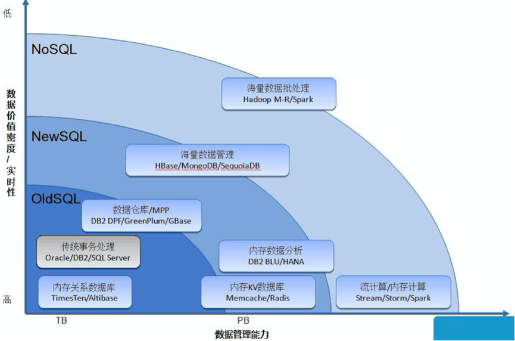
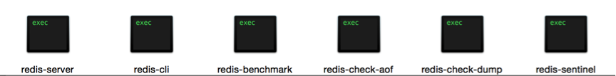
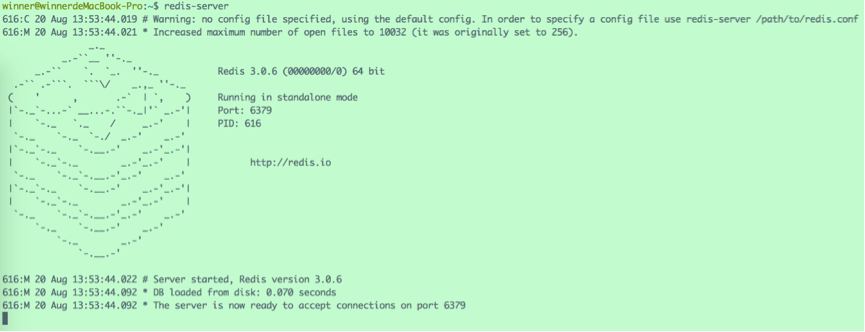
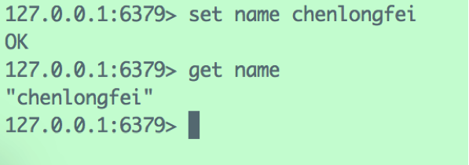
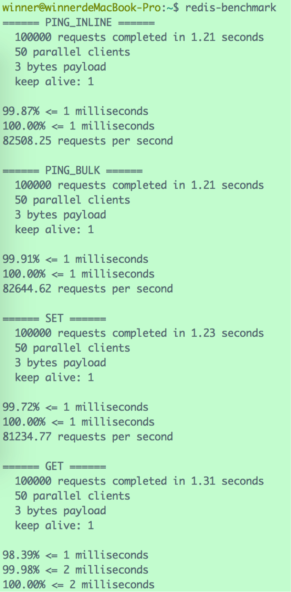

# 1、概述

我们知道，内存是电脑主板上的存储部件，用于存储当前正在使用的数据和程序，CPU可以与内存直接沟通，所以访问速速非常高；而外存数据必须加载到内存以后程序才能使用。如果把CPU当做一个吃货，那么内存是碗，而外存是锅，这个吃货再能吃，也得先把饭从锅里盛到碗里再下嘴，而不能直接跳到锅里大快朵颐。但是很多时候CPU吃的并不爽，一是因为碗不够大，没吃两嘴就没了；二是从锅里往碗里盛饭是个比较耗时的过程，等待很痛苦。正经点说，就是内存大小、I/O速度、网络响应时间等常常成为应用系统的性能瓶颈。

传统的关系型数据库如MySQL、Oracle、DB2等，数据存储在磁盘的文件系统中，增删改查需要频繁地在内存与外存之间交换数据，很费时间。试想，如果有一种小巧而功能强大的存储结构，用于**在内存中管理数据量不太大但是访问量特别大的热点数据**，岂不妙哉？

在以上背景下，Redis应运而生。

Redis是**Re**mote **Di**ctionary **S**erver的简称，是一个由意大利人Salvatore Sanfilippo开发的key-value存储系统，具有极高的读写性能，读的速度可达110000次/s，写的速度可达81000次/s 。

与Redis类似的产品还有memcache，同样是一个基于内存的key-value存储系统，但是由于memcache数据结构单一，数据安全性低下等原因，大有被Redis取而代之的趋势。

Redis 与其他 key - value 缓存产品相比，有以下特点：

- Redis支持数据的持久化，周期性的把更新的数据写入磁盘或者把修改操作写入追加的记录文件，重启的时候可以再次加载进行使用。
- Redis不仅仅支持简单的key-value类型的数据，同时还提供list，set，zset，hash等数据结构的存储。
- Redis支持数据的备份，即master-slave模式的数据备份。
- Redis的所有操作都是原子性的，同时Redis还支持对几个操作合并后的原子性执行。
- Redis还支持 publish/subscribe, 通知, key过期等高级特性。

互联网发展到现在，仅靠传统的关系型数据库已经远不能应对各种变态的需求，一个大型的互联网应用往往需要各类数据库相互合作，才能达到高可用、高性能的标准。

比如，使用MySQL/Oracle/DB2管理核心数据，使用Memcache/Redis管理热点数据，使用Hbase/Hadoop管理海量数据……总之，在合适的地方选择合适的数据库。

# 2、Redis管理工具

Redis安装好之后，进入安装目录的src文件夹，会发现里面有6个可执行文件：

它们对应着6个管理Redis的工具：

## 2.1 redis-server

该工具用于启动Redis服务器，处理与客户端的对话，一个服务器可以与多个客户端连接。

在终端输入该命令，如果启动成功，就会看到Redis那幅标志性的图片：

Redis提示说：

> *Warning: no config file specified, using the default config. In order to specify a config file use Redis-server /path/to/Redis.conf*

没有指定配置文件，当前使用的是默认配置。假如想使用位于路径“/winner/setting/”下的redis.conf作为配置文件，使用命令`redis-server /winner/setting/redis.conf`即可。

最后一行，Redis提示服务器已经准备好在端口6379接受客户端的连接，**6379是Redis的默认端口**。

至于为什么使用6379当做默认端口还有段传闻。写Redis的大神Antirez是意大利人，在意大利有个歌女名为Alessia Merz，长期以来被Antirez及其朋友当作愚蠢的代名词，MERZ对应的手机按键就是6379，后来Antirez开发Redis时就使用这四个数字来当做默认端口。

## 2.2 redis-cli

该工具用于启动Redis客户端，发起与服务器的对话。可以使用参数来指定目标服务器的详细信息，例如使用参数“-h”指定服务器IP地址、“-p”指定服务器端口、“-a”指定登录密码等，如：

`redis-cli –h 192.168.1.2 –p 6300` 

如不指定任何参数，则默认连接127.0.0.1的6379端口。

与Redis服务器取得连接后，就通过指令进行数据的存取、更改等操作了：

## 2.3 redis-benchmark

该工具用于测试Redis在本机的性能，类似于鲁大师的跑分程序。运行之后会得到一组数据存取效率的报告：

## 2.4 redis-check-aof

Redis虽然是基于内存的数据库，但是会创建并更新在硬盘上的备份，备份有两种方式，一个是把内存的数据导入dump.rdb文件中，另一中就是将每个执行过的命令记录到AOF文件中。

该工具用于检查、修复AOF文件。

## 2.5 redis-check-dump

与Redis-check-aof类似，该工具用于检查dump.rdb文件。

## 2.6 redis-sentinel

该工具提供Redis实例的监控管理、通知和实例失效备援服务，是Redis集群的管理工具，监控各个其他节点的工作情况并且进行故障恢复，来提高集群的高可用性。