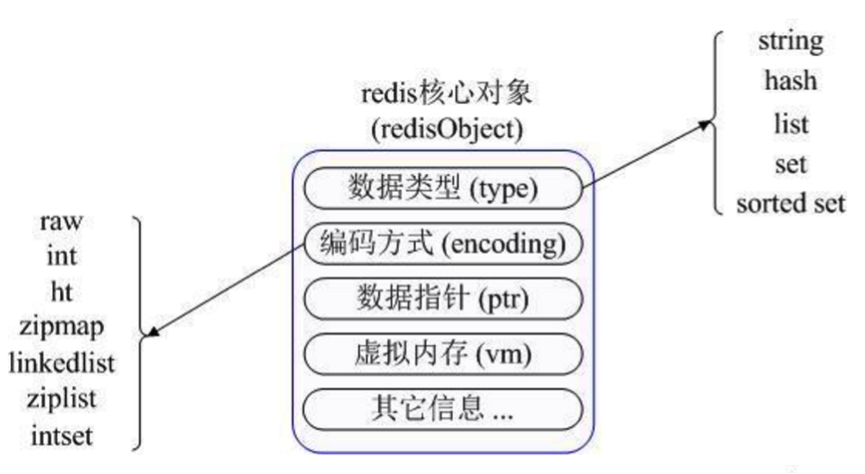
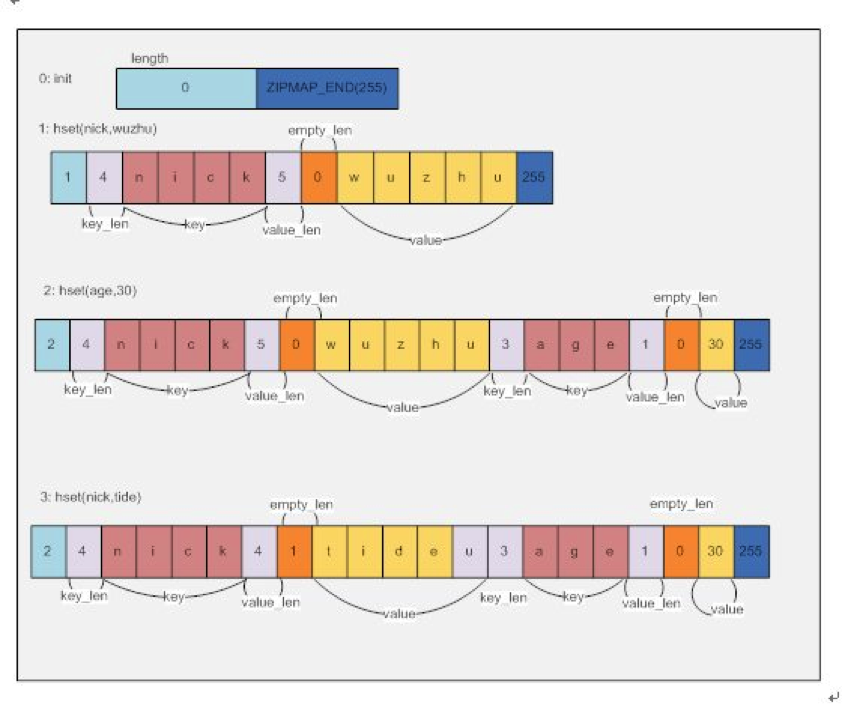
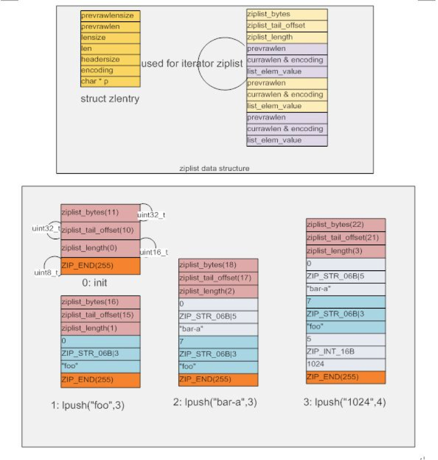
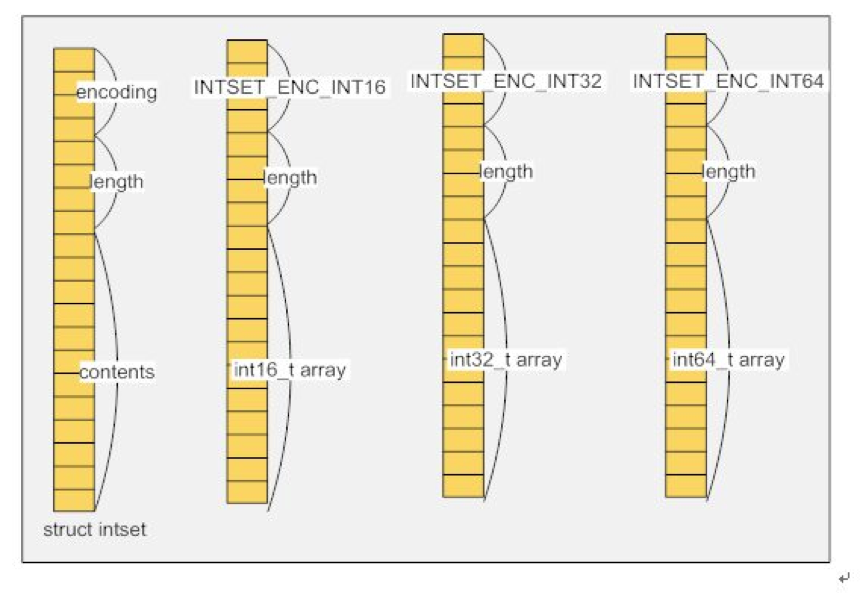
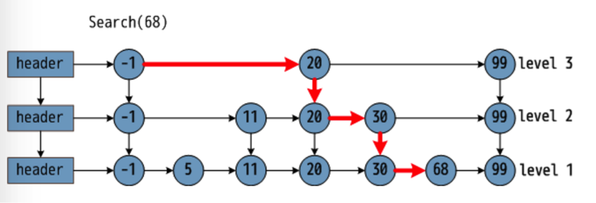

Redis支持五中数据类型：

- String（字符串）
- Hash（哈希）
- List（列表）
- Set（集合）
- zset(sorted set：有序集合)

Redis定义了丰富的原语命令，可以直接与Redis服务器交互。实际应用中，我们不太会直接使用这些原语命令，Redis提供了Java，C/C++，C#，PHP，JavaScript，Perl，Object-C，Python，Ruby，Erlang等客户端，大多情况下我们是通过各式各样的客户端来操作Redis。但是，任何语言的客户端实际上都是对Redis原语命令的封装，了解原语命令有助于理解客户端的设计原理，知其然，知其所以然。

# 1、字符串

String是Redis最基本的数据类型，结构为一个key对应一个value。

String类型是二进制安全的，意味着可以包含任何数据，比如jpg图片或者序列化的对象。

String类型的最大能存储512M。

 

不像Linux有那么多充满想象力的命令，还喜欢带一对莫名其妙的参数。Redis的原语命令很简单，而且有规律可循，一句话概括，就是干净利索脆。

比如我们想设置往Redis中存放一个用户名，用String类型存储：

> *127.0.0.1:6379> **SET name chenlongfei***
>
> *OK* 

“OK”是Redis返回的响应，代表设置成功。

取出这个name的值：

> *127.0.0.1:6379> **GET name***
>
> *"chenlongfei"* 

想修改name的值为“clf”，重新SET一遍，覆盖掉原来的值：

> *127.0.0.1:6379> **SET name clf***
>
> *OK*
>
> *127.0.0.1:6379> **GET name***
>
> *"clf"* 

想删除该条数据：

> *127.0.0.1:6379> **DEL name***
>
> *(integer) 1  --该数字代表影响的记录总数*
>
> *127.0.0.1:6379> **GET name***
>
> *(nil)   --nil代表为空，不存在该对象*

增删改查命令一分钟学会，想忘记都难，妈妈再也不用担心我的学习。

 

| **命令格式**                       | **说明**                                                     |
| ---------------------------------- | ------------------------------------------------------------ |
| **SET** key value                  | 设置指定 key 的值                                            |
| **GET** key                        | 获取指定 key 的值                                            |
| **SETNX** key value                | （**Set** if **N**ot E**x**ist）只有在 key 不存在时设置 key 的值 |
| **SETRANGE** key offset value      | 用 value 参数覆写给定 key 所储存的字符串值，从偏移量 offset 开始 |
| **GETRANGE** key start end         | 返回 key 中字符串值的子字符                                  |
| **GETSET** key value               | 将给定 key 的值设为 value ，并返回 key 的旧值                |
| **MSET** key value [key value ...] | （**M**ulti **Set**）同时设置一个或多个 key-value 对         |
| **MGET** key1 [key2..]             | 获取所有(一个或多个)给定 key 的值                            |
| **APPEND** key value               | 如果 key 已经存在并且是一个字符串， APPEND 命令将 value 追加到 key 原来的值的末尾 |
| **SETEX** key seconds value        | （**Set Ex**pire）将值 value 关联到  key ，并将 key 的过期时间设为 seconds (以秒为单位) |
| **PSETEX** key milliseconds value  | （**P**recise **Set Ex**pire）这个命令和 SETEX 命令相似，但它以毫秒为单位设置 key 的生存时间，而不是像 SETEX 命令那样，以秒为单位 |
| **STRLEN** key                     | 返回 key 所储存的字符串值的长度                              |
| **INCR** key                       | 将 key 中储存的数字值增一，前提是value是一个数字             |
| **INCRBY** key increment           | 将 key 所储存的值加上给定的增量值，前提是value是一个数字     |
| **INCRBYFLOAT** key increment      | 将 key 所储存的值加上给定的浮点增量值，前提是value是一个数字 |
| **DECR** key                       | 将 key 中储存的数字值减一，前提是value是一个数字             |
| **DECRBY** key decrement           | key 所储存的值减去给定的减量值，前提是value是一个数字        |

# 2、哈希

Redis的哈希是field和value之间的映射，即键值对的集合，所以特别适合用于存储对象。

Redis 中每个 hash 最多可以存储 2^32 - 1 键值对（40多亿）。

 

例如，我们想在Redis中存储一个用户信息，包括用户ID，用户名，邮箱地址三个字段：

> *127.0.0.1:6379>**HMSET user_1 userId 123 userName clf email chenlongfei@163.com***
>
> *OK*
>
> *127.0.0.1:6379> **HGETALL user_1***
>
> *1) "userId"*
>
> *2) "123"*
>
> *3) "userName"*
>
> *4) "clf"*
>
> *5) "email"*
>
> *6) "chenlongfei@163.com"*

 

| **命令格式**                                    | **说明**                                                     |
| ----------------------------------------------- | ------------------------------------------------------------ |
| **HMSET** key field1 value1 [field2 value2... ] | （**H**ash **M**ulti **Set**）同时将多个  field-value 对设置到哈希表 key 中 |
| **HMGET** key field1 [field2...]                | 获取所有给定字段的值                                         |
| **HSET** key field value                        | 将哈希表 key 中的字段 field 的值设为 value                   |
| **HGET** key field                              | 获取存储在哈希表中指定字段的值                               |
| **HGETALL** key                                 | 获取在哈希表中指定 key 的所有字段和值                        |
| **HDEL** key field2 [field2]                    | 删除一个或多个哈希表字段                                     |
| **HSETNX** key field value                      | 只有在字段 field 不存在时，设置哈希表字段的值                |
| **HKEYS** key                                   | 获取所有哈希表中的字段                                       |
| **HVALS** key                                   | 获取哈希表中所有值                                           |
| **HEXISTS** key field                           | 查看哈希表 key 中，指定的字段是否存在                        |
| **HLEN** key                                    | 获取哈希表中字段的数量                                       |
| **HINCRBY** key field increment                 | 为哈希表 key 中的指定字段的整数值加上增量                    |
| **HINCRBYFLOAT** key field increment            | 为哈希表 key 中的指定字段的浮点数值加上增量                  |

# 3、列表

Redis列表是简单的字符串列表，按照插入顺序排序。支持添加一个元素到列表头部（左边）或者尾部（右边）的操作。

一个列表最多可以包含 2^32 - 1 ，即超过40亿个元素。

 

例如，我们想用一个名为“Continents”的列表盛放五大洲的名字：

> *127.0.0.1:6379> **LPUSH Continents Asia Africa America Oceania Antarctica***
>
> *(integer) 5*
>
> *127.0.0.1:6379> **LRANGE Continents 0 4** --获取下标为0~4的元素*
>
> *1) "Antarctica"*
>
> *2) "Oceania"*
>
> *3) "America"*
>
> *4) "Africa"*
>
> *5) "Asia"*

 

Redis列表虽然名为列表，其实从特性上来讲更像是栈，以最近放进去的元素为头，以最早放进去的元素为尾，所以，Redis列表的下标呈倒序排列。上例中依次放进去的五个元素：Asia、Africa、America、Oceania、Antarctica，下标分别为4、3、2、1、0。这与Java中List的概念完全不一样，需要特别注意。

与栈类似，当执行POP操作时，Redis列表弹出的是最新放进去的元素，类似于栈顶元素。

Redis列表还支持一种**阻塞式操作**，比如BLPOP（**B**lockd **L**ist **Pop**之缩写），移出并获取列表的第一个元素，如果列表没有元素（或列表不存在）会阻塞列表直到等待超时或发现可弹出元素为止。

例如，我们对一个不存在的列表“myList”执行BLPOP命令：

> BLPOP myList 20 -- 弹出myList列表的第一个元素，如果没有，阻塞20秒

该客户端会进入阻塞状态，如果20秒之内该列表存入了元素，则弹出：

> 127.0.0.1:6379> **BLPOP myList 20** --若无元素则进入阻塞状态，限时20秒*
>
> *1) "myList"*
>
> *2) "hello"*
>
> *(6.20s)*

如果超时后仍然没有等到元素，则结束阻塞，返回nil：

> *127.0.0.1:6379> **BLPOP myList 20***
>
> *(nil)*
>
> *(20.07s)*

 

| **命令格式**                                        | **说明**                                                     |
| --------------------------------------------------- | ------------------------------------------------------------ |
| **LPUSH** key value1 [value2...]                    | 将一个或多个值插入到列表头部                                 |
| **LPOP** key                                        | 移出并获取列表的第一个元素                                   |
| **LPUSHX** key value                                | （**L**ist **Push** if e**x**ist）将一个或多个值插入到已存在的列表头部 |
| **LINDEX** key index                                | 通过索引获取列表中的元素                                     |
| **LRANGE** key start stop                           | 获取列表指定范围内的元素                                     |
| **LSET** key index value                            | 通过索引设置列表元素的值                                     |
| **LTRIM** key start stop                            | 只保留指定区间内的元素，不在指定区间之内的元素都将被删除     |
| **RPOP key**                                        | （**R**ear **Pop**）移除并获取列表最后一个元素               |
| **RPUSH** key value1 [value2...]                    | 将一个或多个值插入到列表尾部                                 |
| **RPUSHX** key value                                | 将一个或多个值插入到已存在的列表尾部                         |
| **LREM** key count value                            | 从列表中删除字段值为value的元素，删除count的绝对值个value后结束，count > 0 从表头删除；count < 0 从表尾删除；count=0 全部删除 |
| **RPOPLPUSH** source destination                    | 移除列表的最后一个元素，并将该元素添加到另一个列表并返回     |
| **BLPOP** key1 [key2... ] timeout                   | 移出并获取列表的第一个元素，  如果列表没有元素会阻塞列表直到等待超时或发现可弹出元素为止，如果timeout为0则一直等待下去 |
| **BRPOP** key1 [key2... ] timeout                   | 移出并获取列表的最后一个元素，  如果列表没有元素会阻塞列表直到等待超时或发现可弹出元素为止，如果timeout为0则一直等待下去 |
| **LINSERT** key **BEFORE** \| **AFTER** pivot value | 在key 列表中寻找pivot，并在pivot值之前\|之后插入value        |
| **LLEN** key                                        | 获取列表长度                                                 |

# 4、集合

Redis集合是String类型的无序集合。**集合成员是唯一的**，这就意味着集合中不能出现重复的数据。

Redis集合是通过哈希表实现的，所以添加，删除，查找的复杂度都是O(1)。

集合中最大的成员数为 2^32 - 1 ，即每个集合最多可存储40多亿个成员。

 

集合的一大特点就是不能有重复元素，如果插入重复元素，Redis会忽略该操作：

*127.0.0.1:6379> **SADD direction east west south north***

*(integer) 4*

*127.0.0.1:6379> **SMEMBERS direction***

> *1) "west"*
>
> *2) "east"*
>
> *3) "north"*
>
> *4) "south"*
>
> *127.0.0.1:6379> **SADD direction east***
>
> *(integer) 0 -- east元素已经存在，该操作无效*
>
> *127.0.0.1:6379> **SMEMBERS direction***
>
> *1) "west"*
>
> *2) "east"*
>
> *3) "north"*
>
> *4) "south"*

 

Redis集合还有两大特点，一是支持随机获取元素，二是支持集合间的取差集、交集与并集操作。

| **命令格式**                             | **说明**                                                     |
| ---------------------------------------- | ------------------------------------------------------------ |
| **SADD** key member1 [member2…]          | 向集合添加一个或多个成员                                     |
| **SREM** key member1 [member2…]          | 移除集合中一个或多个成员                                     |
| **SPOP** key                             | 移除并返回集合中的一个随机元素                               |
| **SMEMBERS** key                         | 返回集合中的所有成员                                         |
| **SRANDMEMBER** key [count]              | 返回集合中count个随机元素，如count为空，则只返回一个         |
| **SCARD** key                            | （**S**et **Card**inality）返回集合中的元素总数              |
| **SISMEMBER** key member                 | 判membe元素是否是集key 的成员                                |
| **SMOVE** source destination member      | 将member元素从source集合移动到destination集合                |
| **SDIFF** key1 [key2…]                   | 返回给定所有集合的差集，即以key1为基准，返回key1有且[key2...]没有的元素 |
| **SDIFFSTORE** destination key1 [key2…]  | 返回给定所有集合的差集并存储在destination中                  |
| **SINTER** key1 [key2…]                  | 返回给定所有集合的交集                                       |
| **SINTERSTORE** destination key1 [key2…] | 返回给定所有集合的交集并存储在destination中                  |
| **SUNION** key1 [key2…]                  | 返回所有给定集合的并集                                       |
| **SUNIONSTORE** destination key1 [key2…] | 所有给定集合的并集存储在destination集合中                    |

# 5、有序列表

Redis 有序集合和集合一样也是String类型元素的集合，且不允许重复的成员。

不同的是每个元素都会关联一个double类型的分数。Redis正是通过分数来为集合中的成员进行从小到大的排序。有序集合的成员是唯一的，但分数(score)却可以重复。

集合是通过哈希表实现的，所以添加，删除，查找的复杂度都是O(1)。 

集合中最大的成员数为 2^32 - 1 ，即每个集合最多可存储40多亿个成员。

 

例如，、使用有序列表来存储学生的成绩单：

> *127.0.0.1:6379> **ZADD scoreList 82 Tom***
>
> *(integer) 1*
>
> *127.0.0.1:6379> **ZADD scoreList 65.5 Jack***
>
> *(integer) 1*
>
> *127.0.0.1:6379> **ZADD scoreList 43.5 Rubby***
>
> *(integer) 1*
>
> *127.0.0.1:6379> **ZADD scoreList 99 Winner***
>
> *(integer) 1*
>
> *127.0.0.1:6379> **ZADD scoreList 78 Linda***
>
> *(integer) 1*
>
> *127.0.0.1:6379> **ZRANGE scoreList 0 100 WITHSCORES** --获取名次在0~100之间的记录*
>
>  *1) "Rubby"*
>
>  *2) "43.5"*
>
>  *3) "Jack"*
>
>  *4) "65.5"*
>
>  *5) "Linda"*
>
>  *6) "78"*
>
>  *7) "Tom"*
>
>  *8) "82"*
>
>  *9) "Winner"*
>
> *10) "99"*

 

需要注意的是，Redis有序集合是默认升序的，**score越低排名越靠前**，即score越低的元素下标越小。

| **命令格式**                                                | **说明**                                                     |
| ----------------------------------------------------------- | ------------------------------------------------------------ |
| **ZADD** key score1 member1 [score2 member2 ...]            | 添加一个或多个成员到有序集合，或者如果它已经存在更新其分数   |
| **ZRANGE** key start stop [WITHSCORES]                      | 把集合排序后，返回名次在[start,stop]之间的元素。 WITHSCORES是把score也打印出来 |
| **ZREVRANGE** key start stop [WITHSCORES]                   | 倒序排列（分数越大排名越靠前），返回名次在[start,stop]之间的元素 |
| **ZRANGEBYSCORE** key min max [WITHSCORES] [LIMIT offset n] | 集合（升序）排序后取score在[min, max]内的元素，并跳过offset个，取出n个 |
| **ZREM** key member [member ...]                            | 从有序集合中删除一个或多个成员                               |
| **ZRANK** key member                                        | 确定member在集合中的升序名次                                 |
| **ZREVRANK** key member                                     | 确定member在集合中的降序名次                                 |
| **ZSCORE** key member                                       | 获取member的分数                                             |
| **ZCARD** key                                               | 获取有序集合中成员的数量                                     |
| **ZCOUNT** key min max                                      | 计算分数在min与max之间的元素总数                             |
| **ZINCRBY** key increment member                            | 给member的分数增加increment                                  |
| **ZREMRANGEBYRANK** key start stop                          | 移除名次在start与stop之间的元素                              |
| **ZREMRANGEBYSCORE** key min max                            | 移除分数在min与max之间的元素                                 |

# 6、存储结构

Redis的一种对象类型可以有不同的存储结构来实现，从而同时兼顾性能和内存。

 

**字典**又名映射（map）或关联数组（associative array）， 是一种抽象数据结构， 由一集键值对（key-value pairs）组成， 各个键值对的键各不相同， 程序可以添加新的键值对到字典中，或者基于键进行查找、更新或删除等操作。

字典在 Redis 中的应用广泛， 使用频率可以说和 SDS 以及双端链表不相上下，基本上各个功能模块都有用到字典的地方。

字典的主要用途有以下两个：

- 实现数据库键空间（key space）
- 用作 Hash 类型键的底层实现之一

**Redis字典采用Hash表实现**，针对碰撞问题，采用的方法为“链地址法”，即将多个哈希值相同的节点串连在一起，从而解决冲突问题。

“链地址法”的问题在于当碰撞剧烈时，性能退化严重，例如：当有n个数据，m个槽位，如果m=1，则整个Hash表退化为链表，查询复杂度O(n)。为了避免Hash碰撞攻击，Redis随机化了Hash表种子。

Redis的方案是**双buffe**r，正常流程使用一个buffer，当发现碰撞剧烈（判断依据为当前槽位数和Key数的对比），分配一个更大的buffer，然后逐步将数据从老的buffer迁移到新的buffer。一般情况下只使用 0 号哈希表，只有在 rehash 进行时，才会同时使用 0 号和 1 号哈希表。

**redisObject**是真正存储redis各种类型的结构，在Redis源码的redis.h文件中，定义了这些结构：

```c
/* A redis object, that is a type able to hold a string / list / set */

/* The actual Redis Object */

\#define REDIS_LRU_BITS 24

\#define REDIS_LRU_CLOCK_MAX ((1<<REDIS_LRU_BITS)-1) /* Max value of obj->lru */

\#define REDIS_LRU_CLOCK_RESOLUTION 1000 /* LRU clock resolution in ms */

typedef struct redisObject {

  unsigned type:4;

  unsigned encoding:4;

  unsigned lru:REDIS_LRU_BITS; /* lru time (relative to server.lruclock) */

  int refcount;

  void *ptr;

} robj;

其中type即Redis支持的逻辑类型，包括：

/* Object types */

\#define REDIS_STRING 0

\#define REDIS_LIST 1

\#define REDIS_SET 2

\#define REDIS_ZSET 3

\#define REDIS_HASH 4

即前面所列举的五种数据类型。type定义的只是逻辑类型，encoding才是物理存储方式，**一种逻辑类型可以使用不同的存储方式**，包括：

/* Objects encoding. Some kind of objects like Strings and Hashes can be

 \* internally represented in multiple ways. The 'encoding' field of the object

 \* is set to one of this fields for this object. */

\#define REDIS_ENCODING_RAW 0   /* Raw representation */

\#define REDIS_ENCODING_INT 1   /* Encoded as integer */

\#define REDIS_ENCODING_HT 2   /* Encoded as hash table */

\#define REDIS_ENCODING_ZIPMAP 3 /* Encoded as zipmap */

\#define REDIS_ENCODING_LINKEDLIST 4 /* Encoded as regular linked list */

\#define REDIS_ENCODING_ZIPLIST 5 /* Encoded as ziplist */

\#define REDIS_ENCODING_INTSET 6 /* Encoded as intset */

\#define REDIS_ENCODING_SKIPLIST 7 /* Encoded as skiplist */

\#define REDIS_ENCODING_EMBSTR 8 /* Embedded sds string encoding */
```

- **REDIS_ENCODING_RAW** 即原生态的存储结构，就是以字符串形式存储，字符串类型在redis中用**sds**(**s**imple **d**ynamic **s**tring)封装，主要为了解决长度计算和追加效率的问题。
- **REDIS_ENCODING_INT** 代表整数，以long型存储。
- **REDIS_ENCODING_HT** 代表哈希表（**H**ash **T**able），以哈希表结构存储，与字典的实现方法一致。
- **REDIS_ENCODING_ZIPMAP** 其实质是用一个字符串数组来依次保存key和value，查询时是依次遍列每个 key-value 对，直到查到为止。

- **REDIS_ENCODING_LINKEDLIST** 代表链表，以典型的链表结构存储。
- **REDIS_ENCODING_ZIPLIST** 代表一种双端列表，且通过特殊的格式定义，压缩内存适用，以时间换空间。ZIPLIST适合小数据量的读场景，不适合大数据量的多写/删除场景。

- **REDIS_ENCODING_INTSET** 是用一个有序的整数数组来实现的。

- **REDIS_ENCODING_SKIPLIST** 同时采用字典和有序集两种数据结构来保存数据元素。跳跃表（SkipList）是一个特殊的链表，相比一般的链表，有更高的查找效率，其效率可比拟于二叉查找树。一张关于跳表和跳表搜索过程如下图：

在图中，需要寻找 68，在给出的查找过程中，利用跳表数据结构优势，只比较了 3次，横箭头不比较，竖箭头比较。由此可见，跳表预先间隔地保存了有序链表中的节点，从而在查找过程中能达到类似于二分搜索的效果，而二分搜索思想就是通过比较中点数据放弃另一半的查找，从而节省一半的查找时间。
缺点即浪费了空间，自古空间和时间两难全。
- **REDIS_ENCODING_EMBSTR** 代表使用embstr 编码的简单动态字符串。好处有如下几点： embstr的创建只需分配一次内存，而raw为两次（一次为sds分配对象，另一次为objet分配对象，embstr省去了第一次）。相对地，释放内存的次数也由两次变为一次。embstr的objet和sds放在一起，更好地利用缓存带来的优势。需要注意的是，Redis并未提供任何修改embstr的方式，即embstr是只读的形式。对embstr的修改实际上是先转换为raw再进行修改。

## 6.1 字符串的存储结构

**Redis的所有的key都采用字符串保存**，而值可以是字符串，列表，哈希，集合和有序集合对象的其中一种。

字符串存储的逻辑类型即REDIS_STRING，其物理实现（enconding）可以为 REDIS_ENCODING_INT、REDIS_ENCODING_EMBSTR 或 REDIS_ENCODING_RAW。

首先，如果可以使用REDIS_ENCODING_EMBSTR编码，Redis首选REDIS_ENCODING_EMBSTR保存，；其次，如果可以转换，Redis会尝试将一个字符串转化为Long，保存为REDIS_ENCODING_INT，如“26”、“180”等；最后，Redis会保存为REDIS_ENCODING_RAW，如“chenlongfei”、“Redis”等。

## 6.2 哈希的存储结构

REDIS_HASH可以有两种encoding方式： REDIS_ENCODING_ZIPLIST 和 REDIS_ENCODING_HT

Hash表默认的编码格式为REDIS_ENCODING_ZIPLIST，在收到来自用户的插入数据的命令时：

（1）调用hashTypeTryConversion函数检查键/值的长度大于配置的hash_max_ziplist_value（默认64）

（2）调用hashTypeSet判断节点数量大于配置的hash_max_ziplist_entries （默认512）

以上任意条件满足则将Hash表的数据结构从REDIS_ENCODING_ZIPLIST转为REDIS_ENCODING_HT。

## 6.3 列表的存储结构

REDIS_SET有两种encoding方式，REDIS_ENCODING_ZIPLIST和REDIS_ENCODING_LINKEDLIST。

列表的默认编码格式为REDIS_ENCODING_ZIPLIST，当满足以下条件时，编码格式转换为REDIS_ENCODING_LINKEDLIST：

（1）元素大小大于list-max-ziplist-value（默认64）

（2）元素个数大于 配置的list-max-ziplist-entries（默认512）

## 6.4 集合的存储结构

REDIS_SET有两种encoding方式： REDIS_ENCODING_INTSET 和 REDIS_ENCODING_HT。

集合的元素类型和数量决定了encoding方式，默认采用REDIS_ENCODING_INTSET ，当满足以下条件时，转换为REDIS_ENCODING_HT：

（1）元素类型不是整数

（2）元素个数超过配置的set-max-intset-entries（默认512）

## 6.5 有序列表的存储结构

REDIS_ZSET有两种encoding方式： REDIS_ENCODING_ZIPLIST（同上）和 REDIS_ENCODING_SKIPLIST。

由于有序集合每一个元素包括：<member，score>两个属性，为了保证对member和score都有很好的查询性能，REDIS_ENCODING_SKIPLIST同时采用字典和有序集两种数据结构来保存数据元素。字典和有序集通过指针指向同一个数据节点来避免数据冗余。

字典中使用member作为key，score作为value，从而保证在O(1)时间对member的查找跳跃表基于score做排序，从而保证在 O(logN) 时间内完成通过score对memer的查询。

有序集合默认也是采用REDIS_ENCODING_ZIPLIST的实现，当满足以下条件时，转换为REDIS_ENCODING_SKIPLIST：

（1）数据元素个数超过配置zset_max_ziplist_entries 的值（默认值为 128 ）

（2）新添加元素的 member 的长度大于配置的zset_max_ziplist_value 的值（默认值为 64 ） 

## 6.6 总结

针对同一种数据类型，Redis会根据元素类型/大小/个数采用不同的编码方式，不同的编码方式在内存使用效率/查询效率上差距巨大，可以通过配置文件调整参数来达到最优。

| **RedisObject** | **实现方式一**         | **实现方式二**            | **实现方式三**     |
| --------------- | ---------------------- | ------------------------- | ------------------ |
| 字符串          | REDIS_ENCODING_INT     | REDIS_ENCODING_EMBSTR     | REDIS_ENCODING_RAW |
| 哈希            | REDIS_ENCODING_ZIPLIST | REDIS_ENCODING_HT         |                    |
| 列表            | REDIS_ENCODING_ZIPLIST | REDIS_ENCODING_LINKEDLIST |                    |
| 集合            | REDIS_ENCODING_INTSET  | REDIS_ENCODING_HT         |                    |
| 有序集合        | REDIS_ENCODING_ZIPLIST | REDIS_ENCODING_SKIPLIST   |                    |