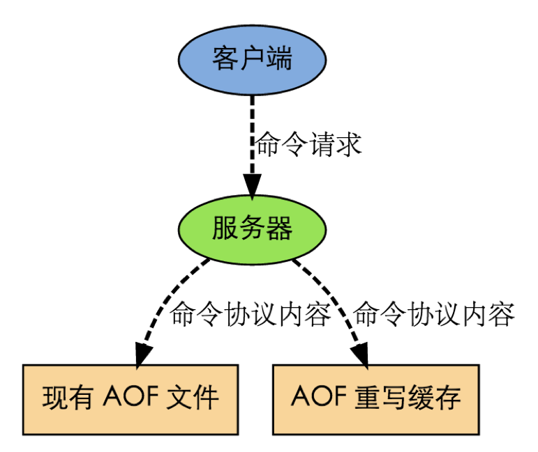

# 1、键管理

通过学习五种数据类型的操作命令，可以发现，Redis对每种数据的处理之前，都要先指定该数据的key，然后再指定对该数据进行何种操作。

Redis中的key有点类似于Java中的变量名，起到提纲挈领的作用，对某个数据的处理都是以key作为切入点。所以Redis把key作为单独的处理对象抽象出了一套操作命令。key可以想象成一个指向实际数据的指针，对key的操作会直接影响它所指向的数据的状态。

比如，我们想删除某个数据，就可以通过删除它的key来达到目的：

> *127.0.0.1:6379> **SET name chenlongfei***
>
> *OK*
>
> *127.0.0.1:6379> **GET name***
>
> *"chenlongfei"*
>
> *127.0.0.1:6379> **DEL name***
>
> *(integer) 1*
>
> *127.0.0.1:6379> **GET name***
>
> *(nil)*

想要查看某个数据的类型：

> *127.0.0.1:6379> **SADD direction east west south north***
>
> *(integer) 4*
>
> *127.0.0.1:6379> **TYPE direction***
>
> *set*

想要更改某个数据的key的名字：

> *127.0.0.1:6379> **RENAME direction direct***
>
> *OK*
>
> *127.0.0.1:6379> **SMEMBERS direct***
>
> *1) "north"*
>
> *2) "west"*
>
> *3) "south"*
>
> *4) "east"*

 

| **命令格式**                             | **说明**                                                     |
| ---------------------------------------- | ------------------------------------------------------------ |
| **DEL** key [key ...]                    | 此命令删除键，如果存在                                       |
| **EXISTS** key                           | 此命令检查该键是否存在                                       |
| **EXPIRE** key seconds                   | 指定键的过期时间（秒）                                       |
| **PEXPIRE** key milliseconds             | 指定键的过期时间（毫秒）                                     |
| **EXPIREAT** key timestamp               | 以Unix时间戳格式（秒）指定键的过期时间                       |
| **PEXPIREAT** key milliseconds-timestamp | 以Unix时间戳格式（毫秒）指定键的过期时间                     |
| **KEYS** pattern                         | 查找与指定模式匹配的所有键。pattern支持glob-style的通配符格式，如*表示任意一个或多个字符，?表示任意字符，[abc]表示方括号中任意一个字母 |
| **RENAME** key newkey                    | 更改键的名称                                                 |
| **RENAMENX** key newkey                  | 重命名键，如果新的键不存在                                   |
| **TYPE** key                             | 返回存储在键的数据类型的值                                   |
| **RANDOMKEY**                            | 从Redis返回随机键的名字                                      |
| **PERSIST** key                          | 如果Key存在过期时间，该命令会将其过期时间消除，使该Key不再有超时，而是可以持久化存储 |
| **TTL** key                              | （**T**ime **T**o **L**ive）返回该键的剩余存活时间（秒），如果该键不存在或没有超时设置，则返回-1 |
| **PTTL** key                             | 返回该键的剩余存活时间（毫秒）                               |

在这里有必要了解一下过期键的清理机制。

如果一个键过期了，那它什么时候会被删除？

这个问题有三种可能的答案：

- 定时删除：在设置键的过期时间时，创建一个定时事件，当过期时间到达时，由事件处理器自动执行键的删除操作。
- 惰性删除：放任键过期不管，但是在每次从 dict 字典中取出键值时，要检查键是否过期，如果过期的话，就删除它，并返回空；如果没过期，就返回键值。
- 定期删除：每隔一段时间，对 expires 字典进行检查，删除里面的过期键。

## 1.1 定时删除

定时删除策略对内存是最友好的： 因为它保证过期键会在第一时间被删除， 过期键所消耗的内存会立即被释放。

这种策略的缺点是， 它对 CPU 时间是最不友好的： 因为删除操作可能会占用大量的 CPU 时间 —— 在内存不紧张、但是 CPU 时间非常紧张的时候 （比如说，进行交集计算或排序的时候）， 将 CPU 时间花在删除那些和当前任务无关的过期键上， 这种做法毫无疑问会是低效的。

除此之外， 目前 Redis 事件处理器对时间事件的实现方式 —— 无序链表， 查找一个时间复杂度为 O(N)O(N) —— 并不适合用来处理大量时间事件。

## 1.2 惰性删除

惰性删除对 CPU 时间来说是最友好的： 它只会在取出键时进行检查， 这可以保证删除操作只会在非做不可的情况下进行 —— 并且删除的目标仅限于当前处理的键， 这个策略不会在删除其他无关的过期键上花费任何 CPU 时间。

惰性删除的缺点是， 它对内存是最不友好的： 如果一个键已经过期， 而这个键又仍然保留在数据库中， 那么 dict 字典和 expires 字典都需要继续保存这个键的信息， 只要这个过期键不被删除， 它占用的内存就不会被释放。

在使用惰性删除策略时， 如果数据库中有非常多的过期键， 但这些过期键又正好没有被访问的话， 那么它们就永远也不会被删除（除非用户手动执行）， 这对于性能非常依赖于内存大小的 Redis 来说， 肯定不是一个好消息。

举个例子， 对于一些按时间点来更新的数据， 比如日志（log）， 在某个时间点之后， 对它们的访问就会大大减少， 如果大量的这些过期数据积压在数据库里面， 用户以为它们已经过期了（已经被删除了）， 但实际上这些键却没有真正的被删除（内存也没有被释放）， 那结果肯定是非常糟糕。

## 1.3 定期删除

从上面对定时删除和惰性删除的讨论来看， 这两种删除方式在单一使用时都有明显的缺陷： 定时删除占用太多 CPU 时间， 惰性删除浪费太多内存。

定期删除是这两种策略的一种折中：它每隔一段时间执行一次删除操作，并通过限制删除操作执行的时长和频率，籍此来减少删除操作对 CPU 时间的影响。另一方面，通过定期删除过期键，它有效地减少了因惰性删除而带来的内存浪费。

## 1.4 Redis 使用的策略

Redis 使用的过期键删除策略是**惰性删除加上定期删除**，这两个策略相互配合，可以很好地在合理利用 CPU 时间和节约内存空间之间取得平衡。

 

 

 

 

 

 

 

# 2、发布订阅管理

发布订阅(pub/sub)是一种消息通信模式，主要的目的是解耦消息发布者和消息订阅者之间的耦合，这点和设计模式中的观察者模式比较相似。

Redis作为一个server，在订阅者和发布者之间起到了消息路由的功能。订阅者可以通过**subscribe**和**psubscribe**命令向Redis server订阅自己感兴趣的消息类型，Redis将消息类型称为**通道(channel)**。当发布者通过publish命令向Redis server发送特定类型的消息时。订阅该消息类型的全部client都会收到此消息。这里消息的传递是多对多的。一个client可以订阅多个 channel，也可以向多个channel发送消息。

例如，一个客户端订阅了“CCTV-5”频道的消息：

> *127.0.0.1:6379> **SUBSCRIBE CCTV-5***
>
> *Reading messages... (press Ctrl-C to quit)*
>
> *1) "subscribe"*
>
> *2) "CCTV-5"*
>
> *3) (integer) 1*

 

另一个客户端在“CCTV-5”发布了两条消息：

> *127.0.0.1:6379> **PUBLISH CCTV-5 "Kobe will say good bye to NBA in 2016.4.4"***
>
> *(integer) 1*
>
> *127.0.0.1:6379>**PUBLISH CCTV-5 "Cavaliers Cleveland won the championship"***
>
> *(integer) 1*

 

第一个客户端就会收到这两条消息：

> *127.0.0.1:6379> **SUBSCRIBE CCTV-5***
>
> *Reading messages... (press Ctrl-C to quit)*
>
> *1) "subscribe"*
>
> *2) "CCTV-5"*
>
> *3) (integer) 1*
>
> ***1) "message"\***
>
> ***2) "CCTV-5"\***
>
> ***3) "Kobe will say good bye to NBA in 2016.4.4"\***
>
> ***1) "message"\***
>
> ***2) "CCTV-5"\***
>
> ***3) "Cavaliers Cleveland won the championship"\***

 

| **命令格式**                                    | **说明**                                                     |
| ----------------------------------------------- | ------------------------------------------------------------ |
| **PUBLISH** channel message                     | 将消息message发布到频道channel                               |
| **SUBSCRIBE** channel [channel ...]             | 订阅一个或多个频道上的消息                                   |
| **UNSUBSCRIBE** [channel [channel ...]]         | 退订频道上的消息                                             |
| **PSUBSCRIBE** pattern [pattern ...]            | （**P**attern **Subscribe**）以模式匹配的方式订阅多个频道    |
| **PUNSUBSCRIBE** [pattern [pattern ...]]        | 以模式匹配的方式退订频道消息                                 |
| **PUBSUB** subcommand [argument [argument ...]] | 查看活动的频道信息。比如“PUBSUB channels”，会列出所有活动的频道名称，所谓“活动的”，是指至少有一个订阅者的频道 |

# 3、 连接管理

默认情况下，Redis没有密码要求，意味着无需通过密码验证就可以连接到 Redis 服务。

可以通过更改配置文件中的“requirepass”配置项，来设置密码。

> *winner@winnerdeMacBook-Pro:~$ Redis-cli*
>
> *127.0.0.1:6379> CONFIG get requirepass*
>
> *1) "requirepass"*
>
> *2) "" --默认没有密码*
>
> *127.0.0.1:6379> CONFIG set requirepass "chenlongfei" --设置密码*
>
> *OK*
>
> *127.0.0.1:6379> QUIT --退出重新连接*
>
> *winner@winnerdeMacBook-Pro:~$ Redis-cli*
>
> *127.0.0.1:6379> SET name "clf"*
>
> *(error) NOAUTH Authentication required. –提示没权限*
>
> *127.0.0.1:6379> AUTH chenlongfei --验证密码*
>
> *OK*
>
> *127.0.0.1:6379> SET name "clf" --之后才能进行操作*
>
> *OK*
>
> *127.0.0.1:6379> GET name*
>
> *"clf"*

| **命令格式**      | **说明**                                                     |
| ----------------- | ------------------------------------------------------------ |
| **AUTH** password | 验证密码                                                     |
| **ECHO** message  | 打印字符串                                                   |
| **PING**          | 检验连接状况，正常情况下服务器会返回“PONG”。                 |
| **QUIT**          | 关闭当前连接                                                 |
| **SELECT** index  | 切换到指定的数据库，数据库索引号 index 用数字值指定，以 0 作为起始索引值。默认使用 0 号数据库。 |

# 4、 服务器管理

Redis定义了一组与服务器相关的命令，用于查询服务器信息，如当前时间、客户端连接数量，以及修改配置文件、手动触发某些操作等。

| **命令格式**                 | **说明**                                                     |
| ---------------------------- | ------------------------------------------------------------ |
| **INFO**                     | 打印服务器的详细信息                                         |
| **CONFIG** GET name          | 获取配置项name的内容                                         |
| **CONFIG** SET name value    | 将配置项name的值设为value，无需重启                          |
| **BGSAVE**                   | 在后台异步保存当前数据库的数据到磁盘。BGSAVE 命令执行之后立即返回 OK ，然后 Redis fork 出一个新子进程，原来的 Redis 进程(父进程)继续处理客户端请求，而子进程则负责将数据保存到磁盘，然后退出。 |
| **SAVE**                     | SAVE 命令执行一个同步操作，以RDB文件的方式保存所有数据的快照。很少在生产环境直接使用SAVE 命令，因为它会**阻塞所有的客户端的请求**，可以使用BGSAVE 命令代替 |
| **FLUSHALL**                 | 删除所有数据库的所有key                                      |
| **FLUSHDB**                  | 删除当前数据库的所有key                                      |
| **SHUTDOWN** [NOSAVE] [SAVE] | 停止所有客户端，如果配置了save 策略 则执行一个阻塞的save命令，如果开启了AOF，则刷新aof文件，关闭Redis服务进程（Redis-server）。  如果配置了持久化策略，那么这个命令将能够保证在关闭Redis服务进程的时候数据不会丢失。如果仅仅在客户端执行SAVE 命令，然后  执行QUIT 命令，那么数据的完整性将不会被保证，因为其他客户端可能在执行这两个命令的期间修改数据库的数据。 |

# 5、持久化

Redis提供了两种持久化的方式：

- **RDB**（**Redis** **D**ata**B**ase）模式，就是在不同的时间点，将Redis存储的数据生成快照并存储到磁盘等介质上；
- **AOF**（**A**ppend **O**nly **F**ile）模式，则换了一个角度来实现持久化，那就是将Redis执行过的所有写指令记录下来，在下次Redis重新启动时，只要把这些写指令从前到后再重复执行一遍，就可以实现数据恢复了。

RDB和AOF两种方式可以同时使用，在这种情况下如果Redis重启，则会**优先采用AOF方式来进行数据恢复**，这是因为AOF方式的数据恢复完整度更高。

没有数据持久化的需求，也完全可以关闭RDB和AOF方式，这样的话，Redis将变成一个纯内存数据库，就像memcache一样。

## 5.1 RDB模式

Redis在进行数据持久化的过程中，会先将数据写入到一个临时文件中，待持久化过程都结束了，才会用这个临时文件替换上次持久化好的文件。正是这种特性，让我们可以随时来进行备份，因为快照文件总是完整可用的。

对于RDB方式，Redis会单独创建（fork）一个子进程来进行持久化，而主进程是不会进行任何IO操作的，这样就确保了Redis极高的性能。

如果需要进行大规模数据的恢复，且对于数据恢复的完整性不是非常敏感，那RDB方式要比AOF方式更加的高效。

虽然RDB有不少优点，但它的缺点也是不容忽视的。如果对数据的完整性非常敏感，那么RDB方式就不太适合，因为即使每5分钟都持久化一次，当Redis故障时，仍然会有近5分钟的数据丢失。所以，Redis还提供了另一种持久化方式，那就是AOF。

## 5.2 AOF模式

通过配置Redis.conf中的“appendonly yes”就可以打开AOF功能。如果有写操作（如SET等），Redis就会被追加到AOF文件的末尾。

默认的AOF持久化策略是每秒钟fsync一次（fsync是指把缓存中的写指令记录到磁盘中），因为在这种情况下，Redis仍然可以保持很好的处理性能，即使Redis故障，也只会丢失最近1秒钟的数据。

如果在追加日志时，恰好遇到磁盘空间满、inode满或断电等情况导致日志写入不完整，也没有关系，Redis提供了Redis-check-aof工具，可以用来进行日志修复。

AOF 后台执行的方式和 RDB 有类似的地方，fork 一个子进程，主进程仍进行服务，子进程执行 AOF 持久化，数据被 dump 到磁盘上。与 RDB 不同的是，后台子进程持久化过程中，主进程会记录期间的所有数据变更（主进程还在服务），并存储在 server.aof_rewrite_buf_blocks 中；后台子进程结束后，Redis 更新缓存追加到 AOF 文件中，是 RDB 持久化所不具备的。

 

因为采用了追加方式，如果不做任何处理的话，AOF文件会变得越来越大，为此，Redis提供了AOF文件**重写（rewrite）机制**，即当AOF文件的大小超过所设定的阈值时，Redis就会启动AOF文件的内容压缩，只保留可以恢复数据的最小指令集。举个例子或许更形象，假如我们调用了100次INCR指令，在AOF文件中就要存储100条指令，但这明显是很低效的，完全可以把这100条指令合并成一条SET指令，这就是重写机制的原理。在进行AOF重写时，仍然是采用先写临时文件，全部完成后再替换的流程，所以断电、磁盘满等问题都不会影响AOF文件的可用性。

AOF重写的内部运行原理，有必要了解一下。

在重写即将开始之际，Redis会创建（fork）一个“重写子进程”，这个子进程会首先读取现有的AOF文件，并将其包含的指令进行分析压缩并写入到一个临时文件中。

与此同时，主工作进程会将新接收到的写指令一边累积到内存缓冲区中，一边继续写入到原有的AOF文件中，这样做是保证原有的AOF文件的可用性，避免在重写过程中出现意外。

当“重写子进程”完成重写工作后，它会给父进程发一个信号，父进程收到信号后就会将内存中缓存的写指令追加到新AOF文件中。

当追加结束后，Redis就会用新AOF文件来代替旧AOF文件，之后再有新的写指令，就都会追加到新的AOF文件中了。

虽然优点多多，但AOF方式也同样存在缺陷，比如在同样数据规模的情况下，AOF文件要比RDB文件的体积大。而且，AOF方式的恢复速度也要慢于RDB方式。

如果运气比较差，AOF文件出现了被写坏的情况，也不必过分担忧，Redis并不会贸然加载这个有问题的AOF文件，而是报错退出。这时可以通过Redis-check-aof工具来修复文件，确认问题点后再重启Redis

