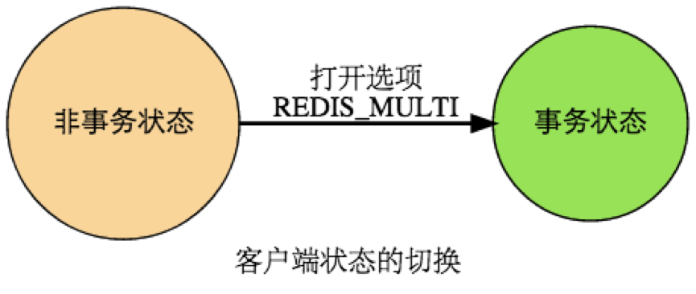
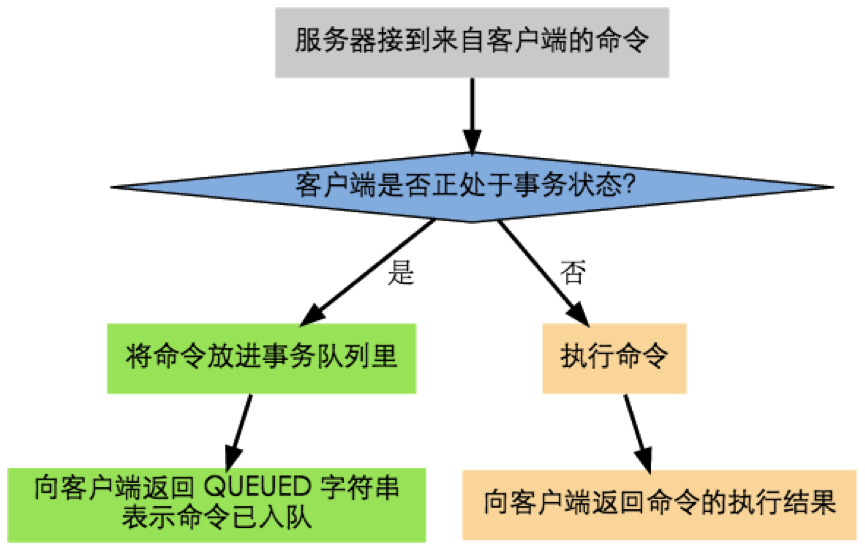
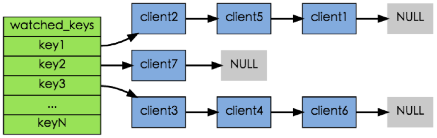
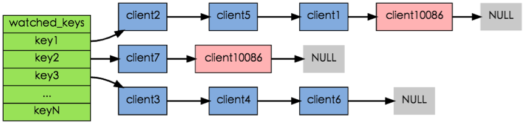
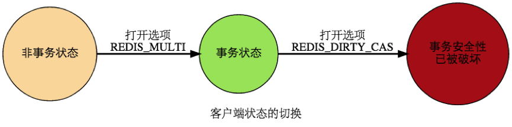

所谓事务，就是一个非黑即白的定义，一组命令，要么全做，要么全部，不存在半做半不做的灰色地带。

这一点对于保持数据库的一致性非常重要，比如，两个银行转账，至少需要分成两个步骤：

- 从A银行账户扣除一定的金额；
- 将等额资金添加到B银行账户中。

这就是一个事务的应用场景，这两步是完成一个事件的整体，具有不可分割的原子性，假设在执行完步骤（1）之后因为某种原因导致步骤（2）无法执行，这笔资金从原账户已经扣除，但是没有转到预定的账户B中，一笔钱就这么人间蒸发，客户岂不要骂娘了。

Redis通过四个命令来支持实务操作：

- **MULTI** 
- **DISCARD** 
- **EXEC**  
- **WATCH**

Redis以 MULTI 开始一个事务， 然后将多个命令入队到事务中， 最后由 EXEC 命令触发事务， 一并执行事务中的所有命令：

> *127.0.0.1:6379> **MULTI** --开始事务*
>
> *OK*
>
> *127.0.0.1:6379> **SET accountA 10000** --A账户存入10000*
>
> *QUEUED*
>
> *127.0.0.1:6379> **Set accountB 8000** --B账户存入8000*
>
> *QUEUED*
>
> *127.0.0.1:6379> **DECRBY accountA 2000** --A账户扣除2000*
>
> *QUEUED*
>
> *127.0.0.1:6379> **INCRBY accountB 2000** --B账户添加2000*
>
> *QUEUED*
>
> *127.0.0.1:6379> **GET accountA** --获取A账户金额*
>
> *QUEUED*
>
> *127.0.0.1:6379> **GET account** --获取B账户金额*
>
> *QUEUED*
>
> *127.0.0.1:6379> **EXEC** --执行事务*
>
> *1) OK*
>
> *2) OK*
>
> *3) (integer) 8000*
>
> *4) (integer) 10000*
>
> *5) "8000"*
>
> *6) "10000"*

# 1、开始事务

MULTI 命令的执行标记着事务的开始：

当客户端处于非事务状态下时， 所有发送给服务器端的命令都会立即被服务器执行。

**Redis 的事务不可嵌套**， 当客户端已经处于事务状态， 而客户端又再向服务器发送 MULTI 时， 服务器只是简单地向客户端发送一个错误， 然后继续等待其他命令的入队。 MULTI 命令的发送不会造成整个事务失败， 也不会修改事务队列中已有的数据。

# 2、命令入队

但是， 当客户端进入事务状态之后， 服务器在收到来自客户端的命令时， 不会立即执行命令， 而是将这些命令全部放进一个事务队列里， 然后返回 QUEUED ， 表示命令已入队：

事务队列是一个数组， 每个数组项是都包含三个属性：

- 要执行的命令（cmd）
- 命令的参数（argv）
- 参数的个数（argc）

例如，客户端执行以下命令：

> *127.0.0.1:6379> **MULTI***
>
> *OK*
>
> *127.0.0.1:6379> **SET name "chenlongfei"***
>
> *QUEUED*
>
> *127.0.0.1:6379> **GET name***
>
> *QUEUED*
>
> *127.0.0.1:6379> **SADD tag "master" "Java" "engineer"***
>
> *QUEUED*
>
> *127.0.0.1:6379> **SMEMBERS tag***
>
> *QUEUED*

程序将为客户端创建以下事务队列：

| **数组索引** | **命令** | **命令参数**                      | **命令个数** |
| ------------ | -------- | --------------------------------- | ------------ |
| 0            | SET      | [name “chenlongfei”]              | 2            |
| 1            | GET      | [name]                            | 1            |
| 2            | SADD     | [tag "master"  "Java" "engineer"] | 4            |
| 3            | SMEMBERS | [tag]                             | 1            |

# 3、命令执行

如果客户端正处于事务状态， 那么当 EXEC 命令执行时， 服务器根据客户端所保存的事务队列， 以先进先出（FIFO）的方式执行事务队列中的命令： 最先入队的命令最先执行， 而最后入队的命令最后执行。

对于上面的命令队列而言，程序会首先执行 SET 命令， 然后执行 GET 命令， 再然后执行 SADD 命令， 最后执行 SMEMBERS 命令。

执行事务中的命令所得的结果会以 FIFO 的顺序保存到一个回复队列中。

上面给出的事务队列，会得到如下回复队列：

| **数组索引** | **回复类型**      | **回复内容**                   |
| ------------ | ----------------- | ------------------------------ |
| 0            | status code reply | OK                             |
| 1            | bulk reply        | chenlongfei                    |
| 2            | integer reply     | (integer) 3                    |
| 3            | multi-bulk reply  | [ "engineer" "Java"  "master"] |

当事务队列里的所有命令被执行完之后， EXEC 命令会将回复队列作为自己的执行结果返回给客户端， 客户端从事务状态返回到非事务状态， 至此， 事务执行完毕。

# 4、事务命令与非事务命令

无论在事务状态下， 还是在非事务状态下， Redis 命令都由同一个函数执行， 所以它们共享很多服务器的一般设置， 比如 AOF 的配置、RDB 的配置，以及内存限制，等等。

事务中的命令和普通命令在执行上还是有一点区别的，其中最重要的两点是：

（1）非事务状态下的命令以单个命令为单位执行，前一个命令和后一个命令的客户端不一定是同一个；而事务状态则是以一个事务为单位，执行事务队列中的所有命令，**除非当前事务执行完毕，否则服务器不会中断事务，也不会执行其他客户端的其他命令**。

（2）在非事务状态下，执行命令所得的结果会立即被返回给客户端；而事务则是将所有命令的结果集合到回复队列，再作为 EXEC 命令的结果返回给客户端。

# 5、取消事务

**DISCARD** 命令用于取消一个事务，它清空客户端的整个事务队列，然后将客户端从事务状态调整回非事务状态，最后返回字符串 OK 给客户端，说明事务已被取消。

> *127.0.0.1:6379> **SET name cehnlongfei** --设置姓名*
>
> *OK*
>
> *127.0.0.1:6379> **MULTI***
>
> *OK*
>
> *127.0.0.1:6379> **SET name clf** --在事务中更改姓名*
>
> *QUEUED*
>
> *127.0.0.1:6379> **GET name***
>
> *QUEUED*
>
> *127.0.0.1:6379> **DISCARD** --取消事务*
>
> *OK*
>
> *127.0.0.1:6379> **GET name*** 
>
> *"cehnlongfei" --可见姓名并没有被更改*

# 6、 WATCH命令

WATCH 命令用于在事务开始之前监视任意数量的键：当调用 EXEC 命令执行事务时，如果任意一个被监视的键已经被其他客户端修改了，那么整个事务不再执行，直接返回失败。

例如：

> *127.0.0.1:6379> **WATCH name** --监视name键*
>
> *OK*
>
> *127.0.0.1:6379> **MULTI***
>
> *OK*
>
> *127.0.0.1:6379> **SET name chenlongfei***
>
> *QUEUED*
>
> *127.0.0.1:6379> **GET name***
>
> *QUEUED*
>
> *127.0.0.1:6379> **EXEC***
>
> *(nil) --由于其他客户端对name键做了更新，导致事务失败*

以下执行序列展示了上面的例子是如何失败的：

| **时间** | **客户端A**          | **客户端B**  |
| -------- | -------------------- | ------------ |
| T1       | WATCH name           |              |
| T2       | MULTI                |              |
| T3       | SET name chenlongfei |              |
| T4       |                      | SET name clf |
| T5       | GET name             |              |

在客户端A监视name键之后 ，客户端 B 修改了 name 键的值， 当客户端 A 在 T5 执行 EXEC 时，Redis 发现 name 这个被监视的键已经被修改， 因此客户端 A 的事务不会被执行，直接返回失败。

使用**UNWATCH**命令可以清除之前设置的所有监视。

 

在每个代表数据库的Redis.h/RedisDb 结构类型中，保存了一个 watched_keys 字典，字典的键是这个数据库被监视的键，而字典的值则是一个链表，链表中保存了所有监视这个键的客户端。

如：

其中，键 key1 正在被client1 、 client2和client5三个客户端监视，其他一些键也分别被其他别的客户端监视着。

WATCH 命令的作用， 就是将当前客户端和要监视的键在 watched_keys 中进行关联。

例如，如果当前客户端为 client10086 ，那么当客户端执行 WATCH key1 key2 时，前面展示的 watched_keys 将被修改成这个样子：

通过 watched_keys 字典，如果程序想检查某个键是否被监视，那么它只要检查字典中是否存在这个键即可； 如果程序要获取监视某个键的所有客户端， 那么只要取出键的值（一个链表），然后对链表进行遍历即可。

 

在任何对数据库键空间（key space）进行修改的命令成功执行之后 （比如 FLUSHDB 、 SET 、 DEL 、 LPUSH 、 SADD 、 ZREM ，诸如此类）， multi.c/touchWatchedKey 函数都会被调用 —— 它检查数据库的 watched_keys 字典，看是否有客户端在监视已经被命令修改的键，如果有的话， 程序将所有监视这个/这些被修改键的客户端的 REDIS_DIRTY_CAS 选项打开：

当客户端发送 EXEC 命令、触发事务执行时，服务器会对客户端的状态进行检查：

如果客户端的 REDIS_DIRTY_CAS 选项已经被打开，那么说明被客户端监视的键至少有一个已经被修改了，事务的安全性已经被破坏。服务器会放弃执行这个事务，直接向客户端返回空回复，表示事务执行失败。

如果 REDIS_DIRTY_CAS 选项没有被打开，那么说明所有监视键都安全，服务器正式执行事务。

# 6、 ACID 性质

在传统的关系式数据库中，常常用 **ACID**性质来检验事务功能的安全性：原子性（Atomicity）、一致性（Consistency）、隔离性（Isolation）、持久性（Durability）

**Redis 事务保证了其中的一致性和隔离性，但并不保证原子性和持久性**。

## 6.1原子性（Atomicity）

单个 Redis 命令的执行是原子性的，但 Redis 没有在事务上增加任何维持原子性的机制，所以 Redis 事务的执行并不是原子性的。

如果一个事务队列中的所有命令都被成功地执行，那么称这个事务执行成功。

另一方面，如果 Redis 服务器进程在执行事务的过程中被停止 —— 比如接到 KILL 信号、宿主机器停机，等等，那么事务执行失败。

**当事务失败时，Redis 也不会进行任何的重试或者回滚动作。**

## 6.2一致性（Consistency）

Redis 的一致性问题可以分为三部分来讨论：入队错误、执行错误、Redis 进程被终结。

（1）入队错误

在命令入队的过程中，如果客户端向服务器发送了错误的命令，比如命令的参数数量不对，等等，服务器将向客户端返回一个出错信息，并且将客户端的事务状态设为 REDIS_DIRTY_EXEC 。

当客户端执行 EXEC 命令时，Redis 会拒绝执行状态为 REDIS_DIRTY_EXEC 的事务，并返回失败信息。

因此，带有不正确入队命令的事务不会被执行，也不会影响数据库的一致性。

（2）执行错误

如果命令在事务执行的过程中发生错误，比如说对一个不同类型的 key 执行了错误的操作，那么 Redis 只会将错误包含在事务的结果中，这不会引起事务中断或整个失败，不会影响已执行事务命令的结果，也不会影响后面要执行的事务命令，所以它对事务的一致性也没有影响。

（3）Redis 进程被终结

如果 Redis 服务器进程在执行事务的过程中被其他进程终结，或者被管理员强制杀死，那么根据 Redis 所使用的持久化模式，可能有以下情况出现：

内存模式：如果 Redis 没有采取任何持久化机制，那么重启之后的数据库总是空白的，所以数据总是一致的。

RDB 模式：在执行事务时，Redis 不会中断事务去执行保存 RDB 的工作，只有在事务执行之后，保存 RDB 的工作才有可能开始。所以当 RDB 模式下的 Redis 服务器进程在事务中途被杀死时，事务内执行的命令，不管成功了多少，都不会被保存到 RDB 文件里。恢复数据库需要使用现有的 RDB 文件，而这个 RDB 文件的数据保存的是最近一次的数据库快照，所以它的数据可能不是最新的，但只要 RDB 文件本身没有因为其他问题而出错，那么还原后的数据库就是一致的。

AOF 模式：因为保存 AOF 文件的工作在后台线程进行，所以即使是在事务执行的中途，保存 AOF 文件的工作也可以继续进行，因此，根据事务语句是否被写入并保存到 AOF 文件，有以下两种情况发生：

1）如果事务语句未写入到 AOF 文件，或 AOF 未被 SYNC 调用保存到磁盘，那么当进程被杀死之后，Redis 可以根据最近一次成功保存到磁盘的 AOF 文件来还原数据库，只要 AOF 文件本身没有因为其他问题而出错，那么还原后的数据库总是一致的，但其中的数据不一定是最新的。

2）如果事务的部分语句被写入到 AOF 文件，并且 AOF 文件被成功保存，那么不完整的事务执行信息就会遗留在 AOF 文件里，当重启 Redis 时，程序会检测到 AOF 文件并不完整，Redis 会退出，并报告错误。需要使用 Redis-check-aof 工具将部分成功的事务命令移除之后，才能再次启动服务器。还原之后的数据总是一致的，而且数据也是最新的（直到事务执行之前为止）。

## 6.3隔离性（Isolation）

Redis 是单进程程序，并且它保证在执行事务时，不会对事务进行中断，事务可以运行直到执行完所有事务队列中的命令为止。因此，Redis 的事务是总是带有隔离性的。

## 6.4持久性（Durability）

因为事务不过是用队列包裹起了一组 Redis 命令，并没有提供任何额外的持久性功能，所以事务的持久性由 Redis 所使用的持久化模式决定：

在单纯的内存模式下，事务肯定是不持久的。

在 RDB 模式下，服务器可能在事务执行之后、RDB 文件更新之前的这段时间失败，所以 RDB 模式下的 Redis 事务也是不持久的。

在 AOF 的“总是 SYNC ”模式下，事务的每条命令在执行成功之后，都会立即调用 fsync 或 fdatasync 将事务数据写入到 AOF 文件。但是，这种保存是由后台线程进行的，主线程不会阻塞直到保存成功，所以从命令执行成功到数据保存到硬盘之间，还是有一段非常小的间隔，所以这种模式下的事务也是不持久的。

其他 AOF 模式也和“总是 SYNC ”模式类似，所以它们都是不持久的。