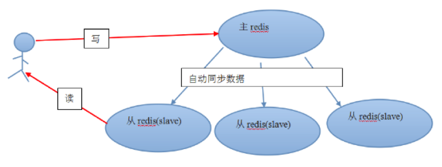
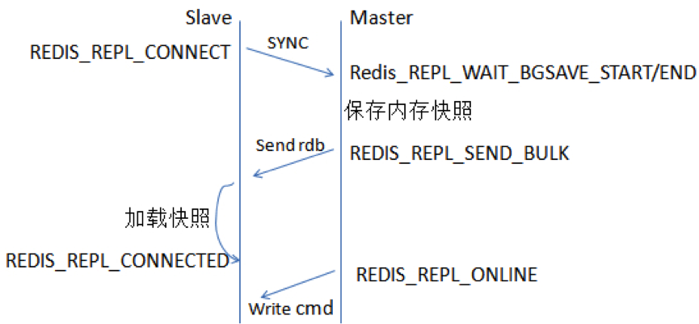
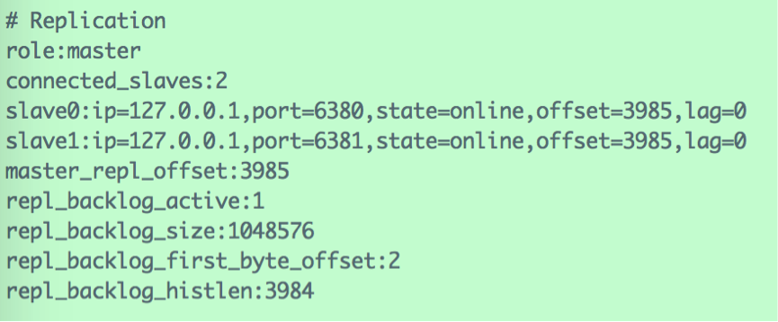
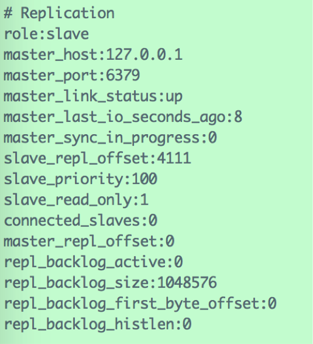
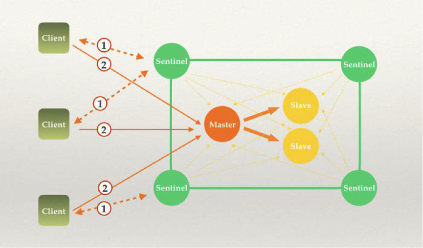
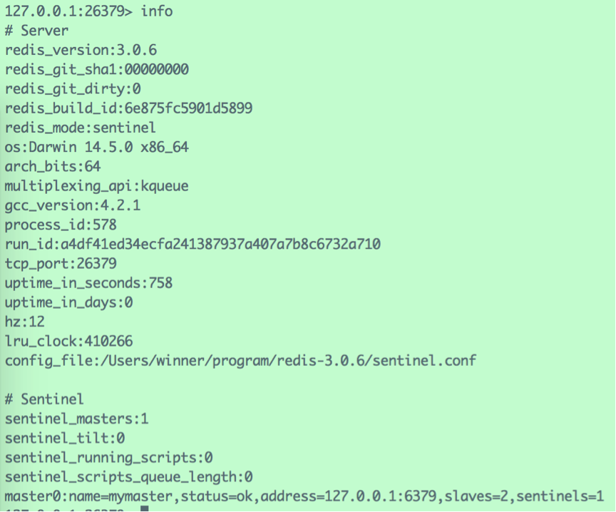
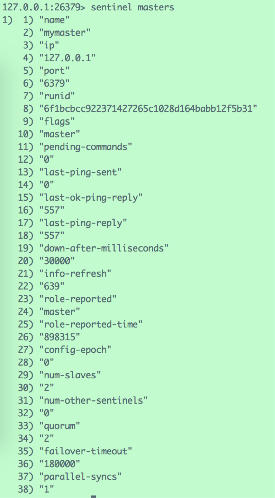
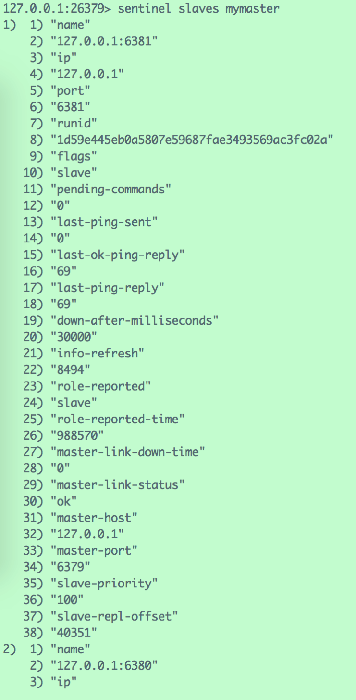
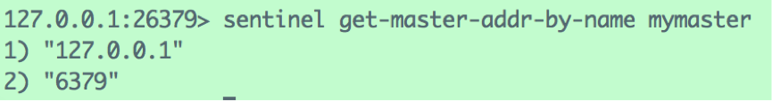

# 1、主从同步原理

像MySQL一样，Redis是支持**主从同步**的，而且也支持一主多从以及多级从结构。

主从结构，一是为了纯粹的冗余备份，二是为了提升读性能，比如很消耗性能的SORT就可以由从服务器来承担。

Redis的主从同步是异步进行的，这意味着主从同步不会影响主逻辑，也不会降低Redis的处理性能。

主从架构中，可以考虑关闭主服务器的数据持久化功能，只让从服务器进行持久化，这样可以提高主服务器的处理性能。

在主从架构中，从服务器通常被设置为只读模式，这样可以避免从服务器的数据被误修改。但是从服务器仍然可以接受CONFIG等指令，所以还是不应该将从服务器直接暴露到不安全的网络环境中。如果必须如此，那可以考虑给重要指令进行重命名，来避免命令被外人误执行。

从服务器会向主服务器发出**SYNC**指令，当主服务器接到此命令后，就会调用**BGSAVE**指令来创建一个子进程专门进行数据持久化工作，也就是将主服务器的数据写入RDB文件中。在数据持久化期间，主服务器将执行的写指令都缓存在内存中。

在BGSAVE指令执行完成后，主服务器会将持久化好的RDB文件发送给从服务器，从服务器接到此文件后会将其存储到磁盘上，然后再将其读取到内存中。这个动作完成后，主服务器会将这段时间缓存的写指令再以Redis协议的格式发送给从服务器。

另外，要说的一点是，即使有多个从服务器同时发来SYNC指令，主服务器也只会执行一次BGSAVE，然后把持久化好的RDB文件发给多个下游。在Redis2.8版本之前，如果从服务器与主服务器因某些原因断开连接的话，都会进行一次主从之间的全量的数据同步；而在2.8版本之后，Redis支持了效率更高的增量同步策略，这大大降低了连接断开的恢复成本。

主服务器会在内存中维护一个缓冲区，缓冲区中存储着将要发给从服务器的内容。从服务器在与主服务器出现网络瞬断之后，从服务器会尝试再次与主服务器连接，一旦连接成功，从服务器就会把“希望同步的主服务器ID”和“希望请求的数据的偏移位置（replication offset）”发送出去。主服务器接收到这样的同步请求后，首先会验证主服务器ID是否和自己的ID匹配，其次会检查“请求的偏移位置”是否存在于自己的缓冲区中，如果两者都满足的话，主服务器就会向从服务器发送增量内容。

增量同步功能，需要服务器端支持全新的PSYNC指令。这个指令，只有在Redis-2.8之后才具有。

Redis复制工作原理的总结如下：

-  如果设置了一个Slave，无论是第一次连接还是重连到Master，它都会发出一个SYNC命令；
- 当Master收到SYNC命令之后，会做两件事：
  -  Master执行BGSAVE，即在后台保存数据到磁盘（rdb快照文件）；
  - Master同时将新收到的写入和修改数据集的命令存入缓冲区（非查询类）；
- 当Master在后台把数据保存到快照文件完成之后，Master会把这个快照文件传送给Slave，而Slave则把内存清空后，加载该文件到内存中；
- 而Master也会把此前收集到缓冲区中的命令，通过Reids命令协议形式转发给Slave，Slave执行这些命令，实现和Master的同步；
-  Master/Slave此后会不断通过异步方式进行命令的同步，达到最终数据的同步一致；
- 需要注意的是Master和Slave之间一旦发生重连都会引发全量同步操作。但在2.8之后版本，也可能是部分同步操作。

 

2.8开始，当Master和Slave之间的连接断开之后，他们之间可以采用持续复制处理方式代替采用全量同步。

Master端为复制流维护一个内存缓冲区（in-memory backlog），记录最近发送的复制流命令；同时，Master和Slave之间都维护一个复制偏移量(replication offset)和当前Master服务器ID（Master run id）。当网络断开，Slave尝试重连时：

a. 如果MasterID相同（即仍是断网前的Master服务器），并且从断开时到当前时刻的历史命令依然在Master的内存缓冲区中存在，则Master会将缺失的这段时间的所有命令发送给Slave执行，然后复制工作就可以继续执行了；

b. 否则，依然需要全量复制操作；

Redis 2.8 的这个部分重同步特性会用到一个新增的 **PSYNC** 内部命令， 而 Redis 2.8 以前的旧版本只有 SYNC 命令， 不过， 只要从服务器是 Redis 2.8 或以上的版本， 它就会根据主服务器的版本来决定到底是使用 PSYNC 还是 SYNC ：如果主服务器是 Redis 2.8 或以上版本，那么从服务器使用 PSYNC 命令来进行同步；如果主服务器是 Redis 2.8 之前的版本，那么从服务器使用 SYNC 命令来进行同步。

# 2、 主从同步配置

可以在一台机器上使用不同的端口来模拟多台机器的主从同步。

下面以默认端口6379为Master，以6380、6381端口为两个Slave。

找到Redis安装路径下的redis.conf，复制两份，分别命名为“redis-6380.conf”与“redis-6381.conf”。

redis.conf相关配置：

> pidfile /var/run/redis.pid
>
> port 6379
>
> bind 127.0.0.1
>
> logfile /Users/winner/program/redis-3.0.6/log/redis.log
>
> \# Mater不进行持久化，关闭RDB与AOF
>
> save “”
>
> appendonly no 

 

redis-6380.conf相关配置：

> pidfile /var/run/redis-6380.pid
>
> port 6380
>
> bind 127.0.0.1
>
> logfile /Users/winner/program/redis-3.0.6/log/redis-6380.log
>
> \#Slave同时开启RDB与AOF
>
> dbfilename dump-6380.rdb
>
> dir /Users/winner/program/redis-3.0.6/db/
>
> appendonly yes
>
> appendfilename "appendonly-6380.aof"
>
> \#指定Master的IP与端口
>
> slaveof 127.0.0.1 6379
>
> \#Slave设为只读模式
>
> slave-read-only yes
>
> redis-6381.conf与redis-6380.conf的配置类似。

 

使用命令`redis-server –h 127.0.0.1 –p 6379`启动Master实例，再使用`redis-server –h 127.0.0.1 –p 6380`与`redis-server –h 127.0.0.1 –p 6381`启动两个Slave实例。

在Master的客户端使用“info”：

信息显示，Master有两个Slave，端口分别为6380与6381。

在Slave的客户端使用“info”命令：

信息显示，该实例为“127.0.0.1:6379”的Slave。

在Master上执行命令：

> *127.0.0.1:6379> set name 'chenlongfei'*
>
> *OK*

然后在任何一个Slave上都可以获取到该数据：

> *127.0.0.1:6380> get name*
>
> *"chenlongfei"*

证明Slave与Master的数据库保持一致。

# 3、 Sentinel实现机制与用法

## 3.1 Sentinel概述

Redis-Sentinel是Redis官方推荐的高可用性(HA，High Available)解决方案，当用Redis做Master-slave的高可用方案时，假如master宕机了，Redis本身(包括它的很多客户端)都没有实现自动进行主备切换，而Redis-sentinel本身也是一个独立运行的进程，它能监控多个master-slave集群，发现master宕机后能进行自动切换。

它的主要功能有以下几点

- 不时地监控redis是否按照预期良好地运行;
- 如果发现某个redis节点运行出现状况，能够通知另外一个进程(例如它的客户端);
- 能够进行自动切换。当一个master节点不可用时，能够选举出master的多个slave(如果有超过一个slave的话)中的一个来作为新的master,其它的slave节点会将它所追随的master的地址改为被提升为master的slave的新地址。

很显然，只使用单个sentinel进程来监控redis集群是不可靠的，当sentinel进程宕掉后(sentinel本身也有单点问题，single-point-of-failure)整个集群系统将无法按照预期的方式运行，所以有必要将sentinel集群化：

Sentinel其实就是Client和Redis之间的桥梁，所有的客户端都通过Sentinel程序获取Redis的Master服务。首先Sentinel是集群部署的，Client连接任何一个Sentinel服务所获的结果都是一致的。其次，所有的Sentinel服务都会对Redis的主从服务进行监控，当监控到Master服务无响应的时候，Sentinel内部进行仲裁，从所有的 Slave选举出一个做为新的Master。并且把其他的slave作为新的Master的Slave。最后通知所有的客户端新的Master服务地址。如果旧的Master服务地址重新启动，这个时候，它将被设置为Slave服务。

## 3.2 配置文件

运行sentinel有两种方式：

`redis-sentinel /path/to/sentinel.conf`

或

`redis-server /path/to/sentinel.conf --sentinel`

以上两种方式，都必须指定一个sentinel的配置文件sentinel.conf，如果不指定，将无法启动sentinel。sentinel默认监听**26379**端口，所以运行前必须确定该端口没有被别的进程占用。

Redis源码包中包含了一个**sentinel.conf**文件作为sentinel的配置文件，配置文件自带了关于各个配置项的解释。典型的配置项如下所示：

> port 26379

工作端口，默认值为26379。

> dir "/private/tmp"

工作路径。

> sentinel monitor mymaster 127.0.0.1 6379 2

这一行代表sentinel监控的master的名字叫做mymaster,地址为127.0.0.1:6379，行尾最后的一个2代表什么意思呢？我们知道，网络是不可靠的，有时候一个sentinel会因为网络堵塞而误以为一个master redis已经死掉了，当sentinel集群式，解决这个问题的方法就变得很简单，只需要多个sentinel互相沟通来确认某个master是否真的死了，这个2代表，当集群中有2个sentinel认为master死了时，才能真正认为该master已经不可用了。（sentinel集群中各个sentinel也有互相通信，通过gossip协议）。

> sentinel down-after-milliseconds mymaster 1800

sentinel会向master发送心跳**PING**来确认master是否存活，如果master在“一定时间范围”内不回应PONG 或者是回复了一个错误消息，那么这个sentinel会主观地(单方面地)认为这个master已经不可用了(subjectively down, 也简称为**SDOWN**)。而这个down-after-milliseconds就是用来指定这个“一定时间范围”的，单位是毫秒。

不过需要注意的是，这个时候sentinel并不会马上进行failover主备切换，这个sentinel还需要参考sentinel集群中其他sentinel的意见，如果超过某个数量的sentinel也主观地认为该master死了，那么这个master就会被客观地(这次不是主观，是客观，与刚才的subjectively down相对，这次是objectively down，简称为**ODOWN**)认为已经死了。需要一起做出决定的sentinel数量在上一条配置中进行配置。

> sentinel failover-timeout mymaster 36000

若sentinel在该配置值内未能完成failover操作（即故障时master/slave自动切换），则认为本次failover失败

> parallel-syncs mymaster 1

在发生failover主备切换时，这个选项指定了最多可以有多少个slave同时对新的master进行同步，这个数字越小，完成failover所需的时间就越长，但是如果这个数字越大，就意味着越多的slave因为replication而不可用。可以通过将这个值设为 1 来保证每次只有一个slave处于不能处理命令请求的状态。

其余配置项可参考原文的注释。

所有的配置都可以在运行时用命令`SENTINEL SET command`动态修改。

 

sentinel集群中各个sentinel都互相连接彼此来检查对方的可用性以及互相发送消息。但是不用在任何一个sentinel配置任何其它的sentinel的节点。因为**sentinel利用了master的发布/订阅机制去自动发现其它也监控了同一master的sentinel节点**。通过向名为**__sentinel__:hello**的管道中发送消息来实现。同样，也不需要在sentinel中配置某个master的所有slave的地址，sentinel会通过询问master来得到这些slave的地址的。每个sentinel通过向每个master和slave的发布/订阅频道__sentinel__:hello每秒发送一次消息，来宣布它的存在。每个sentinel也订阅了每个master和slave的频道__sentinel__:hello的内容，来发现未知的sentinel，当检测到了新的sentinel，则将其加入到自身维护的master监控列表中。每个sentinel发送的消息中也包含了其当前维护的最新的master配置。如果某个sentinel发现。自己的配置版本低于接收到的配置版本，则会用新的配置更新自己的master配置。为一个master添加一个新的sentinel前，sentinel总是检查是否已经有sentinel与新的sentinel的进程号或者是地址是一样的。如果是那样，这个sentinel将会被删除，而把新的sentinel添加上去。

需要注意的是，配置文件在sentinel运行期间是会被动态修改的，例如当发生主备切换时候，配置文件中的master会被修改为另外一个slave。这样，之后sentinel如果重启时，就可以根据这个配置来恢复其之前所监控的redis集群的状态。

启动redis sentinel之后，登录26379端口，查看集群状态：

`redis-cli -p 26379`：

查看master状态：

查看slave状态：

查看master的IP与端口;

## 3.3 failover机制

前面我们谈到，当一个master被sentinel集群监控时，需要为它指定一个参数，这个参数指定了当需要判决master为不可用并且进行failover时所需要的sentinel数量，本文中我们暂时称这个参数为**票数**。

不过，当failover主备切换真正被触发后，failover并不会马上进行，还需要sentinel中的大多数sentinel授权后才可以进行failover。

当ODOWN时，failover被触发。failover一旦被触发，尝试去进行failover的sentinel会去获得“大多数”sentinel的授权（如果票数比大多数还要大的时候，则询问更多的sentinel)

例如，集群中有5个sentinel，票数被设置为2，当2个sentinel认为一个master已经不可用了以后，将会触发failover，但是，进行failover的那个sentinel必须先获得至少3个sentinel的授权才可以实行failover。

如果票数被设置为5，要达到ODOWN状态，必须所有5个sentinel都主观认为master为不可用，要进行failover，那么得获得所有5个sentinel的授权。

而且，sentinel集群都遵守一个规则：如果sentinel A推荐sentinel B去执行failover，B会等待一段时间后，自行再次去对同一个master执行failover，这个等待的时间是通过**failover-timeout**配置项去配置的。从这个规则可以看出，sentinel集群中的sentinel不会再同一时刻并发去failover同一个master，第一个进行failover的sentinel如果失败了，另外一个将会在一定时间内进行重新进行failover，以此类推。

（1）redis sentinel保证了活跃性：如果大多数sentinel能够互相通信，最终将会有一个被授权去进行failover.

（2）redis sentinel也保证了安全性：每个试图去failover同一个master的sentinel都会得到一个独一无二的版本号。

一旦一个sentinel成功地对一个master进行了failover，它将会把关于master的最新配置通过广播形式通知其它sentinel，其它的sentinel则更新对应master的配置。

一个faiover要想被成功实行，sentinel必须能够向选为master的slave发送`SLAVE OF NO ONE`命令，然后能够通过INFO命令看到新master的配置信息。

当将一个slave选举为master并发送`SLAVE OF NO ONE`后，即使其它的slave还没针对新master重新配置自己，failover也被认为是成功了的，然后所有sentinels将会发布新的配置信息。

新配在集群中相互传播的方式，就是为什么我们需要当一个sentinel进行failover时必须被授权一个版本号的原因。

每个sentinel使用##发布/订阅##的方式持续地传播master的配置版本信息，配置传播的##发布/订阅##管道是：`__sentinel__:hello`。

因为每一个配置都有一个版本号，所以以版本号最大的那个为标准。

例如：假设有一个名为mymaster的地址为192.168.1.50:6379。一开始，集群中所有的sentinel都知道这个地址，于是为mymaster的配置打上版本号1。一段时候后mymaster死了，有一个sentinel被授权用版本号2对其进行failover。如果failover成功了，假设地址改为了192.168.1.50:9000，此时配置的版本号为2，进行failover的sentinel会将新配置广播给其他的sentinel，由于其他sentinel维护的版本号为1，发现新配置的版本号为2时，版本号变大了，说明配置更新了，于是就会采用最新的版本号为2的配置。