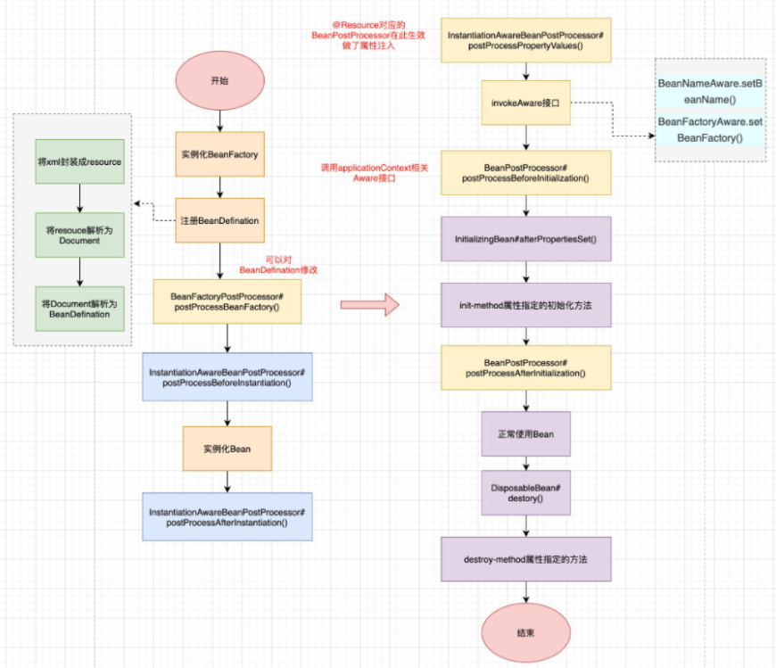
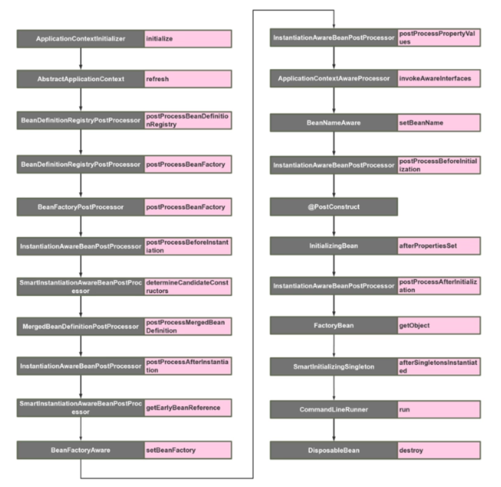
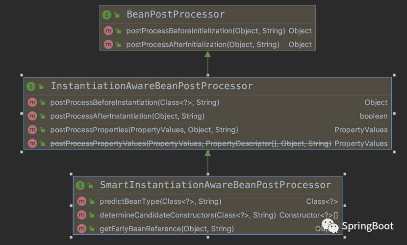
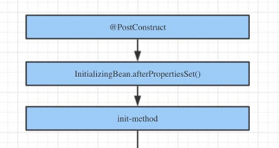
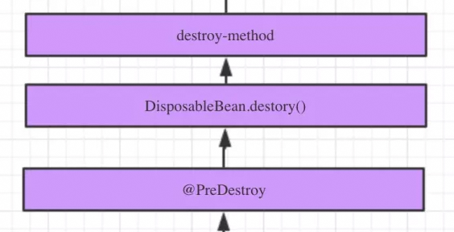
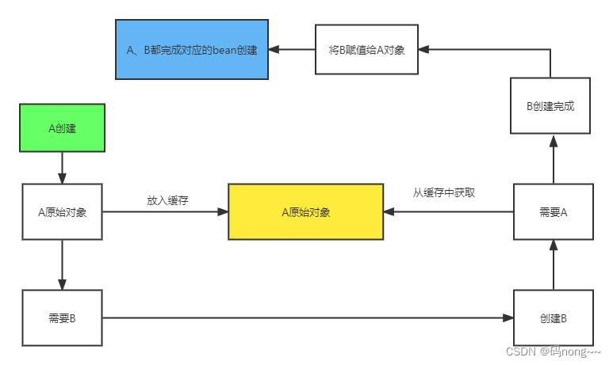
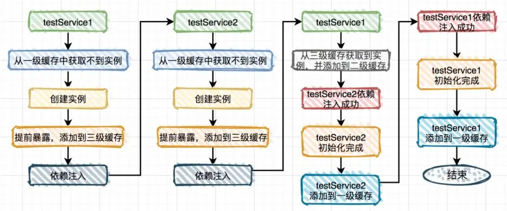

# 1、Spring 生命周期

Spring最重要的功能就是帮助程序员创建对象（也就是IOC），而启动Spring就是为创建Bean对象做准备，所以我们先明白Spring到底是怎么去创建Bean的，也就是先弄明白Bean的生命周期。

Bean的生命周期就是指：**在Spring中，一个Bean是如何生成的，如何销毁的**





## BeanDefinitionRegistryPostProcessor

BeanDefinitionRegistryPostProcessor继承自BeanFactoryPostProcessor接口，**在标准的注册完成之后（解析xml或者注解），在与实例化对象之前，通过这个接口可以向beanDefinitionMap中注册自定义的beanDefinition**。

需要注意的是，这里仅仅是注册及定义bean，并没有创建及初始化。

```java
@Component
public class MyBeanDefinitionRegistryPostProcessor implements BeanDefinitionRegistryPostProcessor {
    @Override
    public void postProcessBeanDefinitionRegistry(BeanDefinitionRegistry registry) throws BeansException {
　　　　　//BeanDefinitionRegistry可以给容器注册bean
        RootBeanDefinition rootBeanDefinition = new RootBeanDefinition(Foo.class);
        registry.registerBeanDefinition("helloFoo",rootBeanDefinition);
    }
}

```

## BeanFactoryPostProcessor

BeanFactoryPostProcessor 为spring在容器初始化时对外对外暴露的扩展点，Spring IoC容器允许BeanFactoryPostProcessor在容器加载**注册BeanDefinition完成之后，Bean实例化之前**，读取BeanDefinition(配置元数据)，并可以修改它。
```java
@FunctionalInterface
public interface BeanFactoryPostProcessor {

	/**
	 * 所有的BeanDefinition已经保存加载到beanFactory中，但bean的实例还没创建
    *
	 */
	void postProcessBeanFactory(ConfigurableListableBeanFactory beanFactory) throws BeansException;

}
```

**注意**：BeanFactoryPostProcessor可以在Bean实例化之前修改Bean的属性，但**不适合在BeanFactoryPostProcessor中做Bean的实例化**，这样会导致一些意想不到的副作用，就是不要把Spring玩坏了，若需要做Bean的实例化可以使用BeanPostProcessor。

BeanFactoryPostProcessor的典型应用:PropertyPlaceholderConfigurer

有时候我们在Spring的bean的描述文件中需要引入像properties配置文件中的数据，举个例子:

```xml
<bean id="black" class="com.ipluto.demo.BlackCat">
    <property name="name">
        <value>${cat.name}</value>
    </property>
</bean>
```

在访问BlackCat的时候，name属性就会被替换为配置文件中的值，这就是PropertyPlaceholderConfigurer的功能。

把PropertyPlaceholderConfigurer这个类间接继承了BeanFactoryPostProcessor接口,当Spring加载任何实现了这个接口的bean的配置时,都会在beanDefinition载入之后执行postProcessorBeanFactory方法.在PropertyPlaceholderConfigurer中实现了postProcessorBeanFactory方法,在方法中调用了mergeProperties(得到配置)、convertProperties(得到的配置转化为合适的类型)、processProperties(将配置内容告知BeanFactory)这3个方法.


## InstantiationAwareBeanPostProcessor

InstantiationAwareBeanPostProcessor代表了Spring的另外一段生命周期：**实例化**。先区别一下Spring Bean的实例化和初始化两个阶段的主要作用：

* **实例化**：是一个创建Bean的过程，即调用Bean的构造函数，单例的Bean放入单例池中
* **初始化**：是一个赋值的过程，即调用Bean的setter，设置Bean的属性

InstantiationAwareBeanPostProcessor接口继承BeanPostProcessor接口，主要作用在于目标对象的实例化过程中需要处理的事情，包括实例化对象的前后过程以及实例的属性设置。

```java

public interface InstantiationAwareBeanPostProcessor extends BeanPostProcessor {

	/**
	* postProcessBeforeInstantiation方法是最先执行的方法，它在目标对象实例化之前调用，
	* 该方法的返回值类型是Object，我们可以返回任何类型的值。由于这个时候目标对象还未实例化，
	* 所以这个返回值可以用来代替原本该生成的目标对象的实例(比如代理对象)。如果该方法的返回值
	* 代替原本该生成的目标对象，后续只有postProcessAfterInitialization方法会调用，其它
	* 方法不再调用；否则按照正常的流程走
	* /
	default Object postProcessBeforeInstantiation(Class<?> beanClass, String beanName) throws BeansException {
		return null;
	}

   /**
	* postProcessAfterInstantiation方法在目标对象实例化之后调用，这个时候对象已经被实例
	* 化，但是该实例的属性还未被设置，都是null。因为它的返回值是决定要不要调用
	* postProcessPropertyValues方法的其中一个因素（因为还有一个因素是
	* mbd.getDependencyCheck()）；如果该方法返回false,并且不需要check，那么
	* postProcessPropertyValues就会被忽略不执行；如果返回true，
	* postProcessPropertyValues就会被执行
	* /
	default boolean postProcessAfterInstantiation(Object bean, String beanName) throws BeansException {
		return true;
	}

	/**
	* 这个方法同样在是依赖注入的方法populateBean中执行的，但是不同的是，
	* 它是在其他属性全部依赖注入完成后执行的
	* /
	default PropertyValues postProcessProperties(PropertyValues pvs, Object bean, String beanName)
			throws BeansException {

		return null;
	}

  /**
	* postProcessPropertyValues方法对属性值进行修改(这个时候属性值还未被设置，但是我们可
	* 以修改原本该设置进去的属性值)。如果postProcessAfterInstantiation方法返回false，
	* 该方法可能不会被调用。可以在该方法内对属性值进行修改
	* 这个方法在spring低版本中使用，在高版本已经过时了，使用postProcessProperties代替
	* /
	@Deprecated
	@Nullable
	default PropertyValues postProcessPropertyValues(
			PropertyValues pvs, PropertyDescriptor[] pds, Object bean, String beanName) throws BeansException {

		return pvs;
	}

}
```


postProcessBeforeInstantiation方法通常用于抑制特定目标bean的默认实例化，返回要使用的代理。如果此方法返回非null对象，则bean创建过程将被短路（也就是正常bean实例化的后续流程不再执行）。

那么问题来了：

一般我们的Aop代理对象的生成都是在BeanPostProcessor 的postProcessAfterInitialization方法中：

```java
    /**
     * Create a proxy with the configured interceptors if the bean is
     * identified as one to proxy by the subclass.
     * @see #getAdvicesAndAdvisorsForBean
     */
    @Override
    public Object postProcessAfterInitialization(Object bean, String beanName) throws BeansException {
        if (bean != null) {
            Object cacheKey = getCacheKey(bean.getClass(), beanName);
            if (!this.earlyProxyReferences.contains(cacheKey)) {
                return wrapIfNecessary(bean, beanName, cacheKey);
            }
        }
        return bean;
    }
    ```

其中wrapIfNecessary就是生成代理对象的方法

那么InstantiationAwareBeanPostProcessor中的postProcessBeforeInstantiation也可能会返回代理对象是为什么呢？什么场景下会有这种需求呢？

同样在Spring AOP中，也有生成代理的：

```java

public Object postProcessBeforeInstantiation(Class<?> beanClass, String beanName) throws {

..................
    // Create proxy here if we have a custom TargetSource.
    // Suppresses unnecessary default instantiation of the target bean:
    // The TargetSource will handle target instances in a custom fashion.
    TargetSource targetSource = getCustomTargetSource(beanClass, beanName);
    if (targetSource != null) {
        if (StringUtils.hasLength(beanName)) {
            this.targetSourcedBeans.add(beanName);
        }
        Object[] specificInterceptors = getAdvicesAndAdvisorsForBean(beanClass, beanName, targetSource);
        Object proxy = createProxy(beanClass, beanName, specificInterceptors, targetSource);
        this.proxyTypes.put(cacheKey, proxy.getClass());
        return proxy;
    }

    return null;
}
```


## SmartInstantiationAwareBeanPostProcessor

SmartInstantiationAwareBeanPostProcessor 继承自InstantiationAwareBeanPostProcessor；新增了三个方法：



(1）getEarlyBeanReference

获得提前暴露的bean引用，**主要用于解决循环引用的问题**。

该触发点发生在postProcessAfterInstantiation之后，当有循环依赖的场景，当bean实例化好之后，为了防止有循环依赖，会提前暴露回调方法，用于bean实例化的后置处理。这个方法就是在提前暴露的回调方法中触发。

（2）determineCandidateConstructors

检测Bean的构造器，可以检测出多个候选构造器，再有相应的策略决定使用哪一个，如AutowiredAnnotationBeanPostProcessor实现将自动扫描通过@Autowired/@Value注解的构造器从而可以完成构造器注入>

该触发点发生在postProcessBeforeInstantiation之后，**用于确定该bean的构造函数**，返回的是该bean的所有构造函数列表。用户可以扩展这个点，来自定义选择相应的构造器来实例化这个bean。

（3）predictBeanType

预测Bean的类型，返回第一个预测成功的Class类型，如果不能预测返回null；当你调用BeanFactory.getType(name)时当通过Bean定义无法得到Bean类型信息时就调用该回调方法来决定类型信息；BeanFactory.isTypeMatch(name, targetType)用于检测给定名字的Bean是否匹配目标类型（如在依赖注入时需要使用）。

该触发点发生在postProcessBeforeInstantiation之前，这个方法**用于预测Bean的类型**，返回第一个预测成功的Class类型，如果不能预测返回null；当你调用BeanFactory.getType(name)时当通过bean的名字无法得到bean类型信息时就调用该回调方法来决定类型信息。


## MergedBeanDefinitionPostProcessor


```java

public interface MergedBeanDefinitionPostProcessor extends BeanPostProcessor {

	/**
	 *  传入了一个RootBeanDefinition，允许我们修改bean的定义
	 */
	void postProcessMergedBeanDefinition(RootBeanDefinition beanDefinition, Class<?> beanType, String beanName);

	/**
	 * 
	 */
	default void resetBeanDefinition(String beanName) {
	}

}

```


只要是收集bean上的属性的，比如收集标记了某些注解的字段或者方法，都可以基于MergedBeanDefinitionPostProcessor来进行扩展。
这个机制大量运用于收集类的某些属性，@Value、@NacosValue、mybatis的@org.apache.ibatis.annotations.Mapper等。
AutuwiredAnnotationBeanPostProcessor通过实现这个方法检查并注册需要注入的成员。

## Aware接口

Aware 翻译过来可以理解为"察觉的；注意到的；感知的" ，XxxxAware 也就是对Xxxx感知的。

Spring 的依赖注入最大亮点就是所有的 Bean 对 Spring 容器的存在是没有意识的，但是在实际项目中，我们不可避免的要用到 Spring 容器本身提供的资源，这时候要让 Bean 主动意识到 Spring 容器的存在，才能调用 Spring 所提供的资源，这就是 Spring Aware。 


先举个BeanNameAware的例子，实现BeanNameAware接口，可以让该Bean感知到自身的BeanName（对应Spring容器的BeanId属性）属性：

BeanNameAware接口的定义

```java
public interface BeanNameAware extends Aware {
      void setBeanName(String name);
}
```

同理，其他的Aware接口也是为了能够感知到自身的一些属性。
比如实现了ApplicationContextAware接口的类，能够获取到ApplicationContext，实现了BeanFactoryAware接口的类，能够获取到BeanFactory对象。

常见的Aware接口：
* **BeanNameAware**: 访问BeanName.比如说，一个userService,你想知道它在运行时期的BeanName,可以通过这个方式访问。
* **BeanFactoryAware**: 访问BeanFactory.
* **ApplicationContextAware**: 访问容器上下文本身，即ApplicationContext.
* **MessageSourceAware**: 访问容器中的MessageSource.
* **EnvironmentAware**: 访问容器中的Environment,可以设置当前component的环境变量.
* **ApplicationEventPublisherAware**: 访问该对象在容器中的事件推送者对象。
* **ResourceLoaderAware**: 可以获取容器加载资源的ResourceLoader.不同容器可能会用不同的ResourceLoader.所以使用的时候最好用instanceof来判断一下。

**BeanFactoryAware、ApplicationContextAware、BeanNameAware，三者在填充常规bean属性之后的初始化回调（例如InitializingBean.afterPropertiesSet（）或自定义init-method）之前调用。**

其实 Spring Aware 是 Spring 设计为框架内部使用的，若使用了，你的 Bean 将会和 Spring 框架耦合，所以**大多数情况下应避免使用任何Aware接口**。

## BeanPostProcessor

该接口我们也叫**Bean后置处理器**，作用是在Bean对象在**实例化和依赖注入完毕后**，在**显式调用初始化方法的前后**添加我们自己的逻辑。

```java
public interface BeanPostProcessor {

    /**
    * 实例化、依赖注入完毕，在调用显示的初始化之前,完成一些定制的初始化任务
    * 注意：方法返回值不能为null
    */
	default Object postProcessBeforeInitialization(Object bean, String beanName) throws BeansException {
		return bean;
	}

	/**
    * 实例化、依赖注入、初始化完毕后执行 
    * 注意：方法返回值不能为null
    */
	default Object postProcessAfterInitialization(Object bean, String beanName) throws BeansException {
		return bean;
	}

}

```

如果有多个BeanPostProcessor，在默认情况下Spring容器会根据后置处理器的定义顺序来依次调用。

通过让BeanPostProcessor接口实现类实现Ordered接口getOrder方法，该方法返回一整数，默认值为 0，优先级最高，值越大优先级越低。


## InitializingBean

当一个类实现这个接口之后，Spring启动后，初始化Bean时，若该Bean实现InitialzingBean接口，会自动调用`afterPropertiesSet()`方法，完成一些用户自定义的初始化操作。

```java

public interface InitializingBean {

    void afterPropertiesSet() throws Exception;

}
```

同样配置Bean的时候使用init-method也可以实现类似的操作。

在spring初始化bean的时候，如果该bean是实现了InitializingBean接口，并且同时配置文件中指定了init-method，系统则是**先调用afterPropertiesSet方法，然后在调用init-method中指定的方法**。

Spring是通过反射来调用init-method指定方法，而实现InitializingBean接口是直接调用afterPropertiesSet方法，所以后者效率高，但使用init-method方式减少了对Spring的依赖

如果调用afterPropertiesSet方法时报错，则不会再调用init-method指定的方法。

第3种方法是通过`@PostConstruct`。

以上就是三种初始化 Spring Beans 的方式，我们在框架中看到过三种方式在组合使用，那么组合使用的调用顺序是什么呢？



## SmartInitializaingSingleton

SmartInitializingSingleton主要用于在IoC容器基本启动完成时进行扩展，这时**非Lazy的Singleton都已被初始化完成**。所以，在该扩展点执行ListableBeanFactory#getBeansOfType()等方法**不会出现因过早加载Bean出现副作用**。这个扩展点Spring 4.1开始引入，其定义如下：

```java

public interface SmartInitializingSingleton {
 void afterSingletonsInstantiated();
}
```

这个扩展点，可能和我们平时采用事件监听机制`ApplicationListener<ContextRefreshedEvent>`监听容器启动完成事件功能很类似。 

Spring中有个SmartInitializingSingleton接口实现类：`EventListenerMethodProcessor`，主要用于完成`@EventListener`注解方式的事件监听。

在Spring中需要监听某个事件常规方式是实现ApplicationListener接口，Spring IoC容器启动时自动会收集系统中所有ApplicationListener资料，并将其注册到Spring的事件广播器上，采用典型的订阅/发布模式。Spring 4.2引入了@EventListener注解方式，可以更加方便的对事件进行监听，使用方式如下如下，只需要在方法上使用@EventListener注解，并在方法参数上指定需要监听的事件类型即可。


## DisposableBean

该接口的作用是：允许在容器销毁该bean的时候获得一次回调。DisposableBean接口也只规定了一个方法：

```java

public interface DisposableBean {
	void destroy() throws Exception;
}

```

我们可以通过实现 DisposableBean 接口，在其唯一方法 destroy 内完成 bean 销毁的工作，但是 Spring Framework 官方并不建议我们通过这种方法来销毁 bean，这同样是一种强耦合的方式，我们看到框架层面才会用到这个方法。

`@PreDestroy`注解是 Spring 非常提倡的一种方式，我们通常将其标记在方法上即可，通常习惯将这个方法起名为 destory()。

还可以通过XML配置`destroy-method`来指定销毁方法。

以上三种 Bean 的销毁方式也是可以组合使用的，那么组合在一起的调用顺序是什么呢？




# 2、核心接口

## ApplicationContextInitializer

### 概述

ApplicationContextInitializer是Spring框架原有的东西，这个类的主要作用就是在ConfigurableApplicationContext类型(或者子类型)的**ApplicationContext做refresh之前**，允许我们对ConfiurableApplicationContext的实例做进一步的设置和处理。

```java

public interface ApplicationContextInitializer<C extends ConfigurableApplicationContext> {

	/**
	 * Initialize the given application context.
	 * @param applicationContext the application to configure
	 */
	void initialize(C applicationContext);

}

```

### 应用实例

该接口典型的应用场景是web应用中需要编程方式对应用上下文做初始化。比如，注册属性源(property sources)或者针对上下文的环境信息environment激活相应的profile。

在一个Springboot应用中，classpath上会包含很多jar包，有些jar包需要在`ConfigurableApplicationContext#refresh()`调用之前对应用上下文做一些初始化动作，因此它们会提供自己的ApplicationContextInitializer实现类，然后放在自己的`META-INF/spring.factories`属性文件中，这样相应的ApplicationContextInitializer实现类就会被`SpringApplication#initialize`发现。

SpringBoot默认`META-INF/spring.factories`中的ApplicationContextInitializer配置如下:

```properties
org.springframework.context.ApplicationContextInitializer=\
org.springframework.boot.context.ConfigurationWarningsApplicationContextInitializer,\
org.springframework.boot.context.ContextIdApplicationContextInitializer,\
org.springframework.boot.context.config.DelegatingApplicationContextInitializer,\
org.springframework.boot.rsocket.context.RSocketPortInfoApplicationContextInitializer,\
org.springframework.boot.web.context.ServerPortInfoApplicationContextInitializer
```

其中，DelegatingApplicationContextInitializer的作用是：使用环境属性`context.initializer.classes`指定的初始化器(initializers)进行初始化工作，如果没有指定则什么都不做：

```java

public class DelegatingApplicationContextInitializer
       implements ApplicationContextInitializer<ConfigurableApplicationContext>, Ordered {

   private static final String PROPERTY_NAME = "context.initializer.classes";

   private int order = 0;

   @Override
   public void initialize(ConfigurableApplicationContext context) {
       ConfigurableEnvironment environment = context.getEnvironment();
       List<Class<?>> initializerClasses = getInitializerClasses(environment);
       if (!initializerClasses.isEmpty()) {
           applyInitializerClasses(context, initializerClasses);
       }
   }
```

从上面的部分代码可见，实现了**Ordered**接口时，该initializer的order为0，也就是说使用DelegatingApplicationContextInitializer方式进行包装配置的初始化器将会最先被加载。

以上都是SpringBoot内置的上文启动器，可见Spring留出的这个钩子，被SpringBoot发扬光大了。
实际上不仅于此，SpringBoot对Spring Framework的事件监听机制也都有大量的应用。

ApplicationContextInitializer是Spring留出来允许我们在上下文刷新之前做自定义操作的钩子，若我们有需求想要深度整合Spring上下文，借助它不乏是一个非常好的实现。

随便浏览一下SpringBoot的源码可知，它对Spring特征特性的使用，均是非常的流畅且深度整合的。所以说SpringBoot易学难精的最大拦路虎：其实是对Spring Framework系统性的把握~

Tips：spring-test包里有个注解org.springframework.test.context.ContextConfiguration它有个属性可以指定ApplicationContextInitializer辅助集成测试时候的自定义对上下文进行预处理。

### 使用方法

ApplicationContextInitializer的使用有以下3中方式：

(1)在启动类中使用SpringApplication.addInitializers() 手动增加Initializer：

```java
     SpringApplication springApplication = new SpringApplication(WebsocketApplication.class);
     springApplication.addInitializers(new MyInitializer());
     springApplication.run(args);

```

(2) application.properties添加配置方式

在分析缺省的initializer时，提到了DelegatingApplicationContextInitializer,可以使用该类来添加我们自己的initializers

添加如下的配置properties中即可：

 ```properties
 context.initializer.classes=com...MyInitializer
```

(3) 可以参照SpringBoot缺省的Initializer，

将MyInitializer配置在spring.factories文件中:

```propertiesorg.springframework.context.ApplicationContextInitializer=com...MyInitializer
```


上述几种方式ApplicationContextInitializer的执行顺序：

(1)如果我们通过DelegatingApplicationContextInitializer委托来执行我们自定义的ApplicationContextInitializer，那么我们自定义的ApplicationContextInitializer的顺序一定是在系统自带的其他ApplicationContextInitializer之前执行。

(2)如果我们通过SpringApplication实例对象调用addInitializers方法加入自定义的ApplicationContextInitializer，那么spring-boot自带的ApplicationContextInitializer会先按顺序执行，再执行我们手动添加的自定义ApplicationContextInitializer(按照添加顺序执行)，最后执行spring-boot自带的其他ApplicationContextInializer

(3)如果我们创建自己的spring.factories文件，添加配置加入我们自定义的ApplicationContextInitializer，那么我们自定义的ApplicationContextInitializer会和spring-boot自带的ApplicationContextInitializer放在一起进行排序执行


## ApplicationContext#refresh

**refresh方法是 Spring Bean 加载的核心**，用于刷新整个Spring 上下文信息，定义了整个 Spring 上下文加载的流程。

该方法定义在抽象类 AbstractApplicationContext 当中 ，子类可以覆盖重写父类中的方法。例如Spring Boot中ServletWebServerApplicationContext 就是覆盖了onRefresh方法，完成refresh方法后启动webServer的功能。

```java
public void refresh() throws BeansException, IllegalStateException {
    synchronized(this.startupShutdownMonitor) {
        
        /**
        * 进行环境的准备，置启动时间，初始化属性源(property source)配置，创建
        * Environment 环境对象
        * 
        */
        this.prepareRefresh();
         
        /** 
        * 通过 refreshBeanFactory 重置 AbstractApplicationContext 持有的
        * BeanFactory，然后通过 getBeanFactory 获取该对象并返回。
        * XML配置，注解配置等会被解析，生成BeanDefinition
        */ 
        ConfigurableListableBeanFactory beanFactory = this.obtainFreshBeanFactory();

        /** 对beanFactory进行各种功能填充：
        * 对SPEL语言的支持，StandardBeanExpressionResolver
        * 增加属性编辑器的支持，ResourceEditorRegistrar，完成${}解析
        * 增加对一些Aware接口的支持，如EnvironmentAware、MessageSourceAware的注入
        * 等
        * 
        this.prepareBeanFactory(beanFactory);
​
        try {
        
            /**
            * 所有 Bean 的定义已经加载完成，但是没有实例化，这一步可以修改 bean 定义或者
            * 增加自定义的 bean
            * /
            this.postProcessBeanFactory(beanFactory);
            
             /** 
             * 在 Spring 容器中找出实现了 BeanFactoryPostProcessor 接口的 Bean 
             * 并执行。Spring 容器会委托给 PostProcessorRegistrationDelegate 的 
             * invokeBeanFactoryPostProcessors 方法执行。
             * /
            this.invokeBeanFactoryPostProcessors(beanFactory);
            
            //注册拦截Bean创建的Bean处理器，这里只是注册，真正的调用实在getBean时候 
            /** 
            * 从 Spring 容器中找出的 BeanPostProcessor 接口的 Bean，并添加到 
            * BeanFactory 中，以便后续 Bean 被实例化的时候调用这个 
            * BeanPostProcessor进行回调处理。该方法委托给了
            * PostProcessorRegistrationDelegate 类执行。
            * 例如： 
            * (1)AutowiredAnnotationBeanPostProcessor，解析@Autowired @Value
            * (2)ConmmonAnnotaitionBeanPostProcessor，解析 @Resource 
            * @PostConstruct @PreDestroy
            * (3)AnnotationAwareAspectjAutoProxyCreator，
            * 为符合切点目标Bean自动创建代理
            * 注意：这里只是注册，真正的调用实在getBean时候
            * /
            this.registerBeanPostProcessors(beanFactory);

            /** 
            * 为上下文初始化Message源，即不同语言的消息体，国际化处理 
            * /
            this.initMessageSource();

            /** 
            * 初始化应用消息广播器，并放入“applicationEventMulticaster”bean中
            * /
            this.initApplicationEventMulticaster();
           
            /** 
            * 可用于 refresh 动作的扩展，默认为空实现。
            * 在 SpringBoot 中主要用于启动内嵌的 Web 服务器  
            * /
            this.onRefresh();
            
            /** 
            * 注册监听器，找出系统中的 ApplicationListener 对象，
            * 注册到时间广播器中。如果有需要提前进行广播的事件，则执行广播。
            * /
            this.registerListeners();

            /** 
            * 实例化 BeanFactory 中已经被注册但是未实例化的所有实例，
            * 懒加载的不需要实例化
            * /
            this.finishBeanFactoryInitialization(beanFactory);
            
            /** 
            * 完成刷新过程，通知生命周期处理器lifecycleProcessor刷新过程，
            * 同时发出ContextRefreshEvent通知 
            * /
            this.finishRefresh();
            
        } catch (BeansException var9) {
            if (this.logger.isWarnEnabled()) {
                this.logger.warn("Exception encountered during context initialization - cancelling refresh attempt: " + var9);
            }
​
​            /** 
​            * 销毁已经创建的单例bean
​            */   
            this.destroyBeans();
            
            /** 
​            * Reset 'active' flag.
​            */
            this.cancelRefresh(var9);
            
            throw var9;
        } finally {
            this.resetCommonCaches();
        }
​
    }
}


```


## ApplicationContext#registerShutdownHook


在基于web的ApplicationContext实现中，已有相应的实现来处理关闭web应用时恰当地关闭Spring IoC容器。如果你正在一个非web应用的环境下使用Spring的IoC容器，如dubbo服务，你想让容器优雅的关闭，并调用singleton的bean相应destory回调方法，你需要在JVM里注册一个“关闭钩子”（shutdown hook）。这一点非常容易做到，并且将会确保你的Spring IoC容器被恰当关闭，以及所有由单例持有的资源都会被释放。

为了注册“关闭钩子”，你只需要简单地调用在`org.springframework.context.support.AbstractApplicationContext`实现中的`registerShutdownHook()`方法即可。

```java


public void registerShutdownHook() {
    if (this.shutdownHook == null) {
        // No shutdown hook registered yet.
        this.shutdownHook = new Thread() {
            @Override
            public void run() {
                synchronized (startupShutdownMonitor) {
                    doClose();
                }
            }
        };
        // 也是通过这种方式来添加
        Runtime.getRuntime().addShutdownHook(this.shutdownHook);
    }
```

JVM也提供了类似的关闭钩子`Runtime.addShutDownHook()`。

## CommandLineRunner、ApplicationRunner

在应用程序开发过程中，往往需要在容器启动的时候执行一些操作。

CommandLineRunner、ApplicationRunner 接口是在**容器启动成功后的最后一步回调**（类似开机自启动）。如果存在多个需要加载的数据，可以使用`@Order`注解来排序。

```java

@Component
@Order(value = 2)
public class MyStartupRunner1 implements CommandLineRunner {
    @Override
    public void run (String... strings) throws Exception {
        System.out.println(">>>>>>>>>>>>>>>服务启动执行，执行加载数据等操作 MyStartupRunner1 order 2 <<<<<<<<<<<<<");
    }
}

@Component
@Order(value = 1)
public class MyStartupRunner2 implements CommandLineRunner {
    @Override
    public void run (String... strings) throws Exception {
        System.out.println(">>>>>>>>>>>>>>>服务启动执行，执行加载数据等操作 MyStartupRunner2 order 1 <<<<<<<<<<<<<");
    }
}

```

ApplicationRunner与CommandLineRunner做的事情是一样的，也是在服务启动之后其run()方法会被自动地调用，唯一不同的是A**pplicationRunner会封装命令行参数**，可以很方便地获取到命令行参数和参数值。


## FactoryBean

一般情况下，Spring通过反射机制利用bean的class属性指定实现类来实例化bean 。

在某些情况下，实例化bean过程比较复杂，如果按照传统的方式，则需要在bean中提供大量的配置信息，配置方式的灵活性是受限的，这时采用编码的方式可能会得到一个简单的方案。

此外，当我们使用第三方框架或者库时，有时候是无法去new一个对象的，比如静态工厂，对象是不可见的，只能通过getInstance（）之类方法获取，此时就需要用到FactoryBean,通过实现FactoryBean接口的bean重写getObject（）方法，
返回我们所需要的bean对象。

Spring为此提供了一个`org.Springframework.bean.factory.FactoryBean`的工厂类接口，用户可以通过实现该接口定制实例化bean的逻辑。

```java
public interface FactoryBean<T> {

    /**
    * 用来创建Bean。当IoC容器通过getBean方法来FactoryBean创建的实例时,
    * 实际获取的不是FactoryBean 本身而是具体创建的T泛型实例
    */
    T getObject() throws Exception;

    /**
    * 获取 T getObject()中的返回值 T 的具体类型。
    * 这里强烈建议如果T是一个接口，返回其具体实现类的类型
    */
    Class<?> getObjectType();

    /**
    * 用来规定 Factory创建的的bean是否是单例。默认为单例
    */
    boolean isSingleton();
}
```

后面Spring又提供了`@Configration`和`@Bean`这种方式，一定程度上可以替代FactoryBean。


## ProxyBean
spring 动态代理ProxyFactory其实封装了 CGLIB和JDK，他会自动判断用那种动态代理，所以开发过程中可以直接使用Spring的动态代理会更加方便。


AOP 中 ProxyFactory 的子类有 ProxyCreatorSupport、AdvisedSupport、ProxyConfig。其中核心是 **ProxyCreatorSupport**，此类主要初始化了具体动态代理方案。其他 AdvisedSupport、ProxyConfig 主要是围绕 AOP 相关配置进行封装。

ProxyFactory 基本涵盖了 Spring AOP 的基本实现。了解完成 ProxyFactory 后可以进入了解 ProxyFactoryBean，**ProxyFactoryBean** 进而结合 FactoryBean 功能可以方便使用已经注册在容器内部的实现类。


## 循环依赖与三级缓存

### 什么是循环依赖

体现到代码层次就是这个样子：

```java

@Component
public class A {
    // A中注入了B
    @Autowired
    private B b;
}

@Component
public class B {
    // B中也注入了A
    @Autowired
    private A a;
}

```

在普通的代码中，对象之间有依赖是很正常的，但是在Spring中，Bean对象的创建是要经过一系列的生命周期的。

Bean的主要生命周期（创建过程）如下：

1. Spring扫描加了特殊注解（@Bean、@Component…）的类，得到对应的BeanDefinition
2. 根据BeanDefinition生成对应bean
3. 根据class判断类的构造方法
4. 根据推断出来的构造方法，通过反射，得到一个对象（原始对象【未进行依赖注入、AOP等操作】）
5. 填充原始对象中的属性（依赖注入）【加了@AutoWired】
6. 如果原始对象中的某个方法被AOP（增强）了，则需要根据原始对象生成一个代理对象
7. 把最终生成的代理对象放入单例池（singletonObjects），下次我们需要获取bean中，就可以直接从单例池中获取。【类比数据库连接池】

那么在第4步通过构造方法反射时，就容易出现问题：比如上文说的A，A类中存在一个B类的b属性。
1、在A类生成了一个原始对象时，就会给b属性赋值，此时就需要B类的对象，那么Spring就会根据b属性的类型和属性名去BeanFactory获取B类对应的单例Bean。
2、如果BeanFactory中存在B类对应的bean，则直接拿来赋值，那么就不会产生循环依赖。但是如果BeanFactory不存在B类对应的bean（B类的一个对象），那么就需要生成B类的对象，就会经历B的生命周期，但是在创建B的bean过程中，B又依赖A，此时又需要获取A类对应的bean，而此时A类的bean还在创建过程中，于是就出现了循环依赖。

主要过程：
A(bean)创建-》依赖B-》创建B（bean）-》B依赖A（A的bean还在创建过程中）


### 什么情况下循环依赖可以被处理

其中，有些循环依赖，Spring可以帮我们解决，但是有些就只能靠我们手动解决。

**Spring解决循环依赖的前置条件**：

* 出现循环依赖的Bean必须要是单例
* 依赖注入的方式不能全是构造器注入的方式（**并非只能解决setter方法的循环依赖**）

其中第一点应该很好理解，第二点：不能全是构造器注入是什么意思呢？我们还是用代码说话：

```java

@Component
public class A {

    @Autowired
    public A(B b) {

    }
}


@Component
public class B {

    @Autowired
    public B(A a){

    }
}

```
在上面的例子中，A中注入B的方式是通过构造器，B中注入A的方式也是通过构造器，这个时候循环依赖是无法被解决，如果你的项目中有两个这样相互依赖的Bean，在启动时就会报出以下错误：

```
Caused by: org.springframework.beans.factory.BeanCurrentlyInCreationException: Error creating bean with name 'a': Requested bean is currently in creation: Is there an unresolvable circular reference?
```

而如果改为：A中注入B的方式为setter方法，B中注入A的方法为构造器，则不会报错。也就是说，即使存在构造器注入的场景下，循环依赖依然**可能**被被正常处理掉。但是仅限于这种简单的测试环境：A可以保证一定先于B实例化。


### Spring是如何解决的循环依赖

Spring采用**三级缓存机制**，帮助我们解决了**部分的**循环依赖问题。

* 一级缓存：**singletonObjects**，存的是已经经历了完整生命周期的bean对象。【完整生命周期】
* 二级缓存：**earlySingletonObjects**，存入的是还没经历完整个生命周期的bean对象【部分生命周期】
* 三级缓存：**singletonFactories**，缓存的是ObjectFactory对象工厂（用来创建某个对象的）


Spring在创建Bean的过程中分为三步：
1. 实例化：简单理解就是new了一个对象。对应AbstractAutowireCapableBeanFactory中的createBeanInstance方法
2. 属性注入：为实例化中new出来的对象填充属性，对应方法AbstractAutowireCapableBeanFactory的populateBean
3. 初始化：执行aware接口中的方法，初始化方法，完成AOP代理。对应方法AbstractAutowireCapableBeanFactory的initializeBean


关于循环依赖的解决方式应该要分两种情况来讨论：是否有AOP存在。

#### 没有AOP的循环依赖
 
产生循环依赖原因是：
A创建时— —>需要B— —>去创建B— —>需要A，于是产生了循环。

此时，我们通过加入缓存（中间人）来破循环，如下图所示： 


 

A的bean在创建过程中，在进行依赖注入之前，就先把A的原始对象放入缓存earlySingletonObjects（提早暴露，方便其他Bean获取），在将A放入缓存后再进行依赖注入，此时A的bean依赖了B的bean，如果发现此时BeanFactory中没有B的bean，则去创建。在创建B的bean时，需要A的bean，此时去一级缓存（单例池）中未获取到，去二级缓存（earlySingletonObjects）中拿到了A的原始对象【此时是A的原始对象，不是最终的bean，没有走完全部生命周期】，B的原始对象依赖注入完之后，B的生命周期结束，A的生命周期也结束。

B中提前注入了一个没有经过初始化的A类型对象不会有问题吗？

答：不会。

在整个过程中，都只有一个A的原始对象。虽然在创建B时会提前给B注入了一个还未初始化的A对象，但是在创建A的流程中一直使用的是注入到B中的A对象的引用，之后会根据这个引用对A进行初始化，所以这是没有问题的。

#### 有AOP的循环依赖

这时，可能有人会想，只需要一个缓存就能解决循环依赖了，那么为什么Spring中还要又第三级缓存singletonFactories呢？

**B依赖的A和最终的A不是同一个对象**，因为在一个bean的生命周期最后，Spring提供了BeanPostProcess，可以对bean进行加工，这个加工不仅而可以修改bean的属性值，还可以替换掉当前的bean：

```java
@Component
public class TestBeanPostProcessor implements BeanPostProcessor {

	@Override
	public Object postProcessAfterInitialization(Object bean, String beanName) throws BeansException {

        // 注意这里，生成了一个新的User对象
		if (beanName.equals("user")) {
			System.out.println(bean);
			User user = new User();//生成新的user对象
			return user;
		}

		return bean;
	}
}


```

因此，BeanPostProcessor完全可以替换掉某个beanName对应的bean对象。而BeanPostProcessor的执行时间在bean的属性注入之后，**循环依赖是发生在属性注入过程中的**，所以就有可能导致，**注入给B对象的A对象和经历过完整生命周期的A对象不是同一个对象**，这样就产生了问题。因为在对bean的属性注入时，Spring也不知道A对象后续会经过哪些BeanPostProcessor以及会对A对象进行什么处理。

AOP就是通过一个BeanPostProcessor来实现的，Spring中的AOP分为两种：JDK动态代理、CGLib的动态代理，一个使用的是接口，一个使用的是继承；所以如果给一个类的某个方法设置了切面，那么这个类最终就需要生成一个代理对象。

过程：A类 -> 生成一个普通A-> 属性注入 ->基于切面生成代理对象->把代理对象放入singletonObjects单例池

那么Spring是如何解决对象不一致的情况呢，这里就需要用到**三级缓存singletonFactories**。



首先，singletonFactories存的是某个beanName对应的ObjectFactory，在bean的生命周期中，生成完原始对象之后，就会构造一个ObjectFactory放入singletonFactoies中。**即使没有循环依赖，也会将其添加到三级缓存中**，而且是不得不添加到三级缓存中，因为到目前为止Spring也不能确定这个Bean有没有跟别的Bean出现循环依赖。

这个工厂的目的在于延迟对实例化阶段生成的对象的代理，只有真正发生循环依赖的时候，才去提前生成代理对象，否则只会创建一个工厂并将其放入到三级缓存中，但是不会去通过这个工厂去真正创建对象。

ObjectFactory是一个函数式接口，所以支持Lambda表达式：`()->getEarlyReference(beanName, mbd, bean)`，getEarlyBeanReference将返回一个代理后的对象，而不是实例化阶段创建的对象，这样就意味着B中注入的A将是一个代理对象而不是A的实例化阶段创建后的对象。


1. 从singletonFactories根据beanName得到ObjectFactory，然后执行其getEarlyBeanReference方法，此时会**得到A经过AOP后的代理对象**，然后将其放入earlySingletonObjects中，此时并没有将代理对象放入singletonObjects中
2. earlySingletonObjects作用：此时，我们只得到了A的代理对象，这个对象还不完整，因为还未进行属性注入，所以此时只能将A的代理对象放入earlySingletonObjects（singletonObjects单例池中放入的是全部生命周期后的bean），这样就能保证其他依赖了A对象的类获取到的就是同一个代理对象了。
3. 在B创建完之后，A继续进行生命周期，在A完成属性注入后，会按照本来的逻辑进行AOP，而此时A的原始对象已经经历过了AOP，所以对于A本身而言就不会再去进行AOP了。
4. 对于A而言，进行AOP判断以及BeanPostProcessor（AOP实现）执行后，需要将A对应的对象放入singletonObjects中，但是，此时应该是从earlySingletonObjects中得到A的代理对象，然后放入singletonObjects（单例池）中

至此，整个循环依赖解决完毕。


假设我们在这里直接使用二级缓存的话，那么意味着所有的Bean在这一步都要完成AOP代理。这样做有必要吗？

不仅没有必要，而且违背了Spring在结合AOP跟Bean的生命周期的设计！Spring结合AOP跟Bean的生命周期本身就是通过AnnotationAwareAspectJAutoProxyCreator这个后置处理器来完成的，在这个后置处理的postProcessAfterInitialization方法中对初始化后的Bean完成AOP代理。如果出现了循环依赖，那没有办法，只有给Bean先创建代理，但是没有出现循环依赖的情况下，设计之初就是让Bean在生命周期的最后一步完成代理而不是在实例化后就立马完成代理。

为什么要使用三级缓存呢？二级缓存能解决循环依赖吗？

答：如果要使用二级缓存解决循环依赖，意味着所有Bean在实例化后就要完成AOP代理，这样违背了Spring设计的原则，Spring在设计之初就是通过AnnotationAwareAspectJAutoProxyCreator这个后置处理器来在Bean生命周期的最后一步来完成AOP代理，而不是在实例化后就立马进行AOP代理。


## PropertyResourceConfigurer

Spring PropertyResourceConfigurer是一个抽象基类，继承自PropertiesLoaderSupport，并实现了接口BeanFactoryPostProcessor。它抽象了容器BeanFactory后置处理阶段对容器中所有bean定义中的属性进行配置的一般逻辑，属性配置所使用的属性来源是基类PropertiesLoaderSupport方法所规定的那些属性。

PropertyResourceConfigurer有两个实现子类:

* **PropertyOverrideConfigurer**：用于处理"{beanName}.{propName}={要替换的val}的格式在配置文件中定义信息，表达的含义就是替换bean名称为{beanName}的bean的属性{propName}的值为{要替换的val}"。PropertyOverrideConfigurer允许我们对 Spring 容器中配置的任何我们想处理的 bean 定义的 property 信息进行覆盖替换
* **PropertyPlaceholderConfigurer**：用于处理bean定义中"${name}"这样的占位符解析,从属性对象中"拉取(pull)"到bean定义的属性值中。在XML文件中用`${key}`替换指定的properties文件中的值，以及Java类中`@Value("${name}")`接取到properties文件中定义的变量，都是依靠PropertyPlaceholderConfigurer来实现


PropertyResourceConfigurer所抽象的逻辑主要体现在其方法 postProcessBeanFactory：

```java
	@Override
	public void postProcessBeanFactory(ConfigurableListableBeanFactory beanFactory) 
		throws BeansException {
		try {
			// 合并本地属性和外部指定的属性文件资源中的属性  
			Properties mergedProps = mergeProperties();

			// Convert the merged properties, if necessary.
			// 将属性的值做转换(仅在必要的时候做)  
			convertProperties(mergedProps);

			// Let the subclass process the properties.
			// 对容器中的每个bean定义进行处理，也就是替换每个bean定义中的属性中的占位符  
			processProperties(beanFactory, mergedProps);
		}
		catch (IOException ex) {
			throw new BeanInitializationException("Could not load properties", ex);
		}
	}


```

方法postProcessBeanFactory使用到了三个方法 :

* mergeProperties()：该方法由基类PropertiesLoaderSupport提供缺省实现,用于合并本地属性和外来属性为一个Properties对象;
* convertProperties(mergedProps)：该方法由PropertyResourceConfigurer自身提供缺省实现，用于对属性值做必要的转换处理，缺省不做任何处理；
* processProperties(beanFactory, mergedProps)：该方法由PropertyResourceConfigurer定义为抽象方法，所以需要由实现子类为其提供具体实现。不过其目的很明确，是对容器中每个bean定义中的属性进行处理。但具体处理是什么，就要看实现子类自身的设计目的了。比如实现子类PropertyOverrideConfigurer和实现子类PropertyPlaceholderConfigurer就分别有自己的bean定义属性处理逻辑。

