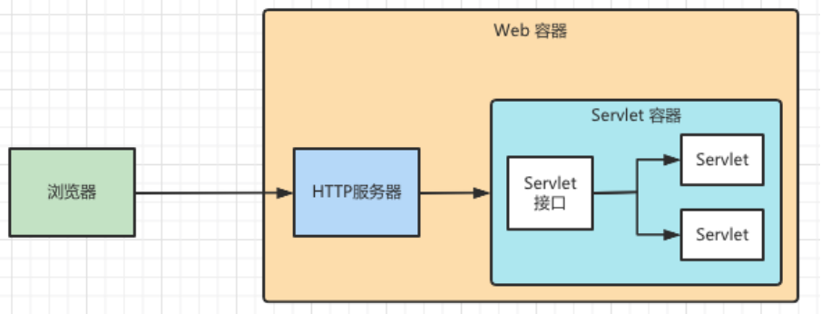
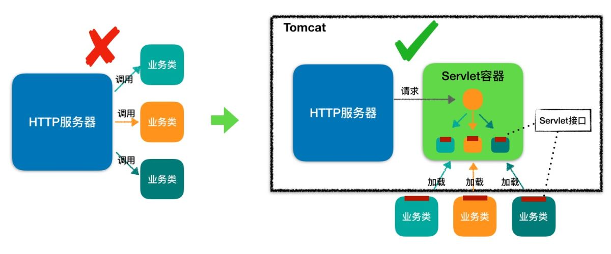
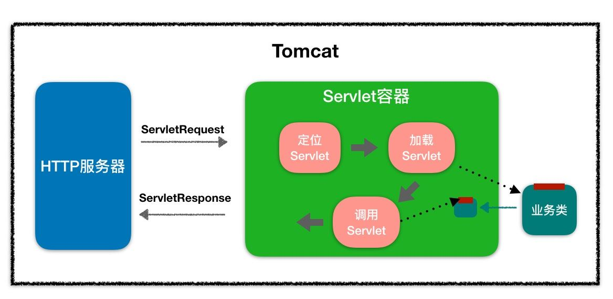
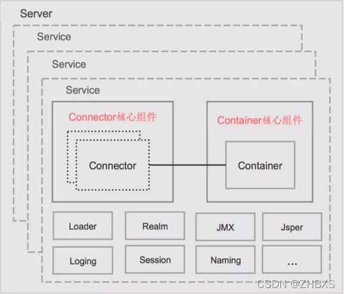
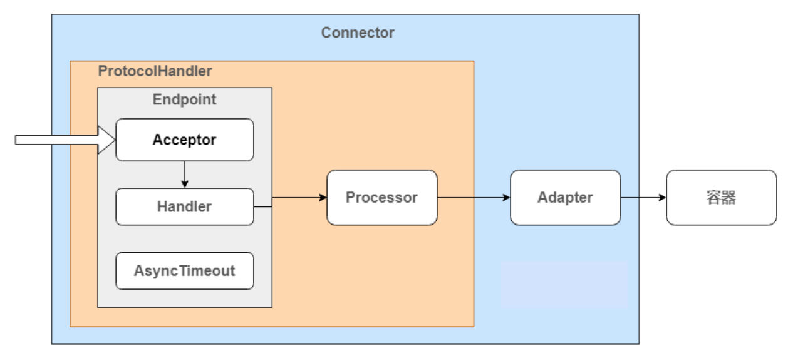
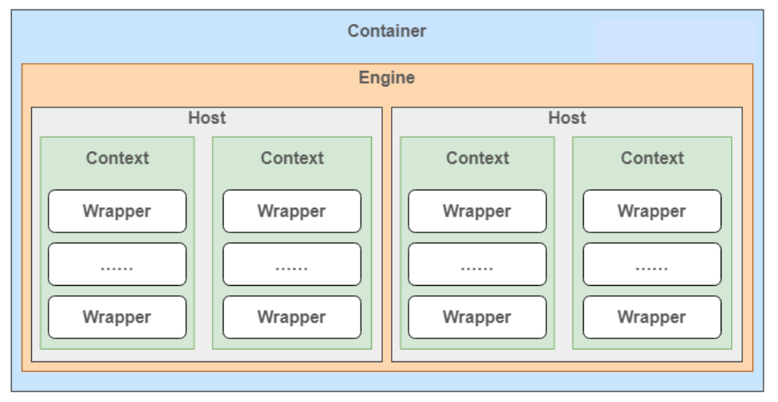
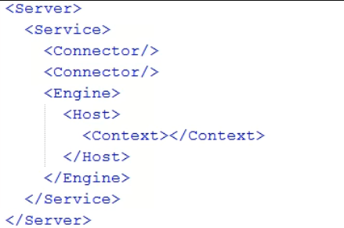
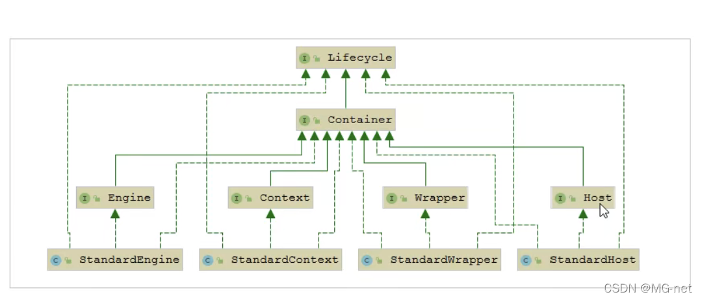
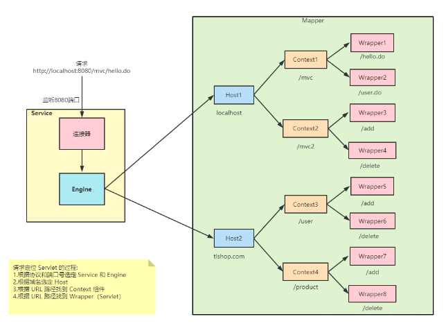
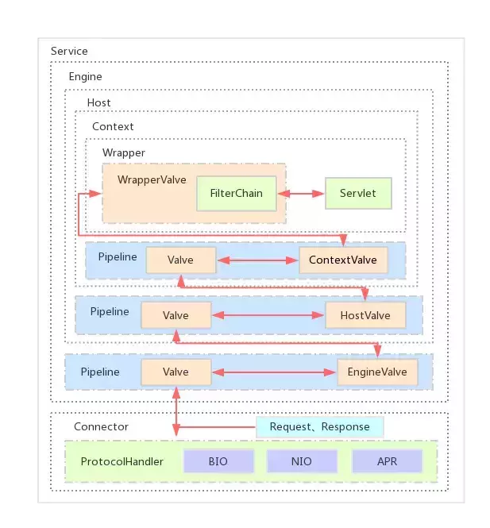

# 1、Web 容器

早期的 Web 应用主要用于浏览新闻等静态页面，HTTP 服务器（比如 Apache、Nginx）向浏览器返回静态 HTML，浏览器负责解析 HTML，将结果呈现给用户。

随着互联网的发展，我们已经不满足于仅仅浏览静态页面，还希望通过一些交互操作，来获取动态结果，因此也就需要一些扩展机制能够让 HTTP 服务器调用服务端程序。于是 Sun 公司推出了 Servlet 技术。你可以把 Servlet 简单理解为运行在服务端的 Java 小程序，但是 **Servlet 没有 main 方法，不能独立运行，因此必须把它部署到 Servlet 容器中，由容器来实例化并调用 Servlet**。



而 Tomcat 就是一个 Servlet 容器。为了方便使用，它还兼具了http服务器的功能，所以**Tomcat 就是一个“HTTP 服务器 + Servlet 容器”**，我们称之为 **Web 容器**。

# 2、Servlet规范

## 2.1 Servlet 接口

HTTP 服务器怎么知道要调用哪个 Java 类的哪个方法呢。最直接的做法是在 HTTP 服务器代码里写一大堆 if else 逻辑判断：如果是 A 请求就调 X 类的 M1 方法，如果是 B 请求就调 Y 类的 M2 方法。但这样做明显有问题，因为 HTTP 服务器的代码跟业务逻辑耦合在一起了，如果新加一个业务方法还要改 HTTP 服务器的代码。

那该怎么解决这个问题呢？我们知道，面向接口编程是解决耦合问题的法宝，于是有一伙人就定义了一个接口，各种业务类都必须实现这个接口，这个接口就叫 **Servlet 接口**，有时我们也把实现了 Servlet 接口的业务类叫作 Servlet。

对于Tomcat而言，它并不知道我们会有什么样的方法，这些都只是在项目被部署进webapp下后才确定的，由此分析，必然用到了**Java的反射来实现类的动态加载、实例化、获取方法、调用方法**。前提是我们部署到Tomcat的中的Web项目必须是按照规定好的Servlet 接口来进行编写，以便进行调用。

## 2.2 Servlet 容器

但是这里还有一个问题，对于特定的请求，HTTP 服务器如何知道由哪个 Servlet 来处理呢？Servlet 又是由谁来实例化呢？显然 HTTP 服务器不适合做这个工作，否则又和业务类耦合了。

于是，还是那伙人又发明了 **Servlet 容器**，Servlet 容器用来加载和管理业务类。HTTP 服务器不直接跟业务类打交道，而是把请求交给 Servlet 容器去处理，Servlet 容器会将请求转发到具体的 Servlet，如果这个 Servlet 还没创建，就加载并实例化这个 Servlet，然后调用这个 Servlet 的接口方法。因此 Servlet 接口其实是 Servlet 容器跟具体业务类之间的接口。下面我们通过一张图来加深理解。



Servlet 接口和 Servlet 容器这一整套规范叫作 **Servlet 规范**。Tomcat 和 Jetty 都按照 Servlet 规范的要求实现了 Servlet 容器，同时它们也具有 HTTP 服务器的功能。作为 Java 程序员，如果我们要实现新的业务功能，只需要实现一个 Servlet，并把它注册到 Tomcat（Servlet 容器）中，剩下的事情就由 Tomcat 帮我们处理了。

当客户请求某个资源时，HTTP 服务器会用一个 `ServletRequest` 对象把客户的请求信息封装起来，然后调用 Servlet 容器的 `service` 方法，Servlet 容器拿到请求后，根据请求的 URL 和 Servlet 的映射关系，找到相应的 Servlet，如果 Servlet 还没有被加载，就用反射机制创建这个 Servlet，并调用 Servlet 的 `init` 方法来完成初始化，接着调用 Servlet 的 `service` 方法来处理请求，把 `ServletResponse` 对象返回给 HTTP 服务器，HTTP 服务器会把响应发送给客户端。



Servlet 容器会实例化和调用 Servlet，那 Servlet 是怎么注册到 Servlet 容器中的呢？一般来说，我们是以 Web 应用程序的方式来部署 Servlet 的，而根据 Servlet 规范，Web 应用程序有一定的目录结构，在这个目录下分别放置了 Servlet 的类文件、配置文件以及静态资源，Servlet 容器通过读取配置文件，就能找到并加载 Servlet。Web 应用的目录结构大概是下面这样的：

```
| -  MyWebApp
      | -  WEB-INF/web.xml        -- 配置文件，用来配置Servlet等
      | -  WEB-INF/lib/           -- 存放Web应用所需各种JAR包
      | -  WEB-INF/classes/       -- 存放你的应用类，比如Servlet类
      | -  META-INF/              -- 目录存放工程的一些信息
```

Servlet 规范里定义了 `ServletContext` 这个接口来对应一个 Web 应用。Web 应用部署好后，Servlet 容器在启动时会加载 Web 应用，并为每个 Web 应用创建唯一的 `ServletContext` 对象。

你可以把 `ServletContext` 看成是一个全局对象，一个 Web 应用可能有多个 Servlet，这些 Servlet 可以通过全局的 `ServletContext` 来共享数据，这些数据包括 Web 应用的初始化参数、Web 应用目录下的文件资源等。

# 3、Tomcat架构


Tomcat主要组件：

* **Server**：指的就是整个 Tomcat 服务器，包含多组服务（Service），负责管理和启动各个Service，同时监听 8005 端口发过来的 shutdown 命令，用于关闭整个容器 。
* **Service**：每个 Service 组件都包含了若干用于接收客户端消息的 Connector 组件和处理请求的 Engine 组件。 Service 组件还包含了若干 Executor 组件，每个 Executor 都是一个线程池，它可以为 Service 内所有组件提供线程池执行任务。
* **Connector**：负责对外接收反馈请求。它是 Tomcat 与外界的交通枢纽，监听端口接收外界请求，并将请求处理后传递给容器做业务处理，最后将容器处理后的结果反馈给外界。
* **Container**：负责对内处理业务逻辑。其内部由Engine、Host、Context 和 Wrapper 四个容器组成，用于管理和调用 Servlet 相关逻辑。

Tomcat 还有其它重要的组件，如安全组件 security、logger 日志组件、session、mbeans、naming 等其它组件。这些组件共同为 Connector 和 Container 提供必要的服务。

**连接器Connector和容器Container是Tomcat的两大核心**。


## 3.1 Connector

Tomcat中有两个经典的Connector：

* **HTTP/1.1 Connector**：在端口8080处侦听来自客户Browser的HTTP请求
* **AJP/1.3 Connector**：在端口8009处侦听其他Web Server（其他的HTTP服务器）的Servlet/JSP请求。

**连接器对 Servlet 容器屏蔽了不同的应用层协议及 I/O 模型**，无论是 HTTP 还是 AJP，在容器中获取到的都是一个标准的 ServletRequest 对象。

Connector 最重要的功能就是接收连接请求然后分配线程让 Container 来处理这个请求，所以这必然是多线程的，**多线程的处理是 Connector 设计的核心**。

一个Connecter将在某个指定的端口上侦听客户请求，接收浏览器的发过来的 TCP 连接请求，创建一个 Request 和 Response 对象分别用于和请求端交换数据，然后会产生一个线程来处理这个请求并把产生的 Request 和 Response 对象传给处理Engine(Container中的一部分)，从Engine出获得响应并返回客户。为实现连接器的核心功能，我们需要一个通讯端点来监听端口；需要一个处理器来处理网络字节流；最后还需要一个适配器将处理后的结果转成容器需要的结构。对应的结构图如下：



* **Endpoint**：端点，用来处理 Socket 接收和发送的逻辑。其内部由 Acceptor 监听请求、Handler 处理数据、AsyncTimeout 检查请求超时。具体的实现有 NioEndPoint、AprEndpoint 等。
* **Processor**：处理器，负责构建 Tomcat Request 和 Response 对象。具体的实现有 Http11Processor、StreamProcessor 等。
* **Adapter**：适配器，实现 Tomcat Request、Response 与 ServletRequest、ServletResponse之间的相互转换。这采用的是经典的适配器设计模式。
* **ProtocolHandler**：协议处理器，将不同的协议和通讯方式组合封装成对应的协议处理器，如 Http11NioProtocol 封装的是 HTTP + NIO。

## 3.2 Container

容器，用来装载东西的器具，在 Tomcat 里，容器就是用来装载 Servlet 的。Tomcat 通过一种分层的架构，使得 Servlet 容器具有很好的灵活性。Tomcat 设计了 4 种容器，分别是 **Engine**、**Host**、**Context** 和 **Wrapper**。容器的设计用的是典型的责任链的设计模式，这四个组件是父子关系。



* **Engine**：引擎，Servlet 的顶层容器，用来管理多个虚拟站点，一个 Service 最多只能有一个 Engine；
* **Host**：虚拟主机，负责 web 应用的部署和 Context 的创建。可以给 Tomcat 配置多个虚拟主机地址，而一个虚拟主机下可以部署多个 Web 应用程序；
* **Context**：Web应用上下文，包含多个 Wrapper，负责 web 配置的解析、管理所有的 Web 资源。一个Context对应一个 Web 应用程序。
* **Wrapper**：表示一个 Servlet，最底层的容器，是对 Servlet 的封装，负责 Servlet 实例的创建、执行和销毁。

其实在server.xml中就包含了以上的各个组件和它们之间的关系：






# 4、Tomcat工作流程

## 4.1 Mapper

一个请求 URL 最后只会定位到一个 Wrapper 容器，也就是一个 Servlet。

Tomcat 是用 **Mapper 组件**来完成这个任务的。

Mapper 组件的功能就是将用户请求的 URL 定位到一个 Servlet，它的工作原理是：Mapper 组件里保存了 Web 应用的配置信息，其实就是容器组件与访问路径的映射关系，比如 Host 容器里配置的域名、Context 容器里的 Web 应用路径，以及 Wrapper 容器里 Servlet 映射的路径，你可以想象这些配置信息就是一个多层次的 Map。



当一个请求到来时，Mapper 组件通过解析请求 URL 里的域名和路径，再到自己保存的 Map 里去查找，就能定位到一个 Servlet。

## 4.2 Pipeline-Valve

Container使用**Pipeline-Valve管道**来处理请求。

Pipeline-Valve 是责任链模式，责任链模式是指在一个请求处理的过程中有很多处理者依次对请求进行处理，每个处理者负责做自己相应的处理，处理完之后将再调用下一个处理者继续处理。

Pipeline 中维护了 Valve 链表，Valve 可以插入到 Pipeline 中，对请求做某些处理。整个调用链的触发是 Valve 来完成的，Valve 完成自己的处理后，调用 `getNext.invoke()` 来触发下一个 Valve 调用。每一个容器都有一个 Pipeline 对象，只要触发这个 Pipeline 的第一个 Valve，这个容器里 Pipeline 中的 Valve 就都会被调用到。

**Basic Valve** 处于 Valve 链表的末端，它是 Pipeline 中必不可少的一个 Valve，负责调用下层容器的 Pipeline 里的第一个 Valve。

Valve 和 Filter 的区别：Valve 是 Tomcat 的私有机制，与 Tomcat 的基础架构 /API 是紧耦合的。Servlet API 是公有的标准，所有的 Web 容器包括 Jetty 都支持 Filter 机制。 Valve 工作在 Web 容器级别，拦截所有应用的请求；而 Servlet Filter 工作在应用级别，只能拦截某个 Web 应用的所有请求。



当所有的Pipeline-Valve都执行完之后，并且处理完了具体的请求，这个时候就可以将返回的结果交给Connector了，Connector在通过Socket的方式将结果返回给客户端。
