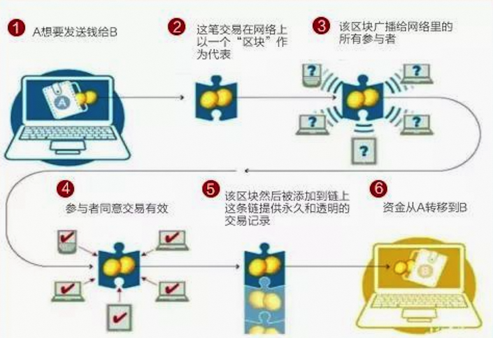
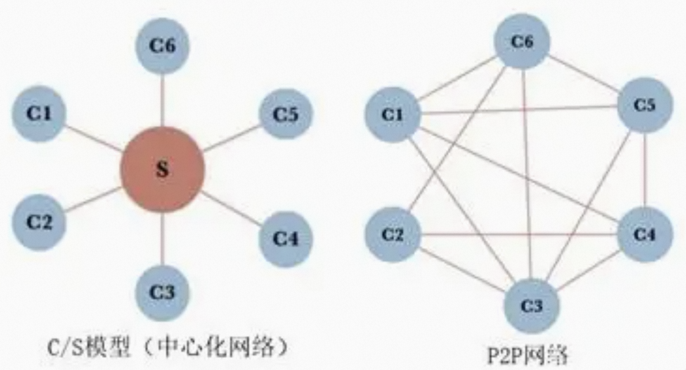
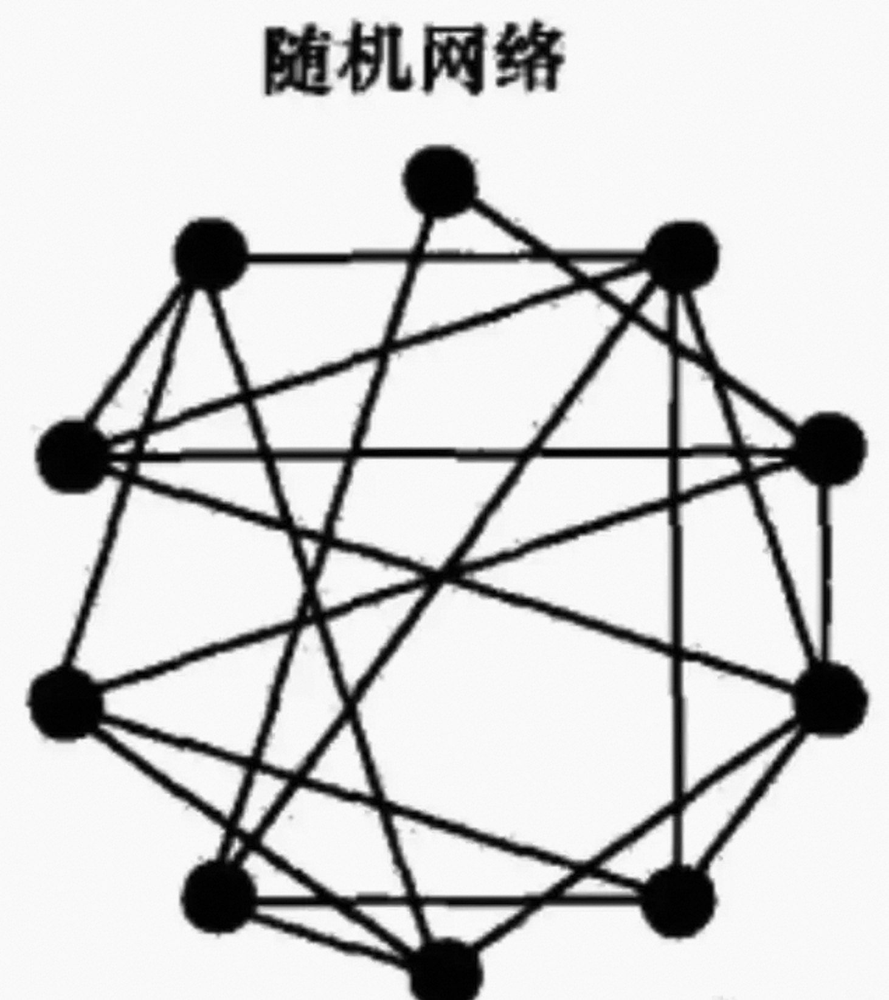
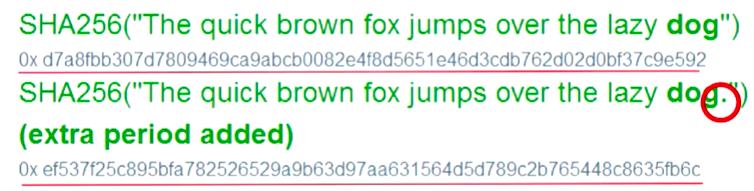
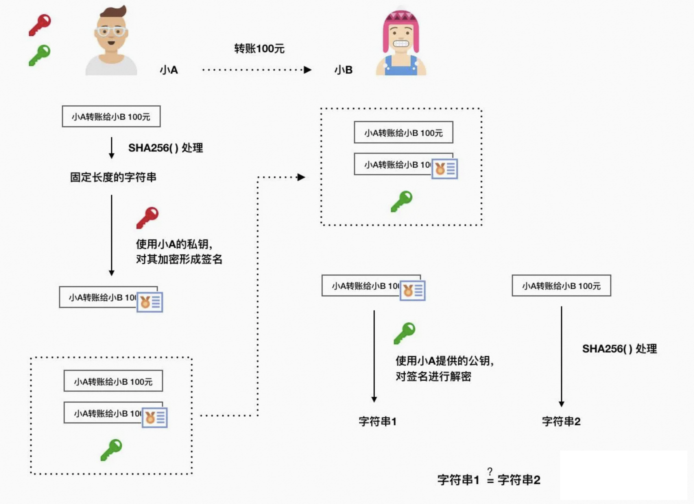
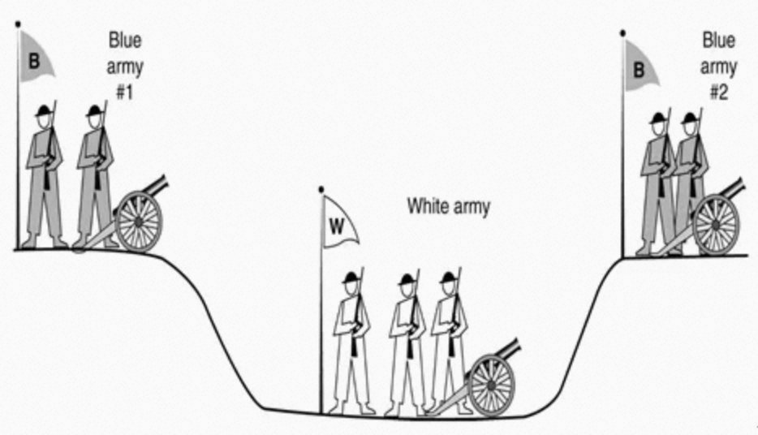

# 1、区块链是什么

## 1.1 区块链的定义

**区块链**（`Blockchain`）把加密数据（区块）按照时间顺序进行叠加（链），生成永久、不可逆向修改的记录，**本质上是一种去中心化的分布式数据库**。

传统数据库的读写权限掌握在一个公司或者一个集权手上（中心化的特征），而区块链则认为，任何有能力架设服务器节点的人都可以参与其中。来自全球各地的掘金者在当地部署了自己的节点，并连接到区块链网络中，成为这个分布式数据库存储系统中的一个节点；一旦加入，该节点享有同其他所有节点完全一样的权利与义务（去中心化、分布式的特征）。与此同时，对于在区块链上开展服务的人，可以往这个系统中的任意的节点进行读写操作，最后全世界所有节点会根据某种机制的完成一次又依次的同步，从而实现在区块链网络中所有节点的数据完全一致。

区块链的概念最早可以追溯到2008年**中本聪**的比特币白皮书，其实中本聪的论文里没有提及区块链，只是把数据结构用一些词来解释和定义。数据结构里有`transaction`，`block`，`chain`。后来者把整个体系拿出来，叫做`BlockChain`。区块链并没有发明什么新奇的技术，而是提出了一个伟大的思想。从经济学和数学角度，结合一些技术（几乎所有的都是现有的，如非对称加密，数字签名，P2P等）构建了一套可持续、高安全、低维护的系统。

**比特币基于区块链技术构建而成，但是它只是该技术诸多应用中的一种，绝非等同于区块链**。

可以把区块链想象成安卓或者IOS系统，数字货币就是在这系统之上开发出来的APP。比特币等数字货币是为了解决在互联网上的电子模拟现金、价值传递的问题，区块链还可以为互不信任的互联网提供绝对的信任，作为信任机器它的作用不仅仅限于数字货币，可以有更扩的领域。

如果说蒸汽机释放了人们的生产力，电力解决了人们基本的生活需求，互联网改变了信息传递的方式，那么**区块链作为构造信任的机器**，将可能改变整个人类社会价值传递的方式。

## 1.2 去中心化

我们反复提到区块链是一个去中心化的系统，确实，“去中心化”在区块链世界里面是一个很重要的概念，很多模型（比如账本的维护、货币的发行、时间戳的设计、网络的维护、节点间的竞争等等等等）的设计都依赖于这个中心思想，那到底什么是去中心化呢？

在解释去中心化之前，先来看下什么是中心化。

回忆一下你在网上购买一本书的流程：
1. 你下单并把钱打给**支付宝**；
2. **支付宝**收款后通知卖家可以发货了；
3. 卖家收到**支付宝**通知之后给你发货；
4. 你收到书之后，觉得满意，在**支付宝**上选择确认收货；
5. **支付宝**收到通知，把款项打给卖家。流程结束。

你会发现，虽然你是在跟卖家做交易，但是，**所有的关键流程都是在跟支付宝打交道**。这样的好处在于：万一哪个环节出问题，卖家和买家都可以通过支付宝寻求帮助，让支付宝做出仲裁。这就是一个最简单的**基于中心化思维构建的交易模型**，它的价值显著，就是**建立权威**，**通过权威背书来获得多方的信任**，同时依赖权威方背后的资本和技术实力确保数据的可靠安全。

假如说，支付宝程序发生重大BUG，导致一段时间内的转账记录全部丢失，或者更彻底一点，支付宝的服务器被意外损毁，而我刚刚转出去的100元则会死无凭证，这个时候，你就成了刀殂上的鱼肉，支付宝有良心，会勉为其难承认你刚刚转账的事实，但他不承认你也没辙，因为确实连他自己也不知道这笔转账是否真实存在。

上述就是中心化最大的弊端——**过分依赖中心和权威，也就意味着逐渐丧失自己的话语权**。

那么去中心化的形态是什么样子呢？还是拿刚才那个例子继续，我们构建一个简易的去中心化的交易系统。

1. 你下单并把钱打给卖家；
2. 你将这条转账信息记录在自己账本上；
3. 你将这条转账信息广播出去；
4. 卖家以及很多其他交易者在收到你的信息之后，在他们自己的账本上分别记录；
5. 卖家发货，同时将发货的事实记录在自己的账本上；
6. 卖家把这条事实记录广播出去；
7. 你以及很多其他交易者收到这条事实记录，在自己的账本上分别记录；
8. 你收到书籍。至此，交易流程走完。

刚才“人为刀俎我为鱼肉”的情况在这个体系下就比较难发生，因为所有人的账本上都有着完全一样的交易记录，就算支付宝的账本服务器坏了，众多交易者的账本还存在，这些都是这笔交易真实发生的铁证。

## 1.3 区块链的特征

从上面的简易交易系统中，我们可以窥视到区块链的一些影子：
* 分布式存储，通过多地备份，制造数据冗余
* 让所有人都有能力都去维护共同一份数据库
* 让所有人都有能力彼此监督维护数据库的行为

其实这些就是区块链技术最核心的东西，外人看起来高大上、深不可测，但探究其根本发现就是这么简单和淳朴。

当然，在这套简易交易系统中，很容易发现诸多漏洞，比如说三方当中有一个是坏人，他故意记录了对他更有利的转账信息怎么办；又比如说消息在传递过程中被黑客篡改了怎么办等等等等。在区块链系统中，通过巧妙的设计与人性的弱点，解决了种种漏洞。

如果用专业一点的语言来描述区块链，可以用下面3个特征来概括：
* 区块链是一个放在**非安全环境**中的**分布式数据库**（系统）。
* 区块链采用**密码学**的方法来保证已有数据**不可能被篡改**。
* 区块链采用**共识算法**来对于新增数据达成共识。

# 2、区块链核心技术

## 2.1 P2P协议

看到P2P大家第一印象可能会是网络借贷、信息中介等概念。这种P2P借贷平台与我们所说的区块链中的P2P并不是同一个东西，但却与区块链中的P2P有共通之处。

P2P，即`Peer to Peer`，翻译为**点对点**，常称之为**对等网络**。是一种没有中心服务器、依靠用户群交换信息的互联网体系。与有中心服务器的中央网络系统不同，对等网络的每个用户端既是一个节点，也有服务器的功能。

传统的中央网络系统是C/S结构，即client/server（客户端/服务端），都有一个中心化的服务器，我们用所用的客户端应用发出请求，然后服务器给我们返回一些行为、数据之类。日常生活中我们去一些论坛贴吧发帖或者写评论，过程一般都是：写一段文字点击发送之后，这段文字通过网络传输发送到贴吧的中央服务器里，然后服务器再将这段文字展现在贴吧，让每个人都能看见。包括我们常用的支付宝、微信等应用去转账的时候，给对方打的钱并不是我们表面所见那样对方直接就收到了，而是要先经过它们中心化的服务器去清算，再转交给对方手里。

这种中心化的服务器就像是枢纽站一样，掌控着所有用户的数据，管理很方便，同时缺点是显而易见的：一旦崩溃的话，就会导致全网的服务挂掉，比如某个热点事件导致微博服务器瘫痪。在安全性方面，如果中央服务器被黑客入侵，或者病毒感染，就能够很快的将病毒辐射到所有的客户端用户，如果用户数量很庞大的话，甚至会影响到社会的稳定。中央服务器对用户数据的掌控性太强，如果一个商家道德底线过低，可能会肆意分析、售卖我们的数据；这些都是中心化服务器的潜在问题。

而P2P协议的出现，其初衷便站在了上述那种中心化网络的的对立面。在对等网络里，每一个网络节点，所具有的功能，在逻辑上是完全对等的，全网无特殊节点，不存在谁是服务端，谁是客户端；每一个节点在对外提供服务的时候，也在使用别的节点为自己提供类似的服务；在P2P网络中，每个网络节点，具有相同的数据收发权限，也就是每一个节点都可以对外提供全网所需的全部服务；也正是因为这，任何一个节点垮掉，都不会对整个网络的稳定性构成威胁。

区块链系统之所以选择P2P作为其组网模型，就是因为两者的出发点都是**去中心化**，可以说具有高度的契合性。中本聪在白皮书中提过，在电子现金系统中，第三方系统是多余的，没有价值，意思就是整个系统不要依赖任何特殊的第三方来完成自身系统的运转。对等网络全网无特殊节点，每个节点都可以提供全网所需的全部服务，没有中心节点把控全网发号施令，保证了数据的自由流通，平等手法，保证了区块链系统在底层通信信道上的平等性，可以说**P2P网络协议奠定了区块链系统的重要基石**。

根据结构可以将P2P系统细分为四种拓扑形式：

### 2.1.1 中心化拓扑

即存在一个中心节点保存了其他所有节点的索引信息，索引信息一般包括节点 IP 地址、端口、节点资源等。

### 2.1.2 全分布式非结构化拓扑

移除了中心节点，在 P2P 节点之间建立随机网络，就是在一个新加入节点和 P2P 网络中的某个节点间随机建立连接通道，从而形成一个随机拓扑结构。新节点加入该网络的实现方法也有很多种，最简单的就是随机选择一个已经存在的节点并建立邻居关系。

新节点与邻居节点建立连接后，还需要进行**全网广播**，让整个网络知道该节点的存在。全网广播的方式就是，该节点首先向邻居节点广播，邻居节点收到广播消息后，再继续向自己的邻居节点广播，以此类推，从而广播到整个网络。这种广播方法被称为**泛洪机制**，该机制存在两个问题：**泛洪循环**（节点 A 发出的消息经过节点 B 到 节点 C，节点 C 再广播到节点 A，这就形成了一个循环）和**响应消息风暴**问题（如果节点 A 想请求的资源被很多节点所拥有，那么在很短时间内，会出现大量节点同时向节点 A 发送响应消息，这就可能会让节点 A 瞬间瘫痪）。

### 2.1.3 全分布式结构化拓扑

将所有节点按照某种结构进行有序组织，比如形成一个环状网络或树状网络。而结构化网络的具体实现上，普遍都是基于 **DHT**(Distributed Hash Table，分布式哈希表) 算法思想。DHT 只是提出一种网络模型，并不涉及具体实现，主要想解决如何在分布式环境下快速而又准确地路由、定位数据的问题。具体的实现方案有 Chord、Pastry、CAN、Kademlia 等算法，其中**Kademlia是以太坊网络的实现算法**，很多常用的 P2P 应用如 BitTorrent、电驴等也是使用Kademlia。

### 2.1.4 半分布式拓扑

吸取了中心化结构和全分布式非结构化拓扑的优点，选择性能较高（处理、存储、带宽等方面性能）的结点作为**超级结点**（英文表达为SuperNodes或者Hubs），在各个超级结点上存储了系统中其他部分结点的信息，发现算法仅在超级结点之间转发，超级结点再将查询请求转发给适当的叶子结点。通俗点说：一个新的普通节点加入，先选择一个超级节点进行通信，该超级节点再推送其他超级节点列表给新加入节点，加入节点再根据列表中的超级节点状态决定选择哪个具体的超级节点作为父节点。这种结构的泛洪广播仅发生在超级节点之间，就避免了大规模泛洪存在的问题了。

半分布式结构也是一个层次式结构，超级结点之间构成一个高速转发层，超级结点和所负责的普通结点构成若干层次。**EOS和如今的比特币都是采用的该网络结构**。
　
## 2.2 密码学原理

区块链领域用到的密码学技术，简单来说主要分为三大类：

* **加密**：把机密的原始信息进行数学变换以后，别人即使拿到也读不懂。
* **认证**：机密信息发给别人的时候，别人能够通过检查知道这就是你发的原始信息，而没有在中间被别人篡改过。
* **识别**：对于信息接受者，在接受机密信息的时候，会有一个检查机制，能使得他能知道信息是你本人发出去的，而不是某个冒充你的人发出去的。

底层主要依靠两种技术来实现：**哈希函数**与**非对称加密**。

### 2.2.1 哈希函数

**哈希算法**又被称为**散列函数**，它可以**将任意长度的数据信息代码串转化为一段固定长度的字符串**，这段字符串又被称为**散列值**或**哈希值**(Hash值)。

一个优秀的 hash 算法，将能实现：

* **正向快速**：给定明文和 hash 算法，在有限时间和有限资源内能计算出 hash 值。
* **逆向困难**：给定（若干） hash 值，在有限时间内很难（基本不可能）逆推出明文。
* **输入敏感**：原始输入信息修改一点信息，产生的 hash 值看起来应该都有很大不同。
* **冲突避免**：很难找到两段内容不同的明文，使得它们的 hash 值一致（发生冲突）。即对于任意两个不同的数据块，其hash值相同的可能性极小；对于一个给定的数据块，找到和它hash值相同的数据块极为困难。

以比特币使用的`SHA256()`函数为例，任意长度的字符串、甚至文件体本身经过SHA256函数工厂的加工，都会输出一个256位的字符串；同时，输入的字符串或者文件稍微做一丢丢的改动，SHA256() 函数给出的输出结果都将发生翻天覆地的改变。我们来看一个实例：

可以看到，一句话仅仅多了一个句号，它的Hash值就大相径庭了。

哈希函数主要用于验证信息完整性。在一个信息后面放上这个信息的哈希值，这个值很小且计算方便。收到信息之后收信人再算一遍哈希值，对比两者就知道这条信息是否被篡改过了。如果被篡改过，哪怕只有一bit，整个哈希值也会截然不同。而根据哈希函数的性质，没有人能够伪造出另一个消息具有同样的哈希值，也就是说篡改过的数据完全不可能通过哈希校验。

### 2.2.2 非对称加密

一句话讲就是：**加密和解密所用的密钥是不一样的**，所以叫“非对称”。

非对称加密算法的两个密钥，一个称为**公钥**，可以公布于众；一个称为**私钥**，

用公钥加密的数据只有对应的私钥可以解密，用私钥加密的数据只有对应的公钥可以解密。

用私钥可以生成公钥，反之不行。

比特币的非对称性加密算法采用的是**椭圆曲线加密算法（ECC）**。相比RSA，ECC优势是可以使用更短的密钥，来实现与RSA相当或更高的安全，RSA加密算法也是一种非对称加密算法，在公开密钥加密和电子商业中RSA被广泛使用。

下面用一个实例来看看哈希函数与非对称加密是如何协作的：

1. 小A会先用SHA256函数对自己的小纸条进行处理，得到一个固定长度的字符串，这个字符串就等价于这张小纸条。
2. 小A使用只有自己知道的那一把私钥，对上面固定长度的字符串进行再加密，生成一份名叫**数字签名**的字符串，这份数字签名能够充分证明是基于这张小纸条的。你可以这么理解，在现实中，你需要对某一份合同的签署，万一有人拿你曾经在其他地方留下的签名复制粘贴过来怎么办？最好的办法，就是在你每一次签名的时候，故意在字迹当中留下一些同这份合同存在某种信息关联的小细节，通过对小细节的观察可以知道这个签名有没有被移花接木。步骤一和步骤二的结合就是为了生成这样一份有且仅针对这条小纸条有效的签名。
3. 小A将「明文的小纸条」、刚刚加密成功的「数字签名」，以及自己那把可以公布于众的「公钥」打包一起发给小B。
4. 当小B收这三样东西，首先会将明文的小纸条进行SHA256()处理，得到一个字符串，我们将其命名为“字符串2”。然后，小B使用小A公布的公钥，对发过来的数字签名进行解密，得到另外一个“字符串1”。通过比对“字符串1”和“字符串2”的一致性，便可充分证明：小B接受到的小纸条就是小A发出来的小纸条，这张小纸条在中途没有被其他人所篡改；且这张小纸条确实是由小A所编辑。

可以看得出来，加解密的过程几乎是一环套一环，中途任何环节被篡改，结果都是大相径庭。借助这一连串的机制，其实已经能够很好的在公开、匿名、彼此不信任的分布式网络环境中解决数字交易过程中可能遇到的很多问题。

## 2.3 共识算法

共识算法的目的，就是让所有节点对于新增区块达成共识，也就是说，所有人都要认可新增的区块。对于有中心的系统，这事很简单，中心说什么大家同意就好了，但是放到去中心化系统里，整个系统中没有了权威的中心化代理，信息的可信度和准确性便会面临问题。尤其是当有些节点有恶意的时候，就会变得更加复杂。

### 2.3.1 拜占庭问题与类两军问题

**拜占庭问题**是Lamport与1982年在论文中抽象出来一个著名的例子，核心描述是军中可能有叛徒，却要保证进攻一致。由此引申到了计算领域，发展成了一个容错理论。随着比特币的出现和兴起，这个著名的问题又重新进入了大众视野。

> 拜占庭帝国想要进攻一个强大的敌人，为此派出了10支军队去包围这个敌人。这个敌人虽不比拜占庭帝国，但也足以抵御5支常规拜占庭军队的同时袭击。这10支军队在分开的包围状态下同时攻击。他们任一支军队单独进攻都毫无胜算，除非有至少6支军队（一半以上）同时袭击才能攻下敌国。他们分散在敌国的四周，依靠通信兵骑马相互通信来协商进攻意向及进攻时间。困扰这些将军的问题是，他们不确定他们中是否有叛徒，叛徒可能擅自变更进攻意向或者进攻时间。在这种状态下，拜占庭将军们才能保证有多于6支军队在同一时间一起发起进攻，从而赢取战斗？

拜占庭将军问题反映到信息交换领域中来，可以理解为**在一个去中心的系统中，有一些节点是坏掉的，它们可能向外界广播错误的信息或者不广播信息，在这种情况下如何验证数据传输的准确性**。

应该明确的是拜占庭将军问题中并不是去考虑通信兵是否会被截获或者无法传递信息等问题。及信息传递的信道是绝无问题的。Lamport已经证明了**在消息可能丢失的不可靠信道上试图通过信息传递的方法达成一致性是不可能的**。所以在研究拜占庭将军问题的时候我们已经假定了信道是没有问题的。并在这个前提下去做一致性和容错性的相关研究。

如果需要考虑信道是有问题的，这就涉及到了另一个问题——类两军问题。

如上图所示：白军驻扎在沟渠里，蓝军则分散在沟渠两边。白军比任何一支蓝军都更为强大，但是蓝军若能同时合力进攻则能够打败白军。他们不能够远程的沟通，只能派遣通信兵穿过沟渠去通知对方蓝军协商进攻时间。是否存在一个能使蓝军必胜的通信协议，这就是**类两军问题**。

看到这里你可能发现类两军问题和拜占庭将军问题有一定的相似性，但我们必须注意的是，通信兵得经过敌人的沟渠，在这过程中他可能被捕，也就是说，**类两军问题中信道是不可靠的，并且其中没有叛徒之说**，这就是两军问题和拜占庭将军问题的根本性不同。

为了沟通进攻时间，左侧蓝军派遣一个信使去跟右侧蓝军说：“下午6点发起进攻”。右侧蓝军收到信息后又派了一个信使去回复说：“收到指令！”。然后左侧蓝军又派一个信使去右侧蓝军说：“知道你收到指令了！”。然后右侧蓝军又派一个信使去左侧蓝军说：“知道你知道我收到指令了！”。然后左侧蓝军又派一个信使去右侧蓝军说：“知道你知道我知道你收到指令了！”……然后就没完没了了。

因为是点对点的通信，双方不可能在这种情况下达到信息的一致性。严谨一点来说，就是**在分布式计算上，试图在异步系统和不可靠的通道上达到一致性是不可能的**。

### 2.3.2 PoW算法

Lamport提出拜占庭问题之后，有很多算法被提出来，统称**BFT**（Byzantine Fault Tolerance，拜占庭容错）算法，其中最有代表性的叫**PBFT**（Practical Byzantine Fault Tolerance实用拜占庭容错算法），**PBFT算法在保证活性和安全性的前提下提供了(n-1)/3的容错性**，通俗点来讲，只要叛徒不超过三分之一，忠诚的将军们就一定能达成一致结果。

然后由于最近区块链的热度，无数针对区块链应用场景优化过的BFT算法也涌现出来，但是一个重要的问题是，**所有目前的BFT算法，都只能应用在小型网络里**。

这个问题被搁置了很久，直到比特币的诞生。中本聪从某种意义上简化了这个问题，在比特币中，同样是共识问题，中本聪引入了一个重要的假设——奖励，他之所以能这样做的原因是，**在比特币的应用场景里，共识是有价值的（获得比特币）**。

于是中本聪引入了**PoW算法**（Proof of Work，工作量证明）。比特币设置诸如挖矿难度，挖矿奖励，最长链，分叉等机制，都可以归结为一句话：**说话是要有代价的，说真话是有好处的，说假话是要扣钱的**。

中本聪的思路就是，如果要做叛徒，攻击整个网络，需要付出相应的成本，而这个成本在比特币的PoW工作量共识机制下，就是要掌握整个网络50%以上的算力——换句话说，有50%以上的叛徒才行，这是比PBFT高得多的容错率，而且大家可以想象一下这是多高的成本。接下来，绝妙的是，如果真的掌握那么大的算力的话，用这些算力维护网络（诚实地挖矿）获得的收益其实会高于破坏网络。

优点：
* 算法简单，容易实现；
* 节点间无需交换额外的信息即可达成共识；
* 破坏系统需要投入极大的成本；

缺点：
* 浪费能源；
* 共识达成的周期较长，不适合商业应用

### 2.3.3 PoS算法

PoW算法毕竟是要靠大量资源的消耗来保证共识的达成，有没有完全不需要靠计算机资源堆砌来保证的共识机制呢？

在2011年，有人提出了一种新算法——PoS权益证明(Proof-of-Stake），该机制被充分讨论之后证明具有可行性。如果说**PoW主要比拼算力，算力越大，挖到一个块的概率越大，PoS则是比拼余额，通俗说就是自己的手里的币越多，挖到一个块的概率越大**。

它的原则是**一个节点持有的币越多，越有机会产生下一个区块**，也就是如果想要造假需要持有很大量的币。而既然造假者持有了那么多币，破坏网络的可信度就会造成资产的大量损失，这个损失极有可能是超过造假的收益的。

PoS相比PoW节约了大量的资源，但是对它的批评也很明显：这会造成富者越富，穷者越穷，然后用户会流失，新用户也不愿意加入。

优点：
* 在一定程度上缩短了共识达成的时间；
* 不再需要大量消耗能源挖矿

缺点：
* 还是需要挖矿，本质上没有解决商业应用的痛点
* 会造成富者越富，资源越来越集中，从而变得更中心化

### 2.3.4 DPoS算法

针对PoW、PoS的效率低和会变得越来越中心化的问题，BM在2013年8月启动的比特股BitShares项目则采用了DPoS算法。

**DPoS**(Delegated Proof-Of-Stake，代理权益证明)，又称**受托人机制**，类似于现代企业董事会制度，比特股系统将代币持有者称为股东，由股东投票选出101名代表，然后由这些代表负责产生区块。那么需要解决的核心问题主要有：代表如何被选出，代表如何自由退出“董事会”，代表之间如何协作产生区块等。

持币者若想成为一名代表，需先拿自己的公钥去区块链注册，获得一个长度为32位的特有身份标识符，用户可以对这个标识符以交易的形式进行投票，得票数前101位被选为代表。代表们轮流产生区块，收益（交易手续费）平分。如果有代表不老实生产区块，很容易被其他代表和股东发现，他将立即被踢出“董事会”，空缺位置由票数排名102的代表自动填补。

从某种角度来说，**DPoS可以理解为多中心系统，兼具去中心化和中心化优势**。

优点：
* 大幅缩小参与验证和记账节点的数量，可以达到秒级的共识验证

缺点：
* 整个共识机制还是依赖于代币，很多商业应用是不需要代币存在的

# 3、区块链的发展阶段

从区块链技术角度出发，在行业发展历程中分为三个阶段。

## 3.1 第一阶段

以**比特币**为代表，建立了一套密码学的账本，提供了一套新的记账方法，和我们传统的记账方式完全不一样，它具备去中心化、不可篡改、不可伪造、可追溯的特点。

它主要应用场景是转账、汇款和数字化支付相关。

## 3.2 第二阶段

以**以太坊**为代表，相当于建立一个基础链，一个底层的搭建。以太坊的计划是建成一个全球性的大规模的协作网络，让任何人都可以在以太坊上进行运算、开发应用层，这样就赋予了区块链很多的应用场景和功能实现的基础。

以太坊最大的特点就是**智能合约**，支持所有人在上面编写智能合约，也是以代码形式定义的一系列的承诺合同。智能合约就是一套不需要第三方的情况下还可以保证合同得到执行的计算机编程，并且没有人能够阻止它的运行一个计算机程序。这个计算机程序保证签完合同之后，谁都不能反悔，只要条件达成，这个系统会自动执行合同中约定的条款。

但是以太坊也是有缺陷的，它无法支持大规模的商业应用开发，比如说交易速度，比特币的交易速度每秒7笔，以太坊每秒不超过20笔，会造成网络的堵塞，使用户无法完成交易。

## 3.3 第三阶段

以**超级账本**(Hyperledger)为代表，该项目的愿景，是打造一个透明、安全、去中心化的企业级区块链解决方案，由区块链构造一个全球性的分布式记账系统，能够对于每一个互联网中代表价值的信息和字节进行产权确认、计量和存储，从而实现资产在区块链上可被追踪、控制和交易。“超级账本”白皮书中，透露了5种区块链应用案例，分别是银行业(贷款申 请)、金融业、健康医疗(医师资格认证)、IT(权限管理)、供应链(记录食品从源头到餐桌)。

此阶段超越金融领域，进入社会公证、智能化领域，主要应用在社会治理领域，包括了身份认证、公证、仲裁、审计、域名、物流、医疗、邮件、签证、投票等领域，应用范围扩大到了整个社会，区块链技术有可能成为**万物互联**的一种最底层的协议。

# 4、区块链的分类

## 4.1 公有链

公有的区块链，其特性是读写权限对所有人开放，公开透明，所有人都可以在公有链上发布接收信息，交易，记账。

代表：比特币、以太坊

### 优点

1）所有交易数据公开、透明。

虽然公有链上所有节点是匿名加入网络，但任何节点都可以查看其他节点的账户余额以及交易活动。验证节点遍布于世界各地，所有人共同参与记账、维护区块链上的所有交易数据。

2）无法篡改。

公有链是高度去中心化的分布式账本，篡改交易数据几乎是不可能，除非篡改者控制了全网51%的算力，以及超过5亿RMB的运作资金。

### 缺点

1）低吞吐量

高度去中心化和低吞吐量是公有链不得不面对的两难境地，例如最成熟的公有链——比特币块链——每秒只能处理7笔交易信息（按照每笔交易大小为250字节），高峰期能处理的交易笔数就更低了。

2）交易速度缓慢

低吞吐量的必然带来缓慢的交易速度。比特币网络极度拥堵，有时一笔交易需要几天才能处理完毕，还需要缴纳几百块转账费。

## 4.2 私有链

私有的区块链，读写权限掌握在某个组织或机构手里，由该组织根据自身需求决定区块链链的公开程度。

代表：蚂蚁链

### 优点

1）更快的交易速度、更低的交易成本

链上只有少量的节点也都具有很高的信任度，并不需要每个节点来验证一个交易。因此，相比需要通过大多数节点验证的公有链，私有链的交易速度更快，交易成本也更低。

2）不容易被恶意攻击

相比中心化数据库，私有链能够防止内部某个节点篡改数据。故意隐瞒或篡改数据的情况很容易被发现，发生错误时也能追踪错误来源。

3）更好地保护组织自身的隐私，交易数据不会对全网公开

### 缺点

区块链是构建社会信任的最佳解决方案，“去中心化”是区块链的核心价值。而由某个组织或机构控制的私有链与“去中心化”理念有所出入。如果过于中心化，那就跟其他中心化数据库没有太大区别。

## 4.3 联盟链

联盟区块链又被称作“联合链”，联盟链是指有若干个机构共同参与管理的区块链，每个机构都运行着一个或多个节点，其中的数据只允许系统内不同的机构进行读写和发送交易，并且共同来记录交易数据。

联盟链是私有链的一种，只是私有程度不同，而且其权限设计要求比私有链更复杂；但联盟链比纯粹的私有链更具可信度。

代表：超级账本

### 优点

* 交易速度快
* 适用范围更广

### 缺点

* 对节点性能需求高
* 容易造成权力集中

