# 1、比特币是什么

## 1.1 货币的本质

比特币是一种在网络世界里的虚拟货币，而虚拟货币跟你手里的纸币的区别就是：**它没有实体，它只是计算机世界里的一串数字**。这很可能是每个人的直观感受：一串计算机里存储的数字，它没有任何价值，我们为什么要接受它，并把我的有价值的商品给对方？

可是想想你手里的钞票吧，它也只是一张普普通通的纸而已，一张纸的实际价值不比计算机里的数字高多少，那你为什么就相信这张纸了呢？

所以关键点在这里：**一种货币能不能用来买东西，不是它自身的价值决定的，而是你身边的每一个人是否相信这种货币**。如果大家都相信这种货币，不论这个货币是什么形态的，都可以用来买东西。与虚拟货币相对应的是，手里的纸币就值得人们信赖吗？一个国家的纸币是由这个国家央行发行并提供信用担保的，也就是由国家确保你手里的纸币一定能够花出去。但是如果国家耍无赖，你手里的纸币也会贬值，甚至一文不值。那些提着一塑料袋钞票才能买到一个鸡蛋的国家，屡见不鲜。

回忆下我们用支付宝付款的情景，首先需要先扫对方的二维码，或者输入对方帐号，然后填好付款金额，再通过密码或者刷脸等方式验证身份。支付宝验证身份无误后，把双方账户余额的数字增减一下，这笔支付就完成了。在这个过程中，并没有实物货币转移，只不过是我们发出付款信息，支付宝验证身份后改下账本就完事了。**支付宝保证账本公正可靠，不会消失，不会被篡改，同时我们能用密码等方式控制我们的账户，确保只有自己授权才能支付**。

由此可见，其实不依赖于实物货币，我们照样可以付款收款，只需要满足以下两点：
* **一个无法篡改的账本**；
* **只有用户自己授权才能支付**。

于是人们开始思考一个问题：是否可以有一种不依靠某一家机构的人力、物力、技术能力，而是借助整个互联网的力量，为每个人的财富数据提供保障的方案呢？

就这样，比特币出现了。

## 1.2 比特币的诞生

2008年11月1日，一个真实身份至今未知的神秘人化名**中本聪**(Satoshi Nakamoto)，发表了一篇论文《比特币：一种点对点的电子现金系统》（也称比特币白皮书），陈述了他颠覆性的设想。中本聪开发出了比特币系统的程序代码并开源共享，2009年1月3日，比特币第一个区块由中本聪挖出，而后一直绵延至今。

比特币价格从10000个币买2个披萨（2010年5月22日），涨到高峰时的6.9万美元1枚(2021年11月10日)，凭空制造出数千亿美元的市值，形成了一个遍布全球却没有管理中心的社区，堪称世界奇迹。比特币里涉及的加密技术、分布式账本、智能合约、共识机制、防伪防篡改、去中心化等技术和思想，被统称为区块链技术，在金融、物联网、保险、公益等领域有着相当大的应用前景。中本聪本人，则事了拂衣去，深藏身与名，再也找不着了。

正如比特币白皮书所示，比特币并不是纸币或者金币银币那样独立的个体，它是一套电子现金系统，与支付宝有一定类似之处，比特币存在于网络上，可以不经过任何中心机构就完成全球转账。比特币也不是一个一个使用的，最小的单位是“聪”，**一个比特币等于一亿聪**。比特币的发行、支付、验证，完全是自成一系的，与法币并无联系。**比特币是一种总量有限，无国界，无发行中心，无管理中心，遍布全球，自由流通的全新货币**，更确切地说，**比特币是一套在全世界运行的程序，是许多份遍布全球但又完全一致的账本，是一个价值传输网络**，它对货币、金融、互联网乃至人类组织形式的影响，都是颠覆性的。

有史以来第一次，货币不再由少数人掌控的权力机构操纵发行；有史以来第一次，人民可以用一串符号或单词来保存财富，抵御通胀，走遍世界都可以使用；有史以来第一次，价值可以在全世界自由流通，全球人民的经济联系，从来没有如此紧密过；有史以来第一次，全世界有了一种公正客观的超主权自由货币；有史以来第一次，人类做到了在无中心管理状态下行动的统一；有史以来第一次，法治真正代替了人治；有史以来第一次，人人平等真正实现了，就算是最高统治者，也必须严格遵守规则，服从人民的共识。

此物一出天下反，一个崭新的世界出现在我们面前。

# 2、比特币的运行原理

## 2.1 比特币存储——如何实现“一个无法篡改的账本”

比特币是一个价值传输网络，参与比特币系统运作的就是网络中一个个节点，节点彼此等权，没有中心，相互之间连接完全自由，**各自保存着完全一致的比特币账本**，运行着遵循相同规则的比特币程序。任何人都可以加入比特币网络，新加入比特币网络的节点，都可以向原有节点要一份比特币账本。

由于账本存储在网络的各个节点上，其中一个节点出现问题，还是可以从网络上的其他节点获取到正确数据的。可以对比一下传统中心式的存储体系与比特币去中心化的存储体系的区别。

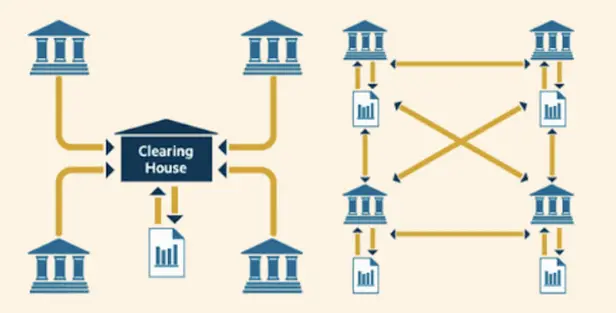

由于这种去中心化存储账本的特点，在某一个节点更新账本数据的时候，就要通知其他节点一起修改账本记录。举一个例子，如果Alice给Bob转了5个比特币（BitCoin，也称做**BTC**），那么最初进行这笔转账处理的节点，就要把这个处理的情况传播给临近的其他节点，然后其他节点再传播给临近的节点……直到网络上所有的节点账本都被更新了。

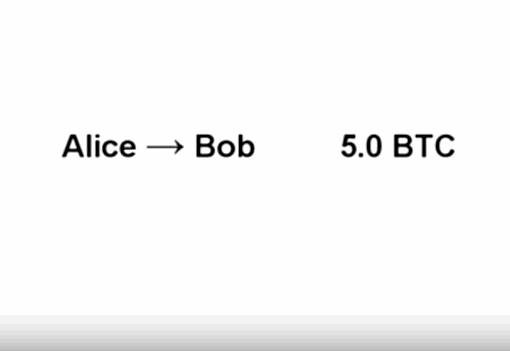

那么，为什么就有人来记比特币的账呢？既然谁都可以记账，那又以谁的账为准呢？怎么确保账本的真实性呢？比特币又是怎么发行出来的呢？

首先，按照比特币的规则，**记账是有奖励的**。一部分奖励是账单里用户出的手续费，另一部分奖励则是区块奖励，打包一个区块，就获得一定的区块奖励。按照比特币的规则，区块奖励起初为50个比特币，每出210000个区块后，奖励减半，差不多**每4年减半一次**。区块奖励一方面调动了大家去记账，另一方面也完成了比特币的发行。按照上述规则，我们可以通过这个式子计算比特币的总量，就是`210000×50×（1+1/2+1/4+……）=2100万`。

有了奖励，而且奖励颇丰，大家当然抢着去记账。为确定以谁的账本为准，比特币有个**最长链原则**，谁的区块链账本最长，就以谁的账本为准。制造区块需要进行大量计算，最长链实际就是凝聚着最大工作量的链。最长链也是最新的账本，记录着最多的账单。

区块链就这样在大家的齐心协力下不断延长，全网的节点都有一份相同且实时更新的区块链账本。验证、广播、记账等过程，都是由各个节点的比特币程序根据比特币规则自动执行的。

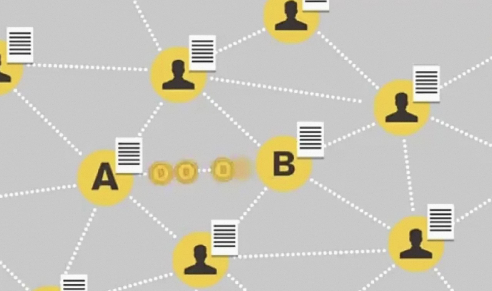

通过计算力来竞争记账权和比特币奖励的行为，被称为**挖矿**，专门进行这种计算的机器，就称为**矿机**，干挖矿这行的人，就叫**矿工**，记账的手续费，就叫**矿工费**。

至于难度目标到底是多少，则是由比特币的程序每隔2016个区块就自动调节一次的，根据之前出块速度和之前难度目标反推全网算力，再根据全网算力设置一个合适的难度目标，让**全网平均10分钟能出一个块**。这样一来，谁的计算能力强，谁在单位时间内计算次数多，谁就有更大的概率试出符合要求的哈希值，获得记账权和比特币奖励，这种共识机制也被称为**工作量证明**(PoW)。

在工作量证明的机制下，挖矿需要耗费巨大电力。世界各地的矿工竞相寻找便宜的电力，修建矿场，布置矿机，就形成了目前浩浩荡荡的挖矿局面。由于现在全网算力很高，挖矿难度很大，单枪匹马已经很难挖到矿了，于是大家把算力集中到一个个矿池，矿池更容易挖到矿，然后再按各自贡献的算力大小相应分配收益。

可以看出，比特币的区块链账本是传遍了全网的，保存在全网的，大家都验证过了的，区块链通过Merkle树根哈希值和区块头哈希值环环相扣，累积了巨大的工作量，账本真实可靠，无法篡改，无法销毁。比特币用于转账或支付只需发出一条信息就行了，不用经过任何中心机构，可以轻易地全世界流通。

## 2.2 比特币交易——如何实现“只有用户自己授权才能支付”

我们用支付宝付款时，需要输入密码或通过其它方式验证身份，借以控制自己的账户。对于比特币，如何证明你发出的支付信息是你发出的呢？如何确保发出的信息不被篡改呢？换言之，如何控制自己的比特币呢？

比特币是用“私钥”和“公钥”来实现的。

“公钥”“私钥”是现代密码学**非对称性加密**里面的概念。每个人都有两个密钥，一个“公钥”，一个“私钥”。“公钥”是公开的。而私钥只有自己手里才有。“公钥”、“私钥”的特点可以简单理解为：用一个人的“公钥”加密，只能用这个人的“私钥”解密；而用一个人的“私钥”加密，只能用这个人的“公钥”解密。

这样，就解决了传递“密钥”过程中，“密钥”泄露的问题。因为如果我想给你一个只有你能看的信息，因为我手里有你的“公钥”，而你的“私钥”只在你手里才有，因此我只要用你的“公钥”加密就行了。

简单来说，比特币系统让每个参与交易的人，先随机产生一个字符串，作为自己的唯一的“私钥”。然后会通过“私钥”生成对应的唯一“公钥”。生成后，“公钥”在比特币网络上公开给每个人，而“私钥”你要自己藏好，不能让别人知道。由于“私钥”生成“公钥”的过程是不可逆的，因此别人即便拿到了你的“公钥”，也不可能知道你的“私钥”是什么。这样，我们很容易就能实现下面的功能：当别人用你的“公钥”锁定一个数据时，只有拥有“私钥”的人（也就是你）才可能解锁这个数据。

比特币里没有人的概念，只有地址的概念，**提到你有多少个比特币，其实是说你的地址上有多少个比特币**。那要怎么才能控制你地址上的币呢？就要靠私钥。公钥和地址都可以公开，但私钥一定不能泄露。

比如小明要给小强一个比特币，小明的比特币地址是A，小强的比特币地址是B，小明就要将“A地址给B地址一个比特币”这条账单进行哈希运算，得到的哈希值再用A地址的私钥加密，加密得到的密文连同A地址的公钥、“A地址给B地址一个比特币”这条账单一起，广播出去。收到该信息的人会进行检查，计算公钥得到地址，判断该信息中公钥和地址是否对应，再用公钥把密文解密成哈希值，同时也对账单进行哈希运算，得到另一个哈希值。这时候比较一下两个哈希值，如果哈希值相同，就说明这条信息确实是地址的主人发出的，也没有被篡改。

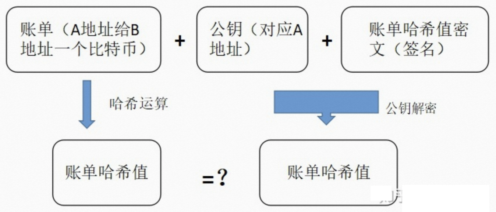

如果有人伪造了“A地址给B地址一个比特币”这一信息，首先，伪造信息里A的公钥不能变，因为公钥可以推算出地址，变了公钥推算出的地址就会与A不符，别人立马就能发现这是假消息了。其次，伪造者没有A地址的私钥，他伪造的账单哈希值密文必然与真实密文不同，这时候别人用公钥解密，解密出的哈希值也必然不同于用账单计算出的哈希值，这条信息就肯定不真实。还有一种情况是信息内容遭到篡改，比如把信息篡改成“A地址给B地址十个比特币”，这种情况下，账单变了，但公钥和账单哈希值密文都没变。按上面的思路分析一遍，你也会发现，篡改信息会导致两个哈希值相异。

可以看出，私钥犹如地址对应的一支独一无二的签字笔，能签出独一无二的签名，证明你是对应地址的主人，所以我们也把该过程称为**数字签名**。你用私钥签名了，你这个地址的付款信息才会被别人接受。要是你丢了私钥，你就无法使用地址上的币，尽管你地址上有多少币都是清清楚楚地记录在区块链账本上的。要是别人知道了你的私钥，他就可以转走你地址上的币，比特币的世界里，是**只认私钥不认人**的。所以，说私钥安全性重于泰山也不为过。

# 3、比特币的数据结构

比特币系统的每个数据区块主要由**区块头**（Block Header）和**区块体**（Block Body）两部分组成，其中区块头记录当前区块的元数据，而区块体则存储封装到该区块的实际交易数据。

比特币系统的区块结构图如下：
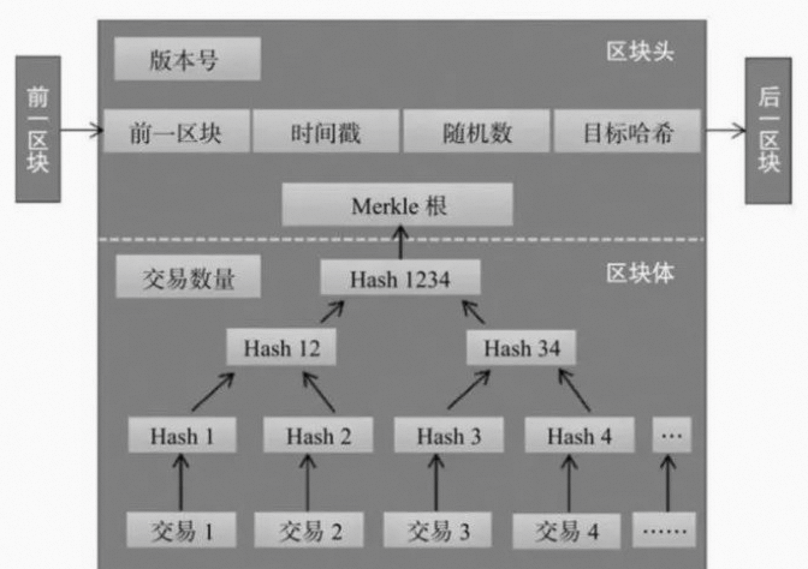

## 3.1 区块头

区块头主要包含的三组元数据分别是：
* 用于连接前面的区块、索引自父区块哈希值的数据；
* 挖矿难度、Nonce(随机数，用于工作量证明算法的计数器，也可理解为记录解密该区块相关数学题的答案的值)；
* 能够总结并快速归纳校验区块中所有交易数据的Merkle（默克尔）树根数据。

当然区块头不仅仅包含这些元数据，还有其他比如：版本号、时间戳等。

从这个结构来看，**区块链的大部分功能都由区块头实现**。

### 3.1.1 PrevBlock

每一个区块都有一个名字，即**区块ID**，区块ID是通过下面公式计算得来：

`区块ID = SHA256(区块头信息)`

这里的“区块头信息”即当前区块的`PrevBlock + MerkleRoot + Nonce + Time + Bits…`最后所形成的字符串；SHA256()是一个哈希函数。

PrevBlock 就是当前区块的上一个区块的ID，该字段使得Block之间链接起来，形成一个巨大的“链条”。

由于区块头里面包含前一个区块的哈希值，所以当前区块的哈希值也受到该字段的影响。如果前一区块的哈希值发生变化，当前区块的哈希值也会跟着变化。当前一区块有任何改动时，前一区块的哈希值也发生变化。这将迫使当前区块的PrevBlock字段发生改变，从而又将导致当前区块的哈希值发生改变。而当前区块的哈希值发生改变又将迫使后一区块的PrevBlock字段发生改变，又因此改变了后一区块哈希值，以此类推。一旦一个区块有很多代以后，这种瀑布效应将保证该区块不会被改变，除非强制重新计算该区块所有后续的区块。正是这样的重新计算需要耗费巨大的计算量，所以一个长区块链的存在可以让区块链的历史不可改变，这也是比特币安全性的一个关键特征。

### 3.1.2 MerkleRoot

**Merkle树是一种哈希二叉树**，由一个根节点、一组中间节点和一组叶节点组成。最下面的叶节点包含存储数据或其哈希值，每个中间节点是它的两个孩子节点内容的哈希值，根节点也是由它的两个子节点内容的哈希值组成。

它的算法特性是，**底层数据的任何变动，都会传递到其父亲节点，一直到树根**。

这种数据结构在处理比对或验证的应用场景中时，特别是在分布式环境下进行比对或验证时，会大大减少数据的传输量以及计算的复杂度。在比特币网络中，使用 MerkleTree 这种算法和数据结构，可以很快的**将所有交易记录最终压缩和归纳成一个统一的哈希值**，即 MerkleRoot。在比特币的Merkle树中两次使用到了SHA256 算法，因此其加密哈希算法也被称为`double-SHA256`。

像Git 版本控制系统，ZFS 文件系统以及我们自己下载电影常用的点对点网络 BT 下载，都是通过 Merkle Tree 来进行完整性校验的。

### 3.1.3 Timestamp

每一个新区块生成时，都会被打上时间戳，这个时间戳是根据产生该**区块节点相关联的其他节点的时间戳求平均后计算得到**，最终依照区块生成时间的先后顺序相连成区块链。每个独立节点又通过P2P网络建立联系，这样就为信息数据的记录形成了一个去中心化的分布式时间戳服务系统。

### 3.1.4 Nonce与Target

**比特币的本质其实就是一堆复杂算法所生成的特解**。特解是指方程组所能得到有限个解中的一组。而每一个特解都能解开方程并且是唯一的。

以钞票来比喻的话，比特币就是钞票的冠字号码，知道了某张钞票上的冠字号码，就拥有了这张钞票。而挖矿的过程就是通过庞大的计算量不断的去寻求这个方程组的特解，这个方程组被设计成了只有 2100 万个特解，所以**比特币的上限就是 2100 万个**。

所谓的“挖矿”，是指矿工节点互相竞争比特币交易的记账权，谁能最快挖掘出下一个有效区块，谁就能获得新块的coinbase奖励以及区块中所有交易包含的手续费。

有效区块的意思是，区块头的SHA256结果要小于等于一个**目标值**（Target）。区块头中有一个名为`Bits`的字段，由该字段通过简单计算即可得到Target值。

一个新区块产生的过程：
* 挖矿节点监听全网交易，通过验证的交易进入节点的内存池，并更新交易数据的Merkle Hash值
* 更新时间戳
* 尝试不同的随机数(Nonce)，对区块头做SHA256运算，如果结果小于等于一个目标值（Target），则新块构建成功
* 打包block：先装入block meta信息，然后载入交易数据
* 对外部广播出新block
* 其他节点验证通过后，链接至Block Chain，主链高度加一，然后切换至新block后面挖矿

比特币的挖矿其实就是进行哈希运算。哈希函数的结果无法提前得知，也没有能得到一个特定哈希值的模式。哈希函数的这个特性意味着：**得到哈希值的唯一方法是暴力枚举，每次随机修改输入，直到出现适当的哈希值**。

用数学公式来表达，挖矿的过程就是找到X使得：

`SHA256(version + prev_hash + merkle_root + ntime + nbits + X ) < Target`

为了方便理解，一般把为了使区块头的SHA256结果小于某个目标值（target），平均要尝试的计算次数，定义为**难度**（Difficulty）。

**难度反映了矿工找到下一个有效区块的难易程度**，难度随区块头目标Hash值（target）的变动而变动，target值越小，难度越大。

简单打个比方，想象人们不断扔一对骰子，以得到小于一个特定点数的游戏。第一局，目标是12。只要你不扔出两个6，你就会赢。然后下一局目标为11。玩家只能扔10或更小的点数才能赢，不过也很简单。假如几局之后目标降低为了5。现在有一半机率以上扔出来的色子加起来点数会超过5，因此无效。随着目标越来越小，要想赢的话，扔色子的次数会指数级的上升。最终当目标为2时（最小可能点数），只有一个人平均扔36次或2%扔的次数中，他才能赢。

在难度不变的情况下，全网算力越大，出块时间理论上越快。但是根据设计，**比特币要保证平均每10分钟的区块生成速度，这是比特币新币发行和交易完成的基础，需要在长期内保持相对稳定**。

挖矿设备不断更新、淘汰，矿工不断加入、流失，导致全网算力保持实时变化，但整体来看在不断提高。为了保证比特币的平均出块时间稳定在十分钟，**需要定期调整难度**。

那么，在一个完全去中心化的网络中，这样的调整是如何做到的呢？

难度调整逻辑被写在代码中，**在每个全节点中独立自动发生**。每产生2016个区块，网络中的所有全节点都会调整难度。难度的调整公式是由产生最新2016个区块的花费时长与20160分钟（两周，即这些区块以10分钟一个的速率产生所期望花费的时长）比较得出的。难度是根据实际时长与期望时长的比值进行相应调整的（或变难或变易），简单来说，如果网络发现区块产生速率比10分钟要快时会增加难度。如果发现比10分钟慢时则降低难度。

这个逻辑可以简单表示为：

`Difficulty_新 = Difficulty_原 * ( 20160分钟 / 产生2016个区块的实际花费时长 )

为了防止难度的变化过快，每个周期的调整幅度必须小于一个因子（值为4）。如果要调整的幅度大于4倍，则按4倍调整(难度调成原来的4倍或1/4)。由于在下一个2,016区块的周期不平衡的情况会继续存在，所以进一步的难度调整会在下一周期进行。因此平衡哈希计算能力和难度的巨大差异有可能需要花费几个2016区块周期才会完成。

需要注意的是，区块头中并没有存储Difficulty的字段，而是通过调整区块头中的`Bits`字段来实现的。比特币的挖矿难度可以使用Target，nBits或Difficulty表示，它们互相等价。

## 3.2 区块体

区块体所记录的交易信息是区块所承载的任务数据，具体包括交易双方的私钥、交易的数量、电子货币的数字签名等。

**比特币系统大约每10分钟会创建一个区块，这个区块包含了这段时间里全网范围内发生的所有交易**。每一个区块都保存了上一个区块的哈希值，使得每个区块都能找到其前一个区块，这样就将这些区块连接起来，形成了一个链式的结构。

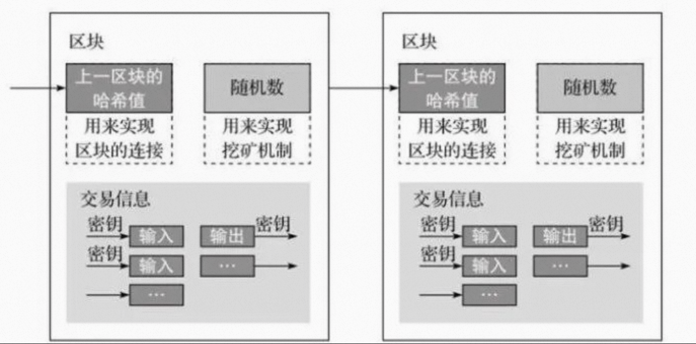

在当前区块加入区块链后，所有矿工就立即开始下一个区块的生成工作：
1. 把在本地内存中的交易信息记录到区块主体中；
2. 在区块主体中生成此区块中所有交易信息的Merkle树，把Merkle树根的值保存在区块头中；
3. 把上一个刚刚生成的区块的区块头的数据通过SHA256算法生成一个哈希值填入到当前区块的父哈希值中；
4. 把当前时间保存在时间戳字段中；
5. 难度会根据之前一段时间区块的平均生成时间进行调整，以应对整个网络不断变化的整体计算总量，如果计算总量增长了，则系统会调高数学题的难度值，使得预期完成下一个区块的时间依然在一定时间内。

# 4、比特币难题

## 4.1 “分叉”问题

如上文所述，挖矿的本质就是让矿工互相竞争求解一个数学题，谁先解出来了，他就大喊一声：“我的工作量证明成功了，你们快来看。”全体矿工就都过来把那一页目抄写一份，贴在自己账本的最后面，然后又开始新的记账过程。

在这个过程中，如果出现这样一种情况：两个矿工同时解出了题目，这时要怎么办呢？

由于每个矿工的区块数据都不一样，所以他们解题得出的结果也是不一样的，都是正确答案，只是区块不同。于是，区块链在这个时刻，出现了两个都满足要求的不同区块。由于距离远近不同，加上网络有延迟，**不同的矿工看到这两个区块是有先后顺序的**。通常情况下，矿工们会把自己**先看到的区块**复制过来，然后接着在这个区块开始新的挖矿工作。如此一来，便出现了区块链的**分叉现象**。

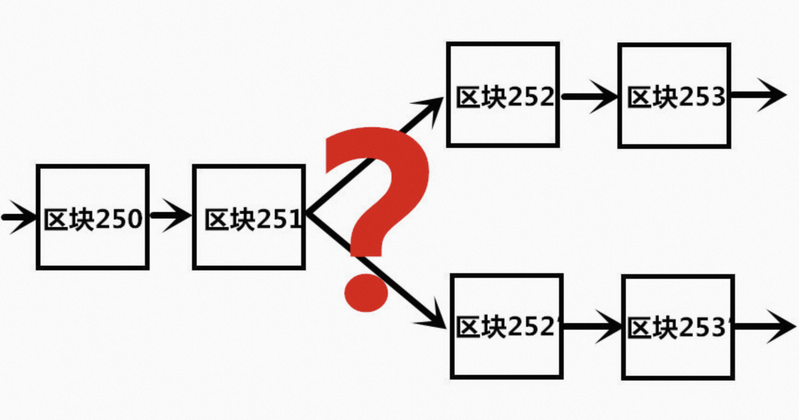

在以工作量证明机制为共识算法的区块链系统中，这个问题是这样被解决的：从分叉的区块起，由于不同的矿工跟从了不同的区块，在分叉出来的两条不同链上，算力是有差别的。形象地说，就是跟从两个链矿工的数量是不同的。由于解题能力和矿工的数量成正比，因此两条链的增长速度也是不一样的，在一段时间之后，总有一条链的长度要超过另一条。当**矿工发现全网有一条更长的链时，就会抛弃他当前的链**，把新的更长的链全部复制回来，在这条链的基础上继续挖矿。所有矿工都这样操作，这条链就成为了主链，分叉出来被抛弃掉的链就消失了。

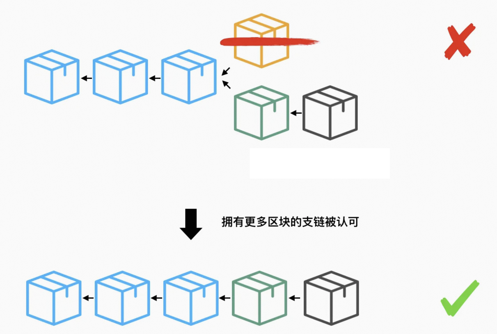

最终，只有一条链会被保留下来，成为真正有效的账本，其他都是无效的，所以整个区块链仍然是唯一的。

## 4.2 “双花”问题

仔细琢磨分叉修复的过程，会发现其中有个巨大的漏洞。因为时间差肯定会产生一些模棱两可的地方，这往往会给数据安全埋下一颗雷。

比如，我的一个交易区块很不巧地被归在了一条较短的支链上，这条支链在竞争过程中理所当然输掉了比赛，区块最终会被丢弃。在等待下次区块重新确认的过程中，这个时间差内，似乎可以做点什么坏事，就比如说“双花”（双花，花两次，双重支付的意思）。

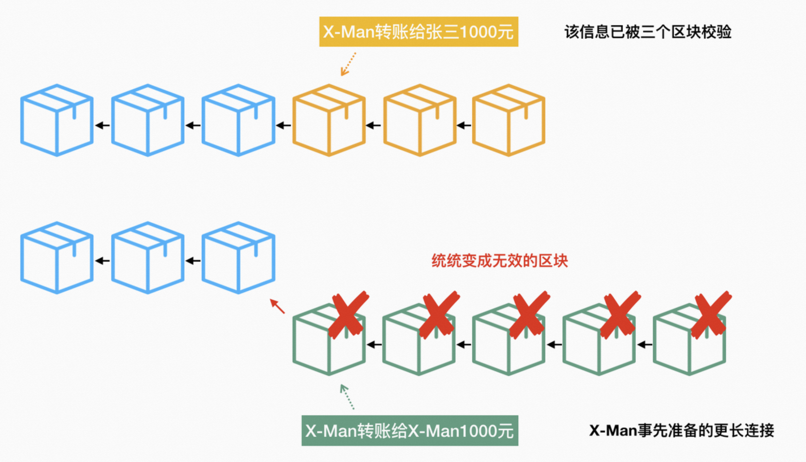

假设有一个名叫X-Man的坏家伙，他控制了一个计算机节点，这个节点拥有比地球上任何一个节点算力都强大的计算机集群。
1. 首先，X-Man事先创造了一条独立的（不去广而告之）、含有比较多区块的链条。其中一个区块里放着“X-Man转账给X-Man 1000元”的纸条。
2. 接着，X-Man跟张三购买了一部手机，他在小纸条上记录下“X-Man转账给张三1000元”。张三已经比一般的卖家谨慎了，他在这条信息被三次确认后（即三个区块被真实挖出、校验和连接）才将手机给了X-Man。按照我们之前的理解，这条交易记录已经板上钉钉永远无法被串改。
3. X-Man拿到手机之后，按下机房的开关，试图将先前已经创造的区块链条连接在自己这个节点区块链的末尾。
4. 大功告成，X-Man拥有了一条更长的区块链条，那些较短、存放着“X-Man转账给张三1000元”的区块链，以及在区块链世界里那则真实转账行为被一同成功销毁。

实际上以上操作并不会成功，区块链世界的规则远比我们想象的要健全很多。

回到上面的场景，当X-Man提前准备好的那条支链打算连接到主链时，主链会立马意识到，那条支链（的第一个区块）的时间戳存在异常，不属于当前区块链世界里线性增长的时间戳，于是马上意识到这个事先准备的链子（的第一个区块）是无效的，需要重新计算。
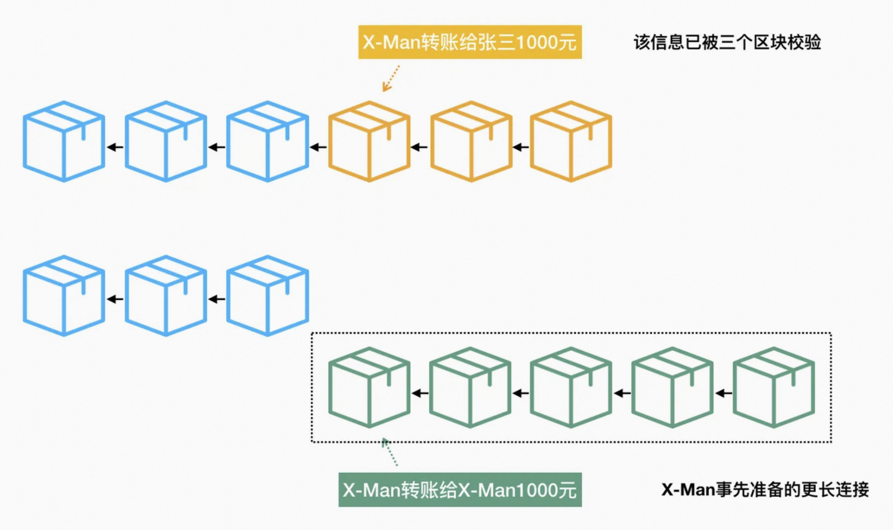

在区块链的世界，重新计算的行为等同于把自己的支链归零，跟世界上其他所有的节点一同竞争挖矿。你会说，我拥有更强大的计算能力，但是对不起，跟你竞争的对象并不是某一个节点，而是全球所有算力的集合，在这个集合中，你拥有的算力永远都只是一个很小的子集。所以，根据区块链算力民主、少数服从多数的基本原则，这个构想将永远不会成立。

比特币虽然至今没有出现过双花问题，但也不是绝对不会出现，比如**51%算力攻击**。但为什么没有人这么做，首先是由于成本太高，没有人能轻易掌握51%的节点。即便一个人已经掌握了51%的节点，那么他就已经是比特币网络当中的最大受益者，如果发动51%攻击，可以短期获利，但是比特币的价值将会遭受毁灭性打击，届时他就会成为最大受害者。

# 5、比特币的交易模型

## 5.1 UTXO模型

比特币系统是没有余额的概念的，它使用的是**UTXO模型**（Unspent Transaction Outputs，未使用过的交易输出），我们在交易过程中经常说的**钱包余额，实际上是一个钱包地址的UTXO集合**。所以，在比特币网络中，存储比特币余额的是交易输出，准确点说就是未使用过的交易输出。

随着钱从一个地址被移动到另一个地址的同时形成了一条所有权链，像这样：

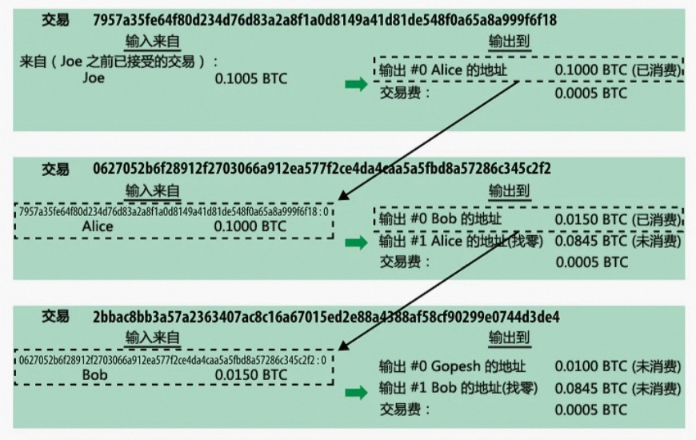

每一笔交易记录了时间、发送人、接收人和金额。那如果要计算A的余额，那么就要遍历所有跟A有关的交易，减去A发送的每一笔金额，并加上A接收的每一笔金额，可以计算出。

## 5.2 交易过程

交易有两种类型，一种是Coinbase交易，也就是挖矿奖励的比特币，由于没有发送人，所以比较特殊。另一种就是我们常见的普通交易了，包含输入和输出的。
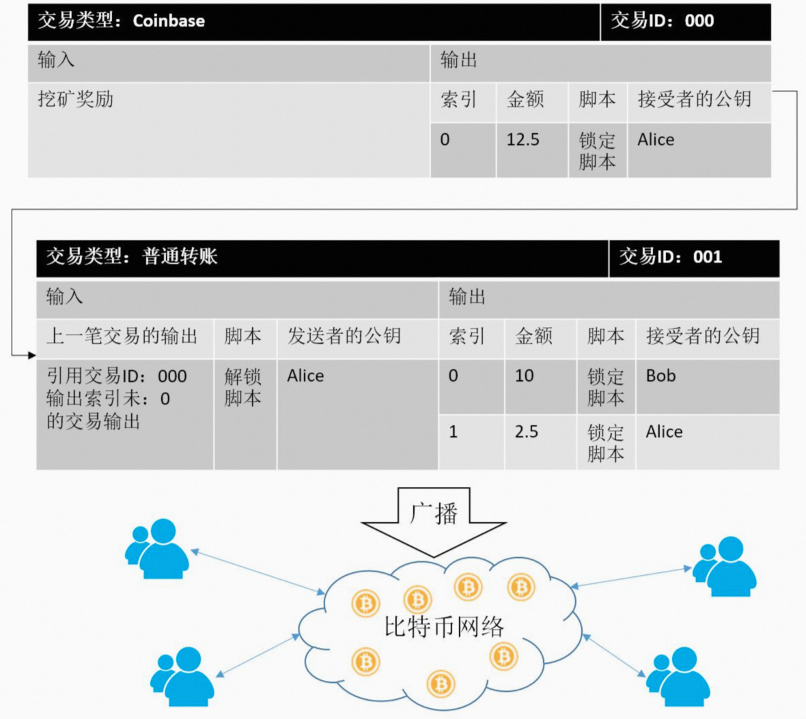

这里我们假设，由于Alice挖矿被奖励了12.5个比特币。而Alice在一笔交易中，需要转账给Bob10个比特币。而Bob最终确认并接收了Alice发送的10个比特币，而同时由于多出了2.5个比特币。其实这笔交易最终是生成了2个输出，一个是发送给Bob的10个比特币，另一个是找零产生的发给Alice的2.5个比特币（备注：这里不考虑交易费）。

在这里面，发生了几个关键的操作：

* (1)最开始，Alice由于挖矿被奖励了12.5个比特币，从而产生一笔Coinbase交易。这个交易中包含一个输入和一个输出。输出中，包含当前输出的索引、金额、锁定脚本和接受者的公钥。这里锁定脚本的作用是，设定成只有Alice才能使用这笔输出。而**要使用这个UTXO，就必须要证明自己是Alice**。
* (2)然后，由于Alice要发送给Bob10个比特币，那么她首先要做的就是**确认自己有没有足够的“余额”去支付这笔交易**。我们在上一节说了，要计算用户的余额，就要遍历Alice的所有交易记录，这里，我们假设Alice就只有一笔Coinbase交易，也就是说Alice当前的余额是12.5个比特币。由于12.5大于所要支出的10个比特币，所以交易可以进行。
* (3)接下来，就是要创建一笔交易。这笔交易包含1个输入、2个输出（一个发送给Alice，一个找零发给自己）。

由于比特币采用UTXO模型，一笔交易的输入实际上使用的是上一笔交易的输出（UTXO）。输入中也包含发送者的公钥，这里是Alice的公钥。这里，有一个很重要的问题，我们怎么知道Alice使用的是自己的UTXO呢？如果Alice使用的是别人的UTXO，我们怎么去校验呢？

这里，我们看到输入中除了引用上一个交易输出和发送者Alice的公钥，还包含了一个**解锁脚本**。解锁脚本里包含了Alice对上一笔交易输出的签名和自己的公钥。我们知道通过数字签名技术，我们可以使用公钥对用户的签名（私钥加密）进行验证从而证明签名者是否用户本人。如下图，我们就可以通过解锁脚本中提供的Alice的签名和公钥去验证Alice使用的是否是自己的UTXO。

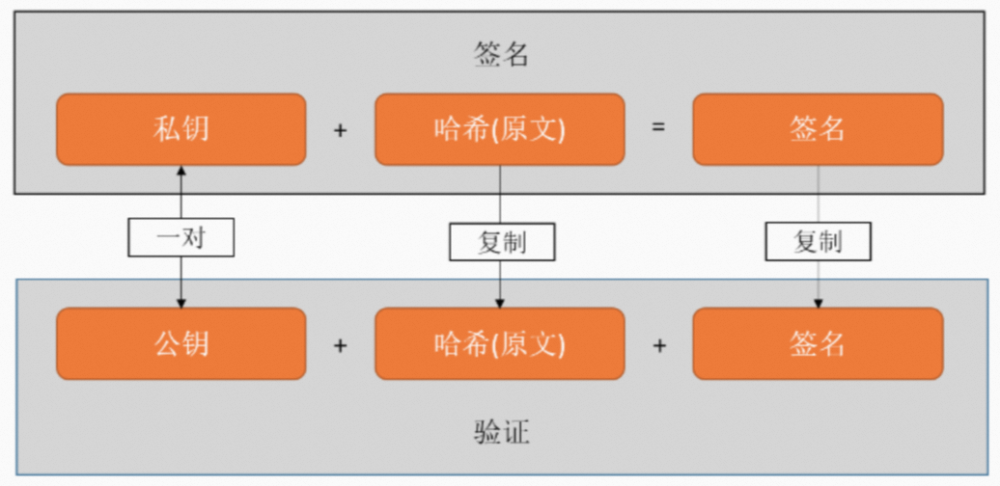

* （4）上一步，我们验证了该交易中输入所引用的上一笔UTXO确实是Alice的，从而证明了该输入的有效性。接下来，就需要创建2个输出，一个是给Bod的10个比特币，同时包含一个锁定脚本，该锁定脚本限定只有Bod才能使用；另一个是找零产生的输出，发送给Alice的2.5个比特币，同样的也包含一个锁定脚本，并且限定只有Alice本人才能使用。
* （5）最后交易创建完成后，就向比特币网络广播出去，当比特币网络确认这笔交易并且将这笔交易在下一次挖矿竞赛中，将该交易打包进区块中并得到全网共识确认后，这笔交易就确认有效了。

比特币的基本交易过程就基本这样。

## 5.3 交易脚本

比特币客户端使用一个用类Forth语言编写的脚本去验证比特币的交易，这个脚本语言不是图灵完备的，不具备循环等复杂的特性。它是一种**基于堆栈的执行语言**，该脚本语言的简单特性，虽然使得它不能实现复杂的功能，但是也提高了交易脚本的安全性（设计简单，减少了攻击面）。而以太坊就是诟病比特币交易脚本功能有限，所以设计了一个图灵完备的脚本语言，也就是我们常说的智能合约脚本语言，能实现更复杂的功能，但同时也增加了安全隐患。

当一笔比特币交易被验证时，每一个输入中的解锁脚本与其所引用的输出中的锁定脚本同时执行，从而检查这笔交易是否有效。如图8所示，是最为常见类型的比特币交易的解锁和锁定脚本。

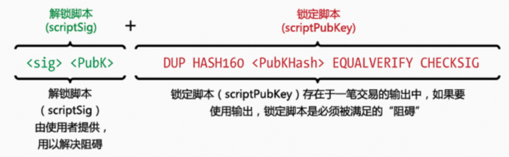

看起来很复杂，其实就是一条条指令。

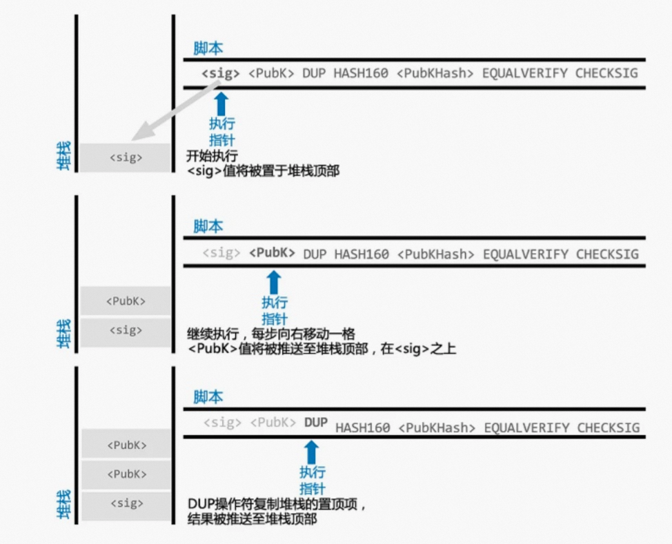

上图为解锁脚本运行过程（主要是入栈）。

### 步骤一 PUSHDATA(signature)

把解锁者提供的签名 signature 压入栈顶；

### 步骤二 PUSHDATA(public-key)

把解锁者提供的公钥 public-key 压入栈顶；

### 步骤三 DUP

将栈顶数据复制一份；

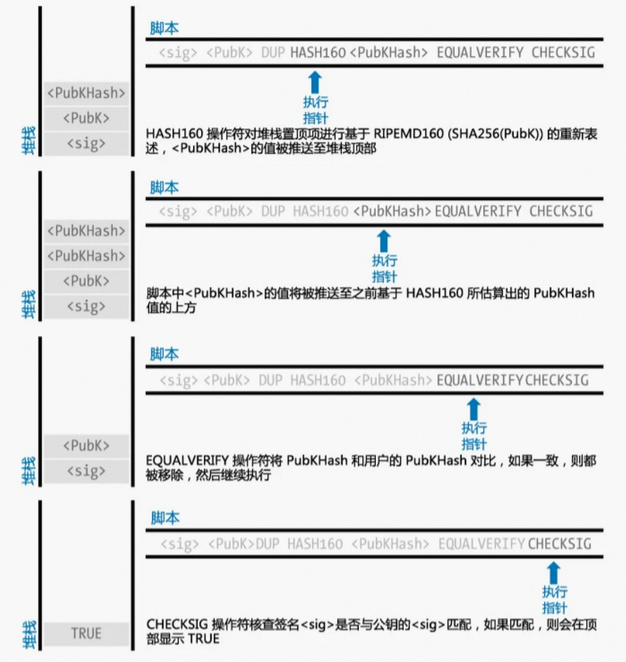

上图为锁定脚本运行过程（主要是出栈）。

### 步骤四 HASH160

将栈顶数据使用 HASH160 哈希算法加密；

### 步骤五 PUSHDATA(public-key-hash) 

将锁定者提供的 public-key-hash 加入栈顶；

### 步骤六 EQUALVERIFY

判断栈顶2个元素是否相等，相等的话就移除；

### 步骤七 CHECKSIG

使用栈顶的公钥 public-key 解密签名 signature，能够解密的话，执行成功；

这些步骤只有一个目的：证明 A 是这笔 UTXO 的所有者。

“锁定脚本”中包含的 public-key-hash 就是 A 的公钥哈希（注意：不是公钥），可以通过 A 的比特币地址解码出来。

所以，我们说知道对方的比特币地址就可以给对方转账，实质上是知道对方的 public-key-hash 从而可以制造“锁定脚本”，也就是所谓的 P2PKH(Pay-To-Public-Key-Hash)。

A 想要花费一笔 UTXO 的时候，需要提供“解锁脚本”，包含他的公钥(public-key)和对新建交易的签名(signature)。

签名是通过 A 的私钥对交易信息加密生成的，用私钥对交易信息签名完成后，就相当于宣告：

* 这是你本人行为；
* 任何人无法篡改交易信息，因为签名是对原始信息的加密，如果信息有变动，那么用你的公钥解密出原始内容后，就可以比对发现差异。

综上所述，将一笔 UTXO 作为交易的输入部分而花费的时候，你需要提供一段“解锁脚本”，包含有你的私钥加密后的签名。

当你把交易信息广播给节点的时候，节点会进行真实性校验：

* 确认存在这样一笔 UTXO；
* 将你提供的“解锁脚本”和 UTXO 携带的“锁定脚本”组合成一段代码并执行；
* 代码执行过程的本质就是确认你是这笔 UTXO 的所有者，是你本人准备花费它，而且交易信息在网络传输过程中没有被篡改过。

至此，“转账是本人操作”的问题已经解决。

# 6、这只是开始

比特币系统种所有精巧的设计，都只有一个目的：满足成为一般等价物的条件。

目前看来，比特币基本上做到了：
* 总量有限，减量供给
* 无法伪造
* 交易方便安全；
* 被广泛认可和接受
* 去中心化
* 全球发行和流通

比特币的优点很明显，就和它的缺点一样：

* 比特币的“挖矿”机制，耗费了全球大量的能源；
* 盲目的炒作令比特币价格剧烈波动，而货币的首要目标就是币值稳定；
* 交易的匿名性存在缺陷，比如此前勒索病毒要求使用比特币作为赎金；
* 比特币总量有限，所以是一种**通缩型货币**，价值只增不减，可能导致人人囤积，从而市场上缺少流动性，最终经济萎缩；
* 转账耗时，还需要手续费；
* 交易并发容量有限。 

**货币问题本质上是经济问题，但也是政治问题**。

政府发行货币，本身就是对其合法性的一种宣示。对货币发行的控制权本质上是对社会财富分配的控制权。

所以，对比特币盲目的乐观或消极的诋毁都是错误的。

从 2009 年正式问世以来，比特币在无数人的共同努力下不断发展，启发了人们关于货币体系的思考，这本身就是巨大的成就。

但更伟大的是比特币带来了区块链技术。区块链从比特币发展而来，但却远远超出了比特币的范畴。

区块链让人们看到了如何在没有“中心”的前提下构建彼此之间的信任。

“中心”的形成是因为信任的需要，因为只有建立了信任才能提高活动效率。但一旦成为“中心”，便带来垄断和不透明，这本身又侵蚀了效率。

比特币是一场伟大的社会试验，这场试验才刚刚开始。