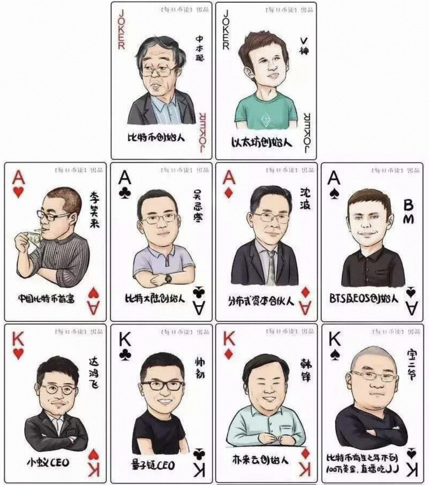
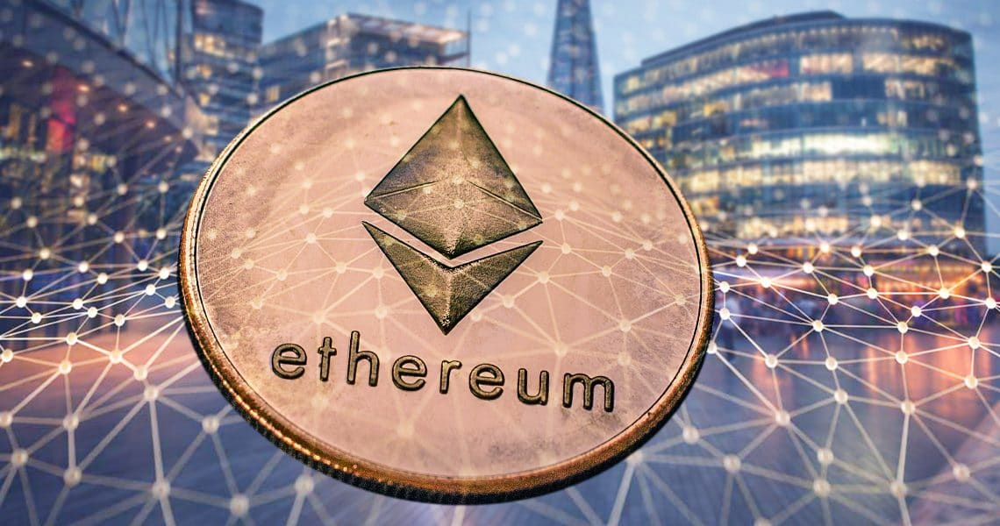
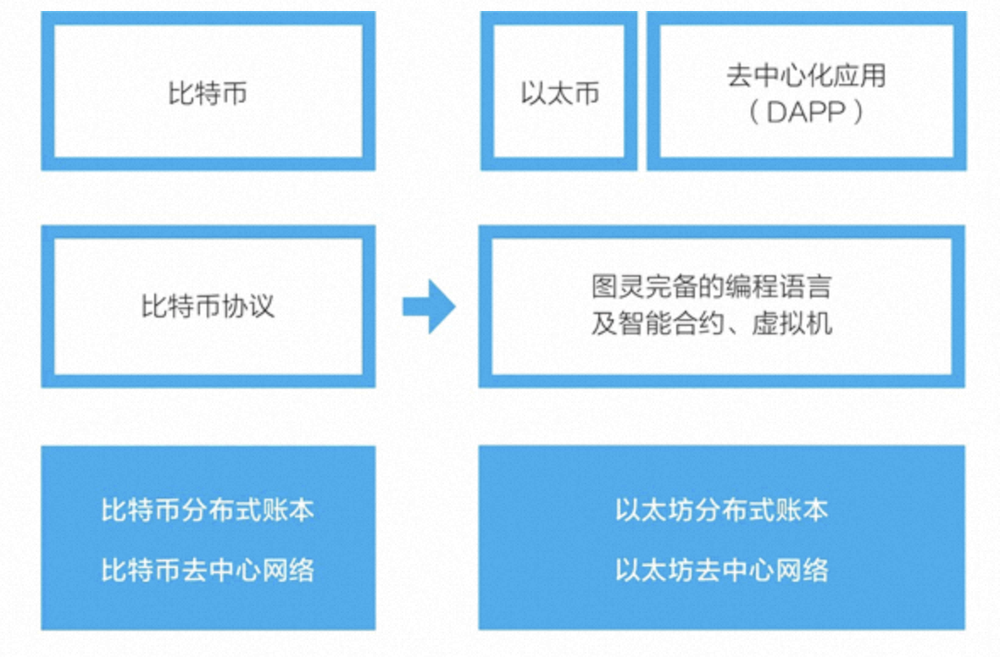
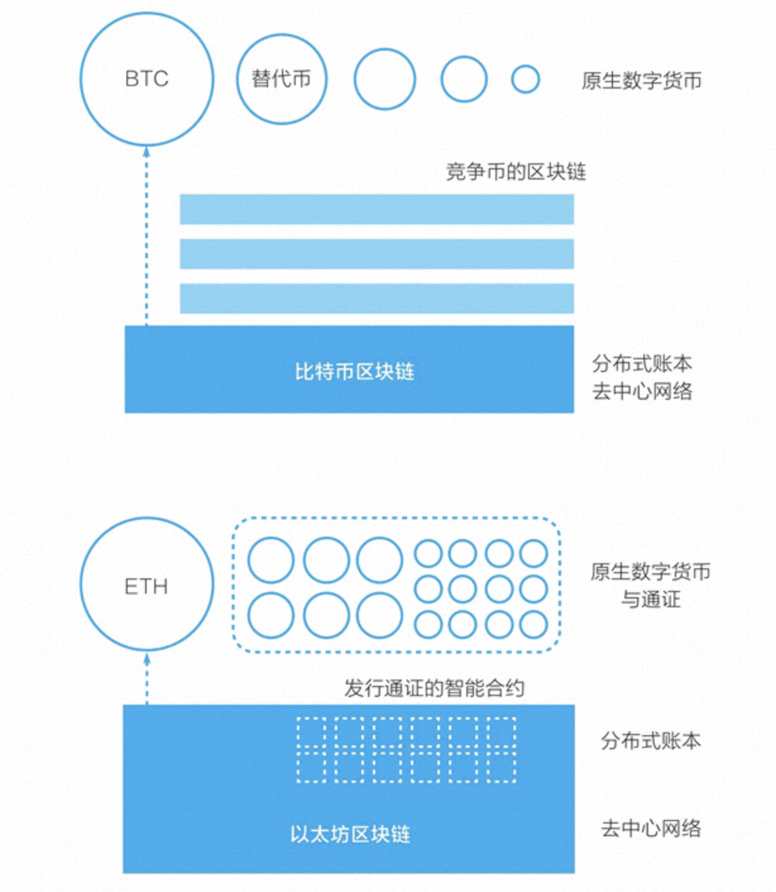
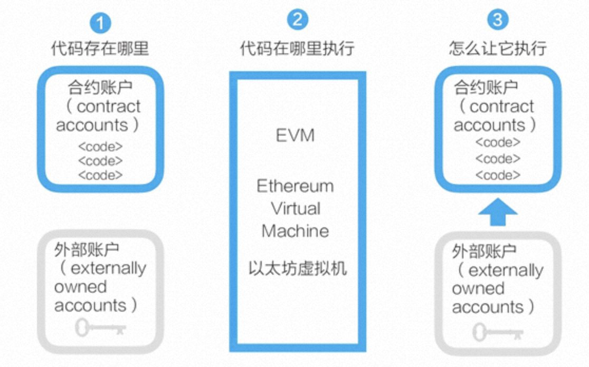
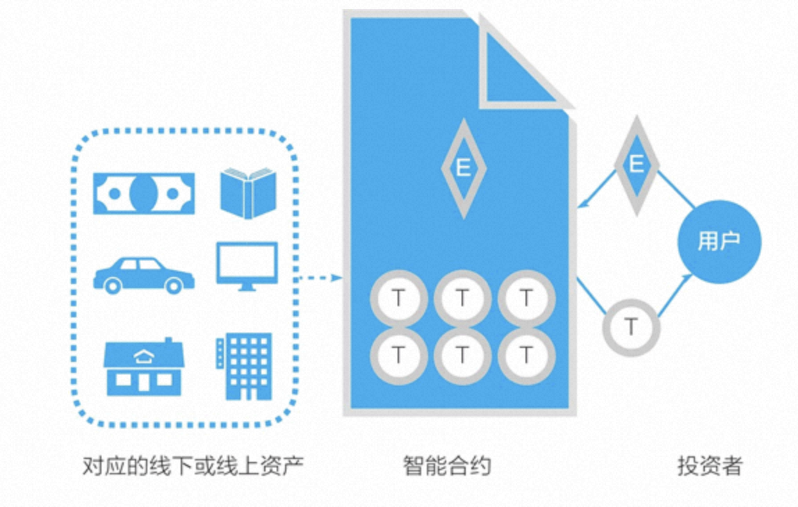

# 1、引言

通过深入了解比特币系统我们已经知道，比特币系统和它的区块链都是专为创建一个去中心化的点对点电子现金而设计的。区块链是源自比特币的底层技术，它让我们可以无须借助任何第三方中介直接进行价值表示和价值转移，它还给数字世界带来了价值表示物——**通证**。区块链将使互联网从**信息互联网**阶段跨越到**价值互联网**阶段。

但区块链技术要应用起来，还需要持续迭代升级。在过去这些年中出现了很多对比特币系统的改进，如替代币（altcoin）、替代链（alt chain）、侧链与跨链等。曾被认为是替代链的以太坊，是对比特币系统的众多改进中被广泛接受的一个。过去几年，基于以太坊区块链、以太坊的智能合约和通证标准，大量的通证涌现，这使以太坊变成仅次于比特币系统的热门生态。在软件层面，以太坊新加入的是**智能合约**，但在实际应用中，**它真正带来巨变的是通证**。

如果把比特币系统看成区块链 1.0，则以太坊是当之无愧的升级迭代版，是区块链 2.0 的典范。现在，有不少新项目在认可以太坊是区块链 2.0 的前提下，试图竞争成为所谓的区块链3.0，试图成为应用开发的新一代平台，竞争才刚刚开始。

# 2、V神与以太坊

币圈流传着一套币圈大佬的扑克牌，大王是从来没有现身过的比特币的创始人中本聪，小王是以太坊的创始人V神，如今币圈发生了翻天覆地的变化，这副大佬的扑克牌也跟着变化，但是没有变的是大王和小王，至今仍然是屹立不倒。

## 2.1 以太坊的萌芽

V神的真名叫**Vitalik Buterin**，1994年在俄罗斯出生，5岁时跟随父亲移民加拿大。他的童年跟历史上所有的天才少年一样，天赋异禀，才思高人。4岁，Vitalik收到一台父亲送的电脑，就痴迷于微软的Excel软件，不久就能用Excel撰写自动计算的程序；7 岁，他创建了一个全是图表和数学公式的“兔子百科全书”文档，被确定具有数学、程序设计方面的天赋；10岁，他的三位数心算速度是同龄人的一倍还多；11岁，在“天才少年班”学习数学、编程和经济学等科目。

2007年13岁的V神沉迷于网络游戏《魔兽世界》，和普通的网瘾少年无异，他经常在游戏上耗费一整天，直到2010年暴雪将《魔兽世界》中，V神最爱角色的生命虹吸技能取消，没有任何理由。这对V神造成了巨大的打击，迅速在论坛发帖，甚至直接发邮件联系暴雪的工程师，要求恢复生命虹吸。但魔兽世界创作团队态度一向强硬。直接回应，“不能恢复”。

此时的V神立刻意识到这不是角色的变化，而是说角色的权力掌控在了某一个中心化的组织。他觉得这是一件非常恐怖而且不公平的事情。所以V神删除了《魔兽世界》，但是事情并没有就此画上句号。V神开始思考这背后的逻辑到底是什么样子的，他觉得在这种中心化的管理之下，玩家和游戏运营者的关系不对等，游戏公司可以随意的更改，甚至关停游戏，那么玩家们在游戏所有的付出随时随地都有可能因为游戏运营者的意愿而化为虚无，正是因为这段经历，在V神的心中种下一个去中心化的念头。

V神的父亲在公司偶然听说了比特币，就立刻兴奋的回家向V神介绍了比特币的特点，同时十分看好比特币的前途。而就在了解了比特币背后的逻辑以后，V神也为之着迷了。他回想起当初被《魔兽世界》中心化支配的痛苦，他感受到比特币的去中心化不就是一剂完美的解药吗？所以他决定要收集比特币，为此他专门找了一份以比特币支付薪水的工作。有一家媒体愿意出每篇文章5个比特币的薪水让V神供稿，或许V神当时也没有想到自己某一天也会和中本聪一样，成为了被无数人景仰的神。

通过媒体这个翘板，他发现原来有如此多的人对比特币、区块链、加密货币感兴趣，这是一个潜力无限的领域，一种区别于当前互联网的模式。由此。V神彻底沦为比特币信徒，并决定为此努力。

## 2.2 以太坊的诞生

2013年，V神不顾父亲的反对，在大学刚8个月后果断退学，开始周游全球。去了美国、西班牙、意大利等各地的数字加密公司和比特币社区。他曾有一段时间待在中国，他的中文也很好，常和中国网友在论坛上用中文交流。在这段时间内，他在全球与网上认识的朋友们见面交流比特币系统和区块链编程，同时参与了比特币2.0围绕支付与安全的改进。

在此期间，V神向比特币社区提出了**打造智能合约的想法，让开发者可以在链上开发，让用户可以体验链上应用**。但是，他的想法无法得到比特币社区的认可。因而他开始考虑，也许自己应该开发一个带有脚本编程语言的新平台。

2013 年年底，他在回到加拿大多伦多后，发布了一份白皮书形式的论文——***《A Next-Generation Smart Contract and Decentralized Application Platform》***（《下一代智能合约和去中心化应用平台》）。他在详细地分析了比特币系统的设计、优点和不足后，提出要建立一条新的区块链，使之成为去中心化应用的平台。

V神从 2014 年开始全职开发以太坊项目，开发的初始资金只有当初赚取的一部分稿费，这些钱仅仅支撑了以太坊的开发不到20天就被花完了。最终他决定把自己这条还没有证实的、还没有完全开发的公链带到中国来试试水，他觉得中国有非常多的比特币的拥护者和爱好者，在这里他相信能够募集到资金。

但是V神在当时就是个纯粹的程序员，谦卑、有问必答，逢人交换经验，沟通代码技术，有时还语速极快的说着一些别人听不懂的想法。甚至在比特币活动后的自由交流时，被人冠以骗子的称号。提到以太坊，在这里没有人信他。

在中国的这几天，V神心灰意冷，连续受挫，就在准备放弃的时候，万象集团的创始人沈波给了他希望。不仅带来了经济上的支持，还拉着他四处演讲，给他布道以太坊未来的机会。

但是，钱还是不够用。V神创造以太坊的愿景太过于宏大，一个人的力量肯定是不够的，他意识到，还需要更多的相信以太坊的力量的人加入进来才可以。

在重重压力下，V神决定用ICO的方式募资，用比特币换购以太坊，并创办非盈利公司*Ethereum Foundation*。

2015年以太坊正式上线，这一年V神年仅21岁。

通过一系列操作，V神最终募集到了31000个比特币，在当时价值是1800万美金，这笔钱就放在了以太坊基金会当中，成为了以太坊重要的资金来源，而且奠定了以太坊成为第二市值加密货币的地位。

## 2.3 以太坊的升级

但是辉煌的背后，问题也从来没有消失，摆在V神面前不仅仅是行业整体的浮躁和欲望，还有来自以太坊自身的危机。

以太坊和比特币对比，主要的区别在于**以太坊独有的智能合约**。这个试图成为数字化全透明、去中心化的合约中介，在区块链3.0时代到来之后，却出现了网络拥堵，交易缓慢，费率过高的问题。另外以太坊的智能合约，它的通用性和可塑性是非常强的，任何用户都可以根据他的需求，来定制自己的智能合约。而且这个智能合约在其他的加密货币当中也可以使用，这些都是以太坊的优点，但是也因此给以太坊带来了安全方面的隐患。

2016年6月17号，以太坊爱好者永远不会忘掉的一天。

2016年的5月，以太坊的去中心化组织*The Dao*完成了1.5亿美金众筹。作为一家以太坊风险投资机构。*The Dao*可以不受任何组织控制，也因此被黑客盯上。1个月后，黑客找到了*The Dao*的代码漏洞，迅速组织了攻击。价值5000万美元的以太坊被盗，以太坊的价格应声暴跌，从20美金拦腰跌到10美金，市值蒸发了5个亿。

但是V神并没有放弃，沉重的痛苦让他做出决定，他**允许项目方直接在以太坊上发行代币来代为融资**。基于通证数量的暴涨，以太坊自己的燃料货币“以太币”的价格在一年的时间里最高涨了 170 多倍，从 2017 年年初的 8 美元涨到年底的接近 1400 美元。

这一年，他24岁，身价过亿，登上全球富豪榜。

V神引领着以太坊系统的开发，也带动着整个区块链技术的开发和应用。在中文网络论坛中，网友对他的称呼从“V生”变成了“V神”。

随后，以太坊因为持续的发展、爆发式的流量，导致了以太坊链上异常的拥堵。从此V神就一直努力争取**以太坊链上权益证明机制的转变**。

关于Pow转Pos，一直以来都争论不休。至于为什么要转，第一，维护安全的成本更低，可以消耗更少的能源来维护共识。第二就是Pos更加安全，更难受到51％的攻击，但是这两项我觉得它是结果，而不是原因。真正的原因其实还是以太坊的技术本身，因为以太坊生态的需求、市场的要求、监管的要求、以太坊必须实现扩容，就必须要转为Pos。

以太坊作为全球最大的区块链的社区，市值第二大的加密货币的承载者，以太坊拥有1.8亿个持币地址的数量，总市值曾经高达4000亿美元，合并对于区块链产业将会产生不可估量的影响，所以这个过程必须谨慎又谨慎，因此也就出现了我们所看到的一拖再拖的现象。

V神是个很坦荡的人，也是个有毅力的人，在他的世界里，他只是单纯的希望以太坊能够渗进到所有工业当中。要将全世界的经济，社交，文化都能够去中心化的充满理想的少年。当然尽管这个过程很艰难，但是V神和他的团队终于克服了困难，并于2022年9月15日完成了合并。

V神坚定地认为，这次的合并将能够让加密支付再次成为主流，让以太坊更上一层楼。

但以太坊的升级还没有结束，合并只是整个升级过程中的第二步，关于V神的故事还将继续下去。

## 2.4 以太坊的目标

在以太坊白皮书摘要部分，V神这样描述以太坊的目标：

> 以太坊的目标是，提供一个区块链，内置有成熟的图灵完备的编程语言，用这种语言可以创建合约来编码，实现任意状态转换功能。

“状态转换”反映了V神对比特币系统和区块链的认识。在白皮书中他认为，**比特币是一个状态转换系统，而他为以太坊设计了一个更灵活的状态转换系统**。

以太坊的目标描述可以细分成以下三个部分：
* 创建一个新的区块链
* 有一个能实现所有计算，即所谓的**图灵完备的脚本编程语言**
* 这个脚本语言可以用来创建复杂的“智能合约”，用以控制区块链的状态转换，也即进行链上数字资产的转移。

以太坊的最初设计目标是建立一个智能合约和去中心化应用平台，它和比特币区块链的最大不同是，它包括了一个图灵完备的编程语言——**Solidity**。利用 Solidity，我们可以在以太坊上更方便地编写“智能合约”，以太坊也提供了一个代码运行环境——**以太坊虚拟机**（EVM）。有了这些，在以太坊区块链上，逻辑上我们就可以开发**去中心化应用**（decentralized application）了。去中心化应用常被简写为 **DAPP**，现在它通常指利用了区块链技术的网站或移动 App 应用。

业界普遍把区块链分为3个发展阶段：
* **区块链1.0**：以电子货币为代表
* **区块链2.0**：以智能合约为代表
* **区块链3.0**：以DAPP为代表

我们现在看到，以太坊并没有像最初设想的那样，从区块链1.0跨出两大步，直接成为去中心化的应用平台。在实践中，它跨出了一步或者说半步：**以太坊区块链上最常用的功能并非去中心化应用，而是编写智能合约**，更符合实际情况的说法是，**编写智能合约以管理用通证表示的数字资产**。

这可能是区块链这个新兴技术在发展和应用过程中的必然阶段，**一个新技术总会首先被用于当前条件下最适用的领域**。

# 3、ERC20 通证标准

为了理解通证与数字资产，我们再来对比一下比特币和以太坊。

在比特币的二次开发或应用中，最广为人知的是众多的替代币。人们简单修改比特币开源代码的参数，然后就可以用这个代码运行一个新的区块链，创建新的替代币。

在以太坊的二次开发或应用中，最为广泛的是基于它的智能合约创建符合**ERC20标准**的通证。以太坊的智能合约将创建通证的门槛降到了很低，还将进行代币众筹的门槛降到了很低。

在以太坊区块链上，代币众筹的流程是，一个区块链应用项目的团队在以太坊上创建一种通证，然后投资者可以用自己的以太币按照规则兑换项目的通证。

为了获得所需的资金，在 2014 年 7 月到 8 月，以太坊进行了为期 42 天的在线众筹：参与者可以用比特币换取以太坊的通证——以太币。

这个代币众筹可以看成是，面向比特币持有者进行了一次以太币的预售。在 2008 年前后，KickStarter、Indigogo 等产品众筹网站开始逐渐建立，后来还出现了股权众筹等各种形式。以太坊的众筹可以说是这种产品众筹方式的延续，不同的是：

* 它所筹集的不是法币（法定货币），而是比特币。
* 人们获得的不是明确的商品或股权，而是换得了以太币。

这个以太币有什么用，代表什么权益，当时参与者均没有对此进行多少探讨。毕竟，这次代币众筹是在当时非常小的比特币社区中进行的，带有强烈的理想主义，很像是比特币社区的成员们用自己手上的比特币赞助了一个新区块链的开发。

代币众筹与后来的名字**ICO**（Initial Coin Offering，首代币币发行）在2017年大为盛行后又陷入巨大争议，这个机制被滥用了。

在 2015 年 11 月 19 日，以太坊的主要开发者Fabian Vogelsteller向社区提议了 **ERC20 标准**。

> ERC（Ethereum Requests for Comments）**以太坊意见征集**，是EIP(Ethereum Improvement Proposals )以太坊改进建议的一部分，包括一些关于以太坊网络建设的技术指导，它是Ethereum开发者为以太坊社区编写的。

ERC20 标准是一个用以太坊区块链智能合约发行**可互换通证**（Fungible Token）的方案。所谓可互换通证，指的是每一个通证都是一模一样的，比如任何两张 100 美元的价值是完全相同的，又比如你持有的一家上市公司的1万股普通股股票和我持有的 1 万股普通股是可互换的。

与之相对的是**ERC721 标准**，定义了**不可互换通证**的标准接口。不可互换通证也称为**非同质化代币**（Non-Fungible Tokens，NFTs），类似于现实生活中的书画、邮票等收藏品，比如我的一本专门题名给我的签名书和你的同一本书是不同的，二者不可互换。

有了 ERC20 通证标准，我们可以在以太坊上很简单地编写一个智能合约，创建表示价值的通证。在 2017 年，这些符合 ERC20 标准的通证的重要用途是被用于首次代币发行的筹资，人们可以用以太币按照项目方设定的兑换率来换取这些通证，而项目方获得以太币形式的资金。

以太坊区块链及其智能合约、ERC20 通证标准提供了简单地创建代表价值的通证的技术方案，最终在 2017 年造成了通证的大爆发。这些通证在各个国家或地区的合规是一个引起激烈争论的议题。但不管怎样，从技术上讲，以太坊的实际功能是数字资产系统，实现了从“数字现金”到“数字资产”的升级。

# 4、智能合约

以太坊的智能合约并非现实中常见的合同，而是**存在区块链上，可以被触发执行的一段程序代码**，这些代码实现了某种预定的规则，是存在于以太坊执行环境中的“自治代理”。

以太坊的智能合约设计很简明。
* 任何人都可以在以太坊区块链上开发智能合约，这些智能合约的代码是存在于以太坊的账户中的，这类存有代码的账户叫**合约账户**。对应地，由密钥控制的账户可称为**外部账户**。
* 以太坊的智能合约程序，是在**以太坊虚拟机**（Ethereum Virtual Machine,EVM）上运行的。
* 合约账户不能自己启动运行自己的智能合约。**要运行一个智能合约，需要由外部账户对合约账户发起交易**，从而启动其中的代码的执行。

以太坊和比特币的一个重大不同是，前者提供了图灵完备的编程语言（Solidity）和相应的运行环境（EVM）。所谓图灵完备，指的是这个脚本编程语言可以运行所有可能的计算（包括循环、迭代等高级功能），而比特币的UTXO模型和脚本只能运行部分计算。

以太坊的智能合约被广泛应用的一个用途是创建通证，通证对应的多是以太坊区块链之外的资产。

图示是一个典型的ERC20通证发行过程：一个项目通过智能合约创建通证，这个通证是实体资产或线上资产的价值表示物。投资者（用户）发起交易，向智能合约转入以太币（ETH），智能合约自动运转，在满足一定规则后，它向投资者账户转入相应数量的通证。

