# 1、以太坊模型

## 1.1 状态机

**以太坊的本质就是一个基于交易的状态机**。在计算机科学中，状态机可以读取一系列的输入，然后根据这些输入，会转换成一个新的状态出来。

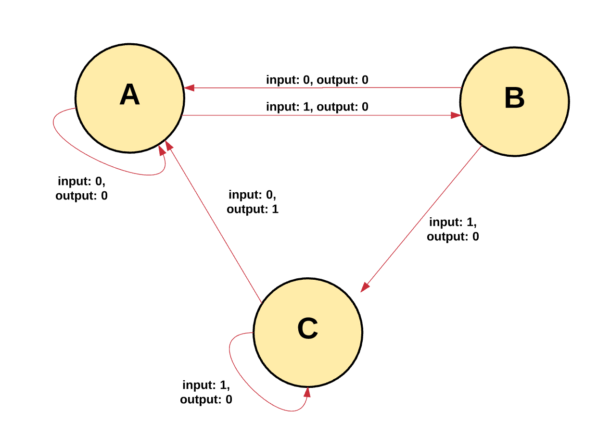

以太坊的状态机从一片空白的**创世纪状态**(genesis state)开始，被一笔笔交易推动，从一个状态转变为另一个状态。
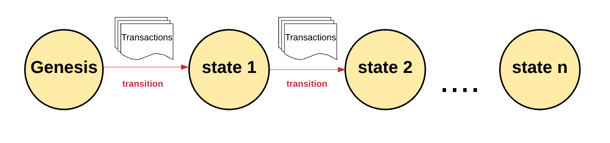

以太坊的每个状态携带有大量交易信息，这些信息都被组装到一个区块中。一个区块包含了一系列的交易，每个区块都与它的前一个区块链接起来。
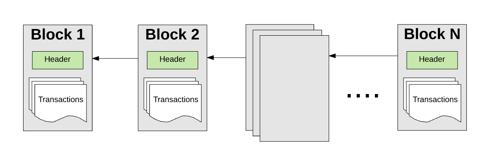

为了让一个交易被认为是有效的，它必须要经过一个验证过程，此过程也就是挖矿。**挖矿就是一组节点用它们的计算资源来创建一个包含有效交易的区块出来**。

任何在网络上宣称自己是矿工的节点都可以尝试创建和验证区块。每个矿工在提交一个区块到区块链上的时候都会提供一个数学机制的“证明”，这个证明就像一个保证：如果这个证明存在，那么这个区块一定是有效的。

为了让一个区块添加到主链上，一个矿工必须要比其他矿工更快的提供出这个“证明”。通过矿工提供的一个数学机制的“证明”来证实每个区块的过程称之为**工作量证明**(proof of work)。

证实了一个新区块的矿工都会被奖励一定价值的奖赏。以太坊使用一种内在数字代币—**以太币**(Ether)作为奖赏。每次矿工证明了一个新区块，那么就会产生一个新的以太币并被奖励给矿工。

## 1.2 GHOST协议

如前面所言，以太坊是一个被全球节点共享的状态机，它的状态必须具有唯一性，拥有多个状态（或多个链）会摧毁这个系统。如果链分叉了，你有可能在一条链上拥有10个币，一条链上拥有20个币，另一条链上拥有40个币。在这种场景下，是没有办法确定哪个链才是最”有效的“。

不论什么时候只要多个路径产生了，一个”分叉“就会出现。我们通常都想避免分叉，因为它们会破坏系统，强制人们去选择哪条链是他们相信的链。

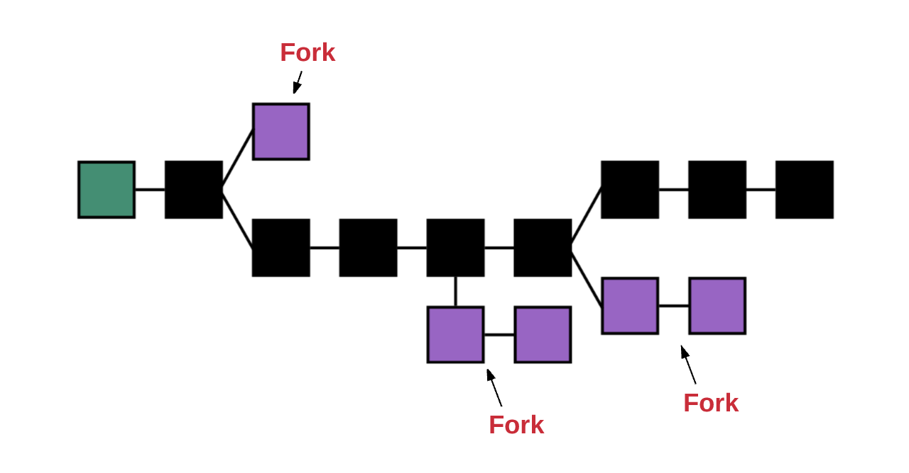

为了确定哪个路径才是最有效的以及防止多条链的产生，以太坊使用了一个叫做**GHOST协议**的数学机制。

`GHOST = Greedy Heaviest Observed Subtree`

简单来说，GHOST协议就是让我们必须选择一个**在其上完成计算最多的路径**。
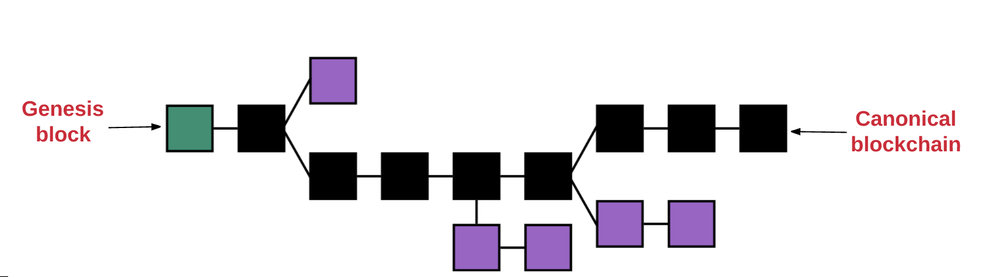

# 2、账户

一个以太坊帐户是一个具有以太币 (ETH) 余额的实体，可以在以太坊上发送交易。 帐户可以由用户控制，也可以作为智能合约部署。

以太坊的账户有两种类型：
**外部账户**：被私钥控制且没有任何代码与之关联
**合约账户**：被它们的合约代码控制且有代码与之关联

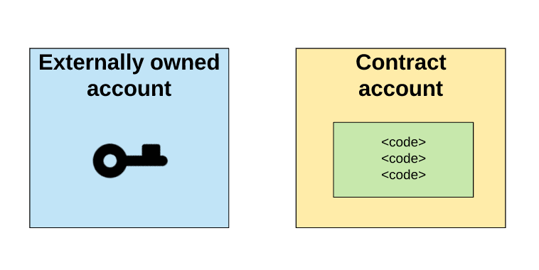

这两种帐户类型都能接收、持有和发送 ETH 和 token，与已部署的智能合约进行交互。

一个外部账户可以发送消息给另一个外部账户或合约账户。在两个外部账户之间传送的消息只是一个简单的价值转移。但是**从外部账户到合约账户的消息会激活合约账户的代码**，允许它执行各种动作。（比如转移代币，写入内部存储，挖出一个新代币，执行一些运算，创建一个新的合约等等）。而合约账户不可以自己发起一个交易。因此，**在以太坊上任何的动作，总是被外部账户触发的交易所发动的**。

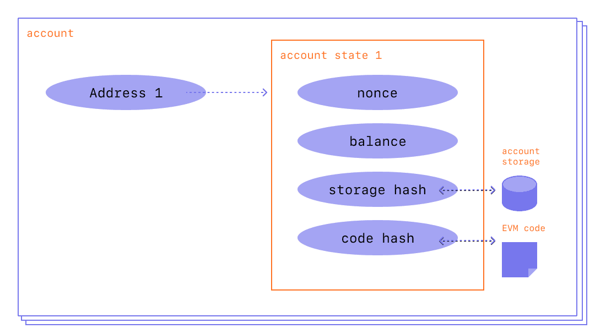

以太坊帐户有四个字段：：
* **nonce**：显示从帐户发送的交易数量的计数器。 这将确保交易只处理一次。 在合约帐户中，这个数字代表该帐户创建的合约数量
* **balance**： 此地址拥有`Wei`的数量。Wei 是以太币的计数单位，`1 Ether=10^18 Wei`
* **storageRoot**： 也被称为存储哈希，`Merkle Patricia`树的根节点Hash值。
* **codeHash**：此账户EVM代码的hash值。对于合约账户，就是被Hash的代码并作为codeHash保存。对于外部账户，codeHash域是一个空字符串的Hash值.

# 3、区块

所有的交易都被组成一个”块”。一个区块链包含了一系列这样链在一起的区块。

## 3.1 区块头

每个区块都有一个区块“头”，包含以下字段：
* **parentHash**：父区块头的Hash值（这也是使得区块变成区块链的原因）
* **ommerHash**：当前区块ommers列表的Hash值
* **beneficiary**：接收挖此区块费用的账户地址
* **stateRoot**：状态树根节点的Hash值
* **transactionsRoot**：包含此区块所有交易的Merkle树的根节点Hash值
* **receiptsRoot**：包含此区块所有交易收据的Merkle树的根节点Hash值
* **logsBloom**：由日志信息组成的一个Bloom过滤器
* **difficulty**： 此区块的难度级别
* **number**：当前区块的计数（创世纪块的区块序号为0，对于每个后续区块，区块序号都增加1）
* **gasLimit**：每个区块的当前gas limit
* **gasUsed**： 此区块中交易所用的总gas量
* **timestamp**：此区块成立时的unix的时间戳
* **extraData**：与此区块相关的附加数据
* **mixHash**：一个Hash值，当与nonce组合时，证明此区块已经执行了足够的计算
* **nonce**：一个Hash值，当与mixHash组合时，证明此区块已经执行了足够的计算

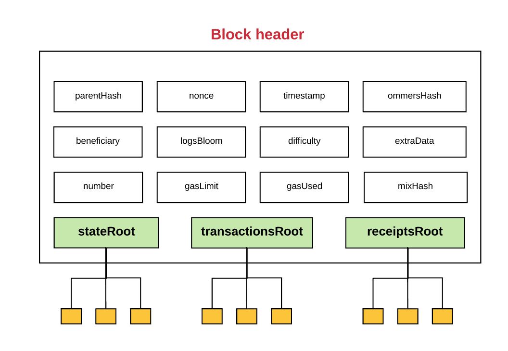

每个区块包含三个树形结构，分别对应：
* **状态**（stateRoot）
* **交易**（transactionsRoot）
* **收据**（receiptsRoot）

## 3.2 MPT树

以太坊使用**Merkle Patricia Tree**（MPT）的数据结构来存储。MPT是一种经过改良的、融合了默克尔树和前缀树两者优点的数据结构，是以太坊中用来管理账户数据、生成交易集合哈希的重要数据结构。

MPT中存储信息的高效性在以太坊的“轻客户端”和“轻节点”中相当的有用。宽泛地说，以太坊有两种节点类型：**全节点**和**轻节点**。

全节点通过下载整条链来进行同步，从创世纪块到当前块，执行其中包含的所有交易。通常，矿工会存储全节点，因为他们在挖矿过程中需要全节点。

比起下载和存储整个链以及执行其中所有的交易，轻节点仅仅下载链的头，从创世纪块到当前块的头，不执行任何的交易或检索任何相关联的状态。由于轻节点可以访问区块头，而头中包含了3个MPT树的根Hash值，所有轻节点依然可以很容易生成和接收关于交易、事件、余额等可验证的答案。

这个可以行的通是因为在MPT树中Hash值是向上传播的——如果一个恶意用户试图用一个假交易来交换MPT树底的交易，这个会改变它上面节点的Hash值，而它上面节点的值的改变也会导致上上一个节点Hash值的改变，以此类推，一直到树的根节点。

总之，使用MPT树的好处就是，该结构的根节点加密取决于存储在树中的数据，而且根节点的Hash值还可以作为该数据的安全标识。由于块的头包含了状态树、交易树、收据树的根Hash值，所以任何节点都可以验证以太坊的一小部分状态而不用保存整个状态，整个状态的的大小可能是非常大的。

## 3.3 区块难度

在工作量证明系统中，出块时间是带有概率性的，并由挖矿难度调节。

创世纪区块的难度是131072，有一个特殊的公式用来计算之后的每个块的难度。如果某个区块比前一个区块验证的更快，以太坊协议就会增加区块的难度。

区块的难度影响nonce，它是在挖矿时必须要使用工作量证明算法计算出的一个Hash值。

区块难度和nonce之间的关系用数学形式表达就是：

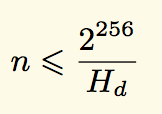

`Hd`代表的是难度。

找到符合难度阈值的nonce唯一方法就是使用工作量证明算法来列举所有的可能性。找到解决方案预期时间与难度成正比——难度越高，找到nonce就越困难，因此验证一个区块也就越难，这又相应地增加了验证新块所需的时间。所以，通过调整区块难度，协议可以调整验证区块所需的时间。

另一方面，如果验证时间变的越来越慢，协议就会降低难度。这样的话，验证时间自我调节以保持恒定的速率——**平均每15s一个块**。

# 4、Gas和费用

在以太坊中一个比较重要的概念就是费用，由以太坊网络上的交易而产生的每一次计算都会产生费用。这个费用是以`Gas`来支付。

Gas就是用来衡量在一个具体计算中要求的费用单位。`gas price`就是你愿意在每个gas上花费Ether的数量，以`gwei`进行衡量。`Wei`是Ether的最小单位，`1 Ether=10^18 Wei`。

对每个交易，发送者设置`gas limit`和`gas price`，代表着发送者愿意为执行交易支付的`Wei`的最大值。

例如，假设发送者设置`gas limit`为50,000，`gas price`为20`gwei`。这就表示发送者愿意最多支付`50,000*20gwei = 1,000,000,000,000,000 Wei = 0.001 Ether`来执行此交易。

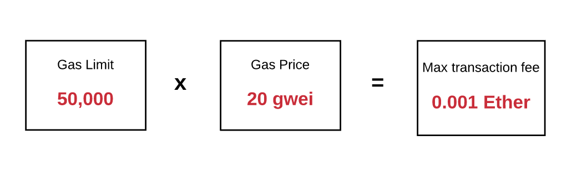

如果用户的账户余额有足够的Ether来支付这个最大值费用，那么就没问题。在交易结束时任何未使用的gas都会被返回给发送者，以原始费率兑换。

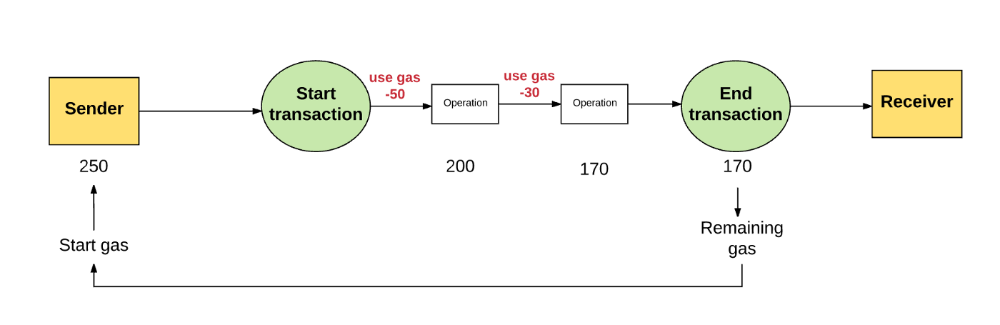

在发送者没有提供足够的gas来执行交易，那么交易执行就会出现“gas不足”然后被认为是无效的。在这种情况下，交易处理就会被终止，所有已改变的状态将会被恢复，最后我们就又回到了交易之前的状态——完完全全的之前状态，就像这笔交易从来没有发生。因为机器在耗尽gas之前还是为计算做出了努力，
所以理论上，将不会有任何的gas被返回给发送者。
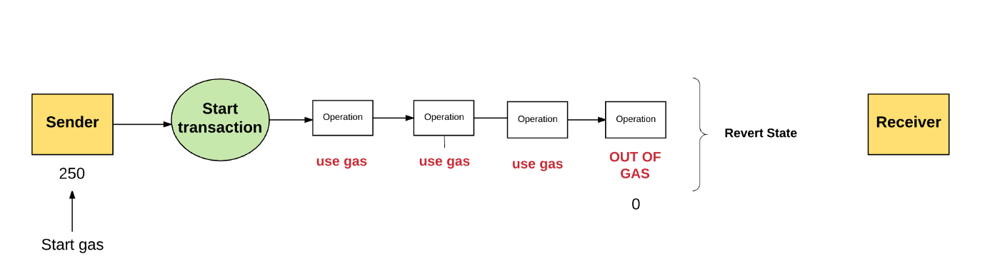

这些gas的钱到底去了哪里？发送者在gas上花费的所有费用都被发送到“受益人”的地址，通常情况下就是矿工的地址。因为矿工为了计算和验证交易做出了努力，所以矿工接收gas的费用作为奖励。

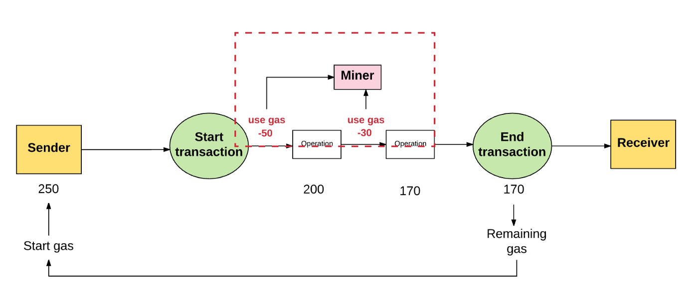

通常，发送者愿意支付更高的gas price，矿工从这笔交易中就能获得更多的价值。因此，矿工也就更加愿意选择这笔交易。这样的话，矿工可以自由的选择自己愿意验证或忽略的交易。为了引导发送者设置合理的gas price，矿工可以选择建议一个最小的gas值，此值代表自己愿意执行交易的最低价格。

以太坊的费用什么价值呢？

其一，以太坊可以运作的一个重要方面就是每个网络执行的操作同时也被全节点所影响。然而，计算的操作在以太坊虚拟机上是非常昂贵的。因此，以太坊智能合约最好是用来执行最简单的任务，比如运行一个简单的业务逻辑或者验证签名和其他密码对象，而不是用于复杂的操作，比如文件存储，电子邮件，或机器学习，这些会给网络造成压力。因此，施加费用可以防止网络超负荷运转。

其二，以太坊是一个图灵完备语言（短而言之，图灵机器就是一个可以模拟任何电脑算法的机器），图灵完备意味着可以有循环，如果没有费用的话，恶意的执行者通过执行一个包含无限循环的交易就可以让网络瘫痪。因此，施加费用还可以保护网络不受蓄意攻击。

其三，Gas不仅仅是用来支付计算这一步的费用，而且也用来支付存储的费用，存储的总费用与数据大小成比例，用以激励用户尽可能降低存储量。因为存储容量的扩大会增加所有节点上的以太坊状态数据库的大小，是整个网络都必须要负担的成本。

# 5、交易和消息

以太坊是一个基于交易的状态机。换句话说，**不同账户之间发生的交易，是将以太坊的全局状态从一种状态转移到另一种状态的原因**。

**交易是由外部拥有的账户生成、序列化、然后提交到区块链的加密签名指令**，可分为两种类型：**消息调用**（message calls）和**合约创建**（contract creations）。

所有交易都包含以下组件，无论其类型如何：
* **nonce**：发送者发送交易数的计数
* **gasPrice**：发送者愿意支付执行交易所需的每个`gas`的`Wei`数量
* **gasLimit**：发送者愿意为执行交易支付gas数量的最大值。此值设置之后在任何计算完成之前就会被提前扣掉
* **to**：接收者的地址。在创建合约的交易中，合约账户地址尚不存在，因此使用空值
* **value**：从发送者转移到接收者Wei的数量。在合约创建交易中，value作为新建合约账户的初始余额
* **v,r,s**：用于产生标识交易发送者的签名
* **init**：只有在合约创建交易中存在，用来初始化新合约账户的EVM代码片段。init值会执行一次，然后就会被丢弃。当init第一次执行的时候，它返回一个账户代码体，也就是永久与合约账户关联的一段代码
* **data**：可选域，只有在消息通信中存在，消息通信中的输入数据(也就是参数)。例如，如果智能合约就是一个域名注册服务，那么调用合约可能就会期待输入参数：域名和IP地址

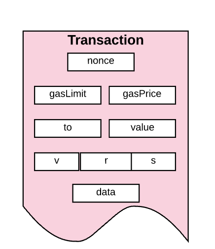

无论是消息通信还是合约创建，**交易都是被外部账户触发并提交到区块链的**。换种说话，**交易是外部世界和以太坊内部状态的桥梁**。

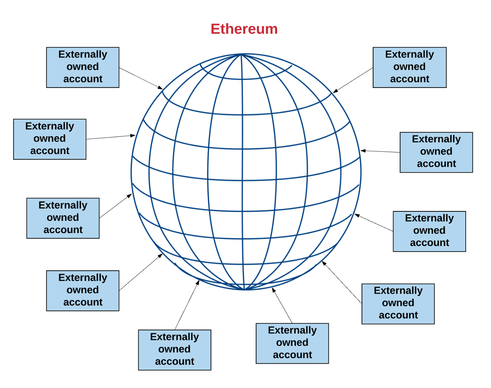

但是这也并不代表一个合约与另一个合约无法通信。在以太坊状态全局范围内的合约可以与在相同范围内的合约进行通信。他们是通过“消息”或者“内部交易”进行通信的。当一个合约发送一个内部交易给另一个合约，存在于接收者合约账户相关联的代码就会被执行。

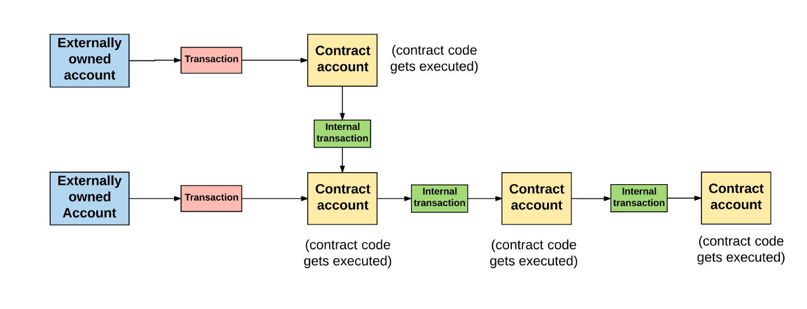

一个需要注意的重要事情是内部交易或者消息不包含gasLimit。因为gas limit是由原始交易的外部创建者决定的（也就是外部账户）。外部账户设置的gas limit必须要高到足够将交易完成，包括由于此交易而产生的任何”子执行”，例如合约到合约的消息。

# 6、以太坊虚拟机

以太坊协议本身的存在仅仅是为了让这个特殊状态机保持连续、不间断和不可变的运行。 

**以太坊虚拟机则是所有以太坊帐户和智能合约依存的环境**。在链上任何给定的区块处，以太坊有且只有一个“规范”状态，而**以太坊虚拟机定义从一个区块到另一个区块计算新的有效状态的规则**。

通常使用“分布式账簿”的类比来描述像比特币这样的区块链。以太坊也有自己的本机加密货币 (ETH)，遵循几乎完全相同的规则，但它还支持更强大的功能——智能合约。所以**以太坊不仅仅是分布式账本而已，更确切地说法是分布式状态机**。
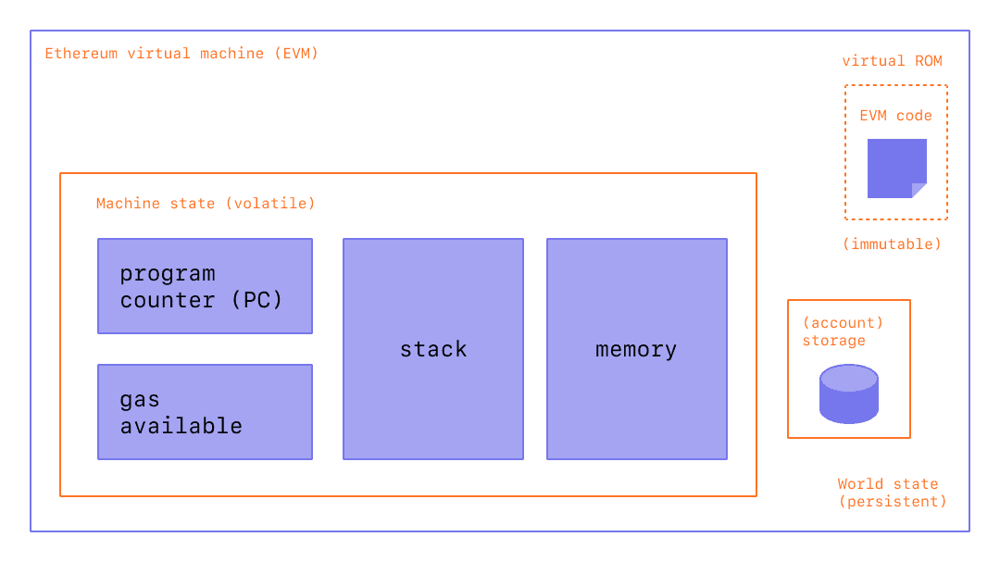

以太坊的状态是一个被称为MPT树的巨大数据结构，它不仅保存所有帐户和余额，而且还保存一个**机器状态**，它可以根据预定义的一组规则在不同的区块之间进行更改，并且可以执行任意的机器代码。在区块中更改状态的具体规则由 EVM 定义。

**EVM 作为一个堆栈机运行**，其栈的深度为 1024 个项。 每个项目都是 256 位字，为了便于使用，选择了 256 位加密技术。

EVM具有内存，其中存储的条目是**字地址字节数组**（word-addressed byte arrays）。内存是易失性的，不会在交易之间持久存在。

EVM还有存储空间。与内存不同，**内存的存储是非易失性的，并作为系统状态的一部分来维护**。EVM在一个虚拟ROM中独立存储程序代码，只能通过特殊的指令访问虚拟ROM。这就是EVM与典型的冯·诺伊曼结构的不同，冯·诺伊曼结构中程序代码是在内存或存储中。

EVM也有自己的语言——**EVM字节码**。当程序员在以太坊上写智能合约的时候，通常用高级语言写代码，比如**Solidity**。然后，可以编译成EVM字节码，以便EVM可以理解执行。

已编译的智能合约字节码作为许多 EVM opcodes执行，它们执行标准的堆栈操作，例如 `XOR`、`AND`、`ADD`、`SUB`等。 EVM 还实现了一些区块链特定的堆栈操作，如 `ADDRESS`、`BALANCE`、`BLOCKHASH` 等。
