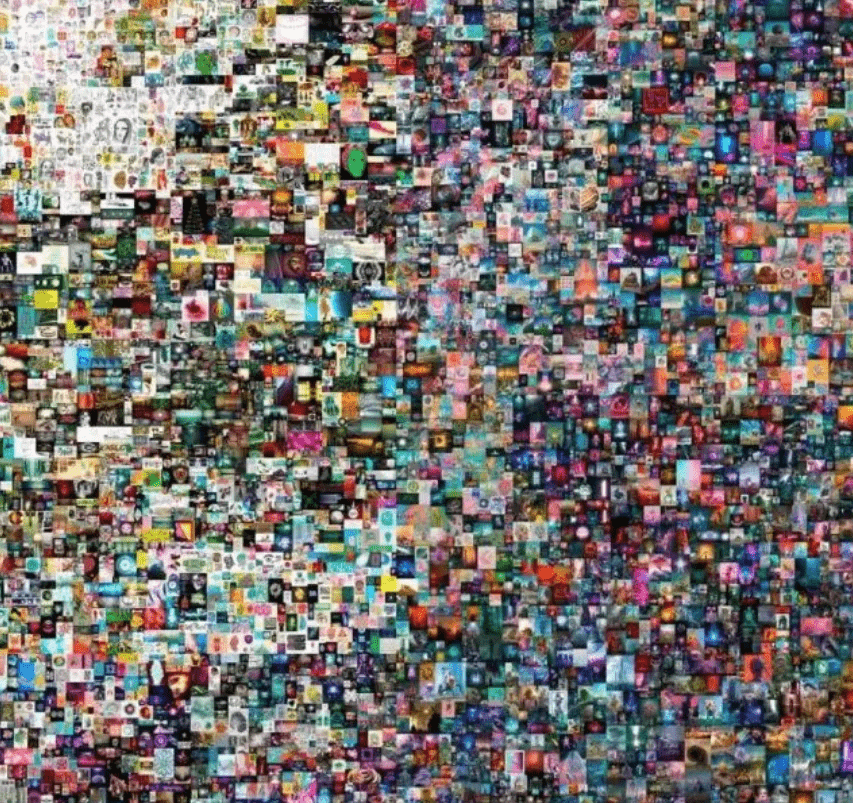
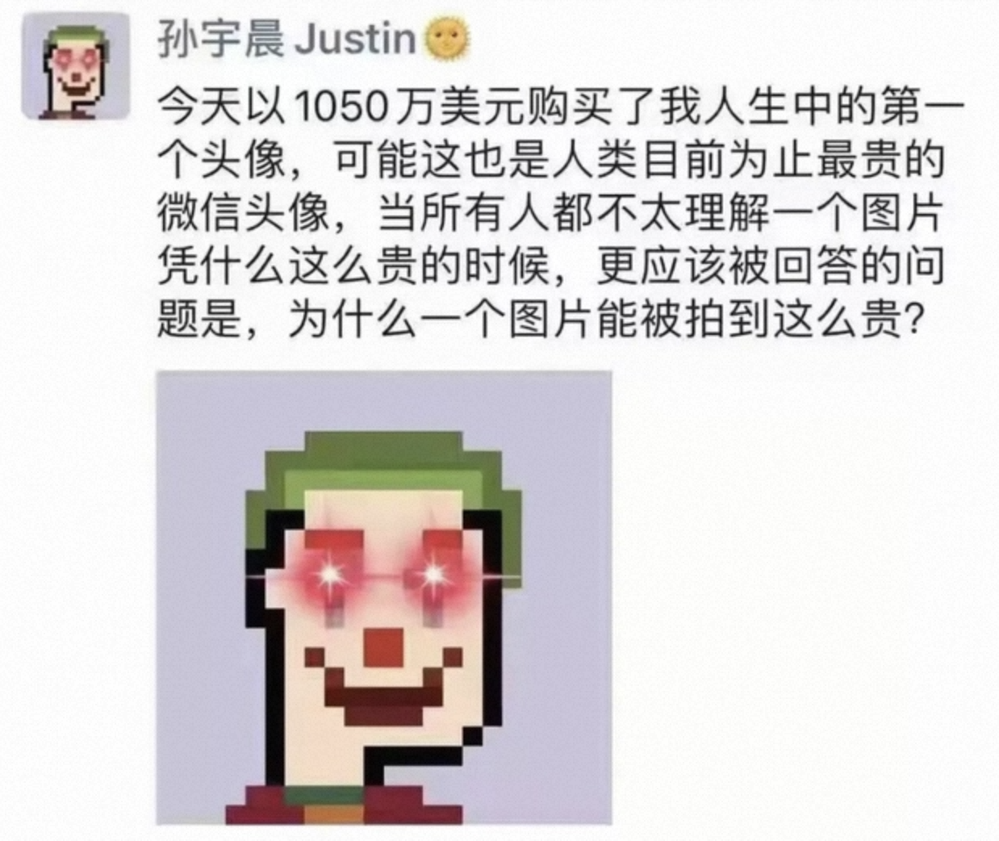
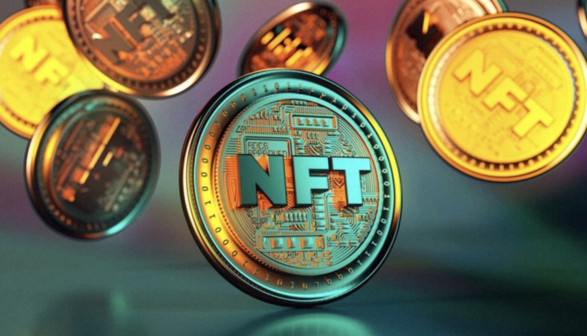

# 1、风口之上的NFT

NFT近些年备受全世界的关注和追捧，2021年被称为NFT的“元年”。

2021年3月11日，一幅名为《Everydays:The First5000 Days》的虚拟画在佳士得以6900万美元的惊人价拍出后，NFT市场迅速获得了大量关注，还吸引了诸如 Visa、耐克、LVMH等众多知名企业进军NFT市场，资本巨头们的投资也吸引了不少的人前往这个虚拟领域进行探索。

这幅画的作者名叫Beeple，是位来自南卡罗莱纳州的平面设计师兼动态艺术家，作品以创新前卫见长，擅长将流行文化、科技、时事融入创作，在业内颇有名气。

根据作者自述，从2007年5月1日开始，他每天原创并上传一幅数码艺术作品，并取名为《everydays》。这些作品有的是他的随笔，有的是精细度很高的艺术作品。截止到2021年1月7号，13年半的时间里，坚持了整整5000天，最后把这5000张数码作品拼贴到一起，并取名《the first 5000 days》，完成了这幅数码大作。

Beeple在组合时以时间顺序为基础，将主题和颜色相近的作品放在一起，整幅作品左半边偏亮，右半边偏暗，带有强烈的个人艺术风格。

2021年8月31日，孙宇晨花1050万美金买了一个Tpunk的NFT作品，并且设置成自己的微信和推特头像。孙宇晨就是那位花了3000万拍下巴菲特的午餐，最后又放了巴菲特鸽子的币圈大佬。

这个价值1000万的头像，尺寸是24*24像素，其中每个像素的价格高达一万七千多美元。

其实这不是NFT第一次出圈。

首先是加密猫（CryptoKitties）大火，乃至整个以太坊的网络甚至都因为这款游戏崩溃，最贵的一只猫以246.9255以太币成功出售，折合美金约12万元；之后，彩虹猫的梗图更是卖到了300以太币，当时约合56万美元；2021年8月，NBA球星斯蒂芬·库里（Stephen Curry）买了一张猴子头像，花费55 ETH，按照当时的以太坊价格换算，价值约为18万美元……

这些案例的背后，正是持续火热的NFT市场。

# 2、NFT的定义

在区块链上，数字加密货币分为**原生币**和**代币**两大类。前者如BTC、ETH等，拥有自己的主链，使用链上的交易来维护账本数据；代币则是依附于现有的区块链，使用智能合约来进行账本的记录，如依附于以太坊上而发布的token。

代币之中又可分为**同质化代币**和**非同质化代币**两种。

同质化代币即**FT**（Fungible Token），互相可以替代、可接近无限拆分的token。例如，你手里有一个BTC与我手里的一个BTC，本质上没有任何区别，这就是同质化。

而非同质化代币即**NFT**（Non-Fungible Token），则是唯一的、不可拆分(**实际上现在也出现了可分拆的NFT**)的token，如加密猫、token化的数字门票等。也就相当于带有编号的人民币，不会存在两张编号一样的人民币。

因此，相较于FT，NFT的关键创新之处在于提供了一种**标记原生数字资产所有权（即存在于数字世界，或发源于数字世界的资产）的方法**，且该所有权可以存在于中心化服务或中心化库之外。NFT 的所有权并不阻止其他人视察它或阅读它，NFT 并不是捕获信息然后把它藏起来，只是**捕捉信息然后发现该信息与链上所有其它信息的关系和价值**。

同时，NFT由于其非同质化、不可拆分的特性，使得它**可以锚定现实世界中商品的概念**，简单来理解，就是在发行在区块链上的数字资产，这个资产可以是游戏道具、数字艺术品、门票等，并且**具有唯一性和不可复制性**。由于NFT具备天然的收藏属性和便于交易，加密艺术家们可以利用NFT创造出独一无二的数字艺术品。

# 3、NFT的特点

## 唯一性

传统艺术作品的数字文件可以被随意复制，NFT 则以区块链确权的方式让这些艺术品获得具有独特标识的“数字身份证”。其创作者可以自行决定某一作品的发行数量并进行编号，流通、交易的每一个环节都通过区块链完整记录，因而每份NFT自身都是独特的。

## 稀缺性

开发者有权利限制发行数量，NFT具有稀缺性，这是NFT玩家和买家的最大吸引力之一。这不仅有利于加密资产的长远发展，也不会有供不应求等隐患。

## 不可分割性

每一个NFT的最小单位都是以一个整体存在,无法像比特币等其他加密货币一样以"1"以下的计量单位流通。

## 可拥有

NFT将分散式区块链技术的最佳功能与不可替代的资产相结合。与由集中式实体发行和监管的普通数字资产不同，NFT加密资产可以在使用时获得，也可以赋予所有者真正的所有权;真正的所有权是任何NFT的关键组成部分之一。

## 可转让

由于NFT是分散的，因此不需要中央发行人，也没有第三方干预，这也使它们更容易转移（个人之间的直接转移)。例如，在游戏领域，NFT解决了传统游戏中的排他性问题，因为资产可以在不同的区块链游戏之间轻松转移。

## 可验真

技术可以为这些原生的数字艺术品进行唯一性认证、确权，这是作品价值来源的根基。数字作品的唯一性，可以防止其他假冒作品，有效保护了创作者。

# 4、NFT的应用价值

NFT标记了某一用户对于特定资产的所有权，使得NFT成为该特定资产公认的可交易性实体。凭借区块链技术不可篡改、记录可追溯等特点记录产权并确保真实性与唯一性，并通过NFT的交易流转实现特定资产的价值流转。这种思想对目前产品的形态及拓展是有极大的作用，出现了大量对于资产、财富、所有权的新诠释形式。其作为承载物品价值的新型数字凭证，越来越受到投资者关注。

目前NFT项目主要集中在**数字收藏品**、**游戏资产**与**虚拟世界元宇宙**三大领域，已经具备较为完善的生态及成熟的交易流转平台。

NFT的应用发展可以划分为以下三个层次：
* **第一层：虚拟收藏品**。比如Punk，猿猴，Azuki等等，它可能有几十亿、几百亿美金的交易市值，这已经是我们所处的时代了。
* **第二层：金融服务**。金融票据、金融证券可以通过NFT做技术表征，在数字世界以现行NFT的方式呈现、流转，同时利用区块链的可追踪、不可篡改、不可分割、独立的特性，保证全过程可信，避免传统行业通过纸质或者合同等方式遇到的一些弊端。相信NFT技术能够创造的价值、涉及的价值的主张、以及价值范围会越来越宽。
* **第三层：实物资产**。早在2016年或2017年，国内就有人提出用NFT的方式来标记一套房子的所有权，这在技术层面上的问题不大，但是需要权力机关来接受和背书。

NFT具体的应用场景如下：
* **游戏**：例如可用作游戏中的宠物，武器道具，服装和其他的物品。2018年红极一时的加密猫，用的就是NFT技术，他们给每个猫进行特殊的标记编号，让它成为独一无二的猫。
* **知识产权领域**：NFT 可以代表一幅画，一首歌，一项专利，一段影片，一张照片，或者其他的知识产权。在这个领域，NFT起到的是专利局的作用。帮助每一个独一无二的东西进行版权登记，帮助其识别专利。
* **实体资产**：房屋等不动产等其他的实物资产，可以用NFT来表示进行代币化。可以用作资产的流通等金融市场。
* **记录和身份证明**：NFT 也可以用来验证身份和出生证明，驾照，学历证书等方面。这些可以用数字形式进行安全保存，而防止被滥用或篡改。
* **金融票据**：各类金融票据在流通和交易过程中承载大量信息，如果与NFT结合，不仅能够确权，还便于追踪。另外，未来各类NFT资产的交易本身就可以形成一个细分的金融市场。
* **票务**：演唱会门票、电影票、话剧票等等，都可以用NFT来标记——看起来似乎长得一样的票据，实际上有不同的座位号，自然NFT也是可以在此得到应用……所有的票都一样，但是座位号不同。

