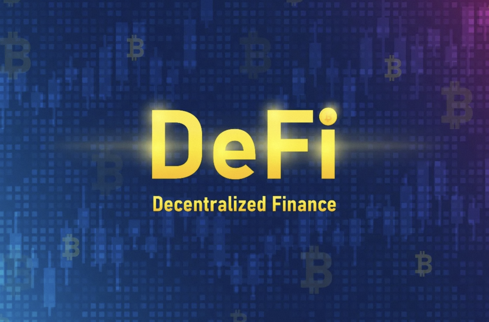
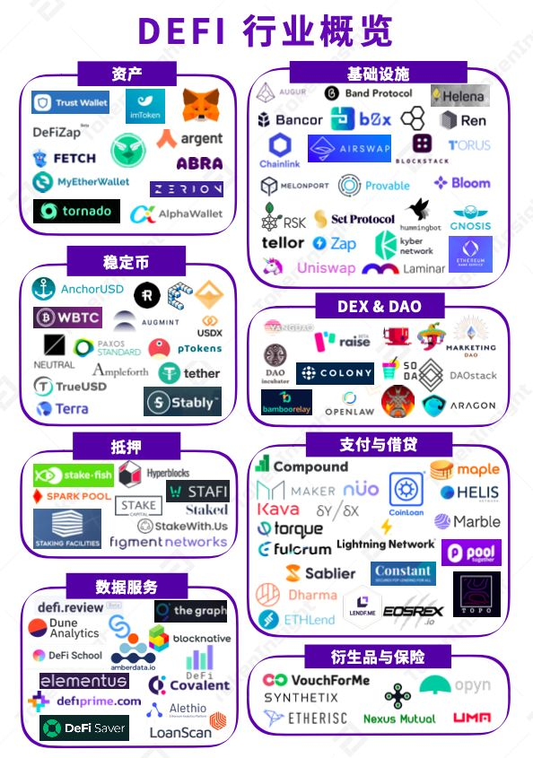
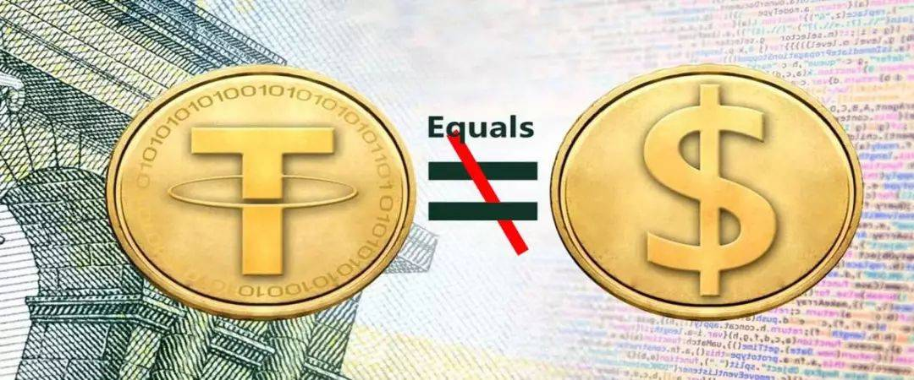
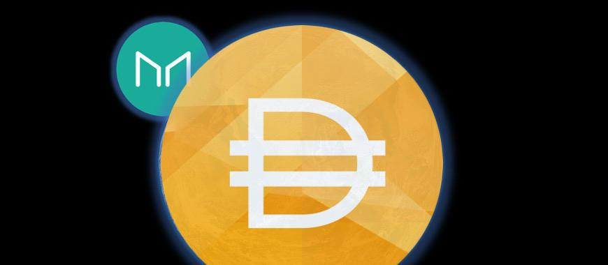
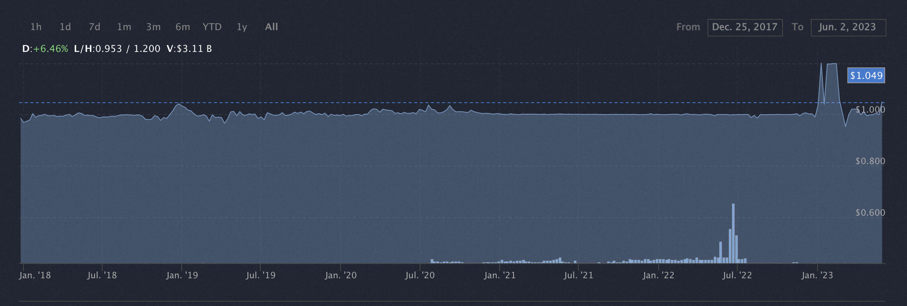
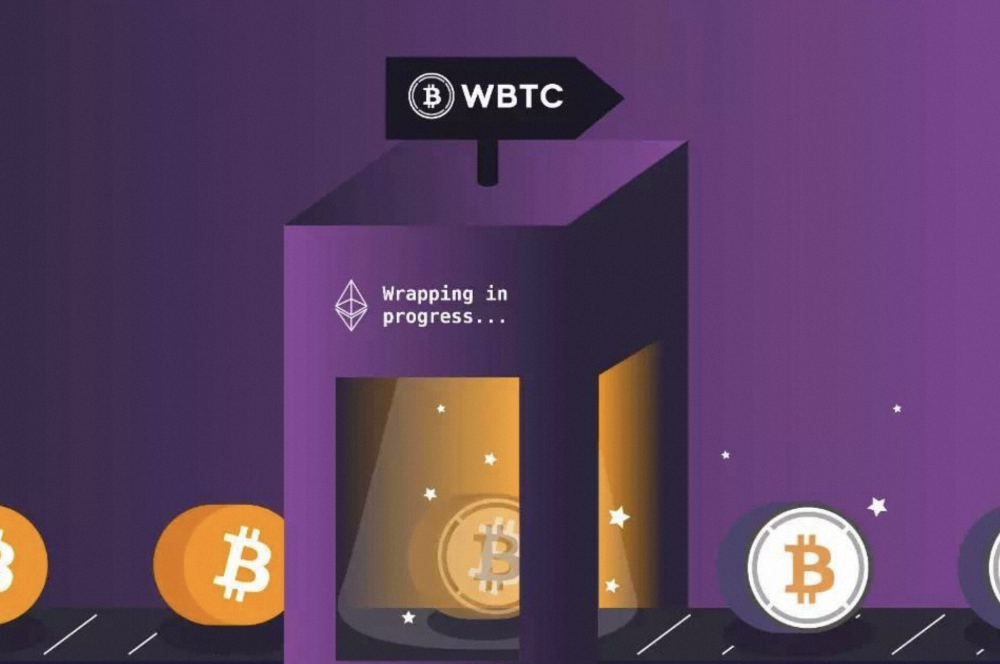
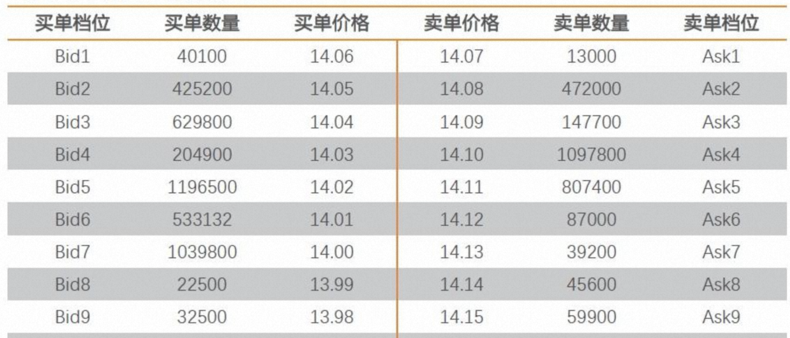
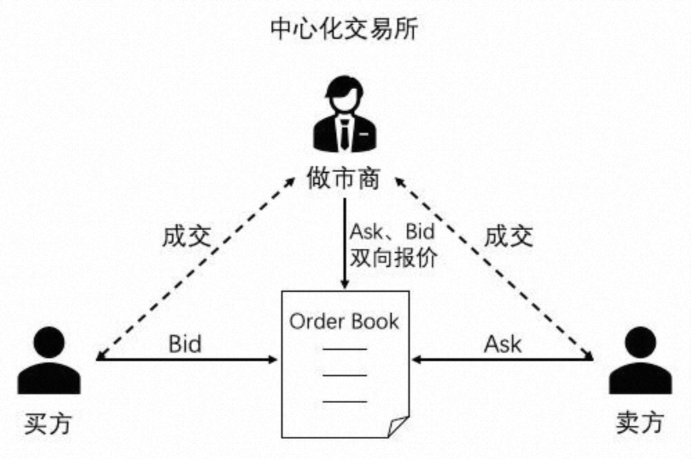
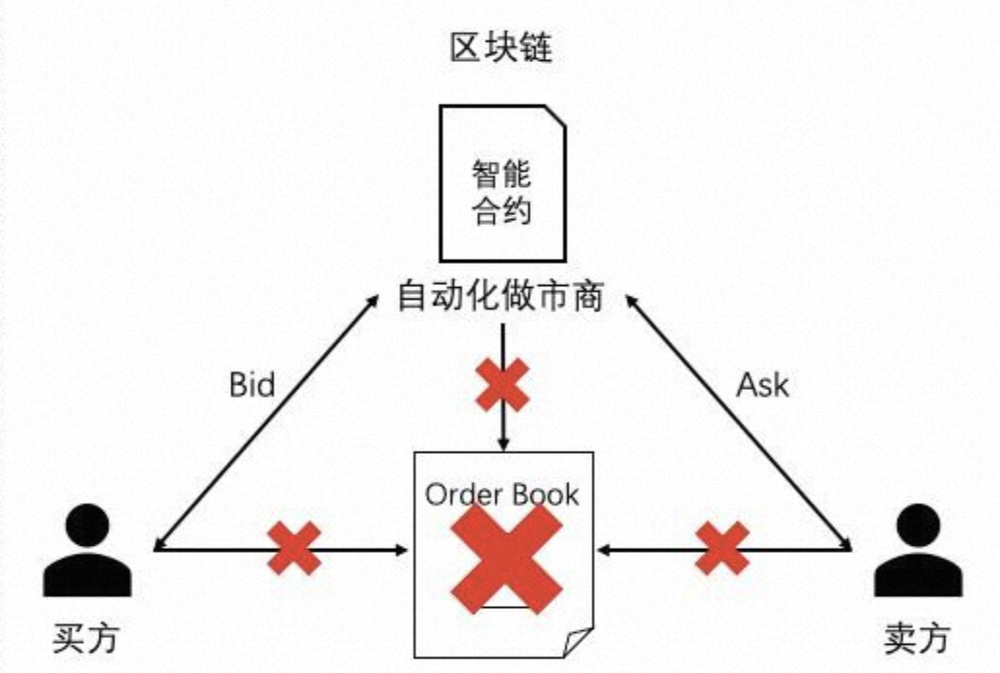
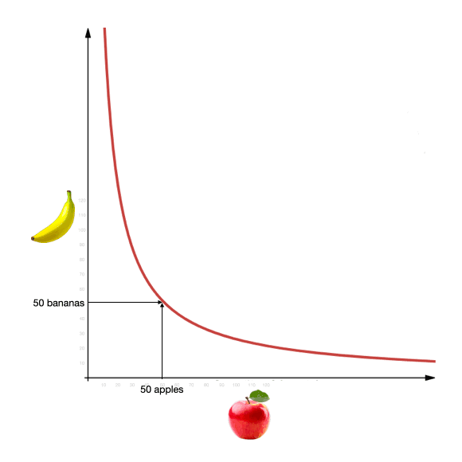

# 1、DeFi是什么

> **DeFi**的全名是`Decentralized Finance` —— 去中心化金融，是基于运行在区块链上的金融服务或商品的统称。Defi是一个生态，不是单独的一个币或一个项目。
> DeFi中的加密资产、金融类智能合约以及协议一般是基于智能合约平台（例如以太坊）而构建，能够像乐高一些组合起来，因此，也被称为**货币乐高**。

**金融的本质可以浓缩成为：效用跟风险在时空中的交换**。

理论上，去中心化金融提供的所有服务和产品都与传统金融世界相同。在传统的金融系统中，金融服务包括融资投资、储蓄、信贷、结算、证券买卖、商业保险和金融信息咨询等业务，都是由中心化的金融机构为用户提供的。然而，DeFi使用分布式账本技术，包括区块链、加密货币、智能合约，来提供贷款、融资、稳定币和信贷安排等服务。

因为DiFi运行在区块链上，所以它原生地继承了区块链的先天优势，例如去中心化及匿名性等等，DeFi可望解决传统金融的问题有：
* **DeFi提供了更高的开放性和包容性**：对于现实生活中负担不起金融服务以及基于特定原因而无权使用金融服务的人，DeFi提供了一种仅需网络连结上区块链网络即可使用的金融服务之解决方案。
* **DeFi提供了更高的安全性**：所有区块链上发生的交易都是基于用户共同验证和维护，因此交易透明公开且不可篡改，大大降低了违约风险以及对于法币的信任问题，且因无第三方机构参与市场，所有交易前皆不需事先做身份验证。
* **DeFi提供了一个更具效率的市场**：DeFi平台提供了24小时的服务外，自动执行的代码(智能合约)大幅提高了交易效率也降低了成本及人为因素的干扰，因此降低了交易的错误率以及过程中所需的金融服务费。

我们将Defi涉及到的数字资产分成三大类：

**第一类：基础资产**。

比如大家看到的主流数字资产：比特币、以太币等。

不过，需要注意是，基础资产并不是Defi的一部分，对于Defi来说它是外生的，比如说美元、比特币它的产生是在Defi之外，它的价格主要也是在Defi之外的活动中产生影响。所以说对于Defi来讲，这些基础资产相当于是外汇，不是他自己能够决定的。

就好像，大部分的实体经济部门是没有能力创造货币的，而要依赖银行部门提供货币，因此货币对于实体经济部门来说，比如说房地产、电子商务，它就是外生的。

所以说，基础资产相对于Defi来说，它就是一类外生的资产，但是它对Defi很重要。

**第二类：稳值资产**。

主要指各种**稳定币**，比如**USDT**、**USDC**、**DAI**等等。

这些稳定币资产也叫**稳值资产**，它已经建立了比较广泛的共识，也就是说，很多人相信这种资产的价值与美元或者其他的法币是等值的，愿意以这个价值为基础，用自己的商品服务或者金融资产跟他交换。

稳值资产有一个重要的特点，就是它的流动性非常好。

我们知道，如果一个价格经常快速波动的资产，它的流动性肯定不好。

流动性是衡量资产的一个重要指标。因为如果总是涨价的话，那么可能有人很想买它，买完了，它又涨价，但是卖的人他就会捂盘惜售，不愿意卖，想等涨更高时候卖，或者一直藏着。

但这个东西总有贬值的时候，当贬值的时候，那么卖的人他肯定巴不得马上脱手，但是买的人就会磨磨蹭蹭，因为买下来就贬值。

所以一个东西，不管它是金融资产也好，商品也罢，它的价格如果跟猴子似的上蹿下跳，那么参与的人就是在赌博，他们都不太愿意基于价值本身进行交换。所以只有稳值的商品和资产，大家的心态是最稳定的。

**第三类：衍生资产**。

所谓衍生资产就是说它的价值是由其他的资产价值来决定的。在Defi当中，其实大家接触的大多数资产都是衍生资产。

衍生资产又分很多类：

比如，票据类衍生资产，像**Compound**里面的**cToken**等。

比如，币类衍生资产，像**COMP**、**AAVE**、**YFI**、**YAM**等等，这些资产它都没有清晰的估值方法，动辄暴涨暴跌，很像股票。

比如，高阶衍生资产，高阶衍生资产刚刚开始出现，但是潜力是非常大的。他们是衍生资产的衍生资产。

# 2、DeFi生态圈

DeFi生态圈内有以下几个主要成员：
* **区块链基础设施**： DeFi 依赖于区块链技术作为其底层基础设施。最常用的区块链是以太坊，它支持智能合约的创建。智能合约是具有预定义规则和条件的自动执行协议，一旦满足这些条件就会自动执行。
* **去中心化应用程序**(DApps)：DeFi 应用程序构建为区块链网络之上的去中心化应用程序或 DApps。这些 DApps 利用智能合约来自动化和执行金融交易规则。
* **智能合约**：智能合约是 DeFi 的支柱。它们定义了金融协议的条款和条件，包括借贷、交易或任何其他金融活动。智能合约自动执行这些协议，无需中介。例如，贷款平台的智能合约可以自动将资金借给借款人并执行还款条款。
* **流动性提供者**：在 DeFi 中，用户可以通过将其加密货币存入**流动性池**来成为流动性提供者。这些资金池用于促进各种金融活动，如交易或借贷。流动性提供者根据池中活动产生的费用获得奖励。
* **去中心化交易所** (DEX)： DEX 是一种 DeFi 平台，允许用户在不依赖中介的情况下直接相互交易加密货币。这些交易所使用智能合约来自动化订单匹配和结算流程。流行的 DEX 包括**Uniswap**和**SushiSwap**，以及新兴的**Curve**。
* **借贷平台**： DeFi 借贷平台使用户能够借出其加密货币并通过抵押其资产赚取利息或借入资金。这些平台使用智能合约来管理借贷流程，包括确定利率、抵押品要求和自动还款。DeFi 借贷平台的例子有**Compound**和**Aave**。
* **稳定币**：稳定币是一种加密货币，旨在通过将它们与美元等基础资产挂钩来维持稳定的价值。稳定币在 DeFi 中发挥着至关重要的作用，因为它们在生态系统中提供稳定性和流动性。它们通常用作交换媒介和借贷抵押品。
* **治理和去中心化自治组织**（DAO）：一些 DeFi 项目包含治理机制，允许代币持有者参与决策过程。关于协议升级、参数调整或资金分配的决定可以由代币持有者投票决定。DAO 是按照去中心化治理原则运作的实体。

# 3、稳定币

由于加密货币的价格波动大，且没有一个主流法币能够直接与数字货币进行兑换交易，具有高投机性和弱使用性，所以就需要一种充当交换媒介和价值衡量单位的“工具”，帮助加密投资者避免市场的波动。而**稳定币可以通过锚定法币的手段来维持币价的相对稳定**，作为一种交换媒介，来连接数字货币世界与法币世界，解决数字货币与法定货币的冲突以及流通的实效性问题。

在币价剧烈波动时，法币交易的时效性较差，通过稳定币充当兑换法币的中间件，可以快速的规避下跌时所带来的风险。

稳定币被认为在某种程度上可以抵抗市场波动，因此它们不应经历重大的价格变化。尽管大多数货币都与美元挂钩，但还有稳定币与其他加密货币甚至商品（例如白银或黄金）的价格挂钩。通过与现实世界资产挂钩，这些代币避免了由高波动率（在加密货币市场中非常常见）引起的疯狂价格波动。

**稳定币是我们能够充分使用DeFi的保障**。DeFi应用一般都要求在区块链上具有较低波动（例如消费者贷款）。如果您使用比特币将汇款从一个国家发送到另一个国家，那么很有可能在一个区块确认期间的价格变动将大于汇款的服务费。

## 3.1 USDT

加密市场上最早的稳定币是由Tether公司于2014年发行的**USDT**（泰达币）。

Tether公司“号称”：每一个发行流通的USDT都与美元一比一挂钩，相对应的美元总量则存储在Tether公司，在以美元为计量单位时，抵押品的价值不存在任何波动风险。 

不过这种稳定币的局限在于中心化、不透明、无存储资金或者赎回通证的担保和抵押品成本。市场上对Tether的美元储备是否足额、是否发行空气货币造成泡沫等的相关质疑声从未停止。虽然Tether公司始终声称自己拥有足额的准备金，但至今也没有公开自己的准备金账户审计数据。

在虚拟世界，尤其是在DeFi的版图里，USDT却不是一个好选项。因为DeFi的基本结构是建立在一个个的智能合约基础上的，而如果其中某一环绑在USDT这样的定时炸弹身上，这样无异于是让泰达公司掌控了DeFi。而且，其实我们需要DeFi最重要的一个理由，其实也就是替代现在这些我们明知道不靠谱但是却不得不用的虚拟货币的中心化金融机构，比如稳定币USDT，比如中心化交易所。

所以，我们需要一个去中心化的稳定币，也就是说，**一个不锚定链下资产而是锚定链上资产的稳定币**。

于是，DAI出现了。

## 3.2 DAI

> **MakerDAO** 是一个运行在以太坊区块链上的DeFi项目，**以加密货币作为抵押品，稳定币DAI与美元挂钩**。其社区通过去中心化自治组织(DAO)管理代币。用户将加密货币以一定的强制平仓比率锁定在Maker收益池中，以此来生成DAI。

MakerDAO 使用很多机制来**保证DAI与美元保持1:1的汇率**。下图是2017年到2023年之间，DAI与美元的汇率波动图：

可以看到，除了2023年初期出现过短暂的剧烈波动之外，在95%以上的时间里，DAI的价格都稳定在 0.97 ~1.04 美元这个区间内。

有人会问：比特币 (BTC) 从2020年9月8日的10145美元一路狂涨到到2021年1月8日的40829的高点， 将近4倍涨幅，为什么以太坊 (ETH), 艾达币 (ADA) 等主流的非稳定币够跟着比特币狂涨，而DAI就没有跟着一起涨，而是一直稳定在1美元附近的区间呢？

换个角度，从2020年2月4日到2020年3月13日这段时间，比特币从10500美元的高点暴跌了超过60%的幅度到 3800美元的低点，当时人们对数字货币失去了信心，大多数主流的非稳定币都经历了至少一个腰斩，而为什么DAI还是能稳定在1美元附近，人们唯独没有对DAI失去信心呢？

第一点，DAI是一个完全链上的稳定币，它无需依靠链下任何的法律系统或中介结构来背书。DAI锚定的方式对于深信区块链“去信任”的思想的人来说，似乎要比USDT那种“我叫泰达公司，我说我在银行里存了等量的美元”更靠谱一些。它的发行是通过一个借贷的智能合约来实现的：每个人都可以**通过抵押一定数量的ETH来换取和美元1：1锚定的DAI**。

第二点，DAI采用的是**超额抵押**的形式，也就是如果你抵押价值150美元的以太币，那么只能换来价值100美元的DAI。然后，这个智能合约中写定了，如果你在某个时间内归还这100美元的DAI并且付一部分利息，那么你就可以拿回自己抵押的以太币。

换句话说，我们可以这么理解：有个叫做M的人对所有人说“你抵押以太坊给我，我就借给你DAI，这个DAI和美元是1：1兑换的。只要你能够在期限内还掉这笔DAI（再加一点利息），我就把ETH还给你。”接着，由于所有人都看到这个逻辑是智能合约保证的，我们能够通过这个智能合约的逻辑看到M在其中确实做不了手脚，于是有交易需求的人就去换这个稳定币DAI来做交易。而接着由于这个智能合约是透明的，大家也都能看到M那里确实抵押着超过他发行的DAI的资产，所以，也就都认可DAI和美元1：1兑换。

这看起来好像很不错，但是这里面有个问题——以太坊的价格是会变动的。而且，虚拟货币的价格变动可是相当剧烈的，如果遇上以太坊暴跌了怎么办？那么原本值150美元的以太坊可能瞬间就不到100美元了，这个时候抵押的资产不如我贷出来的资产多，DAI的价格就不可能再锚定美元，因为大家都能看到DAI不值那么多钱了。

这时候超额抵押的作用就显出来了——即便以太坊价格波动幅度再大，但是从150美元跌到100美元总归还需要些时间。而这就给资产清算的空间：首先，我们规定抵押物不得少于150%的贷款，也就是如果以太坊涨了没关系，但是一旦跌了，你得立刻补仓到150%，否则你的抵押物会进入清算的智能合约。换句话说，也就是你和M的借贷合同失效了，M现在有权处理你的抵押物。于是，M向大家拍卖“我这里有以太坊打折甩卖了，大家快来买啊。”这个时候，如果有人认为以太坊不会继续跌了，或者有信心在它跌到100美元以下之前把它再卖掉，他就可以在这个时候成为“清算人”，用DAI来买进这些超过100元价值的以太坊：比如花100美元买到了120个以太坊。这其中的差价会退回给借款人，“你看，这是你抵押的以太坊，由于你不还100DAI也不补齐保证金，我就把你的以太坊贱卖了（值120美元的以太坊卖了100），这是剩下的10美元的以太坊，你拿走吧。” 

如果你接触过股市的融资融券，相信对上面的过程很好理解。

当然，这个清算机制能够有效必须有个大前提:
* 市场上里有足够多的人有DAI来买ETH，这就是流动性的问题；
* 市场能够及时地让这些人进行交易。

以上两者缺了任何一个，都可能导致清算无法进行，于是如果发生币价暴跌，就会导致大量的坏账，也就抵押的钱不够维持DAI的价格了，于是稳定币失效。那么，这个清算机制究竟有没有效呢？其实，DAI 在2020年3月份暴跌中就曾有过短暂失效，随后MakerDAO进行了改进。

第三点，调节利率。如果市场上抵押的人多了，DAI供应的多，价格下来了，低于了1美元，这个时候就提高利率，让抵押贷款成本提高，反之，如果抵押的人少了，就降低利率。其实与央行的做法类似，玩的是供需平衡的游戏，那么谁来提高或降低利率呢？投票，用MKR代币投票决策，像央行那样投票来调节利率，有点美联储的既视感。

另外为了维持DAI的稳定，防止黑天鹅的发生，MKR持有人也有最后托底的责任，这里就不再展开。

# 4、预言机

类似 DAI 这样的稳定币系统，需要获取 ETH 的实时价格，来判断所抵押的加密货币是否达到了平仓价格进而触发平仓。假设有 1000 个节点，那就需要交易所（比如币安）进行 1000 次的 API 数据请求 ，但是，由于 ETH 的价格是实时变动的，加上网络延迟、计算速度等原因，每个节点获取到的价格可能都不相同，这部分数据被输入到智能合约后，节点间无法达成共识，那么整个系统就会崩溃。

所以在 DeFi 领域的稳定币、去中心化杠杆交易、金融衍生品交易等都需要有一个一致的、可靠的**喂价入口**，这就是**预言机**所提供的功能。

> 区块链外信息写入区块链内的机制，一般被称为**预言机** (oracle mechanism) 。

区块链是一个确定性的、封闭的系统环境，目前区块链只能获取到链内的数据，而不能获取到链外真实世界的数据，区块链与现实世界是割裂的。

预言机的功能就是将外界信息写入到区块链内，完成区块链与现实世界的数据互通。它允许确定的智能合约对不确定的外部世界作出反应，是智能合约与外部进行数据交互的唯一途径，也是区块链与现实世界进行数据交互的接口。

目前，大多数项目选择使用自己搭建的预言机服务，但实际上这又会重蹈中心化的覆辙，会有很多问题
比如单点故障、易受攻击等。但在当下对于DeFi项目来说，自建预言机是一个明知道知道可能不靠谱，却是不得不用的东西。

# 5、跨链桥

区块链和加密货币的世界里，无论从体量、交易量还是用户人数来讲，比特币都还是当仁不让的龙头老大。而中心化交易所中，比特币的交易量还是遥遥领先，超过以太坊一个量级。

于是，如果DeFi仅仅能够在以太坊上用ETH交易DAI，那么它仍旧只能是小众的玩具，因为BTC才是虚拟资产的大头——如果DeFi不能让大家炒比特币这么个最值钱的玩意，那还好意思叫自己去中心化金融？说是去中心化交易，结果不是以太币就是以太坊上发的其他ERC代币，今天这个涨明天那个跌自己交易来交易去的，就跟你去银行买基金结果只能买银行自己的基金一样……这听着不跟闹着玩似的么？

于是DeFi起飞前的关键一步，是**怎么把比特币这个最重要的去中心化资产引进DeFi**。

预言机的问题是：怎么样从链外获取正确和安全（不会出现给出不一致信息的情况）的信息，而我们的答案是——我们不知道，但是这不妨碍我们把这个我们不知道的问题抽象成一个叫做“预言机”的东西，把它放在外部世界和区块链之中，它可以对于链外的东西给出正确而又安全的信息并且签名认证，然后，我们在“预言机”存在的前提下继续做应用。而与此同时，我们再去思考怎么实现这么一个预言机。

而现在跨链面临的问题是一样的——同样是从链外获取正确和安全的信息，只不过这次信息的来源变成了另一条区块链。

所以，我们不妨先把这个问题抽象出来，起名叫“**跨链桥**”。

跨链桥的原理其实和稳定币并没有什么差别——**稳定币是我们需要将一个现实中的货币搬到以太坊上来，而资产跨链则是将比特币搬到以太坊上来**。但这里其实我们用不到发DAI的时候那么麻烦，还记得泰达公司是怎么发USDT的吗？它先存一堆美元，然后发等量的USDT，然后说对应每个我们发的USDT都有一个现实存在的美元被存起来了。但问题是，没有人知道泰达公司是不是真的存了那么多美元。

但比特币不是泰达公司，比特币的账本是公开的。

于是，比特币跨链就很简单了。某些公司，我们姑且成为公司W，宣称他们自己非常非常可靠，然后让大家把比特币打到他们的账户里，然后这笔钱就在比特币里被锁住而不会动用，甚至，他们可以宣称因为某些密码学的原理，他们无法轻易动用这笔钱。

然后，你每把一个比特币交给W公司锁定，那么W公司就在以太坊上给你发一个wBTC代币，并且宣称如果你把这个wBTC代币发还给W公司，W公司会还你一个比特币（这点在未来也可以通过智能合约实现，但是目前由于比特币的功能所限也没法做到）。于是，我们就有了一个叫做wBTC的，价格和比特币绑定的代币。又或者说，我们把比特币跨到了以太坊上。同样的原理可以用在任何区块链上进行资产跨链，尤其是对于和以太坊一样图灵完备的区块链而言，无论是资产锁定、跨链还是解锁，都可以通过部署智能合约来实现——这样就是一个理想状态下的资产跨链了。

但wBTC并不是这种理想化的资产跨链。从逻辑上讲，其实wBTC和USDT差不多，都需要对于某个中心的信任。但W公司至少比泰达公司强的地方在于，至少锁定的那些比特币大家是看得到的。所以，在W公司作恶之前，我们都还可以相信wBTC和BTC的价格相等。

# 6、DEX

**DEX**全称`Decentralized Exchange`（去中心化交易所）是点对点的交易市场，用户可以绕过中间方直接交易和管理加密货币。DEX可以替代银行、券商、支付系统等传统中介，使用区块链智能合约来交易资产。

传统金融交易流程往往缺乏透明性，需要依靠中介执行，而且中介的许多操作都不对外公开。相比之下，DEX完全公开资金流向和交易机制。另外，由于交易中用户资金不会经过第三方的加密货币钱包，因此DEX可以降低DeFi生态中的对手方风险以及系统性的中心化风险。

DEX是去DeFi的基石，也是不可或缺的一块“货币乐高”，具有无需许可的可组合性，并可以打造出更加高级的金融产品。

DEX最大的优势是采用了区块链技术和不可篡改的智能合约来保障极高的确定性。Coinbase或币安等中心化交易平台（CEX）采用内部撮合交易引擎来开展交易，而DEX则通过智能合约和区块链来执行交易。

DEX的最终愿景是打造出无需许可的纯链上基础架构，消除任何中心化的单点失效风险，并将所有权去中心化，分给社区中分布式的成员。最典型的做法就是授予去中心化的自治组织（下文简称DAO）治理协议的行政权。DAO由相关社区组建，其成员通过投票为协议做出关键决策。

DEX有许多不同的设计模式，每个模式在功能、可扩展性和去中心化方面都各有利弊。两种最常见的类型包括**订单簿**DEX和**自动做市商**（AMM）。

## 6.1 订单薄DEX

订单簿是啥呢？其实就是最简单的方法——比如你要用10个A换15个B，那么我记下来。然后一会又来了一个人说我要用15个B换10个A，我说太好了，正好配对上了。于是，我就在链上生成一笔交易，把你们俩的币互换。这个时候汇率其实就是给交易的双方做参考用的——建议你用这个汇率容易找到配对。这样一来，去中心化交易所只是把交易双方的需求匹配了一下放上链，就不存在智能合约读取链外汇率信息的问题了。

不用说大家也能看出来，这方法有很多缺陷。无论这个DEX做得多么用户友好，它对比中心化交易所效率一定是很差的。首先币价波动的时候很难找到匹配，其次小币种肯定也很难找到匹配，然后交易延迟应该也不小。

而纯链上的订单簿DEX在DeFi领域并没有那么常见，因为此类DEX需要将订单簿中的每笔交易都发布在链上。而这对区块链吞吐量的要求远超过目前大多数区块链的能力范围，而且可能会严重威胁到网络安全和去中心化水平。因此，以太坊早期出现的订单簿DEX往往都流动性较低而且用户体验较差。然而，此类订单簿交易平台为DEX使用智能合约开展交易提供了非常强大的概念验证。

随着optimistic rollup和ZK-rollup等layer 2网络以及高吞吐量的应用型区块链不断创新，链上订单簿交易平台的可行性越来越高，而且实现了可观的交易量。

但相对于中心交易所，它还是有唯一的优势——靠谱。毕竟，中心化交易所里交易的币只是人家服务器里的数字，DEX里换到的币才是真的币。但代价除了效率之外，以太坊的交易费是免不了的。而且，由于订单簿的配对还是由中心服务器生成的，只不过双方的交易最终被上链了，所以仍旧有中心服务器拔网线的风险。

## 6.2 AAM

DeFi想要真正崛起，需要中心化金融做不到的事情。这其中的最大创新，叫做**自动做市商**（AMM）。

做市商是指在传统证券市场上，由具备一定实力和信誉的独立证券经营法人作为特许交易商，不断向公众投资者报出某些特定证券的买卖价格（即双向报价），并在该价位上接受公众投资者的买卖要求，以其自有资金和证券与投资者进行证券交易。买卖双方不需等待交易对手出现，只要有做市商出面承担交易对手方既可达成交易。

做市商通过做市制度来维持市场的流动性，满足公众投资者的投资需求。做市商通过买卖报价的适当差额来补偿所提供服务的成本费用，并实现一定的利润，但是在中心化平台中，买方/卖方并不确定做市商是否真的在区块链上有实际的资产（账户中的余额只是中心化数据库中的一个数字），而且用户的资产都保存在中心化交易所的钱包里，自己没有绝对的控制权，而中心化交易所也没接受任何监管机构的监管，很容易发生监守自盗的事件。

基于以上种种弊端，Uniswap交易平台提出了一种通过智能合约实现**自动化做市商**（Automated Market Maker，AMM）来与用户进行交易的去中心化交易协议，用户资产完全由自己控制，而智能合约中锁定的做市资产也是公开可查，是一种更安全透明的交易方式。

你可以把 AMM 设想成一个原始的、机器人式的做市商，它根据一个简单的定价算法，在两种资产之间随时提供报价。对 Uniswap 而言，它对这两种资产进行报价，其持有的每种资产的单位数相乘，总会等于一个常数。这听上去有些拗口：如果 Uniswap 拥有一些 x 代币，拥有一些 y 代币，它给每一笔交易定价，所以，它拥有的 x 的最终数量，和拥有的 y 的最终数量，两者相乘会等于一个常数 k。这就形成了一个常数积的等式：`x * y = k`。这种对两种资产进行定价的方式，你可能会觉得非常怪异且过于独断。让两种代币的库存数相乘所得的积维持固定，为什么就能确保正确的报价呢？

假设我们在 Uniswap 的某个池里投入 50 个苹果 （a） 和 50 个香蕉 （b） ，任何人都可以用苹果换香蕉，或者用香蕉换苹果。假设一级市场中苹果与香蕉的汇率刚好是 1:1。因为该 Uniswap 资金池中分别有 50 个苹果和 50 个香蕉，因此，按上述常数积的等式规则：`a * b = 2500` 。**对于任何交易，Uniswap 都需要保证，池中库存的苹果数和香蕉数相乘等于 2500**。好了，假设一位客户进入我们的 Uniswap 池来买一个苹果。她应该支付多少个香蕉呢？如果她买走一个苹果，我们的池里就剩下 49 个苹果，而 49* b 依然需要等于 2500。这样香蕉的总数 b 就等于 51.02。由于之前池中有 50 个香蕉，因此我们还需要 1.02 个香蕉 ，因此，这位客户买一个苹果会得到的报价是：1.02 香蕉 / 苹果。

请注意，这与两者之间 1:1 的原始价格很接近！因为这只是一笔小额交易，所以滑点较小。但如果订单很大呢？

如果她想买 10 个苹果， Uniswap 的报价会是 12.5 个香蕉，即这 10 个苹果每个的单价为 1.25 香蕉 / 苹果。如果她想要执行 25 个苹果这种大额交易，即要买库存苹果数量的一半，那么，单位价格会上涨到 2 香蕉 / 苹果！ （你能从直觉上明白这一点，因为池中的一种商品减半，另一种就得翻倍）重要的是需要明白，Uniswap 不能偏离这条定价曲线。如果某人要购买一些苹果，后来又有人要买一些香蕉， Uniswap 就会在这条价格曲线上来回移动，无论需求把它带向何方。

这里有个好玩的地方：如果苹果与香蕉之间的真实交易价格是 1:1，当第一位客户买走 10 个苹果后，我们 Uniswap 池就有会变成 40 个苹果和 62.5 个香蕉。如果有位套利者此时进入，她买走 12.5 个香蕉，让资金池恢复到最初状态，她只需付 10 个苹果，所以 Uniswap 对她的收费只有 0.8 苹果 / 香蕉。Uniswap 会低价甩卖香蕉！就好像我们的算法此时意识到香蕉过多，所以它低价抛售香蕉，以吸引苹果流入，从而实现库存的再平衡。Uniswap 经常跳这种舞步——稍微偏离真实的交易价格，然后在套利者的帮助下缓步回归正常。

# 7、DeFi风险

## 7.1 DeFi的结构性风险之一——不稳当的积木

区块链可以非常安全地执行金融交易。然而，智能合约的代码质量却取决于开发团队的技术和经验。**智能合约会出现bug，也可能被黑客攻击或操控**。

明星项目YAM的折戟沉沙给整个DeFi热潮泼了一盆冷水。而后续DeFi的安全问题频发，在那几个月内几乎每周都会有某个项目因为某些安全性的问题爆出新闻。直到现在，这种安全问题的事件还是以平均每月一个的频率在发生。于是，随着一些明星项目例如YAM的折戟沉沙和舆论对于这批DeFi项目安全性的广泛质疑，DeFi的热潮慢慢降温。

在这些安全性事件中，其实智能合约的bug只是其中之一，除此之外，由于预言机喂价的问题导致的闪电贷套利，其实并不是一个bug，而是机制设计中的漏洞，但这些漏洞带来的安全性风险并不比bug小。尽管目前市面上的区块链安全审计公司能够稍微地降低这里的安全隐患，尽管目前发动攻击的攻击者很多是所谓的“白帽黑客”，但人人都知道，**bug是不可能避免的，而机制设计的漏洞也是如此**。更有甚者，在YAM事件已经过去了快一年，最近BSC上还是集中连续爆发了几次DeFi安全问题，而甚至都不能说攻击者的水平有多高，因为出现的仍旧是那些经典的问题。

也就是说，**DeFi其实更可怕的不是一两个bug或者漏洞，而是结构性的风险——它本身的逻辑是去中心，或者是去信任、去第三方，而这些成立的条件就是智能合约**。所有的金融服务都是通过调用智能合约来实现的，同时，任何人都可以调用任何智能合约来实现任何想要的功能。但至少在目前，没有人调用智能合约的时候会去审查前人的智能合约中有没有bug和漏洞。与传统中心化金融做对比的话，就好像次贷危机前将新的金融产品建立在有问题的次贷上面，但次贷好歹有个评级机构来评级（虽然说这个评级机构的评级在次贷危机的时候完全失效了），而DeFi则什么也没有——目前，并没有人去审核编写每个智能合约的团队，审核它们的bug和漏洞，然后来给每个智能合约评级。大部分时候，靠谱的团队只是单纯把自己的智能合约搭在看起来最靠谱的团队的智能合约上，或者分叉那些比较经典的DeFi合约，然后做出一些自己的微小改动，而不靠谱的团队在开发上则更加百无禁忌。于是，如果某天某个最下层的智能合约被发现了安全漏洞以至于出现特殊状况的时候，所有搭在它之上或者从它这里抄来的智能合约和对应的应用都将出现问题。而就算是原本的智能合约在之前的使用中没有问题，但你其实并不知道会不会有个未来的DeFi创新导致它暴露出之前没暴露出出来的漏洞。这点不由得让人担忧：我们现在正在使用的，有可能在未来在未来被当作底层积木的智能合约，有没有可能藏着我们还不知道的漏洞，然后导致未来某天DeFi的大厦一夜崩塌？

当然，这样说似乎对DeFi有些不公平，因为其实我们在次贷危机的时候已经看到了，中心化金融也一样是这么个不稳当的积木——次贷、评级机构、券商，每个环节都不靠谱最后导致了金融大厦一夜崩塌。但DeFi在这上面确实有可比性——中心化机构不靠谱的地方在于中心和信任，在于其中“人”存在的地方就有可能存在的贪婪和愚蠢；而将所有的环节换成了代码的DeFi的问题仍旧在“人”的贪婪和愚蠢，在利益的驱使之下，没人知道每段调用的智能合约的代码背后，是什么水平的程序员在怎样仓促的情况下完成的。

也正是因此，DeFi本身正在积极地对这种情况进行调整——无论是代码审计公司的出现，还是去中心化保险项目，其实都是在DeFi的框架下，加固这个积木的尝试。

## 7.2 DeFi的结构性风险之二——不稳当的桌子

但如果我们仅仅将目光放在积木上，我们很容易忽视桌子的问题。

我们现在已经如此习惯于以太坊和搭建在其上的DeFi积木了，而忘记了以太坊这张桌子本身也是刚刚搭起来不久的这么一块巨大的积木。且不说还未知的可能隐患，单单是以太坊已知的安全性风险已经足够令人警惕了，因为同样的问题每个放在中心化金融系统里都是足以致命的问题。

首当其冲的是活性问题和抗审查的问题。简单一点说，就是以太坊作为一个平台，其实并没有对任何交易上链时间的承诺或者保证。这对于中心化金融而言是相当不可思议的事情。极端一点说，如果你在银行里存了钱，结果你去取钱拿了个号，排了一下午还排不上，结果告诉你叫号是随机叫的，不一定什么时候轮到你……这样的银行，相信没人敢去存钱。

但现在很多DeFi都是建立在这样的平台上的，所以出现问题也是不奇怪的事情。比如DAI的清算，最早给的抵押率是125%，清算资产的拍卖时间是10分钟。但在现实中，在**2020年3月12日以太坊的暴跌事件中，众多抵押合约都跌破了抵押率**，但同时由于以太坊的拥堵情况，交易量和交易费同时暴增，很多资产来不及进行补仓，而在清算的时候，也没有足够的时间进行报价，最终导致了500万美元的资金缺口。

事后，MakerDAO通过一些方法进行了补救，大多数的DeFi项目也都做出了同样的调整。而事实上是，以太坊作为平台的活性风险是系统性的，**任何依赖“在某个时间之前需要做出xx反应”的机制，实际上都是有风险的**。但所有DeFi的参与者都把这种风险形容为“黑天鹅”，似乎这是个公认不会发生的事情。而实际上，无论是区块链的研究者还是DeFi的项目方，都清楚这不是黑天鹅，这是有可能会发生的事情，而如果发生了，以目前的DeFi而言，造成的后果也将会是DeFi的金融危机。

## 7.3 DeFi世界的幽灵——提前交易（Front-running）

如果说活性和抗审查性上的风险大家还能把头埋在沙子里说：“不可能，那都是黑天鹅”， 那提前交易就是一个DeFi世界已经躲不开也解决不了，最终只能妥协的问题了。

提前交易，指的是利用信息优势在获知有可能影响价格的大宗交易时，抢先进行交易来获益的行为。在中心化金融中，如果某个交易员进行了这种行为，那毫无疑问是要坐牢的。但同样的事情放在DeFi里就比较微妙了，因为DeFi如果有交易员这个东西的话，那么应该对应的是以太坊矿工——他们才是真正负责把交易提交上链的人。但在区块链里，矿工们的“本职工作”是打包交易，他们是有权决定提交哪些交易和提交的交易的顺序的，正如同它们在拥堵的时候有权选择交易费高的交易进行提交，而DeFi交易员只是他们的“兼职”。而在这样的模型中，交易是会广播给所有的矿工来进行打包的，所以矿工天然地就会获知所有的交易，包括大额交易，而这些大额交易能够对于价格的影响也是明摆着的——因为价格是根据AMM的算法算出来的。

所以一方面，按照交易员的逻辑，提前交易即便在DeFi里不会被惩罚，但至少是个需要被谴责的行为；但另一方面，按照区块链矿工的逻辑，他们本来就应该追求自己的利益最大化，所以是打包别人提交的，交易费更高的提前交易也好，还是自己进行提前交易也好，都是他们作为矿工的固有权力。

这种提前交易的行为实际上也属于“不稳当的桌子”的一部分，也就是说，虽然我们在做DeFi的时候总喜欢把以太坊当作一个平台，但实际上运行以太坊的是一个个矿工，他们可以选择不打包交易、选择性地打包交易、或者改变打包的交易顺序、又或者打包自己提交的交易……但以太坊，或者说是比特币为他们设计了一个激励机制，保证他们诚实工作的情况下获利最多。

但这个激励机制并没有考虑过DeFi的问题，因此，在DeFi出现之后，最大的安全隐患其实是矿工——他们就好像是仓库管理员，拿着仓库管理员的薪水，然后骤然间发现仓库变成了金库。这个时候，其实指望原本的规章制度和薪水能够约束他们的行为，实际上是非常不切实际的事情。

## 7.4 写在最后

DeFi其实就像是看似平静实则凶险万分的湖面，为什么是湖而不是海呢？因为实际上，**湖比海更可怕**。

传统金融就仿佛是大海，海的体量比湖大得多，无论是风暴还是巨兽，都不是渺小的人类所能抗衡的。大部分人都见过大海，所以他们对于DeFi这个小小的湖面不以为然，觉得“什么大风大浪我没见过”，金融危机我们过来了，A股我们也都炒了这么久了，美股熔断我都见了四次了，DeFi能比这个更魔幻吗？

但在海上，每个人面对的是已知的风险，大海虽然浩瀚，但人们已经进行过了几百年的航行和探索，也早就有了能够乘风破浪的巨轮和能够对应各种情况的方案。

而湖虽然体量小，但湖中都形成了自己的生态系统，没人知道每片平静的湖面下都有什么样的暗流、洞穴、和从未被人发现过怪异生物，比如“科学家”，比如黑客，比如矿工，比如不怀好意的项目方。DeFi就是这样的一个湖面——尽管体量和参与度都远不如金融市场，但湖面下的风险却比金融市场更可怕，随时都可以将贸然闯进的投资者吞噬。你以为把钱投进某个聚合器就和投进某个基金一样，最多是个风险更大一些的基金？不，这完全不是一回事，它更接近于你拿着这些钱去了赌场。

所以说，我并不是说请远离这片湖，只是希望大家清楚你是去探险，而不是去游泳的。

