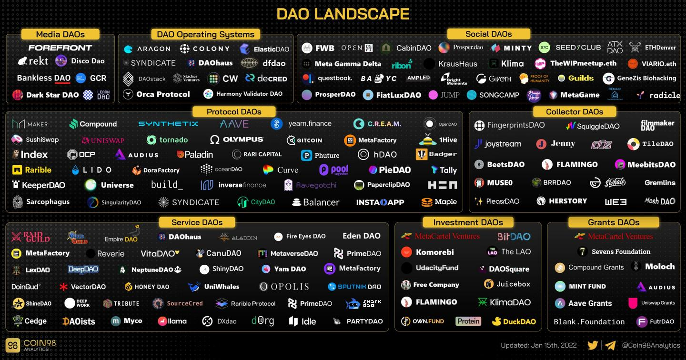
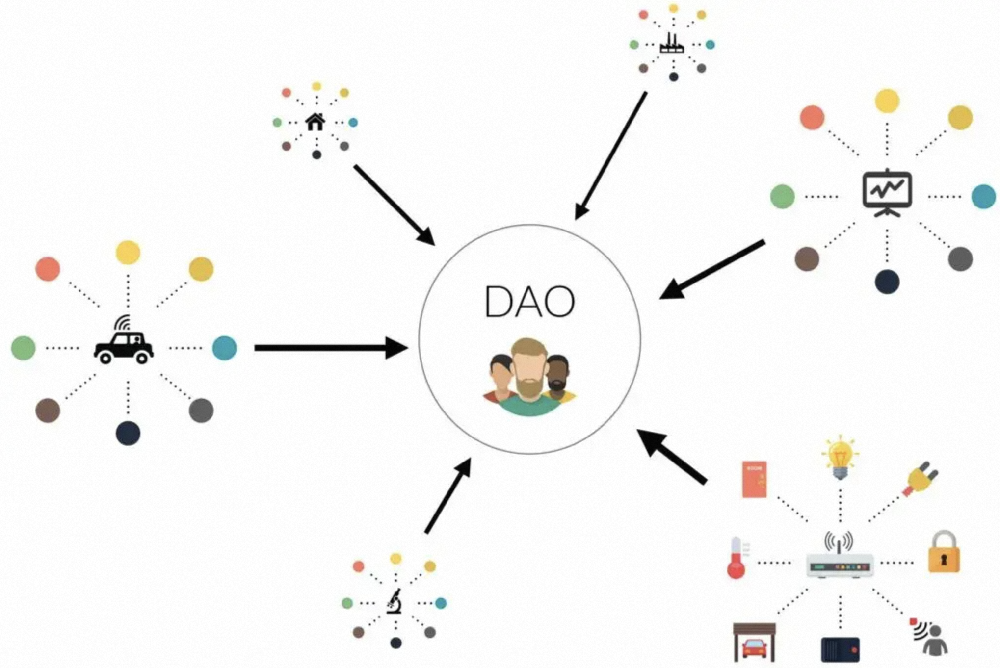

# 1、引言

2022年是DAO风起云涌的一年。

从PleasrDAO迅速众筹购买知名NFT、到a16z投资泛兴区文化社区FWB DAO，一连串标志性事件见证了DAO这一新型组织形式的演化和活跃。DAO的范围最初集中在DeFi项目治理，现在却已扩展到投资、众筹、兴趣社群等多个领域，呈现万物皆可DAO的趋势。Messari的2021年终报告中甚至认为：如果说**2020年的主题是Defi，2021年的主题是NFT，那么2022年的主题则是DAO**。

# 2、DAO是什么

**DAO**的全称是`Decentralized Autonomous Organization`，意为**去中心化自治组织**。

关于DAO概念相关的讨论，最早来自链圈传奇人物BM（Dan Larimer）。2013年，BM在对人解释Bitshares的机制时，将之类比为**DAC**（Decentralized Autonomous Corporation），并且归纳DAC的核心是“有自己的区块链来交换DAC的股份（注：即代币）”，必须不能依赖于“任何个体、公司或组织来拥有价值”、“不能拥有私钥”、“不能依赖任何法律合约”。DAC是BM的首创，虽然定义并不完全清晰，但值得注意的是，DAC是用来描述如Bitshares这样一个完整的产品，认为**产品即公司**，不再依赖人为管理，具有明显的Autonomous内涵。

其后，Vitalik借用并微调了这个词汇，开始在以太坊基金会博客中使用“DAO”这个概念，并认为DAC是DAO的一个子集，DAC以盈利为目的，而DAO不限于此。除此之外，Vitalik和BM的理解基本是在一个方向上的，而Vitalik在更抽象的层面定义了DAO。根据Vitalik的定义，DAO及相关概念的核心区别点在于：是否拥有内部资本，是自治为主还是人治为主。Vitalik认为DAO所在的象限为：**自治为主、人治为辅、拥有内部资本**。

**大多数 DAO 依赖于区块链技术和智能合约，它们是在区块链上运行的代码集合**。

我们知道，在传统组织中，通常有一个层次结构：正式的董事会、高管或高层管理人员决定结构并有权做出改变。

而DAO 是去中心化的，这意味着它们不受个人或实体的管理，**每个 DAO 的规则和治理都编码在区块链上的智能合约中**，除非由 DAO 成员投票通过，否则无法更改。每个 DAO 的成员可以共同对决策进行投票，而不是少数人拥有多数发言权，通常是在平等的基础上进行投票。

对于 DAO 来说，区块链可以充当主干，保持每个链上的结构和规则。一个DAO的诞生，必须具备三个基本要素：

* 拥有内部资本，通过利益分配来激励参与者的行为，保证组织运行；
* 拥有一定程度的自治，即不依赖人类意志和行为的自动决策及执行能力；
* 拥有一定程度的人治，且人治模式是去中心化的，即所有成员均拥有参与决策的途径。

# 3、DAO的应用场景

由DAO的功能可以看到，**所有需要人类合作的组织，都可以通过DAO的形式来建立**，因而DAO的使用场景将极其广泛。例如投资、慈善、筹款、借贷等，所有这些都没有“中介”参与：
* 一个慈善DAO可以接受来自世界各地的人们的捐赠，成员们可以决定如何使用捐赠；
* 风险投资DAO可以创建一个风险基金，汇集投资资本并投票支持风险投资，偿还的钱可以在 DAO 成员之间重新分配；
* 传统众筹方式，会担心组织者跑路，或者各种意想不到的问题，但DAO本质是一种写在区块链上的计算机代码，是一种电子合同，而执行合同是代码程序决定的，不会有人为干预，满足代码条件就自动执行了。

通过归类DAO的主要使用场景，也即人们的合作目标，可以对DAO进行了如下分类：

* **项目治理类DAO**：依托于一个独立产品而建立的治理社区，如Defi领域的CurveDAO。
* **资源调度类DAO**：筹集资源来完成共同目的，如专注Dapp投资的MetaCartel、专注NFT收藏的PleasrDAO、众筹竞拍美国宪法副本的ConstitutionDAO、购买大额游戏NFT资产的YGG DAO。
* **文化兴趣类DAO**：用户围绕相近的文化兴趣而聚集社交、但没有单一固定目的，如FWB DAO。

# 4、DAO面对的挑战

尽管 DAO 越来越受欢迎，但要达到完全主流采用还有很长的路要走。随着区块链技术的不断发展，“安全”都是放在第一位。

投票系统的一个潜在问题是，即使在其初始代码中发现了安全漏洞，也无法在多数人投票之前予以纠正。在投票过程中，黑客可以利用代码漏洞中的漏洞进行攻击。

2016 年 5 月，德国初创公司 Slock.it 推出了创意命名的“**The DAO**”，以支持他们的去中心化版 Airbnb。当时，众筹活动取得了巨大的成功，筹集了价值超过 1.5 亿美元的以太坊。

不幸的是，他们在 DAO 中使用的代码存在某些问题。不可避免地，在 2016 年 6 月，黑客基于这些漏洞攻击了 DAO。黑客获得了 360 万个 ETH，当时价值约 5000 万美元。

这在 DAO 投资者中引发了一场大规模且有争议的争论，一些人提出了各种解决黑客问题的方法，另一些人则呼吁永久解散 DAO。

当时DAO 建立在以太坊网络上，使用智能合约算法来确保其治理结构和经济激励。为了阻止网络攻击，以太坊区块链进行了**硬分叉**，**导致以太坊分裂成两个不同的区块链**一条为原链（以太坊经典，ETC），一条为新的分叉链（ETH），各自代表不同的社区共识以及价值观。这仍然被称为加密货币中最大的黑客攻击之一，暴露了 DAO 的风险并削弱了投资者的信任。

除了安全问题，DAO还有很多其他需要完善的地方：

* 1）从初始阶段很难做出完整的DAO。在项目的早期阶段，需要有人领导和发展。否则 DAO 会没有方向。我们更倾向于说，一个项目应该先成立，后续慢慢向 DAO 发展。

* 2）法律法规不明确。从实践的角度来看，还存在一个问题，即 DAO 的存在在法律上适用于何处尚不清楚。例如，DAO 通常会创建“社区钱包”。但是这个钱包的归属无法界定。当收入累积在社区钱包中时，谁来支付应该征收的税款？这些都是 DAO 的发展过程中不可避免的话题。

* 3）运营DAO的工具开发不足。到 2022 年初，当你真正尝试运行 DAO 时，你就会意识到工具匮乏的挑战。

* 4）DAO基础设施仍不够完善，仍存在很大的技术壁垒；

* 5）普通用户参与积极度不高，治理仍具有中心化属性；

* 6）DAO的运作机制仍不完善，可借鉴案例有限；

* 7）DAO的周期性没有持续性赋能。

* 8）DAO只解决了组织内部运营的信任和内驱问题，但是现在无法解决组织之间的协作交易，这个是极其致命的。自给自足的农耕干不过贸易的企业制。DAO其实是民主的最适宜表达，这个适合政治组织，不适宜商业组织。

* 9）集体智慧远低于个体智慧。“去中心化”和“组织”是逻辑矛盾的东西。事实上并不存在“去中心化的组织”，就像“不存在发光的影子”。停止这样的幻想，把精力用在寻找你能甘心奉献的组织和适应组织缺陷的能力上，可以免去人生很多弯路。

* 10）DAO作为一个去中心化的组织，治理机制相当于公司的规章制度，十分关键，而其中最要紧的一点是激励机制，很多人加入一个DAO组织更多是为了利益，有的人追求长久利益，有的短期，如何针对这些人的贡献涉及激励机制是一个DAO能否长期发展最为关键的要素，目前市面上而言，共识DAO无疑是最成功的之一，其他应用场景善在探索。