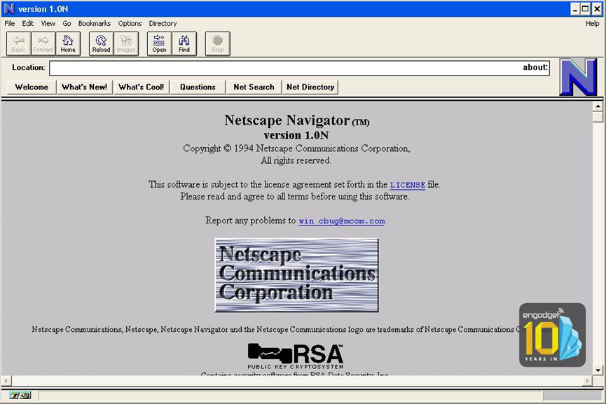
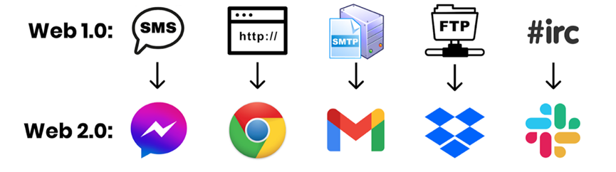
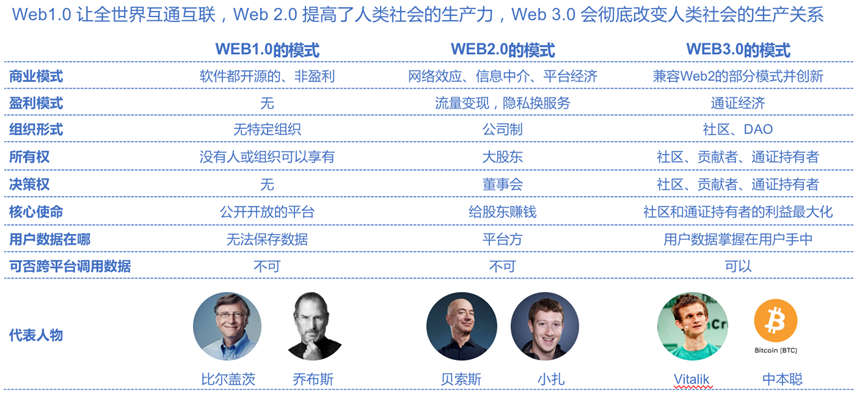

# 1、Web 3是什么

很显然，Web3是什么，就跟区块链3.0是什么一样，或者说，就跟中国大学Top3有2+n个，都是谜一样的概念。

基本上，这些概念的由来都是有两个没有争议的概念，再加上一个似是而非的概念组成，比如大学里清北是Top2，那么中科大，浙大，复旦，上交，甚至中科院大学，都可以试着来蹭个top3。

区块链3.0也同理。

无可争议的，区块链1.0是比特币和加密货币。

逐渐无可争议的，区块链2.0是以太坊。

而接着，所有人都自称自己是区块链3.0，或者区块链3.0愿景的一部分。

但Web3实际上更加复杂——因为如果你回顾了之前对于Web3.0的问题就会发现，连Web2.0是什么都有争议。

我们可以看到以下的几种曾经的Web3定义：

（1）Web1.0：门户网站；Web2.0：搜索引擎；Web3.0：语义网络。
这个算是最早也是根正苗红的Web3定义，来自万维网之父，W3C的主席Tim Berners-Lee。作为使用HTML编写了第一个网页创造了万维网并开启了互联网时代的人来说，他的是从万维网的信息展示的结构而言的——Web1.0是由孤立的、静态的网页和超链接构成的，也就是当你想要寻找某些信息的时候，你完全是通过经验在无数信息的碎片中盲目搜寻；Web2.0的网页则增添了互动性和多媒体，以及有了搜索引擎这个索引网络信息的渠道，也就是说，我们可以通过搜索引擎找到我们想要的信息，但所有信息的组织方式仍旧是无序和散乱的；而Web3.0中，也就是语义网络中，信息将以更有效、更结构化和更规整的方法被储存着，就像是一个更有序的数据库，而当人们想要找到某些信息的时候，可以轻易地通过网页的标签和关键字找到，就如同互联网能够理解你想要找的东西一样——这也就是语义网络的概念。

（2）Web1.0：门户网站；Web2.0：搜索引擎；Web3.0：移动互联网+社交网络。
很显然，这个Web3.0的概念诞生于社交网络刚刚兴起的时候，而现在的我们对于社交网络早已不陌生。而社交网络兴起的助推剂包括3G+4G，智能设备（智能手机），而随之产生的概念包括用户生产内容、手机端应用取代网页、多媒体信息等……

（3）Web1.0：门户网站；Web2.0：社交网络；Web3.0：物联网。
相信大家也能看出来，这个定义的时间和之前已经不是一个时间了，因为社交网络已经被当作了现在时而不是将来时。在这里，Web3.0是更好的网络连接、更多的智能设备和更频繁的互联需求。随之而来的概念例如智能制造，工业4.0等。

（4）Web1.0：门户网站；Web2.0：社交网络；Web3.0：人工智能（推荐算法）。
同样，对于这个定义相信也没什么需要解释的，头条和抖音就是非常鲜明的，这个Web3.0概念的例子。

基本上，Web3.0概念的变化历程，也就是一段简短的互联网发展史。曾经，移动互联网和社交网络曾经被认为是Web3.0，而现在，它们已经成了Web2.0，而谷歌为代表的搜索引擎成了Web1.0的一个注脚。而接着，物联网和推荐算法都已经逐渐变成现实或者成了现实。

上面唯一没有成为现实的是语义网络，但仔细看看语义网络的愿景——1，信息以比网页更好的形式组织起来；2，整个互联网变成一个巨大的数据库供人查阅。前者，随着移动互联网和手机应用的出现，信息的形式确实已经不仅限于网页，而包含了视频、短视频等各种多媒体信息、而且变得更加碎片化。而且，随着标签和推荐算法，一方面，语义网络期望的一个“能够理解用户想要查找的信息”的语义网络已经实现了，但另一方面，它更进一步，不仅能理解你想要查找的信息，还能根据你的个人偏好预测你想要查找的信息并且推送给你，而且，甚至还可以更进一步，把它想要让你知道的信息混杂在推送里，从而影响你的偏好。

于是，语义网络中的第二点其实逐渐失去了出现的基础——在当年，说到互联网，人们看到的是无限的信息被不规整地散布在公有网页中，心想如果把这些信息都有效的组织起来，将极大地提高知识获取的效率，是全人类的宝藏；而现在，当看到这些信息，互联网公司只会想到这几个词：“流量”、“私域”，“变现”……一边笼络最受欢迎的信息创造者和高价值的信息，通过自己的接口独占这些信息，在推荐算法帮助下给用户编织一个“信息茧房”，让他们觉得“人们其实并没有去搜索更多信息的需求”，“所有我不能轻易获取的信息都不重要”。一边挖掘这些信息产生的价值的方方面面，广告、打赏、付费订阅、IP衍生、带货、粉丝经济……

那么，什么是Web3？

10年过去了，阿里还是阿里，Amazon还是Amazon，Facebook还是Facebook（虽然变成Meta了）；甚至20年过去了，互联网世界早就天翻地覆，无数个曾经对于未来的愿景都变成了现实——社交网络、移动互联网、万物互联、人工智能……但腾讯还是腾讯，谷歌还是谷歌。

而我们，还是不断会听到直击心灵的叩问：“到底什么是Web3？”。

因为**Web3是变革，而我们实际上还是在期待互联网的一场变革**。

当前最流行的版本无疑是区块链所代表的web3：
* Web1.0：门户网站，即，单方面的信息传输；
* Web2.0：社交网络，用户依托于平台产生信息；
* Web3.0：用户不依赖平台，产生并且拥有自己生产的信息。

区块链能带来这种变革吗？去中心化的互联网是Web3吗？没人知道。

只是如果10年之后，如果腾讯还是腾讯，阿里还是阿里，谷歌还是谷歌，Facebook还是Facebook，那么我们也许还会如同10年前，或者如同今日一样，身处Web2，企盼Web3。

# 2、区块链的Web3

## 2.1 Web1.0（1980-2000）

网络的第一波浪潮始于80年代，标志性的事件就是两台电脑通关协议来“沟通”了。这个协议就是1983年被创造出来的TCP/IP协议。

这个时期的网络（万维网）还做不到太多的“互联”，**更多的是信息的只读**。

网景（Netscape）公司就是这一时期的典型，将信息发布在网络上。

这一时期的网络有如下痛点：
· 接入技术门槛高
· 没有信息的索引功能
· 不能和用户产生交互，记录不了用户数据

## 2.2 Web2.0（2001-至今）

随着2000年互联网泡沫破裂后，第二波浪潮开始萌芽。许多公司开始针对Web1.0模式的痛点着手改善，包括了搜索功能，允许用户上传内容等。

此时出现的Web 2.0产品**更具交互性，用户可以创建、上传和共享他们的内容**。

这方面的例子包括了谷歌和微软在1981年的SMTP（邮件传输协议）上构建Gmail和Outlook产品。虽然SMTP协议本身是公开和透明的，但是Gmail和Outlook是被这两家技术巨头所拥有的封闭平台。所以Web2用户实际在交互的软件是这些技术巨头基于Web1开源软件构建的产品。

Facebook（现已改名Meta）是很典型的Web2技术巨头，通过允许用户在平台上读写、互动和社交等行为沉淀下大量的数据和流量来创造财富。

## 2.3 Web3.0（概念诞生于2014年）

Web 3.0 最早由以太坊的联合创始人Gavin Wood在2014年提出，在2021年底突然受到大家的关注。

Web3 包括了Web1和Web2的特点：**透明，公开的开源网络，用户可读写和上传内容，还能做价值交换**。

从概念理解上，Web3代表互联网的下一个时代，互联网形态向着更民主的范式转变。Web3也源于人们对当今互联网价值的态度的转变: Web2.0的巨头控制着互联网和所有人的数据，因此很多人出现了想创造一个真正“集体所有”互联网的想法。

**Web3的核心是在让用户不仅可以读写内容，还可以拥有自己的内容**，这样他们就不会被中心化的科技公司任意修改规则而左右。Web3还原了Web1的开放性，所有市场参与者的规则都是标准化的，这样大型客机公司就不会扼杀创新和市场竞争。

Web3下的公司形态也发生了变化：

## 2.4 总结

用技术的角度来说：**web1是可以读的，web2是可以写的，web3是可以拥有的**。

用人性的角度来说：**web3凝聚着新人类对互联网现状的反感、反思和反抗**。

很多人觉得现在的互联网有问题，需要改变。互联网的现状是什么？寡头垄断，以及规则固化。我们现在每天用到的科技产品（手机上的App）基本就是几个巨头掌控的，在美国是FAAMMG，中国是BAT和TMD，基本上10个指头就能数出来。反对这一现状的人，需要聚集在一个旗帜底下，这个旗帜上写的可能是区块链，或者crypto，那么，现在web3旗号下聚集的人最多。

# 3、Web3文化

**区块链是一种技术，DAO是一种制度，Web3则是一种文化**。

DAO是一种去中心化组织形态，可以理解为“去中心化的公司”，是建立在区块链之上的经济系统，有相同理念和共识的人即可形成一个DAO。人们未必需要区块链才能形成共识。互联网世界，当人们强烈认同一个视频或着文章时，即使不断被中心化机构删除，人们也会自发存储和转载，将其保留在网络上。这样的行为其实暗合DAO的思想和Web3的文化。

但是人类自发的共识是脆弱的，没有技术+制度+文化的保证，这些共识可能会存在一晚或者一时，但是它依然是局部、片面、转瞬即逝的。人们需要区块链+DAO+Web3，来记录和保证我们珍惜的那些行为和共识。

1915年，陈独秀在其主编的《新青年》刊载文章，提倡民主（德先生）与科学（赛先生）。那时候，站在时代最前沿的改革和创新者们发现洋务运动（技术）救不了中国，辛亥革命（制度）救不了中国，新文化运动（技术+制度+思想文化）就此应运而生。

Web3的发展也同样如此，它和其他技术形式不一样的是，它更像一个“技术+制度+文化”的集合。如果你只“洋务运动”（只发展区块链的技术），而不“辛亥革命”和“新文化运动”，那么这样的Web3只是空有其表。

**去中心化，是Web3的精神所在，也是互联网的核心**。

在体制上，中心化的互联网越来越受到人们的诟病。无论是推特、微博还是Facebook都有着中心化公司的弊端，比如随意浏览用户隐私、将私人数据归为己有、大数据杀熟等。这些问题，是Web2互联网公司刻在骨子里的基因决定的，很难由他们自身或者一味的通过监管去解决。

最近，某大厂员工便被指出涉嫌“偷看”创业公司工作文档，事情过了近一个月，官方仍未回应。这样的事件屡见不鲜，而且绝没有可能杜绝，人们没有任何反抗或者选择的机会，小小的个体即使被侵犯了，也不会有得到任何说法，况且绝大多时候人们并不知道自己的隐私或者数据权利被侵犯过。这并非互联网公司喜欢做恶，而是其自身固有的体制决定。而且一旦社会出现“小政府、大公司”的情况，这些问题的严重程度会以几何级数递增。

怎么消解大厂“恶的一面”？剥夺他们过于中心化的权力。

需要指出的是，Web2互联网也并不是完全中心化的世界，实际上它比Web1和互联网没有诞生时更加去中心化。只不过，Web2互联网公司普遍信奉中心化的思想。

支付宝、微信、滴滴的出现，实际上让人们多了一种选择。在这些互联网产品没有出现之前，大家只能用银行提供的产品、只能用电话等方式交流、只能到路边拦出租车。而互联网实际上给人们提供了新的选择。

从这一逻辑出发，Web3的去中心化体现在两层：一层是社会范围，Web3的出现，让普通人和创业者都提供了新的机会，让这个社会不再那么垄断和中心化；第二层是Web3本身，它的核心思想是信奉去中心化，致力于在体制上让每一个Web3产品去中心化。

人们习惯了古典互联网的生活方式，认为自己发布的每张图片、每条留言、每篇文章都应该被人们自由免费分享传阅。数据即金钱、即权力，这是每一个大型互联网公司都深知的真理。然而，这个真理只限于大机构。数据是金钱，大公司可以把数据转化为金钱和权力，但是个人不能。

Web3则让数据可以更加深度流通，它让数据的权力不再只限于国家和大型企业，而是归还于每一个人。

你在网络上的每个足迹，看似普通，但汇聚起来，就形成了价值。而当这些数据只有普通人才可以授权给需要的机构时，人们即可通过自己的网络足迹获取收益，甚至与他人进行频繁的数据交换。

Web3，吸引着最疯狂的资本、最有野心的年轻人和最天马行空的项目。而连接他们的是一种信任。

这种信任，来自于一个个小小的生活场景。

一个新加坡人想在澳大利亚买房，可能需要去各个部门申请，花费一周才能成功。然而在Web3体系，只需要几秒。在以前人们要完成一个复杂的目标，需要成立一家公司，而现在人们只需要成立一个DAO（去中心化自治组织）。

Web2（互联网），让每一个人即使在家，也能即时看到全球各国发生的大事。Web3则在目前的世界体系之外打造出了一个独立的全球经济系统，让每一个人随时随地可以和全球有共识的陌生人一起做一项复杂的事业。

# 4、未来已来，但不均匀

关于科技和未来，有一句话被经常引用：

> The future is already here – it's just not evenly distributed.

未来已来，只是它的分布不那么均匀。怎么理解呢？有的人在用nft，有的人在用数字藏品，有的人还停留在使用大平台的产品……所以，有些人已经在使用未来的产品，有些人仍然被束缚在过去。

在中国，区块链和Web3仍是最受争议的行业之一。一些区块链公司CEO，即使身价过亿，团队成员过千，甚至登上全球主流杂志封面，也被老母亲痛批为“盲流”。

这种思想观念上的冲突已经持续了10年，还将继续存在。中国从农业社会，进化到工业社会，再进化到数字社会，只用了短短30年，回首看，每十年都是一场革命性的颠覆。

那个时代下田栽秧的孩子，不会想到自己未来会在工厂上班，因为当时满眼望去看不到一个工厂；在工厂玩耍的孩子，不会想到自己以后的工作会是在摩天大楼里天天盯着一台屏幕，因为目力所及之处都是低矮房屋；而在摩天大楼之间奔跑的孩子，或许未来工作的地方将在田野、在海上、在地下，甚至工作这一概念都将被消解。

固有的思维依然在人们的脑海挥之不去，但世界却在笃定变化着。人们从互联网、金融、艺术等行业“涌进”这一赛道，把区块链技术融进产品，把DAO的思维放进公司，将Web3文化接入数字社会。

这是一场已经持续了10年的“迁徙”，而大部队才刚刚动身。
