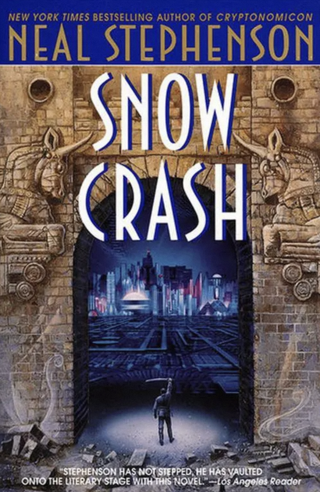
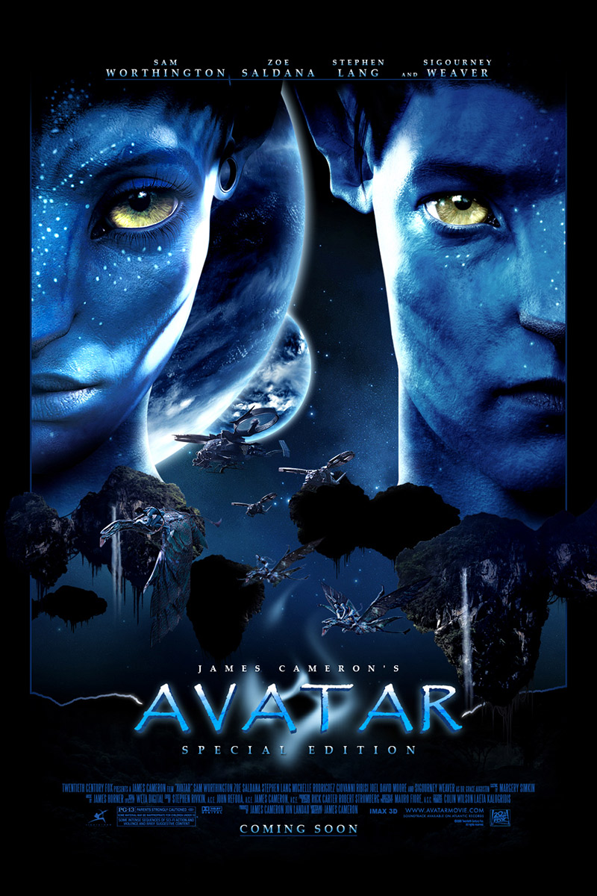
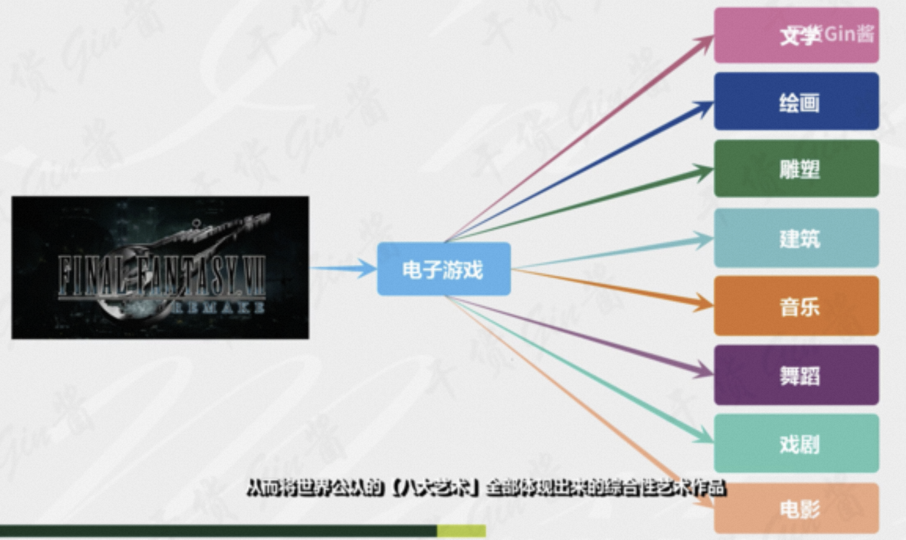
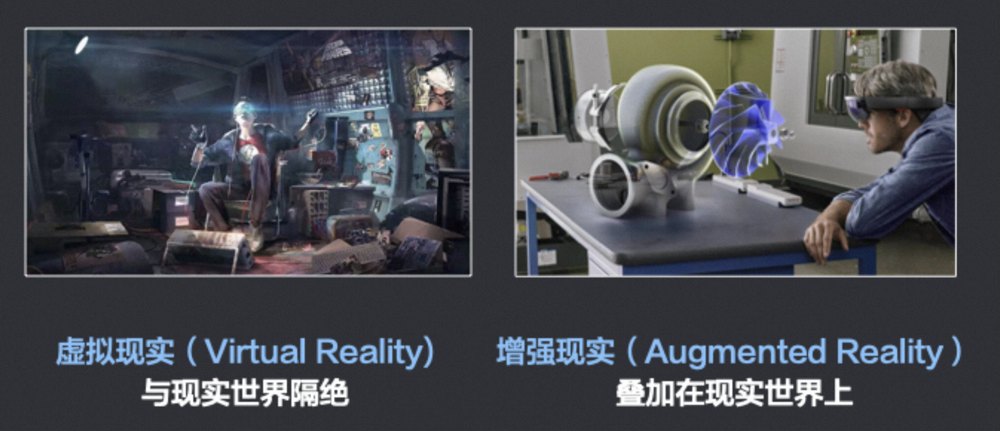

# 1、什么是元宇宙

很多人将2021年称为元宇宙元年，但实际上这个概念已经诞生了整整29年。

元宇宙（Metaverse）的概念最早出现在1992年美国作家尼尔·斯蒂芬森的科幻小说《雪崩》(Snow Crash）中。

小说中描绘了一个平行于现实世界的网络世界，所有在现实世界之中的人，都可以在这个网络世界中拥有一个“网络分身”。

这个网络世界被称为“Metaverse”。Meta表示“超越”、“元”， verse表示“宇宙universe”，两者合在一起被翻译成**元宇宙**。

很多人之所以会对元宇宙的含义感到困惑，甚至是感到敬畏，这其中多多少少有些翻译的锅。在中文里，“元”这个字的概念是指某种事务的具体存在和表现形式。比如说，在中国传统哲学里，宇宙的终极规律——道的运行轨迹就是“元”。再比如说，用来描述语言的语言，被称为元语言；用来解释理论的理论，被称为元理论。然而元宇宙的“元”明显不是这个意思，而更倾向于表达“之后”“之外”“之上”的含义，表示来源于现实宇宙，而又不同于现实宇宙。

值得一提的是，书中所说的“网络分身”，英文单词叫做**Avatar**。是的，Avatar就是“阿凡达”。2009年，美国著名导演詹姆斯·卡梅隆的那部经典电影，就是以它命名。

Avatar的原意是“化身”，印度教和佛教中，特指化作人形或兽形的神。

如今，电脑游戏或聊天室中玩家使用的虚拟身份，也叫Avatar。大家想想看，你在玩游戏时，你控制的一个虚拟角色，是不是就是你在游戏中的化身？你可以通过这个虚拟角色来实现你的意志。所以这个虚拟角色就是你的 Avatar（化身）。

所以说，**元宇宙的本质就是一个虚拟世界**。比如说博客、论坛、微信、微博等等，以及各种各样带有联机功能的单机游戏和网络游戏，让我们能以一个电子化身，甚至是各种各样我们所喜欢的身份，与天南海北的人无视空间距离进行互动，这些网络平台所交织构建的虚拟空间，某种意义上就是一种初阶的元宇宙。

按照“元宇宙第一公司”Roblox的定义，元宇宙有八大要素：

* **身份**：你可以拥有一个虚拟身份，与现实身份无关，可以是总统，也可以是乞丐。
* **朋友**：你可以拥有真人或AI朋友，可以社交，无论在现实中是否认识。
* **沉浸感**：指得是全感官体验，在元宇宙中你获得的不仅是视觉和听觉的体验，还包括其他一切感官体验，让你能够忽略现实与虚拟的区别。
* **低延迟**：元宇宙中的一切都是同步发生的，没有异步性或延迟性，体验完美。
* **多元化**：元宇宙会提供丰富、差异化甚至是定制的内容，可以满足你的一切需求。
* **随地**：你可以随时随地登录元宇宙，不受空间限制。
* **经济系统**：元宇宙会存在某种与现实世界相连接的货币与贸易体系，可不是某种大型氪金系统，而是现实世界的虚拟经济在元宇宙中的投射
* **文明**：人们聚集在一起，创造独特的虚拟文明、数字文明。

不难发现，相较于这八大要素，当前的社交网络和电子游戏，基本已经能满足其中的身份、朋友两大要素；能部分满足多元化、经济系统这两点；但至于全感官的沉浸感、即时同步的低延迟、随时随地以及能够允许使用者构建文明这四条，不要说现在的社交网络和电子游戏，甚至是未来一段时间内的电子产品，都大概率受制于技术水平而难以做到。

# 2、游戏与元宇宙

## 2.1 游戏的本质

游戏这种互动式多媒体。几乎代表了大家对虚拟世界的往往最前沿的体验探索与天马行空的尝试，包括这个领域的技术发展，比如3D引擎、渲染技术等的发展，所以脱离游戏领域来聊元宇宙，都是很没有根基的。

大家可以观察大型娱乐设施的演变，不管大家在看的 IMAX（3D）还是在各地环球影城看的各式主题公园，其实都在做一件事，让创作者的作品变得更加场景式具象化，来达到感官的沉浸式，让我们在那一刻，觉得这些都是真的，而留下深刻的记忆和经历。这如果与人类历史上媒体类型的演变也一起关联，就更加明朗。在文艺复兴时代，产生了很多伟大的文字作品（文字），随后又产生了很多异想天开的画作（图片），到现代科技时代，产生了电影，甚至是科幻电影（视频），再到现在沉浸式娱乐设施，产生了电影院与主题公园（沉浸环境，甚至可互动），我们在其中到底在体验什么，其实是在**体验他人（创作者）想象力的具象化**。

大部分人眼里的游戏，是一种 “娱乐项目” 甚至是 “电子鸦片”，其实**游戏的本质也同样只是一种多媒体形式**，要看它用来去表达创作者的什么思想，比如像陈星汉的《风之旅人》，其本质更像一个互动式电影，两个玩家随机匹配，无法用语音或打字沟通，仅能靠相互 “无声” 的陪伴的方式完成整个旅程，然后到最后一关时，很多玩家会在雪地上通过控制人物行走，在雪地上画出一个心，来表达珍惜这段陪伴，结束关卡后，两个玩家这一辈子再也不会再重逢，这种 “玩法的设定” 特别像真实的人生一样，很多玩家通关后，觉得整个人的灵魂都被净化了一遍，还会有人认为这是很多人眼里的 “电子鸦片” 吗？

所以理解”**媒体是创作者想象力的具象化载体介质**“是非常重要的认知，**核心是创造者本身要通过某种媒体投射什么思想出来**，无非是写成了文章（文字），画成了画（图片），编曲成了音乐（音频），还是拍成了电影（视频），甚至做成了游戏（互动式场景），而不是对媒体本身抱有偏见，比如很多人觉得玩游戏就是不好的，看动漫就是很幼稚的，却从没想过某些游戏和动漫可能表达的思想深度甚至可以远超脱于他接触过的其他事物。

**游戏上应该算是目前世界上最复杂的媒体形式**，也称为**第九艺术**。

## 2.2 VR/AR/MR

聊完游戏是什么，为什么要紧接着聊VR/AR呢？尤其是VR，因为《雪崩》《玩家1号》里描述的就是 VR世界，而且VR的体系也是从游戏领域发展而来的。可以很简单粗暴地认为，早年这些科幻作品里 **"元宇宙" 概念 ≈ VR世界**，

VR 和 AR 实际上完全是两个不同的领域，有一定技术重叠性，但又区别非常大。先用一个很简单地方式来帮助大家快速区分，如果带上一个封闭式的眼镜，看不到现实世界任何物品，全靠眼镜里虚拟出来的内容，这就是 **VR（虚拟现实）**。如果带上眼镜是透明的，会在现实世界的物品之上，叠加出数字信息，比如看到茶几，上面跑出来了几个虚拟的茶杯，这就是 **AR（增强现实）**。如果眼镜是封闭式，但可以把现实世界影像投射到眼镜上，就是 **MR（混合现实）**。

从商业效率的角度来说，VR的使用上，会没有AR更高频，因为AR可以随时随地都在现实世界使用，VR更需要单独的时间段，进入一个沉浸式的体验之中，AR的工具属性会更强，VR的体验属性会更强。它们本身的定位也不同，差异其实也挺大的，VR有个很重要的特点，就是**可以完全忽略现实世界，乃至它的客观物理规律，所以它其实会发展出完全不同一套业务/商业体系出来**。

**互联网的出现，拉近了人与人之间获取信息的平等性，虚拟现实的出现，将拉近人与人之间获取经历的平等性**。【人的经历】如果以简单粗暴的方式来定义，可以看成五感获取信息的集合，五感（视觉、听觉、触觉、味觉、嗅觉） ，比如我和朋友深夜交谈，如果没发生过肢体触碰，基本上这段经历主要由 视觉、听觉 构成，而我们生活中绝大部分的经历都是主要由这两者构成，再多一个层次就是触觉，（你用记忆时就能感受到，几乎主要核心的印象都在这三种感官上），在虚拟世界里触觉是通过你操控手柄之类的系统反馈所获得，所以目前的VR设备已经足以不错地模拟视觉、听觉、触觉。

在《玩家1号》的原著里，男主角在贫民窟，和富人的孩子一起在绿洲里接受一样的教育，而富人的孩子能在现实世界里花钱去经历的一些事，比如旅游，至少在虚拟世界里，也能做到类似的体验替代，所以它是能某种程度上拉近人与人之间获取经历的平等性。

前面说了关于媒体的演变 和 "经历" 的定义后，当我可以以沉浸式的体验经历《哈利波特》的世界，当我可以以沉浸式的体验经历《盗梦空间》的世界，当我可以以沉浸式的体验经历《奇异博士》的世界，这就会产生各式各样有趣的世界观。

在 "那些" 世界当中，由于沉浸性在我们脑中已经足以植入了 "经历"，人对世界的看法，也是来自于经历之后的感悟和思考，那么经历了这些奇怪的新世界之后，我们对世界的看法，会不会变得大不一样，以前我们对世界的看法，来自于遵循同一个物理规律的宇宙，或叫现实世界。

现在在虚拟世界中，一切都不用遵循宇宙法则，可以出现各种莫名其妙的宇宙，只要你想象力有合适的工具辅助其具象化成为一个可互动式的世界，别人进入你的世界，就能得到你定义的世界的体验，而产生新的 "经历"，这样人类对世界，甚至生命、文明的认识，会变得更加丰富和多样性，所以**释放人类的想象力，是这个时代可能会产生的非常特殊的一次文艺复兴时代**，将与以往任何时代产生的内容意义都不同，它将可能真正产生出具有实际意义的平行宇宙（因为 "经历" 被定义的原因），平行的多种可能性，本质就是模拟，不断模拟，不断尝试不同的经历。

# 3、元宇宙的未来

浪漫主义者预言：随着数字技术的发展，人类未来一定会完成从现实宇宙向元宇宙的数字化迁徙。

整个迁徙过程，分为三个阶段，分别是：**数字孪生**、**数字原生**和**虚实相生**。

数字化迁徙之后，数字空间（元宇宙）里面会形成一整套经济和社会体系，产生新的货币市场、资本市场和商品市场。

人类在元宇宙里面的数字分身，将会永生。即便现实中的肉体湮灭，数字世界的你，仍然会在元宇宙中继续生活下去，保留真实世界里你的性格、行为逻辑，甚至记忆。

如果真的是这样，元宇宙带来的，就不仅仅是技术问题，而是伦理问题。

如果元宇宙足够真实，让人难以区分与现实的区别，那个体在元宇宙之中犯罪，是否要按照现实世界的法律予以惩处？如果惩处的话，这是否算得上某种“思想罪”，毕竟罪行没有在真实世界中发生；如果不惩处的话，又如何保障元宇宙不至于沦为某种堕落的黑暗丛林？或者说为元宇宙制定一套单独的规则，那什么样的人有资格成为立法者、执法者，又该如何保障规则不为开发元宇宙的科技公司所垄断？从这个角度而言，建立元宇宙所面临的障碍，技术层面某种意义上反而是最简洁明了的。

总而言之，游戏可以算是元宇宙的初级形态。技术方面，两者还有很大差距。哲学和意识形态方面，元宇宙才刚刚起步。

未来，元宇宙很可能以游戏为起点，发展为互联网的替代者，深入整合数字化娱乐、社交网络，甚至社会经济与商业活动。

