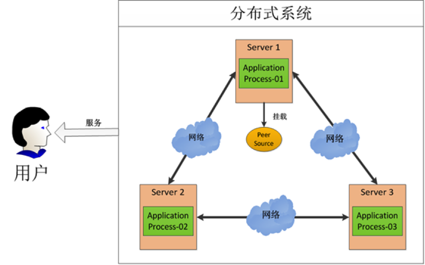
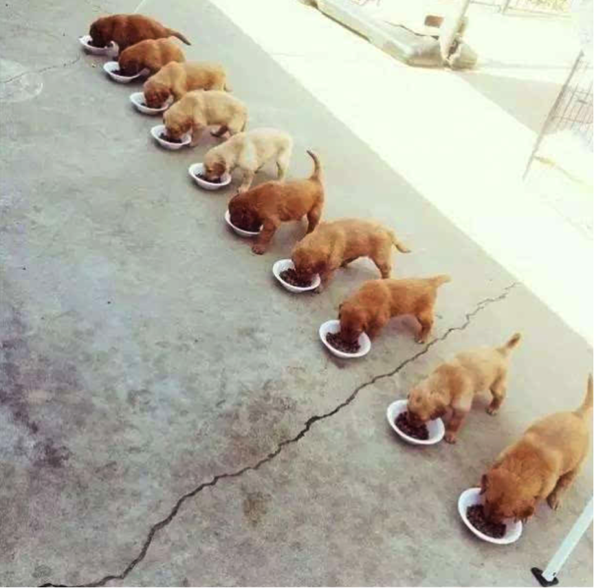
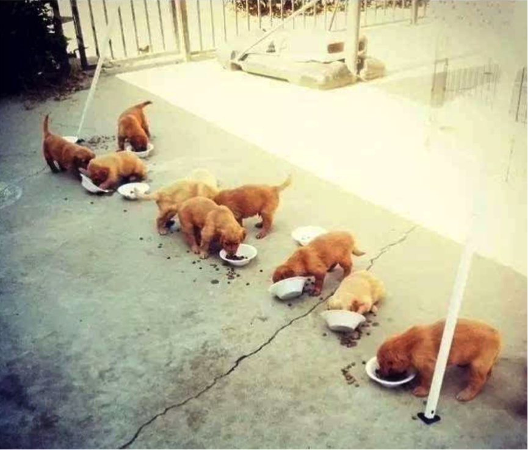

# 1、 产生背景

当今是个分布式、集群、云计算等名词满天飞的时代。造成这种局面的一个重要因素就是，单一机器的处理能力已经不能满足我们的需求，不得不采用由多台机器组成的服务集群。服务集群对外提供服务的过程中，可以分解处理压力，在一定程度上打破性能瓶颈，并提高服务的可用性（不会因为一台机器宕机而造成服务不可用）。

 

上图中有三台机器，每台机器跑同样的一个应用程序。然后我们将这三台机器通过网络将其连接起来，构成一个系统来为用户提供服务，对用户来说这个系统的架构是透明的，他感觉不到这个系统是一个什么样的架构。那么我们就可以把这种系统称作一个分布式系统。
那么，问题来了：

- 程序的运行往往依赖很多配置文件，比如数据库地址、黑名单控制、服务地址列表等，而且有些配置信息需要频繁地进行动态变更，这时候怎么保证所有机器共享的配置信息保持一致？
- 如果有一台机器挂掉了，其他机器如何感知到这一变化并接管任务？如果用户激增，需要增加机器来缓解压力，如何做到不重启集群而完成机器的添加？
- 用户数量增加或者减少，会出现有的机器资源使用率繁忙，有的却空闲，如何让每台机器感知到其他机器的负载状态从而实现负载均衡？
- 在一台机器上要多个进程或者多个线程操作同一资源比较简单，因为可以有大量的状态信息或者日志信息提供保证，比如两个A和B进程同时写一个文件，加锁就可以实现。但是分布式系统怎么办？需要一个三方的分配锁的机制，几百台worker都对同一个网络中的文件写操作，怎么协同？还有怎么保证高效的运行？

除了上面列举的几种，还有很多细思极恐的问题，分布式系统到底有多然人抓狂，可以想想你第一次接触多线程的感觉;
计划中的多线程

现实中的多线程

分布式系统可以看作多线程的N级加强版……

# 2、 ZooKeeper的前世今生

分布式系统的很多难题，都是由于缺少协调机制造成的。

目前，在分布式协调技术方面做得比较好的就是Google的Chubby还有Apache的ZooKeeper。有人会问既然有了Chubby为什么还要弄一个ZooKeeper，难道Chubby做得不够好吗？主要是Chubby是非开源的，Google自家用。后来雅虎模仿Chubby开发出了ZooKeeper，也实现了类似的分布式锁的功能，并且将ZooKeeper作为一种开源的程序捐献给了Apache，那么这样就可以使用ZooKeeper所提供锁服务。而且在分布式领域久经考验，它的可靠性，可用性都是经过理论和实践的验证的。

至于这个神器为什么叫ZooKeeper，与外国人一贯的幽默精神有关。

众所周知，外国人喜欢给用一个动物作为吉祥物，在IT界也不例外。比如，负责大数据工作的Hadoop是一个黄色的大象；负责数据仓库的Hive是一个虚拟蜂巢；负责数据分析的Apache Pig是一头聪明的猪；负责管理web容器的tomcat是一只雄猫……那好，负责分布式协调工作的角色就叫ZooKeeper（动物园饲养员）吧。

# 3、 ZooKeeper能干什么

官方说辞是：

ZooKeeper 分布式服务框架是Apache Hadoop 的一个子项目，它主要是用来解决分布式应用中经常遇到的一些数据管理问题，如：统一命名服务、状态同步服务、集群管理、分布式应用配置项的管理等。简化分布式应用协调及其管理的难度，提供高性能的分布式服务。ZooKeeper的目标就是封装好复杂 易出错的关键服务，将简单易用的接口和性能高效、功能稳定的系统提供给用户。

ZooKeeper在一致性、可用性、容错性的保证，也是ZooKeeper的成功之处，它获得的一切成功都与它采用的协议——Zab协议是密不可分的，这些内容将会在后面介绍。

为了实现前面提到的各种服务，比如分布式锁、配置维护、组服务等，ZooKeeper设计了一种新的数据结构——Znode，然后在该数据结构的基础上定义了一些原语，也就是一些关于该数据结构的一些操作。有了这些数据结构和原语还不够，因为ZooKeeper工作在分布式环境下，服务是通过消息以网络的形式发送给分布式应用程序，所以还需要一个通知机制——Watcher机制。总结一下，ZooKeeper所提供的服务主要是通过：数据结构 + 原语 + watcher机制，三个部分来实现的。