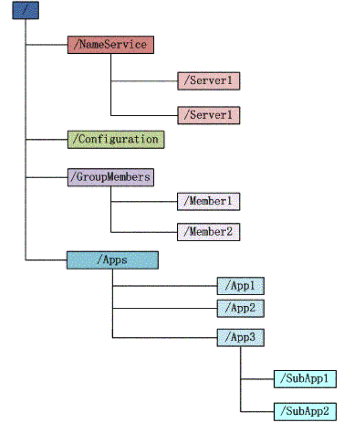
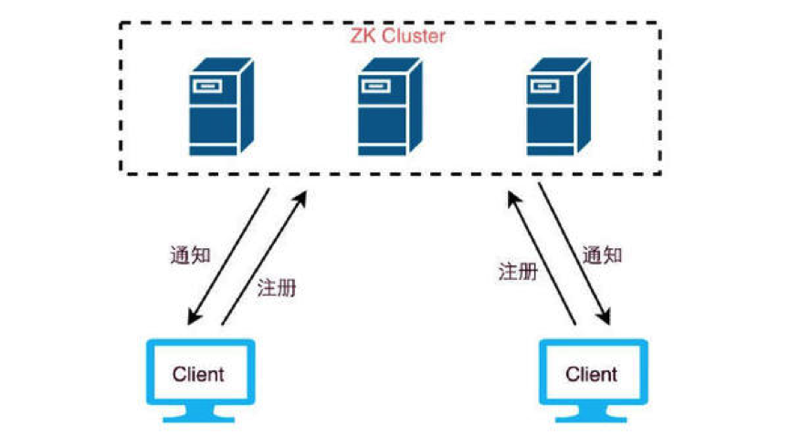

ZooKeeper 会维护一个具有层次关系的数据结构，它非常类似于一个标准的文件系统：

树形结构的每个节点都被称作为**Znode**。

Zonde通过路径引用，如同Unix中的文件路径。**路径必须是绝对的**，因此他们必须由斜杠字符来开头。除此以外，它们必须是唯一的，也就是说每一个路径只有一个表示，因此这些路径不能改变。在ZooKeeper中，路径由Unicode字符串组成，并且有一些限制。**字符串"/ZooKeeper"用以保存管理信息**，比如关键配额信息。

# 1、 数据结构

Znode兼具文件和目录两种特点。既像文件一样维护着数据、元信息、ACL（**A**ccess **C**ontrol **L**ist，访问控制列表）、时间戳等数据结构，又像目录一样可以作为路径标识的一部分。

每个Znode由3部分组成:

- stat：此为状态信息, 描述该Znode的版本, 权限等信息
- data：与该Znode关联的数据
- children：该Znode下的子节点

ZooKeeper虽然可以关联一些数据，但并没有被设计为常规的数据库或者大数据存储，相反的是，它用来管理调度数据，比如分布式应用中的配置文件信息、状态信息等等元数据。这些数据的共同特性就是它们都是很小的数据，通常以KB为大小单位。ZooKeeper的服务器和客户端都被设计为严格检查并限制每个**Znode的数据大小至多1M**，但常规使用中应该远小于此值。

# 2、 节点类型

ZooKeeper中的节点有两种，分别为**临时节点**（Ephemeral Node）和**永久节点**(Persistent Node)。节点的类型在创建时即被确定，并且不能改变。

两种节点的区别在于是否依赖于**会话（Session）**而生存。客户端和ZooKeeper服务器的一次连接称为一次会话。客户端靠与服务器建立一个TCP的长连接来维持一个会话，客户端在启动的时候首先会与服务器建立一个TCP连接，通过这个连接客户端能够通过心跳检测与服务器保持有效的会话，也能向ZooKeeper服务器发送请求并获得响应。

**（1）临时节点**：该节点的生命周期依赖于创建它们的会话。一旦会话结束，临时节点将被自动删除，当然也可以手动删除。虽然每个临时的Znode都会绑定到一个客户端会话，但他们对所有的客户端还是可见的。另外，ZooKeeper的**临时节点不允许拥有子节点**。

**（2）永久节点**：该节点的生命周期不依赖于会话，并且只有在客户端显示执行删除操作的时候，他们才能被删除。

另外，当创建Znode的时候，用户可以请求在ZooKeeper的路径结尾添加一个递增的计数。这个计数对于此节点的父节点来说是唯一的，当客户端请求创建这个节点A后，ZooKeeper会根据父节点的zxid状态，为这个A节点编写一个全目录唯一的编号（这个编号只会一直增长）。这样的节点称为**顺序节点**。

临时节点与永久节点都可以成为顺序节点。细分一下，共有四种节点类型：

- **PERSISTENT**-持久化目录节点
  客户端与ZooKeeper断开连接后，该节点依旧存在
- **PERSISTENT_SEQUENTIAL**-持久化顺序编号目录节点
  客户端与ZooKeeper断开连接后，该节点依旧存在，只是ZooKeeper给该节点名称进行顺序编号
- **EPHEMERAL**-临时目录节点
  客户端与ZooKeeper断开连接后，该节点被删除

-  **EPHEMERAL_SEQUENTIAL**-临时顺序编号目录节点
  客户端与ZooKeeper断开连接后，该节点被删除，只是ZooKeeper给该节点名称进行顺序编号

# 3、 数据访问

ZooKeeper中的每个节点存储的数据要被**原子性的操作**。也就是说读操作将获取与节点相关的所有数据，写操作也将替换掉节点的所有数据。

另外，每一个节点都拥有自己的ACL，这个列表规定了用户的权限，即限定了特定用户对目标节点可以执行的操作，有以下权限：

- CREATE: 创建子节点的权限

- READ: 获取节点数据和子节点列表的权限

- WRITE: 更新节点数据的权限

- DELETE: 删除子节点的权限

- ADMIN: 设置节点ACL的权限

上面的权限有点类似信息系统的权限管理，在开发系统的时候一般也会对数据做这些权限管理，一个ZooKeeper集群可能会服务很多的业务，尤其是一些大公司，ZooKeeper集群的节点中会保存重要的信息，那么这些信息通常只能对一部分的访问者开放，通过ACL我们可以对某些节点的访问进行授权，从而来保证数据的安全。

# 4、 Zxid 

致使ZooKeeper节点状态改变的每一个操作都将使节点接收到一个Zxid格式的时间戳，并且这个时间戳**全局有序**。也就是说，每个对节点的改变都将产生一个唯一的Zxid。如果Zxid1的值小于Zxid2的值，那么Zxid1所对应的事件发生在Zxid2所对应的事件之前。实际上，ZooKeeper的每个节点维护者两个Zxid值，为别为：cZxid、mZxid。

- cZxid： 是节点的创建时间所对应的Zxid格式时间戳。

- mZxid：是节点的修改时间所对应的Zxid格式时间戳。

实现中Zxid是一个64为的数字，它高32位是epoch用来标识Leader关系是否改变，每次一个Leader被选出来，它都会有一个新的epoch。低32位是个递增计数。 

# 5、 版本号

版本号是用来记录节点数据或者是节点的子节点列表或者是权限信息的**修改次数**。如果一个节点的version是1，那就代表说这个节点从创建以来被修改了一次。

对节点的每一个操作都将致使这个节点的版本号增加。每个节点维护着三个版本号，他们分别为：

- version：节点数据版本号

- cversion：子节点版本号

- aversion：节点所拥有的ACL版本号

# 6、 watcher机制

ZooKeeper允许用户在指定节点上注册一些Watcher，当数据节点发生变化的时候，ZooKeeper服务器会把这个变化的通知发送给感兴趣的客户端。这个是 ZooKeeper 的核心特性，ZooKeeper 的很多功能都是基于这个特性实现的。

两个客户端都在ZooKeeper集群中注册了watcher（事件监听器），那么当ZooKeeper中的节点数据发生变化的时候，ZooKeeper会把这一变化的通知发送给客户端，当客户端收到这个变化通知的时候，会触发某些提前定义好的动作。

一般来说，ZooKeeper会向客户端发送且仅发送一条通知。