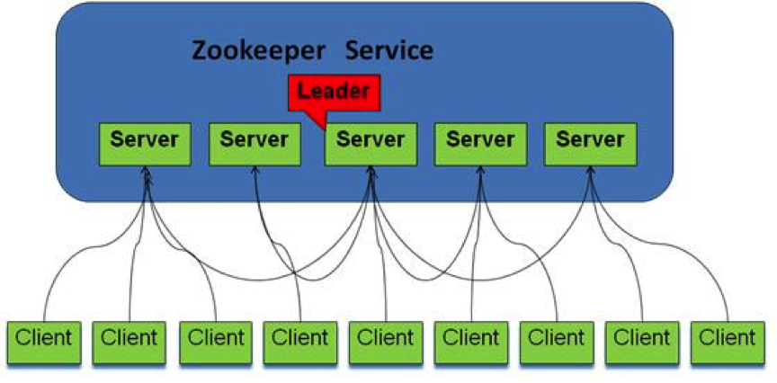
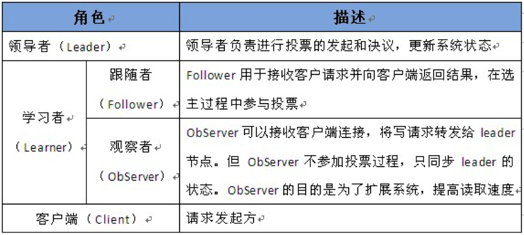
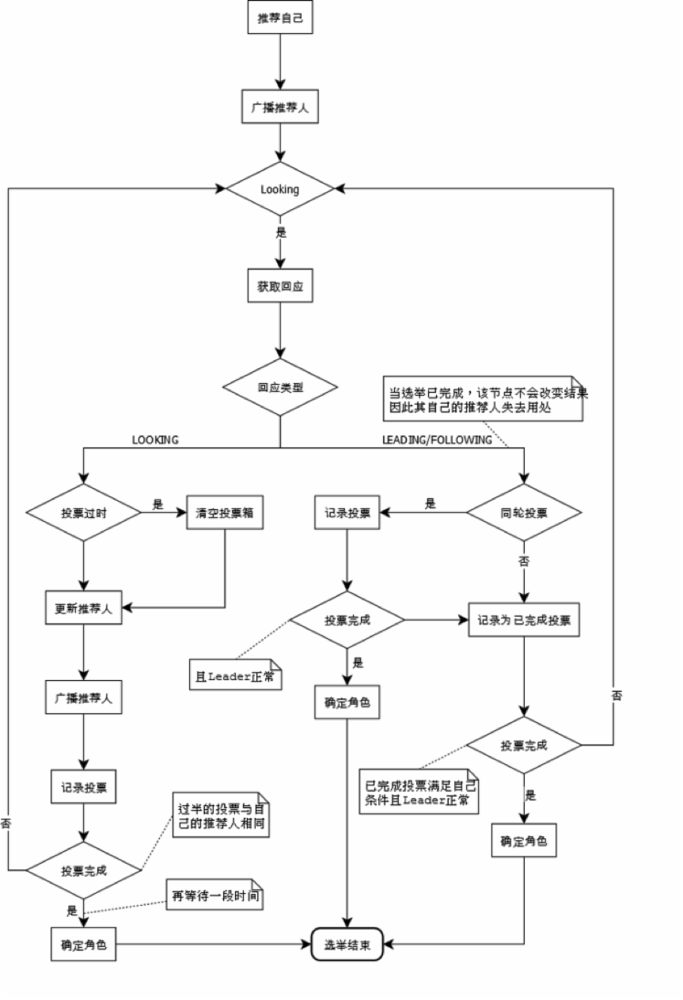
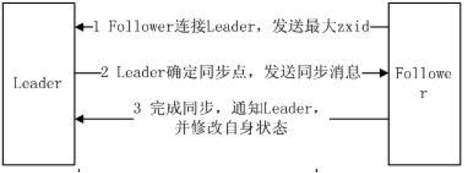
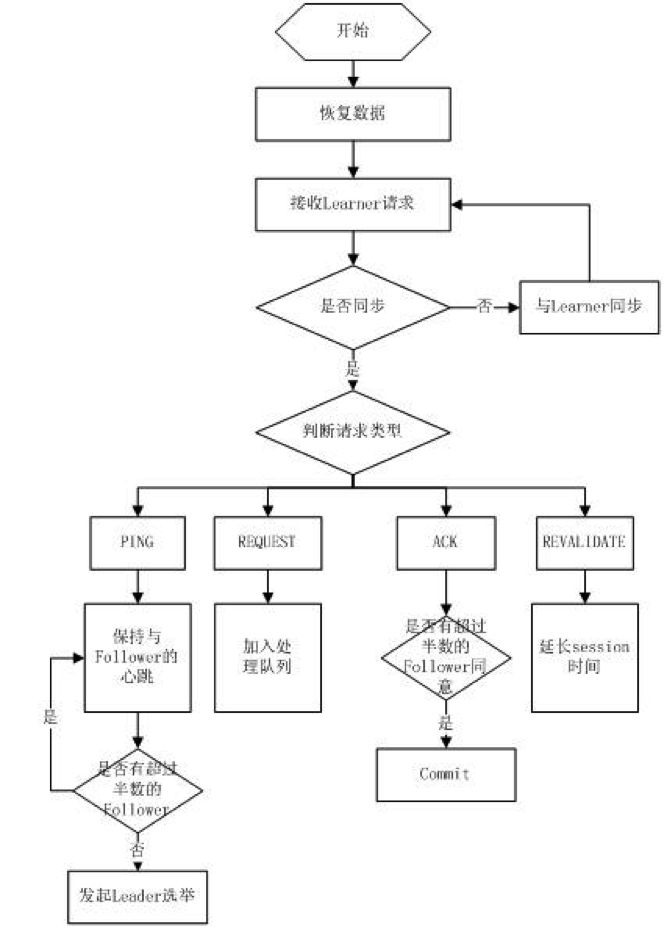
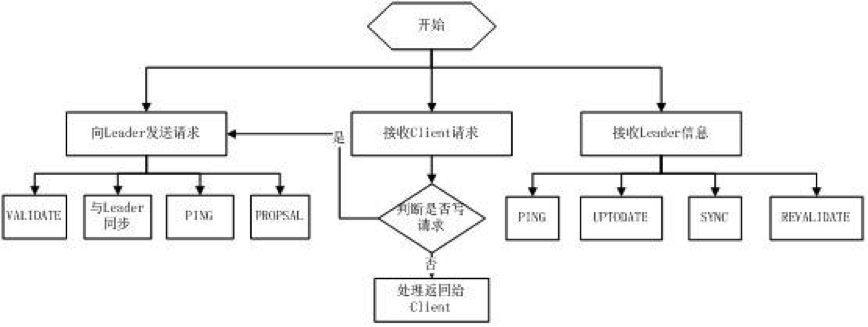

# 1、 系统架构

ZooKeeper集群是由多台机器组成的，每台机器都充当了特定的角色，各种角色在协作过程中履行自己的任务，从而对外提供稳定、可靠的服务。

由上图可知，ZooKeeper集群由多台机器组成（这不废话吗），客户端的请求有可能被分配给任何一台机器来处理。考虑下面一个场景：客户端A问机器1，现在几点了，机器1回答下午两点半；与此同时，客户端B问机器2，现在几点了，机器2说，凌晨三点。两个客户端一交流，发现路唇不对马嘴，整个世界就乱了。可见，ZooKeeper集群时刻需要保持内部统一，无论客户端连接那台机器，给出的响应应该保持一致。

为了保证数据的一致性，ZooKeeper对机器进行了角色划分：

在每台机器数据保持一致的情况下，ZooKeeper集群自然可以保证，对于每次查询都返回同样的结果。但是，如果客户端发起增、删、改这类会引起数据变动的请求呢？多台机器自说自话，你让往东，他让往西，你要打狗，他要撵鸡，听谁的？

正所谓，家有千口，主事一人。不管有多少台机器，只能有一台机器充当Leader的角色，只有Leader才有权力发起更改数据的操作，Follower如果接收到了更改数据的请求，需要转交给Leader来处理。

Leader接受到一个更改数据的请求后，会广播消息：

每个Follower请注意！现在颁布001号命令，对某个节点执行某项操作。收到请回答！

Follower按照Leader的要求执行完任务之后会，会发送一条消息：

老大老大，任务执行完毕！

一旦Leader收到了**半数以上**的Follower的确认消息，就判定该操作已生效，会再发一条广播：

每个Follower请注意！001号命令已生效！

以上只是简单描述了Leader与Follower的一种交互场景，其实还有很多问题需要解决，比如：

这个Leader是怎么来选？

Leader发出的消息怎么保证顺序？

Leader崩溃会怎么恢复？

……

# 2、 Zab协议

ZooKeeper服务的内部通信基于**Zab（ZooKeeper Atomic Broadcast）协议**，Zab是在**Paxos算法**基础上扩展改造而来的。

Zab协议有两种模式，它们分别是**恢复模式（选主）**和**广播模式（同步）**。

当服务启动或者在领导者崩溃后，Zab就进入了恢复模式，当领导者被选举出来，且大多数Server完成了和 Leader的状态同步以后，恢复模式就结束了。状态同步保证了Leader和Server具有相同的系统状态。

选举出Leader节点后Zab进入原子广播阶段，这时Leader为和自己同步的每个节点Follower创建一个操作序列，一个时期一个Follower只能和一个Leader保持同步，Leader节点与Follower节点使用心跳检测来感知对方的存在。当Leader节点在超时时间内收到来自Follower的心跳检测那Follower节点会一直与该节点保持连接，若超时时间内Leader没有接收到来自过半Follower节点的心跳检测或TCP连接断开，那Leader会结束当前周期的领导，切换到Looking状态，所有Follower节点也会放弃该Leader节点切换到Looking状态，然后开始新一轮选举。

每个Server在工作过程中有四种状态：

- LOOKING：当前Server不知道Leader是谁，正在搜寻
- LEADING：当前Server即为选举出来的Leader
- FOLLOWING：Leader已经选举出来，当前Server与之同步
- OBSERVING：observer的行为在大多数情况下与Follower完全一致，但是他们不参加选举和投票，而仅仅接受(observing)选举和投票的结果。

## 2.1 选举流程

当Leader崩溃或者Leader失去大多数的Follower，这时候ZooKeeper进入恢复模式，恢复模式需要重新选举出一个新的Leader，让所有的 Server都恢复到一个正确的状态。ZooKeeper的选举算法有两种：一种是基于basic paxos实现的，另外一种是基于fast paxos算法实现的。系统默认的选举算法为fast paxos。

fast paxos流程是在选举过程中，某Server首先向所有Server提议自己要成为Leader，当其它Server收到提议以后，解决epoch和 zxid的冲突，并接受对方的提议，然后向对方发送接受提议完成的消息，重复这个流程，最后一定能选举出Leader。

用文字描述就是：

（1）全天下我最牛，在我没有发现比我牛的推荐人的情况下，我就一直推举我当Leader。第一次投票那必须推举我自己当Leader。

（2）每当我接收到其它的被推举者，我都要回馈一个信息，表明我还是不是推举我自己。如果被推举者没我大，我就一直推举我当Leader，是我是我还是我！

（3）我有一个票箱， 和我属于同一轮的投票情况都在这个票箱里面。一人一票 重复的或者过期的票，我都不接受。

（4）一旦我不再推举我自己了（这时我发现别人推举的人比我推荐的更牛），我就把我的票箱清空，重新发起一轮投票（这时我的票箱一定有两票了，都是选的我认为最牛的人）。

（5）一旦我发现收到的推举信息中投票轮要高于我的投票轮，我也要清空我的票箱。并且还是投当初我觉得最牛的那个人（除非当前的人比我最初的推荐牛，我就顺带更新我的推荐）。

（6）不断的重复上面的过程，不断的告诉别人“我的投票是第几轮”、“我推举的人是谁”。直到我的票箱中“我推举的最牛的人”收到了不少于 N /2 + 1的推举投票。

（7）这时我就可以决定我是flower还是Leader了（如果至始至终都是我最牛，那我就是Leader咯，其它情况就是Follower咯）。并且不论随后收到谁的投票，都向它直接反馈“我的结果”。

其流程图如下所示：

## 2.2 同步流程

选完Leader以后，ZooKeeper就进入状态同步过程。

1、Leader等待server连接；

2、Follower连接Leader，将最大的zxid发送给Leader；

3、Leader根据Follower的zxid确定同步点；

4、完成同步后通知Follower 已经成为uptodate状态；

5、Follower收到uptodate消息后，又可以重新接受client的请求进行服务了。

流程图如下所示：

## 2.3 Leader工作流程

Leader主要有三个功能：

1、恢复数据；

2、维持与Learner的心跳，接收Learner请求并判断Learner的请求消息类型；

3、Learner的消息类型主要有**PING**消息、**REQUEST**消息、**ACK**消息、**REVALIDATE**消息，根据不同的消息类型，进行不同的处理。

- PING消息是指Learner的心跳信息；
- REQUEST消息是Follower发送的提议信息，包括写请求及同步请求；
- ACK消息是 Follower的对提议的回复，超过半数的Follower通过，则commit该提议；
- REVALIDATE消息是用来延长SESSION有效时间。

Leader的工作流程简图如下所示： 

## 2.4 Follower工作流程

Follower主要有四个功能：

1、向Leader发送请求（PING消息、REQUEST消息、ACK消息、REVALIDATE消息）；

2、接收Leader消息并进行处理；

3、接收Client的请求，如果为写请求，发送给Leader进行投票；

4、返回Client结果。

Follower的消息循环处理如下几种来自Leader的消息：

- **PING**消息： 心跳消息；
- **PROPOSAL**消息：Leader发起的提案，要求Follower投票；
- **COMMIT**消息：服务器端最新一次提案的信息；
- **UPTODATE**消息：表明同步完成；
- **REVALIDATE**消息：根据Leader的REVALIDATE结果，关闭待revalidate的session还是允许其接受消息；
- **SYNC**消息：返回SYNC结果到客户端，这个消息最初由客户端发起，用来强制得到最新的更新。

Follower的工作流程简图如下所示：

对于observer的流程不再叙述，observer流程和Follower的唯一不同的地方就是observer不会参加Leader发起的投票。

## 2.5 两段式提交

ZooKeeper集群是通过“**两段提交协议**”（a two-phase commit）来发起意向提议。

第一阶段：Leader给所有的Follower发送一个PROPOSAL消息，一个Follower接收到这次PROPOSAL消息，写到磁盘，发送给Leader一个ACK消息，告知已经收到。

第二阶段：当Leader收到法定人数（quorum）的Follower的ACK时候，发送commit消息执行。

为了保证事务的顺序一致性，ZooKeeper采用了递增的事务id号（zxid）来标识事务。所有的提议（Proposal）都在被提出的时候加上 了zxid。实现中zxid是一个64位的数字，它高32位是epoch用来标识Leader关系是否改变，每次一个Leader被选出来，它都会有一个 新的epoch，标识当前属于那个Leader的统治时期。低32位用于递增计数。

Zab协议保证：

（1）如果Leader以T1和T2的顺序广播，那么所有的Server必须先执行T1，再执行T2。

（2）如果任意一个Server以T1、T2的顺序commit执行，其他所有的Server也必须以T1、T2的顺序执行。

“两段提交协议”最大的问题是如果Leader发送了PROPOSAL消息后crash或暂时失去连接，会导致整个集群处在一种不确定的状态（Follower不知道该放弃这次提交还是执行提交）。ZooKeeper这时会选出新的Leader，请求处理也会移到新的Leader上，不同的Leader由不同的epoch标识。切换Leader时，需要解决下面两个问题：

（1）Never forget delivered messages

Leader在COMMIT投递到任何一台Follower之前crash，只有它自己commit了。新Leader必须保证这个事务也必须commit。

（2）Let go of messages that are skipped

Leader产生某个proposal，但是在crash之前，没有Follower看到这个proposal。该server恢复时，必须丢弃这个proposal。

# 3、 Paxos算法

Paxos是一个基于消息传递的一致性算法，Leslie Lamport在1990年提出，近几年被广泛应用于分布式计算中，Google的Chubby，Apache的ZooKeeper都是基于它的理论来实现的，Paxos还被认为是到目前为止唯一的分布式一致性算法，其它的算法都是Paxos的改进或简化。有个问题要提一下，Paxos有一个前提：没有拜占庭将军问题（即，在存在消息丢失的不可靠信道上试图通过消息传递的方式达到一致性是不可能的）。就是说Paxos只有在一个可信的计算环境中才能成立，这个环境是不会被入侵所破坏的。

Paxos描述了这样一个场景，有一个叫做Paxos的小岛(Island)上面住了一批居民，岛上面所有的事情由一些特殊的人决定，他们叫做议员(Senator)。议员的总数(Senator Count)是确定的，不能更改。岛上每次环境事务的变更都需要通过一个提议(Proposal)，每个提议都有一个编号(PID)，这个编号是一直增长的，不能倒退。每个提议都需要超过半数((Senator Count)/2 +1)的议员同意才能生效。每个议员只会同意大于当前编号的提议，包括已生效的和未生效的。如果议员收到小于等于当前编号的提议，他会拒绝，并告知对方：你的提议已经有人提过了。这里的当前编号是每个议员在自己记事本上面记录的编号，他不断更新这个编号。整个议会不能保证所有议员记事本上的编号总是相同的。现在议会有一个目标：保证所有的议员对于提议都能达成一致的看法。

好，现在议会开始运作，所有议员一开始记事本上面记录的编号都是0。有一个议员发了一个提议：将电费设定为1元/度。他首先看了一下记事本，嗯，当前提议编号是0，那么我的这个提议的编号就是1，于是他给所有议员发消息：1号提议，设定电费1元/度。其他议员收到消息以后查了一下记事本，哦，当前提议编号是0，这个提议可接受，于是他记录下这个提议并回复：我接受你的1号提议，同时他在记事本上记录：当前提议编号为1。发起提议的议员收到了超过半数的回复，立即给所有人发通知：1号提议生效！收到的议员会修改他的记事本，将1好提议由记录改成正式的法令，当有人问他电费为多少时，他会查看法令并告诉对方：1元/度。

现在看冲突的解决：假设总共有三个议员S1-S3，S1和S2同时发起了一个提议:1号提议，设定电费。S1想设为1元/度, S2想设为2元/度。结果S3先收到了S1的提议，于是他做了和前面同样的操作。紧接着他又收到了S2的提议，结果他一查记事本，咦，这个提议的编号小于等于我的当前编号1，于是他拒绝了这个提议：对不起，这个提议先前提过了。于是S2的提议被拒绝，S1正式发布了提议: 1号提议生效。S2向S1或者S3打听并更新了1号法令的内容，然后他可以选择继续发起2号提议。

好，我觉得Paxos的精华就这么多内容。现在让我们来对号入座，看看在ZooKeeper Server里面Paxos是如何得以贯彻实施的。

- 小岛(Island)—— ZooKeeper Server Cluster
- 议员(Senator)—— ZooKeeper Server
- 提议(Proposal)——ZNode Change(Create/Delete/SetData…)
- 提议编号(PID)——Zxid(ZooKeeper Transaction Id)
- 正式法令——所有ZNode及其数据

貌似关键的概念都能一一对应上，但是等一下，Paxos岛上的议员应该是人人平等的吧，而ZooKeeper Server好像有一个Leader的概念。没错，其实Leader的概念也应该属于Paxos范畴的。如果议员人人平等，在某种情况下会由于提议的冲突而产生一个“活锁”（所谓活锁我的理解是大家都没有死，都在动，但是一直解决不了冲突问题）。Paxos的作者Lamport在他的文章”The Part-Time Parliament“中阐述了这个问题并给出了解决方案——在所有议员中设立一个总统，只有总统有权发出提议，如果议员有自己的提议，必须发给总统并由总统来提出。好，我们又多了一个角色：总统。

- 总统——ZooKeeper Server Leader

现在我们假设总统已经选好了，下面看看ZooKeeper Server是怎么实施的。

情况一：

屁民甲(Client)到某个议员(ZooKeeper Server)那里询问(Get)某条法令的情况(ZNode的数据)，议员毫不犹豫的拿出他的记事本(local storage)，查阅法令并告诉他结果，同时声明：我的数据不一定是最新的。你想要最新的数据？没问题，等着，等我找总统Sync一下再告诉你。

情况二：

屁民乙(Client)到某个议员(ZooKeeper Server)那里要求政府归还欠他的一万元钱，议员让他在办公室等着，自己将问题反映给了总统，总统询问所有议员的意见，多数议员表示欠屁民的钱一定要还，于是总统发表声明，从国库中拿出一万元还债，国库总资产由100万变成99万。屁民乙拿到钱回去了(Client函数返回)。

情况三：

总统突然挂了，议员接二连三的发现联系不上总统，于是各自发表声明，推选新的总统，总统大选期间政府停业，拒绝屁民的请求。

当然还有很多其他的情况，但这些情况总是能在Paxos的算法中找到原型并加以解决。这也正是我们认为Paxos是ZooKeeper的灵魂的原因。当然ZooKeeper Server还有很多属于自己特性的东西：Session, Watcher，Version等等等等，需要我们花更多的时间去研究和学习。