# 1、 配置文件

ZooKeeper安装好之后，在安装目录的conf文件夹下可以找到一个名为“zoo_sample.cfg”的文件，是ZooKeeper配置文件的模板。

ZooKeeper启动时，会默认加载“conf/zoo.cfg”作为配置文件，所以需要将“zoo_sample.cfg”复制一份，命名为“zoo.cfg”，然后根据需要设定里面的配置项。

配置项很简单，说明如下：

> tickTime=2000

这个时间是作为 ZooKeeper 服务器之间或客户端与服务器之间维持心跳的时间间隔，也就是每个 tickTime 时间就会发送一个心跳。单位为毫秒。

> initLimit=10

这个配置项是用来配置 Leader接受Follower 初始化连接时最长能忍受多少个心跳时间间隔数。当已经超过 10 个心跳的时间（也就是 tickTime）长度后 Leader还没有收到Follower的返回信息，那么表明这个Follower连接失败。总的时间长度就是 5*2000=10 秒。

> syncLimit=5

这个配置项标识 Leader 与 Follower 之间发送消息，请求和应答时间长度，最长不能超过多少个 tickTime 的时间长度，总的时间长度就是5*2000=10 秒。

> dataDir=/tmp/zookeeper

顾名思义就是 ZooKeeper 保存数据的目录，用于存放内存数据库快照的文件夹，同时用于集群的myid文件也存在这个文件夹里。默认情况下，ZooKeeper 将写数据的日志文件也保存在这个目录里。注意：一个配置文件只能包含一个dataDir字样，即使它被注释掉了。 

> clientPort=2181

这个端口就是客户端连接 ZooKeeper 服务器的端口，ZooKeeper 会监听这个端口，接受客户端的访问请求。

> maxClientCnxns=60

最大的客户端连接数，默认为60.

> autopurge.snapRetainCount=3
>
> autopurge.purgeInterval=1

客户端在与ZooKeeper交互过程中会产生非常多的日志，而且ZooKeeper也会将内存中的数据作为snapshot保存下来，这些数据是不会被自动删除的，这样磁盘中这样的数据就会越来越多。不过可以通过这两个参数来设置，让zookeeper自动删除数据。autopurge.purgeInterval就是设置多少小时清理一次。而autopurge.snapRetainCount是设置保留多少个snapshot，之前的则删除。

# 2、 服务端命令

“zkServer.sh”脚本用于执行Zookeeper的启动、停止及状态查看等操作

利用“zkServer.sh help”命令，可以查看支持的参数：

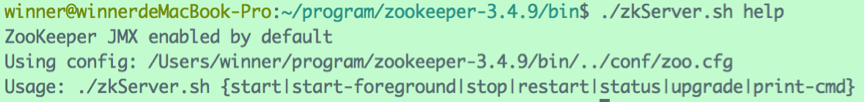

可见，“zkServer.sh”可以附带的参数有：

- start：用于启动服务端
- stop：用于停止服务端
- restart：用于重启服务端
- status：用于查看服务端状态

以及用于前台启动、更新等操作的其他参数。

例如，使用命令`zkServer.sh start`启动ZooKeeper服务端，该命令后面可以附带参数，用于指定配置文件的路径，比如`zkServer.sh start ../conf/ZooKeeper.cfg`,代表使用ZooKeeper.cfg作为配置文件，如果不指定路径，默认加载“conf/zoo.cfg”文件：

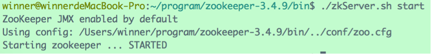

使用`zkServer.sh stop`停止服务端：

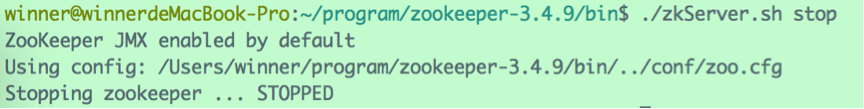

# 3、 客户端命令

使用命令`**zkCli.sh -server 127.0.0.1:2181`可以连接到IP为“127.0.0.1”，端口为“2181”的ZooKeeper服务器。如果连接本机的2181端口，则后面的参数可以省略。如：

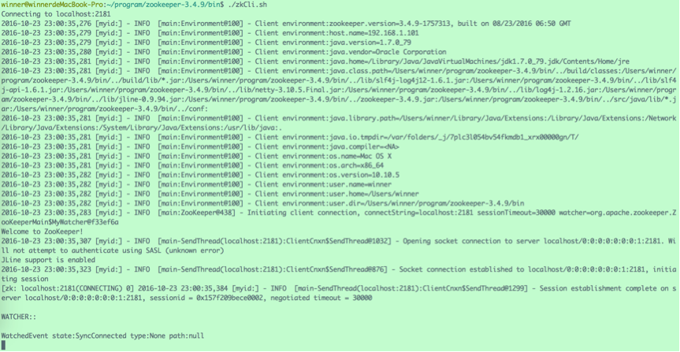

此时，输入`help`可以查看命令参数：

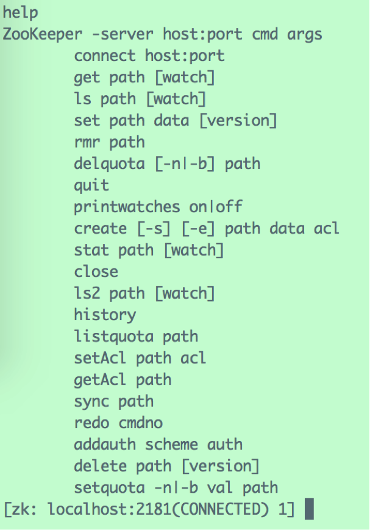

## 3.1 查看节点列表

在前面已经提到过，ZooKeeper维护者一个树形的数据结构，根节点为“/”。

`ls path`用于查看路径path下的所有直接子节点：

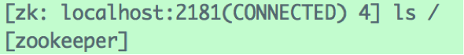

可见，系统初始化的时候，根节点下会自动创建一个名为“zookeeper”的节点，用于存储ZooKeeper的管理信息。所以用户不能再根节点下创建同名的子节点。

## 3.2 创建新节点

`create path data`用于在path路径下创建一个新节点，携带数据data。

例如，在根节点下新建一个名为“firstNode”节点，存储的数据为“HelloWorld”：

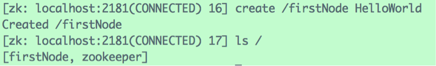

## 3.3 查看节点数据

`get path`用于获取path节点下的数据，例如：

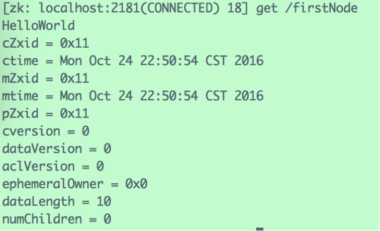

除了返回节点存储的数据之外，还有一系列的元信息，如代表节点创建时间的“cZxid”、“ctime”（两种表示方法）；节点的修改时间“mZxid”、“mtime”等。

## 3.4 修改节点数据

`set path data`用于将path节点下的数据更改为data。

如，将“/firstNode”下的数据更改为“WorldHello”：

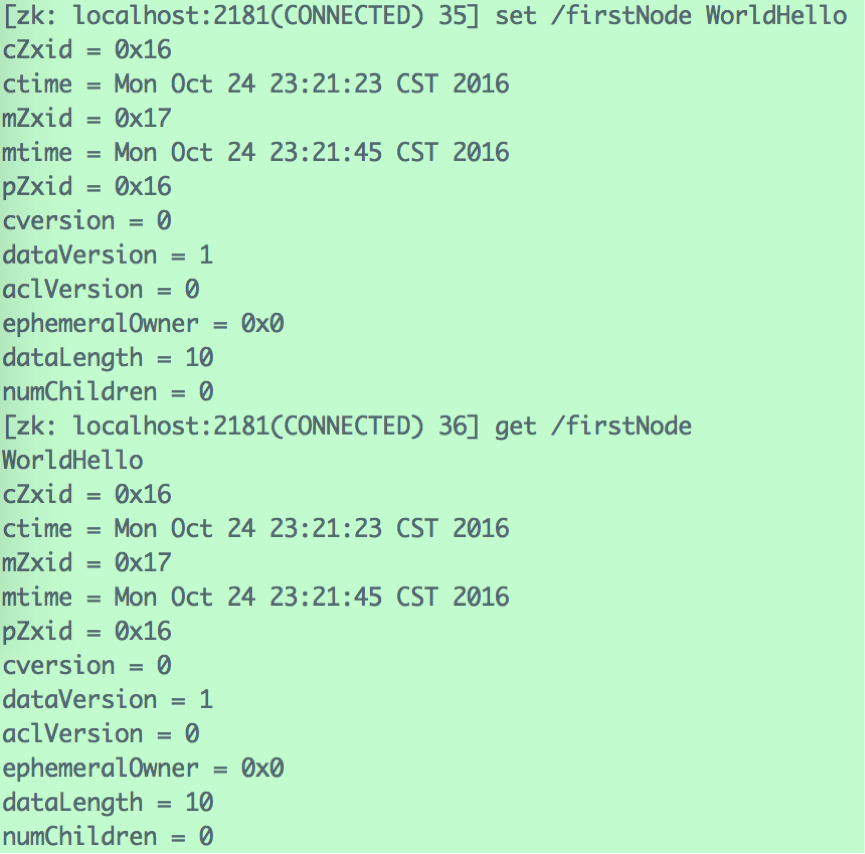

## 3.5 删除节点

`delete path`用于删除path节点。

如，删除“/firstNode”节点：

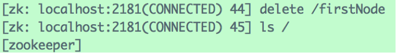 

此外，还有用于设置节点ACL、查看节点状态等其他命令，需要时可以查阅相关手册。

# 4、 ZooKeeper四字命令

ZooKeeper 支持某些特定的四字命令字母与其的交互。它们大多是查询命令，用来获取 ZooKeeper 服务的当前状态及相关信息。用户在客户端可以通过 telnet 或 nc 向 ZooKeeper 提交相应的命令。

| **ZooKeeper四字命令** | **功能描述**                                                 |
| --------------------- | ------------------------------------------------------------ |
| **conf**              | 输出相关服务配置的详细信息                                   |
| **cons**              | 列出所有连接到服务器的客户端的完全的连接 / 会话的详细信息。包括“接受 /  发送”的包数量、会话 id 、操作延迟、最后的操作执行等等信息 |
| **dump**              | 列出未经处理的会话和临时节点                                 |
| **envi**              | 输出关于服务环境的详细信息（区别于 conf 命令）               |
| **reqs**              | 列出未经处理的请求                                           |
| **ruok**              | 测试服务是否处于正确状态。如果确实如此，那么服务返回“ imok ”，否则不做任何相应 |
| **stat**              | 输出关于性能和连接的客户端的列表                             |
| **wchs**              | 列出服务器 watch 的详细信息                                  |
| **wchc**              | 通过 session 列出服务器 watch 的详细信息，它的输出是一个与 watch 相关的会话的列表 |
| **wchp**              | 通过路径列出服务器 watch 的详细信息。它输出一个与 session 相关的路径 |

例如，查看配置信息：

`echo conf | nc 127.0.0.1 2181`

nc为“NetCat”工具提供的命令，通常的Linux发行版中都带有NetCat。NetCat在网络工具中有“瑞士军刀”美誉，被设计为一个简单、可靠的网络工具，可通过TCP或UDP协议传输读写数据。

该命令的意思为，将“conf”命令传递给127.0.0.1的2181端口（即本机的ZooKeeper服务端口），并将响应打印出来：

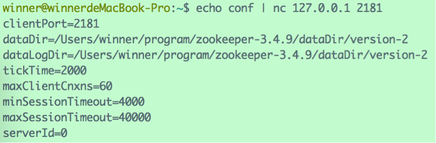