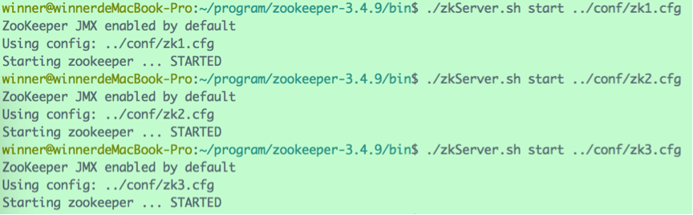
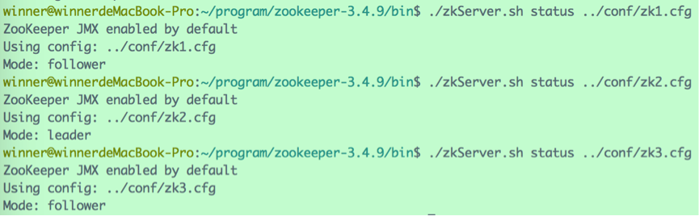
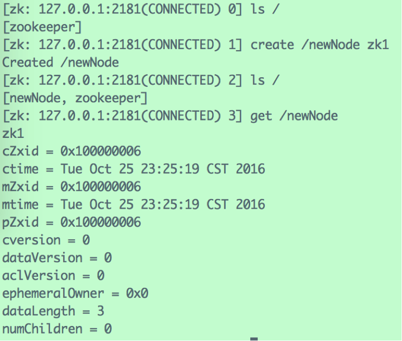
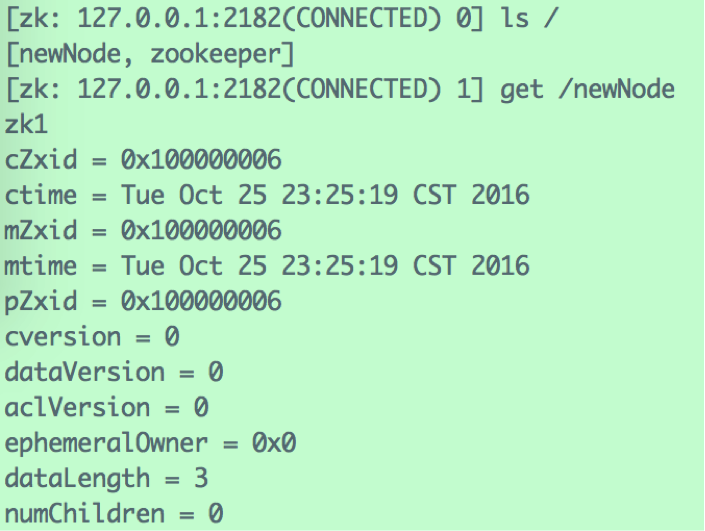
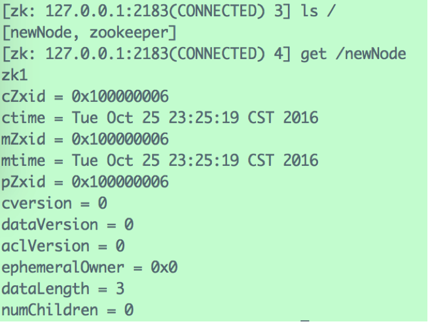
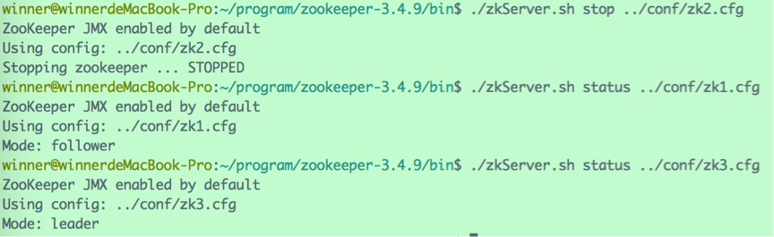
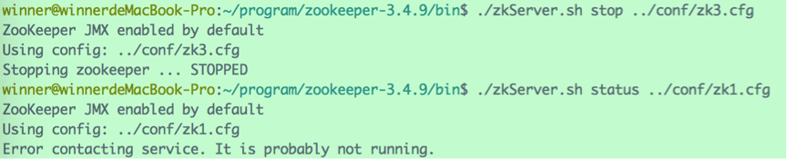

在一台机器上运营一个ZooKeeper实例，称之为单机（Standalone）模式。单机模式有个致命的缺陷，一旦唯一的实例挂了，依赖ZooKeeper的应用全得完蛋。

实际应用当中，一般都是采用集群模式来部署ZooKeeper，**集群中的Server为奇数**（2N+1）。只要集群中的多数（大于N+1台）Server活着，集群就能对外提供服务。

在每台机器上部署一个ZooKeeper实例，多台机器组成集群，称之为**完全分布式集群**。此外，还可以在仅有的一台机器上部署多个ZooKeeper实例，以**伪集群模式**运行。

# 1、 集群配置

下面我们来建一个3个实例的zookeeper伪分布式集群。

首先，需要为三个实例创建不同的配置文件：

zk1.cfg的配置项如下：

> tickTime=2000
>
> initLimit=10
>
> syncLimit=5
>
> dataDir=/zk1/dataDir
>
> clientPort=2181
>
> server.1=127.0.0.1:2888:3888
>
> server.2=127.0.0.1:2889:3889
>
> server.3=127.0.0.1:2890:3890

 

zk2.cfg的配置项如下：

> tickTime=2000
>
> initLimit=10
>
> syncLimit=5
>
> dataDir=/zk2/dataDir
>
> clientPort=2182
>
> server.1=127.0.0.1:2888:3888
>
> server.2=127.0.0.1:2889:3889
>
> server.3=127.0.0.1:2890:3890

 

zk3.cfg的配置项如下：

> tickTime=2000
>
> initLimit=10
>
> syncLimit=5
>
> dataDir=/zk3/dataDir
>
> clientPort=2183
>
> server.1=127.0.0.1:2888:3888
>
> server.2=127.0.0.1:2889:3889
>
> server.3=127.0.0.1:2890:3890
>
>  

因为部署在同一台机器上，所以每个实例的dataDir、clientPort要做区分，其余配置保持一致。

需要注意的是，集群中所有的实例作为一个整体对外提供服务，集群中每个实例之间都互相连接，所以，每个配置文件中都要列出所有实例的映射关系。

在每个配置文件的末尾，有几行“server.A=B：C：D”这样的配置，其中， A 是一个数字，表示这个是第几号服务器；B 是这个服务器的 ip 地址；C 表示的是这个服务器与集群中的 Leader 服务器交换信息的端口；D 表示的是万一集群中的 Leader 服务器挂了，需要一个端口来重新进行选举，选出一个新的 Leader，而这个端口就是用来执行选举时服务器相互通信的端口。如果是伪集群的配置方式，由于 B 都是一样，所以不同的 Zookeeper 实例通信端口号不能一样，所以要给它们分配不同的端口号。

除了修改 zoo.cfg 配置文件，集群模式下还要配置一个**myid文件**，这个文件在 dataDir 目录下，文件里只有一个数据，就是 A 的值，Zookeeper 启动时会读取这个文件，拿到里面的数据与配置信息比较从而判断到底是那个 Server。

上例中，需要在每个实例各自的dataDir目录下，新建myid文件，分别填写“1”、“2”、“3”。

# 2、 集群启动

依次启动三个实例：

查看Server状态：

可见，现在的集群中，zk2充当着Leader角色，而zk1与zk3充当着Follower角色。

使用三个客户端连接三个Server，在zk1的客户端下，新增“/newNode”节点，储存数据“zk1”：

在zk2的客户端与查看该节点：

在zk3的客户端与查看该节点：

可见，集群中的Server保持着数据同步。

# 3、 集群容灾

如果我们把身为Leader的zk2关闭，会发生什么呢？

可见，集群自动完成了切换，zk3变成了Leader。实际应用中，如果集群中的Leader宕机了，或者Leader与超过半数的Follower失去联系，都会触发ZooKeeper的选举流程，选举出新的Leader之后继续对外服务。

如果我们再把zk3关闭，会发生什么呢？

可见，关闭zk3以后，由于集群中的可用Server只剩下一台（达不到集群总数的半数以上），集群将处于不可用的状态。

