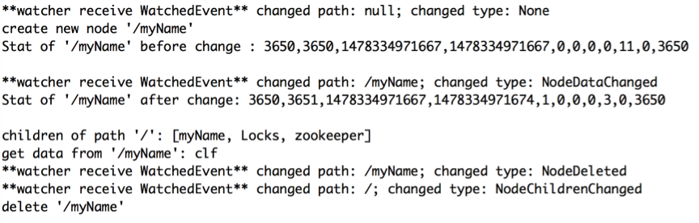
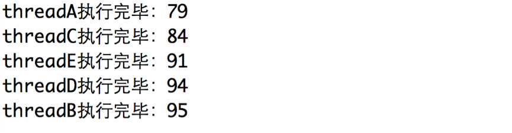
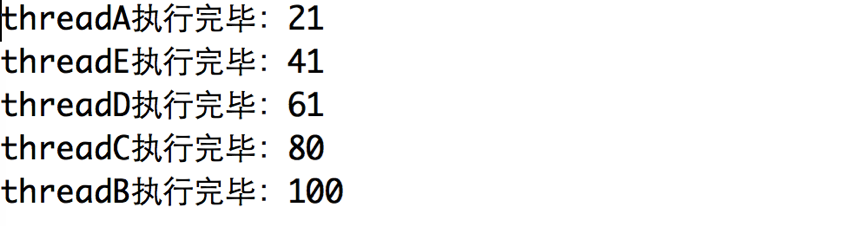
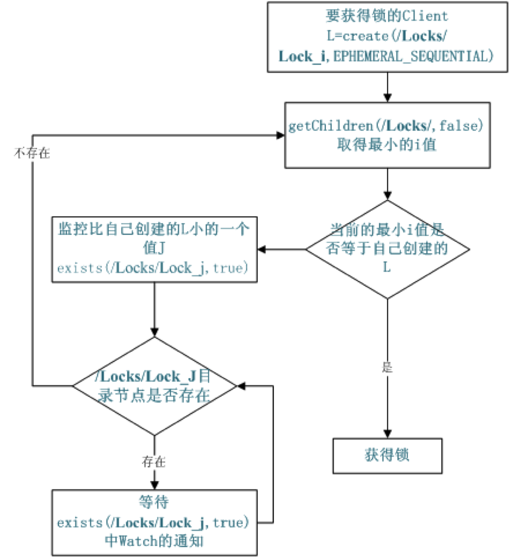
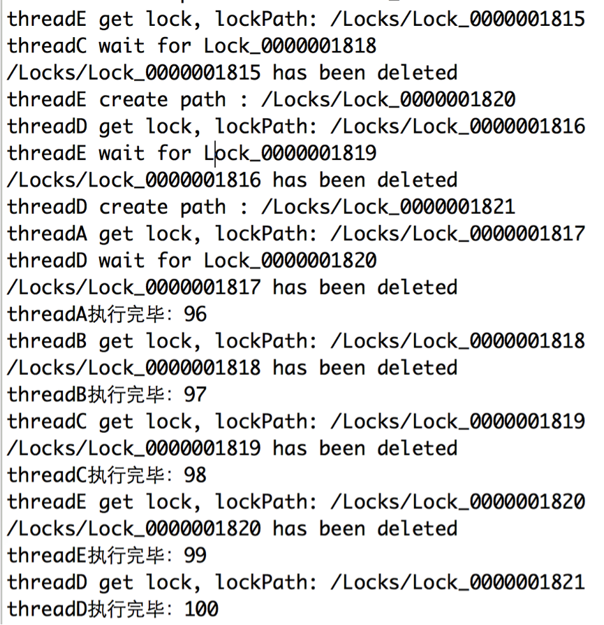
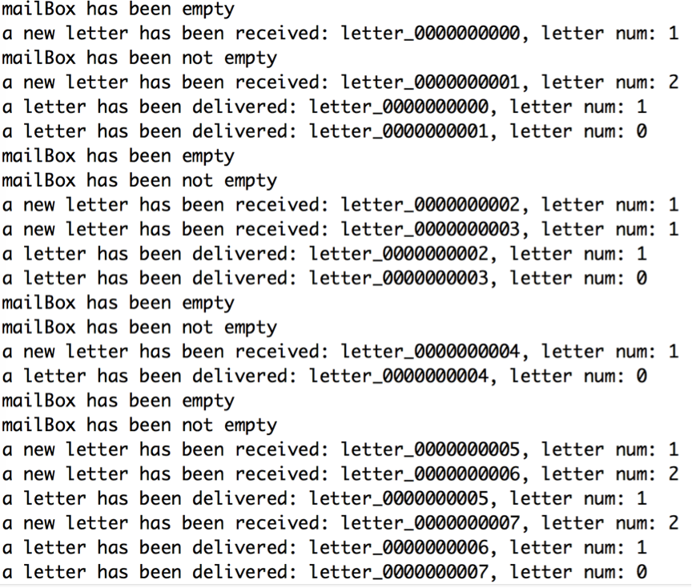

# 1、 Java API

客户端要连接 Zookeeper 服务器可以通过创建 **org.apache.zookeeper. ZooKeeper** 的一个实例对象，然后调用这个类提供的接口来和服务器交互。

ZooKeeper 主要是用来维护和监控一个目录节点树中存储的数据的状态，所有我们能够操作 ZooKeeper 和操作目录节点树大体一样，如创建一个目录节点，给某个目录节点设置数据，获取某个目录节点的所有子目录节点，给某个目录节点设置权限和监控这个目录节点的状态变化。

下面通过代码实例，来熟悉一下Java API的常用方法。

 ```java
public class ZkTest {
	private static final String CONNECT_STRING = "127.0.0.1:2181";
	private static final int SESSION_TIMEOUT = 3000;

	public static void main( String[] args ) throws Exception
	{
		/* 定义一个监控所有节点变化的Watcher */
		Watcher allChangeWatcher = new Watcher()
		{
			@Override

			public void process( WatchedEvent event )
			{
				System.out.println( "**watcher receive WatchedEvent** changed path: " + event.getPath()
						    \ + "; changed type: " + event.getType().name() );
			}
		};

    /* 初始化一个与ZK连接。三个参数： */
    /* 1、要连接的服务器地址，"IP:port"格式； */
    /* 2、会话超时时间 */
    /* 3、节点变化监视器 */
		ZooKeeper zk = new ZooKeeper( CONNECT_STRING, SESSION_TIMEOUT, allChangeWatcher );
		
    /* 新建节点。四个参数：1、节点路径；2、节点数据；3、节点权限；4、创建模式 */
		zk.create( "/myName", "chenlongfei".getBytes(), Ids.OPEN_ACL_UNSAFE, CreateMode.PERSISTENT );
		System.out.println( "create new node '/myName'" );

		/* 判断某路径是否存在。两个参数：1、节点路径；2、是否监控（Watcher即初始化ZooKeeper时传入的Watcher） */
		Stat beforSstat = zk.exists( "/myName", true );
		System.out.println( "Stat of '/myName' before change : " + beforSstat.toString() );

		/* 修改节点数据。三个参数：1、节点路径；2、新数据；3、版本，如果为-1，则匹配任何版本 */
		Stat afterStat = zk.setData( "/myName", "clf".getBytes(), -1 );
		System.out.println( "Stat of '/myName' after change: " + afterStat.toString() );

		/* 获取所有子节点。两个参数：1、节点路径；2、是否监控该节点 */
		List<String> children = zk.getChildren( "/", true );
		System.out.println( "children of path '/': " + children.toString() );

		/* 获取节点数据。三个参数：1、节点路径；2、书否监控该节点；3、版本等信息可以通过一个Stat对象来指定 */
		byte[] nameByte = zk.getData( "/myName", true, null );
		String name = new String( nameByte, "UTF-8" );
		System.out.println( "get data from '/myName': " + name );

		/* 删除节点。两个参数：1、节点路径；2、 版本，-1可以匹配任何版本，会删除所有数据 */
		zk.delete( "/myName", -1 );
		System.out.println( "delete '/myName'" );
		zk.close();
	}
}
 ```


运行程序，打印结果如下：



更详细的API请参考官方网站。

Zookeeper 从设计模式角度来看，是一个基于观察者模式设计的分布式服务管理框架，它负责存储和管理大家都关心的数据，然后接受观察者的注册，一旦这些数据的状态发生变化，Zookeeper 将负责通知已经在 Zookeeper 上注册的那些观察者做出相应的反应。

下面通过两个ZooKeeper的典型用用场景来体会下ZooKeeper的特性与使用方法。

# 2、 分布式锁

先来回顾一下多线程中的锁控制。

 ```java
public class MultiThreadTest {
	/* 以一个静态变量来模拟公共资源 */
	private static int counter = 0;


	/* 多线程环境下，会出现并发问题 */
	public static void plus()
	{
		/* 计数器加一 */
		counter++;

		/* 线程随机休眠数毫秒，模拟现实中的耗时操作 */
		int sleepMillis = (int) (Math.random() * 100);

		try {
			Thread.sleep( sleepMillis );
		} catch ( InterruptedException e ) {
			e.printStackTrace();
		}
	}


	/* 线程实现类 */
	static class CountPlus extends Thread {
		@Override

		public void run()
		{
			for ( int i = 0; i < 20; i++ )
			{
				plus();
			}

			System.out.println( Thread.currentThread().getName() + "执行完毕：" + counter );
		}

		public CountPlus( String threadName )
		{
			super(threadName);
		}
	}

	public static void main( String[] args ) throws Exception
	{
		/* 开启五个线程 */
		CountPlus threadA = new CountPlus( "threadA" );
		threadA.start();

		CountPlus threadB = new CountPlus( "threadB" );
		threadB.start();

		CountPlus threadC = new CountPlus( "threadC" );
		threadC.start();

		CountPlus threadD = new CountPlus( "threadD" );
		threadD.start();

		CountPlus threadE = new CountPlus( "threadE" );
		threadE.start();
	}
}
 ```


上例中，开启了五个线程，每个线程通过plus()方法对静态变量counter分别进行20次累加，预期counter最后会变成100。运行程序：



可以发现，五个线程执行完毕之后，counter并没有变成100。plus()方法涉及到对公共资源的改动，但是并没有对它进行同步控制，可能会造成多个线程同时对公共资源发起改动，进而出现并发问题。问题的根源在于，上例中没有保证同一时刻只能有一个线程可以改动公共资源。

给plus()方法加上**synchronized**关键字，重新运行程序：



可见，最终达到了预期结果。

synchronized关键字的作用是对plus()方法加入锁控制，一个线程想要执行该方法，首先需要获得锁（锁是唯一的），执行完毕后，再释放锁。如果得不到锁，该线程会进入等待池中等待，直到抢到锁才能继续执行。这样就保证了同一时刻只能有一个线程可以改动公共资源，避免了并发问题。

共享锁在同一个进程中很容易实现，可以靠Java本身提供的同步机制解决，但是在跨进程或者在不同 Server 之间就不好实现了，这时候就需要一个中间人来协调多个Server之间的各种问题，比如如何获得锁/释放锁、谁先获得锁、谁后获得锁等。

借助Zookeeper 可以实现这种分布式锁：需要获得锁的 Server 创建一个 **EPHEMERAL_SEQUENTIAL** 目录节点，然后调用 getChildren()方法获取列表中最小的目录节点，如果最小节点就是自己创建的目录节点，那么它就获得了这个锁，如果不是那么它就调用 exists() 方法并监控前一节点的变化，一直到自己创建的节点成为列表中最小编号的目录节点，从而获得锁。释放锁很简单，只要删除它自己所创建的目录节点就行了。

流程图如下：



 

下面我们对刚才的代码进行改造，不用synchronize关键字而是使用ZooKeeper达到锁控制的目的，模拟分布式锁的实现。

```java
public class ZkDistributedLock {
	/* 以一个静态变量来模拟公共资源 */
	private static int counter = 0;

	public static void plus()
	{
		/* 计数器加一 */
		counter++;

		/* 线程随机休眠数毫秒，模拟现实中的费时操作 */
		int sleepMillis = (int) (Math.random() * 100);
		try {
			Thread.sleep( sleepMillis );
		} catch ( InterruptedException e ) {
			e.printStackTrace();
		}
	}

	/* 线程实现类 */
	static class CountPlus extends Thread {
		private static final String LOCK_ROOT_PATH = "/Locks";
		private static final String LOCK_NODE_NAME = "Lock_";

		/* 每个线程持有一个zk客户端，负责获取锁与释放锁 */
		ZooKeeper zkClient;

		@Override

		public void run()
		{
			for ( int i = 0; i < 20; i++ )
			{
				/* 访问计数器之前需要先获取锁 */
				String path = getLock();

				/* 执行任务 */
				plus();

				/* 执行完任务后释放锁 */
				releaseLock( path );
			}

			closeZkClient();
			System.out.println( Thread.currentThread().getName() + "执行完毕：" + counter );
		}

		/**
		 * 获取锁，即创建子节点，当该节点成为序号最小的节点时则获取锁
		 */
		private String getLock()
		{
			try {
				/* 创建EPHEMERAL_SEQUENTIAL类型节点 */
				String lockPath = zkClient.create( LOCK_ROOT_PATH + "/" + LOCK_NODE_NAME,

								   Thread.currentThread().getName().getBytes(), Ids.OPEN_ACL_UNSAFE,

								   CreateMode.EPHEMERAL_SEQUENTIAL );

				System.out.println( Thread.currentThread().getName() + " create path : " + lockPath );

				/* 尝试获取锁 */
				tryLock( lockPath );

				return(lockPath);
			} catch ( Exception e ) {
				e.printStackTrace();
			}
			return(null);
		}

		/**
		 * 该函数是一个递归函数 如果获得锁，直接返回；否则，阻塞线程，等待上一个节点释放锁的消息，然后重新tryLock
		 */
		private boolean tryLock( String lockPath ) throws KeeperException, InterruptedException
		{
			/* 获取LOCK_ROOT_PATH下所有的子节点，并按照节点序号排序 */
			List<String> lockPaths = zkClient.getChildren( LOCK_ROOT_PATH, false );
			Collections.sort( lockPaths );

			int index = lockPaths.indexOf( lockPath.substring( LOCK_ROOT_PATH.length() + 1 ) );
			if ( index == 0 )       
      /* lockPath是序号最小的节点，则获取锁 */
			{
				System.out.println( Thread.currentThread().getName() + " get lock, lockPath: " + lockPath );

				return(true);
			} else {              
        /* lockPath不是序号最小的节点 */
				/* 创建Watcher，监控lockPath的前一个节点 */
				Watcher watcher = new Watcher()
				{
					@Override

					public void process( WatchedEvent event )
					{
						System.out.println( event.getPath() + " has been deleted" );

						synchronized (this) {
							notifyAll();
						}
					}
				};

				String preLockPath = lockPaths.get( index - 1 );
				Stat stat = zkClient.exists( LOCK_ROOT_PATH + "/" + preLockPath, watcher );

				if ( stat == null )     
          /* 由于某种原因，前一个节点不存在了（比如连接断开），重新tryLock */
				{
					return(tryLock( lockPath ) );
				} else {                
          /* 阻塞当前进程，直到preLockPath释放锁，重新tryLock */
					System.out.println( Thread.currentThread().getName() + " wait for " + preLockPath );

					synchronized (watcher) {
						watcher.wait();
					}

					return(tryLock( lockPath ) );
				}
			}
		}

		/**
		 * 释放锁，即删除lockPath节点
		 */
		private void releaseLock( String lockPath )
		{
			try {
				zkClient.delete( lockPath, -1 );
			} catch ( InterruptedException | KeeperException e ) {
				e.printStackTrace();
			}
		}

		public void setZkClient( ZooKeeper zkClient )
		{
			this.zkClient = zkClient;
		}

		public void closeZkClient()
		{
			try {
				zkClient.close();
			} catch ( InterruptedException e ) {
				e.printStackTrace();
			}
		}

		public CountPlus( String threadName )
		{
			super(threadName);
		}
	}

	public static void main( String[] args ) throws Exception
	{
		/* 开启五个线程 */
		CountPlus threadA = new CountPlus( "threadA" );
		setZkClient( threadA );
		threadA.start();

		CountPlus threadB = new CountPlus( "threadB" );
		setZkClient( threadB );
		threadB.start();

		CountPlus threadC = new CountPlus( "threadC" );
		setZkClient( threadC );
		threadC.start();

		CountPlus threadD = new CountPlus( "threadD" );
		setZkClient( threadD );
		threadD.start();

		CountPlus threadE = new CountPlus( "threadE" );
		setZkClient( threadE );
		threadE.start();
	}

	public static void setZkClient( CountPlus thread ) throws Exception
	{
		ZooKeeper zkClient = new ZooKeeper( "127.0.0.1:2181", 3000, null );
		thread.setZkClient( zkClient );
	}
}
```

运行程序之前需要创建“/Locks”作为存放锁信息的根节点。

一旦某个Server想要获得锁，就会在/Locks”下创建一个**EPHEMERAL_SEQUENTIAL**类型的名为“Lock_”子节点，ZooKeeper会自动为每个子节点附加一个**递增的**编号，该编号为int类型，长度为10，左端以0补全。“/Locks”下会维持着这样一系列的节点：

`Lock_0000000001, Lock_0000000002, Lock_0000000003, Lock_0000000004…`

一旦这些创建这些节点的Server断开连接，该节点就会被清除（当然也可以主动清除）。

由于节点的编号是递增的，创建越晚排名越靠后。遵循先到先得的原则，Server创建完节点之后会检查自己的节点是不是最小的，如果是，那就获得锁，如果不是，排队等待。执行完任务之后，Server清除自己创建的节点，这样后面的节点会依次获得锁。

程序的运行结果如下：



# 3、 分布式队列

很多单机上很平常的事情，放在集群环境中都会发生质的变化。

以一个常见的生产者-消费者模型举例：有一个容量有限的邮筒，寄信者（即生产者）不断地将信件塞入邮筒，邮递员（即消费者）不断地从邮筒取出信件发往目的地。运行期间需要保证：

（1）邮筒已达上限时，寄信者停止活动，等带邮筒恢复到非满状态

（2）邮筒已空时，邮递员停止活动，等带邮筒恢复到非空状态

该邮筒用有序队列实现，保证FIFO（先进先出）特性。

在一台机器上，可以用有序队列来实现邮筒，保证FIFO（先进先出）特性，开启两个线程，一个充当寄信者，一个充当邮递员，通过wait()/notify()很容易实现上述功能。

但是，如果在跨进程或者分布式环境下呢？比如，一台机器运行生产者程序，另一台机器运行消费者程序，代表邮筒的有序队列无法跨机器共享，但是两者需要随时了解邮筒的状态（是否已满、是否已空）以及保证信件的有序（先到达的先发送）。

这种情况下，可以借助ZooKeeper实现一个分布式队列。新建一个“/mailBox”节点代表邮筒。一旦有信件到达，就在该节点下创建**PERSISTENT_SEQUENTIAL**类型的子节点，当子节点总数达到上限时，阻塞生产者，然后使用getChildren(String path, Watcher watcher)方法监控子节点的变化，子节点总数减少后再回复生产；而消费者每次选取序号最小的子节点进行处理，然后删除该节点，当子节点总数为0时，阻塞消费者，同样设置监控，子节点总数增加后再回复消费。

代码如下：

```java
public class ZkDistributedQueue {
	/* 邮箱上限为10封信 */
	private static final int MAILBOX_MAX_SIZE = 10;

	/* 邮箱路径 */
	private static final String MAILBOX_ROOT_PATH = "/mailBox";

	/* 信件节点 */
	private static final String LETTER_NODE_NAME = "letter_";

	/* 生产者线程，负责接受信件 */
	static class Producer extends Thread {
		ZooKeeper zkClient;

		@Override
		public void run()
		{
			while ( true )
			{
				try {
					if ( getLetterNum() == MAILBOX_MAX_SIZE ) /* 信箱已满 */
					{
						System.out.println( "mailBox has been full" );
						
            /* 创建Watcher，监控子节点的变化 */
						Watcher watcher = new Watcher()
						{
							@Override
							public void process( WatchedEvent event )
							{
								/* 生产者已停止，只有消费者在活动，所以只可能出现发送信件的动作，即子节点被删除的变化 */
								System.out.println( "mailBox has been not full" );

								synchronized (this) {
									notify(); /* 唤醒生产者 */
								}
							}
						};

						zkClient.getChildren( MAILBOX_ROOT_PATH, watcher );

						synchronized (watcher) {
							watcher.wait(); /* 阻塞生产者 */
						}
					} else {
						/* 线程随机休眠数毫秒，模拟现实中的费时操作 */
						int sleepMillis = (int) (Math.random() * 1000);
						Thread.sleep( sleepMillis );

						/* 接收信件，创建新的子节点 */
						String newLetterPath = zkClient.create( MAILBOX_ROOT_PATH + "/" + LETTER_NODE_NAME,
											"letter".getBytes(), Ids.OPEN_ACL_UNSAFE, CreateMode.PERSISTENT_SEQUENTIAL );

						System.out.println( "a new letter has been received: "
								    + newLetterPath.substring( MAILBOX_ROOT_PATH.length() + 1 )
								    + ", letter num: " + getLetterNum() );
					}
				} catch ( Exception e ) {
					System.out.println( "producer equit task becouse of exception !" );
					e.printStackTrace();
					break;
				}
			}
		}

		private int getLetterNum() throws KeeperException, InterruptedException
		{
			Stat stat = zkClient.exists( MAILBOX_ROOT_PATH, null );
			int letterNum = stat.getNumChildren();
			return(letterNum);
		}

		public void setZkClient( ZooKeeper zkClient )
		{
			this.zkClient = zkClient;
		}
	}

	/* 消费者线程，负责发送信件 */
	static class Consumer extends Thread {
		ZooKeeper zkClient;

		@Override
		public void run()
		{
			while ( true )
			{
				try {
					if ( getLetterNum() == 0 ) /* 信箱已空 */

					{
						System.out.println( "mailBox has been empty" );
						/* 创建Watcher，监控子节点的变化 */
						Watcher watcher = new Watcher()
						{
							@Override
							public void process( WatchedEvent event )
							{
								/* 消费者已停止，只有生产者在活动，所以只可能出现收取信件的动作，即子节点被增加的变化 */
								System.out.println( "mailBox has been not empty" );
								synchronized (this) {
									notify(); /* 唤醒消费者 */
								}
							}
						};

						zkClient.getChildren( MAILBOX_ROOT_PATH, watcher );

						synchronized (watcher) {
							watcher.wait(); /* 阻塞消费者 */
						}
					} else {
						/* 线程随机休眠数毫秒，模拟现实中的费时操作 */
						int sleepMillis = (int) (Math.random() * 1000);
						Thread.sleep( sleepMillis );

						/* 发送信件，删除序号最小的子节点 */
						String firstLetter = getFirstLetter();
						zkClient.delete( MAILBOX_ROOT_PATH + "/" + firstLetter, -1 );
						System.out.println( "a letter has been delivered: " + firstLetter + ", letter num: " + getLetterNum() );
					}
				} catch ( Exception e ) {
					System.out.println( "consumer equit task becouse of exception !" );
					e.printStackTrace();
					break;
				}
			}
		}

		private int getLetterNum() throws KeeperException, InterruptedException
		{
			Stat stat = zkClient.exists( MAILBOX_ROOT_PATH, false );
			int letterNum = stat.getNumChildren();
			return(letterNum);
		}

		private String getFirstLetter() throws KeeperException, InterruptedException
		{
			List<String> letterPaths = zkClient.getChildren( MAILBOX_ROOT_PATH, false );
			Collections.sort( letterPaths );
			return(letterPaths.get( 0 ) );
		}

		public void setZkClient( ZooKeeper zkClient )
		{
			this.zkClient = zkClient;
		}
	}

	public static void main( String[] args ) throws IOException
	{
		/* 开启生产者线程 */
		Producer producer = new Producer();
		ZooKeeper zkClientA = new ZooKeeper( "127.0.0.1:2181", 3000, null );
		producer.setZkClient( zkClientA );
		producer.start();

		/* 开启消费者线程 */
		Consumer consumer = new Consumer();
		ZooKeeper zkClientB = new ZooKeeper( "127.0.0.1:2181", 3000, null );
		consumer.setZkClient( zkClientB );
		consumer.start();
	}
}
```


打印结果如下：



上例中还有一个可以改进的地方，在分布式环境下，像MAILBOX_MAX_SIZE这类常量是被多台机器共用的，而且运行期间可能发生改变，比如邮筒上限需要从10改为20，只能停掉机器，然后改动每台机器上的参数，再重新部署。可是，如果该服务不允许停机，而且部署在数十台机器上，让参数在运行时生效且保持一致，怎么办？

这就涉及到了ZooKeeper另一个典型的应用场景——配置中心。被多台机器共享的参数可以托管在ZNode上，对该参数关心的机器在Znode上注册Watcher，一旦该参数发生变化，注册者会收到消息，然后做出相应的调整。

 

ZooKeeper的作用当然不止于此，更多的应用场景就需要使用者在实际项目中发掘跟探索了，毕竟，纸上得来终觉浅，实践出真知。