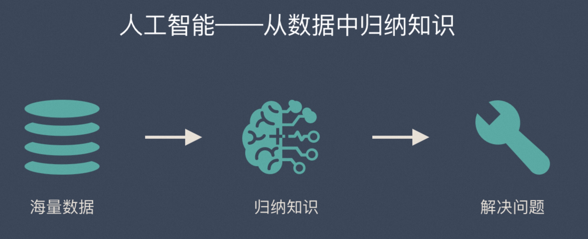
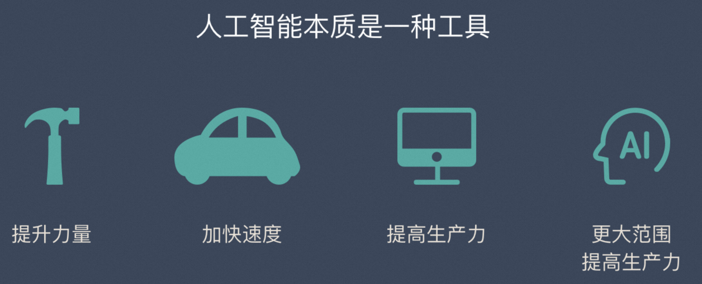
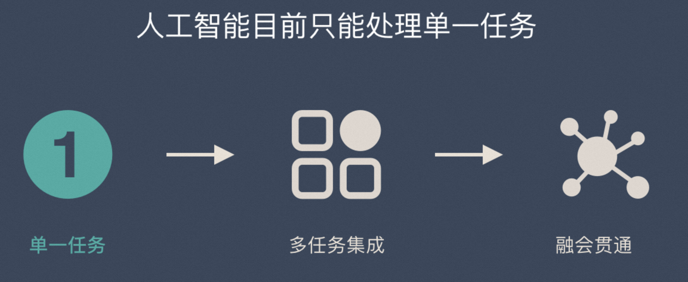
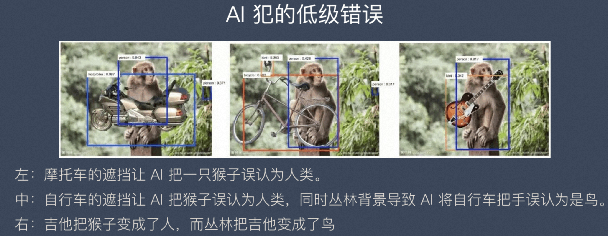
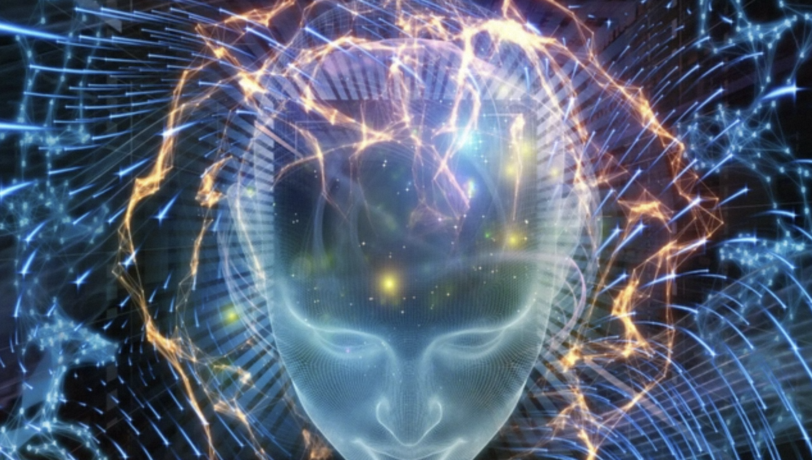
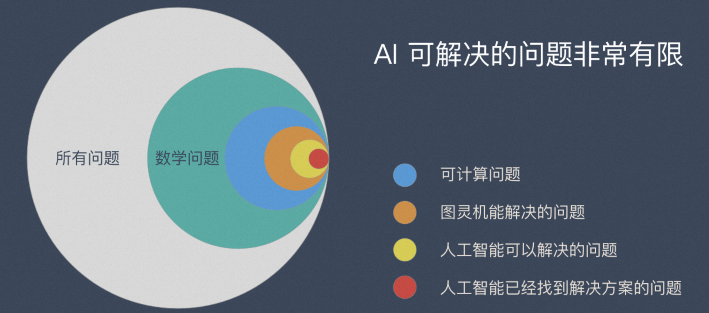

# 1、人工智能是什么

**人工智能**（**Artificial Intelligence**, **AI**）已经走入了普通大众的视野，我们在生活中可以看到很多跟 AI 相关的产品。比如苹果手机上的Siri、支付宝的刷脸支付、视频软件的换脸...

同时，也会很多人对人工智能有一些误解：
* 电影里的机器人就是人工智能的典型代表
* 人工智能好像是无所不能的
* 人工智能未来会威胁到人类的生存
* ……

原因是大家只是看到网络上的只言片语，并不了解 AI 的基本原理，事物的本质往往并没有想象中的那么复杂。

## 1.1 传统软件与人工智能的区别

我们用传统软件和人工智能进行比较，有了参照系就更容易理解一些。

传统软件是「if-then」的基本逻辑，人类通过自己的经验总结出一些有效的规则，然后让计算机自动的运行这些规则。传统软件永远不可能超越人类的知识边界，因为所有规则都是人类制定的。

简单的说：**传统软件是「基于规则」的，需要人为的设定条件，并且告诉计算机符合这个条件后该做什么**。

这种逻辑在处理一些简单问题时非常好用，因为规则明确，结果都是可预期的，程序员就是软件的上帝。

但是现实生活中充满了各种各样的复杂问题，这些问题几乎不可能通过制定规则来解决，比如人脸识别通过规则来解决效果会很差。

人工智能现在已经发展出很多不同分支，技术原理也多种多样，这里只介绍当下最火的深度学习。

深度学习的技术原理跟传统软件的逻辑完全不同：**机器从「特定的」大量数据中总结规律，归纳出某些「特定的知识」，然后将这种「知识」应用到现实场景中去解决实际问题**。

这就是人工智能发展到现阶段的本质逻辑。而人工智能总结出来的知识并不是像传统软件一样，可以直观精确的表达出来。它更像人类学习到的知识一样，比较抽象，很难表达。

上面的说法还是比较抽象，下面通过几个方面来帮助大家彻底搞明白：

## 1.2 人工智能是一种工具

AI 跟我们使用的锤子、汽车、电脑……都一样，其本质都是一种工具。

工具必须有人用才能发挥价值，如果他们独立存在是没有价值的，就想放在工具箱里的锤子一样，没有人挥舞它就没有任何价值。

人工智能这种工具之所以全社会都在说，是因为它大大扩展了传统软件的能力边界。之前有很多事情计算机是做不了的，但是现在人工智能可以做了。

归功于摩尔定律，计算机的能力呈指数级的上涨，只要是计算机能解参与的环节，生产力都得到了大幅提升，而人工智能让更多的环节可以搭上摩尔定律的快车，所以这种改变是意义非凡的。

**但是不管怎么变，传统软件和人工智能都是工具，是为了解决实际问题而存在的。这点并没有变化。**

## 1.3 人工智能只解决特定问题

《终结者》《黑客帝国》…很多电影里都出现了逆天的机器人，这种电影让大家有一种感觉：人工智能好像是无所不能的。

实际情况是：**现在的人工智还处在单一任务的阶段**。

### 1.3.1 单一任务的模式

打电话用座机、玩游戏用游戏机、听音乐用MP3、开车用导航…

### 1.3.2 多任务模式

这个阶段类似智能手机，在一台手机上可以安装很多 App，做很多事情。

但是这些能力还是相互独立的，在旅行App上定好机票后，需要自己用闹钟App定闹钟，最后需要自己用打车App叫车。多任务模式只是单一任务模式的叠加，离人类智慧还差的很远。

### 1.3.3 融会贯通

你在跟朋友下围棋，你发现朋友的心情非常不好，你本来可以轻松获胜，但是你却故意输给了对方，还不停的夸赞对方，因为你不想让这个朋友变得更郁闷，更烦躁。

在这件小事上，你就用到了多种不同的技能：情绪识别、围棋技能、交流沟通、心理学…

但是大名鼎鼎的 AlphaGo 绝对不会这么做。不管对方处在什么情况下，哪怕输了这盘棋会丧命，AlphaGo 也会无情的赢了这场比赛，因为它除了下围棋啥都不会！

**只有将所有的知识形成网状结构，才能做到融会贯通**。例如：商业领域可以运用军事上的知识，经济学也可以用到生物学的知识。

## 1.4 知其然，但不知所以然

当下的人工智能是从大量数据中总结归纳知识，这种粗暴的「归纳法」有一个很大的问题是：**只关注现象，不关心为什么。**

庞氏骗局类的诈骗手段就充分利用了这一点：
* 它利用超高的回报来吸引韭菜，然后让早起参与的所有人都转到钱；
* 当旁观者发现所有参与者都真实赚到了钱，就简单的归纳为：历史经验说明这个靠谱。
* 于是越来越多的人眼红，加入，直到有一天骗子跑路。

当我们用逻辑来推导一下这个事情就能得出骗子的结论：
* 这么高的回报并不符合市场规律
* 稳赚不赔？我不需要承担高回报的高风险？好像不太合理
* 为什么这么好的事情会落在我头上？好像不太对劲

正是因为当下的人工智能是建立在「归纳逻辑」上的，所以也会犯很低级的错误。

上图显示了在一张丛林猴子的照片中 ps 上一把吉他的效果。这导致深度网络将猴子误认为人类，同时将吉他误认为鸟，大概是因为它认为人类比猴子更可能携带吉他，而鸟类比吉他更可能出现在附近的丛林中。

# 2、人工智能的发展历史

## 2.1 第一次浪潮（20世纪50年代到60年代）

1943年McCulloch和Pitts提出神经元逻辑模型，意味着人工智能在人类历史上正式诞生。1956年，为解决人工神经网络“结构复杂”问题，以麦卡锡、马文明斯基等为代表的从事数学、心理学、计算机科学、信息论和神经学研究的年轻学者们集聚在**达特茅斯大学**。

召开了人类历史上第一次人工智能研讨会，并第一次使用了“人工智能”这一术语，这一年被视为人工智能的元年，同时也开启了各国政府、研究机构、军方对人工智能投资和研究的第一波热潮。此后，人工智能取得了显著的成果。

1960年，美国的麦卡锡（J.Mccarthy）发明了人工智能程序设计语言Lisp，用于对符号表达式进行加工和处理。1963年，纽厄尔（A.Newell）发布了问题求解程序，首次将问题的领域知识与求解方法分离开来，标志着人类走上了以计算机程序模拟人类思维的道路。1965年鲁宾逊（Robinson）提出了归结原理，实现了自动定理证明的重大突破。

1968年，奎利恩（J.R.Quillian）指出，记忆是基于概念之间的相互联系来实现的。20世纪70年代，人工智能的研究已在世界许多国家相继展开，研究成果大量涌现。1970年国际性的人工智能杂志《Artificial Intelligence》创刊，对推动人工智能的发展、促进研究者们的交流起到了重要作用。1972年法国科默寥尔（A.Clomerauer）提出并实现了逻辑程序设计语言PROLOG。肖特里费（E.H.Shortliffe）等人从1972年开始研制用于诊断和治疗感染性疾病的专家系统MYCIN。

然而，这一时期，受到基础科技发展水平以及可获取的数据量等因素的限制，在机器翻译、问题求解、机器学习等领域出现了一些问题，在语音识别、图像识别等简单的机器智能技术方面取得的进展都非常有限。甚至，英国学者莱特希尔（Lighthill）在1973年发布的研究报告《人工智能：一般性的考察》中指出，人工智能项目就是浪费钱，迄今该领域没有哪个部分做出的发现产生了像之前承诺的那样。基于此，英国政府大幅消减了人工智能项目的投入。到70年代中期，美国和其他国家也大幅下调了该领域的投入，人工智能的研究也因此进入停滞状态。

## 2.2 第二次浪潮（20世纪80年代到90年代）

这一时期，人工智能研究者们对以前的研究经验及教训进行了认真的反思和总结，继续迎难而上，迎来了以知识为中心的人工智能蓬勃发展新时期。1977年，费根鲍姆（E.A.Feigenbaum）的“知识工程”概念引发了以知识工程和认知科学为核心的研究高潮。

在此基础上，专家系统和知识工程在全世界得到迅速发展，部分人工智能产品已成为商品进入生产生活。20世纪80年代，**人工神经元网络**的相关研究取得了突破性进展。J.Hoplield于1982年构建了一种新的全互联的神经元网络模型，并在1985年，顺利解决了“旅行商（TSP）”问题。1986年Rumelhart构建了**反向传播学习算法**（BP），成为普遍应用的神经元网络学习算法。

在这一时期，人工智能尽管在专家系统、人工神经元网络模型等方面取得了巨大的进展，能够完成某些特定的具有实用性的任务，但面对复杂问题却显得束手无策，尤其是当数据量积累到一定程度后，有些结果就难以实现改进，极大地限制了人工智能的实际应用价值。因此，人工智能发展到20世纪90年代中期，相关研究再度陷入困境。

## 2.3 第三次浪潮（20世纪90年代中期至今）

自20世纪90年代中期开始，机器学习和人工神经网络的研发工作加速推进，人工智能实现了巨大的突破。1997年，计算机深蓝完胜国际象棋大师卡斯帕罗夫，重新点燃了人们对人工智能的希望。2004年，日本率先研制出了人形机器人Asimo。

2006年，深度学习取得了重大突破，之后，图形处理器（GPU）、张量处理器（TPU）、现场可编程门阵列（FPGA）异构计算芯片以及云计算等计算机硬件设施不断取得突破性进展，为人工智能提供了足够的计算力，得以支持复杂算法的运行，2005年后，随着大数据持续积累，给人工智能的发展提供了规模空前的训练数据。

2016年，Alpha Go完胜世界围棋大师李世石，将人工智能发展的高潮推到了一个新的高度。世界主要经济大国加快布局人工智能，加大对人工智能产业的投入，出台各项鼓励人工智能发展的政策，为人工智能在全球范围内取得新的突破打下了坚实的基础。

2017年，Alpha Go Zero通过深度学习实现了自我更新升级，不断自我超越，完胜Alpha Go。IBM研发的人工智能Watson，通过机器学习分析和解读海量医疗数据和文献并提出治疗方案，其分析结果与医生的治疗建议具有高度的一致性。微软公司的机器人小冰，自学了自1920年以来的519位诗人的现代诗，并在网络上发表，且并未被发现是机器所作。此外，人工智能在交通、教育、金融等领域也展示出巨大的应用前景。

# 3、人工智能的级别

业界普遍把AI分为如下三个级别：

## 3.1 弱人工智能

弱人工智能也称限制领域人工智能（Narrow AI）或应用型人工智能（Applied AI），指的是专注于且只能解决特定领域问题的人工智能。

例如：AlphaGo、Siri、FaceID……

我们当前所处的阶段是弱人工智能，强人工智能还没有实现（甚至差距较远），而超人工智能更是连影子都看不到。**所以“特定领域”目前还是 AI 无法逾越的边界**。

## 3.2 强人工智能

强人工智能，即**通用人工智能**（Artificial General Intelligence，AGI），是指能够自我感知和理解外部世界，不断地自我学习新知识和实现自我升级的机器智能。

在强人工智能阶段，智能机器、算法或系统将具备与人类一样的学习和理解知识的能力，能够像人一样具有思维并对复杂理念进行分析，进行思考、计划、自我学习以及通过过去的经验进行总结学习等，**人工智能也就表现为在各个方面都能与人类媲美的机器智能**。因此，人类劳动力能够完成的大部分工作任务，强人工智能都能够自主完成，也就是说，强人工智能不仅能够替代人类的体力劳动，还能替代脑力劳动，将给人类社会带来较为严重的劳动替代问题。

当然，对经济社会影响越深远的技术，研发和重组所需的时间就越长。而强人工智能的强智能特性决定了其对经济社会的影响比传统技术创新和弱人工智能都要深远，因此，需要较长时间的积累。正如马克思所言，量的积累到一定程度才能实现质的飞跃，人工智能的发展也遵循这一规律，关于强人工智能何时到来，在学术界和业界争论不一，至今尚未有定论。

## 3.3 超人工智能

超人工智能是指基于海量的数据整合和高度的学习与自我学习，使智能机器具备的远超人类智慧的人工智能，**可以把这一阶段的人工智能理解为几乎在任何领域都比人类聪明**，这也意味着生物形态的智慧将不再是世界上唯一的智慧形态。

机器智能能够实现递归式自我能力提升，进而实现人工智能指数级爆发和“智能爆炸”，并极大地推动科技进步，纳米技术和基因工程在人工智能的辅助下将迅速得到突破。生产生活所需的物质产品将主要由智能系统进行生产，人类在享受人工智能带来的生产效率提升和生活质量改善的同时，也将面临着一个“更少工作的未来”。

与此同时，整个社会将呈现严重的两极分化，一极是数量众多的“无用阶层”，另一极是数量较少的精英阶层。

然而，要实现超级人工智能则必须跨过一个临界点（“奇点”），即机器智能超越人类智能的界限，一旦实现跨越，人类将重新思考自己和机器之间的关系。

# 4、人工智能的能力边界

如果在深入一点，从理论层面来解释 AI 的能力边界，就要把图灵大师搬出来了。图灵在上世纪30年代中期，就在思考3个问题：

1. 世界上是否所有数学问题都有明确的答案？
2. 如果有明确的答案，是否可以通过有限的步骤计算出答案？
3. 对于那些有可能在有限步骤计算出来的数学问题，能否有一种假象的机械，让他不断运动，最后当机器停下来的时候，那个数学问题就解决了？

图灵还真设计出来一套方法，后人称它为**图灵机**。今天所有的计算机，包括全世界正在设计的新的计算机，从解决问题的能力来讲，都没有超出图灵机的范畴。

通过上面的3个问题，图灵已经划出了界限，这个界限不但适用于今天的 AI ，也适用于未来的 AI 。

下面我们再进一步把边界清晰的描述一下：

* 世界上有很多问题，只有一小部分是数学问题
* 在数学问题里，只有一小部分是有解的
* 在有解的问题中，只有一部分是理想状态的图灵机可以解决的
* 在后一部分（图灵机可解决的部分），又只有一部分是今天的计算机可以解决的
* 而 AI 可以解决的问题，又只是计算机可以解决问题的一部分。

那么，人工智能会让你失业吗？

首先，**人工智能替代「部分人类的行为」是必然的趋势**，每一项新技术或者新发明都会替代一部分劳动力，例如：
* 报时间的工作——表
* 拉人力车的工作——汽车
* 挖井的工作——钻进机
* ……

需要注意的是，科技替代的只是某些特定的工作。挖井机只能帮你挖洞，但是无法帮你判断应该在哪里挖洞。

人工智能也是如此，它并不是针对某些职业或者某些人，而是替代一些具体的劳动行为。

其次，失业的同时会出现更好新职业

几次技术革命的历史告诉我们，虽然新技术的出现导致了部分人失业，但是同时也会产生很多新的职业。被替代的工作往往是低效的，而创造出来的工作往往更高效。想想拉人力车，再想想开汽车。

当人工智能解放了一部分劳动力，这部分劳动力就可以做更有价值，更有意思的事情。

李开复提出过一个判断依据：

> 如果一项工作，它做决策的时间在 5 秒钟以内，那么大概率是会别人工智能取代的。

这种工作有4个特点：
1. 做决策所需要的信息量不大
2. 做决策的过程并不复杂，逻辑简单
3. 能独自完成，不需要协作
4. 重复性工作

科学家总结出了3个人工智能很难替代的技能：

1. 社交智慧（洞察力、谈判技巧、同理心…）
2. 创造力（原创力、艺术审美…）
3. 感知和操作能力（手指灵敏度、协调操作能力、应付复杂环境的能力…）

