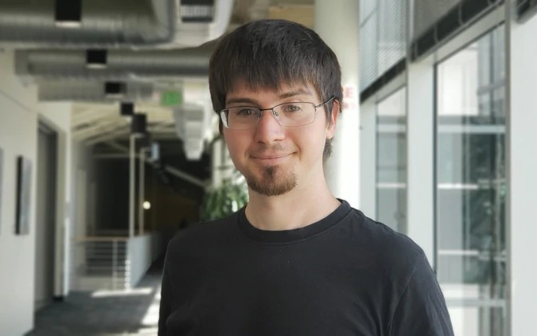
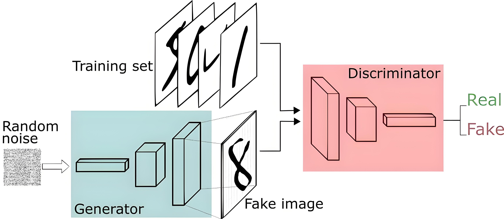

# 1、引言

**GAN** （Generative Adversarial Network，生成对抗网络）是神经网络的一种，是由被誉为“生成对抗网络之父” 的蒙特利尔大学博士生伊恩·古德弗洛（Ian Goodfellow）在2014年提出的。

百度的前首席科学家吴恩达（Andrew Ng）说，GAN 代表了“重要而根本性的进步”。Facebook首席人工智能科学家Yann LeCun称对抗训练为“过去10年机器学习领域最有趣的idea”。

GAN 的潜力巨大，因为它们能去学习模仿任何数据分布。此后各种花式变体Pix2Pix、CYCLEGAN、STARGAN、StyleGAN等层出不穷，在“换脸”、“换衣”、“换天地”等应用场景下生成的图像、视频以假乱真，好不热闹。

## 2、生成器与判别器

生成对抗网络的主要思想是：通过**生成器**（Generato）与**判别器**（Discriminator）不断对抗进行训练。后来无论GAN 发展到今天演化出了多么复杂的变体，其基本思想仍是以上两种网络生成器与判别器的对抗。

- **生成器 Generator**：生成图像的网络，它接受一个随机的噪点 z ，并根据噪声生成图像 G(z) ；
- **判别器 Discriminator**：判别网络，它判别一张图像是不是“真实的”。它的输入参数是 x ，代表一张图像，输出 D(x) 代表 x 为真实图片的概率，如果为 1，就代表 100% 是真实的图片，而输出为 0，就代表不可能是真实的图像。

这样看来，我们发现 GAN 网络就像一个**自己对自己进行图灵测试的机器**。在测试过程中，生成器 G 和判别器 D 就像是两个不断地相互博弈而又永不放弃的人。生成网络 G 的目标就是不断改进自己的生成过程，使得输出的结果尽量看起来像真实的图像，以此骗过判别器 D ，好让 D 打分为 1，即100%真实。而判别器 D 的目标就是尽量把 G 生成的图片和真实的图片区分开来，不断练就自己的“慧眼”。通过相互对抗，生成器的生成能力和判别器的判别能力都越来越强大，最终当模型收敛时，我们将得到一个生成效果较好的生成器，毕竟这才是我们的核心目的。道高一尺魔高一丈的精髓至此被人工智能学去了。

举个比较形象的例子：我们假设生成器 G 是一个专门做赝品的画师，判别器 D 是名画鉴别师。这个希望靠赝品画作浑水摸鱼的画家，拿着作品到市场上去很容易就被别人揭穿了。于是他请来一位名画鉴别师 D 来帮助自己提高临摹能力。但是名画鉴别师 D 唯一能帮助 G 的就是不厌其烦地每天鉴别 G 的新作，并给出画作是否像真画的肯定或否定答案。起初 G 的画作在不断变化中尝试改进，每一次都被 D 判定为假货，但是成千上万次不断反复训练的结果，D 的画技逐渐炉火纯青，达到了以假乱真的地步，以至于鉴别师 D 也无法分辨真假了。

而实际上，鉴别师 D 也是需要训练的。训练鉴别师的目的是为了更好地和赝品画师 G 进行对抗，以提高 G 的乱真能力。我们把一些真品的画作和假画给鉴别师 D，并告之哪个是真，哪个是假，以此训练 D。曾经一度 G 的赝品技艺已经让 D 分别不出真假了，但是经过进一步训练的 D 鉴别能力大大提升，又能洞察玄机鉴别出来 D 的画作是赝品了。

然后，以上两个人在不断交替地对抗中，各自的本领都得到了极大的提高，魔高一尺道高一丈。当然，最终的检验标准还是市场。G 把作品拿到市场上，所有人都赞不绝口认为是一幅伟大的名画，G 的辛苦训练终于如愿以偿，他在临摹过程中也提升了自己的画技，发现自己也具备了一位真正的绘画大师的能力了，他甚至准备出品属于自己风格的画作。此时，一直站在角落里看着这一切的鉴别师 D 也发出了满意的微笑。

2022年9月在美国科罗拉多州博览会的艺术比赛中，一幅名为《太空歌剧院》的画作获得数字艺术类别冠军，获得300美金的奖励。

而之后这幅画很快被作者Jason Allen自己透露是一幅由AI生成的作品，于是引发了巨大的争论直至今天。自此，300刀的奖金撬起了万亿美元的 AIGC 市场。

## 3、GAN的数学原理

其实GAN模型以及所有的生成模型都一样，做的事情只有一件：**拟合训练数据的分布**。对图片生成任务来说就是**拟合训练集图片的像素概率分布**。

下面我们从数学原理的角度演示一下GAN的训练过程：

上图中：

- **黑色点线**为训练集数据分布曲线
- **蓝色点线**为判别器输出的分布曲线
- **绿色实线**为生成器输出的分布曲线
- **z**展示的是生成器映射前的简单概率分布（一般是高斯分布）的范围和密度
- **x**展示的是生成器映射后学到的训练集的概率分布的范围和密度

训练步骤如下：

- （a）判别器与生成器均未训练呈随机分布
- （b）判别器经过训练，输出的分布在靠近训练集“真”数据分布的区间趋近于1（真），在靠近生成器生成的“假”数据分布的区间趋近于0（假）
- （c）生成器根据判别器输出的（真假）分布，更新参数，使自己的输出分布趋近于训练集“真”数据的分布。
- 经过（b）（c）（b）（c）...步骤的循环交替。判别器的输出分布随着生成器输出的分布与训练集分布的接近而更加平缓；生成器输出的分布则在判别器输出分布的指引下逐渐趋近于训练集“真”数据的分布。
- （d）训练完成时，生成器输出的分布完美拟合了训练集数据的分布，判别器的输出由于生成器的完美拟合而无法判别生成器输出的真伪而呈一条取值约为0.5（真假之间）的直线。

## 4、GAN的优缺点

GAN 的优点：

- **生成高质量数据**：
  - GAN能够生成非常逼真的数据样本（如图像、音频等），尤其是在图像生成领域表现优异。例如，StyleGAN可以生成高分辨率、细节丰富的图像。
  - 在某些任务中，GAN生成的结果比其他生成模型（如VAE）更接近真实数据分布。
- **无需显式定义概率分布**
  - 与传统的生成模型（如变分自编码器VAE）不同，GAN不需要显式地建模数据的概率分布，而是通过对抗训练隐式地学习数据分布。
  - 这使得GAN可以处理复杂的、高维的数据分布。
- **灵活性强**
  - GAN可以应用于多种任务，包括图像生成、图像修复、超分辨率重建、风格迁移、数据增强等。
  - 它还可以与其他技术结合，如强化学习或自然语言处理。

GAN 的缺点

- **训练不稳定**
  - GAN的训练过程非常复杂，生成器和判别器之间的对抗可能导致训练不稳定。
  - 常见问题包括**模式崩溃**（Mode Collapse）和**梯度消失**（Vanishing Gradient）。模式崩溃是指生成器只生成少量几种样本，无法覆盖整个数据分布。
  - GAN的训练对超参数（如学习率、网络结构等）非常敏感，调整不当可能导致训练失败。需要大量的实验和调参才能找到合适的配置。
- 难以评估模型性能
  - 由于GAN的损失函数并不直接反映生成样本的质量，因此很难通过损失值判断模型是否收敛。
  - 需要依赖于主观评价（如人类观察）或其他指标（如FID、IS等）来评估生成质量。
- 计算资源需求高
  - GAN通常需要大量的计算资源，尤其是在处理高分辨率图像时。训练时间较长且对硬件要求较高。

