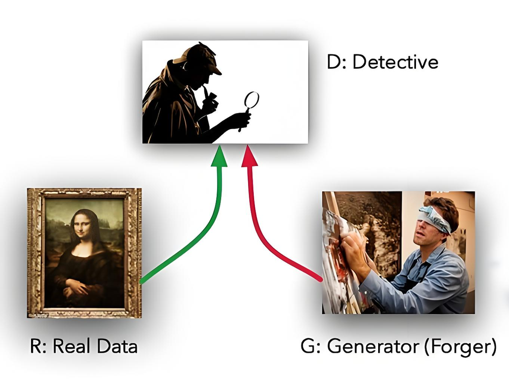
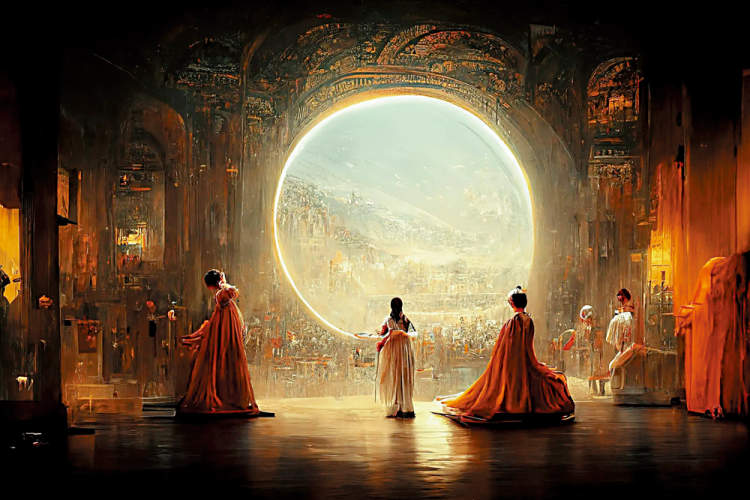
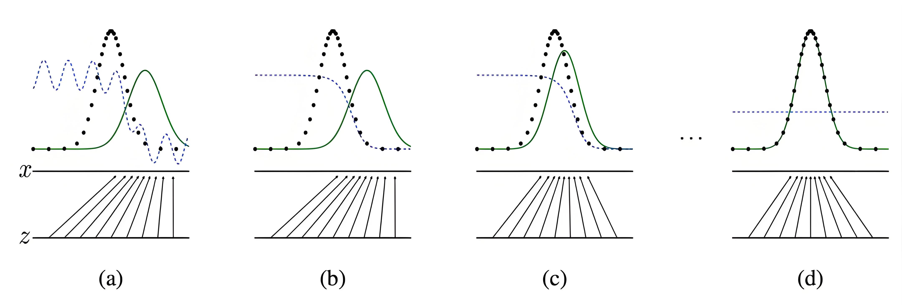

# 1 引言

**GAN**（Generative Adversarial Network，生成对抗网络）是一种通过对抗训练学习数据分布的生成模型框架。2014 年，伊恩·古德弗洛（Ian Goodfellow）等人提出了 GAN。

前百度首席科学家吴恩达（Andrew Ng）认为，GAN 代表了“重要而根本性的进步”。时任 Facebook（现 Meta）首席人工智能科学家 Yann LeCun 曾将对抗训练称为“过去 10 年机器学习领域最有趣的想法”。

GAN 的潜力巨大，因为它能够学习并模仿复杂的数据分布。此后，pix2pix、CycleGAN、StarGAN 和 StyleGAN 等 GAN 变体层出不穷，并在图像生成、图像编辑和风格迁移等场景中展现出很强的表现力。

## 2 生成器与判别器

生成对抗网络的主要思想是：通过**生成器**（Generator）与**判别器**（Discriminator）进行对抗训练。时至今日，无论 GAN 演化出多么复杂的变体，其核心仍是生成器与判别器之间的对抗。

- **生成器（Generator）**：负责生成图像的网络。它接收随机噪声向量 z，并据此生成图像 G(z)。
- **判别器（Discriminator）**：负责判断图像真实性的网络。它的输入 x 代表一张图像，输出 D(x) 通常可解释为该图像来自真实数据分布的概率；输出接近 1 时，表示更可能为真实图像，接近 0 时则表示更可能为生成图像。

这样看来，GAN 网络就像一场**由机器自己扮演裁判的图灵测试**。在测试过程中，生成器 G 和判别器 D 如同两个不断博弈、永不放弃的对手。生成器 G 的目标是持续改进生成过程，使输出结果尽可能接近真实图像，从而骗过判别器 D；判别器 D 的目标则是尽可能区分 G 生成的图像与真实图像，并不断提升自己的“慧眼”。通过相互对抗，生成器的生成能力和判别器的判别能力都会逐步提高；模型收敛后，通常保留生成效果较好的生成器用于实际应用。这正体现了“道高一尺，魔高一丈”的动态博弈。

举个形象的例子：假设生成器 G 是一名专门制作赝品的画师，判别器 D 是一名名画鉴别师。这位希望靠赝品画作浑水摸鱼的画师，拿着作品到市场上很容易被人揭穿，于是请来鉴别师 D 帮助自己提高临摹能力。鉴别师 D 能做的，是不厌其烦地鉴别 G 的新作，并给出画作是否像真画的判断。起初，G 的画作不断尝试改进，却总被 D 判定为假货；经过成千上万次反复训练后，G 的画技逐渐炉火纯青，赝品几可乱真，以至于 D 也难以分辨真假。

事实上，鉴别师 D 同样需要训练。训练 D 的目的是为了更好地与赝品画师 G 对抗，从而提高 G 的生成能力。我们把真品画作和赝品交给鉴别师 D，并告知哪个是真、哪个是假，以此训练 D。曾有一段时间，G 的赝品技艺已经让 D 分辨不出真假；但 D 经过进一步训练后，鉴别能力大幅提升，又能识别出 G 的画作是赝品。

随后，两者在不断交替的对抗中各自的本领都得到了提高。最终的检验标准仍是市场：当 G 把作品拿到市场上时，所有人都赞不绝口，认为这是一幅伟大的名画。G 的辛苦训练终于如愿以偿；在临摹过程中，他也提升了画技，甚至具备了创作个人风格画作的能力。此时，一直站在角落里看着这一切的鉴别师 D 也发出了满意的微笑。

2022 年，美国科罗拉多州博览会的艺术比赛中，一幅名为《太空歌剧院》的作品获得数字艺术类别一等奖，奖金为 300 美元。

随后，作者 Jason Allen 透露该作品使用 Midjourney 辅助创作，引发了关于 AI 创作、作者身份与版权归属的广泛讨论。这一事件并未开启 AIGC 市场，却成为公众关注生成式 AI 的标志性案例之一。

到 2026 年，AIGC 已不再局限于静态图像。多模态模型与视频生成技术持续发展，生成式 AI 已覆盖图像、音频、文本和视频等多种内容形态。在通用高保真图像与视频生成领域，扩散模型及 Diffusion Transformer（DiT）路线更为主流；GAN 则凭借较快的单次前向推理速度，在实时生成、超分辨率重建和特定风格迁移等场景中仍具有实用价值。

## 3 GAN 的数学原理

GAN 的训练目标是让生成器学习从潜变量到数据空间的映射，从而使生成样本的分布尽可能逼近训练数据分布。对于图像生成任务，模型学习的是图像整体的联合分布，而不是逐个像素彼此独立的概率分布。

下面从数学原理的角度演示 GAN 的训练过程：

上图中：

- **黑色点线**表示训练集的数据分布。
- **蓝色虚线**表示判别器的输出分布。
- **绿色实线**表示生成器的输出分布。
- **z** 代表从简单先验分布（如高斯分布或均匀分布）中采样的随机噪声向量。
- **x** 代表数据空间中的样本；生成器将 z 映射到该空间，以生成与训练数据相似的样本。

训练步骤如下：

- （a）生成器和判别器均尚未训练，参数处于随机初始化状态。
- （b）训练判别器后，在靠近训练集“真”数据分布的区域，其输出趋近于 1；在靠近生成器生成的“假”数据分布的区域，其输出趋近于 0。
- （c）生成器依据判别器提供的梯度信号更新参数，使生成样本的分布逐步接近训练集“真”数据的分布。
- 反复交替执行（b）和（c）后，判别器的输出会随着生成分布接近真实分布而趋于平缓；生成器输出的分布则在判别器的引导下逐渐逼近训练数据分布。
- （d）在理想的全局最优均衡下，生成器输出的分布与训练数据分布一致，判别器无法区分真伪，输出恒为约 0.5。实际训练未必达到这一理论状态。

## 4 GAN 的优缺点

GAN 的优点：

- **生成高质量数据**：
  - GAN 能够生成逼真的数据样本，如图像、音频等，尤其在图像生成领域表现突出。例如，StyleGAN 可生成高分辨率、细节丰富的图像。
  - 在部分图像生成任务中，GAN 的结果可获得较高的视觉保真度。
- **无需显式建模概率密度**：
  - 与变分自编码器（VAE）等显式生成模型不同，GAN 不需要直接给出可计算的概率密度，而是通过对抗训练隐式地学习数据分布。
  - 这使 GAN 能够处理复杂的高维数据分布。
- **灵活性强**：
  - GAN 可应用于图像生成、图像修复、超分辨率重建、风格迁移和数据增强等多种任务。
  - 它还可与强化学习、自然语言处理等技术结合。
- **推理速度快**：
  - 生成器通常只需一次前向传播即可产生结果；在许多部署场景中，这使 GAN 比需要多步迭代的生成方法更适合低延迟需求。

GAN 的缺点：

- **训练不稳定**：
  - GAN 的训练过程较复杂，生成器和判别器之间的对抗可能导致训练不稳定。
  - 常见问题包括**模式崩溃**（mode collapse）和**梯度消失**（vanishing gradients）。模式崩溃是指生成器只生成少量类型的样本，无法覆盖完整的数据分布。
  - GAN 的训练对学习率、网络结构等超参数较敏感；调整不当可能导致训练失败，往往需要大量实验和调参。
- **难以评估模型性能**：
  - GAN 的损失函数并不直接反映生成样本的质量，因此难以仅通过损失值判断模型是否收敛。
  - 通常需要结合人工评估与其他指标，例如 FID（Fréchet Inception Distance）和 IS（Inception Score），来评估生成质量。
- **计算资源需求高**：
  - GAN 在处理高分辨率图像时通常需要较多计算资源，训练时间较长，且对硬件要求较高。

截至 2026 年，扩散模型（Diffusion Models）及其 DiT 等架构已成为通用高保真图像与视频生成的重要路线。GAN 并未被取代：其快速推理和对特定任务的良好适配性，仍使其在实时生成、超分辨率重建与特定风格迁移等工业场景中具有价值。

