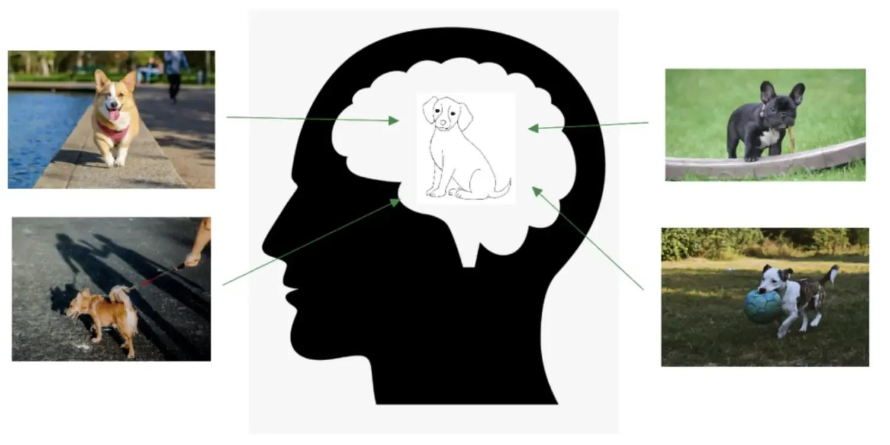
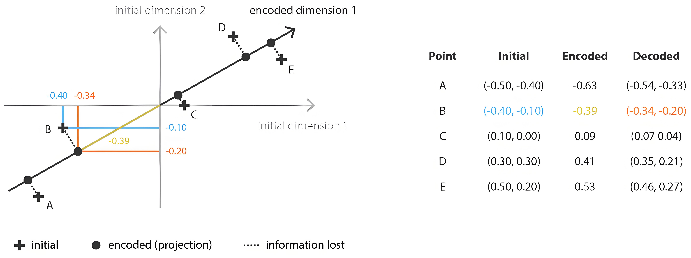
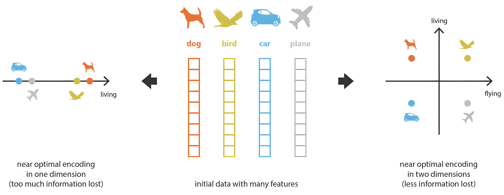
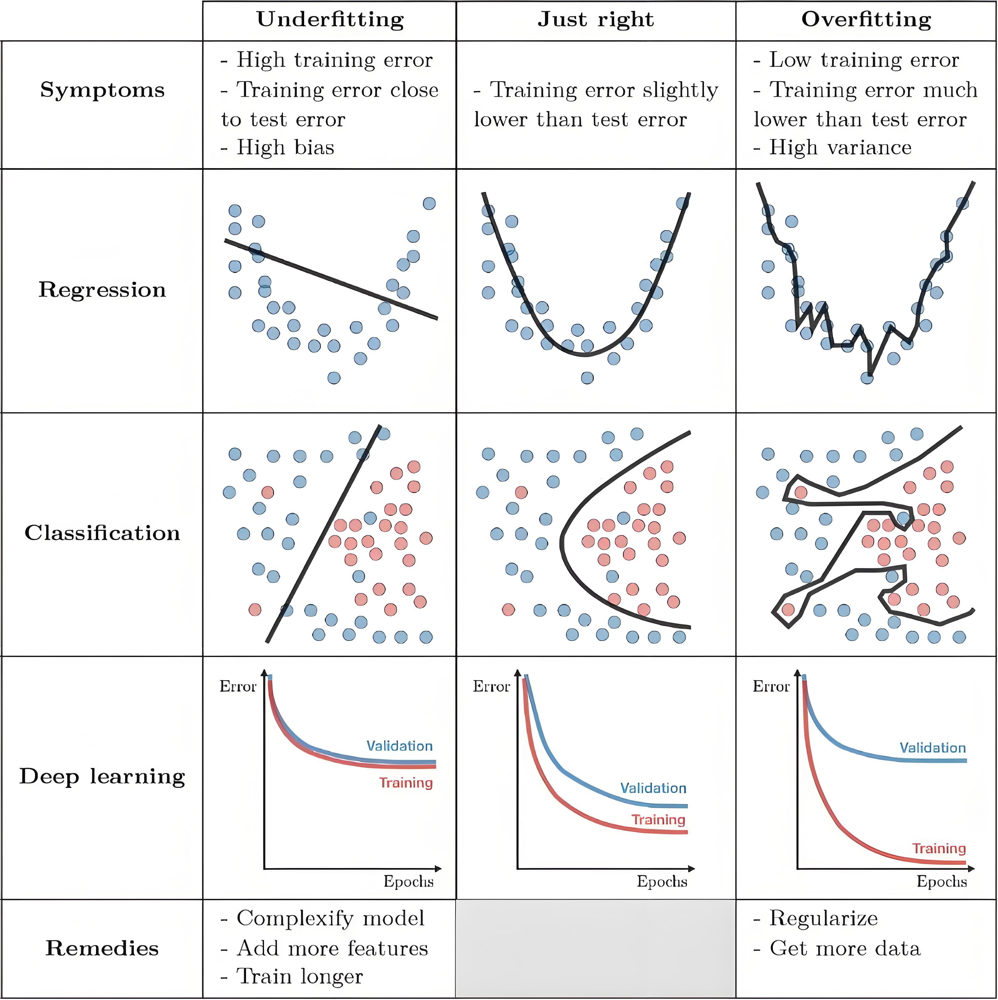
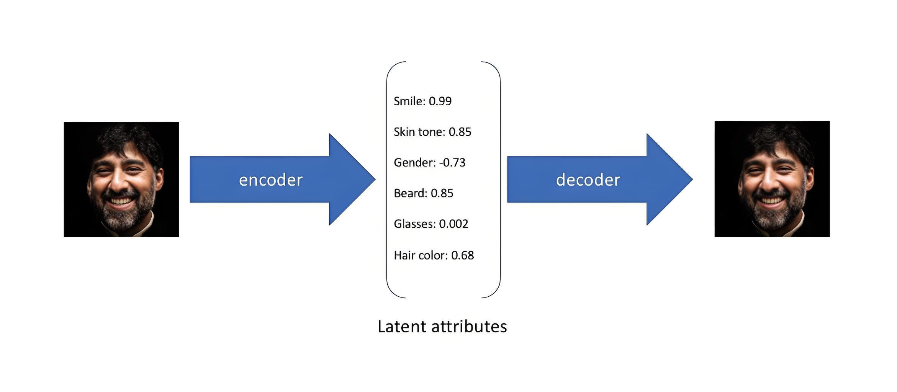
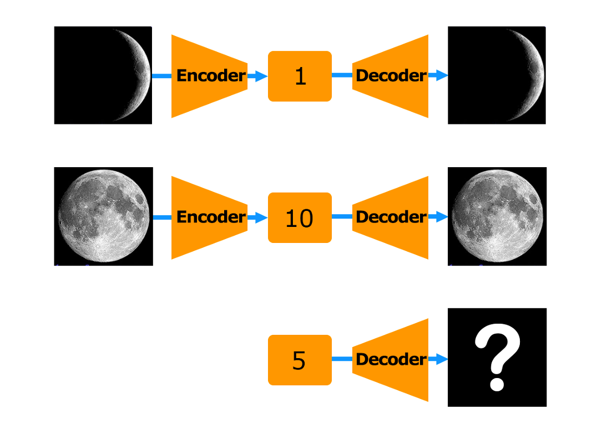
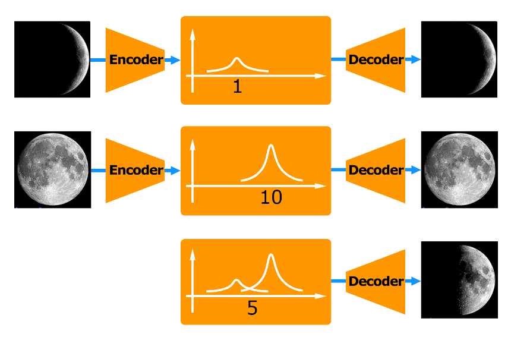
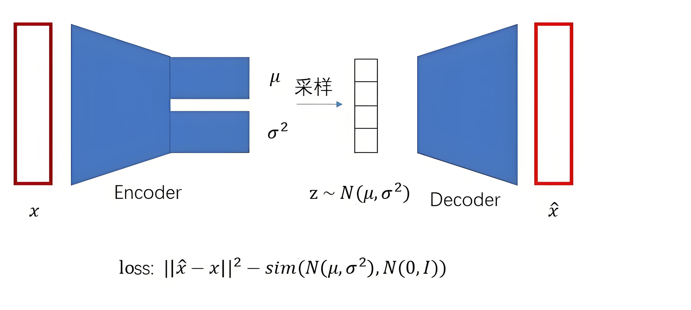
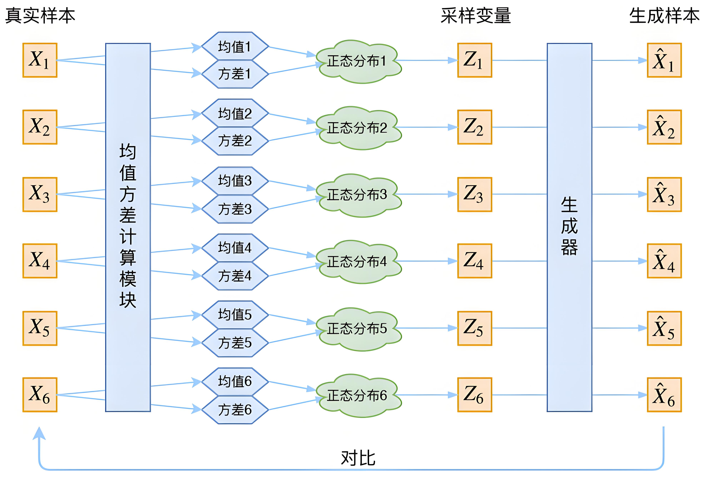

# 1 隐变量与隐空间

> **隐变量**（Latent Variable）是指在数据中无法直接观察到的、隐藏的变量。它通常用来表示数据背后的潜在结构或特征。换句话说，隐变量是对复杂数据的一种简化描述。

想象你看到一幅画，画上是一只猫。这幅画本身是复杂的，包含很多细节（比如颜色、形状、纹理等）。但其实这幅画背后有一个简单的“描述”：`它是“一只猫”，而不是“一堆像素点”`。

这里的“描述”就是隐变量，它捕捉了画的本质特征（比如“猫”这个概念），而忽略了具体的细节。

在生成式模型（如 VAE 或 GAN）中，隐变量通常是一个低维向量，用来表示数据的主要特征。例如：

- 对于一张图片，隐变量可能是它的“轮廓”、“颜色分布”、“姿态”等。
- 对于一段语音，隐变量可能是它的“语调”、“节奏”、“情感”等。

隐变量的一个特点是，**它通常是通过模型学习得到的，而不是直接从数据中观测到的**。

假设我们有很多画，每幅画都对应一个隐变量（比如“猫”“狗”“树”等）。如果把这些隐变量放在一起，就会形成一个“隐空间”。

- 这个隐空间就像是一个地图，每个点代表一种可能的画。
- 如果你在隐空间中找到某个点，就可以还原出对应的画。

> **隐空间**（Latent Space ），也称**潜在空间**，是指在统计学、机器学习和生成式模型领域中，一种假设的、通常不可直接观察的多维空间。隐空间用来**学习数据的潜在特征**，以及**学习如何简化这些数据特征的表达**，以便发现某种规律模式，最终来识别、归类、处理这些数据。

隐空间可以被视为一种**压缩数据**的表示，其中的每个点或向量都代表了**数据集中的一个潜在模式或特征**。

为了更好地理解这个概念，让我们考虑一下人类如何感知世界。通过将每个观察到的事件编码为我们大脑中的压缩表示，我们能够理解广泛的主题。例如，我们不会记住狗的每一个外观细节，以便能够在街上认出一只狗。正如我们在下图中所看到的，我们保留了狗的一般外观的内部表示：

以类似的方式，隐空间试图通过空间表示向计算机提供对世界的压缩理解。

隐空间在各种生成模型中起着关键作用，如自动编码器（AutoEncoder，AE）、变分自动编码器（Variational Autoencoder, VAE）、生成对抗网络（Generative Adversarial Network, GAN）等。模型通过训练学习**如何将输入数据映射到隐空间中，同时也学习如何从隐空间中的点重建出原始数据**。

隐空间之所以叫“空间”，而不是叫“压缩数据”或“高度概括的特征数据”，还因为一个比较重要的概念：“**维度空间**”。

在一个虚拟的世界中，模拟再现出一个世界，需要用数字描绘的事物维度往往高达十几维、几十维、几百维。这些超过三个维度的坐标系空间画面我们的大脑无法想象，但可以通过数据来描述。人工智能直接在这样高维度的数据中进行训练，将因为数据过于庞大，且其中的无关紧要的“杂质”信息太多而难以进行。

何为“杂质”信息呢？比如下图中的两把椅子和桌子，很明显，两把椅子更有相似性，它们区别于桌子大概率是因为它们都是有靠背的、没有抽屉的、更瘦高的外观结构等等。这些都构成了数据的维度。可是很明显，两把椅子的颜色特征，在建立椅子与椅子之间的相似度和椅子与桌子的区别度来看，纯属是无用的甚至是容易造成混淆的“杂质”信息。

所以，我们需要过滤一下这些无关紧要的杂质信息。通常的方式是**把高维度的事物用低维度去解构**。好比一个 3D 的图形，我们把它解构为 2D 的正视图、2D 的侧视图和 2D 的顶视图，最后再把这三个 2D 的图像进行分别运算一样。**通过维度的降低，在训练样本足够多的情况下，因为更接近于普遍规律性的数据将在数据表现上也更接近，所以许多不相关的“杂质”数据将被识别，然后剔除掉。**最后留在低维度空间（隐空间）中的信息将最大限度地高度概括这类事物的普遍特征。

这便有了“空间”的概念，把高维度空间中的事物降维成低维度的空间中的数据，再在低维度空间（隐空间）中进行运算。这里“空间”两个字是一种意向上的比喻称呼，比喻一种隐藏的、被压缩后的、不可直观感受到的、从高维度解构下来的低维度空间，即隐空间。是用数据来描绘一类事物的数据构成的“规律空间”。

这两把椅子在隐空间中距离更近，你也可以理解为两把椅子的数据集在隐空间中所占的坐标点位更相近。比如两把椅子在隐空间中数据被压缩成 `[0.4, 0.5]` 和 `[0.45, 0.45]`，而桌子被压缩成 `[0.9, 1.05]`，若放在二维的坐标系中，两个数值分别代表 X 坐标值和 Y 坐标值，那么很明显两把椅子的点位更接近，”椅子”的规律也就浮现出来了。虽然，此时机器仍然不知道这两个东西叫”椅子”，但它却知道这两个东西是一类的东西，然后被我们人类命名为了”椅子”。

这其实很类似哲学意义上的归纳总结，在一系列类似的事物中，**把没用的、偶然的信息剔除掉（通常称为”噪声”），把有用的相互之间关联的规律性的信息高度地形而上地总结起来，形成认知事物的规律（在人工智能领域就形成了”模型”），方便日后，面对类似事物问题时进行分析判断，遵循这样的规律去行事以期达到我们想要的结果。**

**隐空间就是这个拆分复杂问题后，剔除了无用的”杂质”信息后，留下来的具有数据特征规律性的”数据规律性空间”、”哲学空间”，但空间中的哲理描述则是简明扼要的提纲挈领的。**

关于空间、维度、规律性等概念可以通过下图进行更形象的理解。

图中由 initial dimension 1 为横轴、 initial dimension 2 为纵轴组成的二维坐标系中，A、B、C、D、E 五个点代表原始数据，他们在二维空间中占有各自的位置（+号所标记的点位，他们的初始坐标为右侧表格中 Initial 列下的二维数据集）。

编码器首先将这五个点位从二维空间压缩到一维空间对应的点，这个一维空间的坐标系就是图中 encoded dimension 1 坐标轴所代表的。它的原点和二维坐标系的原点重合。当这一降维编码完毕后，自然而然地，ABCDE 五个点位的初始数据就被压缩到了一维的隐空间之中。

在一维空间中，ABCDE 每个点的数据表示很明显只包含一个数字，即用数字描绘了各个点与原点（坐标轴 0 点）之间的对应位置信息。

然而，在一维空间中的点位再映射回到二维空间时，也就是再解码回来时，我们就发现了误差，即压缩损失传递过来的解码误差（图中 B 点作为例子，编码前以及解码后的数据都标注出来了）。可以看出，当数据被编码压缩或者说降维到隐空间之中时，虽然是有损失的，但是规律性也自然浮现了出来。因为一维空间 dimension 1 的坐标轴本身也代表了 ABCDE 在二维空间中分布的潜在规律。

当然，这并不意味着 ABCDE 五个点就一定是现实物理世界中的二维平面上的五个点，而是说，ABCDE 这五个初始点采样自现实世界中，每个点可以用一个二维向量来表示，即两个数值代表的数据集。我们只是在数学模型构建这些点时，可以把他们视为二维坐标系中的点而已。实际上在大自然中要模拟一些复杂自然规律，其采样的点的数据维度可能会极高，三维、四维、五维……以至于几百维都有，即用来描述每一个采样点的数据特征数为 3 个、4 个、5 个以至于几百个，我们仍然有办法可以将他们从高维逐级地降成一维。

在实际运行过程中，我们没有必要把所有维度都降维到一维，降到几维最合理，实际上要根据具体的问题来做调整的。下图很好地解释了维度深浅的意义：

用 dog、bird、car、plane 四个概念来举例，好比每一个概念都是 N 维的数据集。那么压缩到二维就足够了（图中右侧），可以对四个概念进行有效地规律总结和分类操作。但是再多压缩一层，到一维时（图中左侧），我们就难以对数据规律进行总结了，即四个概念都混为一谈了，也就是压缩失去了太多关键信息。所以，“**过拟合**”和“**欠拟合**”都不是好事情，恰如其分地拟合才是我们在训练模型中所追求的。

这同样可以比喻成下一代的教育问题。全社会似乎都在快乐教育、素质教育、应试教育种种这些方式之间迷茫，也在什么时期进行应试教育、什么时候快乐教育的时间分配、侧重比例上左右摇摆不定。其实有了如今多模态 AI 大模型的训练过程作为对照，这就突然变得清晰了。

过拟合就好比儿童训练过头了，变成死记硬背了，不会融会贯通，触类旁通……一旦这样的教育方式持续下去，直到错过了最佳教育窗口期，长大成人后，那么将对这个青年产生一生的能力减分。因为，一旦他走入社会，见到的新事物与原来他在接受过度死记硬背教育时所见到的事物有一点的不一样，他都无法在脑中反应出可适用的规律，于是他便迷茫，束手无策了。

而欠拟合则是训练不成功，没有找到拟合的路径，或者说没有适当地去除杂乱的信息，没有总结出有用的规律。就好比儿童时期没有找到很好的适合他的培养路线，没有激发出孩子的兴奋点，以至于到青少年时期都还在迷茫之中，这个也学一点那个也学一点，都是蜻蜓点水，但哪一个也没有真正地系统性的学习，最后错过了最佳教育期，那么整体上这个青年将在远离自己能力天花板的地方度过此生。

所以，最终的答案是，我们怎么去调优大模型，我们就去怎么调优我们的孩子，既不要过拟合又不要欠拟合。当然，这里还要看训练的模型本身架构适合哪些具体的任务，这就如同还要看这个儿童本身的天性特点，适合朝哪个方向去培养一样，因材施教。

## 2 自编码器的局限性

假设你是一个做算法从业者，你的手头上有人脸图像的数据集。现在，你想要训练一个模型，使得模型能够生成人脸。

一个比较经典的做法是，我们先用一个神经网络（**编码器**，Encoder）把图片描述（编码，Encode）成”**隐变量**” h。隐变量的各个维度的意义我们是无从得知的，不过通过一些方法我们可以将其验证出来，这些维度通常表示图片的属性。例如人脸的性别、年龄、发色、是否戴眼镜等等。得到隐变量 h 后，再用一个神经网络（**解码器**，Decoder）将隐变量中的信息翻译（解码，Decode）成一张新的图片。

就好像你和朋友玩一个游戏。在这个游戏中，你负责将图片描述出来，朋友则负责根据你的描述将图片重新画出来。你就是编码器，你的描述就是隐变量，你的朋友就是解码器。

编码器和解码器共同构成了被称为“**自编码器**（AutoEncoder，AE）”的模型。

我们肯定是希望这张解码出来的新图片和原先被编码的图片越相似越好。因为这样就说明了：

1. 隐变量确实能够很好地表示图片的属性，同时编码器也能胜任编码的工作
2. 解码器确实能够将图片的属性解码成对应的图片

为什么说这样隐变量就确实能很好地表示图片属性呢？因为如果隐变量不能很充分地表示图片，那么大概率就无法解码出与原图相似的图片。

为了做到这点，**我们联合训练编码器和解码器，目标是最大化新旧图片的相似度，或者说最小化新旧图片的“不相似度”。**而“不相似度”就是训练的损失函数。

这样在训练过程中，随着不断降低输入图片与输出图片之间的误差，**AE 模型会过于拟合，缺乏泛化性能**。也就是说，输入某个训练过的图片，就只会将其编码为某个确定的 code。反过来，输入某个确定的 code 就只会输出为某个确定的图片，如果这个 code 是来自未训练过的陌生图片，那么则无法生成出我们想要的那个陌生图片。

如上图，假设 AE 将“新月”图片 encode 为 1（这里假设编码只有 1 维的数值），将 1 进行 decode 后得到“新月”的图片。将”满月” encode 成 10，同样将 10 进行 decode 得到”满月”图片。这时，如果我们给 AE 一个 code 值 5，我们希望是能得到一个介乎于新月和满月之间，类似”半月”的图片，但由于之前未训练过”半月”图片（既非”新月”也非”满月”的图片）编码为 5，那么 AE 解码后就无法得到”半月”的图片，而是模糊的乱码。

当然，上面只是举一个极简单的例子方便大家理解 AE。AE 在实际运行中，编码器把原数据压缩进入了隐空间时是有压缩损失的，配对运行的解码器要通过运算解码尽量复现编码之前的数据状态，这就意味着，编码器和解码器需要配对出现进行无数次地训练，以求在解码时得到最小的重构误差。因此，AE 的工作重心是在数据的压缩和恢复上，如何做到尽可能的复现初始状态，而并不是在预测中间状态和趋势状态上，所以过拟合的问题在所难免，毕竟这就是 AE 的任务目标。这种死记硬背式的映射导致了隐空间的不连续，使得模型在面对未见过的中间状态时泛化能力极差。

于是，预测中间状态和趋势状态的工作则交给了 VAE。为了解决 AE 过拟合与不泛化问题，VAE 的思路是这样的：**不将图片编码成隐空间中的具体数值，而是将其编码成一种隐空间中的“正态分布”数据集**。

我们将”新月”图片编码成均值 μ = 1 的正态分布，那么就相当于在 1 附近加了正态分布的噪声，此时不仅单一数值 1 表示”新月”，而是 1 和 1 附近的正态分布的数值（即潜在向量）统一表示为”新月”，只是 1 的时候最像”新月”而已。越接近 1 附近的偏离值则越接近”新月”图像状态，反之越不像（当然要完成这样的匹配需要一定量的新月以及接近新月的预训练数据）。同样，将”满月”映射成均值 μ = 10 的正态分布，满月和接近满月的图片的预训练数据也需要充分。虽然我们并没有训练过半月的图片数据，但当 code = 5 时，就同时拥有了”新月”和”满月”的部分正态分布概率，此时 decode 出来的大概率就是一个介乎于“新月”和“满月”之间的图片“半月”了。如下图：

当然，这里只是粗略地形象地比喻方法去解释 VAE 的思路，实际在执行过程中的操作要复杂很多，需要许多其他的变量加入其中。VAE 比 AE 多出这个 V 就是 `Variational` ，是变分、变量化的意思，同时也来源于统计学中的**变分推理**方法的意思。

很明显，我们在生活中遇到的问题要比这个复杂很多，决定某件事情发展的变量也很多，大部分这样的问题都是以前没有跟在前辈或老师身边学习到的。**如果非黑即白地面对，往往得不到理想的结果，此时需要一些“难得糊涂”地去理解事物，既要有原则，又要有相对可包容的分寸去把握，此时处理出来的结果，则会相对更好一些。**当然，能够如此地“难得糊涂”地去看待事物，还因为早先在跟前辈或老师学习时不是死记硬背，而是变通地根据学习材料进行规律的提取和总结。

## 3 变分自编码器 VAE

### 3.1 概率论原理

以图片生成和处理任务为例，假设我们的研究对象是一个 16 * 16 的 RGB 图片，抛开对图片内容的限制，假如我们完全随机地生成这样一个尺寸的图片，每个像素的可能取值有 `256 * 256 * 256` 个，整个图片的可能取值情况有 N=(256 * 256 * 256)(16*16) 个。

我们把可能随机生成的这样的一个图片设为一个随机变量 `X` ，`X` 的所有可能取值个数为 N，则我们可以将其样本空间表示为：

`Sx = {X1,X2,...,Xn}`

这个随机变量必然是服从某个分布的，我们将其记为 `X ~ p(X)`。即我们随机生成的这样一个图片 X，其取值为 a 的概率为 `p(a)`
（即 `P(X = a) = p(a)` ）。

**模型生成图片的过程，实际上就是对服从分布 `p(X)` 的随机变量 X 进行采样的过程**，采样得到的就是一个属于 Sx 的图片。

但我们在许多图片生成任务中肯定是希望得到一个在 Sx 上有所倾向、有所特点的分布 `p(X)`（不然真随机生成的话大概率只会生成一团马赛克）。比如说，如果我们希望这个模型能生成一些与猫相关的图片，那这个模型对应的分布 `p(X)` 在与猫相关的图片对应的 X 值上的概率应该更高，而与猫无关的图片的概率应该更小。

也就是说，在许多任务中，我们对这个分布 `p(X)` 是有特殊的要求和期望的，**我们的目的就是求出这个满足我们要求的分布 `p(X)`。只要我们能求出合适的分布 `p(X)`，我们就可以通过对这个分布进行采样得到我们期望的图片**。

那么问题来了，我们怎么求我们希望的分布 `p(X)` 呢？

实际上，我们很难对 `p(X)` 的形式有一个合理的预先认识和假设，大多数时候我们对其一无所知，**只能用各种方式来逼近这个分布 `p(X)`**。

故我们引入一个隐变量 z ，先生成一个随机变量 z ，再由 z 经过某种变换生成最终的随机变量 X 。

关于为什么要引入隐变量，这里给出一个更形象的描述：比如说，袋子里有黑球和白球，你不断地从袋子里取球出来再放回去，就能够统计出抽到黑球和白球的频率。然而，真正决定这个频率的，是袋子里黑球和白球的数量，这些数量就是观测不到的隐变量。简单来说，**隐变量 z 是因，变量 x 是果**。

实际上，观测数据只是我们可以直接观测到的样本指标或特征，而在观测数据之下蕴含的还有一些我们不能直接观测到的、潜在的、未知的特征，这些特征可能对观测数据产生影响，我们称其为**隐藏特征**。

举例说明，考虑一个电商平台的用户行为分析：可以直接观测到是用户在平台上的实际行为数据，如购买记录、浏览历史、搜索关键词等。而隐空间可以是用户的潜在兴趣或偏好。例如，假设一个用户购买了几本关于健康和健身的书籍，但观测数据中并没有直接记录用户的兴趣。

用户的兴趣偏好会在一定程度上影响其在平台上的行为活动，但不会直接记录在观测数据中。用户在平台上的行为数据在形式上往往是比较复杂的，难以直接找到其一般的规律，那我们可以人为地添加潜在的主题变量来表示“用户的兴趣”，然后想办法构建一个由“用户的兴趣”到“用户的行为数据”的映射，因为“用户的兴趣”这一隐藏特征在表示和含义上远比观测特征简洁直白，可以很方便地分析理解数据，提供更精确和深入的推断和预测。

引入隐变量 `z` 后，我们记其服从于分布 `s(z)` ， 我们可以从较为简单的分布 `s(z)` 出发，间接地求出相对复杂的 `p(X)` 。

这里需要注意：

1. `s(z)` 分布的表达式形式一般比较简单，比如普通的多元正态分布，并且往往是预先假设的一个没有未知量的确定分布。（对的，一般我们引入的这个隐变量就是相对简单的，这是我们人为设计规定的，不然不如不引）
2. `z` 的自由度一般比较低，或者说其维度比较低，应该是一个相对简单的变量。

隐变量模型背后的关键思想是：**任何一个简单的概率分布经过一个足够复杂的函数后可以映射到任意概率分布**。所以**隐变量模型实际上把一个概率分布的估计问题转化成了一个函数逼近的问题**。

### 3.2 基本架构

与普通自动编码器一样，变分自动编码器由编码器 Encoder 与解码器 Decoder 两大部分组成。

然而，与普通 AE 模型不同的是，**VAE 的 Encoder 与 Decoder 在数据流上并不是相连的，我们不会直接将 Encoder 编码后的结果传递给 Decoder，而是要使得编码后的结果满足既定分布，比如标准正态分布（也称高斯分布）**：

为什么要选择正态分布呢？无他，正态分布采样简单、数学性质好，还能轻松实现可微分，方便优化。几乎是生成模型的“万金油”。

实际上一个单变量的正态分布仅由均值和方差决定，而它们也只是两个普通的浮点数。**因此从这个角度来说，我们只是将原来的“编码成一个固定值”的操作，改成了“编码成两个固定值（均值和方差）”而已。**

这样做有什么好处呢？首先，前面提到的“编码泛化性差”的问题就被解决了。

用上面的月亮的例子来解释。我们不妨假设隐向量维度为 1，也就是说，图片只被编码成一个浮点数。假设这个浮点数表示”月亮有多满”。在一开始的方案中，月牙图片会被编码成数字 1，而满月图片会被编码成数字 10。在新方案中，训练时编码器将月牙和满月分别编码成了 `N(1, 4)`、`N(10, 5)` 两个正态分布。然后分别从中采样得到了 `h(1)`、`h(2)`。

这时 `h(1)`、`h(2)` 都很有可能采样出 5 这个值。而解码器在看到 5 这个编码时，原图既有可能是满月，又有可能是圆月。解码器要怎么做才能使得重构损失最小呢？生成这两类数据的“均值”就好了，类似于每个像素取均值。月牙和满月的均值就是半弦月。

这就**让解码器具有了更强的泛化能力**。

不过，也不能让隐向量各维度的值去服从任意的正态分布。**因为这个正态分布很可能具有接近 0 的方差，此时它就会退化成一个常数分布。**也就是说，无论我们如何采样，得到的值都是固定的。况且模型在学习的时候为了最小化重构损失也会想办法让方差降到 0。

这样的话就跟原始的 AutoEncoder 没区别了。

综合上面两点原因，VAE 加了一个限制：**我们想让编码器编码出来的正态分布越接近标准正态分布 N(0, 1) 越好**（只要是接近就行，不能完全变成标准正态分布，不然学习就没有任何意义了）。这样既不用担心编码出的分布的方差退化，也可以在生成阶段直接从 N(0, 1) 中采样隐向量了。简单粗暴，但是有效。

也就是说，**VAE 的损失函数除了要最小化重建图像与原图像之间的均方误差外，还要最大化每个分布和标准正态分布之间的相似度**。

### 3.3 总结

综合来看，VAE实际上是为了弥补 AE 这种简单的重构模型生成泛化能力弱的局限，基于其 encoder-decoder 的结构在隐空间中引入了一个隐变量分布，从而使其变为一个隐变量模型，然后为了弥补隐变量估计采样复杂的问题，又补全了变分推断的理论，使其实现更具可行性。

很明显，在变分自动编码器中，输入层的信息并没有直接传到输出层，而是在中间进行了截断，原始样本的信息被更换成了“与原始样本处于相同分布中的样本的信息”。由于该过程的存在，变分自动编码器有如下的三个特点：

1. 斩断了神经网络中惯例的“从输入到输出”的数据流，以此**杜绝了信息直接被复制到输出层的可能性**。
2. **无论在训练还是预测过程中，模型都存在随机性**，相比之下，大部分带有随机性的算法只会在训练的过程中有随机性，而在测试过程中对模型进行固定。但由于变分自动编码器的“随机性”是与网络架构及输入数据结构都高度相关的随机性，因此当训练数据变化的时候，随机抽样的情况也会跟着变化。
3. **可以作为生成模型使用**。其他的自动编码器都是在原始图像上进行修改，而变分自动编码器可以从无到有生成与训练集高度相似的数据。由于输入 Decoder 的信息只是从正态分布中抽选的随机样本，因此其本质与随机数差异不大，当我们训练完变分自动编码器之后，就可以只使用解码器部分，只要对解码器输入结构正确随机数/随机矩阵，就可以生成与训练时所用的真实数据高度类似的数据。

VAE 的生成效果在早期可能不如 GAN 惊艳，但它训练稳定、隐空间连续的特性，使其成为了现代生成式 AI 的基石。无论是主流的扩散模型（Diffusion Models）还是视频生成大模型，几乎都在底层依赖 VAE 来进行高效的隐空间压缩。

通常我们会拿 VAE 跟 GAN 比较，的确，它们两个的目标基本是一致的——**希望构建一个从隐变量 `Z` 生成目标数据 `X` 的模型**，更准确地讲，它们是假设了 `Z` 服从某些常见的分布（比如正态分布或均匀分布），然后希望训练一个模型 `X=g(Z)`，这个模型能够将原来的概率分布映射到训练集的概率分布，也就是说，**它们的目的都是进行分布之间的变换**。

只不过两者在实现上有所不同。GAN 的思路很直接粗犷：既然难以直接计算两个分布之间的距离，那就训练一个判别网络来代替数学度量，甚至后来演化出了 WGAN 等更稳定的变体。而 VAE 则使用了一个精致迂回的技巧。

