# 1、Diffusion 扩散模型

Diffusion 扩散模型是在 2015 年时的 《Deep Unsupervised Learning using Nonequilibrium Thermodynamics 》文章中提出的，但当时并没有立刻得到广泛的关注。

目前所采用的扩散模型大都是 2020年6月来自于加州大学伯克利分校的一篇题为 《Denoising Diffusion Probabilistic Models》的论文。**DDPM模型**在更加庞大的数据集上展现出了与当时最优秀的生成对抗网络 GAN 模型相媲美的性能，这才让世人真正地领略到了 Diffusion 扩散模型在 AIGC 内容创作领域所蕴藏的巨大潜力。于是Diffusion 扩散模型开始火爆了起来。

Diffusion 是对热力学扩散过程的模仿：将一滴墨水滴入一杯清水之中，墨滴会慢慢散开，最终均匀地扩散到水杯的每个角落。如果这个过程可逆，那么就可以创造一个由一片浑浊去探寻最初墨滴状态的方法。

Diffusion 模型分为两个部分：

- **前向扩散**：在图片中添加噪声，犹如墨滴逐渐扩散开来。这个过程用于**训练阶段**；
- **反向扩散**：去除图片中的噪声，犹如一片浑浊的水逐渐逆转，时间倒流回到一滴墨汁的状态。这个过程用于**生成阶段**。

## 1.1 前向扩散

对图像逐步施加噪点，直至图像变成完全的高斯噪声图。

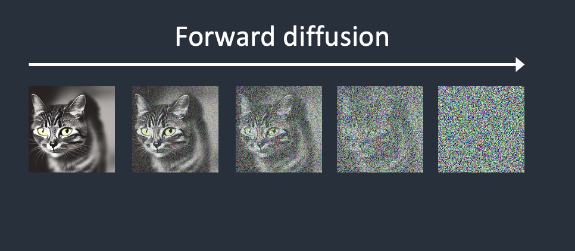

前向过程最关键的地方就是训练一个叫 **U-Net** 的卷积神经网络，也被称为**噪声预测器**（Noise predictor）。

训练过程如下：

1. 选择一张训练图像，例如猫的照片。
2. 生成随机噪声图像。
3. 将噪声图以不同强度叠加到训练图上来破坏训练图像。
4. 让噪声预测器预测需要添加多少噪声。
5. 将预测值与正确答案作对比，反馈给U-net网络更新参数。

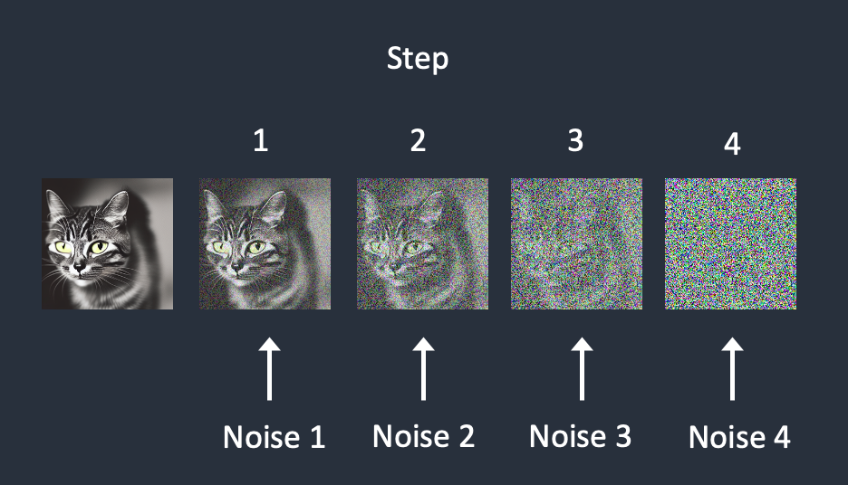

随着训练次数的累计，噪声预测器会变越来越精准。

## 1.2 反向扩散

现在我们有了噪声预测器。如何使用它呢？

1. 生成一个完全随机的图像
2. 让噪声预测器预测其中的噪声
3. 从原始图像中减去这个预测出来的噪声
4. 重复此过程几次，就可以得到一只猫（或一只狗，跟训练素材有关）的图像

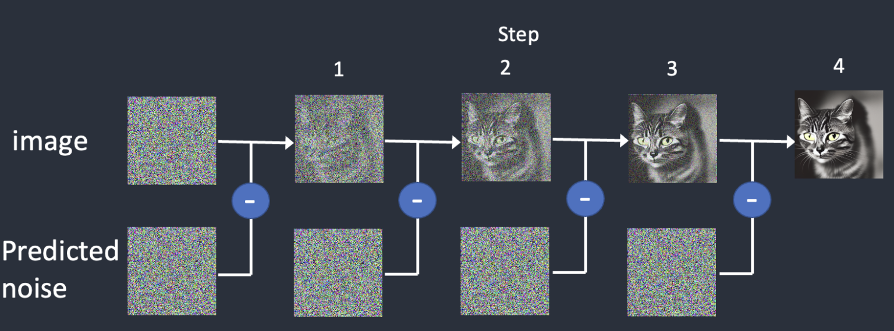

反扩散过程即生成图像的过程。这是因为在正向扩散过程中AI学会了一个技能，从而能用这个技能进行图像的创作。这个技能就是，**AI知道了从一张具体的有内涵的图像怎样逐渐地变成完全噪点图的每一步中都发生了什么**。

如果从哲学的高度来总结一下，可以这么说：

> 将一个有内涵有灵魂的内容一步一步地让它变成一片虚无，或者说让一个生命一步一步地走向死亡，最终尘归尘土归土，回归到最初的状态，AI从中窥探到了生与死之间并无本质的分别，只是形式进行了转换，在生命中不断地增加了一些东西而已，一旦这些东西增加到饱和状态，物质就从生命模式转换到了虚无模式。于是，它立即明白过来，将这个过程反过来也可以从一片虚无中创造出一个新的生命。虽然这个新的生命还有原来那个墨滴的影子，但早已不是原来那个墨滴。

## 1.3 条件作用Conditioning

通过反向扩散，我们只是做到了生成图片，但是做不到**生成指定类型的图片**。也就是说，目前这个过程完全是随机的，我们无法控制最终图片是生成狗还是猫。

**条件作用**的目的就是**引导噪声预测器，以便预测的噪声在从图像中减去后能够为我们提供想要的结果。**

下面概述了如何处理文本提示并将其输入噪声预测器。**分词器**（Tokenizer，Stable Diffusion v1.5使用`CLIP`的分词器）首先将提示中的每个单词转换为一个称为`token`的数字。然后，每个标记都会转换为一个称为`embedding`的768个值向量。`embedding`随后由文本转换器进行处理，并准备好供噪声预测器使用。

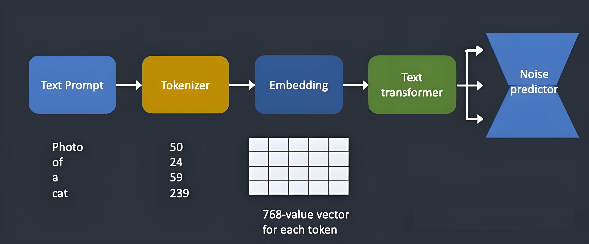

conditioning就是text prompt转换来的，我们在text prompt中输入“cat”，或者在negative prompt中输入“not dog”，大模型就明白了你要生成的图片是猫，而非狗。

# 2、Stable Diffusion

常见的几种生成模型有 GAN、Flow-based Model、VAE，Energy-Based Model 以及 Diffusion。Diffusion 扩 散模型和其它生成模型的区别是，它不是直接地从图像到潜变量、再从潜变量到图像的一步到位，它是一步一步地逐渐分解、逐渐去噪的过程。

这也导致了 Diffusion 的缺点，即**在反向扩散过程中需要把完整尺寸的图片输入到 U-Net 网络，这使得当图片尺寸以及随机时间步长足够大时，Diffusion 运行得将会非常缓慢，系统算力耗费巨大**。于是为了解决这一问题 Stable Diffusion 应运而生了。

从2022年初引起被广泛关注的 **Disco Diffusion**，再到 **DALL-E2** 等都是基于 Diffusion 模型开发出来 AIGC 图像创作程序，而拿到1.1亿美元巨额融资的 **Stable Diffusion** 更是名噪一时。实际上 **Latent Diffusion 是 Diffusion 的改进版， 而 Stable Diffusion 则是 Latent Diffusion 的改进版**。

Stable Diffusion 实际上是一个由多个模块和模型组成的系统架构，它由三大核心部件组成，每个组件都是一个神经网络系统，也称为三大基础模型：

- **CLIPText**：文本编码器，将文本信息转换为用数字表达的信息，以便让机器能够理解提示词文本的语义
- **Image information creator**：图像信息创建器，由一个 U-Net 神经网络和一个调度算法组成，用于逐步处理/扩散被转化到潜空间中的信息。
- **Image Decoder**：图像解码器，主要是一个VAE（Variational AutoEncoder ），它根据从图像信息创建器传递过来的信息矩阵，解码绘制最终图像。

## 2.1 文本编码器

### 2.1.1 CLIP的训练

**CLIP**，全称是 ***Contrastive Language-Image Pre-Training***，中文的翻译是：***通过语言与图像比对方式进行预训练***，可以简称为**图文匹配模型**，即通过对自然语言理解，和对计算机视觉分析，并最终对语言和图像之间的一一对应关系进行比对训练，然后产生一个预训练的模型，以便能为日后由文本参与的生成图像的任务所使用。比如把狗的所有相关的图像和“狗”这个词匹配起来。

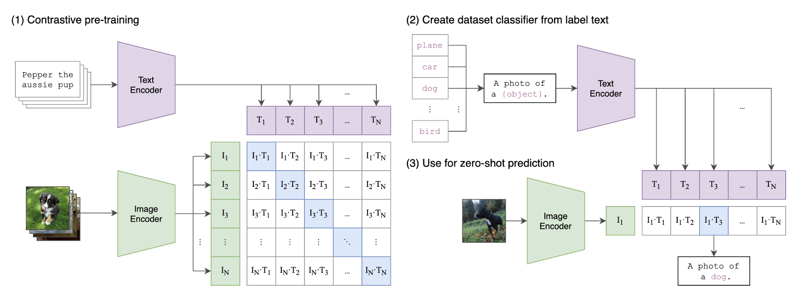

CLIP 本身也是一个神经网络，它将 Text Encoder 从文本中提取的语义特征和 Image Encoder 从图像中提取的图像特征进行匹配训练，即不断调整两个模型内部参数，使得模型分别输出的文字特征值和图像特征值能让对应的“文字-图像”经过简单验证确认匹配。

可以说 CLIP 的训练方式也是一种大力出奇迹的过程。起初，它搜刮了广泛分布于互联网上的 4 亿个“文本-图像”对进行训练。通过天量的数据，再砸入让人咂舌的昂贵训练硬件与时间，终于修成正果。

CLIP 模型的训练数据基本都来自于网络上抓取的图片和这些图片在网页上的 “alt” 标签的内容（ “alt” 标签是网页上的代码中 Html 图像标签中的一个属性标签，它利用文字内容描述当前的图片，告知搜索引擎这张图代表什么） 。

下面把 CLIP 拆解开看看细节，其内部是图像编码器和文本编码器的组合。首先将一张图片和它对应的文字说明分别输入到 Image Encoder 图像编码器和 Text Encoder 文本编码器中，分别输出为 Image embedding 和 Text embedding，即两组向量。

然后，通过一种叫“余弦相似度”（cosine similarity）的向量对比方法来对比这两个生成出来的 embedding 向量。在刚开始训练时，即使在输入端来看文本准确地描述了图像，但在 CLIP 的输出来看相似度很低，即通过余弦相似度对比后的结果显示相似度很低。

此时，模型的损失函数反馈机制发生作用，它把差值更新进入这两个编码器 Image Encoder 和 Text Encoder，以便在第二次再对同一组图和文字说明进行编码后产生的 embedding 向量之间的相似度能够有所提高，直至相似度达标为止。

最后，通过对同一张图和文字描述进行往复不断地这个训练进程，使得两个编码器生成出来 embedding 向量十分相似时，我们就认为此时固化在 Image embedding 和 Text embedding 这两个编码器中为了调整相似度而嵌入的补充数据（即神经网络的连接权重）就为训练成功的 CLIP 模型了。

当然，这一训练过程还需要训练那些“文不对图”的情况，即需要让编码器知道这张图和描述文字之间毫无关联，这种反向的情况也需要训练。

### 2.1.2 CLIP的使用

有了 Diffusion 的生图模型，也有了文本描述的 CLIP 模型。那么，这两者又是怎么结合到一起的呢？

为了使文本影响图像的生成，我们必须调整 Noise Predictor 噪声预测器 U-Net，**使得提示词文本通过 CLIP 模型产生的 embedding 矩阵（图中 token embeddings）可以作为噪声预测器 U-Net 的其中一个输入**。

此时，为了更好地理解文本 token embedding 矩阵（ Token embeddings ）在 U-Net 模型中是如何起作用的，我们需要先来深入了解一下 U-Net。

我们先来看一个不含 token embedding 文本输入的 U-Net 的输入和输出是怎样进行的，如图：

进一步解构开来可以看到：

- U-Net 中有一系列转换潜空间数据的模块，它们叫**残差网络**（ResNet，Residual Network）；
- 每一个模块与前一个模块组成输入与输出的串联，在模块中对数据进行一定的处理；
- 每个模块的输出并不是全部交由下一个模块处理，其中一部分会以残差网络（ResNet）的方式直接发送到处理进程的最后阶段；
- 噪点强度级别（Noise amount）可以通过时间步长（timestep）来表示，它也被转换成一个 embedding 向量（图中 noise amount embedding），输入到每一个残差网络模块中；

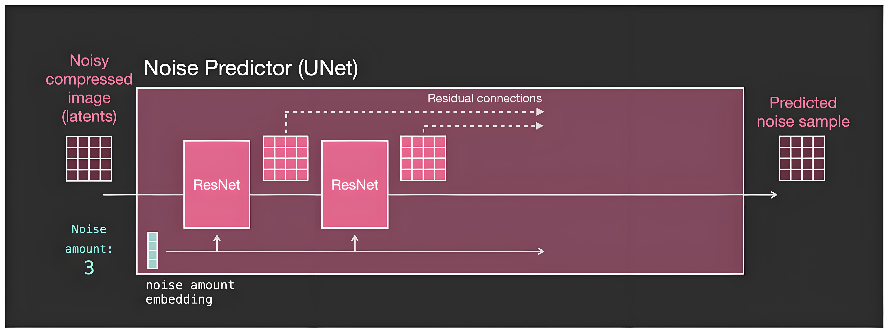

现在让我们加入文本 embedding 向量。此时，在 U-Net 内部可以看到：

- 在每一个残差网络 ResNet 模块后面加入了一个 Attention 模块，作为一种文本调节机制（Text Conditioning）把输入进来的 token embedding 融入到每一个处理阶段中；
- 在每一个处理阶段中，Attention 模块将这些文本特征合并到 Latent 潜空间的数据中，发往下一个 残差 ResNet 模块。然后下一个残差 ResNet 模块在处理的数据中就包括了更多的文本信息了。也就是说 Diffusion 的反向生图过程就掺入了指定语义的文本信息了。U-Net 将按照文本的语义信息来进行噪点的逐步去除工作。

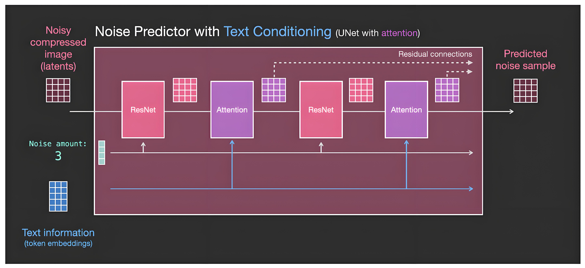

于是，我们现在有了三个数据作为 U-Net 的输入，分别是含噪点的图的矩阵（下图中左侧深红色网格）、噪点强度数值、文本 token embedding 矩阵（下图中蓝色网格）。而输出依旧是含有某种噪点强度级别的图像（下图中右侧深红色网格），也是以矩阵方式来表达，只不过这个噪点强度要比输入之前的降低了一些。

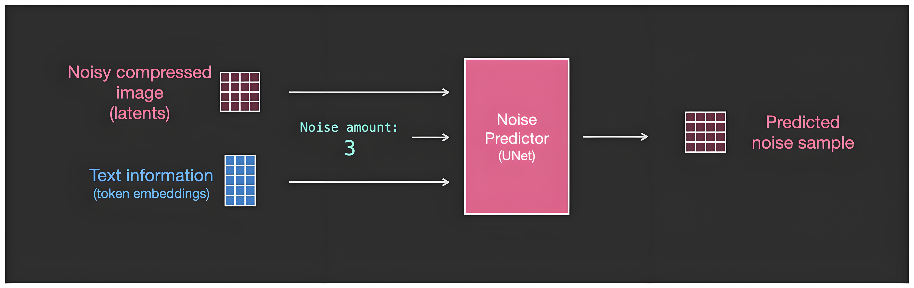

于是，最终生成的图像就是我们通过提示词可以控制的图像了。

## 2.2 图像信息创建器

### 2.2.1 前向过程（训练过程）

如之前所述，Diffusion 扩散模型生成图像（反向过程）的过程中最关键地方是我们**事先拥有了一个强大的 U-Net 模型**。这个模型预训练的过程可以简述为以下几个步骤。

假设我们有了一张照片（下图中1），并额外生成了一些随机噪点（下图中2），然后在若干噪点强度中选择其中某一个强度级别（下图中3），然后将这个特定强度级别的噪点加到图片中（下图中4）。这样，我们就完成了一次典型的样本的训练。（注意，噪点并不是直接在像素维度加到图片上的，而是在潜空间中加到图片的潜空间数据矩阵中的。这里的噪点图只是为了方便大家理解。）

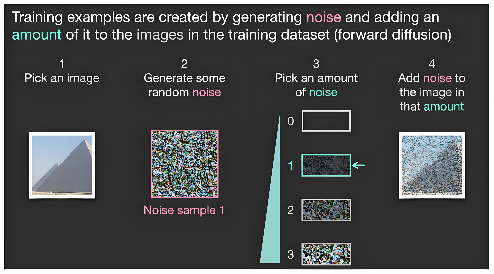

然而，仅仅一幅图的一次训练是远远不够，我们需要许多许多这样的图来进行多次训练。

下图演示了第二次，采用另一张样本图片训练的情况。与第一次训练图片不同的另一张照片（下图中1），另外生成了一些随机噪点（下图中2），然后在若干噪点强度中选择其中某一个强度级别（下图中3），注意第二次和第一次选择的噪点强度级别不同（意为每针对一张训练图像采用的噪点强度为随机，但这个随机的强度被记录了下来）。然后将这个特定强度级别的噪点加到图片中（下图中4）。这样，我们就完成了第二次典型的样本的训练。

当然，以上只是简化了噪点强度到4个级别（图中 0、1、2、3，四个噪点级别档位）以方便理解。在实际训练过程中，我们可以做到把噪点细分为几十个强度级别，以便我们为单一一张图片就可以进行几十次的不同噪点强度的训练，然后再对不同的图进行同样的训练。最终这些图像和不同阶段的噪点训练样本就汇聚成了一个巨大的训练数据集。

Input 数据集为大量不同噪点强度级别的图像，Output（Label 标注结果）数据集为大量不同的纯噪点图。然后输入给 Diffusion 中的 U-Net 模型进行监督学习，以完成对 U-Net 的模型训练。

这样的图片数据集对于 Stable Diffusion 的基础大模型训练来说需要多少呢，之前讲过，有 23 亿图文对之多。

这个数据集训练要想成功，它的体量必须做到十分巨大，以便可以应付我们对 Diffusion 生图的各种要求。对于Stable Diffusion 的基础大模型来说，V1.5 版本的模型时在几百个英伟达 Nvidia A100 GPU 上，用了23亿张图片来训练，这些图片基本是 512*512 像素的分辨率，耗时几十万个 GPU 小时训练出来。

而最新的 XL 版本则用了几倍于 V1.5 规模的样本图片数，以及每张 1024*1024 的分辨率。几十亿到百亿规模，如此巨大的训练数量，意味着 Stable Diffusion 阅览并记住了人类文明走到今天累计最多的图像数据，且都是每一张图都是有文本解释标注的。所以，这也是 Stable Diffusion 能够印象派地生成出任何你想要的图像的根本原因。

在如此巨大的数据集上训练出的强大的噪点预测器 U-Net ，便有能力在 Diffusion 的反向生图过程中，将噪点图逐步迭代去噪，转化为一张完美的图像。

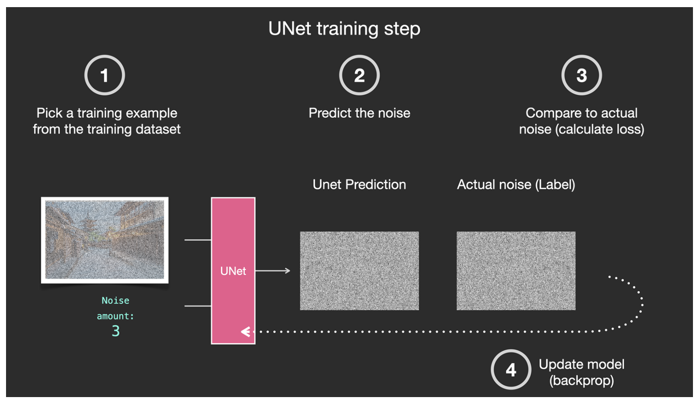

我们进一步细化解构 U-Net 的训练过程：

- 第一步，从庞大的数据集中选择一个训练样本，通常为某一个噪点强度级别下的图像样本。
- 第二步，通过 U-Net 预测该噪点和噪点级别。
- 第三步，与实际图片中的噪点做对比。
- 第四步，反馈给 U-Net 第三步中的噪点对比差异。以便让 U-Net 调整参数后提高预测能力。

这是一种典型的“监督学习”过程。

### 2.2.2 反向过程（生成过程）

反向过程就是通过一个全是噪点的潜空间图像，一步一步迭代地去除噪点来生成图像。

**经过训练的噪点预测器 U-Net 可以预测噪点和该噪点所处的强度级别（Noise amount），那么这个 U-Net 就有能力移除这些噪点，以生成每一步迭代的结果，即含有更少噪点的图像，直至最后生成不含噪点的完美的图像**。

进一步详细解释这一过程：

我们用之前给出的简化例子中的最大级别噪点（Noise amount=3）来作为最开始的第一步。那么此时输入一个全噪点图（下图中最下册是全噪点图）， U-Net 就可以给出噪点和噪点级别（下图中红框圈起来的噪点），并从输入的噪点图中去除这一部分噪点，使之变为更少一点噪点的图（下图中最左侧 Slightly de-nosied Image）。

然后再重复这一过程，每次都去除一个级别的噪点，一个全噪点图像就被一层一层地去噪点成为一个无噪点的、只有图像内容的图片了。（在实际的运行过程中，不可能只像这些简化流程图中仅有四步迭代，而是最起码有50步，高达100步。）

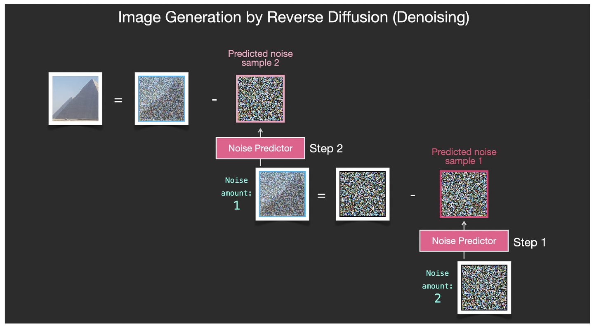

生图的过程发生在下图中粉红色的部分，即图像信息创建器（Image Information Creator）组件中。这部分同时包含了两个输入，见下图：①从文本编码器（ CLIPText模型）输出过来的 Token embeddings 矩阵（图中蓝色网格），和②随机的初始化图像信息矩阵，即潜空间的噪点图（图中透明网格），然后经过图像信息创建器（Image Information Creator）处理后输出③处理过的潜空间图像信息矩阵（图中粉色网格），最终交给图像解码器来绘制成图像。

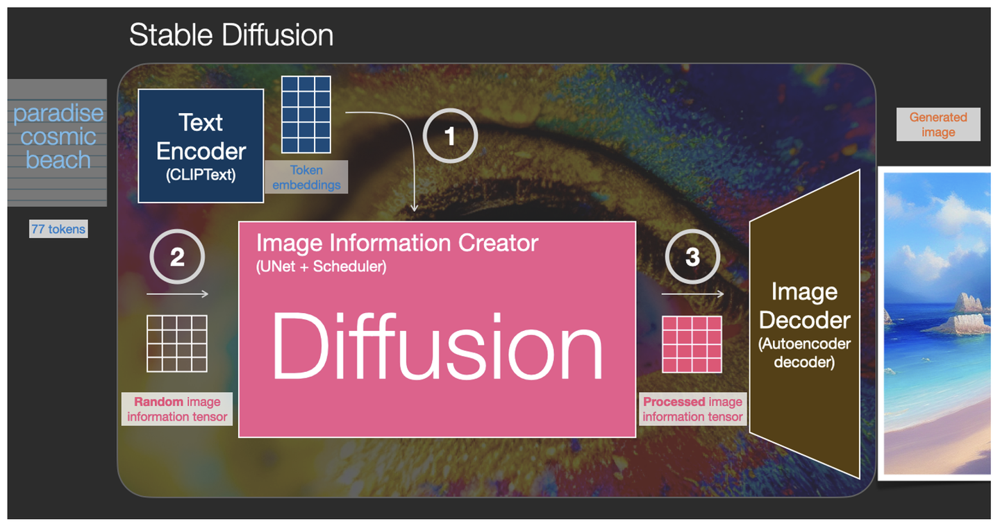

输入① ②，再输出 ③，这些步骤不是一次性完成的，而是一个反复迭代多次的进程 ，每一次迭代都会去掉部分噪点并添加更多与目标图片相关的信息。这便是“Diffusion 扩散”的反向生图过程。

当反向生图过程发生时，每迭代一步就引入一个 U-Net 预测噪点矩阵，并用之前一步包含噪点的图片减去这个预测噪点矩阵，产生一个“更接近结果”的、噪点更少的图片。50或100步迭代后，便最终生成出了结果，一个不带任何噪点的图片从潜空间矩阵中被解码出来。

所谓“更接近结果”的意思就是：**这个图片更接近预先训练好的大模型中抽取出的所有与输入文本语义相关的图像在潜空间中的表达**。

下图我们可以看出，**CLIP 文本语义的矩阵（图中蓝色网格）和 Diffusion 扩散模型中 U-Net 各个模块的预测噪点矩阵给 Diffusion 的多次迭代过程提供了不断校准图像信息的能力**。

Image Information Creator 模块内部是至少是 50 个U-Net 组成的迭代串联模块组合。在实际模型运行过程中，可以在每一次迭代步骤后添加一个检查点，以查看图像中的噪点被逐渐去除的效果。比如在第 1、2、4、5、10、30、50 步后查看，就会发现，它呈现如下图中的状态。

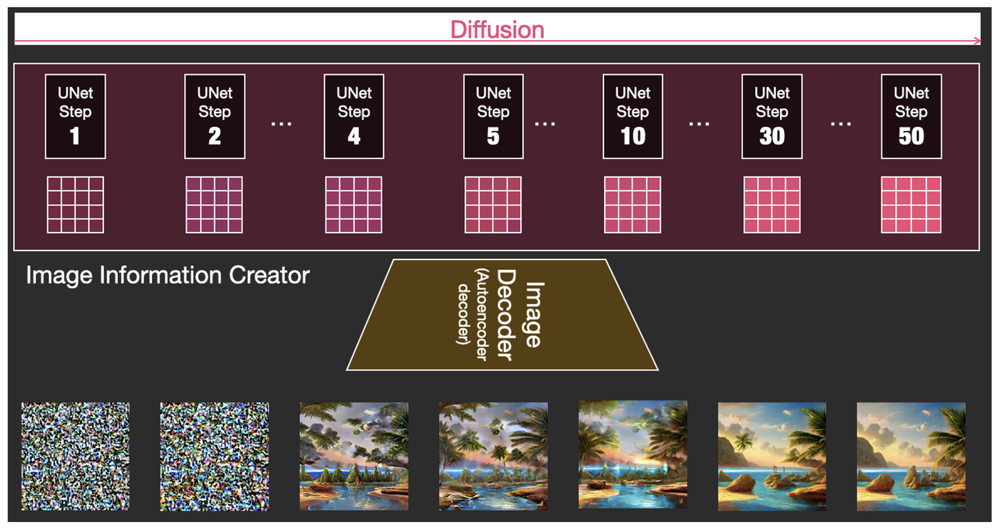

### 2.2.3 风格迁移

> 当我们从噪点图像中去除一部分噪点后，得到的图像更接近于之前在训练阶段（前向过程）输入给大模型的训练样本图像。但是又不是 100% 等同于原样本的图像，而是与原样本图像同时符合潜空间中一定数据结构分布规律的图像，即风格极为类似的图像，这就是“风格迁移”。

所以我们便能意识到，**图片最终呈现出来的内容和风格，完全是取决于 U-Net 网络当初在训练阶段固化下来的风格**。每一个强度级别的噪点都和当初 U-Net 被训练时的样本图片在潜空间中有数据结构上的相似度，这便是风格迁移能够成功的关键。

这就好比我们人类的艺术家在画画时多多少少都会受到之前鉴赏过的其他画作影响，或收到他看到的大自然的景象的影响。这世界上，没有一个艺术家是从一出生就是瞎子情况下，在没有任何视觉积累的情况下就能画出画作的。

当艺术家看过成千上万张画作之后，他的大脑也如 Stable Diffusion 模型一样被训练过了，然后便能根据自己内心的指令，创作出一幅新的画出来。这样的风格迁移，对于人类、对于AI来说都是异曲同工的。

风格迁移，无法用公式去解释，就好比我们同样无法用公式解释艺术家大脑里的每一个神经元是怎样运作的一样。但我们却可以解释风格迁移的逻辑结构。

比如，拿真实场景的照片来说，不同的照片中都是暗含了某些规律的，这些规律是符合真实世界中天空的颜色为蓝色，人有两只眼睛，猫有尖耳朵等等这些规律的，所以生成的具体图像风格也自然取决于该模型受到的训练数据集中这些照片的潜在规律。

比如对下面这幅图的标注，人类大多数会按照人类自己的语言认知标准去给该图片打出各种标签，比如：马、草地、棕色、树林...等等。但实际上这幅图像上有更多更广阔的与马相关联的有价值的信息，比如：马站在草地上面而不是在草地下面、马的头部和尾部分别在身体的前后两端，之所以是马而不是大象是因为马的耳朵眼睛鼻子嘴巴的比例是这样的、马的身体比例是这样的...等等等等，在数以千万计的马站在大自然环境中的照片进行集中机器学习时（几十万个训练集图片），甚至有很多我们人类绞尽脑汁也难以发觉的更潜在的隐藏规律都可能被 AI 挖掘出来。正因为这些种种的规律组合到了一起，才使得所有马的信息在“潜空间 Latent Space”中集中在一了起，成为了某种数据结构。

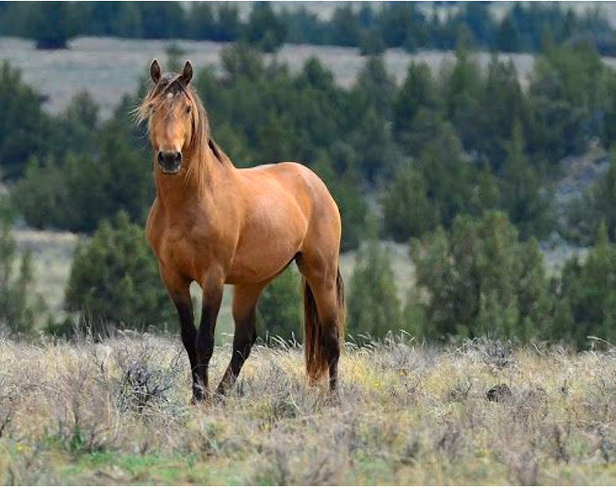

这样带来的好处显而易见，一来这样的隐藏规律的寻找对于人类来说是无法企及的，因为太多了。光是一副图像中的各种元素之间排列组合出的各种逻辑结构都过于繁杂，况且逻辑关系也过于隐蔽，并且对于不同的人来说还会因人而异得出不同的结果。二来，这有点像道德经上所讲的“道可道非常道，名可名非常名”的道理，一旦你给一个事物命名了，那么你就相当于给他标签化了，而一旦标签化，就很容易以偏概全，无法达到事物本来的真理层面。与其用人类有限的语言的文字去打标签，不如直接用更印象派的数据结构去记录所有规律的总和。

哪怕是象手写数字这样的最简单的图像，通过 VAE 转化成潜空间的可视化数据结构，也可以让人看出来，拥有不少的规律在其中。

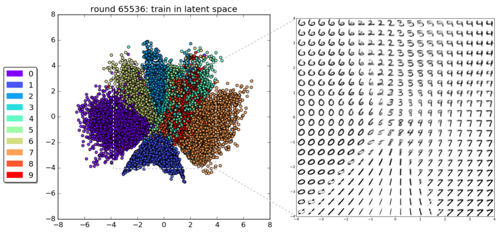

通过VAE模型65000多次的学习，可以看到它已经可以把0~9的手写数字在潜空间中区分开来了，并且它把这些数字通过某种规律展示在了一个 2D 空间之中，展示为某种空间中的规律排布。

简单的手写数字尚且如此，那么数万张马的照片将呈现超级复杂的潜空间结构。

那么“风格迁移”就是在如此复杂的潜空间结构中找到普遍的规律，并根据输入反向生成图像。这种反向生成图像可以用下面这两张图来做一个简单的示意。假如你训练的是三角、圆和正方形，那么“同时符合潜空间中一定数值规律分布的图像”这句话的意思就是：采样后生成出来的图形是一个介乎于三角、圆和正方形之间的图像（下图左侧箭头所指），基本融合了三个形状的特征。如果采样点足够多，还会发现更多的中间状态的图形，这些图形都遵循着某些“风格迁移”的数据规律。

## 2.3 图像解码器

为了找到图片与图片之间潜在的联系与规律，**Stable Diffusion 的运行不是在图像本身的像素维度上来进行的，而是在图像的压缩版本即“潜空间”中进行的**。这种压缩和解压缩过程是通过 Autoencoder Decoder 自动编码器完成的。

自动编码器中的 Encoder 编码器将图像压缩到潜空间中，然后经过 Diffusion 模型对图像信息的处理后，再把潜空间中的信息交给 Decoder 解码器来重建图像。这个 Autoencoder Decoder 自动编码器其实就是一个VAE（Variational Autoencoder 变分自编码器）。

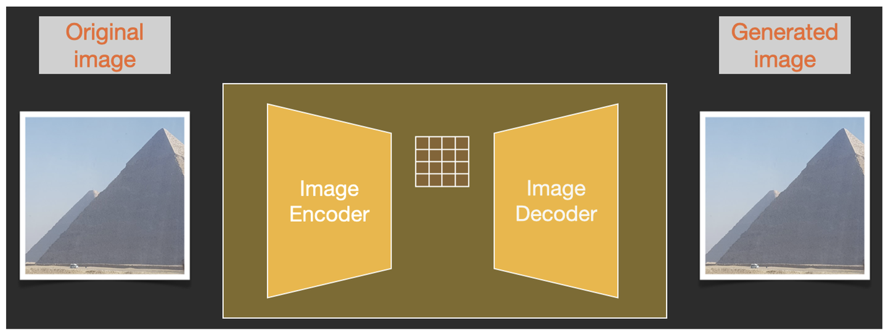

由于噪点也是以潜空间中的噪点形式存在的，它在上图中用黄色网格来表示，即噪点的向量数据矩阵。因此，噪点预测器 U-Net 实际是被训练用来预测压缩后的潜空间中的噪点数据矩阵的。

Diffusion 的前向过程是把图片压缩到潜空间中，逐步加噪点矩阵，生成新数据，来训练噪点预测器 U-Net 。一旦它被训练成功，我们便可以利用它通过反向过程来逐步去噪点生成图像。

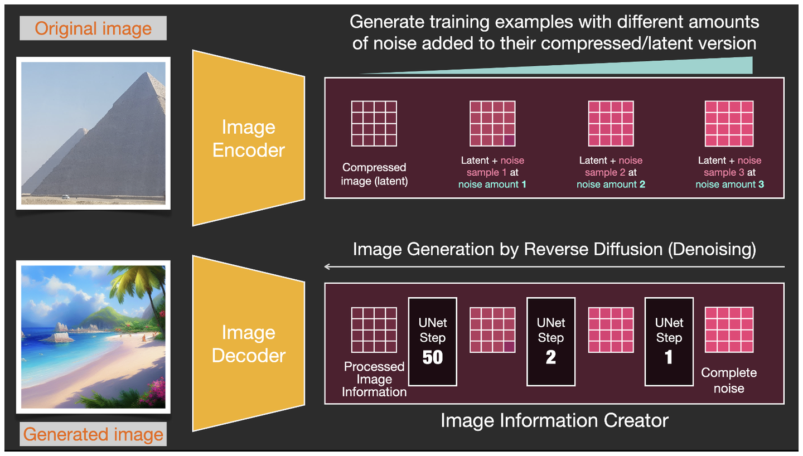

# 3、沙画

最后，我们用一个特别好理解的比喻来回顾一下 Stable Diffusion，并巩固对它的理解。

**Stable Diffusion 可以理解为一个巨大的沙画装置**。沙子一直是那些沙子，但每次用沙子作出来的画都不一样，即使同一个主题、同一套提示词，沙子的细节都会不同，所以没有一次生成的图像是 100% 和其他一样的。毁掉画作沙子散乱后的状态每次也不一样，所以也没有任何潜空间中的噪点是一样的。

U-Net 的训练的过程就是将已经成行的沙画，轻微地持续震动画板，组成图像的沙子慢慢地逐渐散乱开来。画板每震动一次，沙子便更加地散乱，原来形成的图像逐渐模糊。这就相当于 Diffusion 的前向训练过程，每次添加一个级别的噪点，让 U-Net 此时的沙画被震动次数和散乱的状态。这个过程直至N次震动后，一副完整的沙画被变成了一片散漫的沙子。U-Net 从中识别沙子们是如何从聚集的图形状态一步一步地散乱成完全无序状态的，并将每个变化阶段的散乱状态浓缩成一个数据模型。

单一一粒沙子的变动或许没有什么规律可言，甚至成百上千的沙子的运动也未必可以总结出什么规律。但巨量的几十上百上千亿的沙粒组合像非洲草原上的角马迁徙一样，看起来虽然散漫但其中却有着某些规律。况且这样的迁徙进行了几十亿次后，U-Net 便从潜空间中看到了沙子的聚散离合隐藏的联系与规律。比如，一条线段，需要附近多远出的沙子、需要多少沙粒、通过多少步的移动、各自走到线段的什么位置，最终形成一个线段。

于是在反向的去噪点的过程中，强大的 U-Net 就有能力把散乱的沙子凝聚成最小的有意义的图像单元，比如一条线、一个三角形、一个图形轮廓、一个渐变等等，而这些基础图形之间也有相关联的逻辑，所以最终汇聚组成一幅很大的图像。

这是在2D平面上，如果在3D的空间，就是沙雕了。所以一点也不用担心SD在生成3D模型的过程中是否能够发挥类似的作用。

如果再将不同序列的3D沙雕连贯起来，就变成了动画，如果是完全拟真的3D，最终生成的动画就变成了真人大片的电影，SD的未来可以说在AIGC领域前途无量。

一个人类沙画家与 Stable Diffusion 沙画家的基础技能类似，但实力相差悬殊。人类沙画家的大脑本身就是一个神经网络模型，只不过这个模型训练的数据量要比 Stable Diffusion 差了太多太多。

Stable Diffusion 模型在经过了几十亿张图像文本对的训练过后，毋庸置疑是目前为止，人类文明诞生到今天阅览研究图像最多的智能体，多的不是一点半点，差距十分巨大。设想一下一个天才的人类从出生开始每天研究10张图，对图像与标注文字的关系了如指掌，对每张图的内容都记忆历久弥新永不遗忘任何细节，且对已经看过的所有图像之间的关系，图像中每个元素与其他图像中元素间存在的含义联系也要了如指掌，这样连续研究100年直至死亡，他一生中阅览的总数也不过 36.5 万个图文对。这个数字则是仅 1 个月时间内训练出来的 Stable Diffusion 模型阅览总数的不到万分之二。别说100年后，仅仅 3 年后 Stable Diffusion 的训练规模还将达到更加难以想象的地步！

100年后，一个如此刻苦研究的天才人类沙画家，带着他 36.5 万个图文对的记忆与处理能力连同他的躯体一同离开了这个世界，他脑中的神经网络无法复刻给他的后代。然而，这个实际上比365万这个规模要大上万倍的浩如烟海的图像数据依旧安详地躺在超级计算机的存储器里。并且就在当下，这个世界还在以每天数以亿计的新图像的产生速度快速地增长中。这些数据从人类文明诞生以来逐渐累加到现在这个规模，从来就未曾找到过一个单一肉身的个体有能力全部消化这些信息和继承这些信息。可是人类的每一个肉身的个体终究都要消失，人类文明的延续也并不是靠每个计算机里的硬盘，而是靠智能体。

10年后，Stable Diffusion 大模型累积的学习能力可能已经进入了万亿规模。100年后，Stable Diffusion 早已成为历史，它的替代版本可能演化出了几十上百个新生代。考虑到不仅仅限于静态图片和存储的视频，而是给这些智能体接入摄像头后，它们实时查看这个地球甚至太阳系的每一个角落。我们作为肉身的人类个体需要的图像，怎么能不如此丝滑地轻松地通过 AI 展现在眼前呢？！

最后，仅仅是 10 年后，脑机接口逐渐成熟，加之 AIGC 所产生的这个 C-Content 可以包揽人类的所有感受器眼、耳、鼻、舌、身的感受信息，我们极有可能不通过眼睛就能直接“看”到无穷无尽的神奇“世界”，不通过耳朵就能直接“听”到这万籁喧嚣的“世界”……这个“世界”是不是我们每个人心中想要的那个，尚无法确定，但可以肯定一点，这个“世界”足可以乱真，以至于让我们沉浸其中，认为一定是一个“真实的世界”，是我们的一闪念就可以毫无延迟地生成出来这个所谓的“真实的世界”。

这可能就是相由心生的真正含义吧。

