# 1 Diffusion 扩散模型

Diffusion 扩散模型的早期形式可追溯至 2015 年的论文《Deep Unsupervised Learning using Nonequilibrium Thermodynamics》，但当时并未获得广泛关注。

Ho 等人在 2020 年提出的《Denoising Diffusion Probabilistic Models》（DDPM）使扩散模型得到更多关注。该论文在 CIFAR-10、LSUN 等数据集上展示了有竞争力的生成质量，扩散模型随后成为 AIGC 图像生成的重要技术路线。

可以把扩散过程类比为将一滴墨水滴入清水：墨迹会逐渐散开，直至近似均匀分布。扩散模型的前向过程不断添加噪声；生成模型则学习这一过程的逆操作，即逐步去噪以生成图像。

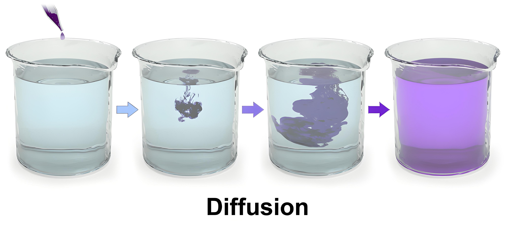

Diffusion 模型包含两个相互对应的过程：

- **前向扩散**：按照预先设定的噪声日程，逐步向图像或潜变量添加高斯噪声。训练时利用这个固定过程构造带噪样本。
- **反向扩散**：由训练好的去噪网络和采样器逐步更新带噪状态，最终生成符合数据分布的样本。

## 1.1 前向扩散

前向扩散会将图像逐步加噪，直至其接近高斯噪声。

前向过程本身不需要训练。训练时，通常使用 U-Net 作为**噪声预测器**（Noise Predictor），学习在给定噪声水平下预测被加入的噪声。

训练过程如下：

1. 选择一张训练图像，例如一张猫的照片。
2. 随机采样时间步和高斯噪声。
3. 根据该时间步对应的噪声强度，将噪声加入训练图像或其潜变量，得到带噪样本。
4. 将带噪样本、时间步和条件信息输入噪声预测器，让它预测加入的噪声。
5. 将预测噪声与实际采样的噪声进行比较，并据此更新 U-Net 参数。

随着训练进行，噪声预测器会逐步提高预测精度。

## 1.2 反向扩散

训练完成后，可以使用噪声预测器进行采样：

1. 从一个高斯噪声张量或潜变量开始。
2. 让噪声预测器根据当前状态、时间步和条件信息预测噪声。
3. 由采样器（Scheduler）依据预测结果将当前状态从 $x_t$ 更新为 $x_{t-1}$。
4. 重复这一过程，直至得到可解码为图像的低噪声潜变量或图像。

反向扩散就是生成图像的过程。模型并不记住某一张具体训练图像的每一步变化，而是学习不同噪声水平下的去噪规律，使样本逐步向训练数据分布中更可能出现的区域移动。

## 1.3 条件作用（Conditioning）

无条件扩散模型能够生成训练数据分布中的样本，但无法直接控制结果类别。**条件作用**的目的，是将文本、类别标签或参考图等条件输入去噪网络，以引导生成结果。

下面以文本条件为例。Stable Diffusion v1.5 使用 CLIP 的 BPE 分词器将文本提示转换为 token ID，再由文本编码器生成上下文化的 token embeddings；其文本编码器输出的向量维度为 768。这些向量会作为条件输入 U-Net。

文本条件通常来自文本提示词（text prompt）。例如，输入“cat”可引导生成与猫相关的特征。常见实现中的 negative prompt 会作为负条件参与 classifier-free guidance，以降低相关特征在生成结果中的权重，而不是让模型按自然语言逻辑直接理解“not dog”。

# 2 Stable Diffusion

常见的生成模型包括 GAN、Flow-based Model、VAE、Energy-Based Model 和 Diffusion Model。扩散模型通过多个去噪步骤进行采样；它既可以直接在像素空间中运行，也可以在压缩后的潜空间中运行。

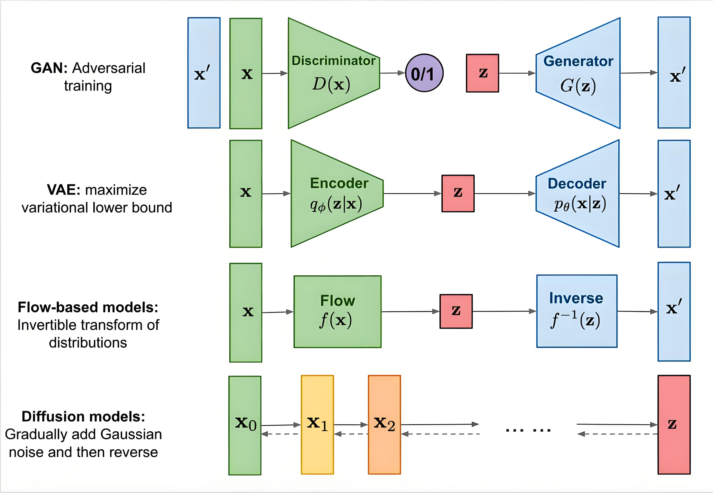

像素空间扩散在高分辨率下计算成本较高，因为每个采样时间步都需要处理高维图像。Latent Diffusion Model（LDM）通过在压缩潜空间中执行去噪，显著降低了这一成本。

Stable Diffusion 在 2022 年得到广泛关注。它是一组采用潜空间扩散设计的文本生成图像模型：LDM 是一类在潜空间中执行扩散的建模框架，而 Stable Diffusion 则是该框架下的一组具体实现。近年来，基于 Transformer 的扩散模型（如 Stable Diffusion 3 和 FLUX）已成为重要发展方向；理解经典的 U-Net 潜空间扩散架构，仍是掌握生成式 AI 基础机制的重要前提。

除非另有说明，本文以下内容以 Stable Diffusion v1.x/v1.5 中典型的 CLIP 文本编码器、U-Net 去噪器和噪声预测（ε-prediction）设置为例。后续版本的文本编码器、去噪骨干网络或训练目标可能不同。

在这一典型架构中，Stable Diffusion 由三类核心神经网络模块构成：

- **CLIP 文本编码器**：将提示词转换为可供模型处理的文本语义表示。
- **条件 U-Net 去噪器**：接收带噪潜变量、时间步和文本条件，预测噪声。
- **VAE 编码器与解码器**：编码器将图像压缩为潜变量，解码器将去噪后的潜变量重建为图像。

采样器（Scheduler）负责根据 U-Net 的预测迭代更新潜变量，它是一种采样算法，而不是神经网络。

## 2.1 文本编码器

### 2.1.1 CLIP 的训练

**CLIP** 全称为 *Contrastive Language–Image Pre-training*，可理解为图文对比预训练模型。它由图像编码器和文本编码器组成，通过对比学习将匹配的图像与文本映射到相近的表示空间。

CLIP 的原始论文使用了约 4 亿个来自公开网络来源的图文对。论文并未完整披露所有数据来源的构成；图像附近的文字、标题或替代文本都可能成为图文对中的文本信息（HTML 的 `alt` 属性主要用于为无法显示图像或使用辅助技术的用户提供替代文本，并非只服务于搜索引擎）。

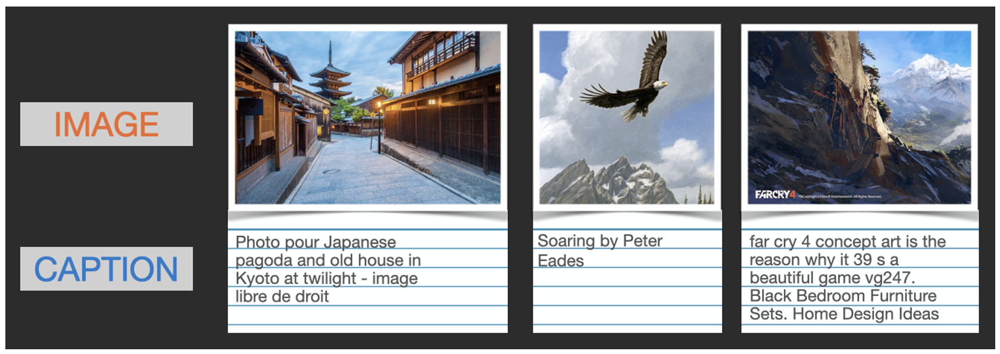

在一个训练批次中，图像编码器（Image Encoder）将每张图像映射为图像向量，文本编码器（Text Encoder）将对应文本映射为文本向量。

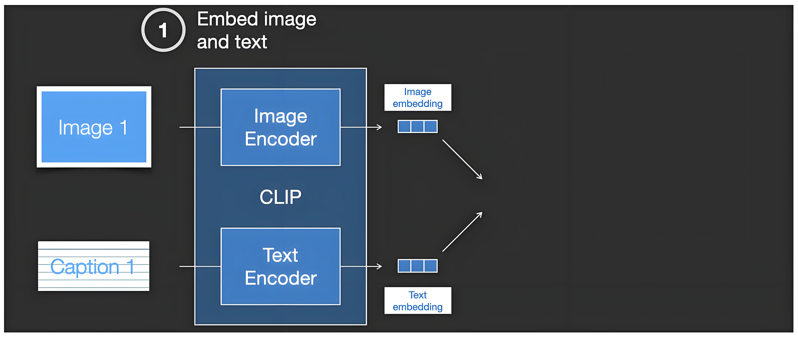

训练时，模型计算批次内每个图像向量与每个文本向量之间的余弦相似度，形成相似度矩阵。正确配对构成正样本，批次内其他不匹配的图文组合构成负样本。

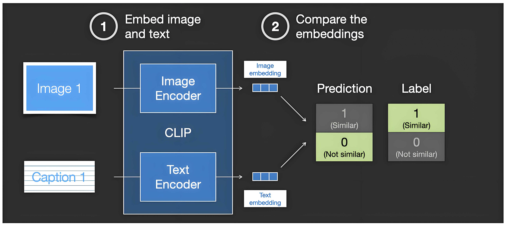

CLIP 使用对称的对比学习损失：提高正确图文配对的相似度，降低错误配对的相似度。损失函数通过梯度同时更新图像编码器和文本编码器的参数。

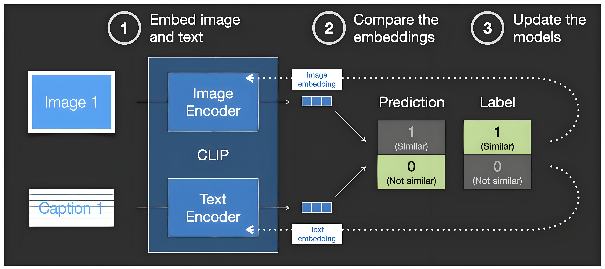

经过大量批次的训练后，两个编码器学会将语义匹配的图文映射到相近的表示空间。负样本并非额外孤立训练的步骤，而是通常由同一批次中的其他图文配对自然提供。

### 2.1.2 CLIP 的使用

为了让文本影响图像生成，Stable Diffusion 将 CLIP 文本编码器输出的 token embeddings 作为条件输入 U-Net。U-Net 通过交叉注意力机制将文本语义融入去噪过程。

先看不含文本条件的 U-Net。其输入通常包括带噪潜变量和表示噪声水平的时间步。

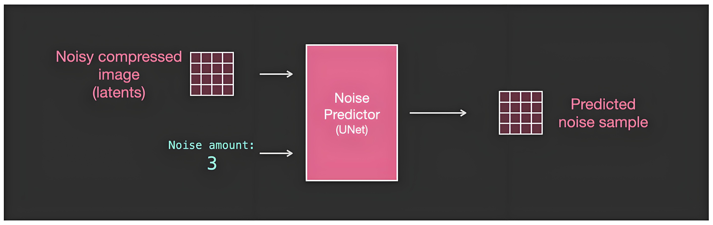

进一步拆解可以看到：

- U-Net 由多个 ResNet block 组成，用于在不同分辨率下变换潜空间特征。
- 编码器和解码器同分辨率层之间通过跳跃连接（skip connection）传递特征；这与 ResNet block 内部的残差连接不同。
- 时间步（timestep）会被编码为时间步嵌入（timestep embedding），并注入各个 ResNet block，使网络感知当前噪声水平。

加入文本条件后，U-Net 会在指定分辨率层插入交叉注意力模块（cross-attention）：

- 交叉注意力模块将潜空间特征作为查询，将文本 token embeddings 作为键和值，从而把与当前图像区域相关的文本信息融入特征。
- 经由这些模块传递的潜空间特征会逐步吸收文本条件；U-Net 仍然输出当前时间步的预测噪声或其他等价参数化目标。

因此，条件 U-Net 的主要输入包括带噪潜变量、时间步和文本 token embeddings，输出为预测噪声矩阵。采样器再依据该预测更新潜变量，而不是由 U-Net 直接输出一张“噪声更低的图像”。

这样，生成过程便能受到提示词的语义引导。

## 2.2 去噪与采样过程

去噪与采样过程由条件 U-Net 和采样器共同完成：U-Net 预测噪声，采样器据此反复更新潜变量。它是一套生成流程，而不是独立的神经网络模块。

### 2.2.1 训练过程

生成阶段依赖预先训练好的 U-Net。以潜空间扩散为例，训练过程先由 VAE 编码器将训练图像映射为潜变量，再在潜变量上执行前向加噪。

一次训练通常包含以下步骤：选择一张训练图像，随机采样高斯噪声和时间步，再按该时间步对应的噪声日程合成带噪潜变量。U-Net 接收带噪潜变量、时间步和文本条件，并学习预测实际加入的噪声。

每个优化步骤都会重新随机采样时间步和噪声。图中的少量噪声等级仅用于教学简化；DDPM 的噪声日程可包含数百或上千个时间步，但训练时通常只为当前样本随机采样其中一个时间步。

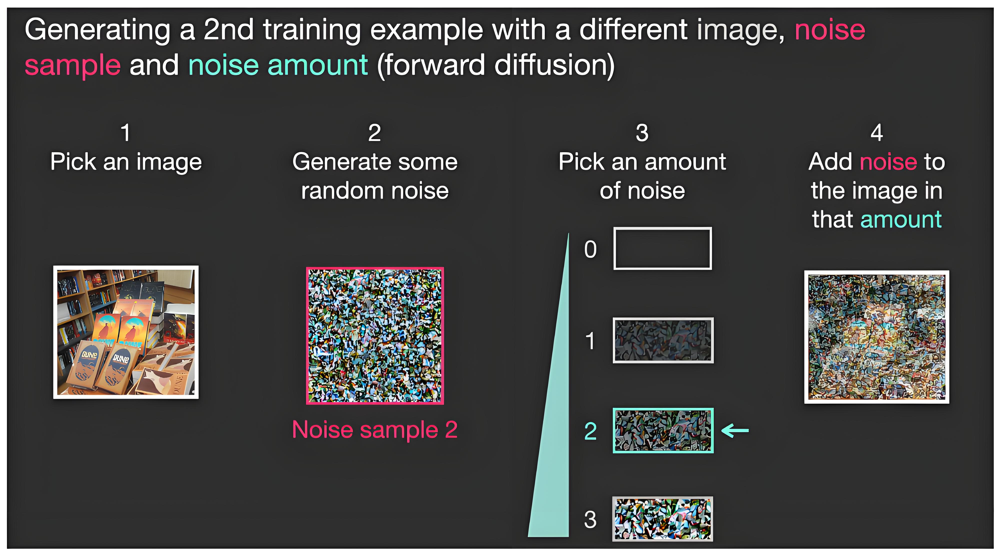

因此，带噪潜变量和目标噪声一般在线生成，而不是预先存储为静态的 Input 与 Label 数据集。原始图文数据提供图像及其文本条件，随机噪声则作为监督目标的一部分。

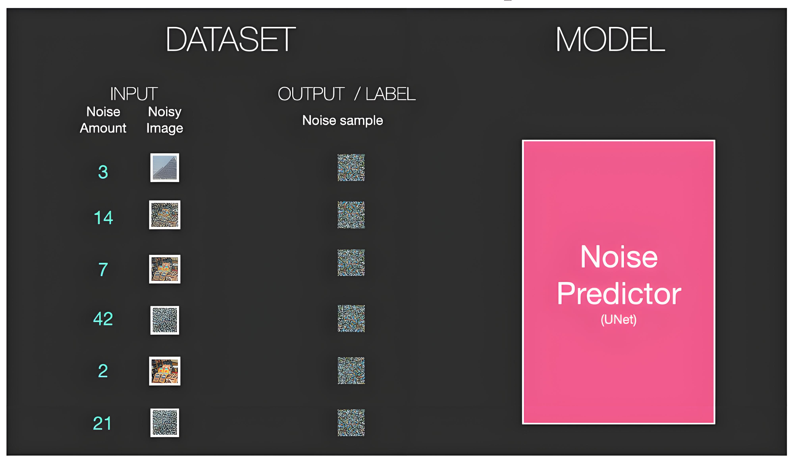

基础模型通常需要大规模、经过筛选的图文数据进行训练，但训练数据量、分辨率、硬件和训练时长会因模型版本与训练阶段而异。SDXL 面向 1,024 × 1,024 分辨率设计；具体训练规模应以相应论文或模型卡为准。

训练完成后，U-Net 能够在不同噪声水平下预测噪声，为采样阶段提供更新方向。

U-Net 的监督学习过程可概括为：

1. 从图文数据中选择一个样本，并随机采样时间步和高斯噪声。
2. 将噪声加入图像潜变量，得到带噪潜变量。
3. 输入带噪潜变量、时间步和文本条件，由 U-Net 预测噪声。
4. 将预测噪声与实际采样噪声进行比较，并反向传播损失以更新 U-Net 参数。

### 2.2.2 反向过程（生成过程）

反向过程从高斯噪声潜变量开始，通过多个时间步迭代更新，逐步生成符合文本条件的潜变量。

训练完成的 U-Net 会根据当前带噪潜变量、已知时间步和文本条件预测噪声。**采样器再结合噪声日程与预测结果，将当前潜变量更新到下一时间步。**

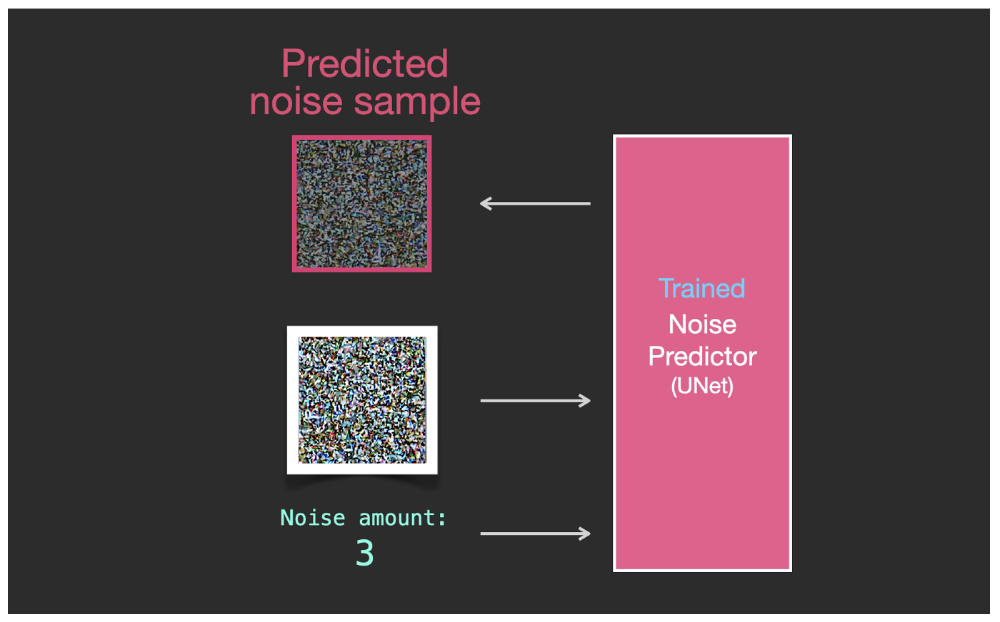

以教学图中的最大噪声等级为例：输入完全带噪的潜变量后，U-Net 输出预测噪声；采样器根据这一预测计算更低噪声水平的下一状态。这里的“去噪”是一次受噪声日程约束的状态更新，而不是简单地从当前图像直接减去预测噪声。

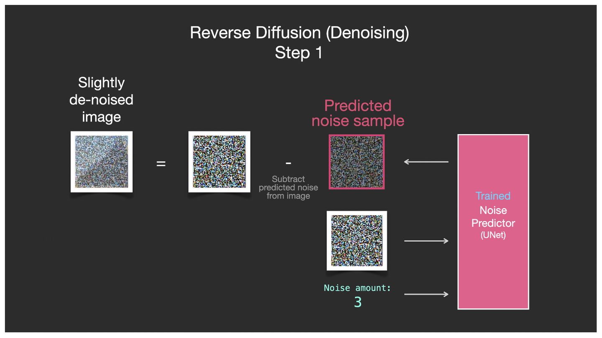

重复这一更新过程，潜变量会逐步形成与文本条件一致的结构和细节。采样步数由所选采样器及其配置决定，常见配置可以是几十步，也可以更多或更少。

生成阶段的输入包括 CLIP 文本编码器输出的 token embeddings，以及随机初始化的噪声潜变量。条件 U-Net 和采样器反复处理这两个输入，最后将得到的潜变量交给 VAE 解码器重建为图像。

每次迭代都会根据当前状态和文本条件校正潜变量，使其逐步符合模型学习到的条件数据分布。该生成机制不是逐张检索训练图像，通常会产生新的样本；但模型仍可能记忆训练数据，或生成与训练样本高度近似的结果。

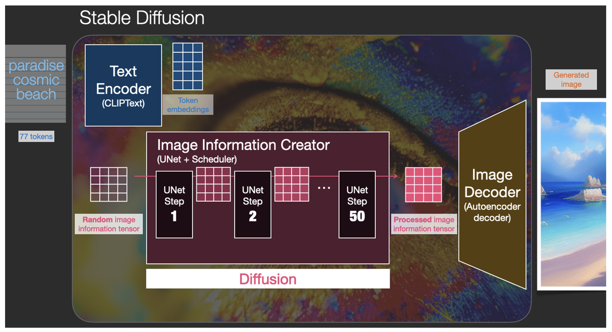

采样过程会在多个时间步重复调用**同一个参数共享的 U-Net**，而不是串联多个不同的 U-Net。可以在若干采样步保存中间结果，用于观察图像从噪声到结构与细节逐渐成形的过程。

### 2.2.3 条件生成中的风格控制

在扩散模型中，所谓的“风格”更多是指通过条件引导生成的视觉特征。这与传统计算机视觉中直接将内容图转换为特定画风的“风格迁移”（Style Transfer）有所不同。扩散模型的采样机制并非逐张检索训练集，通常会产生条件数据分布中的新样本；但结果仍可能与某些训练样本高度近似。

生成图像的内容与风格受多个因素共同影响，包括基础模型及其训练数据、文本条件、VAE、随机种子、classifier-free guidance 强度和采样器设置。U-Net 在其中负责根据当前潜变量和条件预测去噪方向，而不是独自决定所有视觉风格。

以真实场景中的马为例，大量图文样本可帮助模型学习与“马”及其场景相关的统计规律，例如局部纹理、轮廓、姿态和与背景的共现关系。这些规律以分布式、高维的特征表示存在，不能简单理解为“所有马的信息集中在潜空间的某一点”。

模型学习到的表示通常超出人工标签能完整概括的范围：标签可以指出“马”“草地”“树林”，而模型还会从数据中学习它们在空间布局、光照和尺度上的统计关联。学习到统计规律不等于理解真实世界的因果关系，因此生成结果仍可能出现不符合物理规律或常识的细节。

手写数字是理解潜空间的一个简化例子。通过 VAE 等模型，可以在低维教学可视化中观察到不同数字样本的聚集趋势；实际 Stable Diffusion 使用的是高维潜变量，不能将二维示意直接视为其潜空间的真实形状。

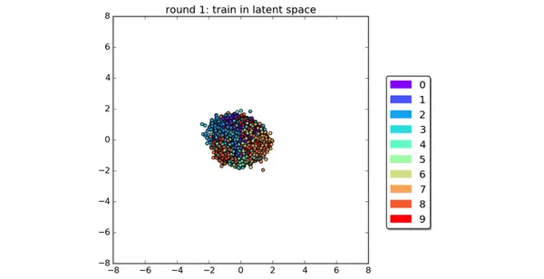

如果潜空间中的两个表示之间存在平滑路径，对其进行插值可能产生具有两端特征的中间样本。下图中的三角形、圆形和正方形示意了这种连续变化；它只是一种帮助理解采样与插值的简化图示。

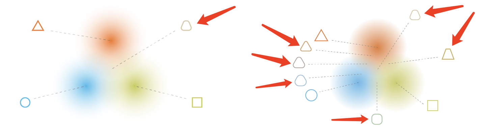

## 2.3 图像解码器

Stable Diffusion 属于潜空间扩散模型（Latent Diffusion Model，LDM）：主要的加噪和去噪计算不在像素空间进行，而是在由图像自动编码器压缩得到的潜空间中进行。相较于直接处理高分辨率像素，这能显著降低计算成本。

该自动编码器通常称为变分自编码器（Variational Autoencoder，VAE），由编码器（Encoder）和解码器（Decoder）组成。训练图像先经编码器转换为潜变量 $z$；扩散模型在 $z$ 上执行前向加噪与反向去噪；生成结束后，解码器再将最终的潜变量还原为像素图像。

噪声与潜变量具有相同的张量形状。训练时，按照选定时间步向潜变量加入随机高斯噪声；条件 U-Net 根据带噪潜变量、时间步和文本条件预测该噪声。图中的黄色网格只是对潜空间噪声张量的示意，并非可直接观看的噪声图片。

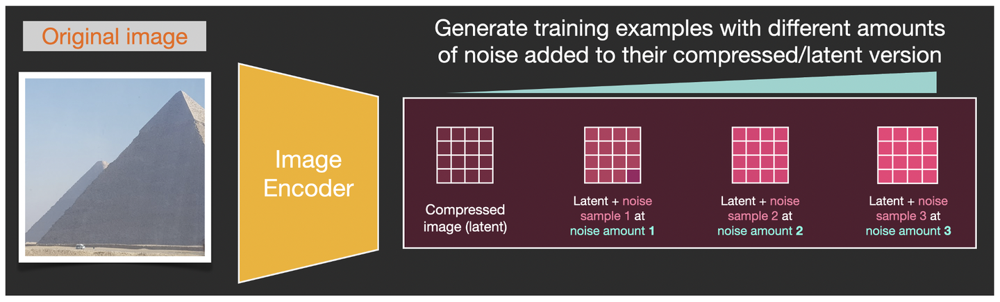

需要区分两个连续步骤：VAE 编码先将图像转换为潜变量，前向扩散随后才按照噪声日程向该潜变量加噪。生成时则从随机潜变量开始，由 U-Net 和采样器多步更新得到去噪潜变量，最后经 VAE 解码器生成图像。

# 3 沙画

沙画可以帮助理解扩散模型，但它只是一种近似比喻：这里的“沙粒”对应潜变量中的数值，并不对应图像中的一个个真实物体或像素。

可以把训练阶段想象为观察许多已经完成的沙画。对每一幅沙画，系统按照已知的规则施加不同程度的扰动，使画面逐渐变得难以辨认；同时记录扰动的强度和所加入的随机噪声。U-Net 学习的是：面对某一时刻的“扰动后沙画”、时间步和文本条件，怎样估计其中加入的噪声。它不会为每幅训练图保存一套复原步骤，而是在大量样本和时间步上学习一套共享参数。

生成阶段则从随机、无结构的“散沙”开始。U-Net 在每一步给出噪声估计，采样器据此更新当前潜变量，使其逐渐落入与文本条件相符的数据分布区域。不同随机种子会从不同的初始状态出发，因此即使提示词相同，生成的细节通常也会不同。

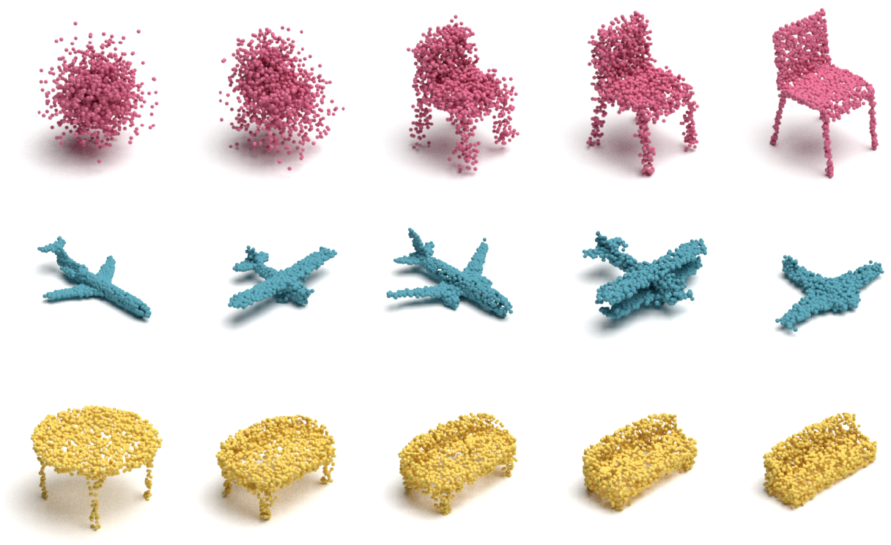

这个比喻还能说明一个重要边界：扩散模型生成的是符合训练数据统计规律的新样本，而不是从训练集中逐张取回原图。它并不意味着 Stable Diffusion 可以直接构建 3D 网格、生成连续视频，或保证生成内容的真实与正确；这些任务通常需要专门的模型架构、训练数据和评估方法。

