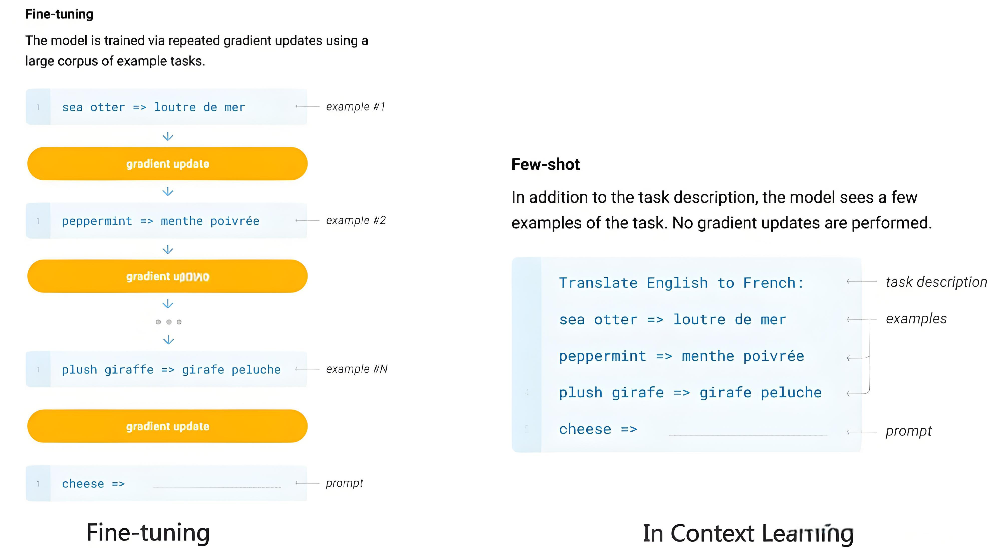
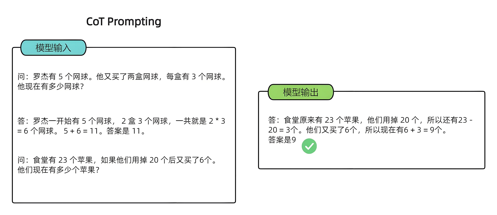
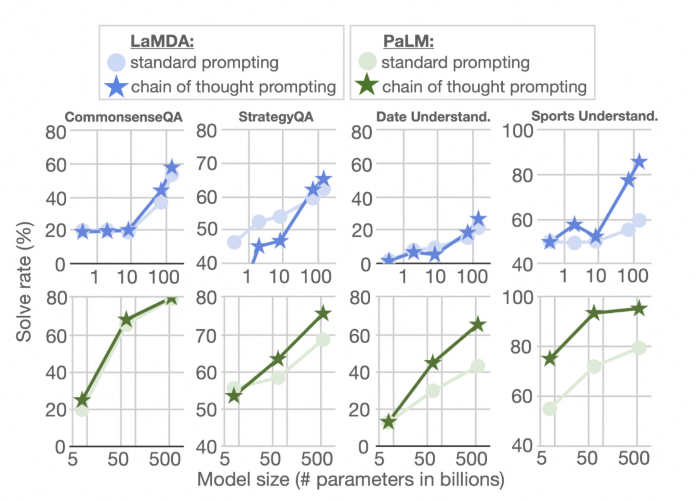
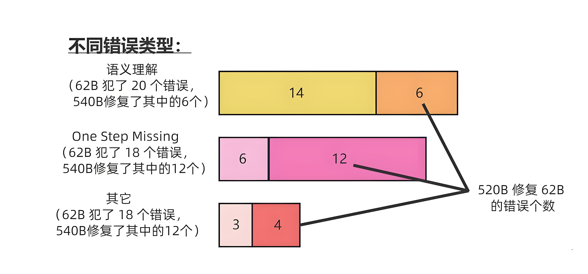

# 1、In-Context Learning

> In-Context Learning（简称**ICL**），又称**上下文学习**或**语境学习**，是一种在特定上下文环境中学习的机器学习方法。它**不需要调整模型的内部参数**，而是利用给定的示例（即上下文）来指导模型进行预测和分类。

本质上，ICL相当于**使用训练完好的语言模型估计给定示例条件下的条件概率分布模型**。模型通过学习示例中的输入输出对，理解任务的结构和规则，从而在未见过的数据上也能做出合理的预测。这一过程类似于人类通过观察示例来学习新技能。

ICL 的核心在于“**输入即训练**”。我们通过在 prompt 中写入一些信息，比如：

- 任务描述（例如：“请帮我翻译以下英文为中文”）
- 示例（例如：给出几个输入输出的例子）

然后，模型会根据这些内容去“模仿”或“推理”，生成符合要求的答案。

假设你想让模型做一个情感分类任务：

```
判断下列句子的情感是积极、消极还是中性。
Input 1: 我非常喜欢这部电影，剧情太棒了！
Output 1: 积极

Input 2: 这个产品一般般，没什么特别的。
Output 2: 中性

Input 3: 非常失望，完全不如预期。
Output 3: 消极

Input 4: 今天天气真不错，心情很好！
Output 4:
```

模型看到前三组例子后，就知道这是一个情感分类任务，并能推断出第四个句子的情感是“积极”。

In-context learning有以下几个优势：

- a) 若干示例组成的演示是用自然语言撰写的，这提供了一个跟LLM交流的可解释性手段，通过这些示例跟模版让语言模型更容易利用到人类的知识。
- b) 类似于人类类比学习的决策过程，举一反三。
- c) 相比于监督学习，它不需要模型训练，减小了计算模型适配新任务的计算成本，更容易应用到更多真实场景

## 1.1 ICL的神奇

如果你细想，会发现In Context Learning是个很神奇的技术。它神奇在哪里呢？神奇在你提供给LLM几个样本示例 `<x1,y1>,<x2,y2>....<xn,yn>` ，然后给它` xn+1` ，LLM竟然能够成功预测对应的 `yn+1` 。听到这你会反问：这有什么神奇的呢？Fine-tuning不就是这样工作的吗？你要这么问的话，说明你对这个问题想得还不够深入。



Fine-tuning和In Context Learning表面看似都提供了一些例子给LLM，但两者有质的不同（参考上图示意）：**Fine-tuning拿这些例子当作训练数据，利用反向传播去修正LLM的模型参数**，而修正模型参数这个动作，确实体现了LLM从这些例子学习的过程。但是，**In Context Learning只是拿出例子让LLM看了一眼，并没有根据例子，用反向传播去修正LLM模型参数的动作**，就要求它去预测新例子。既然没有修正模型参数，这意味着貌似LLM并未经历一个学习过程，如果没有经历学习过程，那它为何能够做到仅看一眼，就能预测对新例子呢？这正是In Context Learning的神奇之处。这是否让你想起了一句歌词：“只是因为在人群中多看了你一眼 再也没能忘掉你容颜”，而这首歌名叫“传奇”。你说传奇不传奇？

看似In Context Learning没从例子里学习知识，实际上，难道LLM通过一种奇怪的方式去学习？还是说，它确实也没学啥？

关于这个问题的答案，目前仍是未解之谜。现有一些研究各有各的说法，五花八门，很难判断哪个讲述的是事实的真相，甚至有些研究结论还相互矛盾。

# 2、Chain-of-Thought

> 2022 年 Google 论文《Chain-of-Thought Prompting Elicits Reasoning in Large Language Models》中首次提出，通过让大模型逐步参与**将一个复杂问题分解为一步一步的子问题**并依次进行求解的过程可以显著提升大模型的性能。而这些推理的中间步骤就被称为**思维链**（Chain of Thought,CoT）。

CoT可以看做一种特殊的 In-Context Learning 技术，专门用于提升模型在复杂推理任务上的表现。它的核心思想是让模型在回答问题前，先进行“中间推理步骤”的展示，就像人类思考一样逐步分析问题。

以一个数学题为例：


模型无法做出正确的回答。但如果说，我们给模型一些关于解题的思路，就像我们数学考试，都会把解题过程写出来再最终得出答案，不然无法得分。CoT 做的就是这件事，示例如下：



可以看到，类似的算术题，思维链提示会在给出答案之前展示出具体的推理步骤，进而提升准确率。

## 2.1 CoT的优势

自从 CoT 问世以来，CoT 的能力已经被无数工作所验证。

以前的语言模型，在很多挑战性任务上都达不到人类水平，而采用思维链提示的大语言模型，在 Bench Hard(BBH) 评测基准的 23 个任务中，有 17 个任务的表现都优于人类基线。比如常识推理中会包括对身体和互动的理解，而在运动理解 sports understanding 方面，思维链的表现就超过了运动爱好者（95% vs 84%）。

一般来说，语言模型在算术推理任务上的表现不太好，而应用了思维链之后，大语言模型的逻辑推理能力突飞猛进。MultiArith 和 GSM8K 这两个数据集，测试的是语言模型解决数学问题的能力，而通过思维链提示，PaLM 这个大语言模型比传统提示学习的性能提高了 300%！在 MultiArith 和 GSM8K 上的表现提升巨大，甚至超过了有监督学习的最优表现。这意味着，大语言模型也可以解决那些需要精确的、分步骤计算的复杂数学问题了。



如果对使用 CoT 的好处做一个总结，那么可以归纳为以下四点：

- **增强了大模型的推理能力**：CoT 通过将复杂问题分解为多步骤的子问题，相当显著的增强了大模型的推理能力，也最大限度的降低了大模型忽视求解问题的“关键细节”的现象，使得计算资源总是被分配于求解问题的“核心步骤”；
- **增强了大模型的可解释性**：对比向大模型输入一个问题大模型为我们仅仅输出一个答案，CoT 使得大模型通过向我们展示“做题过程”，使得我们可以更好的判断大模型在求解当前问题上究竟是如何工作的，同时“做题步骤”的输出，也为我们定位其中错误步骤提供了依据；
- **增强了大模型的可控性**：通过让大模型一步一步输出步骤，我们通过这些步骤的呈现可以对大模型问题求解的过程施加更大的影响，避免大模型成为无法控制的“完全黑盒”；
- **增强了大模型的灵活性**：仅仅添加一句“Let's think step by step”，就可以在现有的各种不同的大模型中使用 CoT 方法，同时，CoT 赋予的大模型一步一步思考的能力不仅仅局限于“语言智能”，在科学应用，以及 AI Agent 的构建之中都有用武之地。

## 2.2 CoT的原理初探

关于 CoT 为什么会生效，目前尚且没有一套被大家广泛接受的理论。但是，有许多论文对 CoT 与大模型的互动进行了一系列实验，类似物理实验与物理理论的关系，在实验中一些有意思的现象或许可以帮助我们理解 CoT 的工作原理。

如果我们对这些现象做一些总结与延申，或许可以认为：

- **首先，CoT 需要大模型具备一些方面“最基础”的知识**，如果模型过小则会导致大模型无法理解最基本的“原子知识”，从而也无从谈起进行推理；
- **其次，使用 CoT 可以为一些它理解到的基础知识之间搭起一座桥梁**，使得已知信息形成一条“链条”，从而使得大模型不会中途跑偏；
- **最后，CoT 的作用，或许在于强迫模型进行推理，而非教会模型如何完成推理**，大模型在完成预训练后就已经具备了推理能力，而 CoT 只是向模型指定了一种输出格式，规范模型让模型逐步生成答案。

## 2.3 CoT的局限性

前面说了这么多，是不是有了思维链，大语言模型就所向披靡了呢？照这么发展下去，真能媲美人类的能力了？

目前来看并非如此，思维链本身还是有很多局限的，而它的局限也是大语言模型的局限。

**首先**，**思维链必须在模型规模足够大时才能涌现**。

在 Jason Wei 等的研究中，PaLM 在扩展到 540B 参数时，与思维链提示结合，才表现出了先进的性能。一些小规模模型，思维链并没有太大的影响，能力提升也不会很大。

谷歌大脑的研究人员认为，策略问题需要大量的世界知识，而小型模型没有足够的参数来记忆这些世界知识，所以也不太可能产生正确的推理步骤。

但问题是，能落地到产业的模型，规模必然不会太大，思维链拆解了更多的步骤、用到更多的计算资源，相当于更加耗费脑力，很多研究机构和企业是负担不起 175B 参数以上的大模型。

所以思维链必须要探索，如何在较小的模型中进行推理，降低实际应用的成本。



**其次**，**思维链的应用领域是有限的**。

目前，思维链只是在一些有限的领域，比如数学问题，五个常识推理基准（CommonsenseQA，StrategyQA，Date Understanding 和 Sports Understanding 以及 SayCan）上显现出作用，其他类型的任务，像是机器翻译，性能提升效果还有待评估。

而且，相关研究用到的模型（GPT-3 API）或数据集，都是半公开或不公开的，这就使其难以被复现和验证。严谨来看，思维链的效果还需要被进一步探索，才能下定论。

**此外，即使有思维链提示，大语言模型依然不能解决小学水平的数学问题**。

没有思维链，数学推理是指定不行。但有了思维链，大语言模型也可能出现错误推理，尤其是非常简单的计算错误。Jason Wei 等的论文中，曾展示过在 GSM8K 的一个子集中，大语言模型出现了 8% 的计算错误，比如6 * 13 = 68（正确答案是78）。

这说明，即使有了思维链，大语言模型还是没有真正理解数学逻辑，不知道加减乘除的真实意义，只是通过更精细的叠加来“照葫芦画瓢”，所以，对于有精确要求的任务，还要进一步探索新的技术。思维链确实增强了大语言模型的能力。


通过思维链，我们可以看到大语言模型为什么强，也为什么弱。

它强在，模型规模的提高，让语义理解、符号映射、连贯文本生成等能力跃升，从而让多步骤推理的思维链成为可能，带来“**智能涌现**”。

它弱在，即使大语言模型表现出了前所未有的能力，但思维链暴露了它，依然是鹦鹉学舌，而非真的产生了意识。