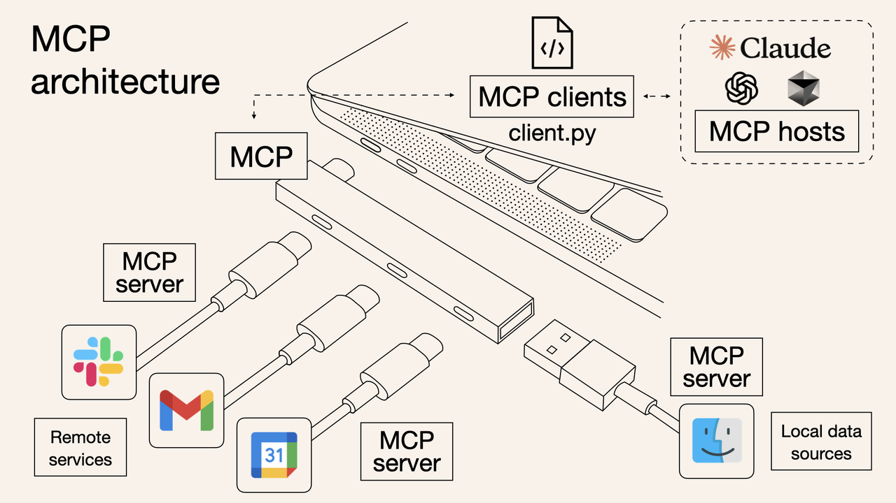

# 1、缸中之脑：只能说不能做的大模型

让我们先从大语言模型（Large Language Model，LLM）说起。

大语言模型，顾名思义，就是一个只能**处理和输出文字**的系统。

早期的大语言模型，输出非常不稳定，准确率很低，**经常「一本正经地胡说八道」**。

所以，人们最多把它当成一个顾问：**咨询意见，但不敢让它直接拍板决策或上手干活**。

这个时期的大模型，有点像被限制在「缸」里的「大脑」（借用哲学上的「缸中之脑」假说）。它能思考、能滔滔不绝地输出观点。**但它没手没脚，不能对「缸」外的物理世界/数字世界直接做点什么。**

但是，AI 技术发展飞快。

随着模型参数规模的扩大和训练方法的革新，**语言模型的「智力」得到了肉眼可见的提升**。人们惊喜地发现，AI 写出的文案、给到的建议、生成的代码，几乎不需要修改就能直接使用了！

眼看着 AI 越来越靠谱，一种想法自然而然地浮现出来：**既然大模型这么能干，是时候解开 AI 的禁锢，让它不只能「动动嘴」，也能「动动手」了？**

# 2、调用工具：大模型学会了动手

怎么解开 AI 的「禁锢」呢？

答案就是**让大模型能够自行使用工具**，也就是我们常说的 **Function Call（函数调用）**或 **Tool Use（工具使用）**。

**那么，一个只会输出文字的模型，是如何调用工具的呢？**

本质上，还是**模型生成文本（结构化的文本），然后配套的程序接收到指令，再去调用工具**。（如下图所示）

而所谓的「工具」，就是各种各样的程序接口（API）或者软件操作，例如搜索、编辑数据库、编辑文件等。

这就像给一个**思维敏捷但行动不便**的人，配备了一台随时待命的**智能计算机**。

他只需要「说」出来需要做什么，计算机就会自动决策和执行所有的指令，整个过程不再需要人类的介入。

让** **AI** **模型使用工具，本质上是一种「放权」行为。**

人们将 AI 从「缸」里释放出来，允许 AI 通过调用工具，直接对现实世界或数字世界产生实际的影响。

**这无疑是** **AI** **迈出的关键一步，也是 Agent 得以诞生的基石。**

# 3、Agent 诞生：更好地调用工具

OpenAI的LilianWeng提出：

> Agent = LLM（大型语言模型）+ 记忆 + 规划 + 工具使用

- **大模型**：提供核心的语言理解、推理与生成能力，是整个Agent的“大脑”。
- **规划**：对复杂任务借助大模型进行分解、规划和调度，并及时观察子任务执行的结果与反馈，对任务及时调整。
- **工具使用**：据决策结果执行具体的动作或指令,与外部工具（如API、数据库、硬件设备）进行交互，扩展智能体的能力，执行任务，相当于Agent的“手脚”。
- **记忆**：存储经验和知识，支持长期学习,这是Agent的“存储器”，可用来存储短期的记忆（如一次任务过程中的多次人类交互）或长期记忆（如记录使用者的任务历史、个人信息、兴趣便好等）。

除此之外，通常Agent还需要提供一个直观的入口，让用户可以方便地给Agent下达指令或查看结果，这个入口可以是可视化的文字输入、语音输入，或者对外开放的API接口。

当前，AI Agent已成为企业落地大模型时必选的应用范式之一，其典型架构一般包含**规划**（Planning）、记忆（Memory）、**工具**（Tools）、**执行**（Action）四大要素。

AI Agent的工作原理可以概括为以下步骤：

1. **输入理解**： 用户提出一个任务（比如发送一份产品对比报告），Agent首先借助大模型对用户输入指令进行理解和解析，识别任务目标和约束条件。
2. **任务规划**： 基于理解的目标，Agent 会规划完成任务的步骤，并决定采取哪些行动。这可能涉及将目标分解成多个子任务，确定任务优先级与执行顺序等（如获取竞品信息、查询企业产品信息、生成对比报告、发送电子邮件）。
3. **任务执行与反馈**： 通过大模型或外部工具完成每个子任务（如调用搜索引擎、查询数据库、生成对比结果、调用电子邮件发送服务）；在此过程中，Agent会搜集与观察子任务结果，及时处理问题，必要时对任务进行调整（如任务执行发生了错误，可能会进行多次迭代尝试）。
4. **任务完成与交付**： 将任务的结果汇总并输出（如生成对比报告与邮件发送回执）。

当然，这只是Agent的核心处理流程。在实际应用中，根据环境与需求的差异，可能存在高度定制且复杂的Agent工作流。

# 4、MCP 诞生：不再重复造轮子

AI 学会了使用工具，这很好。

但很快就出现了新问题：**每家公司、每个开发者都在用自己的方式定义和接入工具**。这就导致了大量的重复劳动，并且工具难以复用和共享，只能「自己造自己用」。

Anthropic 公司敏锐地发现了这个问题。他们认为，**工具应该有一套通用的「语言」和「接口规范」**，于是提出了 **MCP**（Model Context Protocol，模型上下文协议）。

这个协议对大模型发展的意义重大，完全可以类比为**秦始皇当年规定的「书同文」和「车同轨」**。从此，模型调用工具这个事情就被大大地加速了。

MCP 明确了两个核心角色：

- **MCP Client（客户端）**： 通常是**使用工具**的一方。一般是 AI 应用，比如 Claude 客户端、Cursor 编程工具等。
- **MCP Server（服务端）**： 也就是**提供工具**的一方。任何拥有 API 或软件服务的公司，都可以按照 MCP 规范把自己包装成一个 MCP Server，把原来给人用的工具，改造成能让 AI 理解和调用的工具。

前段时间，海外知名投资机构 a16z 制作了一份 MCP Market Map，梳理了 MCP 发展现状。

可以看到，MCP Client 和 MCP Server 生态已经初具模型并在日益繁荣。

# 5、Agent 通信：新的协议应运而生

现在，对于 Agent 的发展，业界有两个大的方向：

- **通用 Agent（通才**）：很多大模型公司都在往这个方向努力。但现阶段，受限于模型能力等各方面的挑战，这注定暂时只是一个美好的理想。
- **垂直 Agent（专才）**： 专注于解决特定领域或特定类型任务。目前看来更容易落地、也更有可能在短期内产生实际价值。

然后，更新的挑战又出现了。

单个垂直 Agent 能解决特定问题，但面对更复杂的现实任务，往往需要**多个不同能力的垂直 Agent 协同配合**。

现在，各家公司都在闭门造自己的 Agent。这些 Agent 之间缺乏统一的沟通方式和协作机制，注定重复且低效。

**这有点像** **MCP** **出现之前的工具生态，又一次走到了需要「标准化」的路口，只不过这次标准化的对象是 Agent 本身。**

为了解决 Agent 之间的信息互通问题，一些新的协议开始进入起草阶段，其中比较受关注的有：

- **ANP（Agent** **Network Protocol****）**：中国开发者率先提出并推动的一个协议。
- **A2A（Agent-to-Agent）Protocol**：Google 也在探索类似的概念和协议。

这些协议的核心目标，大致可以归纳为两点：

- **第一，让 Agent 之间明确彼此的能力，便于协作。**就像外包网站的个人主页，清晰写明自己的专长，其他人可以按需查找，找到合适了的人就一起做项目。

- **第二，让 Agent 之间可以高效地传递信息**。就像团队协作之前，大家约定好沟通方式（比如人会约定好用飞书还是用钉钉）以及消息格式（类似布置任务需要包含哪些信息）。

至于未来哪个协议会成为主流，现在下结论还为时尚早。

但可以肯定的是，Agent 之间的互联互通，将进一步释放 AI 潜能，**催生一个更加靠近 C 端（用户端）、更加繁荣、更加有想象力的巨大市场**。

Agent 生态的爆发，可能来得比大多数人想象中还要快。

2025 是名副其实的 Agent 之年。这背后蕴藏着的，是巨大的技术变革和商业机会，以及我们这代人几十年才得一遇的科技浪潮

