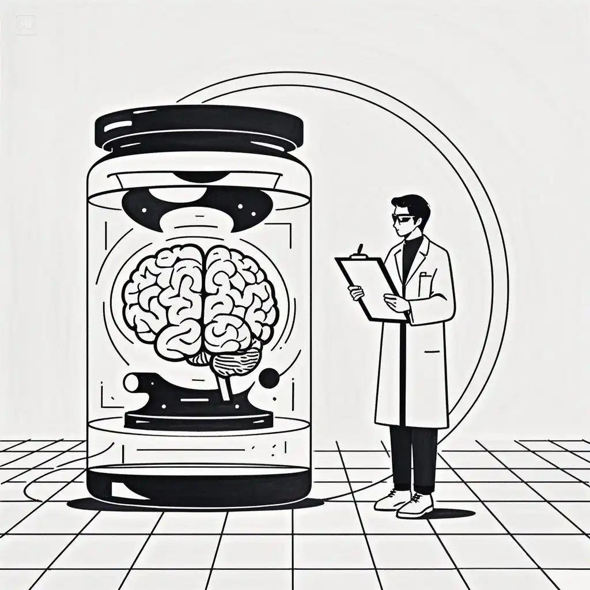
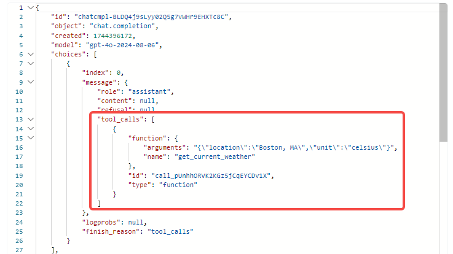
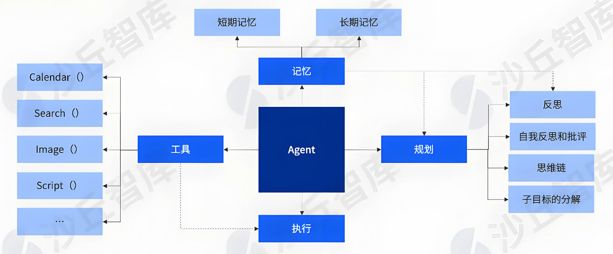
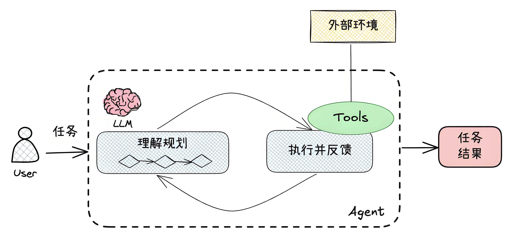
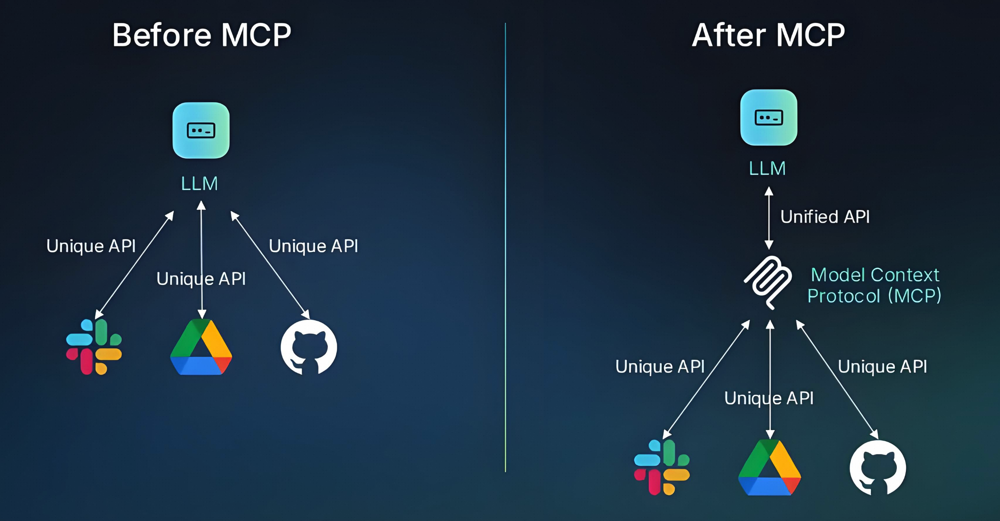
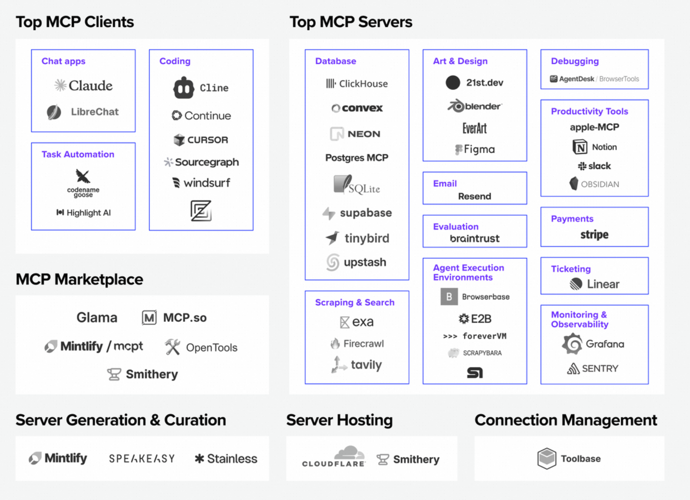

# 1 缸中之脑：只能说不能做的大模型

让我们先从大语言模型（Large Language Model, LLM）说起。

大语言模型，顾名思义，是以文本理解与生成为核心的系统。

早期的大语言模型在事实性问答等任务中的输出通常不够稳定，容易出现事实错误或“看似合理但不准确”的内容。

所以，人们最多把它当成一个顾问：可以咨询意见，但不敢让它直接拍板决策或上手干活。

这个时期的大模型，有点像被限制在“缸”里的“大脑”（借用哲学上的“缸中之脑”假说）。它能思考、能滔滔不绝地输出观点，但没手没脚，不能对“缸”外的物理世界或数字世界直接做点什么。

但是，AI 技术发展飞快。

随着模型参数规模的扩大和训练方法的革新，语言模型在许多任务中的能力得到了显著提升。在文案撰写、信息整理和代码辅助等场景中，部分输出经过必要核验后即可使用。

眼看着 AI 越来越可靠，一种想法自然而然地浮现出来：既然大模型这么能干，是时候解开 AI 的禁锢，让它不只能“动动嘴”，也能“动动手”了？

# 2 调用工具：大模型学会了动手

怎么解开 AI 的“禁锢”呢？

答案就是让大模型能够使用工具，也就是我们常说的 Tool Use（工具使用）。Function Calling（函数调用）则是实现工具使用的一种常见机制。

**那么，一个以文本生成能力为核心的模型，是如何调用工具的呢？**

本质上，仍是模型生成结构化文本，再由配套程序解析指令并调用工具。（如下图所示）

而所谓的“工具”，就是各种各样的程序接口（API）或者软件操作，例如搜索、编辑数据库、编辑文件等。

这就像给一个**思维敏捷但行动不便**的人，配备了一台随时待命的**智能计算机**。

他只需要“说”出需要做什么，计算机便可在预设权限和流程内决策与执行指令；对于高风险操作，仍应保留人工确认、审计或其他安全控制。

让 AI 模型使用工具，本质上是一种在明确权限边界内的“放权”行为。

人们将 AI 从“缸”里释放出来，允许 AI 通过调用工具，在授权范围内对现实世界或数字世界产生实际影响。

**这无疑是 AI 迈出的关键一步，也是 Agent 得以诞生的基石。**

# 3 Agent 诞生：更好地调用工具

早在 2023 年，OpenAI 的研究员 Lilian Weng 就在其经典博文中，将 LLM 驱动的自主 Agent 概括为：

> Agent = LLM + Memory + Planning Skills + Tool Use

在具体实现中，可以从以下几个方面理解 Agent：

- **大模型**：提供核心的语言理解、推理与生成能力，是整个 Agent 的“大脑”。
- **规划**：借助大模型对复杂任务进行分解、规划和调度，并根据子任务的执行结果与反馈及时调整。
- **工具使用**：根据决策结果执行具体动作或指令，与外部工具（如 API、数据库、硬件设备）交互，扩展智能体的能力；相当于 Agent 的“手脚”。
- **记忆**：存储和检索经验与知识，帮助 Agent 保持任务上下文，并在使用者授权范围内利用历史信息。它可包括短期记忆（如一次任务中的多轮人机交互）和长期记忆（如用户的任务历史、个人信息与兴趣偏好）。
- **执行**：根据规划结果，调度大模型或工具，在预设权限范围内完成具体的数字或物理操作。

此外，Agent 通常还需要提供一个直观的入口，让用户可以方便地向 Agent 下达指令或查看结果；这个入口可以是可视化文字输入、语音输入，或者对外开放的 API 接口。

在企业应用中，AI Agent 是大模型落地的一种重要范式。一个常见架构包含规划（Planning）、记忆（Memory）、工具（Tools）与执行（Action）等要素；具体划分会因框架和场景而异。

AI Agent 的工作原理可以概括为以下步骤：

1. **输入理解**：用户提出一个任务（比如发送一份产品对比报告），Agent 首先借助大模型理解和解析用户指令，识别任务目标和约束条件。
2. **任务规划**：基于理解的目标，Agent 会规划完成任务的步骤，并决定采取哪些行动。这可能涉及将目标分解成多个子任务，确定任务优先级与执行顺序等（如获取竞品信息、查询企业产品信息、生成对比报告、发送电子邮件）。
3. **任务执行与反馈**：通过大模型或外部工具完成每个子任务（如调用搜索引擎、查询数据库、生成对比结果、调用电子邮件发送服务）；在此过程中，Agent 会收集并观察子任务结果，及时处理问题，必要时调整任务（如发生错误时进行多次迭代尝试）。
4. **任务完成与交付**：将任务结果汇总并输出（如生成对比报告与邮件发送回执）。

当然，这只是 Agent 的一种核心处理流程。在实际应用中，根据环境与需求的差异，可能存在高度定制且复杂的 Agent 工作流。

# 4 MCP 诞生：不再重复造轮子

AI 学会了使用工具，这很好。

但很快就出现了新问题：不同公司和开发者都在用自己的方式定义和接入工具。这会导致大量重复劳动，也使工具难以复用和共享，只能“自己造、自己用”。

MCP 最初由 Anthropic 推出，为 AI 应用连接外部系统提供了一套开放协议。它不仅可描述工具调用，也可用于在客户端与服务器之间交换上下文信息。

具体而言，MCP 将外部能力抽象为三种核心原语：**Tools**（工具，供模型调用的动作）、**Resources**（资源，供模型读取的数据）和 **Prompts**（提示模板，预设的交互模式）。这类标准化抽象，是 MCP 提升 AI 应用接入与能力复用效率的关键。

这个协议对 AI 应用生态意义重大。它提供了更通用的交互约定，有助于减少工具接入的重复工作，促进工具的复用与共享。

MCP 明确了两个核心角色：

- **MCP Client（客户端）**：通常是发起请求、使用服务器能力的一方。一般是 AI 应用，如 Claude 客户端、Cursor 等。
- **MCP Server（服务端）**：提供工具、资源或提示等能力的一方。拥有 API 或软件服务的组织可按 MCP 规范向 AI 应用暴露这些能力。

海外知名投资机构 a16z 曾制作 MCP Market Map，梳理 MCP 的发展现状。

可以看到，MCP Client 和 MCP Server 生态已经初具规模，并在持续发展。

# 5 Agent 通信：新的协议应运而生

目前，Agent 的发展主要呈现两个方向：

- **通用 Agent（通才）**：尝试适应更广泛的任务类型与场景，但仍受限于模型能力、可靠性和成本等挑战。
- **垂直 Agent（专才）**：专注于解决特定领域或特定类型任务，通常更容易落地，也更可能在短期内产生实际价值。

与此同时，新的挑战也出现了。

单个垂直 Agent 能解决特定问题，但面对更复杂的现实任务，往往需要**多个不同能力的垂直 Agent 协同配合**。

不同 Agent 往往采用不同的沟通方式和协作机制，这会导致重复接入和协作效率问题。

**这有点像 MCP 出现前的工具生态：它再次走到了需要“标准化”的路口，只不过这次的标准化对象是 Agent 本身。**

为解决 Agent 之间的信息互通问题，业界已提出并持续演进多种协议，其中较受关注的包括：

- **ANP（Agent Network Protocol）**：一个面向 Agent 网络与互操作的开放协议。
- **A2A（Agent2Agent Protocol）**：由 Google 发起、现已捐赠给 Linux Foundation 的开放协议，用于支持 Agent 之间的协作。

这些协议的核心目标，大致可以归纳为两点：

- **第一，让 Agent 之间明确彼此的能力，便于协作。**就像外包网站的个人主页，清晰写明自己的专长，其他人可以按需查找，找到合适的人就一起做项目。

- **第二，让 Agent 之间可以高效地传递信息。**就像团队协作前，大家约定好沟通方式（比如约定使用飞书或钉钉）以及消息格式（类似布置任务需要包含哪些信息）。

至于未来哪种协议会成为绝对主流，现在下结论或许还为时尚早。但可以确定的是，Agent 之间的互联互通有望进一步释放 AI 潜能，推动应用生态从“单兵作战”走向“群体智能”，并催生更贴近 C 端用户的复杂应用场景。

如果说 2025 年被业界普遍视为“Agent 元年”，完成了从概念到落地的初步验证；那么站在 2026 年的今天，我们正在亲历这场变革向深水区迈进。当 Agent 既能熟练使用 MCP 连接万物，又能通过 A2A 等协议彼此协作时，一个全新的、由智能体驱动的软件生态正在成型。这背后蕴藏的不仅是技术范式的转移，更是我们这代人正在经历的时代浪潮。

