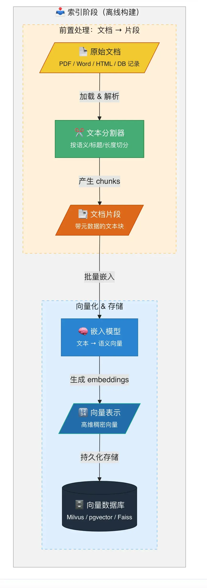
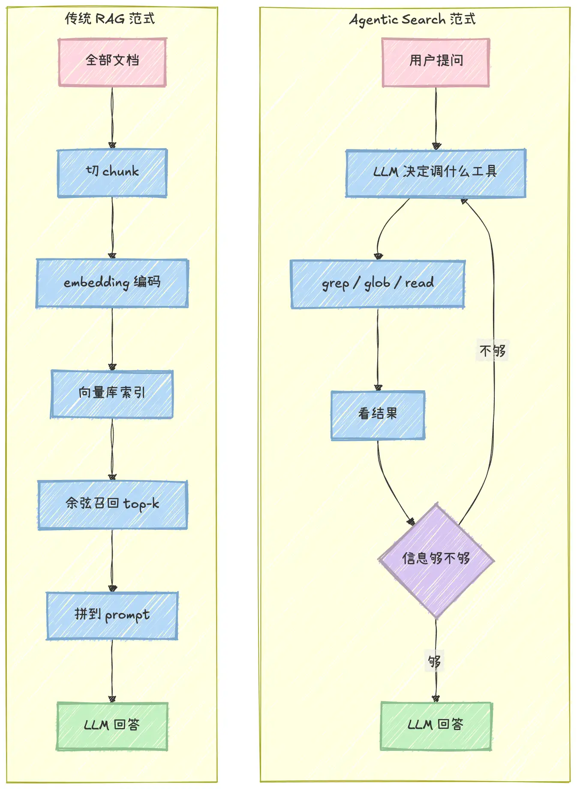
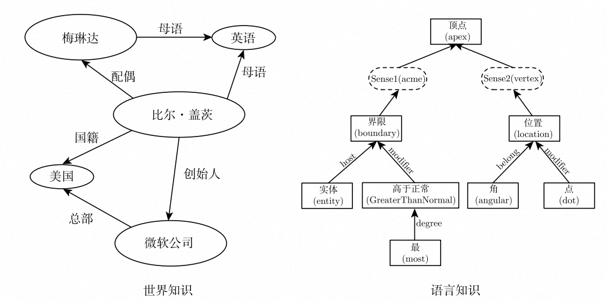

# 1、什么是 RAG？

**RAG** (Retrieval-Augmented Generation，检索增强生成) 是一种将强大的信息检索 (Information Retrieval, IR) 技术与生成式大语言模型 (LLM) 相结合的框架。

RAG 的核心思想是：在让 LLM 回答问题或生成文本之前，先从一个大规模的知识库（如数据库、文档集合）中检索出相关的上下文信息，然后将这些信息与原始问题一并提供给 LLM，从而“增强”其生成能力，使其能够产出更准确、更具时效性、更符合特定领域知识的回答。

# 2、为什么需要 RAG？

1. **解决知识时效性问题**（对抗“**知识截止**”）

预训练的 LLM 的知识被固化在其 **训练数据的截止时间点**（Knowledge Cutoff）。例如，GPT-4 的知识库可能截止于 2023 年 12 月。对于此后发生的新事件、新知识，LLM 无法直接给出准确答案。RAG 通过 **动态检索外部知识源**，为 LLM 提供“实时”的知识补充，从而克服了知识过时的问题。

2. **打通私有数据访问**（赋能企业级应用）

出于数据安全和商业机密的考虑，企业内部的 **私有数据**（如产品文档、内部知识库、客户数据等）无法被公开的 LLM 直接访问。RAG 技术能够安全地连接这些私有数据源，在用户提问时，仅将与问题相关的片段信息提取出来提供给 LLM，使其能够在 **不泄露全部数据** 的前提下，基于企业自身的知识进行回答，实现真正可用的企业级智能应用。

3. **提升回答的准确性与可追溯性**（对抗“**模型幻觉**”）

LLM 有时会产生 “**幻觉**（Hallucination）” ，即编造不符合事实的信息。RAG 通过提供明确的、有据可查的参考文本，强制 LLM 的回答 **基于检索到的事实**，大大降低了幻觉的发生率。同时，由于可以展示引用的原文，使得答案的 **来源可追溯、可验证**，增强了系统的可靠性和用户的信任度。

# 3、RAG 工作原理

RAG 过程分为两个不同阶段：**索引**和**检索**。

在索引阶段，文档会进行预处理，以便在检索阶段实现高效搜索。该阶段通常包括以下步骤：

1. **输入文档**：文档是需要被处理的内容来源，可能是文本文件、PDF、网页、数据库记录等。
2. **清理文档**：对文档进行去噪处理，移除无用内容（如 HTML 标签、特殊字符）。
3. **增强文档**：利用附加数据和元数据（如时间戳、分类标签）为文档片段提供更多上下文信息。
4. **文档拆分**（Chunking）：通过文本分割器（Text Splitter）将文档拆分为较小的文本片段（Segments），严格适配嵌入模型和生成模型的上下文窗口限制（Context Window）。
5. **向量化表示** (Embedding Generation) ：通过嵌入模型（如 OpenAI text-embedding-3 或 Hugging Face 上的开源模型）将文本片段映射为语义向量表示（Document Embedding，也就是高维稠密向量）。
6. **存储到向量数据库**：将生成的嵌入向量、原始内容及其对应的元数据存入向量存储库（如 Milvus, Faiss 或 pgvector）。

索引过程通常是离线完成的，例如通过定时任务（如每周末更新文档）进行重新索引。对于动态需求，例如用户上传文档的场景，索引可以在线完成，并集成到主应用程序中。

索引阶段的简化流程图如下：

检索通常在线进行的，当用户提交一个问题时，系统会使用已索引的文档来回答问题。该阶段通常包括以下步骤：

1. **接收请求**： 接收用户的自然语言查询（Query），例如一个问题或任务描述。在某些进阶场景中，系统会先对原始查询进行改写或扩充，以提高后续检索的覆盖率。
2. **查询向量化**： 使用嵌入模型（Embedding Model）将用户查询转换为语义向量表示（Query Embedding，也就是高维稠密向量），以捕捉查询的语义信息。
3. **信息检索** (R)： 在嵌入存储（Embedding Store）中，通过语义相似性搜索找到与查询向量最相关的文档片段（Relevant Segments）。
4. **生成增强** (A)： 将检索到的相关片段和原始查询作为上下文输入给 LLM，并使用合适的提示词引导 LLM 基于检索到的信息回答问题。
5. **输出生成** (G)： 向用户输出自然语言回复，并附带相关的参考资料链接。
6. **结果反馈**（可选）： 如果用户对生成的结果不满意，可以允许用户提供反馈，通过调整提示词或检索方式优化生成效果。在某些实现中，支持多轮交互，进一步完善回答。

检索阶段的简化流程图如下：

# 4、RAG对Agent来说是必须的吗？

2024、2025 年，如果你在学习 AI Agent，RAG（检索增强生成）几乎是绕不开的话题。

各种教程开篇必讲 RAG。什么是向量数据库、什么是 Embedding、如何做文档切片、如何调相似度阈值……学完之后还要折腾 Pinecone、Weaviate、Chroma，踩一堆坑。

那时候的感觉是：**不懂 RAG，就不算真的懂 Agent**。

但最近一年，情况悄悄变了。

打开各种 Agent 框架的文档，看社区里大家在讨论什么，听播客里在聊什么——RAG 的出现频率越来越低了。取而代之的是另一套词汇：Skills、Tools、MCP、Memory、Loop、Harness……

早期 Claude Code 用过 RAG。Anthropic 自己后来把它删了。这是 Claude Code 负责人2026 年 1 月底在 X 上亲口说的。

今年 3 月底 Anthropic 那份 npm Source Map 不小心泄出来了，51 万行源码全在外面。

从源码里翻出来一个事实：**整个工程里没有 embedding 模型，没有任何向量数据库，没有任何意义上的 RAG 流水线**。

2024 年大家普遍把 RAG 当成处理超出模型上下文那部分信息的标配。Claude Code 团队内部试过本地向量数据库，试过递归式的 model-based indexing，全部弃了。最后留下来的就是 grep、glob、read 三件套，加一个用来分发子任务的 Task。

**Just-in-time** 是这套架构的核心词。RAG 是把所有东西预先索引好，等问的时候召回；agentic search 是模型按需拿，每次根据当下任务决定下一步搜什么。两套范式画在同一张图里，差别非常直观。

不只是 Claude Code，2025 年下半年这条路线已经成了主流。翻一圈竞品，会发现这是一场默契的集体撤退。

**一个完全不用 RAG 的 Agent，不仅可以存在，而且很可能是 2026 年大部分 Agent 产品的主流形态。**

为什么呢？**LLM 自身能力在不断填平 RAG 的价值**。

RAG 的核心能力是什么？语义搜索——从大量文本里，找出跟当前问题最相关的内容。

但问题是：LLM 天生就支持语义理解，而且理解能力已经比早期的 Embedding 模型强太多了。

RAG 出现的时候，LLM 有两个硬伤：

- **Context Window 太小**，4K token 根本装不下多少内容，必须先筛选再喂给模型
- **理解能力有限**，需要专门训练的 Embedding 模型来做向量相似度计算

所以 RAG 的逻辑是：先用向量搜索把候选内容缩小到几条，再把这几条喂给 LLM。

但现在，这两个短板都在快速消失：

- Context Window 从 4K 涨到了 128K，再到 200K+，很多内容根本不需要预筛选，直接全塞进去就行
- LLM 的语义理解能力远超当年，让它自己在一大堆内容里找答案，反而更准

举一个具体例子：Tool 选择问题。

早期 Agent 如果有几百个 tool，context 装不下，就得用 RAG：先把问题向量化，检索出最相关的几个 tool，再交给 LLM 选择。

现在呢？直接把所有 tool 的描述全部发给 LLM，让它自己判断用哪个。多花了一点 token，但省掉了整套向量检索的基础设施。

**多花一点 LLM token 的费用，远比维护一套 RAG 服务的费用和复杂度要低得多**。

这种替代正在悄悄发生在很多场景里。LLM 越来越强，它能直接"内化"的事情越来越多，中间那层"预处理"的必要性就越来越低。

# 5、GraphRAG

传统 RAG 的天花板已经到来，在实际项目中遇到了越来越多这样的问题：

- 无法处理**多跳推理**问题： 问"张三的上司是谁"，回答正确；但问 "张三的上司的上司是谁"，就开始胡说八道
- 丢失了文档的结构信息和语义关系：问 "项目 A 涉及哪些技术栈"，回答零散；但问 "项目 A 和项目 B 在技术上有哪些重叠"，完全答不上来
- 无法回答聚合性问题：文档中提到 "李四负责模块 X，王五负责模块 Y，模块 X 和 Y 共同组成系统 Z"，但问 "系统 Z 由谁负责"，大模型却无法整合信息
- 长文档中分散在不同章节的关联信息，传统 RAG 根本无法有效关联

这些问题的根源在于：**传统 RAG 本质上是基于文本相似度的检索，它只能理解 "字面相似"，无法理解 "语义关联"**。它把文档切分成一个个孤立的块，却丢失了块与块之间、实体与实体之间的复杂关系。

正是在这样的背景下，GraphRAG 应运而生。它将**知识图谱技术与 RAG 相结合**，不仅检索文本片段，更检索实体之间的关系网络，让大模型真正具备了 "理解" 和 "推理" 的能力。

GraphRAG 的核心思想非常简单：**将非结构化的文本转化为结构化的知识图谱，然后基于知识图谱进行检索和推理**。

知识图谱是一种用图结构来表示知识的方式，它由**节点**和**边**组成：

- **节点**：代表实体（如人、地点、事物、概念）
- **边**：代表实体之间的关系（如 "张三 - 上司 - 李四"、"项目 A - 使用 - 技术 B"）

Graph RAG 的关键是先建 “知识图谱”，再做检索，流程比传统 RAG 多了 “图谱搭建” 一步。

这种结构让 AI 能看懂信息背后的逻辑，它能顺着关系网找到完整的因果链，而不是只给一堆无关的片段。

# 6、Agentic RAG

**Agentic RAG** 是将 Agent 机制引入检索流程。此时的系统不再是一个简单的“传声筒”，而是一个“聪明的调查员”：

- **自主决策**：它会判断是否需要检索。
- **查询规划**：如果问题复杂，它会将任务拆解。
- **自我修正**：如果检索到的信息不足，它会重新调整关键词再次检索。

Agentic RAG 的工作不是固定步骤，而是一个 “感知 – 思考 – 行动 – 学习” 的循环。

Agentic RAG 的强大离不开多智能体的分工协作。有人负责做计划，有人专门找资料，有人检查答案准确性，有人调用工具执行任务，还有人协调整体工作，就像一个高效的小团队。

比如问它 “三个月内规划一场兼顾老人和孩子的欧洲游，预算 10 万”，它不会只给一堆旅游攻略，而是会先拆分成 “选目的地、查交通、订酒店、算预算” 等小任务，再逐个找信息、调用工具核实（比如用地图查路线、用预订平台看实时房源），最后整合出详细行程，还能记住你的反馈（比如 “某个景点人太多”），下次优化方案。

