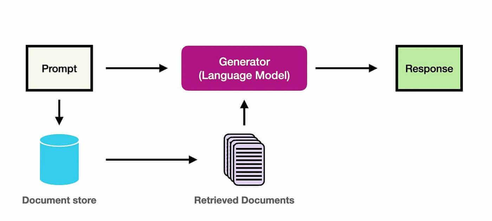
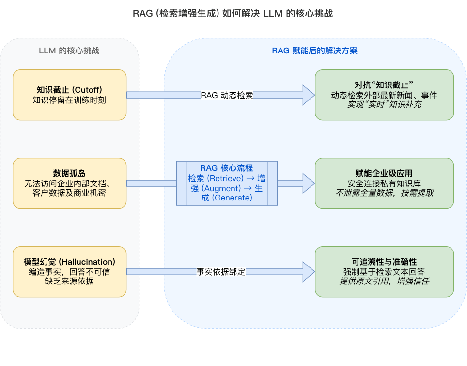
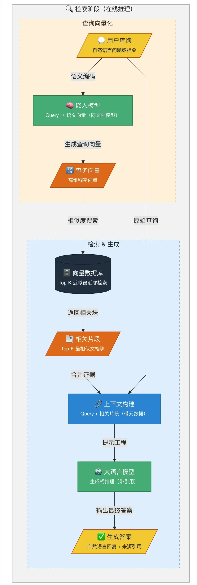

# 1 什么是 RAG

**RAG**（Retrieval-Augmented Generation，检索增强生成）是一种将信息检索（Information Retrieval，IR）技术与生成式大语言模型（LLM）相结合的框架。

RAG 的核心思想是：在让 LLM 回答问题或生成文本之前，先从大规模知识库（如数据库、文档集合）中检索相关上下文信息，再将这些信息与原始问题一并提供给 LLM，从而增强生成能力，使其能够产出更准确、更具时效性、更符合特定领域知识的回答。

# 2 为什么需要 RAG

1. **解决知识时效性问题**（对抗“**知识截止**”）

预训练 LLM 的知识通常受训练数据截止时间限制。不同模型及其版本的知识截止日期并不相同，因此对于截止日期之后的新事件或新知识，LLM 未必能直接给出可靠答案。RAG 通过**动态检索外部知识源**，为 LLM 提供可更新的上下文信息，从而补充其预训练知识。

2. **打通私有数据访问**（赋能企业级应用）

出于数据安全和商业机密的考虑，企业内部的**私有数据**（如产品文档、内部知识库、客户数据等）无法被公开的 LLM 直接访问。RAG 技术能够安全地连接这些私有数据源，在用户提问时，仅将与问题相关的片段信息提取出来提供给 LLM，使其能够在**不泄露全部数据**的前提下，基于企业自身的知识进行回答，实现真正可用的企业级智能应用。

3. **提升回答的准确性与可追溯性**（对抗“**模型幻觉**”）

LLM 有时会产生“**幻觉**”（Hallucination），即编造不符合事实的信息。RAG 通过提供明确、可追溯的参考文本，引导 LLM 依据检索到的证据生成回答，从而在检索质量和提示词设计合理时降低幻觉风险。同时，系统可以展示引用原文，使答案来源可追溯、可验证，增强系统的可靠性和用户信任。

# 3 RAG 工作原理

从系统工程的角度来看，RAG 的完整生命周期通常分为离线的**索引阶段**与在线的**检索、增强和生成阶段**。前者准备可搜索的知识，后者在收到问题后完成 Retrieval、Augmentation 和 Generation（R、A、G）。

在常见的向量检索式 RAG 中，索引阶段会对文档进行预处理，以便后续高效搜索。该阶段通常包括以下步骤：

1. **输入文档**：文档是需要处理的内容来源，可能是文本文件、PDF、网页或数据库记录等。
2. **清理文档**：对文档进行去噪，移除无用内容（如 HTML 标签、特殊字符）。
3. **增强文档**：利用附加数据和元数据（如时间戳、分类标签）为文档片段提供更多上下文信息。
4. **文档拆分**（Chunking）：通过文本分割器（Text Splitter）将文档拆分为较小的文本块（Chunks），以适配嵌入模型和生成模型的上下文窗口限制。
5. **生成嵌入向量**（Embedding Generation）：通过嵌入模型（Embedding Model，例如 OpenAI 的 text-embedding-3 或 Hugging Face 上的开源模型）将文本片段映射为高维稠密向量（Document Embedding）。
6. **存储向量与元数据**：将嵌入向量、原始内容和对应元数据存入向量存储（如 Milvus 或 pgvector），也可将向量加载至 Faiss 等向量检索库中，建立高效的相似度检索索引。

索引过程通常离线完成，例如通过定时任务重新索引文档。对于用户上传文档等动态需求，索引也可以在线完成，并集成到主应用程序中。

索引阶段的简化流程图如下：

检索、增强和生成通常在线进行。当用户提交问题时，系统会利用已索引文档组织回答。典型的向量检索流程通常包括以下步骤：

1. **接收请求**：接收用户的自然语言查询（Query），例如问题或任务描述。在一些进阶场景中，系统会先对原始查询进行改写或扩充，以提高后续检索的覆盖率。
2. **查询向量化**：使用嵌入模型将用户查询转换为语义向量表示（Query Embedding），以捕捉查询语义。
3. **信息检索**（R）：在嵌入存储（Embedding Store）中通过语义相似性搜索，找到与查询向量最相关的文档片段。
4. **生成增强**（A）：将相关片段与原始查询一并作为上下文输入给 LLM，并使用提示词引导模型基于这些信息回答问题。
5. **输出生成**（G）：向用户输出自然语言回复，并可附上相关参考资料链接。
6. **结果反馈**（可选）：如果用户对生成结果不满意，可以提供反馈，通过调整提示词或检索方式优化效果。在一些实现中，系统支持多轮交互，进一步完善回答。

检索阶段的简化流程图如下：

# 4 RAG 对 Agent 是否必需

2024 年和 2025 年，如果你在学习 AI Agent，RAG（检索增强生成）几乎是绕不开的话题。

各种教程开篇必讲 RAG：什么是向量数据库、什么是嵌入（Embedding）、如何做文档切片、如何调相似度阈值……学完之后还要折腾 Pinecone、Weaviate、Chroma，踩一堆坑。

那时候的感觉是：**不懂 RAG，就不算真的懂 Agent**。

但最近一年，情况悄悄变了。

打开各种 Agent 框架的文档，看社区里大家在讨论什么，听播客里在聊什么——RAG 的出现频率越来越低了。取而代之的是另一套词汇：Skills、Tools、MCP、Memory、Loop、Harness……

早期 Claude Code 用过 RAG。Anthropic 自己后来把它删了。这是 Claude Code 负责人于 2026 年 1 月底在 X 上亲口说的。

今年 3 月底 Anthropic 那份 npm Source Map 不小心泄出来了，51 万行源码全在外面。

从源码里翻出来一个事实：**整个工程里没有 embedding 模型，没有任何向量数据库，没有任何意义上的 RAG 流水线**。

2024 年大家普遍把 RAG 当成处理超出模型上下文那部分信息的标配。Claude Code 团队内部试过本地向量数据库，试过递归式的 model-based indexing，全部弃了。最后留下来的就是 grep、glob、read 三件套，加一个用来分发子任务的 Task。

**按需获取（Just-in-Time）**是这类架构的核心思想。RAG 的常见实现会预先索引内容，并在提问时召回相关信息；智能体式搜索（Agentic Search）则由模型根据当下任务按需搜索，并决定下一步操作。两套范式的适用条件不同。

除 Claude Code 外，部分代码 Agent 也越来越多地采用按需搜索和工具调用；不过，RAG、长上下文和混合检索仍各有适用场景。

**一个完全不用 RAG 的 Agent 可以存在；是否采用 RAG，仍应取决于数据规模、任务类型、延迟、成本与可追溯性要求。**

为什么会出现这种变化？**LLM 的上下文能力和工具使用能力提升，正在改变部分场景中 RAG 的收益与成本权衡。**

RAG 的核心是在生成前检索外部信息，并将相关上下文提供给模型；语义搜索只是常见检索手段之一。

LLM 具备较强的语义理解能力，可以参与查询改写、候选内容评估和工具选择；但与专用嵌入模型相比，其效果并非在所有数据集和任务上都更优。

RAG 早期流行时，常见的限制包括：

- **上下文窗口较小**：4K 个 token 容纳的内容有限，常需要先筛选再提供给模型。
- **检索与生成能力分工明显**：常使用专门的嵌入模型进行向量相似度计算。

因此，常见的向量 RAG 流程是：先通过向量搜索缩小候选范围，再把相关片段提供给 LLM。

如今，这些限制在部分模型和任务中有所缓解：

- **上下文窗口更大**：一些模型支持 128K、200K 甚至更长上下文；当资料量、成本和延迟可接受时，可以直接提供更多原文。
- **模型的推理与工具使用能力更强**：模型可按需搜索、评估候选内容或调用工具，但仍应通过测试验证准确性。

举一个具体例子：工具选择问题。

早期 Agent 若有数百个工具，工具描述可能超出上下文窗口，系统常先检索出相关工具，再交给 LLM 选择。

现在，一些系统会在上下文窗口和成本允许的前提下，直接提供更多工具描述，让 LLM 自行判断；另一些系统仍会采用检索或分层路由。

**与维护一套 RAG 服务相比，直接增加 LLM token 的成本和复杂度未必更低，需结合工具数量、调用频率、延迟与运维要求评估。**

这种替代正在部分场景中发生。LLM 能直接处理的任务增多后，中间“预处理”层是否必要，需要根据实际效果决定。

# 5 GraphRAG

传统 RAG 在实际项目中常遇到以下问题：

- **多跳关系支持有限**：问“张三的上司是谁”或许能回答；但在回答“张三的上司的上司是谁”时，若相关片段未被一并检索，结果容易不完整或不可靠。
- **难以显式保留文档结构与实体关系**：问“项目 A 涉及哪些技术栈”时，回答可能较为零散；而问“项目 A 和项目 B 在技术上有哪些重叠”时，则需要关联多处信息。
- **聚合性问题较难处理**：文档中提到“李四负责模块 X，王五负责模块 Y，模块 X 和 Y 共同组成系统 Z”时，回答“系统 Z 由谁负责”需要整合多个片段。
- **长文档中的关联信息分散**：若检索未同时召回不同章节的相关片段，回答容易遗漏关键关系。

这些问题的根源在于：**传统 RAG 通常按片段的关键词或语义相似度进行检索，往往不会显式建模片段之间及实体之间的关系。**文档被切分后，跨片段关系可能被弱化。

正是在这样的背景下，GraphRAG 应运而生。它将**知识图谱技术与 RAG 相结合**，除检索文本片段外，还能检索实体关系网络，为模型回答关系型、多跳或聚合类问题提供结构化证据。

GraphRAG 的核心思想是：**将非结构化文本转化为结构化知识图谱，再基于知识图谱进行检索和推理。**

知识图谱是一种用图结构表示知识的方式，由**节点**和**边**组成：

- **节点**：代表实体（如人、地点、事物、概念）。
- **边**：代表实体之间的关系（如“张三—上司—李四”“项目 A—使用—技术 B”）。

GraphRAG 的关键是先构建“知识图谱”，再做检索，流程比传统 RAG 多了“图谱构建”一步。

这种结构能帮助系统保留信息之间的关系，并为模型提供更完整的检索上下文；实际效果仍取决于图谱质量、检索策略和生成模型。

为了更直观地理解 GraphRAG 的运作方式，可以将常见的“构建—检索—生成”闭环梳理如下：

1. **离线图谱构建**：利用 LLM 或专用信息抽取模型，从非结构化文档中提取实体（节点）与关系（边）；同时保留节点、边与原始文本块的映射。图数据可持久化至 Neo4j、NebulaGraph 等图数据库或其他图存储中，并可按需结合向量索引。
2. **在线查询理解与入口定位**：系统先判断问题需要查询实体、关系、路径还是全局主题。它可以把适合结构化查询的问题转换为图查询，也可以结合关键词或向量检索定位候选实体和起始节点。
3. **图检索与证据扩展**：系统可从相关节点出发执行受约束的多跳遍历，提取关系路径和局部子图；对于全局性问题，也可检索图中的社群摘要或聚合信息。随后召回这些节点关联的原始文本块，以补充关系的来源和细节。
4. **上下文组装与生成**：系统将三元组、关系路径等结构化证据与原始文本块共同组织为上下文，再交给 LLM 生成答案。提示词可要求模型以这些证据为依据，并在信息不足时明确说明不确定性。

因此，GraphRAG 能以显式关系为线索扩展相关证据，尤其适合关系型、多跳或聚合类问题；但它并不保证回答正确，仍需通过数据质量、检索评估和生成约束来控制效果。

# 6 Agentic RAG

传统 RAG 常被实现为一条相对固定的流水线：接收查询、检索候选内容、组织上下文、生成答案。若系统没有质量评估和重试机制，当检索结果不相关或证据不足时，往往仍会直接生成回答。

**Agentic RAG** 是在 RAG 流程中引入 Agent 机制的设计范式。它不是单一的标准架构，而是让系统能够围绕任务目标规划、调用工具、评估中间结果并决定下一步操作。它可以由单个 Agent 或多个协作 Agent 实现，使系统能够在回答前决定是否检索、如何检索，以及是否需要再次检索。

其常见能力包括：

- **检索决策与路由**：根据问题类型、已有上下文和时效性要求，决定是否需要检索，并选择向量检索、关键词检索、图检索、Web 搜索或其他数据源。
- **查询规划与拆解**：面对复杂问题，将任务拆解为多个可验证的子问题，并规划检索顺序或工具调用顺序。
- **结果评估与修正**：通过规则、检索评分或 LLM 评估器判断证据是否相关、充分；若不满足要求，可改写查询、调整过滤条件、切换检索策略或补充工具调用，再进行有限次数的重试。
- **工具协同**：除知识库外，Agent 还可调用计算、数据库查询或实时数据服务等工具，将检索到的静态知识与外部状态结合起来。

Agentic RAG 通常以“感知—思考—行动—评估”的循环（Loop）运行。是否根据反馈持续学习或保留持久记忆，取决于系统是否额外接入评估、训练和记忆机制；这些能力并不是 Agentic RAG 自动具备的。

在高度复杂的任务中，系统还可以采用多智能体（Multi-Agent）分工架构，例如由不同 Agent 分别负责计划制定、资料检索、答案核验和整体协调；但这也不是必要条件，单个 Agent 配合工具调用同样可以实现 Agentic RAG。

例如，面对“规划一场三个月内出发、兼顾老人和孩子、预算 10 万元的欧洲游”这类复合需求，系统可先将任务拆解为“筛选适宜目的地、查询交通安排、匹配家庭住宿、核算总预算”等子任务。随后，Agent 可逐步检索资料，并按需调用地图、航班或预订服务等实时数据工具核实价格与政策，最后将证据整合为行程建议。若用户对某项安排提出反馈，系统还需要额外的持久化记忆机制，才能在后续交互中稳定保留并应用该偏好。

Agentic RAG 的价值在于用动态的规划、检索和工具调用替代单次固定检索，以更好地处理多步骤或高不确定性的任务；其实际效果仍取决于检索质量、工具可靠性、评估机制，以及对成本、延迟和安全边界的控制。
