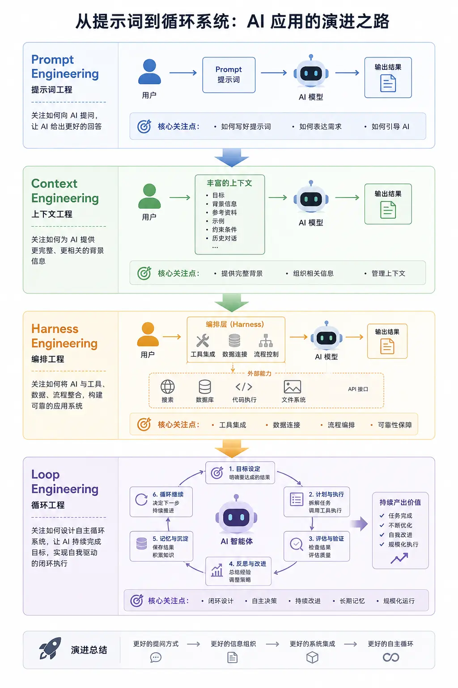

过去几年，业界对大模型的关注点经历了四次转移。

一开始大家在聊的是 Prompt Engineering，提示词工程。那个时候所有人都相信一件事：模型不是不会，只是你没把话讲明白，只要提示词写得够好，啥都能搞定。

后来大家发现事情不对劲。Agent 火起来之后，模型要做的事情越来越复杂，光「把话讲清楚」根本不够，它还得「知道」该用什么信息才行。于是 Context Engineering，上下文工程，接棒成为 AI 工程圈的新主角。

但这事到这儿还没完。当大家把上下文管得越来越精细之后，又发现了一个更扎心的问题：信息都给对了，模型在长链路任务里还是会跑偏。

提示词没毛病、上下文也没毛病，可它就是做不稳。正是在这个背景下，Harness Engineering 就这么被推到了台前。

然而，即便有了 Harness Engineering 的严密管控，我们依然面临一个更深层的瓶颈：模型只能在预设的轨道上“被动地做对”，却无法在无人值守时“主动地变好”。当任务链路拉长、环境动态变化，仅靠外部约束已不足以应对所有未知状况，系统缺乏自我纠错、经验沉淀与持续进化的能力。正是在这个背景下，Loop Engineering 顺势登场，将关注点从“单次执行的稳定性”推向了“系统能力的自主闭环与长期增长”。



这四个阶段不是谁取代谁，而是每一步都在上一步撞到天花板之后，继续往前啃出来的：

- **Prompt Engineering** 解决的是：**怎么让模型「听懂」你想干啥**
- **Context Engineering** 解决的是：**怎么让模型「知道」该用什么信息**
- **Harness Engineering** 解决的是：**怎么让模型在真实执行里「持续做对」一连串的事**
- **Loop Engineering**解决的是：**怎么让模型在无人干预下「自我进化」**

# 1 第一阶段：Prompt Engineering，先让模型「听懂」你

要讲清楚 Prompt Engineering，得先聊一个更基础的问题：大模型到底在干啥？

你平时用 ChatGPT 也好，用 Claude 也好，看到的都是一个对话框，输入一句话，下面给你输出一段话。但如果把这层外壳扒掉，里面其实就一个东西：一个特别大的参数文件，存在硬盘上，加载到显卡的内存里。

这个文件本身啥也不是。给它配一个 HTTP 接口，它就成了所谓的「大模型 API 服务」。给这个 API 套一个聊天界面，它就成了 ChatGPT；套一个代码编辑器，它就成了 Cursor、Trae 这种 AI IDE。

那这个参数文件本身是怎么工作的呢？说白了就一件事：**根据你输入的内容，预测下一个字最有可能是啥**。

注意我说的是「预测」，不是「思考」，这个区别很重要。**它本质上是在猜你想要什么**，然后把它觉得最可能的字一个一个往外吐。你给它的输入越模糊，它猜的范围就越大；你给它的输入越具体，它猜的范围就越收敛。

知道了这个原理，你就能理解为啥同一个问题，换个说法效果能差十倍。

举个例子。你丢一段代码给大模型，说「加个排序」。它会怎么回？大概率是给你回一段排序的代码片段，告诉你「就这么写」。但你拿到这段代码一看，傻眼了：它没说放在哪儿，也没说要不要改其他函数，更没把完整的代码给你。

那如果你换一种说法呢？「这是我的完整代码，请帮我加上对 users 列表按年龄从大到小的排序，注意保留原有的所有逻辑，最后输出完整代码」。这次它给的结果一下就靠谱多了。

为啥？因为大模型本质上是一个对上下文极度敏感的概率生成器。

什么叫敏感？就是你给它什么样的输入，它就会沿着那个方向生成。

你给它一个角色身份，比如「你是一个资深 Java 工程师」，它就会偏向用 Java 工程师的思路回答；你给它几个示例，比如「按照下面这个例子的格式来」，它就会沿着那个范式补全；你强调什么样的约束，比如「不要修改我已有的代码」，它就会把这个约束当成重点。

你会发现，**写提示词的本质，根本不是在「命令」模型，而是在塑造它的概率空间**。你给它的每一句话，都在悄悄地把它的输出往某个方向推。

正因为这种敏感性，大家慢慢摸索出了一套「提示词配方」。一个稍微正式一点的提示词，一般会包含这么几个部分：

```markdown
- 角色设定：你是谁？比如「你是一个有十年经验的后端工程师」
- 背景信息：当前在干啥？比如「我正在用 Go 写一个订单系统」
- 参考资料：相关的文档、历史对话、代码片段
- 明确任务：具体要你干啥
- 约束条件：哪些不能做，比如「不要修改其他文件」
- 输出格式：希望以什么形式返回，JSON、Markdown 还是表格
```

把这些东西按一定的结构组装起来，就是一份比较完整的提示词。这种有意识地去设计和调整提示词、让模型稳定输出你想要的内容的技术活，就叫 Prompt Engineering，提示词工程。

它解决的核心问题，其实就一个：模型不是不会，而是你没把问题说明白。

提示词工程在大模型刚火起来的那一两年，作用是非常大的。因为那个时候大家做的事情都很简单：聊天、写文案、翻译、问答。这种任务的特点是「短链路」，一句问一句答就完事了，提示词写好了基本就搞定。

但很快，大家想做的事情变复杂了，提示词工程就开始撑不住了。

举个例子。你让大模型帮你「分析一下我们公司去年的财报」，它再聪明，没看过你的财报，它能分析啥？你让它「按照公司内部的代码规范帮我写一个新功能」，它没看过你们的规范，它怎么知道该怎么写？你让它「在我们已有的几十个 API 之间做一些调用组合」，它根本不知道你有哪些 API。

这个时候你就会发现一个很尴尬的事实：**提示词写得再漂亮，也替代不了「事实」本身**。

提示词擅长的，是把任务表达清楚、把约束讲明白，激发模型已有的能力。但它不擅长「凭空补出模型不知道的知识」，也不擅长「管理一大堆动态变化的信息」，更不擅长「在长链路任务里维持稳定的状态」。

说白了，**提示词工程解决的是「表达」的问题，不是「信息」的问题**。

于是第二阶段就来了：Context Engineering。

# 2 第二阶段：Context Engineering，让模型「知道」该用什么信息

为什么 Context Engineering 会突然火起来？因为大家做的产品形态变了。

之前大家做的是聊天机器人，问一句答一句，链路短、状态少。

但后来 Agent 火了，模型不再只是「回答问题」，而是要进到真实环境里去「干活」。它要多轮对话，要调用工具，要写代码，要查数据库，要在多个步骤之间传递中间结果，还要根据外部反馈不断修正自己的计划。

这个时候问题就完全变了。系统面对的已经不是「这一次回答对不对」，而是「整条链路能不能跑通」。

举个例子。如果你不是简单地问一句「帮我总结这篇文章」，而是让大模型做一个更真实的任务，比如：「帮我分析这份需求文档，找出潜在风险，结合我们之前几次评审的意见，给出改进建议，最后生成一份发给产品经理的反馈稿」。

你会发现，光靠一句提示词，根本完成不了这个任务。模型至少需要拿到：

```markdown
- 当前的需求文档
- 历史的评审记录
- 公司的相关规范
- 当前任务的具体目标
- 之前已经分析出来的中间结论
- 收件人是谁、希望用什么语气
```

这些东西全部加起来，才叫一个完整的「任务环境」。

正是基于这个观察，才慢慢形成了一个新的概念：**Context（上下文）**。

什么叫上下文？我用一句最直白的话解释：

**每一次发给大模型的所有信息加在一起，就叫上下文。**

而我们之前聊的提示词，只是上下文里很小的一部分。一个完整的上下文还包括：用户输入、历史对话、检索到的资料、工具返回的结果、当前的任务状态、中间产物、系统规则、安全约束等等等等

理解了这一层，你就能理解 Context Engineering 是在干啥了。它的核心思想就一句话：

模型未必知道，所以系统必须在合适的时机，把正确的信息送进去。

你可能会想：那我把所有相关的资料一股脑全塞进去不就完事了吗？

这里就有一个让人头疼的现实：大模型一次能处理的上下文是有上限的。这个上限叫「**上下文窗口**」。

你可以把它想象成大模型的「短期记忆容量」。再聪明的模型，一次也只能记住这么多东西。

更要命的是，就算窗口够大，大模型的注意力也不是均匀分布的。研究发现，当上下文塞得太满的时候，模型会出现一种叫「**上下文腐化**」的现象：它开始记不住前面的内容，开始前后矛盾，开始忽略你最初定下的规则。

我自己感觉这个特别像一个被信息淹没的人：你给他太多东西要看，他反而抓不住重点。

那怎么办？这就是 Context Engineering 要解决的核心问题：**怎么在上下文窗口有限的前提下，把最相关的信息，以最合理的方式，送给模型。**

实践下来，它基本上可以拆成三个步骤：

- 第一步，**召回**。说白了就是「找信息」。从一大堆资料里找出跟当前任务最相关的那部分。这里面就涉及到大家熟悉的 RAG 技术：把你的所有文档切成小块，转成向量存起来，每次有问题进来，先去向量数据库里搜出最相关的几块。
- 第二步，**压缩**。找到的信息可能还是太多，那就压缩。怎么压？常见的做法是先让模型对每一段做个摘要，然后只把摘要送进最终的上下文。或者，对历史对话，把太老的对话压缩成一句话总结，只保留最近几轮的原文。
- 第三步，**组装**。压完之后还要按一定的顺序、一定的格式组装起来。为啥顺序很重要？因为大模型对「靠后的信息」更敏感。所以重要的指令、当前的任务，往往要放在靠后的位置。

Context Engineering 在 Prompt Engineering 的基础上又往前走了一大步：从「把任务讲清楚」升级到了「把信息送对」。

# 3 第三阶段：Harness Engineering，让模型「做对」一连串的事

后来大家又发现了一个更麻烦的问题。

你把提示词写得再漂亮，把上下文管理得再完美，模型在「单步」上的表现确实越来越好了。但只要任务的链路一长，模型就还是会出问题。

什么问题？比如：

- 计划做得很好，但执行的时候突然跑偏了
- 调用工具调对了，但理解错了工具返回的结果
- 在一个很长的任务链里，已经悄悄偏离初衷了，但系统完全没察觉
- 跑着跑着突然忘了自己最初要干啥

你仔细品品这个问题。提示词工程优化的是「意图的表达」，上下文工程优化的是「信息的供给」，但这两个其实都还停留在「输入侧」。

而当模型真正开始「连续行动」的时候，会出现一个全新的问题：**谁来监督它？谁来约束它？谁来在它跑偏的时候把它拉回来？**

这就是第三阶段要解决的事情。

Harness 这个英文词，直译过来叫「马具」，或者说「缰绳」。

为啥用这么一个词来命名一个 AI 工程概念？想象一下你骑马的场景：马本身有强大的力量，能跑能跳能驮东西，但如果没有缰绳和马具，这股力量就是失控的。马可能往悬崖上跑，可能甩你下来，可能跑去吃草不回来了。马具的作用，就是让这股力量为你所用。

放在 AI 系统里，这个比喻就特别贴切了。**当模型从「回答问题」走向「执行任务」，系统就不能只负责喂信息，还要能「驾驭」整个执行过程。这就是 Harness Engineering 的出发点。**

如果说前两代工程关注的是「怎么让模型更会想」，那 Harness 关注的就是「怎么让模型不跑偏、跑得稳、出了错还能爬起来」。

假设你是一个销售经理，要派一个刚入职的新人去做一次很重要的客户拜访。

你会做哪些事情呢？

第一件事，把任务讲清楚。你会告诉他：「见到客户先寒暄，然后介绍方案，再问需求，最后确认下一步」。这就是 Prompt Engineering，重点是把话说明白，不让新人懵。

第二件事，把资料准备齐全。光把流程讲清楚不够，新人还得知道：客户是谁？之前聊过啥？产品报价多少？竞品啥情况？这次会议的目标是啥？这些资料你都得给他。这就是 Context Engineering，重点是把信息供给到位。

第三件事呢？如果这是一个特别重要的客户，你光把流程讲清楚、资料给齐了，你心里还是不踏实对吧？你还会做更多的事情：

- 让他带一份 checklist 去，每个关键节点都要打勾
- 让他在关键节点实时给你汇报
- 让他录音，回来你要复盘
- 如果发现他拜访过程中跑偏了，马上电话纠正
- 拜访完成后，要按照明确的标准去验收成果

这一整套东西，就是 Harness。它的重点已经不是「把话讲清楚」「把资料给齐」了，而是「有没有一整套机制能持续观测、持续纠正、最终验收」。

这一整套东西，就是 Harness。它的重点已经不是「把话讲清楚」「把资料给齐」了，而是「有没有一整套机制能持续观测、持续纠正、最终验收」。

# 4 第四阶段：Loop Engeering，让模型「自我进化」

演进到了Harness阶段，下一个碰到的瓶颈是谁呢？

模型在等你布置任务，Harness 在等你启动，材料在等你投喂。整条流水线上，唯一还需要人肉驱动的环节，就是你坐在屏幕前敲下一条 prompt。你睡觉，它就停工。

**四个 engineering，本质是同一场瓶颈迁移：最后一个瓶颈，是坐在键盘前的你。**

Loop Engineering 瞄准的就是这最后一环：设计一个系统，让「下一次回车」不再由你来按。

过去两年，你跟 coding agent 的协作方式是回合制的，你写一条 prompt，读它的输出，再写下一条。agent 是工具，你全程握着它，一回合都不能松手。

Loop Engineering 说的是，松手吧。你把「发现任务、布置任务、检查结果、决定下一步」这套流程设计成一个能自己运转的循环，然后让循环去握着 agent。

打个比方。以前你是客服热线的接线员，每个电话都要你亲自接、亲自答；现在你升级成了设计工单系统的人：电话怎么分流、哪类问题转给谁、办结标准是什么、办不了的怎么升级到你，规则定好，系统自己转。

你没有离开这家公司，但你的岗位变了。

这也是 Claude Code 创始人说的那句「我的工作是写 loop」的真实含义。注意，他没说工作变轻松了。这句话真正的重点是：**工作没有变容易，是杠杆的支点移动了。**

什么叫支点移动？以前你写一条好 prompt，收益是「**这一次回答变好**」；现在你设计一个好 loop，收益是「**之后每一次循环都变好**」。投入从消耗品变成了资产。

但反过来，设计 loop 也比写 prompt 难得多：你要考虑触发、并行、验证、状态、止损，相当于从「说一句话」升级到「设计一套制度」。杠杆变长了，对握杠杆的人要求也变高了。

概念清楚了，落地的问题马上来了：一个能自己运转的 loop，到底需要哪几样东西？

## **第一件：自动化，loop 的心跳**

你得有一个东西能自动启动循环，不管是定时跑、还是事件触发，都行。

Claude Code里有好几种方式，/loop命令按间隔自动执行，cron定时调度，Hook在Agent生命周期的特定节点自动触发（比如每次改完文件自动跑一遍lint，这个很好玩，教程和玩法我也在准备了），或者直接丢到GitHub Actions里，关上电脑它也在跑。

没有定时任务的Agent，你每次都得手动去踢一脚它才会动，那就不是loop了，那还是你在操控。

## 第二件：worktree，让并行不变成打架

loop 一旦跑起来，经常是几个 agent 同时干活。这时候你会撞上一个特别具体的麻烦：两个 agent 同时改同一个文件。

就像两个工程师挤在同一台电脑上改同一行代码，还互相不打招呼。

解法是 git 的 worktree 机制：给每个 agent 一个独立的工作目录和独立分支，共享同一份仓库历史，但物理上互不干扰。各干各的，最后各开各的 PR。

## 第三件：skill，治好 agent 的「金鱼记忆」

agent 有个天生缺陷：每个会话都是冷启动，你项目里的规范、约定、坑，它一概不知。

于是你不得不像对金鱼一样，每个会话把项目重新解释一遍。更要命的是，你没解释到的地方，它不会空着，它会用一个自信的猜测填上。

skill 就是把这些项目知识写成文件放在仓库里，让 agent 该用的时候自己读。这件事对 loop 的意义比对单次会话大得多：没有 skill，loop 每个周期都从零重新推导你的项目；有了 skill，知识是复利的。

## 第四件：connector，让 loop 摸到真实世界

一个只能看文件系统的Agent，能力是很有限的。但你给它接上GitHub、飞书、数据库之类的，它就能在你的真实工作环境里干活了。

这才叫真正的闭环，从发现问题到解决问题到通知人类。

## 第五件：sub-agent，写的人和查的人必须分开

五大件里最有用的结构性设计，我认为遥遥领先的一条，是这个：把写代码的 agent 和检查代码的 agent 分开。

为什么？理由只有一句话，但谁听谁服：写代码的那个模型，给自己的作业打分时，实在太手下留情了。

让 A 出方案，让一个干净上下文的 B 来挑刺，B 没有「希望自己是对的」的包袱，挑出来的问题才是真问题。

## 第六件：记忆，loop 的命根子

最后这件听起来最不起眼，但它是整个 loop 的命根子。

问题是这样的：模型在两次运行之间会忘掉一切。今天的循环干了什么、哪些做完了、哪些卡住了，明天的循环一概不知道。

解法朴素到让人意外：把记忆放在磁盘上，而不是上下文里。一个 markdown 文件、一个任务看板，什么都行，只要它活在单次对话之外，记录着「做完了什么、下一步是什么」。


