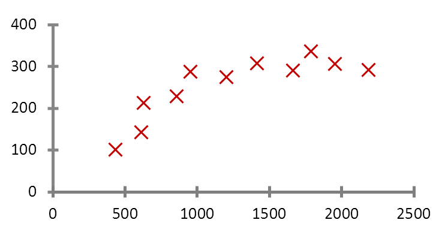
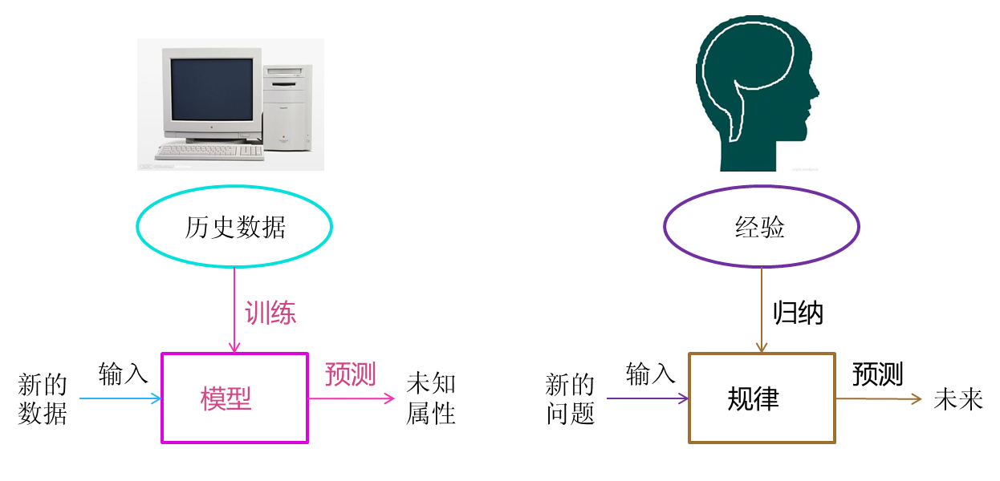
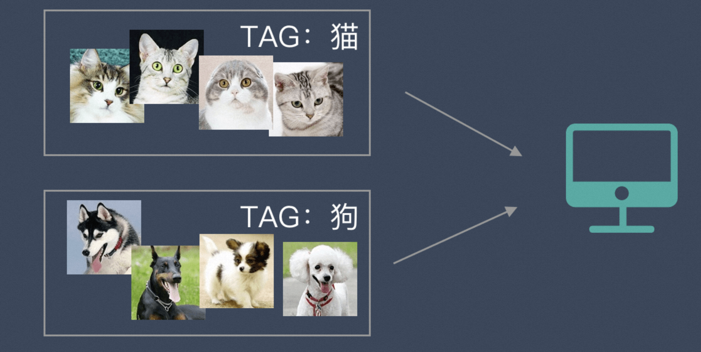
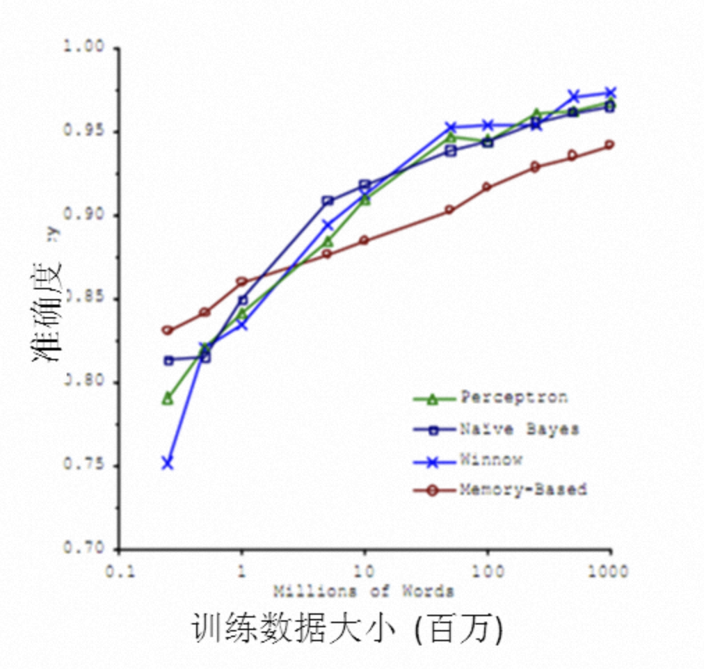
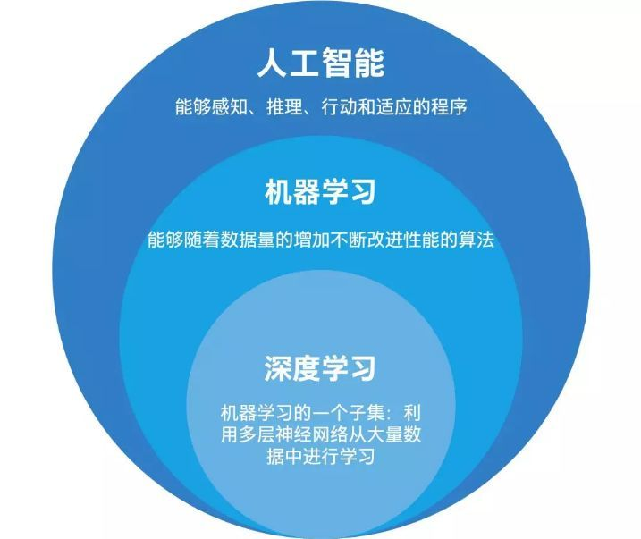
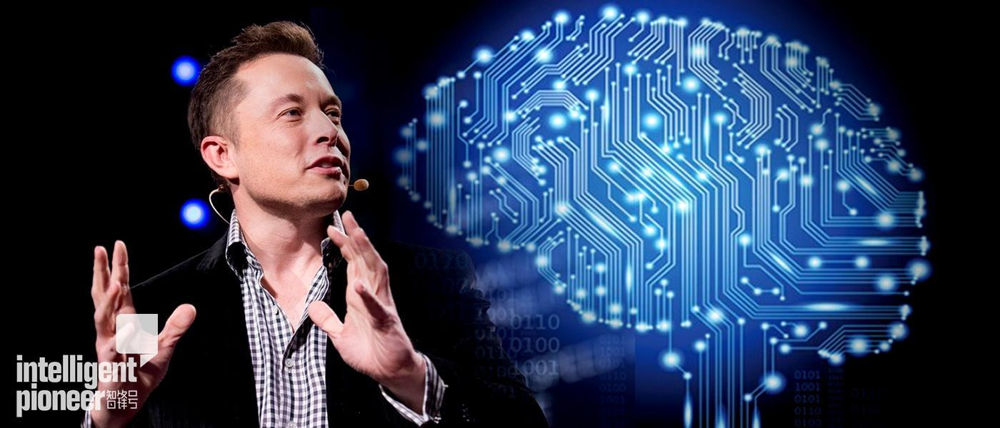

# 1 机器学习是什么

1956 年提出 AI 概念，短短 3 年后（1959） Arthur Samuel 就提出了机器学习的概念：

> Field of study that gives computers the ability to learn without being explicitly programmed.

从广义上来说，**机器学习是一种能够赋予机器学习能力，从而使其完成直接编程无法实现的功能的方法**。但从实践的意义上来说，**机器学习是一种通过利用数据，训练出模型，然后使用模型预测的一种方法**。

**机器学习**这个词是英文名称 **Machine Learning**（简称 ML）的直译，在计算界 Machine 一般指计算机。这个名字使用了拟人的手法，说明了这门技术是让机器“学习”的技术。但是计算机是死的，怎么可能像人类一样“学习”呢？

传统上如果我们想让计算机工作，我们给它一串指令，然后它遵照这个指令一步步执行下去。有因有果，非常明确。但这样的方式在机器学习中行不通。机器学习根本不接受你输入的指令，相反，它接受你输入的数据。也就是说，**机器学习是一种让计算机利用数据而不是指令来进行各种工作的方法**，传统的机器学习主要依赖“统计”相关性，而非严格的“因果”逻辑。

机器学习的基本思路如下：

1. 把现实生活中的问题抽象成数学模型，并且很清楚模型中不同参数的作用。
2. 利用数学方法对这个数学模型进行求解，从而解决现实生活中的问题。
3. 评估这个数学模型，是否真正地解决了现实生活中的问题，解决得如何。

无论使用什么算法，使用什么样的数据，最根本的思路都逃不出上面的 3 步。

当我们理解了这个基本思路就能发现：不是所有问题都可以转换成数学问题的，那些没有办法转换的现实问题就无法通过机器学习来解决。同时最难的部分也就是把现实问题转换为数学问题这一步。

拿国民话题的房子来说。现在我手里有一栋房子需要售卖，我应该给它标上多大的价格？房子的面积是 100 平方米，价格是 100 万，120 万，还是 140 万？

很显然，我希望获得房价与面积的某种规律。那么我该如何获得这个规律？用报纸上的房价平均数据么？还是参考别人面积相似的？无论哪种，似乎都并不是太靠谱。

我现在希望获得一个合理的，并且能够最大程度地反映面积与房价关系的规律。于是我调查了周边与我房型类似的一些房子，获得一组数据。这组数据中包含了大大小小房子的面积与价格，如果我能从这组数据中找出面积与价格的规律，那么我就可以得出房子的价格。

对规律的寻找很简单，拟合出一条直线，让它“穿过”所有的点，并且与各个点的距离尽可能地小。

通过这条直线，我获得了一个能够最佳反映房价与面积关系的规律。这条直线同时也是一个下式所表明的函数：

> 房价 = 面积 * a + b

上述中的 a、b 都是直线的参数。获得这些参数以后，我就可以计算出房子的价格。

假设 a = 0.75, b = 50，则房价 = 100 * 0.75 + 50 = 125 万。这个结果与我前面所列的 100 万，120 万，140 万都不一样。由于这条直线综合考虑了大部分的情况，**因此从“统计”意义上来说，这是一个最合理的预测**。

在求解过程中透露出了两个信息：

1. 房价模型是根据拟合的函数类型决定的。如果是直线，那么拟合出的就是直线方程。如果是其他类型的线，例如抛物线，那么拟合出的就是抛物线方程。机器学习有众多算法，一些强力算法可以拟合出复杂的非线性模型，用来反映一些不是直线所能表达的情况。
2. 如果我的数据越多，我的模型就越能够考虑到越多的情况，由此对于新情况的预测效果可能就越好。这是机器学习界“数据为王”思想的一个体现。一般来说（不是绝对），数据越多，最后机器学习生成的模型预测的效果越好。

通过我拟合直线的过程，我们可以对机器学习过程做一个完整的回顾。首先，我们需要在计算机中存储历史的数据。接着，我们将这些数据通过机器学习算法进行处理，这个过程在机器学习中叫做“**训练**”，处理的结果可以被我们用来对新的数据进行预测，这个结果一般称之为“**模型**”。对新数据的预测过程在机器学习中叫做“**预测**”。

“训练”与“预测”是机器学习的两个过程，“模型”则是过程的中间输出结果，**“训练”产生“模型”，“模型”指导“预测”**。

让我们把机器学习的过程与人类对历史经验归纳的过程做个比对。

人类在成长、生活过程中积累了很多的历史与经验。人类定期地对这些经验进行“归纳”，获得了生活的“规律”。当人类遇到未知的问题或者需要对未来进行“推测”的时候，人类使用这些“规律”，对未知问题与未来进行“推测”，从而指导自己的生活和工作。

机器学习中的“训练”与“预测”过程可以对应到人类的“归纳”和“推测”过程。通过这样的对应，我们可以发现，机器学习的思想并不复杂，仅仅是对人类在生活中学习成长的一个模拟。由于机器学习不是基于编程形成的结果，因此它的处理过程不是因果的逻辑，而是通过归纳思想得出的相关性结论。

这也可以联想到人类为什么要学习历史，历史实际上是人类过往经验的总结。有句话说得很好，“历史往往不一样，但历史总是惊人的相似”。通过学习历史，我们从历史中归纳出人生与国家的规律，从而指导我们的下一步工作，这是具有莫大价值的。

# 2 机器学习的分类

机器学习根据训练方法大致可以分为 3 大类：

* 监督学习
* 非监督学习
* 强化学习

除此之外，大家可能还听过“半监督学习”之类的说法，但是那些都是基于上面 3 类的变种，本质没有改变。

## 2.1 监督学习

监督学习是指我们给算法一个数据集，并且给定正确答案。机器通过数据来学习正确答案的计算方法。

举个例子：我们准备了一大堆猫和狗的照片，我们想让机器学会如何识别猫和狗。当我们使用监督学习的时候，**我们需要给这些照片打上标签**。

我们给照片打的标签就是“正确答案”，机器通过大量学习，就可以学会在新照片中认出猫和狗。

这种通过大量人工打标签来帮助机器学习的方式就是监督学习。这种学习方式效果非常好，但是成本也非常高。

## 2.2 非监督学习

非监督学习中，给定的数据集没有“正确答案”，所有的数据都是类似的。非监督学习的任务是从给定的数据集中，挖掘出潜在的结构。

举个例子：我们把一堆猫和狗的照片给机器，**不给这些照片打任何标签**，但是我们希望机器能够将这些照片分分类。

通过学习，机器会把这些照片分为 2 类，一类都是猫的照片，一类都是狗的照片。

虽然跟上面的监督学习看上去结果差不多，但是有着本质的差别：非监督学习中，虽然照片分为了猫和狗，但是机器并不知道哪个是猫，哪个是狗。对于机器来说，相当于分成了 A、B 两类。

## 2.3 强化学习

强化学习更接近生物学习的本质，因此有望获得更高的智能。它关注的是智能体如何在环境中采取一系列行为，从而获得最大的累积回报。通过强化学习，一个智能体应该知道在什么状态下应该采取什么行为。

举个例子：当一个调皮的孩子不愿意做作业时，父母就会说：“做完作业带你去麦当劳”。这时候，小孩子眼睛闪着金光，于是调皮的孩子就会为了去麦当劳乖乖地去写作业，久而久之，就会明白只有努力写作业才能获得去麦当劳的奖励。

然而事情不是总这么简单，父母对于作业完成的顺序可能会有要求，假如父母特别希望看到孩子先做完数学，然后再做语文、英语作业，如果按照父母的意愿先做完数学再做其他作业，那么就不仅能吃上炸鸡，还可以加一个雪糕。于是小孩就会学聪明点，为了吃到更多麦当劳食品，就会按照父母的意愿去先完成数学作业，再做其他作业。最后小孩不仅知道努力做作业可以获得奖励，并且为了吃到更多的麦当劳食品，改变做作业的顺序，这就相当于找到一个好的策略，能够使小孩获得最大累积奖励。

在上面的这个例子中，调皮的孩子就是**智能体**，父母代表**环境**，麦当劳的炸鸡和雪糕分别代表不同的**奖励信号**，小孩选择不做作业、做作业、做作业的顺序就是**动作**，当前作业的完成情况可以类比为**状态**。父母（环境）会根据孩子的作业的完成情况（当前状态）给予不同的奖励，对于不同的奖励，小孩会采取不同的方式去做作业（选择动作），做作业并且先做数学作业就是最优策略。

**强化学习就是不断地根据环境的反馈信息进行试错学习，进而调整优化自身的行为策略，其目的是为了找到最优策略、或者找到最大奖励的过程**。

# 3 机器学习与大数据

在 2010 年以前，机器学习的应用在某些特定领域发挥了巨大的作用，如车牌识别，网络攻击防范，手写字符识别等等。但是，从 2010 年以后，随着大数据概念的兴起，机器学习大量的应用都与大数据高度耦合，几乎可以认为**大数据是机器学习应用的最佳场景**。而在当下（2026 年），业界不仅关注数据的“大”，更开始强调数据的“高质量”与“合规性”。

譬如，但凡你能找到的介绍大数据魔力的文章，都会说大数据如何准确预测到了某些事。

那么究竟是什么原因导致大数据具有这些魔力的呢？简单来说，就是机器学习技术。正是基于机器学习技术的应用，数据才能发挥其魔力。

**大数据的核心是利用数据的价值，机器学习是利用数据价值的关键技术**，对于大数据而言，机器学习是不可或缺的。相反，对于机器学习而言，越多的数据会越可能提升模型的精确性，同时，复杂的机器学习算法的计算时间也迫切需要分布式计算与内存计算这样的关键技术。因此，机器学习的兴盛也离不开大数据的帮助。大数据与机器学习两者是相辅相成的关系。

机器学习与大数据紧密联系。但是，必须清醒地认识到，大数据并不等同于机器学习，同理，机器学习也不等同于大数据。大数据中包含有分布式计算，内存数据库，多维分析等等多种技术。单从分析方法来看，大数据也包含以下四种分析方法：

* **大数据，小分析**：即数据仓库领域的 OLAP 分析思路，也就是多维分析思想。
* **大数据，大分析**：这个代表的就是数据挖掘与机器学习分析法。
* **流式分析**：这个主要指的是事件驱动架构。
* **查询分析**：经典代表是 NoSQL 数据库。

也就是说，**机器学习仅仅是大数据分析中的一种而已**。尽管机器学习的一些结果具有很大的魔力，在某种场合下是大数据价值最好的说明。但这并不代表机器学习是大数据下的唯一的分析方法。

机器学习与大数据的结合产生了巨大的价值。基于机器学习技术的发展，数据能够“预测”。对人类而言，积累的经验越丰富，阅历也越广泛，对未来的判断越准确。例如常说的“经验丰富”的人比“初出茅庐”的小伙子更有工作上的优势，就在于经验丰富的人获得的规律比他人更准确。而在机器学习领域，根据著名的一个实验，有效地证实了机器学习界的一个理论：即机器学习模型的数据越多，机器学习的预测效率就越好。见下图：

通过这张图可以看出，各种不同算法在输入的数据量达到一定级数后，都有相近的高准确度。于是诞生了机器学习界的名言：**成功的机器学习应用不是拥有最好的算法，而是拥有最多的数据！**

# 4 机器学习与人工智能、深度学习

**人工智能是机器学习的父类，深度学习则是机器学习的子类**。如果把三者的关系用图来表示的话，则是下图：

总结起来，人工智能的发展经历了若干阶段，从早期的逻辑推理，到中期的专家系统，这些科研进步确实使我们离机器的智能有点接近了，但还有一大段距离。直到机器学习诞生以后，人工智能界感觉终于找对了方向。基于机器学习的图像识别和语音识别在某些垂直领域达到了跟人相媲美的程度。机器学习使人类第一次如此接近人工智能的梦想。

事实上，如果我们把人工智能相关的技术以及其他业界的技术做一个类比，就可以发现机器学习在人工智能中的重要地位不是没有理由的。

人类区别于其他物体、植物、动物的最主要区别是“智慧”。而智慧的最佳体现是什么？

* 是计算能力么，应该不是，心算速度快的人我们一般称之为脑子快。
* 是反应能力么，也不是，反应快的人我们称之为灵敏。
* 是记忆能力么，也不是，这样的人我们称之为博闻广记。
* 是推理能力么，这样的人我也许会称他思维缜密，类似“福尔摩斯”，但不会称他拥有智慧。

想想看我们一般形容谁有大智慧？圣人，诸如庄子，老子等。智慧是对生活的感悟，是对人生的积淀与思考，这与我们机器学习的思想何其相似？**通过经验获取规律，指导人生与未来**。没有经验就没有智慧。

那么，从计算机来看，以上的种种能力都有种种技术去应对。

例如计算能力我们有分布式计算，反应能力我们有事件驱动架构，检索能力我们有搜索引擎，知识存储能力我们有数据仓库，逻辑推理能力我们有专家系统，但是，唯有对应智慧中最显著特征的归纳与感悟能力，只有机器学习与之对应。这也是机器学习能力最能表征智慧的根本原因。

让我们再看一下机器人的制造，在我们具有了强大的计算，海量的存储，快速的检索，迅速的反应，优秀的逻辑推理后我们如果再配合上一个强大的智慧大脑，一个真正意义上的人工智能也许就会诞生，这也是为什么说在机器学习快速发展的现在，人工智能可能不再是梦想的原因。

人工智能的发展可能不仅取决于机器学习，更取决于机器学习的子类——深度学习，深度学习技术由于深度模拟了人类大脑的构成，在视觉识别与语音识别上显著地突破了原有机器学习技术的界限，因此极有可能是真正实现人工智能梦想的关键技术。无论是早期的 AlphaGo，还是如今具备多模态能力的各种大语言模型（LLMs），其底层都依赖于深层神经网络架构。近年来，随着大模型和生成式 AI 的爆发，深度学习技术已经从视觉、语音识别拓展到了自然语言理解与逻辑推理领域，让人类前所未有地接近了通用人工智能（AGI）的梦想。

虽然深度学习这四字听起来颇为高大上，但其理念却非常简单，就是**传统的神经网络发展到了多隐藏层的情况**。

自从 90 年代以后，神经网络已经沉寂了一段时间。但是 BP 算法的重要推动者之一 Geoffrey Hinton 一直没有放弃对神经网络的研究。由于神经网络在隐藏层扩大到两个以上，其训练速度就会非常慢，因此实用性一直低于支持向量机。2006 年，Geoffrey Hinton 在科学杂志《Science》上发表了一篇文章，论证了两个观点：

1. 多隐层的神经网络具有优异的特征学习能力，学习得到的特征对数据有更本质的刻画，从而有利于可视化或分类；
2. 深度神经网络在训练上的难度，可以通过“逐层初始化”来有效克服。

通过这样的发现，不仅解决了神经网络在计算上的难度，同时也说明了深层神经网络在学习上的优异性。

从此，神经网络重新成为了机器学习界中的主流强大学习技术。同时，**具有多个隐藏层的神经网络被称为深度神经网络，基于深度神经网络的学习研究称之为深度学习**。

基于深度学习的发展极大地促进了机器学习的地位提高，更进一步地，推动了业界对机器学习父类人工智能梦想的再次重视。

# 5 机器学习的隐忧

由于人工智能借助于深度学习技术的快速发展，已经在某些地方引起了传统技术界达人的担忧。真实世界的“钢铁侠”，特斯拉 CEO 马斯克就是其中之一。马斯克在参加 MIT 讨论会时曾坦言：“人工智能的研究就类似于召唤恶魔，我们必须在某些地方加强注意。”

尽管马斯克的担心有些危言耸听，但是马斯克的推理不无道理。“如果人工智能想要消除垃圾邮件的话，可能它最后的决定就是消灭人类。”这种科幻式的极端担忧，在 2026 年已逐渐让位于更现实的议题，例如深度伪造（Deepfake）诈骗、算法偏见、版权争议以及自主武器等。马斯克认为预防此类现象的方法是引入政府的监管。在这里作者的观点与马斯克类似，在人工智能诞生之初就给其加上若干规则限制可能有效，也就是不应该使用单纯的机器学习，而应该是机器学习与规则引擎等系统的综合能够较好地解决这类问题。因为如果学习没有限制，极有可能进入某个误区，必须要加上某些引导。正如人类社会中，法律就是一个最好的规则，杀人者死就是对于人类在探索提高生产力时不可逾越的界限。

在这里，必须提一下这里的规则与机器学习引出的规律的不同，规律不是一个严格意义的准则，其代表的更多是概率上的指导，而规则则是神圣不可侵犯，不可修改的。规律可以调整，但规则是不能改变的。有效地结合规律与规则的特点，可以引导出一个合理的，可控的学习型人工智能。
