# 1、引言
简单说，算法就是：**解决问题的手段，并且是批量化解决问题的手段**。

比如你想要木头桌子，那么制造桌子的工厂就是“一套算法”。提供（输入）木头，就会得到（输出）桌子。

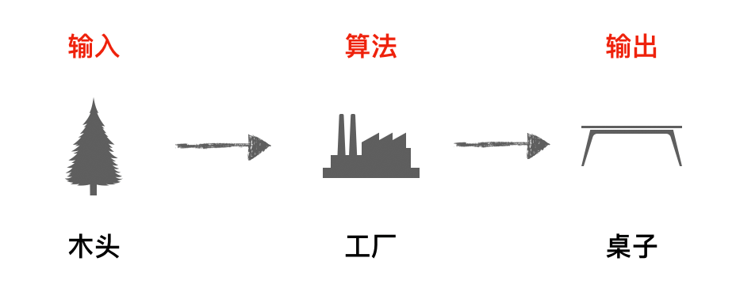

关于算法，有3点需要注意：

* 解决不同的问题可能会用到不同的算法，也可能用相同的算法。**没有某种算法是万能的**，只是适用的范围不同而已。
* **算法没有高级和低级之分**，快速便宜的解决问题才是目的，一味追求复杂的算法（例如：深度学习），相当于“用大炮打蚊子”
* 有时候有多种算法可以解决同一个问题，用最低的成本和最短的时间解决问题才是目的。**根据不同环境选择合适的算法很重要**。

机器学习算法有很多种，归本溯源来概括，就是建立映射关系 `Y = f(X)` ，针对新的 X 预测出对应的 Y，这称为**预测建模**或**预测分析**。

# 2、决策树算法

决策树是一种解决**分类问题**的算法，决策树算法采用树形结构，使用层层推理来实现最终的分类。

决策树由下面几种元素构成：
* 根节点：包含样本的全集
* 内部节点：对应特征属性测试
* 叶节点：代表决策的结果

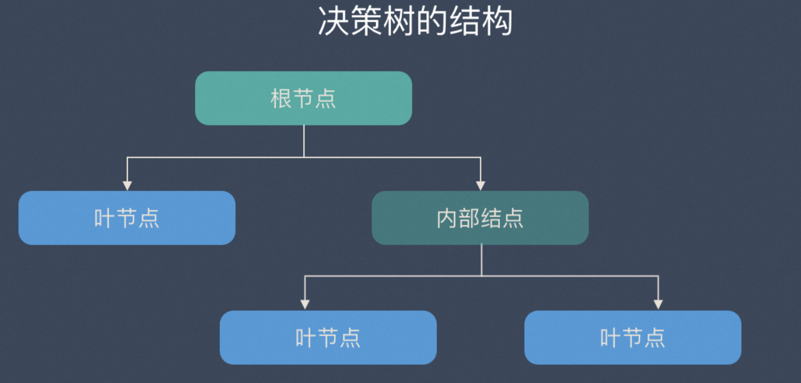

预测时，在树的内部节点处用某一属性值进行判断，根据判断结果决定进入哪个分支节点，直到到达叶节点处，得到分类结果。

这是一种基于 `if-then-else` 规则的有监督学习算法，决策树的这些规则通过训练得到，而不是人工制定的。

决策树是最简单的机器学习算法，它易于实现，可解释性强，完全符合人类的直观思维，有着广泛的应用。

下面来看一个实际的例子。

银行要用机器学习算法来确定是否给客户发放贷款，为此需要考察客户的年收入，是否有房产这两个指标。领导安排你实现这个算法，你想到了最简单的线性模型，很快就完成了这个任务。

> 首先判断客户的年收入指标。如果大于20万，可以贷款；否则继续判断。然后判断客户是否有房产。如果有房产，可以贷款；否则不能贷款。

这个例子的决策树如下图所示：

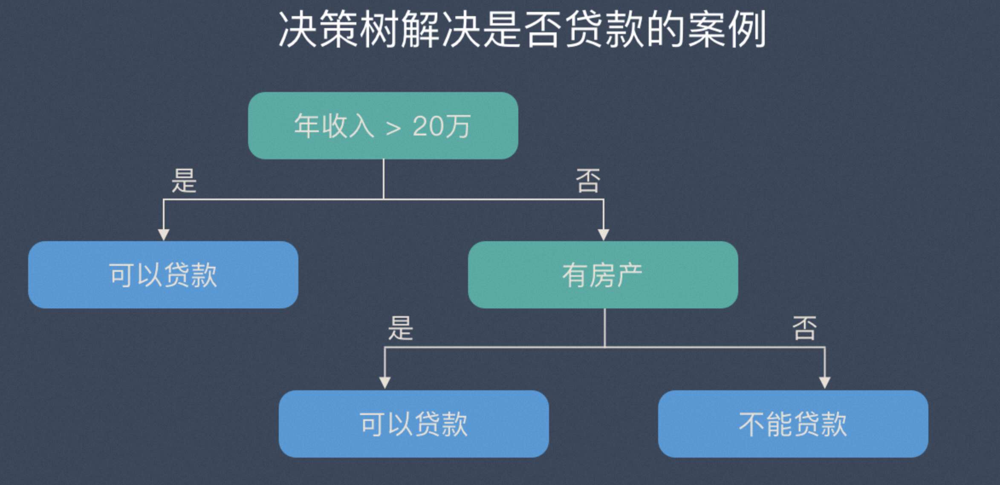

## 2.1 特征值选择

特征选择决定了使用哪些特征来做判断。在训练数据集中，每个样本的属性可能有很多个，不同属性的作用有大有小。因而特征选择的作用就是筛选出跟分类结果相关性较高的特征，也就是分类能力较强的特征。

在特征选择中通常使用的准则是：**信息增益**。

## 2.2 决策树生成

选择好特征后，就从根节点触发，对节点计算所有特征的信息增益，选择信息增益最大的特征作为节点特征，根据该特征的不同取值建立子节点；对每个子节点使用相同的方式生成新的子节点，直到信息增益很小或者没有特征可以选择为止。

## 2.3 决策树剪枝

剪枝的主要目的是对抗**过拟合**，通过主动去掉部分分支来降低过拟合的风险。

# 3、线性回归算法

## 3.1 什么是回归

**回归的目的是为了预测**，比如预测明天的天气温度，预测股票的走势…

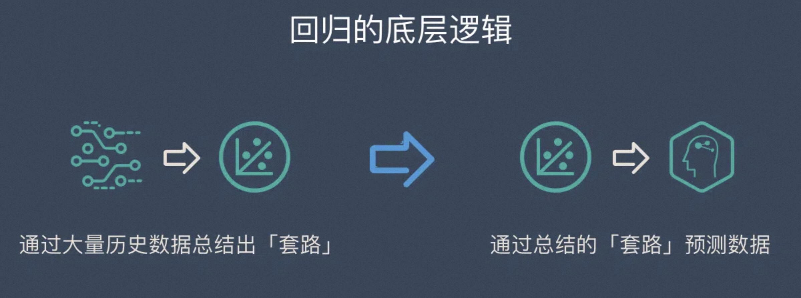

回归之所以能预测是因为他通过历史数据，摸透了“套路”，然后通过这个套路来预测未来的结果。

## 3.2 什么是线性

“越…，越…”符合这种说法的就可能是线性个关系：

* “房子”越大，“租金”就越高
* “汉堡”买的越多，花的“钱”就越多
* 杯子里的“水”越多，“重量”就越大
* ……

但是并非所有“越…，越…”都是线性的，比如“充电越久，电量越高”，就类似下面的非线性曲线：

线性关系不仅仅只能存在 2 个变量（二维平面）。3 个变量时（三维空间），线性关系就是一个平面，4 个变量时（四维空间），线性关系就是一个体。

## 3.3 什么是线性回归

线性回归本来是是统计学里的概念，现在经常被用在机器学习中。

如果 2 个或者多个变量之间存在“线性关系”，那么我们就可以通过历史数据，摸清变量之间的“套路”，建立一个有效的模型，来预测未来的变量结果。

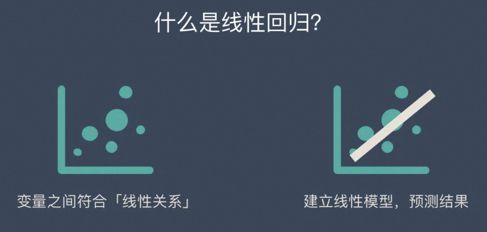

简单的说，是通过求出一条直线`y=w*x+b`，尽可能的拟合样本点。

如何拟合出一条直线最佳匹配我所有的数据？一般使用“**最小二乘法**”来求解。

“最小二乘法”的思想是这样的，假设我们拟合出的直线代表数据的真实值，而观测到的数据代表拥有误差的值。为了尽可能减小误差的影响，需要求解一条直线使所有误差的平方和最小。最小二乘法将最优问题转化为求函数极值问题。函数极值在数学上我们一般会采用求导数为0的方法。但这种做法并不适合计算机，可能求解不出来，也可能计算量太大。

计算机科学界专门有一个学科叫“数值计算”，专门用来提升计算机进行各类计算时的准确性和效率问题。例如，著名的“**梯度下降**”以及“**牛顿法**”就是数值计算中的经典算法，也非常适合来处理求解函数极值的问题。**梯度下降法是解决回归模型中最简单且有效的方法之一**。　　
　　
为什么在深度学习大杀四方的今天还使用线性回归呢？

一方面，线性回归所能够模拟的关系其实远不止线性关系。线性回归中的“线性”指的是系数的线性，而通过对特征的非线性变换，以及广义线性模型的推广，输出和特征之间的函数关系可以是高度非线性的。另一方面，也是更为重要的一点，线性模型的易解释性使得它在物理学、经济学、商学等领域中占据了难以取代的地位。

# 4、逻辑回归算法

逻辑回归是一种与线性回归非常类似的算法，但是，从本质上讲，线型回归处理的问题类型与逻辑回归不一致。**线性回归处理的是数值问题**，也就是最后预测出的结果是数字，例如房价。而**逻辑回归处理的是分类问题**，也就是说，逻辑回归预测结果是离散的分类，例如判断这封邮件是否是垃圾邮件，以及用户是否会点击此广告等等。

例如，当预测目标是0到1之间的概率，这个时候单纯的线性模型是做不到的，因为在定义域不在某个范围之内时，值域也超出了规定区间。

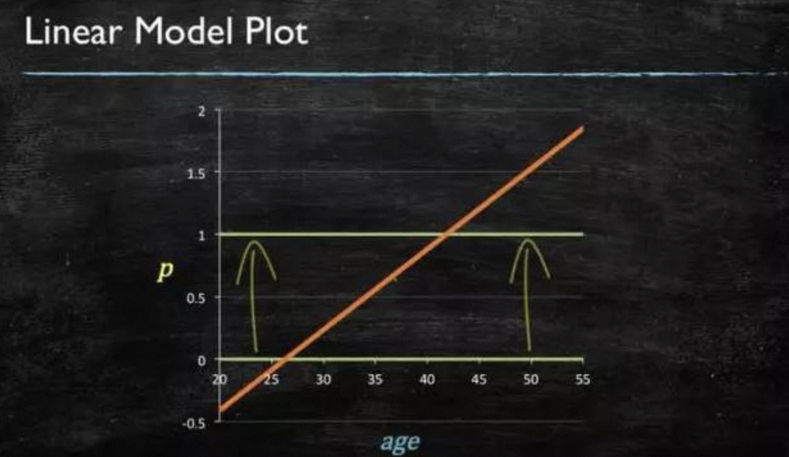

所以此时需要这样的形状的模型会比较好：

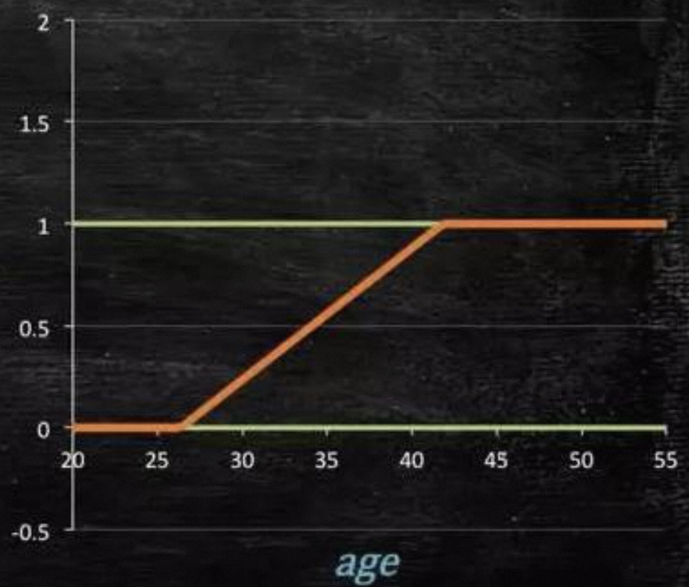

那么怎么得到这样的模型呢？

可以对线性回归的计算结果加上了一个**Sigmoid函数**，将数值结果转化为了0到1之间的概率(你只需要理解对数值越大，函数越逼近1，数值越小，函数越逼近0)，接着我们根据这个概率可以做预测，例如概率大于0.5，则这封邮件就是垃圾邮件等等。从直观上来说，逻辑回归是画出了一条分类线，见下图。

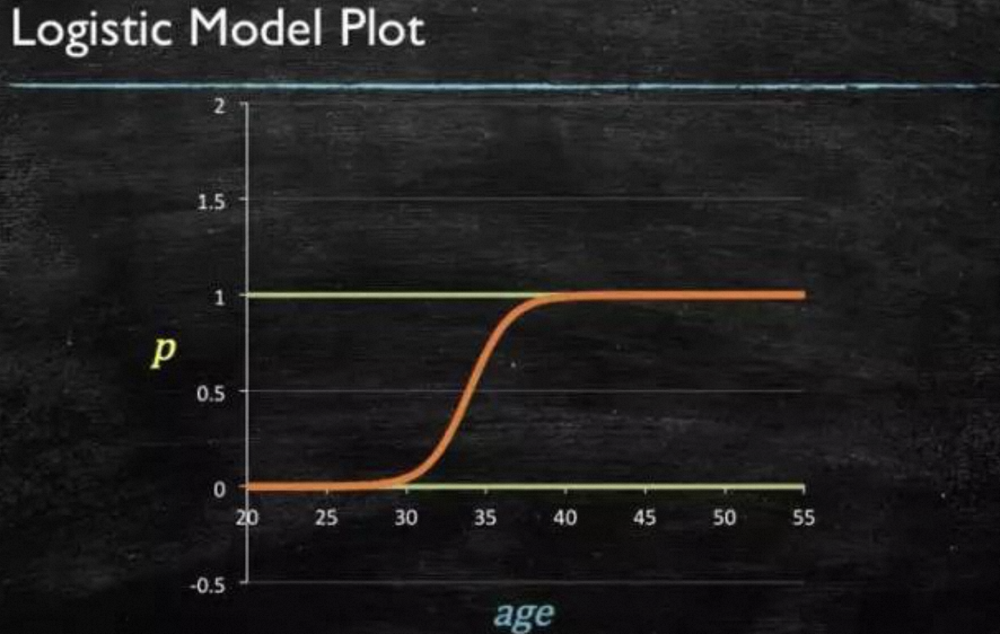

## 4.1 线性回归 VS 逻辑回归

线性回归和逻辑回归是 2 种经典的算法。经常被拿来做比较，下面整理了一些两者的区别：

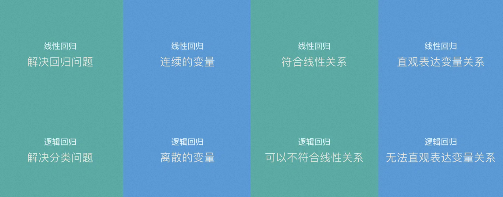

* 线性回归只能用于回归问题，逻辑回归虽然名字叫回归，但是更多用于分类问题。
* 线性回归要求因变量是连续性数值变量，而逻辑回归要求因变量是离散的变量
* 线性回归要求自变量和因变量呈线性关系，而逻辑回归不要求自变量和因变量呈线性关系
* 线性回归可以直观的表达自变量和因变量之间的关系，逻辑回归则无法表达变量之间的关系

# 5、朴素贝叶斯算法

## 5.1 贝叶斯定理

在概率论与统计学中，贝叶斯定理描述了一个事件发生的可能性，这个可能性是基于事先掌握了一些与该事件相关的情况从而推测的。也就是说，贝叶斯理论是指**根据一个已发生事件的概率，计算另一个事件的发生概率**。

从数学上贝叶斯理论可以表示为：

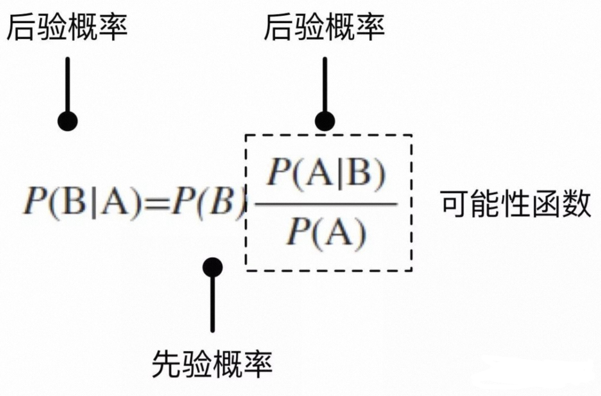

* P(B)表示发生B事件的概率；
* P(A)表示发生A事件的概率；
* P(B|A)表示在A事件已经发生的情况下B事件会发生的概率；
* P(A|B)表示在B事件已经发生的情况下A事件会发生的概率；

这时候我们再来看贝叶斯定理，这个公式说明了两个互换的条件概率之间的关系，它们通过联合概率关联起来。在这种情况下，若知道P(A|B) 的值，就能够计算P(B|A)的值。因此贝叶斯公式实际上阐述了这么一个事情，如下图所示：

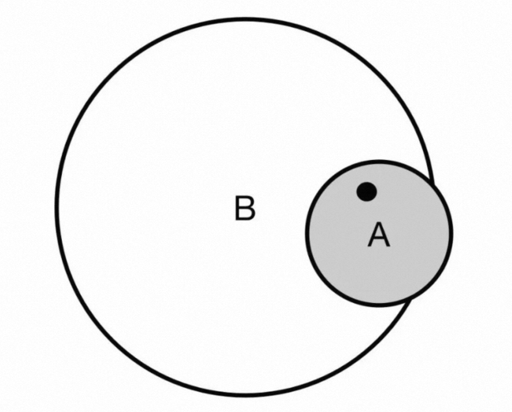

就像是上图中，已知黑点已经落入A区域了，由于A区域大部分区域与B区域相交，因此推断黑点也在B区域的概率会变大。我们想获得的结果其实是P(B|A)，即我们想知道，在考虑了一些现有的因素后，这个随机事件会以多大概率出现。参考这个概率结果，在很多事情上我们可以有针对性地作出决策。

## 5.2 朴素贝叶斯

在机器学习领域主要使用的是朴素贝叶斯算法，有方法简单、分类准确率高、速度快的特点。

**朴素贝叶斯法**（Naive Bayes）是基于**贝叶斯定理**与**特征条件独立假设**的分类方法，其分类原理就是利用贝叶斯公式根据某特征的先验概率计算出其后验概率，然后选择具有最大后验概率的类作为该特征所属的类。

之所以称之为“朴素”，是因为贝叶斯分类只做最原始、最简单的假设：**所有的特征之间都是相互独立的**。

来看一个经典的文章分类例子：输入一篇未知文档X，判断该文档属于科技类别还是娱乐类别。

根据贝叶斯理论，只需要判断`P(科技|文档X)`和`P(娱乐|文档X)`的大小。而文档其实就是一个个关键词，所以我们需要计算的是`P(科技|词1，词2，词3......)`和`P(娱乐|词1，词2，词3.....)`。所以可得：

`P(科技|词1，词2，词3)=P(词1，词2，词3|科技)*P(科技)/P(词1，词2，词3)`
`P(娱乐|词1，词2，词3)=P(词1，词2，词3|娱乐)*P(娱乐)/P(词1，词2，词3)`

上式中因为分母都有`P(词1，词2，词3)`，故可以消去。只需要比较`P(词1，词2，词3|科技)*P(科技)`和`P(词1，词2，词3|娱乐)*P(娱乐)`即可。

下图中的训练集中一共有30篇科技文章，60篇娱乐文章，共计90篇文章。这些文章中提取出重要的词语分别有`商场`、`影院`、`支付宝`和`云计算`，并统计了在不同类别文章中出现的次数。

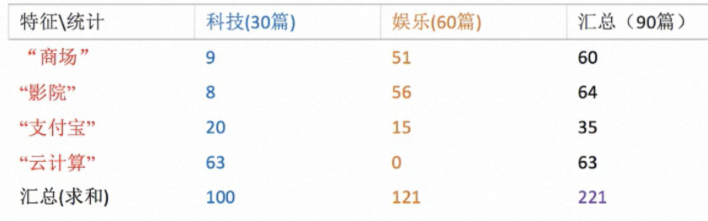

现在有一个将要被预测的文章，该文章中出现重要的词为：影院，商场与支付宝，则计算该文章属于科技、娱乐的概率分别是多少？

那么我们可以直接带入式子中进行计算：

`P(科技|影院，商场，支付宝)=P(影院，商场，支付宝|科技)*P(科技)=(8/100)(9/100)(20/100)(30/90)=0.00048`
`P(娱乐|影院，商场，支付宝)=P(影院，商场，支付宝|娱乐)*P(娱乐)=(56/121)(51/121)(15/121)(60/90)=0.01612`

可见，该文章属于娱乐类别的概率要大于属于科技类别的概率。

# 6、K-邻近算法

K-邻近算法(K Nearest Neighbor)又叫**KNN**算法，即给定一个训练数据集，对新的输入实例，在训练数据集中找到与该实例最邻近的K个实例，这K个实例的多数属于某个类，就把该输入实例分类到这个类中。这就类似于现实生活中少数服从多数的思想。

**KNN算法不仅可以用于分类，还可以用于回归**。通过找出一个样本的k个最近邻居，将这些邻居的属性的平均值赋给该样本，就可以得到该样本的属性。

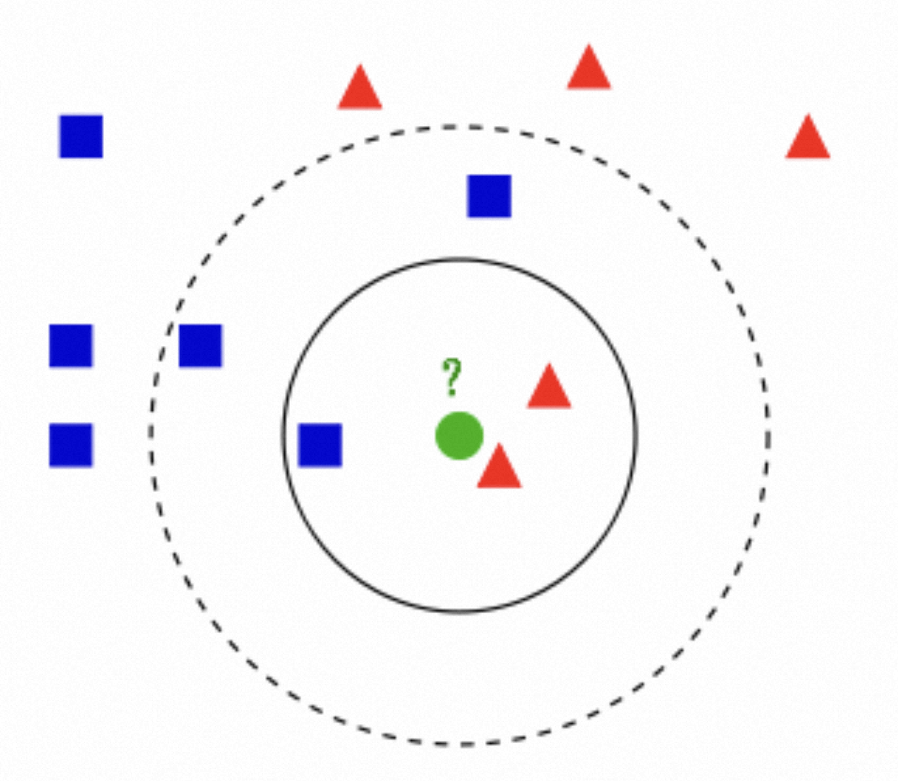

如上图所示，有两类不同的样本数据，分别用蓝色的小正方形和红色的小三角形表示，而图正中间的那个绿色的圆所标示的数据则是待分类的数据。

下面我们根据k近邻的思想来给绿色圆点进行分类：
* 如果K=3，绿色圆点的最邻近的3个点是2个红色小三角形和1个蓝色小正方形，少数从属于多数，基于统计的方法，判定绿色的这个待分类点属于红色的三角形一类。
* 如果K=5，绿色圆点的最邻近的5个邻居是2个红色三角形和3个蓝色的正方形，还是少数从属于多数，基于统计的方法，判定绿色的这个待分类点属于蓝色的正方形一类。

从上面例子我们可以看出，K-近邻算法的思想非常简单，也非常容易理解。但是要想应用于实际问题，还有很多细节要考虑，比如k怎么确定，取值多少时效果最好？所谓的最近邻又是如何来判断给定呢？

## 6.1 k值的选取

假设我们有训练数据和待分类点如下图：

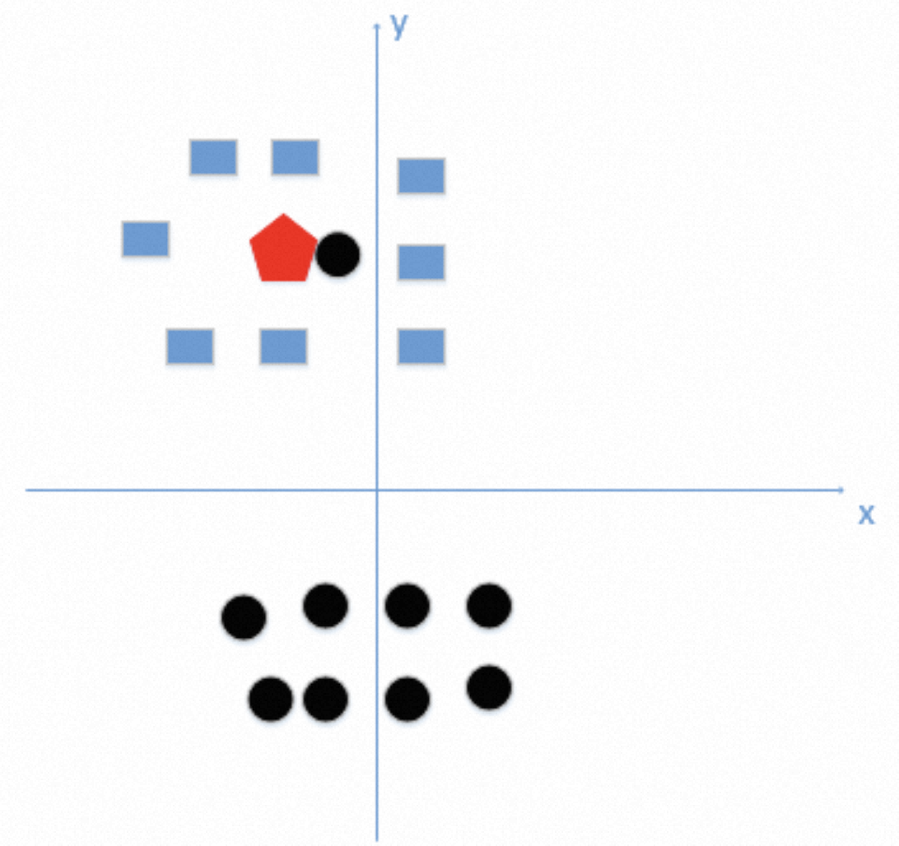

上图中有俩类，一个是黑色的圆点，一个是蓝色的长方形，现在我们的待分类点是红色的五边形。

假设我们选取k=1这个极端情况，由图中可以看到，五边形离黑色的圆点最近，k又等于1，最终判定待分类点是黑色的圆点。很明显，判别结果并不正确。

可见，如果我们选取较小的k值，容易发生**过拟合**，即很容易学习到噪声，也就非常容易判定为噪声类别。

所谓的**过拟合就是在训练集上准确率非常高，而在测试集上准确率低**，经过上例，我们可以得到k太小会导致过拟合，很容易将一些噪声（如上图离五边形很近的黑色圆点）学习到模型中，而忽略了数据真实的分布。

如果将k调大一点，使k等于8，把长方形都包括进来，很容易得到正确的分类应该是蓝色的长方形。如下图：
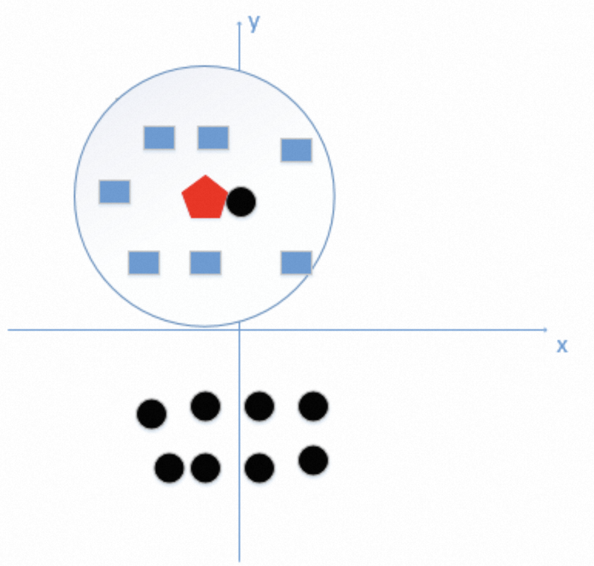

但是，K值并不是越大越好。

如果果我们选取较大的k值，就相当于用较大邻域中的训练数据进行预测，这时与输入实例较远的（不相似）训练实例也会对预测起作用，使预测发生错误。

试想，如果k=N（N为训练样本的个数）,那么无论输入实例是什么，都将简单地预测它属于在训练实例中最多的类。这时相当于就没有训练模型，直接拿训练数据统计了一下各个数据的类别，找最大的而已。如下图所示：

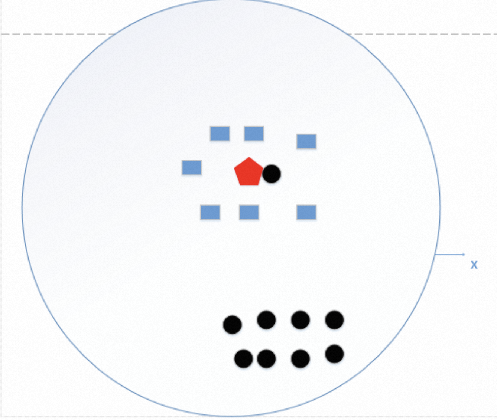

我们统计了黑色圆形是8个，长方形个数是7个，如果k=N，得出结论是：红色五边形是属于黑色圆形。很明显，判别结果也是不对的。

所以，k值既不能过大，也不能过小，在上面的例子中，k值选择在下图红色圆边界之间这个范围是最好的：

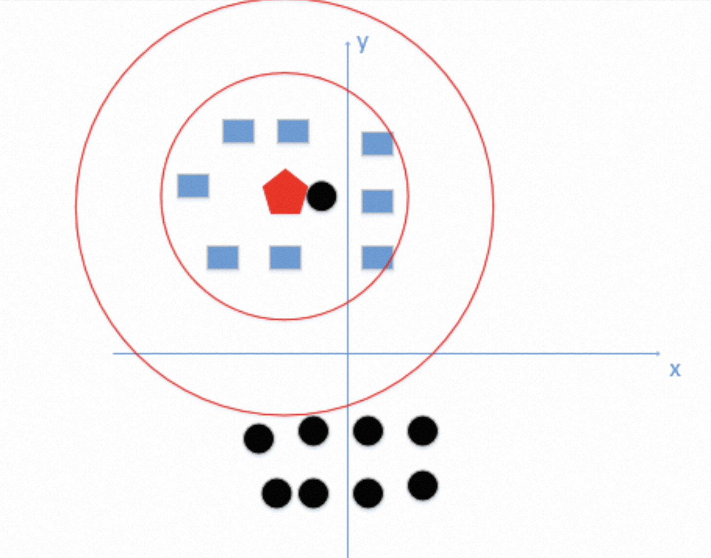

真实例子中不可能只有两个特征，但是原理是一样的。我们一般选取一个较小的数值，通常采取**交叉验证法**来选取最优的k值。

也就是说，选取k值很重要的关键是实验调参，类似于神经网络选取多少层这种，通过调整超参数来得到一个较好的结果。

## 6.2 距离的度量

有两种计算距离的方法：**欧氏距离**（欧几里得距离）和**曼哈顿距离**。

欧氏距离就是我们生活中所说的两点之间的最短距离，而曼哈顿距离就是两点之间每个维度的距离之和，我们用一张图来解释更明白：

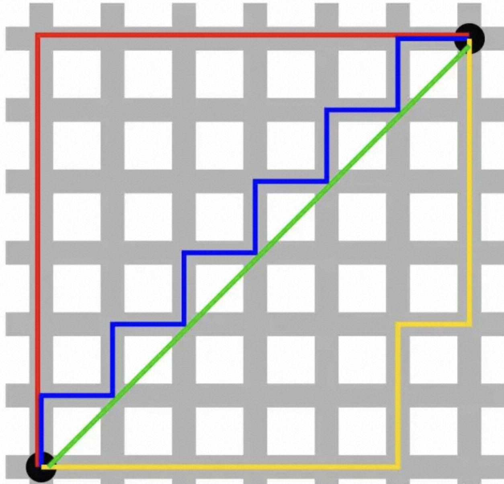

如图，在二维坐标中，两个黑点之间绿色的线就是欧氏距离；而红色、蓝色、黄色的折线都是等长的，就是曼哈顿距离。用到多维坐标中也是如此。

# 7、K-means聚类算法

K-means 是我们最常用的基于欧式距离的**聚类算法**，其认为两个目标的距离越近，相似度越大。

日常生活中，从人脸识别、语音识别到搜索引擎，我们看到越来越多人工智能领域的算法逐渐走向落地。尽管全球每日新增数据量以PB或EB级别增长，但是大部分数据属于无标注甚至非结构化。所以相对于监督学习，不需要标注的无监督学习蕴含了巨大的潜力与价值。

K-Means是**无监督学习**的杰出代表之一，常用于数据探索或挖掘前期，没有先验经验的前提下做探索性分析。

## 7.1 工作原理

K-means 有一个著名的模型——**牧师—村民模型**：

> 有四个牧师去郊区布道，一开始牧师们随意选了几个布道点，并且把这几个布道点的情况公告给了郊区所有的村民，于是每个村民到离自己家最近的布道点去听课。
> 听课之后，大家觉得距离太远了，于是每个牧师统计了一下自己的课上所有的村民的地址，搬到了所有地址的中心地带，并且在海报上更新了自己的布道点的位置。
> 牧师每一次移动不可能离所有人都更近，有的人发现A牧师移动以后自己还不如去B牧师处听课更近，于是每个村民又去了离自己最近的布道点……
> 就这样，牧师每个礼拜更新自己的位置，村民根据自己的情况选择布道点，最终稳定了下来。

我们可以看到，牧师的目的是为了让每个村民到其**最近中心点的距离和最小**。

在实践中，其工作原理如下：

（1）K-means 算法首先将所有坐标初始化为“K”集群中心。

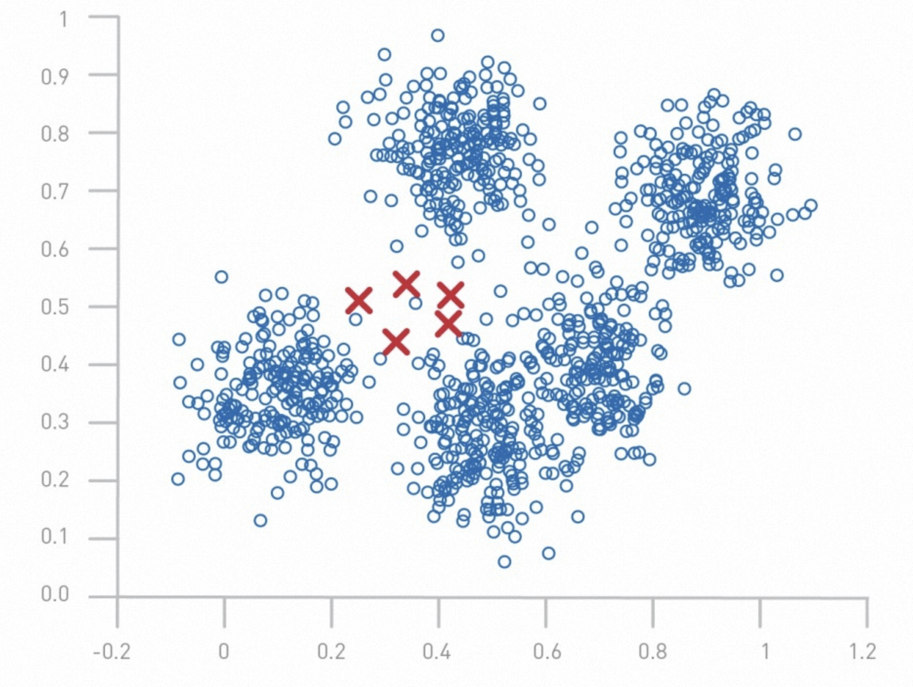

（2）每经过一次算法，每个点都会分配给其最近的集群中心。

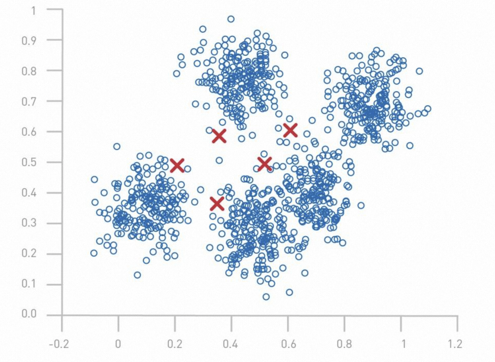

（3）然后，集群中心会被更新为在该经过中分配给其的所有点的“中心”。这是通过重新计算集群中心作为各自集群中点的平均值来实现的。

（4）算法会重复执行，直到上次迭代的集群中心发生最小变化。

如果集群呈现一致的球形形状，说明 K-means 在捕获结构和进行数据推理方面非常有效。但是，如果集群呈现更复杂的几何形状，那就说明算法在数据聚类方面做得不好。

K-means 的另一个缺点是，该算法不允许彼此距离较远的数据点共享同一集群，而不管它们是否属于该集群。K-means 本身不会从数据中了解到集群数量，而是必须预先定义信息。最后，当集群之间出现重叠时，K-means 无法确定如何分配重叠位置的数据点。

# 8、SVM 算法

**支持向量机**，Support Vector Machine，简称**SVM**，是诞生于统计学习界，同时在机器学习界大放光彩的经典算法。

## 8.1 线性可分

对于一个数据集合可以画一条直线将两组数据点分开，这样的数据成为**线性可分**。见下图：

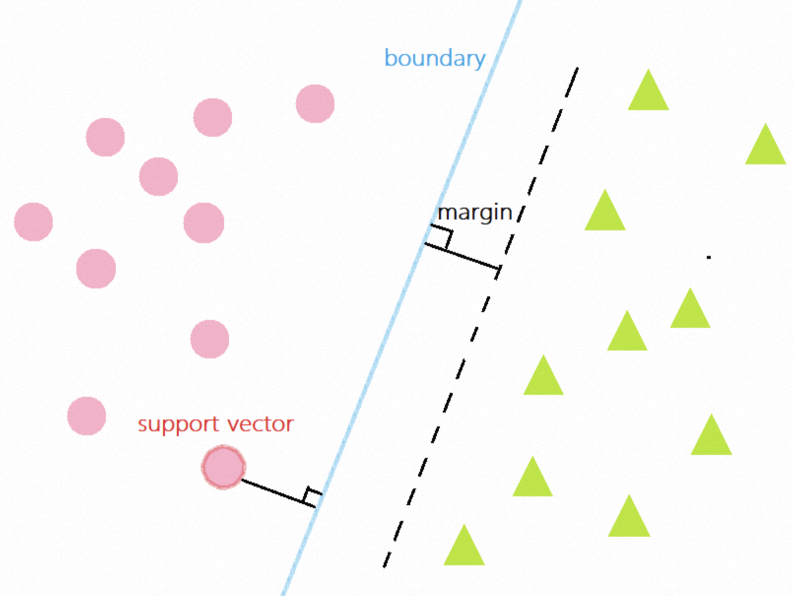

将上述数据集分隔开来的直线成为**分隔超平面**。对于二维平面来说，分隔超平面就是一条直线。对于三维及三维以上的数据来说，分隔数据的是个平面，称为**超平面**，也就是分类的决策边界。

点到分割面的距离，称为点相对于分割面的**间隔**。

数据集所有点到分隔面的最小间隔的，称为分类器或数据集的间隔。**SVM分类器就是要找最大的数据集间隔**。

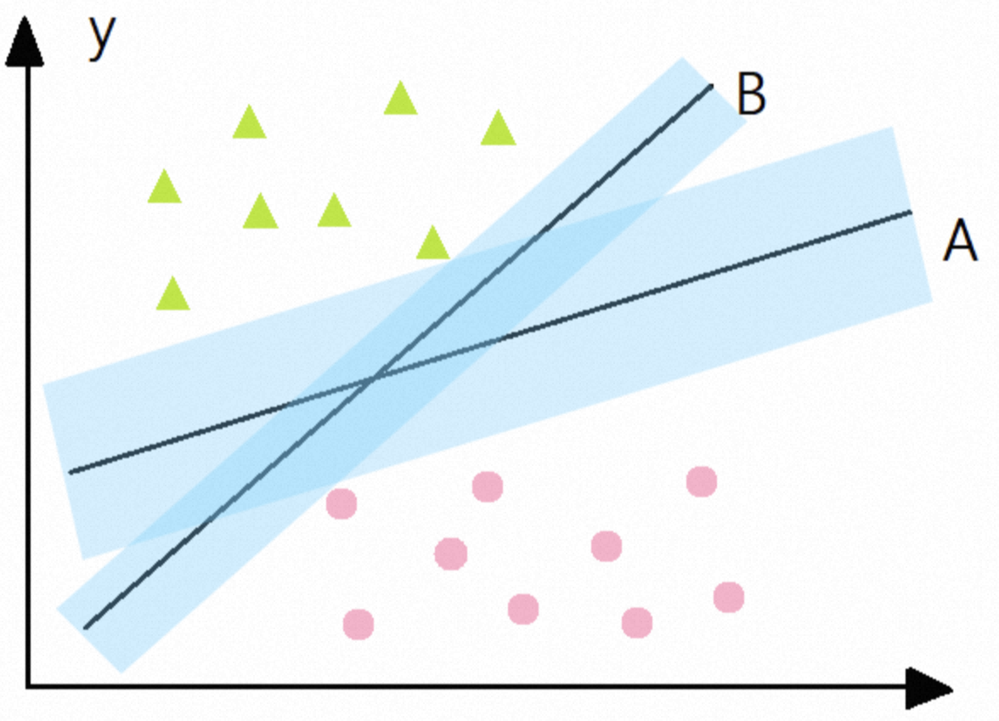

支持向量机的核心思想： **最大间隔化**，最不受到噪声的干扰。如上图所示，分类器A比分类器B的间隔（蓝色阴影）大。

## 8.2 线性不可分

如果没有**核函数**技术，支持向量机算法最多算是一种更好的线性分类技术。但是，通过跟高斯“核”的结合，支持向量机可以表达出非常复杂的分类界线，从而达成很好的的分类效果。“核”事实上就是一种特殊的函数，最典型的特征就是可以**将低维的空间映射到高维的空间**。

如下图所示的两类数据，分别分布为两个圆圈的形状，这样的数据本身就是线性不可分的，此时该如何将两类数据分开？

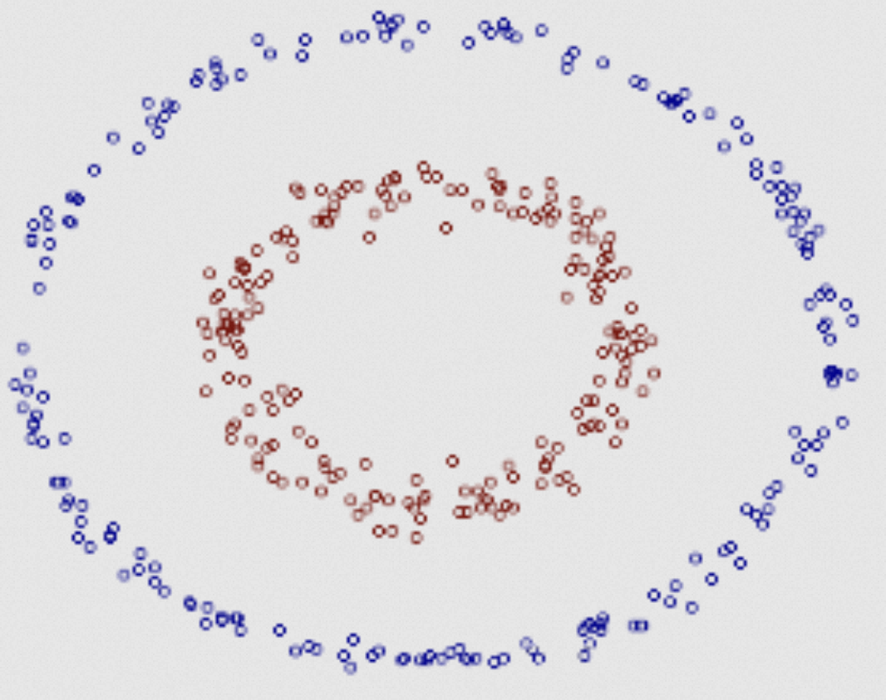

上图所述的这个数据集，是用两个半径不同的圆圈加上了少量的噪音生成得到的，所以，一个理想的分界应该是一个“圆圈”而不是一条线（超平面）。

我们如何在二维平面划分出一个圆形的分类界线？在二维平面可能会很困难，但是通过“核”可以将二维空间映射到三维空间，然后使用一个线性平面就可以达成类似效果。也就是说，二维平面划分出的非线性分类界线可以等价于三维平面的线性分类界线。于是，我们可以通过在三维空间中进行简单的线性划分就可以达到在二维平面中的非线性划分效果。

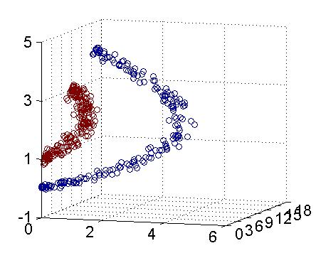

# 9、协同过滤算法

协同过滤（Collaborative Filtering, 简称CF）是**推荐系统最重要的思想之一**。在早期，协同过滤几乎等同于推荐系统。

协同过滤这个算法，目的就是**找相似**，可以是找相似的人，也可以是找相似的物，还可以更复杂，同时找相似的人与物。相应的，进化出三种常见的子类：
* **物品协同过滤**（ItemCF）：**相似的物品可能被同个用户喜欢**。这个就是著名的世界杯期间沃尔玛尿布和啤酒的故事了。这里因为世界杯期间，奶爸要喝啤酒看球，又要带娃，啤酒和尿布同时被奶爸所需要，也就是相似商品，可以放在一起销售。
* **用户协同过滤**（UserCF）：**相似的用户可能喜欢相同物品**。如加了好友的两个用户，或者点击行为类似的用户被视为相似用户。如你和你的同学互加了抖音好友，他们两人各自喜欢的视频，可能会产生互相推荐。
* **模型协同过滤**：使用矩阵分解模型来学习用户和物品的协同过滤信息。一般这种协同过滤模型有：SVD，SVD++等。

## 9.1 物品协同过滤

以图书销售推荐为例，解释物品协同过滤的过程。为了简单化，假设某图书销售平台总共有6本书销售，有6个用户购买。

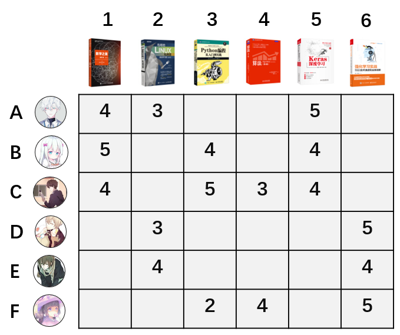

前面说到ItemCF的定义是，**相似的物品可能被同个用户喜欢**。反过来讲，**就是被同个用户喜欢的物品是相似商品**。如上图中，图书1和图书2两本书，被用户A同时喜欢，这两本书具有相似性。而图书5和图书6，没有被同个用户同时喜欢，不具有相似性。

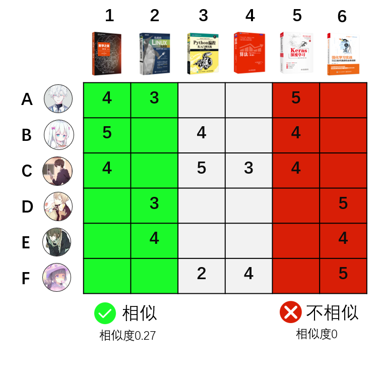

如果用**余弦相似度**计算图书1和图书2的相似度，也叫做**cosine距离**，计算过程为：

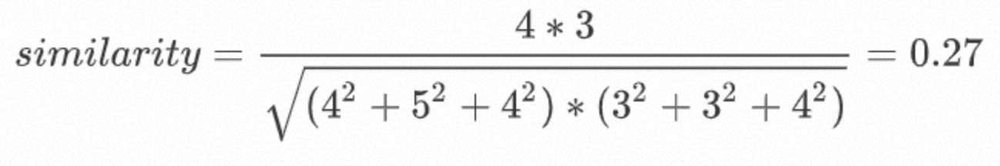

回想中学的数学知识我们就可以知道，上面的similarity计算公式，实际上就是计算书籍1的评分向量`（4,5,4,0,0,0）`和书籍2的评分向量`（3,0,3,3,4,0）`的 cos 夹角。

用同样的方式，可以算出图书1跟其他五本图书相似度分别为0.27, 0 .79，0.32,0.99和0。对每两本书计算完这个相似度后，就可以获得全部图书的相似矩阵。

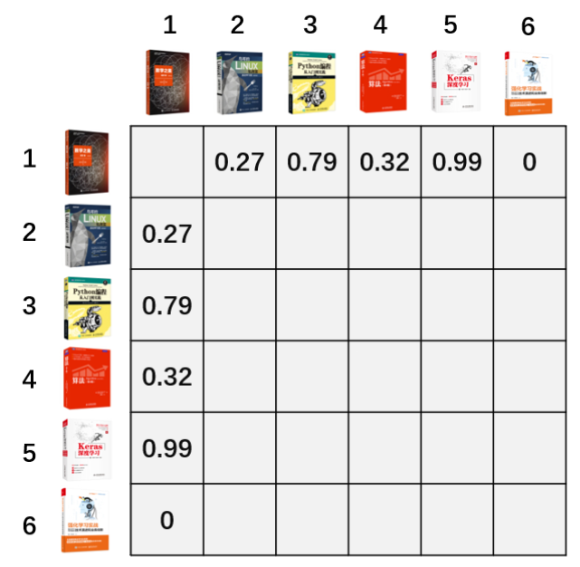

一个平台不仅仅有6本图书6个用户，我们再扩展到一般的情况。计算物品的相似度，实际是计算每两个物品评分向量的cosine距离，评分向量的每一维，代表了一个用户，下图中，表格的第一行代表了所有用户对物品A的评分。当有100万个用户时，也就是计算每两个100万维向量的距离。这样就导致计算量很大，而且很多平台不仅仅只有100万用户，因而这个低效的计算方式需要改进。

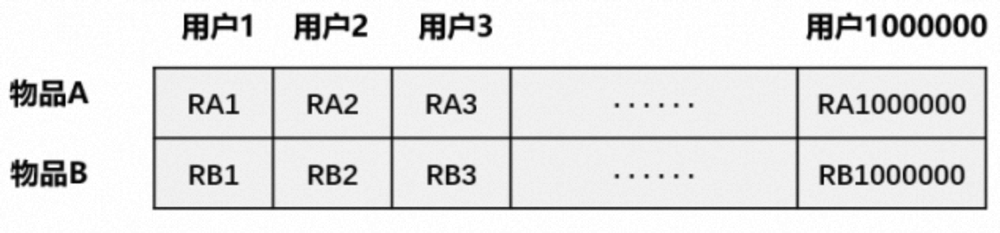

有了评分矩阵之后，预测决策一般有两种场景。

**一种是根据相似度排序推荐最近邻物品**。类似于“看了还看”，“买了还买”场景。在这里的例子中，我们知道图书1和其他图书的相似度排序分别是图书5，图书3，图书4和图书2。当用户点击了图书1时，就可以按照相似顺序从高到低推荐。

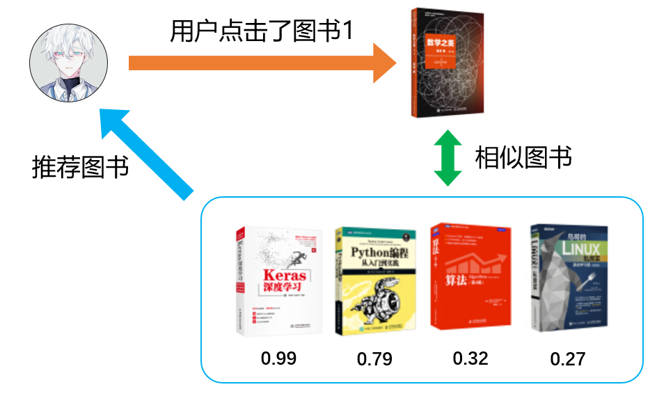

**第二种是根据相似度预测评分推荐物品**。如何决策要不要给用户B推荐图书2，图书4和图书6呢？如下图，通过`用户B对图书1的评分 * 未知图书与图书1的相似度`来预测用户B对剩下图书的评分。如`图书2的预测评分 =  图书1的评分5分 * 图书1和图书2的相似度0.27` ，从而用户B对图书2的评分是：`5*0.27=1.35`。同样方式计算出其他图书的评分预测。
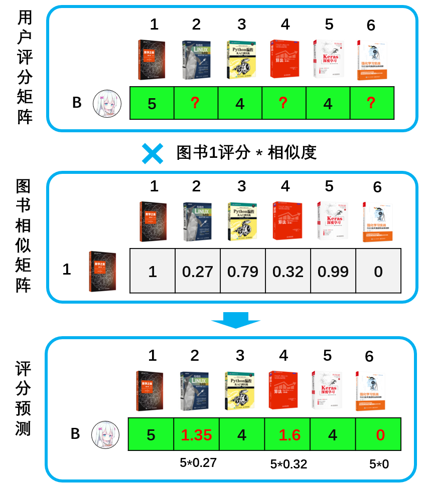

上面的结果来看，用户B对其他图书评分比较低，这几本图书推荐的可能性大大减少。

## 9.2 用户协同过滤

用户协同过滤（UserCF）的计算方式跟物品协同过滤（ItemCF）的计算方式类似。不同的是由计算两两物品的相似度，转换成计算两两用户的相似度。如下图所示：

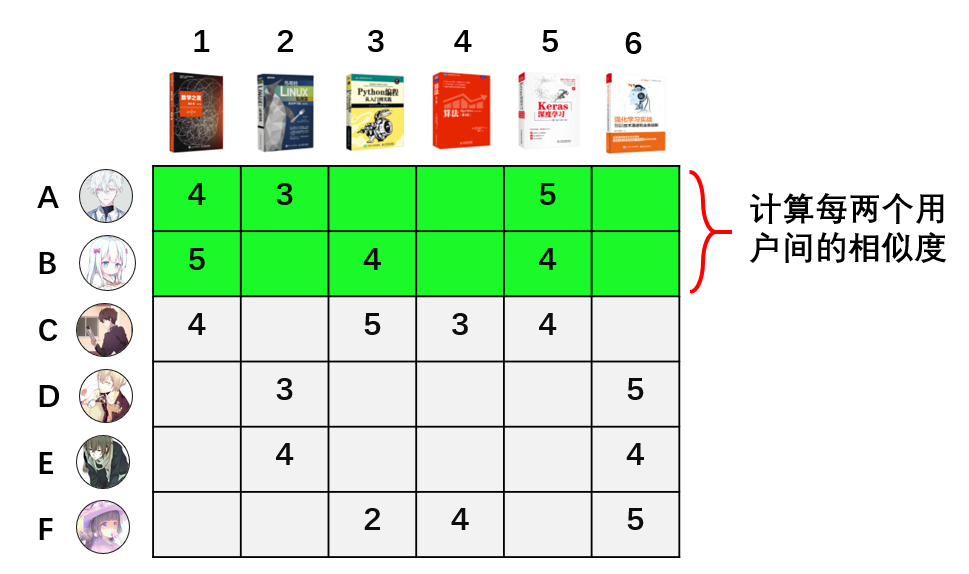

评分了相同图书的用户为相似用户，他们的相似度同样也用cosine相似度公式来计算。计算完相似度后，就可以根据用户间的相似性，预测用户对未评分图书进行评分预测。

但是在电商平台上，由于用户评分的**稀疏性**（很多用户压根不评分），没有评分的用户无法跟其他用户计算相似性，从而导致很多用户之间没有相似度。

时间到了移动互联网的今天，我们更多是用点击数据，用户好友关系，通讯录或者甚至是同一个WIFI地址来计算用户协同过滤，数据稀疏性得到一定程度上的解决。现在，用户的协同过滤在信息流内容推荐，社交性的推荐系统有着很好的利用。比如抖音，因为内容更新频繁，用户协同过滤可以作为很好的召回手段，所以也就会出现老公点赞的视频会被推荐给他老婆的情景。

## 9.3 模型协同过滤

SVD算法的诞生，跟美国Netflix公司有关。这家公司中文名叫网飞，拍了大家熟悉的网剧《纸牌屋》。

时间来到2006年，Netflix发起一个推荐系统的悬赏竞赛。他们公开了自己网站的用户数据评分数据包，并放出100万美元悬赏优化推荐算法。凡是能在Netflix现有的推荐系统基础上，把均方根误差降低10%的人，都能参与瓜分这100万美元。消息一放出，引来了无数高手参加。这场比赛中，最佳算法就是SVD。

背景介绍完了，接下来直接介绍SVD是怎么计算的。

还是跟前面那样，简单化问题：假设一个平台只有4个用户和4本图书。

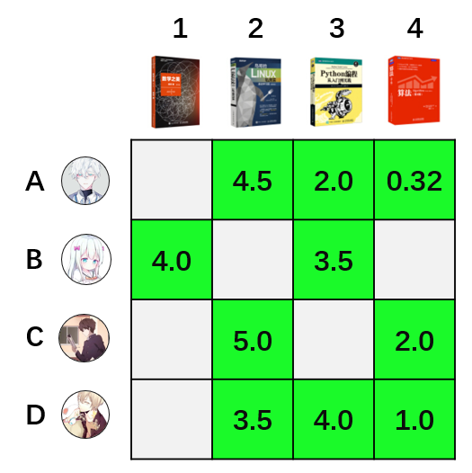

根据线性代数我们知道，一个矩阵可以分解为多个矩阵的乘积。**SVD**英文全称叫做`Singular Value Decomposition`，这个算法是个**矩阵分解**的通用名称，在不同领域有不同的形式。在推荐系统领域，可以简单的认为，**SVD就是将一个矩阵，在一定的精度损失下，将一个矩阵分解成两个矩阵**。运用这个算法，我们可以将上图的矩阵做以下的近似分解：

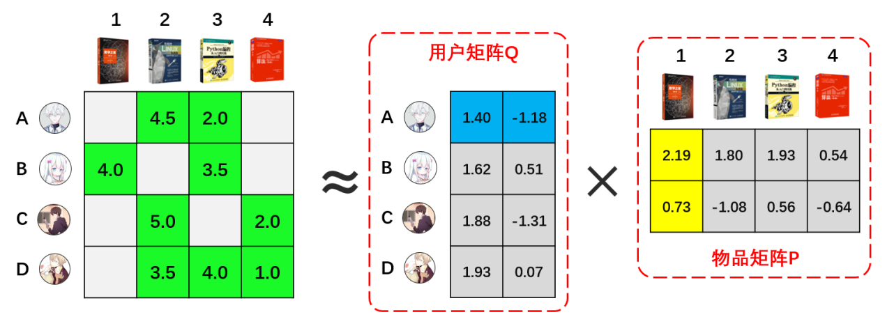

其中，用户矩阵部分代表着每个用户的偏好在一个二维隐语义空间上的映射。同样地，物品矩阵代表着每本图书的特性在一个二维隐语义空间上的映射。这两个矩阵也就是模型的结果。这样，我们训练模型的时候，就只需要训练用户矩阵中的8个参数和物品矩阵中的8个参数即可。大大减少了计算量。

模型训练的过程，简单地说，就是通过最小二乘法，不断将用户评分数据迭代入矩阵中计算，直到把均方误差优化到最小。

通过模型训练，我们得到用户矩阵Q和物品矩阵P后，全部用户对全部图书的评分预测可以通过`R = PQ`来获得。如上图中，用户A的向量`(1.40,-1.18)`乘以物品2的向量`（2.19,0.73）`则可得用户A对物品1的评分预测为：`1.40×(-1.18)+2.19×0.73=2.21`。

对所有的用户和物品都执行相同操作，可以得到全部用户对全部物品的评分。如下图右侧矩阵：

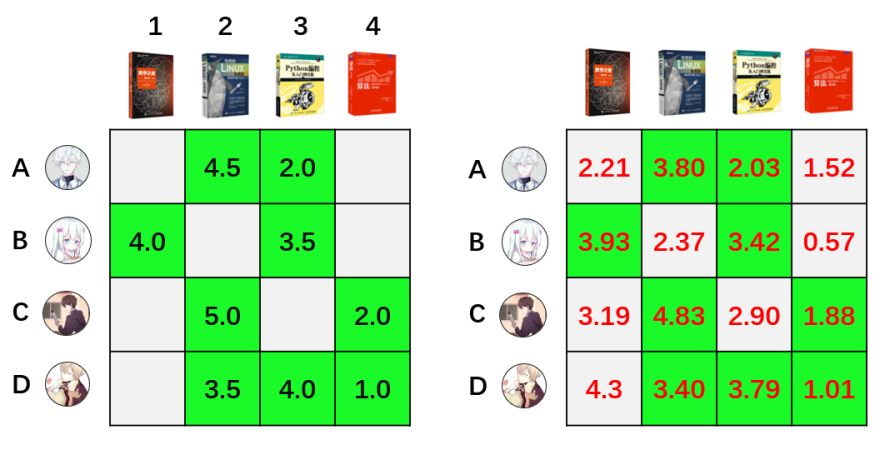

得到全部的评分预测后，我们就可以对每本图书进行择优推荐。需要注意的是，用户矩阵和物品矩阵的乘积，得到的评分预估值，与用户的实际评分不是全等关系，而是近似相等的关系。如上图中两个矩阵绿色部分，用户实际评分和预估评分都是近似的，有一定的误差。

在现在的实际应用中，SVD一般作为协同过滤的离线召回使用。一般地，将需要给用户推荐的物品提前离线计算好，存在HBASE中，在用户有请求的时候，直接读取推荐的结果，放入初排阶段的召回集中。

# 10、神经网络算法

## 10.1 人工神经网络-ANN

人工神经网络(Artificial Neural Networks，ANN)算法是80年代机器学习界非常流行的算法，不过在90年代中途衰落。现在，携着“深度学习”之势，神经网络重装归来，重新成为最强大的机器学习算法之一。

神经网络的诞生起源于对大脑工作机理的研究。早期生物界学者们使用神经网络来模拟大脑。机器学习的学者们使用神经网络进行机器学习的实验，发现在视觉与语音的识别上效果都相当好。在BP算法(加速神经网络训练过程的数值算法)诞生以后，神经网络的发展进入了一个热潮。

简单来说，**神经网络的学习机理就是分解与整合**。在著名的Hubel-Wiesel试验中，学者们研究猫的视觉分析机理是这样的。

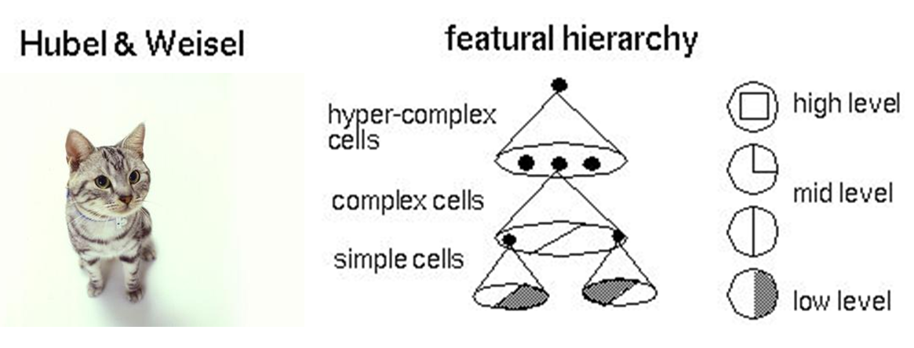

比方说，一个正方形，分解为四个折线进入视觉处理的下一层中。四个神经元分别处理一个折线。每个折线再继续被分解为两条直线，每条直线再被分解为黑白两个面。于是，一个复杂的图像变成了大量的细节进入神经元，神经元处理以后再进行整合，最后得出了看到的是正方形的结论。这就是大脑视觉识别的机理，也是神经网络工作的机理。

让我们看一个简单的神经网络的逻辑架构。

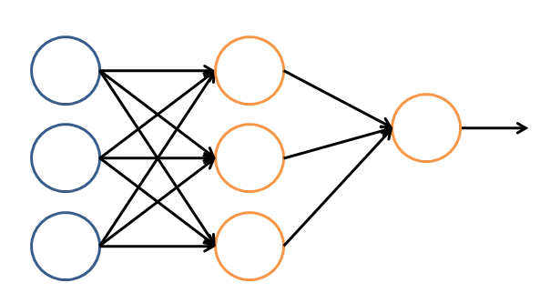

在这个网络中，分成输入层，隐藏层，和输出层。输入层负责接收信号，隐藏层负责对数据的分解与处理，最后的结果被整合到输出层。每层中的一个圆代表一个处理单元，可以认为是模拟了一个神经元，若干个处理单元组成了一个层，若干个层再组成了一个网络，也就是"神经网络"。

在神经网络中，每个处理单元事实上就是一个逻辑回归模型，逻辑回归模型接收上层的输入，把模型的预测结果作为输出传输到下一个层次。通过这样的过程，神经网络可以完成非常复杂的非线性分类。

在实际应用中，以ANN为基础，演化出了三种更为复杂的子类：

* 文本分析或自然语言处理的**递归神经网**络(简称RNN)
* 常用于影像数据进行分析处理的**卷积神经网络**(简称CNN)
* 常用于数据生成或非监督式学习应用的**生成对抗网络**(简称GAN)

## 10.2 循环神经网络–RNN

首先从架构的角度来理解RNN和ANN之间的区别：

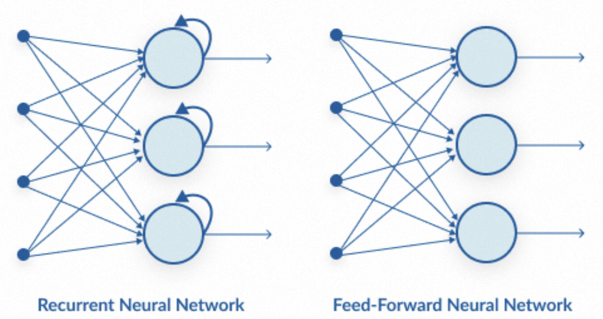

RNN在隐藏状态上有一个**循环连接**。**此循环可以从在输入数据中捕获顺序信息，赋予网络一定的记忆能力，可学习具有前后相关的数据类型**。例如进行语言翻译或文本翻译，一个句子中的前后词汇通常会有一定的关系。

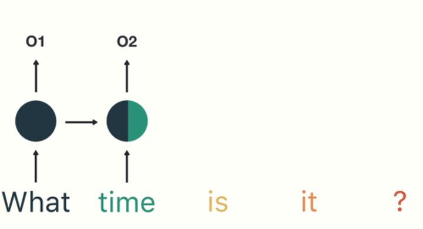

## 10.3 卷积神经网络–CNN

卷积神经网络（CNN）目前在深度学习领域非常流行，使我们能够在**计算机视觉**中获得超人的性能，它在2010年代早期达到了人类的精度，而且其精度仍在逐年提高。

CNN像滑动窗口一样扫描输入并生成中间表征，然后在它到达末端的全连接层之前对其进行逐层抽象。
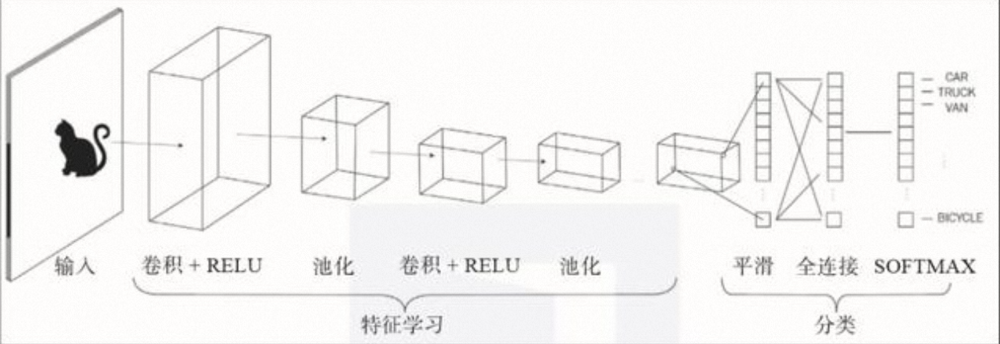

CNN也已成功应用于非图像数据集。Facebook的研究小组发现了一个基于卷积神经网络的先进自然语言处理系统，其卷积网络优于RNN，而后者被认为是任何序列数据集的首选架构。虽然一些神经科学家和人工智能研究人员不喜欢CNN（因为他们认为大脑不会像CNN那样做），但基于CNN的网络正在击败所有现有的网络实现。

## 10.4 生成对抗网络–GAN

生成对抗网络（GAN, Generative Adversarial Networks ）是一种​ 深度学习​​​ 模型​​​，是近年来复杂分布上​无监督学习​​最具前景的方法之一。

模型通过框架中（至少）两个模块：​ ​**生成模型**​​​G（Generative Model）和​ **​判别模型**​​​D（Discriminative Model）的互相​ 博弈​​学习产生相当好的输出。因此被称为“对抗”网络，对抗是指“生成模型”与“判别模型”相互对抗，实际上他们不仅仅是对抗，而是相互合作，相互演进，相互促进。

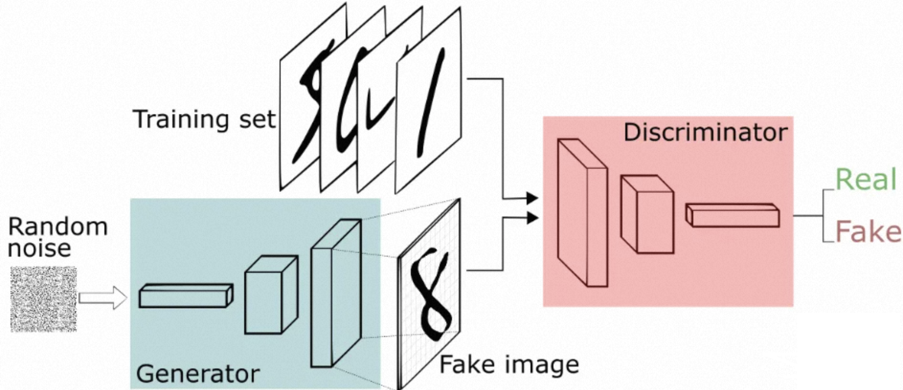

一个真实的例子就是警察和造假者之间的斗争：假设一个造假者试图制造假币，而警察试图识破它。最初，造假者没有足够的知识来制造看起来真实的假币。随着时间的流逝，造假者越来越善于制造看起来更像真实货币的假币。这时，警察起初未能识别假币，但最终他们会再次成功识别。
