# 神经元模型

### 1.1 实现原理

对于神经元的研究由来已久，早在 20 世纪初，生物学家就已经基本揭示了神经元的微观结构。

一个神经元通常具有多个**树突**，主要用来接受传入信息；而**轴突**只有一条，轴突尾端有许多轴突末梢可以给其他多个神经元传递信息。轴突末梢跟其他神经元的树突产生连接，从而传递信号。这个连接的位置在生物学上叫做“**突触**”。

人脑中的神经元形状可以用下图做简单的说明：
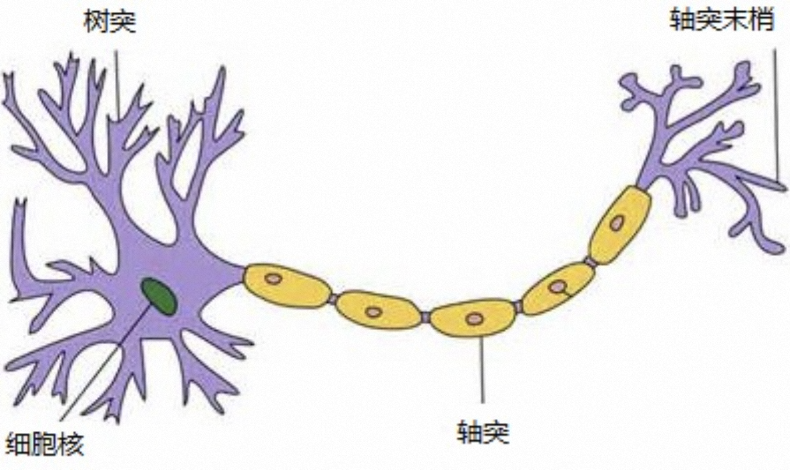
　
1943 年，心理学家 McCulloch 和数学家 Pitts 参考了生物神经元的结构，发表了**MP模型**。　

MP 模型是一个包含输入，输出与计算功能的模型。输入可以类比为神经元的树突，而输出可以类比为神经元的轴突，计算则可以类比为细胞核。

下图是一个典型的神经元模型：包含有 3 个输入，1 个输出，以及 2 个计算功能。

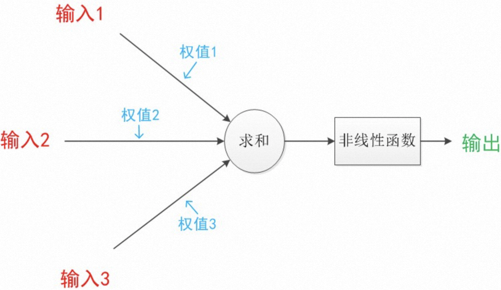

中间的箭头线称为**连接**，每一个连接上都有一个**权重**。

我们使用 `a` 来表示输入，用 `w` 来表示权值。一个表示连接的有向箭头可以这样理解：在初端，传递的信号大小是 `a`，连接路径上有加权参数 `w`，经过这个加权后，在连接的末端信号大小就变成了 `a*w`。
　　
如果我们将神经元图中的所有变量用符号表示，并且写出输出的计算公式的话，就是下图：

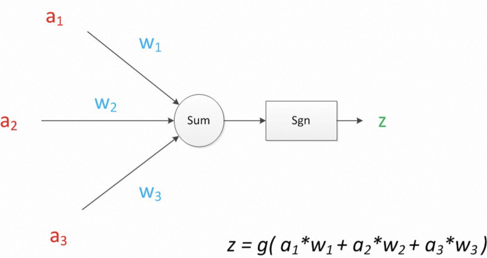

可见 `z` 是在输入和权值的线性加权和叠加了一个函数 `g` 的值。在 MP 模型里，函数 `g` 是 **sgn 函数**，也就是取**符号函数**。这个函数当输入大于 0 时，输出 1，否则输出 0。

下面对神经元模型的图进行一些扩展。首先将 `sum` 函数与 `sgn` 函数合并到一个圆圈里，代表神经元的内部计算。其次，把输入 a 与输出 z 写到连接线的左上方，便于后面画复杂的网络。最后说明，一个神经元可以引出多个代表输出的有向箭头，但值都是一样的。

**神经元可以看作一个计算与存储单元**。计算是指神经元对其输入进行处理的功能，存储是神经元会暂存计算结果，并传递到下一层。

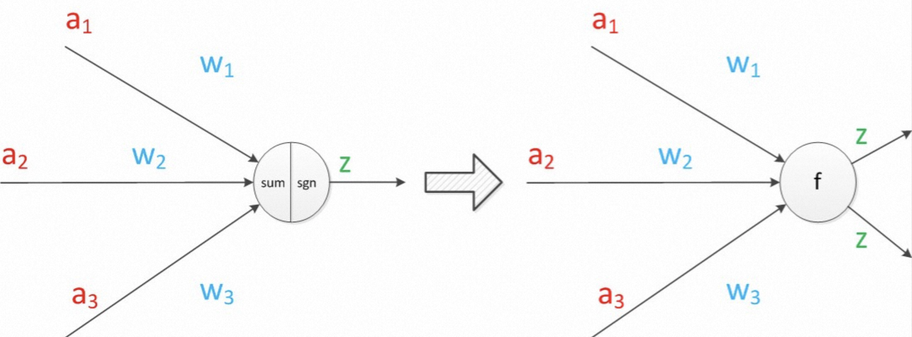　

### 1.2 应用效果

神经元模型的使用可以这样理解：我们有一个数据，称之为**样本**。样本有四个属性，其中三个属性已知，一个属性未知。我们需要做的就是**通过三个已知属性预测未知属性**。

具体办法就是使用神经元的公式进行计算。三个已知属性的值是 `a1`，`a2`，`a3`，未知属性的值是 `z`。`z` 可以通过公式计算出来。

这里，已知的属性称之为**特征**，未知的属性称之为**目标**。假设特征与目标之间确实是线性关系，并且我们已经得到表示这个关系的权值 `w1`，`w2`，`w3`。那么，我们就可以通过神经元模型预测新样本的目标。

MP 模型虽然简单，但已经建立了神经网络大厦的地基。但是，**MP 模型中的权重值都是预先设置的，需要通过人工设计来设定，因此不能学习**。

1949 年心理学家 Hebb 提出了 Hebb 学习律，认为人脑神经细胞的突触（也就是连接）的强度可以变化。于是计算科学家们开始考虑用调整权值的方法来让机器学习，但限于当时的计算机能力，直到接近 10 年后，第一个真正意义上的神经网络才诞生。

# 单层神经网络

### 2.1 实现原理

1958 年，计算科学家 Rosenblatt 提出了由两层神经元组成的神经网络。他给它起了一个名字——**感知器**（Perceptron）。

感知器模型是在原来 MP 模型的输入位置添加神经元节点，标志其为**输入单元**。其余不变，于是我们就有了下图：

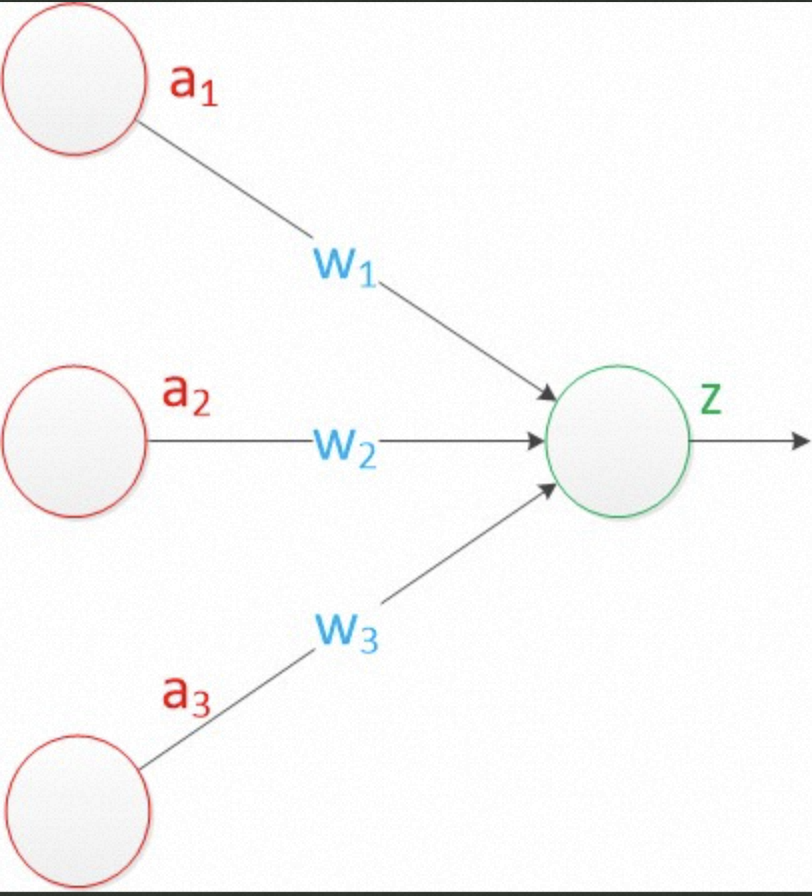

在感知器中有两个层次，分别是输入层和输出层。输入层里的输入单元只负责传输数据，不做计算。输出层里的**输出单元**则需要对前面一层的输入进行计算。

我们把需要计算的层次称之为**计算层**，并把拥有一个计算层的网络称之为**单层神经网络**。

假如，我们要预测的目标不再是一个值，而是一个向量，例如 `[2, 3]`。那么可以在输出层再增加一个输出单元。下图显示了带有两个输出单元的单层神经网络，其中输出单元 `z1` 的计算公式如下图。

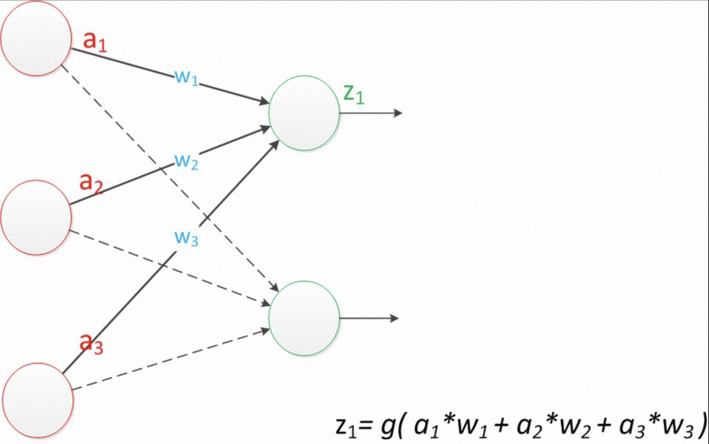

可以看到，`z1` 的计算跟原先的 `z` 并没有区别。

我们已知一个神经元的输出可以向多个神经元传递，因此 `z2` 的计算公式如下图：

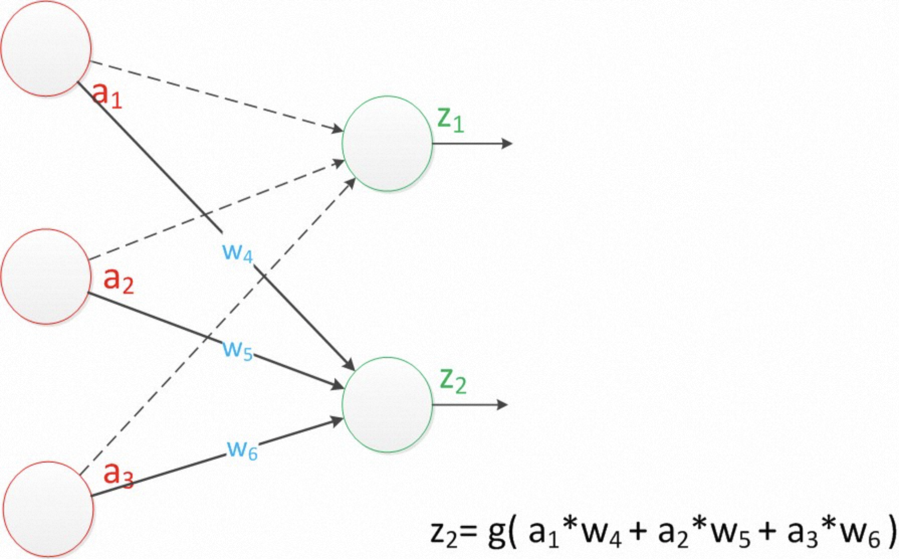

可以看到，`z2` 的计算中除了三个新的权值：`w4`，`w5`，`w6` 以外，其他与 z1 是一样的。整个网络的输出如下图：

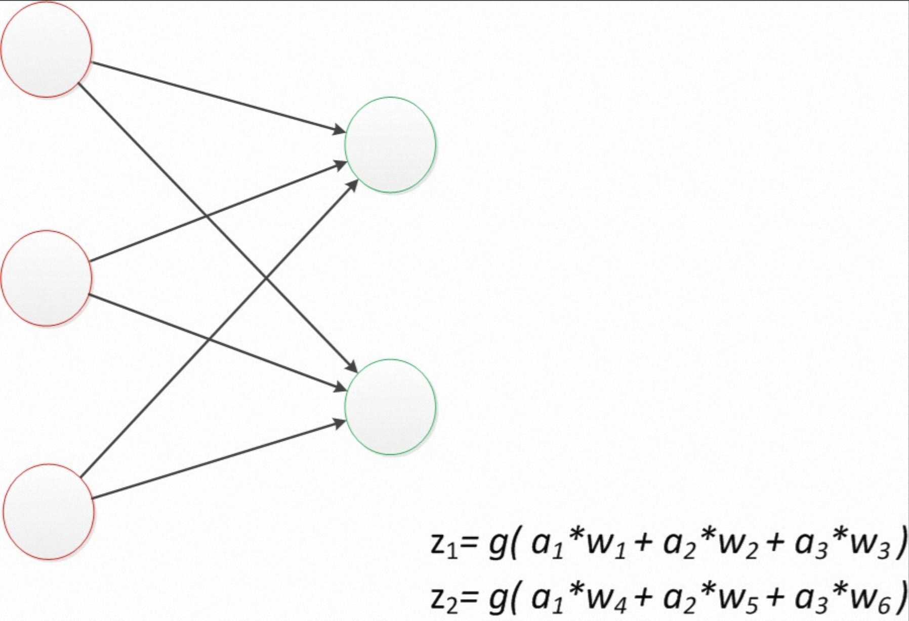

目前的表达公式有一点不让人满意的就是：`w4`，`w5`，`w6` 是后来加的，很难表现出跟原先的 `w1`，`w2`，`w3` 的关系。

因此我们改用二维的下标，用 `Wxy` 来表达一个权值。下标中的 `x` 代表后一层神经元的序号，而 `y` 代表前一层神经元的序号（序号的顺序从上到下）。

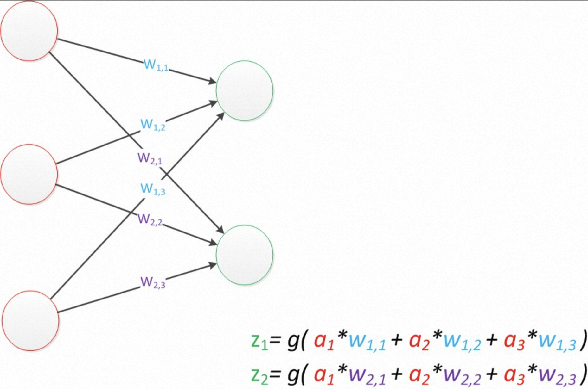

如果我们仔细看输出的计算公式，会发现这两个公式就是线性代数方程组。因此可以用矩阵乘法来表达这两个公式。

例如，输入的变量是 `[a1, a2, a3] ^ T`（代表由 `a1`，`a2`，`a3` 组成的列向量），用向量 `a` 来表示。方程的左边是 `[z1, z2] ^ T`，用向量 `z` 来表示。

系数则是矩阵 `W`（2 行 3 列的矩阵，排列形式与公式中的一样）。

于是，输出公式可以改写成：

> `g(W * a) = z;`
　　
这个公式就是神经网络中从前一层计算后一层的矩阵运算。

### 2.2 应用效果

与神经元模型不同，**感知器中的权值是通过训练得到的**。因此，根据以前的知识我们知道，感知器类似一个**逻辑回归**模型，可以做线性分类任务。

我们可以用**决策分界**来形象地表达分类的效果。决策分界就是在二维的数据平面中划出一条直线，当数据的维度是 3 维的时候，就是划出一个平面，当数据的维度是 n 维时，就是划出一个 n-1 维的**超平面**。

下图显示了在二维平面中划出决策分界的效果，也就是感知器的分类效果。

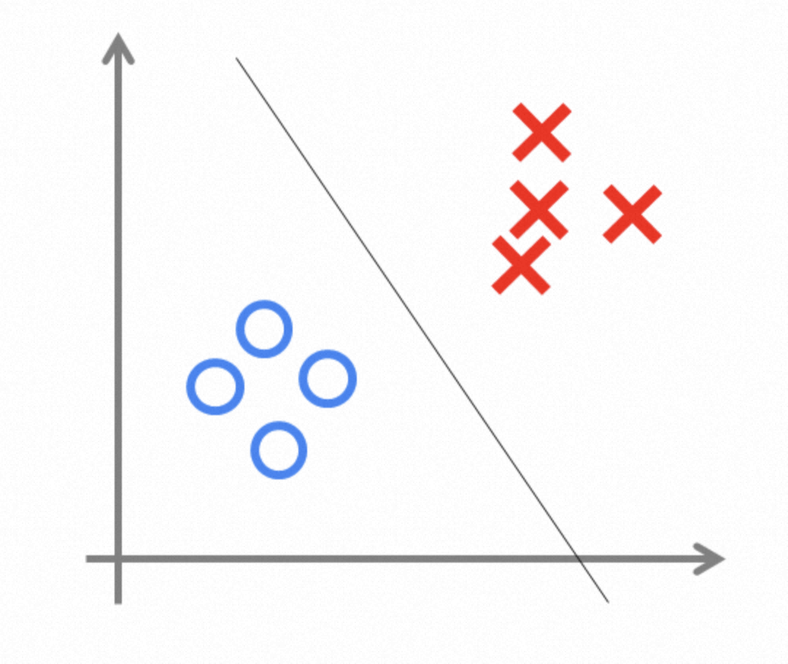

感知器有个与生俱来的缺陷：**只能做简单的线性分类任务**。但是当时的人们热情太过于高涨，并没有人清醒地认识到这点。于是，人工智能领域的巨擘 Marvin Minsky（被人尊称为**人工智能之父**）用详细的数学证明了感知器的弱点，尤其是感知器对 XOR（异或）这样的简单分类任务都无法解决。

Minsky 认为，如果将计算层增加到两层，计算量则过大，而且没有有效的学习算法。所以，他认为研究更深层的网络是没有价值的。

由于 Minsky 的巨大影响力以及书中呈现的悲观态度，让很多学者和实验室纷纷放弃了神经网络的研究。神经网络的研究陷入了冰河期。这个时期又被称为“**AI winter**”。

接近 10 年以后，对于两层神经网络的研究才带来神经网络的复苏。

# 两层神经网络

### 3.1 实现原理

1986 年，Rumelhart 和 Hinton 等人提出了**反向传播**（Backpropagation，BP）算法，解决了两层神经网络所需要的复杂计算量问题，从而带动了业界使用两层神经网络研究的热潮。这时候的 Hinton 还很年轻，30 年以后，正是他重新定义了神经网络，带来了神经网络复苏的又一春。

两层神经网络除了包含一个输入层，一个输出层以外，还增加了一个中间层。此时，中间层和输出层都是计算层。我们扩展上节的单层神经网络，在右边新加一个层次（只含有一个节点）。

现在，我们的权值矩阵增加到了两个，我们用上标来区分不同层次之间的变量。

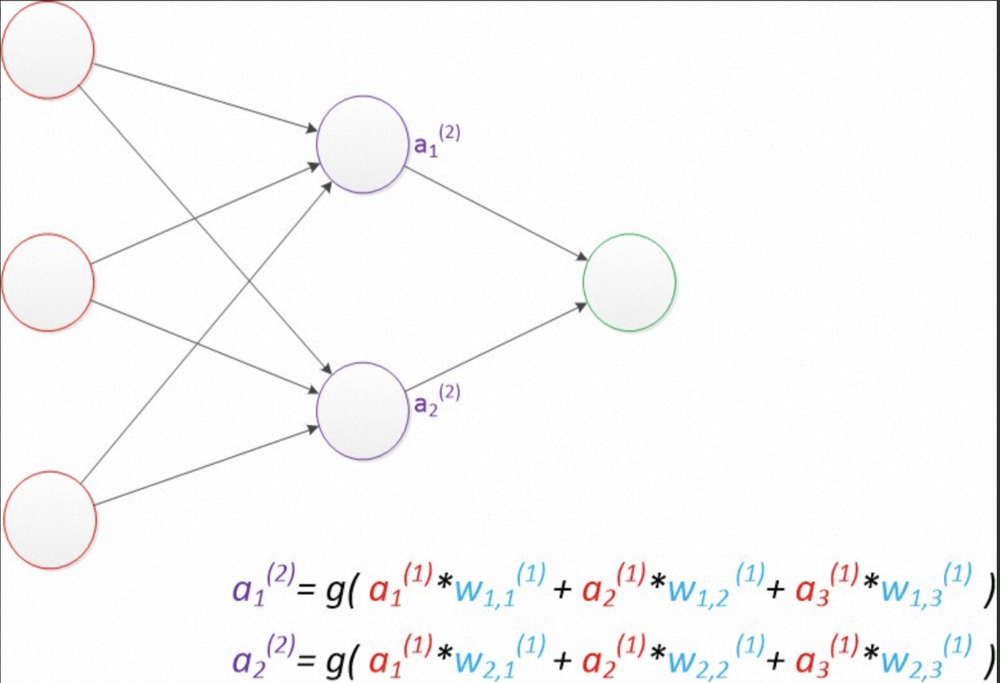

最终输出 z 是通过中间层和第二个权值矩阵计算得到的，如下图。

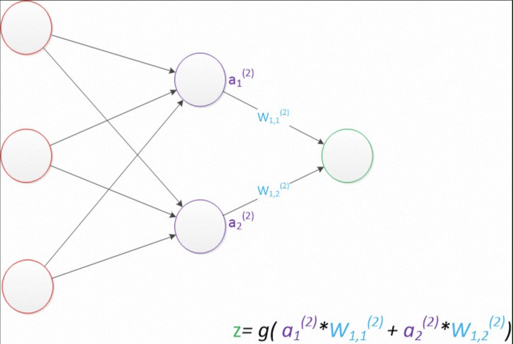

假设我们的预测目标是一个向量，那么与前面类似，只需要在“输出层”再增加节点即可。我们使用向量和矩阵来表示层次中的变量。如下图。

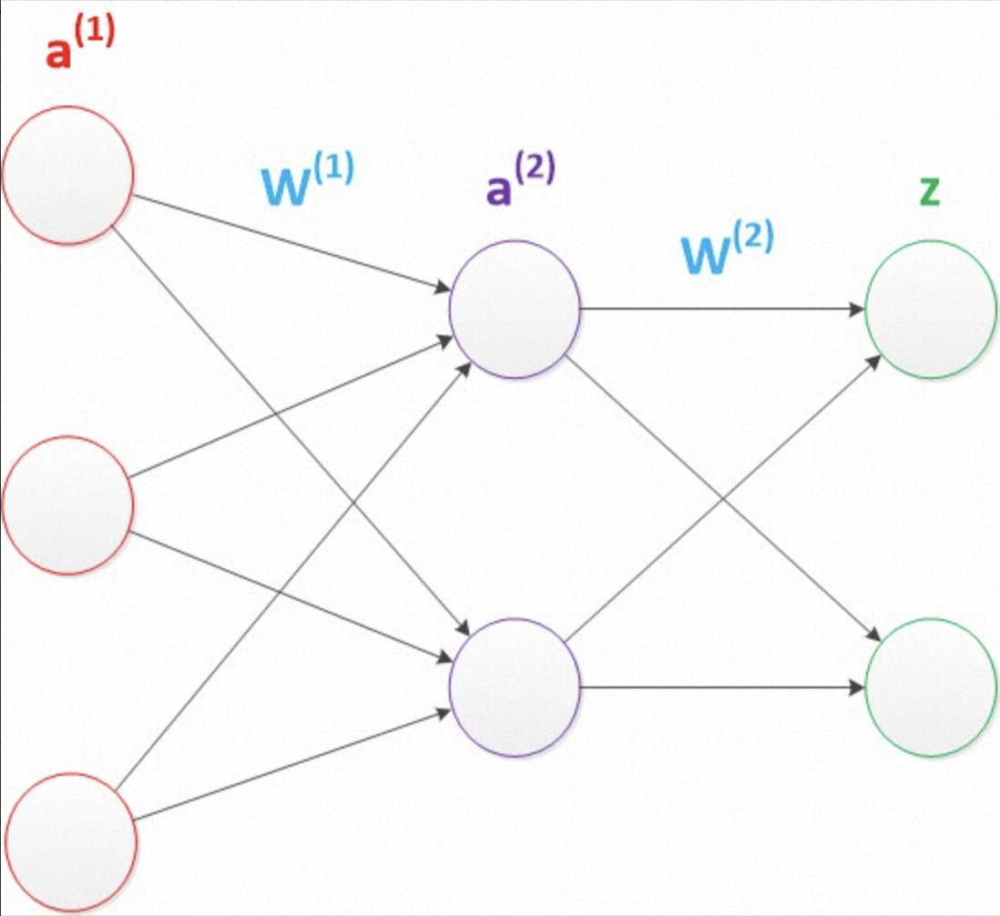

使用矩阵运算来表达整个计算公式的话如下：

> g(W(1) * a(1)) = a(2); 
> g(W(2) * a(2)) = z;

由此可见，使用矩阵运算来表达是很简洁的，而且也不会受到节点数增多的影响（无论有多少节点参与运算，乘法两端都只有一个变量）。因此神经网络的教程中大量使用矩阵运算来描述。

需要说明的是，至今为止，我们对神经网络的结构图的讨论中都没有提到**偏置节点**（bias unit）。事实上，这些节点是默认存在的。它本质上是一个只含有存储功能，且存储值永远为 1 的单元。在神经网络的每个层次中，除了输出层以外，都会含有这样一个偏置单元。正如线性回归模型与逻辑回归模型中的一样。在现代深度学习框架中，偏置通常直接作为一个独立的向量加到线性变换的结果上，而不一定在图中画出具体的节点。

偏置单元与后一层的所有节点都有连接，我们设这些参数值为向量 `b`，称之为偏置。如下图。

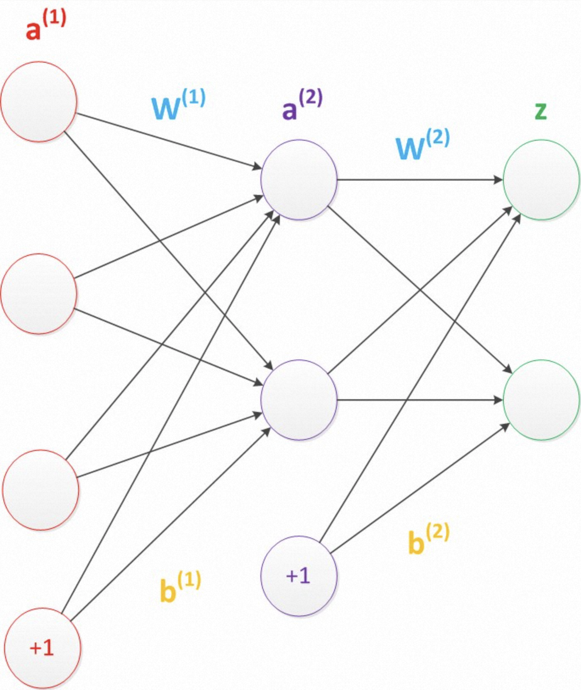

可以看出，偏置节点很好认，因为其没有输入（前一层中没有箭头指向它）。有些神经网络的结构图中会把偏置节点明显画出来，有些不会。一般情况下，我们都不会明确画出偏置节点。 

在考虑了偏置以后的一个神经网络的矩阵运算如下：

> g(W(1) * a(1) + b(1)) = a(2); 
> g(W(2) * a(2) + b(2)) = z;

需要说明的是，在两层神经网络中，我们不再使用 sgn 函数作为函数 g，而是使用平滑函数 **sigmoid** 作为函数 g。我们把函数 g 也称作**激活函数**（activation function）。

事实上，**神经网络的本质就是通过参数与激活函数来拟合特征与目标之间的真实函数关系**。而且已经从理论上证明，**两层神经网络可以无限逼近任意连续函数**。这是什么意思呢？也就是说，面对复杂的非线性分类任务，两层（带一个隐藏层）神经网络可以分类得很好。

下面就是一个例子，红色的线与蓝色的线代表数据。而红色区域和蓝色区域代表由神经网络划开的区域，两者的分界线就是决策分界。

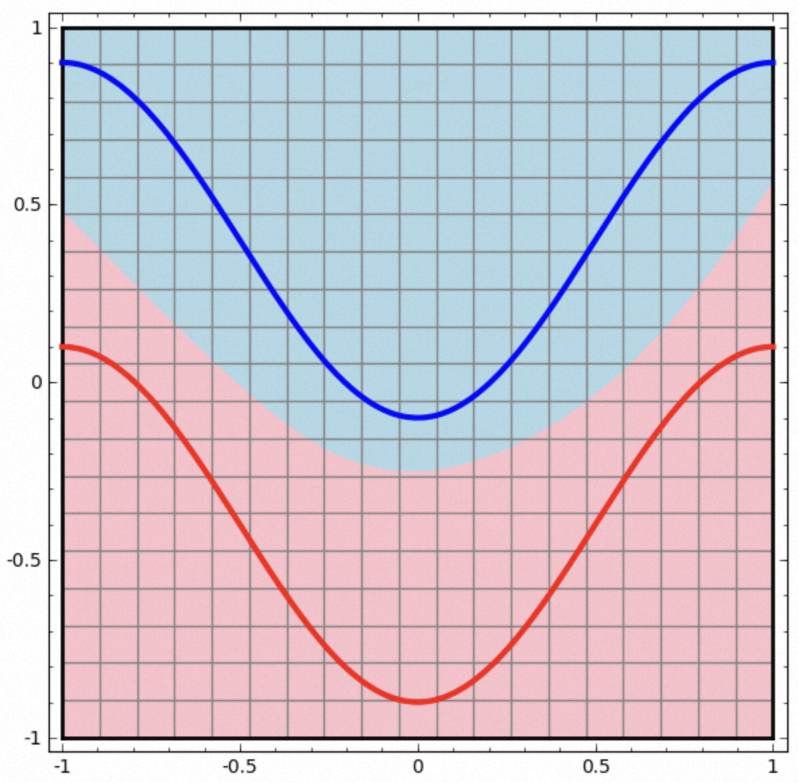

可以看到，这个两层神经网络的决策分界是非常平滑的曲线，而且分类得很好。有趣的是，前面已经学到过，单层网络只能做线性分类任务。而两层神经网络中的后一层也是线性分类层，应该只能做线性分类任务。为什么两个线性分类任务结合就可以做非线性分类任务？

我们可以把输出层的决策分界单独拿出来看一下，就是下图：

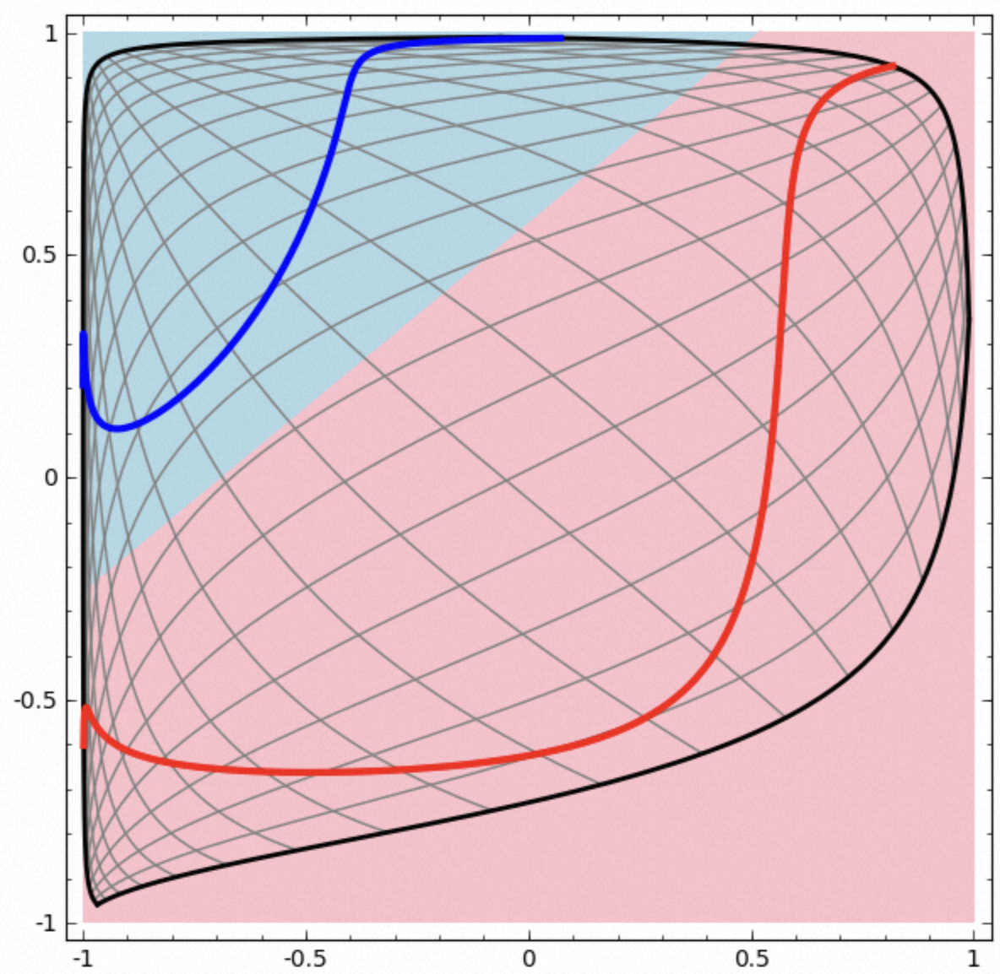

可以看到，输出层的决策分界仍然是直线。关键就是，**从输入层到隐藏层时，数据发生了空间变换**。也就是说，两层神经网络中，隐藏层对原始的数据进行了一个空间变换，使其可以被线性分类，然后输出层的决策分界划出了一个线性分类分界线，对其进行分类。

这样就导出了两层神经网络可以做非线性分类的关键——**隐藏层**。联想到我们一开始推导出的矩阵公式，我们知道，矩阵和向量相乘，本质上就是对向量的坐标空间进行一个变换。因此，**隐藏层的参数矩阵的作用就是使得数据的原始坐标空间从线性不可分，转换成了线性可分**。

两层神经网络通过两层的线性模型模拟了数据内真实的非线性函数。因此，多层的神经网络的本质就是复杂函数拟合。

在设计一个神经网络时，输入层的节点数需要与特征的维度匹配，输出层的节点数要与目标的维度匹配。而中间层的节点数，却是由设计者指定的。因此，“自由”把握在设计者的手中。但是，节点数设置的多少，却会影响到整个模型的效果。如何决定这个自由层的节点数呢？目前业界没有完善的理论来指导这个决策。一般是根据经验来设置。较好的方法就是预先设定几个可选值，通过切换这几个值来看整个模型的预测效果，选择效果最好的值作为最终选择。这种方法又叫做**网格搜索**（Grid Search）。近年来，随着神经架构搜索（NAS）和缩放定律（Scaling Laws）的发展，网络结构的设计有了更多的理论依据。

机器学习模型训练的目的，就是使得参数尽可能的与真实的模型逼近。具体做法是这样的。首先给所有参数赋上随机值。我们使用这些随机生成的参数值，来预测训练数据中的样本。样本的预测目标为 `yp`，真实目标为 `y`。那么，定义一个值 `loss`，计算公式如下。

> loss = (yp - y)^2

这个值称之为**损失**（loss），我们的目标就是使对所有训练数据的损失和尽可能的小。

如果将先前的神经网络预测的矩阵公式代入到 `yp` 中（因为有 z = yp），那么我们可以把损失写为关于参数（parameter）的函数，这个函数称之为**损失函数**（loss function）。下面的问题就是求：如何优化参数，能够让损失函数的值最小。

此时这个问题就被转化为一个优化问题。一个常用方法就是高等数学中的**求导**，但是这里的问题由于参数不止一个，求导后计算导数等于0的运算量很大，所以一般来说解决这个优化问题使用的是**梯度下降算法**。梯度下降算法每次计算参数在当前的梯度，然后让参数向着梯度的反方向前进一段距离，不断重复，直到梯度接近零时截止。一般这个时候，所有的参数恰好达到使损失函数达到一个最低值的状态。

在神经网络模型中，由于结构复杂，每次计算梯度的代价很大。因此还需要使用**反向传播算法**。反向传播算法是利用了神经网络的结构进行的计算。不一次计算所有参数的梯度，而是从后往前。首先计算输出层的梯度，然后是第二个参数矩阵的梯度，接着是中间层的梯度，再然后是第一个参数矩阵的梯度，最后是输入层的梯度。计算结束以后，所需的两个参数矩阵的梯度就都有了。

反向传播算法可以直观的理解为下图。梯度的计算从后往前，一层层反向传播。前缀 `E` 代表着相对导数的意思。

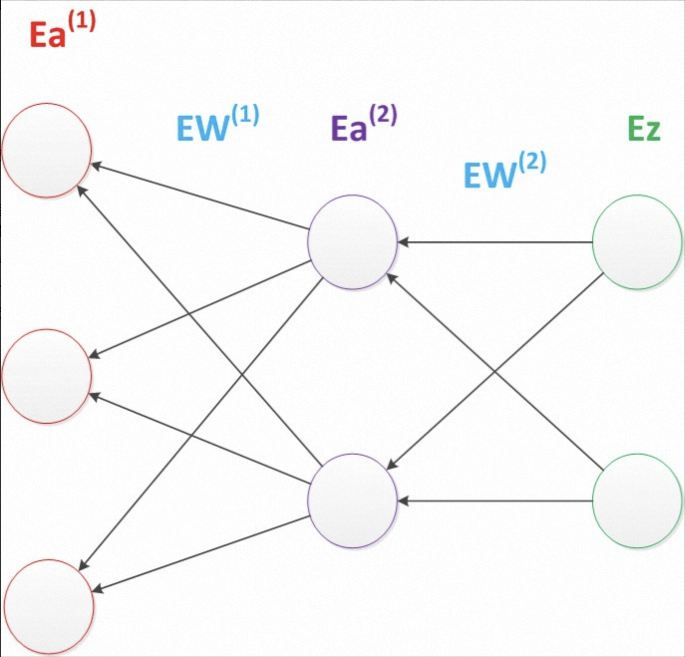

### 3.2 应用效果

两层神经网络在多个地方的应用说明了其效用与价值。10 年前困扰神经网络界的异或问题被轻松解决。神经网络在这个时候，已经可以发力于语音识别，图像识别，自动驾驶等多个领域。

历史总是惊人的相似，神经网络的学者们再次登上了《纽约时报》的专访。人们认为神经网络可以解决许多问题。就连娱乐界也受到了影响，当年《终结者》电影中的台词甚至写道："我的 CPU 是一个神经网络处理器，一个会学习的计算机"。

但是神经网络仍然存在若干的问题：尽管使用了 BP 算法，一次神经网络的训练仍然耗时太久，而且困扰训练优化的一个问题就是**局部最优解问题**，这使得神经网络的优化较为困难。同时，隐藏层的节点数需要调参，这使得使用不太方便，工程和研究人员对此多有抱怨。

90 年代中期，由 Vapnik 等人发明的**SVM**（Support Vector Machines，支持向量机）算法诞生，很快就在若干个方面体现出了对比神经网络的优势：无需调参；高效；全局最优解。基于以上种种理由，SVM 迅速打败了神经网络算法成为主流。

神经网络的研究再次陷入了冰河期。当时，只要你的论文中包含神经网络相关的字眼，非常容易被会议和期刊拒收，研究界那时对神经网络的成见可想而知。

# 多层神经网络

### 4.1 实现原理

2006 年，Hinton 在《Science》和相关期刊上发表了论文，首次提出了”深度信念网络”的概念。与传统的训练方式不同，”深度信念网络”有一个”**预训练**”（pre-training）的过程，这可以方便地让神经网络中的权值找到一个接近最优解的值，之后再使用”**微调**”（fine-tuning）技术来对整个网络进行优化训练。这两个技术的运用大幅度减少了训练多层神经网络的时间。他给多层神经网络相关的学习方法赋予了一个新名词——**深度学习**。

我们延续两层神经网络的方式来设计一个多层神经网络。

在两层神经网络的输出层后面，继续添加层次。原来的输出层变成中间层，新加的层次成为新的输出层。所以可以得到下图。

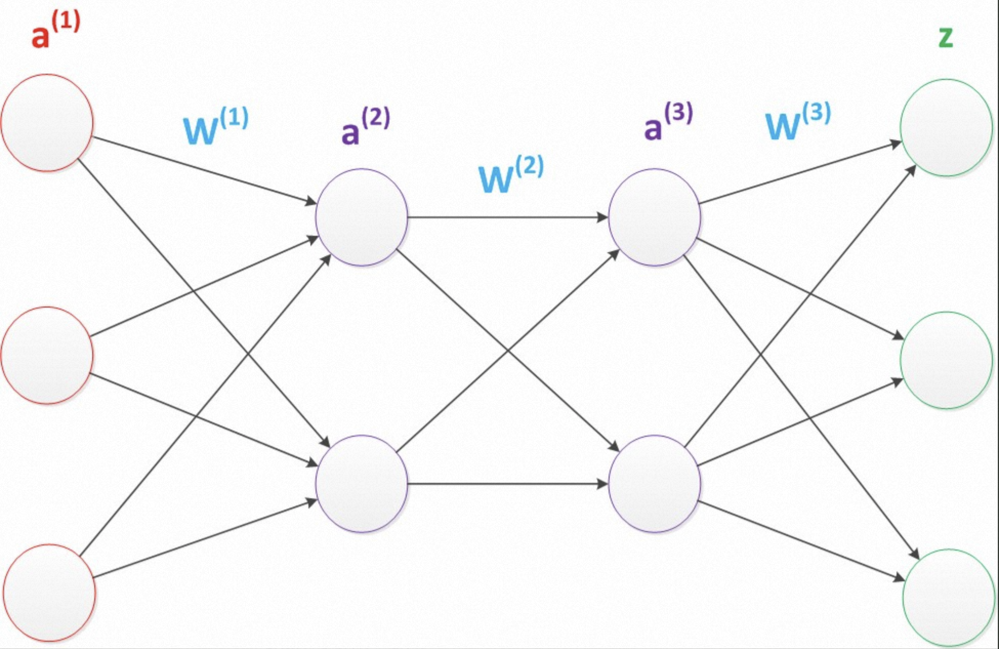

依照这样的方式不断添加，我们可以得到更多层的**多层神经网络**。公式推导的话其实跟两层神经网络类似，使用矩阵运算的话就仅仅是加一个公式而已。

在已知输入 `a(1)`，参数 `W(1)`，`W(2)`，`W(3)` 的情况下，输出 `z` 的推导公式如下：

>  g(W(1) * a(1)) = a(2);  
>  g(W(2) * a(2)) = a(3);
>  g(W(3) * a(3)) = z;

多层神经网络中，输出也是按照一层一层的方式来计算。从最外面的层开始，算出所有单元的值以后，再继续计算更深一层。只有当前层所有单元的值都计算完毕以后，才会算下一层。有点像计算向前不断推进的感觉。所以这个过程叫做**正向传播**。

下面讨论一下多层神经网络中的参数。

首先我们看第一张图，整个神经网络中的参数有 16 个（这里我们不考虑偏置节点，下同）。

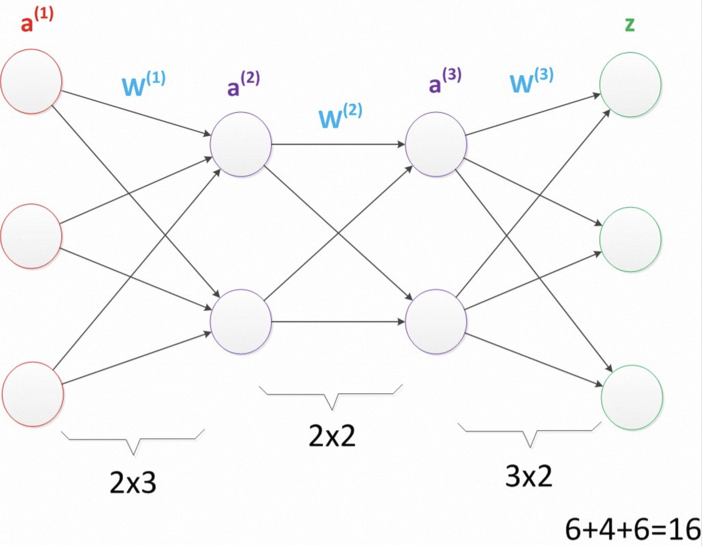

假设我们将中间层的节点数做一下调整。第一个中间层改为 3 个单元，第二个中间层改为 4 个单元。经过调整以后，整个网络的参数变成了 33 个。
　　
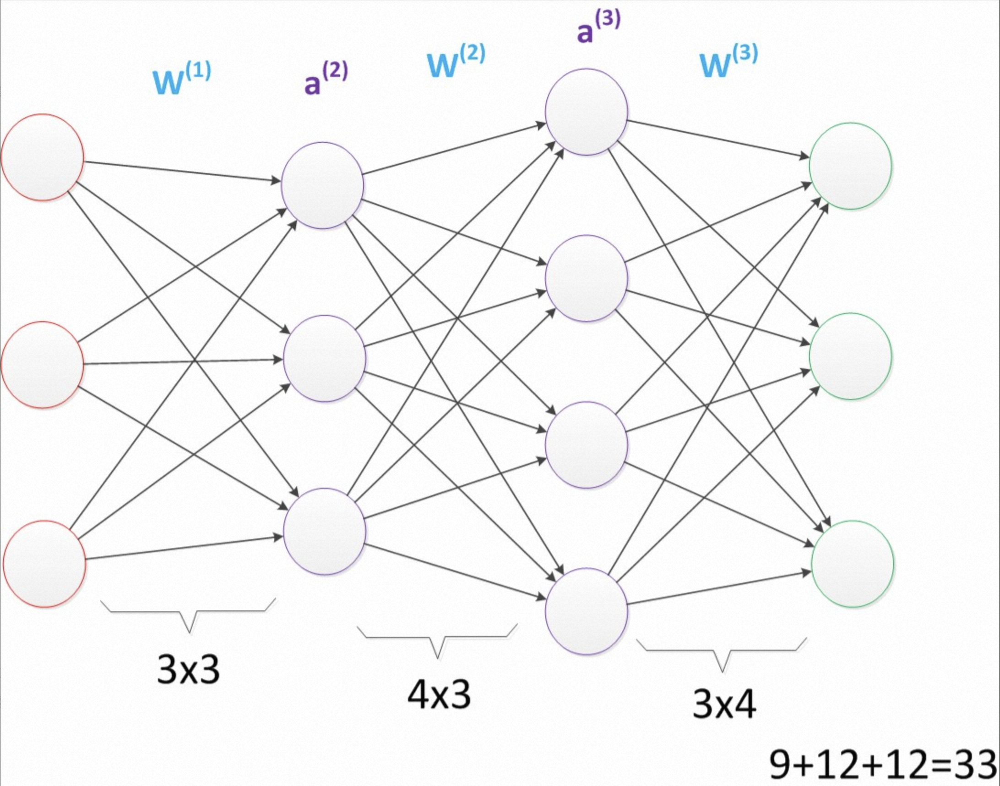

虽然层数保持不变，但是第二个神经网络的参数数量却是第一个神经网络的近两倍之多，从而带来了更好的**表示能力**。表示能力是多层神经网络的一个重要性质。

在参数一致的情况下，我们也可以获得一个“更深”的网络。

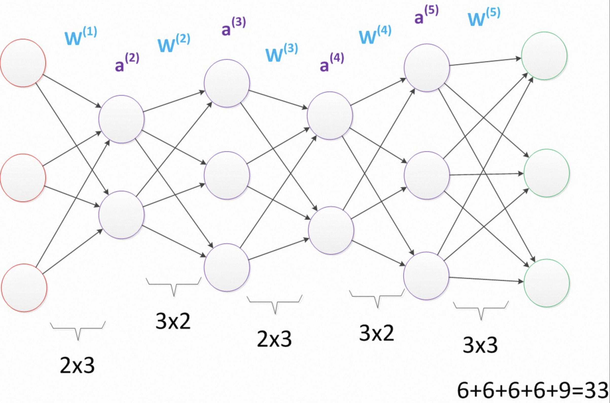

上图的网络中，虽然参数数量仍然是 33，但却有 4 个中间层，是原来层数的近两倍。这意味着一样的参数数量，可以用更深的层次去表达。

增加更多的层次有什么好处？更深入的表示特征，以及更强的函数模拟能力。

更深入的表示特征可以这样理解，随着网络的层数增加，每一层对于前一层次的抽象表示更深入。在神经网络中，每一层神经元学习到的是前一层神经元值的更抽象的表示。例如第一个隐藏层学习到的是“边缘”的特征，第二个隐藏层学习到的是由“边缘”组成的“形状”的特征，第三个隐藏层学习到的是由“形状”组成的“图案”的特征，最后的隐藏层学习到的是由“图案”组成的“目标”的特征。通过抽取更抽象的特征来对事物进行区分，从而获得更好的区分与分类能力。

更强的函数模拟能力是由于随着层数的增加，整个网络的参数就越多。而神经网络其实本质就是模拟特征与目标之间的真实关系函数的方法，更多的参数意味着其模拟的函数可以更加复杂，可以有更多的容量去拟合真正的关系。

通过研究发现，在参数数量一样的情况下，更深的网络往往具有比浅层的网络更好的识别效率。

### 4.2 应用效果

目前，**深度神经网络在人工智能界占据统治地位**。但凡有关人工智能的产业报道，必然离不开深度学习。

# 总结

神经网络的发展历史曲折跌宕，既有被人捧上天的时刻，也有摔落在街头无人问津的时段，中间经历了数次大起大落。

从单层神经网络（感知器）开始，到包含一个隐藏层的两层神经网络，再到多层的深度神经网络，一共有三次兴起过程。

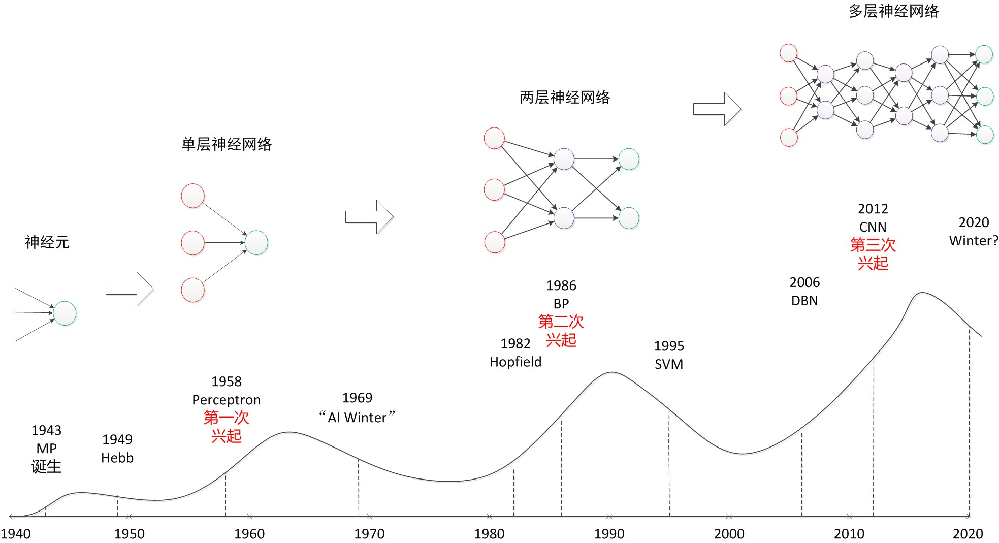

上图中的顶点与谷底可以看作神经网络发展的高峰与低谷。图中的横轴是时间，以年为单位。纵轴是一个神经网络影响力的示意表示。如果把 1949 年 Hebb 模型提出到 1958 年的感知机诞生这个 10 年视为落下（没有兴起）的话，那么神经网络算是经历了“三起三落”这样一个过程。

历史最大的好处是可以给现在做参考。科学的研究呈现螺旋形上升的过程，不可能一帆风顺。同时，这也给现在过分热衷深度学习与人工智能的人敲响警钟，因为这不是第一次人们因为神经网络而疯狂了。1958 年到 1969 年，以及 1985 年到 1995 年，这两个十年间人们对于神经网络以及人工智能的期待并不比现在低，可结果如何大家也能看得很清楚。

因此，冷静才是对待目前深度学习热潮的最好办法。如果因为深度学习火热，或者可以有”钱景”就一窝蜂地涌入，那么最终的受害人只能是自己。神经网络界已经两次有被人们捧上天了的境况，相信也对于捧得越高，摔得越惨这句话深有体会。不过，截至 2026 年，随着大语言模型和生成式 AI 的爆发，深度学习已经切实地融入了各行各业的生产实践中。尽管如此，技术泡沫的风险依然存在，能耗、可解释性、逻辑推理等方面的瓶颈仍需持续关注和攻克。

神经网络为什么能这么火热？简而言之，就是其学习效果的强大。随着神经网络的发展，其表示性能越来越强。

从单层神经网络，到两层神经网络，再到多层神经网络，下图说明了，随着网络层数的增加，以及激活函数的调整，神经网络所能拟合的决策分界平面的能力。

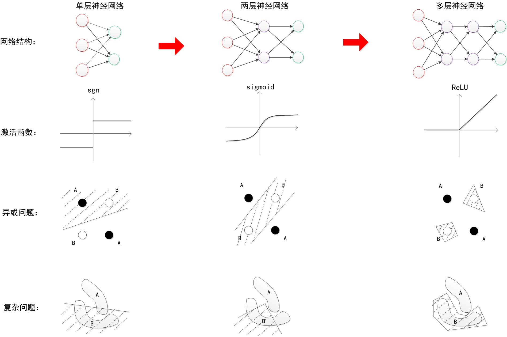

可以看出，随着层数增加，其非线性分界拟合能力不断增强。图中的分界线并不代表真实训练出的效果，更多的是示意效果。

神经网络的研究与应用之所以能够不断地火热发展下去，与其强大的函数拟合能力是分不开关系的。

当然，光有强大的内在能力，并不一定能成功。**一个成功的技术，不仅需要内因的作用，还需要时势与环境的配合**。神经网络的发展背后的外在原因可以被总结为：更强的计算性能，更多的数据，以及更好的训练方法。只有满足这些条件时，神经网络的函数拟合能力才能得以体现，见下图。

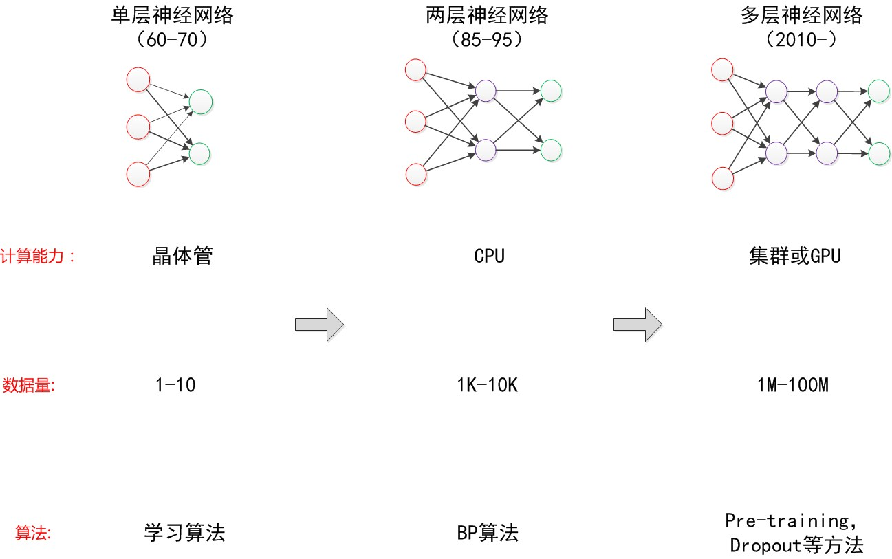

之所以在单层神经网络年代，Rosenblatt 无法制作一个双层分类器，就在于当时的计算性能不足，Minsky 也以此来打压神经网络。但是 Minsky 没有料到，仅仅 10 年以后，计算机 CPU 的快速发展已经使得我们可以做两层神经网络的训练，并且还有快速的学习算法 BP。

但是在两层神经网络快速流行的年代，更高层的神经网络由于计算性能的问题，以及一些计算方法的问题，其优势无法得到体现。直到 2012 年，研究人员发现，用于高性能计算的图形加速卡（GPU）可以极佳地匹配神经网络训练所需要的要求：高并行性，高存储，没有太多的控制需求，配合预训练等算法，神经网络才得以大放光彩。

互联网时代，大量的数据被收集整理，更好的训练方法不断被发现。所有这一切都满足了多层神经网络发挥能力的条件。

虽然现在人工智能非常火热，大语言模型展现出的涌现能力也让通用人工智能的讨论从理论走向了产业实践，但在逻辑推理、因果理解和物理世界交互等方面，距离真正的通用人工智能仍有不小的差距。就拿计算机视觉方向来说，面对稍微复杂一些的场景，以及易于混淆的图像，计算机就可能难以识别。因此，这个方向还有很多的工作要做。

就普通人看来，这么辛苦地做各种实验，以及投入大量的人力就是为了实现一些不及孩童能力的视觉能力，未免有些不值。但是这只是第一步。虽然计算机需要很大的运算量才能完成一个普通人简单能完成的识图工作，但计算机最大的优势在于并行化与批量推广能力。使用计算机以后，我们可以很轻易地将以前需要人眼去判断的工作交给计算机做，而且几乎没有任何的推广成本。这就具有很大的价值。正如火车刚诞生的时候，有人嘲笑它又笨又重，速度还没有马快。但是很快规模化推广的火车就替代了马车的使用。人工智能也是如此。这也是为什么目前世界上各著名公司以及政府都对此热衷的原因。

目前看来，神经网络要想实现人工智能还有很多的路要走，但方向至少是正确的，下面就要看后来者的不断努力了。
