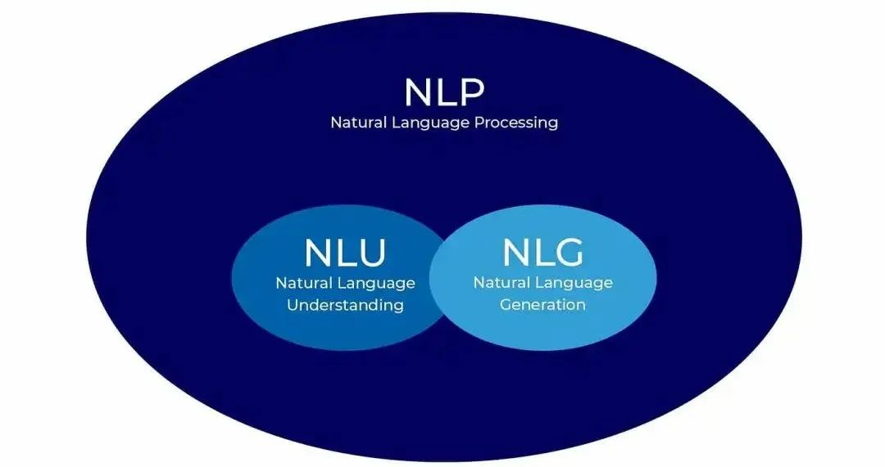
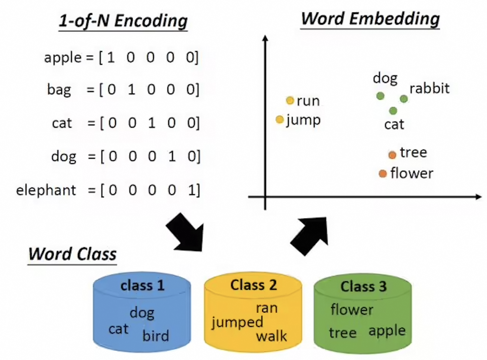
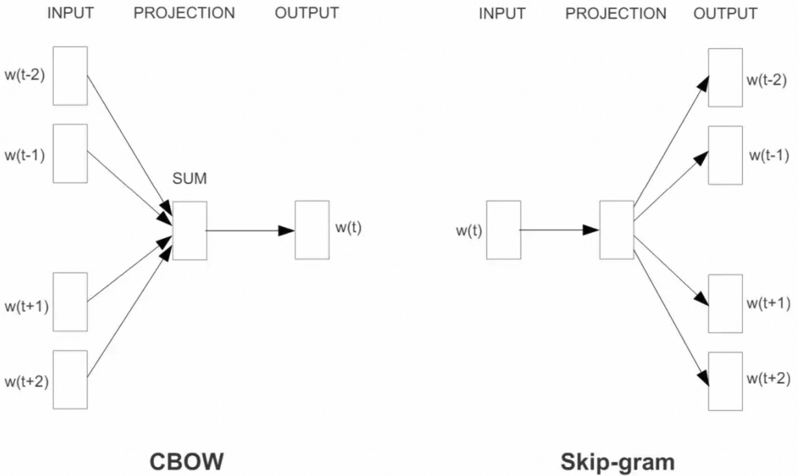
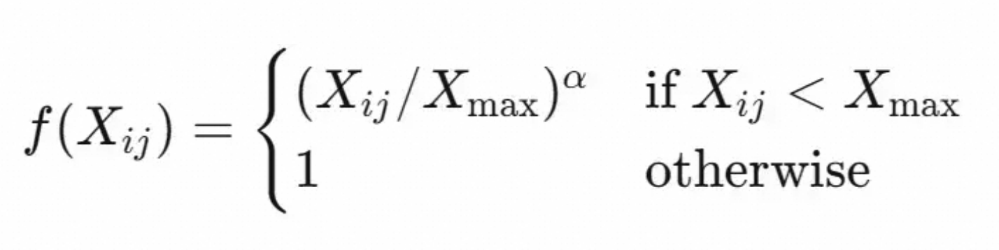

# 1 自然语言处理


> 自然语言处理（Natural Language Processing，简称 **NLP**）是人工智能和语言学领域的一个分支，它关注的是**让计算机能够理解、解释人类的自然语言，并据此进行有效的交流**。
>

自然语言是人们日常生活中使用的语言，如汉语、英语等，与编程语言或数学公式等人工设计的语言相对。语言文字信息通常缺乏显式的结构，且包含大量复杂的语言学现象，因而十分复杂。在相当长一段时间里，NLP 领域曾试图完全解构人类语言文字的细节，以期建立一套能精准描述语言文字显式、隐式信息的理论。这就是人工智能领域的**符号主义（Symbolism）**路线，它期望通过「知其所以然」，进而「知其然」。

另一条路线则希望机器通过大量文本自行提取特征，学习语言文字背后的知识。这一体系整体基于**人工神经网络（Artificial Neural Networks）**：多个神经网络层按特定机制连接成模型，每层包含数据的输入、输出、处理方法和大量参数。这就是人工智能领域的**连结主义（Connectionism）**路线，它期望先让机器「知其然」，「所以然」的问题以后再说。连结主义的底层逻辑是经验主义，其交付物是一大堆参数，这是典型的实验科学；如果 AI 由工业应用驱动，这条路线的上游学术研究也会受到下游各类任务的推动。截至 2026 年，以大语言模型为代表的连结主义已成为 NLP 和广泛 AI 工程实践中的主导范式；符号方法与神经符号方法仍在可解释推理、知识约束等场景持续探索。

由于 NLP 领域面对的问题太过庞杂，前面很多年 NLP 领域任务都被拆分得非常细：

- **文本分类**
  - **定义**：文本分类是将文本数据归类到预定义类别中的过程。常见的分类任务包括情感分析、主题分类、垃圾邮件检测等。
  - **应用**：电子邮件过滤、新闻文章分类、产品评论分类。
- **情感分析**
  - **定义**：情感分析旨在识别和提取文本中的主观信息，如情绪倾向（正面、负面或中立）。
  - **应用**：社交媒体监控、客户反馈分析、市场调研。
- **命名实体识别**
  - **定义**：命名实体识别是从文本中自动识别出具有特定意义的实体名称，如人名、地名、组织机构名等，并将其分类。
  - **应用**：信息抽取、知识图谱构建、智能搜索。
- **机器翻译**
  - **定义**：机器翻译是使用软件将一种自然语言转换成另一种自然语言的过程。
  - **应用**：在线翻译服务（如 Google Translate）、多语言文档处理、跨语言信息检索。
- **问答系统**
  - **定义**：问答系统旨在直接回答用户提出的问题，可以基于结构化数据（如数据库），也可以基于非结构化文本资料。
  - **应用**：智能助手（如 Siri、Alexa）、客服机器人、基于大语言模型的智能体（AI Agents）、多模态交互助手和教育辅助工具。
- **信息抽取**
  - **定义**：从大量文本中自动抽取有用信息，形成结构化数据。
  - **应用**：实体抽取、关系抽取、事件抽取、表格填充。
- **文本生成**
  - **定义**：利用算法自动生成可读性较强的文章、故事甚至诗歌等。
  - **应用**：自动写作助手、虚拟聊天机器人、创意写作。
- **语音识别**
  - **定义**：语音识别通常被视为语音处理任务，与 NLP 紧密相关；它将人的声音转化为文字，以便后续处理。
  - **应用**：语音转文字服务、语音助手、电话客服系统。
- **对话系统**
  - **定义**：设计能与人类连续对话的程序；除基本聊天功能外，还可完成特定任务。
  - **应用**：智能客服、智能家居控制、虚拟助手。

这些子领域相互交织，共同推动了 NLP 技术的发展。



对于上述 NLP 任务，大致可将其中的文本任务粗略分为**自然语言理解（Natural Language Understanding，NLU）**和**自然语言生成（Natural Language Generation，NLG）**两大类；语音识别、检索和表示学习等任务则不完全包含在这一划分中：

1. **NLU** 可进一步细分为情感分析（Sentiment Analysis，SA）、命名实体识别（Named Entity Recognition，NER）、自然语言推理（Natural Language Inference，NLI，也常称为文本蕴含）、词性标注（POS Tagging）和常识推理（Common Sense Reasoning）等。
2. **NLG** 可进一步细分为摘要（Summarization）、机器翻译（Machine Translation）等。

# 2 文本表示：从 One-Hot 到 Transformer

> 在 NLP 中，**文本表示**（Text Representation）是将文本数据转换为计算机可处理的数值形式（主要是向量），以便使用机器学习方法进行分析。

许多机器学习方法无法直接处理原始文本，因此需要先将文本转换为数值表示。常见流程包括分词或词元化、构建词表、为词元分配 ID，再选择 One-Hot、词袋模型、TF-IDF 或词嵌入等表示方法。



**词嵌入（Word Embedding）**是一类将离散词元映射为低维、稠密实数向量的技术。它将词表大小维度的稀疏表示映射到维度更低的连续向量空间，形成所谓的**分布式表示**。向量的单一维度通常不具备稳定、可直接解释的语义；词语间的语义关系主要体现在向量整体的几何关系中。

以句子 `apple on an apple tree` 为例，词元化后可得到词序列；去重后可建立词表 `["apple", "on", "an", "tree"]`。词表用于建立词元与 ID 的映射，并不是某个词嵌入模型特有的输入。

若使用 One-Hot 作为基线表示，每个词元都对应一个与词表等长的稀疏向量。例如，`apple` 可表示为 `[1, 0, 0, 0]`，`an` 可表示为 `[0, 0, 1, 0]`。One-Hot 能完成离散词元的数值化，但并不属于低维稠密的词嵌入。

文本表示的发展并非简单地由低维走向高维，而是从稀疏、静态的统计表示逐步发展为稠密、上下文化的表示。早期的词袋模型和 TF-IDF 往往具有很高的维度且十分稀疏；Word2Vec、GloVe 等静态词嵌入将词表示为低维稠密向量；ELMo、BERT、GPT 等预训练语言模型则可生成依赖上下文的词元表示。在适当的聚合方式下，这些表示也可用于句子或文档级任务，并服务于检索增强生成（RAG）、智能体记忆与检索等现代应用。


## 2.1 One-Hot

One-Hot 编码，又称**独热编码**，是一种将类别数据转换为二进制向量的表示方法。当计算机需要处理颜色、产品类型等非数值类别时，One-Hot 编码提供了一种朴素的数值化方式。

在文本表示中，类别通常是单词、子词或字符。每个唯一词元都用一个长度等于词表大小的向量表示：一个位置的值为 1，其余位置的值为 0。这种表示生成稀疏向量，每个词元对应一个唯一的二进制向量。

以“猫”“狗”“鱼”为例，One-Hot 编码的实现步骤大致如下：

- 建立词表 `{"猫", "狗", "鱼"}`，其长度为 3。
- 为每个词元分配索引：`猫`、`狗`、`鱼` 分别对应 0、1、2。
- 创建与词表等长的向量；例如，`猫` 的向量为 `[1, 0, 0]`。

若文本为“猫猫狗狗”，其逐词向量化结果为：

```text
[[1, 0, 0],
 [1, 0, 0],
 [0, 1, 0],
 [0, 1, 0]]
```

优点：

- 简单易实现。
- 为每个词元提供清晰、唯一的表示。

缺点：

- 词表较大时，向量维度过高，内存开销较大。
- 无法表示词语间的语义相似性。例如，“猫”和“狗”同为宠物，但它们与“鱼”的向量距离相同。
- 稀疏向量在某些任务中的计算效率较低。

## 2.2 BoW

Bag of Words（BoW），又称**词袋模型**，是一种简单而有效的文档表示方法。

词袋模型将文档看作无序的词元集合，忽略词序和语法，只统计各词元的出现次数。因此，它适用于一些基础的文本分类、特征提取和信息检索任务，但不能捕捉句子结构或词间语义关系。

仍以“猫”“狗”“鱼”为例，词袋模型的实现步骤大致如下：

- 建立词表 `{"猫", "狗", "鱼"}`，并令它们的索引分别为 0、1、2。
- 对每篇文本创建一个与词表等长的向量；向量的每个位置记录对应词元在文档中的出现次数。

若文本为“猫猫狗狗”，One-Hot 编码会生成一组逐词向量，而词袋模型只生成一个向量 `[2, 2, 0]`：第 0 个元素表示“猫”出现 2 次，第 1 个元素表示“狗”出现 2 次，第 2 个元素表示“鱼”出现 0 次。

优点：

- 简单易实现。
- 对于小规模数据集，计算效率较高。

缺点：

- 词表较大时，向量维度仍然很高，且通常十分稀疏。
- 完全忽略词序，无法捕捉句子的语法和结构信息。
- 仅统计词频，无法表达词与词之间的语义关系。

## 2.3 TF-IDF

TF-IDF（Term Frequency-Inverse Document Frequency，词频-逆文档频率）是一种常用于文本挖掘和信息检索的统计方法，用于衡量词元对某篇文档的区分能力。它常用于关键词提取、文档相似度计算和文本分类等任务。

TF-IDF 由**词频**（TF）和**逆文档频率**（IDF）两部分组成。

词频描述词元在单篇文档中的出现次数；下图展示了一种常见的原始词频定义：


为减少文档长度的影响，也常将词频除以文档总词数，得到归一化词频：


逆文档频率衡量词元在整个语料库中的稀有程度。设 $N$ 为文档总数，$\mathrm{df}(t)$ 为包含词元 $t$ 的文档数，一种常见的平滑定义为：

$$
\operatorname{IDF}(t) = \log\frac{N + 1}{\mathrm{df}(t) + 1}
$$

词元出现在越多文档中，其 IDF 越小；若出现在所有文档中，按上式计算的 IDF 为 0。分子和分母加 1 是为了平滑计数，并避免边界情形带来的问题。

TF-IDF 通常定义为：

$$
\operatorname{TF\text{-}IDF}(t, d) = \operatorname{TF}(t, d) \times \operatorname{IDF}(t)
$$

因此，TF-IDF 与词元在当前文档中的出现频率正相关，与它在语料库中的文档频率负相关。

优点：

- 简单易实现。
- 能降低“的”“与”等常见词的权重，突出更具区分度的词元。
- 适用于文本分类、文本聚类和信息检索等任务。

缺点：

- 大型词表会生成非常稀疏的 TF-IDF 矩阵，计算和存储成本较高。
- 忽略词元在文本中的顺序信息。
- 不直接表示词元之间的语义关系。
- 效果依赖语料库规模与领域分布；数据不足时统计量可能不稳定。

## 2.4 Word2Vec

Word2Vec 是 Tomas Mikolov 等人在 2013 年提出的一组词向量学习方法。它通过浅层神经网络在大规模语料库上学习**静态词向量**：具有相似上下文的词，通常会在向量空间中更接近。

Word2Vec 的两种经典架构是 **Skip-Gram** 和 **CBOW**。



**Skip-Gram** 使用当前词预测其上下文词：给定中心词，模型预测固定窗口中前后的词。**CBOW** 则使用上下文词预测中心词。

在简化的完整 Softmax 设定下，输入词元首先表示为长度为 $V$ 的 One-Hot 向量，经嵌入矩阵映射为 $N$ 维稠密向量，最后再通过输出矩阵映射回大小为 $V$ 的词表空间，得到各词的概率。训练会更新相关参数，使词向量能够编码词与上下文的统计关系。实际训练常使用负采样或层次 Softmax 来提高效率，因此并非所有实现都会计算完整 Softmax。

优点：

- 采用浅层神经网络，训练速度较快，适合处理大规模数据。
- 能够捕捉词语间的语义和句法关系。
- 可作为多种 NLP 下游任务的输入特征。

缺点：

- 每个词只有一个固定的向量表示，难以区分多义词的不同语义。
- 无法根据具体上下文动态调整词义。

## 2.5 GloVe

**GloVe**（Global Vectors for Word Representation）是一种无监督的静态词向量学习算法，由 Jeffrey Pennington、Richard Socher 和 Christopher D. Manning 于 2014 年提出。它利用全局词共现统计信息学习词向量，同时保留局部上下文窗口的信息。

设 $X_{ij}$ 表示词 $j$ 在词 $i$ 的上下文窗口中出现的次数，$X_i = \sum_k X_{ik}$ 表示词 $i$ 的所有共现次数。词对的共现概率可定义为：


该概率表示在词 $i$ 的上下文中观察到词 $j$ 的比例。GloVe 的优化目标不是直接预测该概率，而是让词向量内积加偏置项拟合 $\log X_{ij}$。其损失函数如下：


其中，$w_i$ 是词 $i$ 的词向量，$\tilde{w}_j$ 是上下文词 $j$ 的词向量，$b_i$ 和 $\tilde{b}_j$ 是偏置项；$f(X_{ij})$ 是加权函数，用于降低高频共现对损失的支配作用。加权函数通常定义为：



其中，$X_{\max}$ 是阈值。原论文的实验常设 $X_{\max} = 100$、$\alpha = 3/4$，但实际取值应随语料和实现调整。

优点：

- 充分利用全局共现统计信息，可捕捉词语间的语义关系。
- 共现矩阵和优化过程可并行化，适合大规模语料库；整体效率仍取决于共现统计与实现方式。
- 生成的词向量可用于文本分类、情感分析和问答等下游任务。

缺点：

- 每个词只有一个固定向量，难以处理多义词的不同语义。
- 通常需要大规模语料库才能获得高质量词向量。
- 共现矩阵的构建和存储仍可能需要较多计算资源。
- 主要关注共现统计，不能显式建模语法结构。

## 2.6 FastText

**fastText** 是 Facebook AI Research 开发的词向量学习方法与文本分类工具。它在 Word2Vec 的基础上引入字符 n-gram，除整个词外，还利用词的内部子词结构，因此对罕见词、未登录词和形态丰富的语言更友好。

fastText 会为单词添加词边界标记，并将其表示为多个字符 n-gram 的组合。例如，对 `<where>` 取长度为 3 的 n-gram，可得到 `<wh`、`whe`、`her`、`ere`、`re>`。词向量由词本身及其子词向量组合而成。

在无监督词向量训练中，fastText 支持 CBOW 和 Skip-Gram 架构；训练时可采用负采样、层次 Softmax 等不同损失方案，具体选择取决于任务和实现。其文本分类功能也能高效处理大量标签。

优点：

- 训练和预测速度较快，适合实时应用。
- 子词表示能改善罕见词和未登录词的处理。
- 支持多种语言的文本处理，并可用于文本分类。

缺点：

- 生成的是静态词向量，无法捕捉随上下文变化的词义。

## 2.7 ELMo

**ELMo**（Embeddings from Language Models）是一种**上下文相关的词嵌入方法**，由艾伦人工智能研究所（Allen Institute for Artificial Intelligence）于 2018 年提出。与 Word2Vec、GloVe 和 fastText 等静态词嵌入不同，ELMo 会根据词在句子中的上下文动态生成向量，因此能更好地区分多义词在不同语境中的含义。

ELMo 以字符为输入，先通过字符级 CNN 构造词的初始表示，再送入两层双向 LSTM 语言模型。前向语言模型从左到右预测下一个词，后向语言模型从右到左预测前一个词。对每个词，模型可得到初始字符 CNN 表示，以及两层双向 LSTM 的上下文表示；下游任务会学习各层表示的加权组合，而不是只使用某一层固定的词向量。

ELMo 的双向语言模型使每个词能同时利用左右上下文，从而提升了多种 NLP 任务的效果，并为 BERT、RoBERTa 等上下文相关的预训练语言模型提供了重要思路。它仍以 LSTM 为核心，处理很长序列时会受到循环计算和信息传递路径的限制，长距离依赖的建模能力通常不如后来的 Transformer。

优点：

- 基于上下文生成词向量，能较好地处理多义词和上下文依赖较强的词。
- 可将预训练表示迁移到多种下游自然语言处理任务。
- 通过双向上下文和分层表示，比静态词向量包含更丰富的语义信息。

缺点：

- LSTM 的序列计算难以在时间步之间完全并行，训练和推理速度较慢。
- 模型参数和计算成本较高。
- 对很长序列的依赖关系建模仍存在局限。

## 2.8 Transformer

Ashish Vaswani 等人在 2017 年提出了 **Transformer** 架构。其核心是多头自注意力机制、前馈网络和位置编码：自注意力让每个位置直接关注序列中的其他位置，位置编码则为模型提供词序信息。相比 RNN 和 LSTM，Transformer 缩短了远距离词元之间的信息传递路径，并能在训练阶段对序列中的多个位置并行计算。

自注意力并未完全解决长序列问题：标准注意力的计算和显存开销会随序列长度的平方增长。对于自回归生成模型，虽然训练可并行处理多个位置，推理时仍需要按词元顺序逐步生成。

随着 Transformer 架构的出现，基于 Transformer 的预训练语言模型迅速发展：

- **BERT**（Bidirectional Encoder Representations from Transformers）采用仅编码器架构，通过掩码语言模型学习双向上下文表示，常用于理解类任务。
- **GPT**（Generative Pre-trained Transformer）系列采用仅解码器架构，以因果语言模型方式预测下一个词元，主要擅长文本续写与生成。
- **T5**（Text-To-Text Transfer Transformer）采用编码器—解码器架构，将多种任务统一表述为文本到文本的转换。

为提升长序列处理效率或扩展模型容量，研究与业界也在探索状态空间模型（如 Mamba）、线性或稀疏注意力，以及混合专家模型（Mixture of Experts，MoE）等替代或混合方案。它们关注的问题和适用场景不同：前两类方法主要降低长序列建模的计算开销，MoE 则主要通过稀疏激活扩展模型容量。

与传统静态词嵌入相比，这些模型通常能生成更丰富的上下文相关表示，已广泛应用于文本分类、问答、机器翻译和文本生成等任务。
