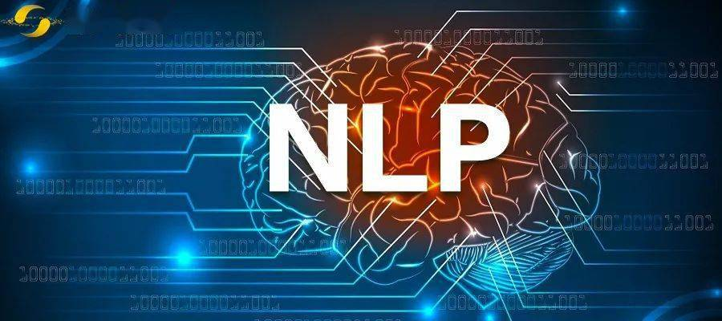
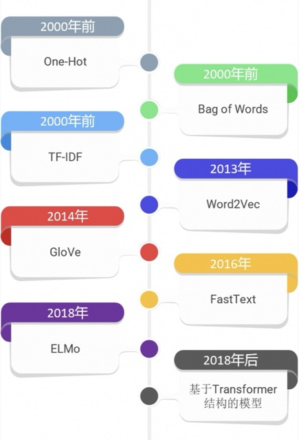
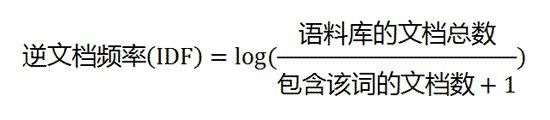
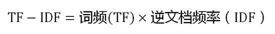
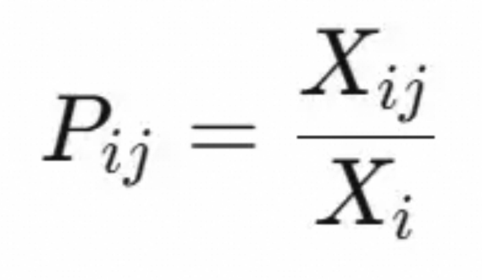
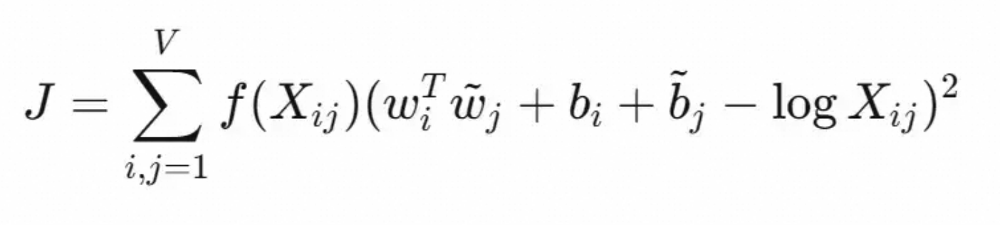

# 1、自然语言处理



> 自然语言处理（Natural Language Processing，简称**NLP**）是人工智能和语言学领域的一个分支，它关注的是**让计算机能够理解、解释人类的自然语言，并据此进行有效的交流**。
>

自然语言是指人们日常生活中使用的语言，如汉语、英语等，与编程语言或数学公式等人工设计的语言相对。但是语言文字信息没有显式的结构化，其中还有大量的语言学问题，可以说是非常的复杂。也是在相当长时间里，NLP 领域企图完全解构人类的语言文字的所有细节，以期建立起一套理论，就像数学一样，能够精准描述我们在语言文字中显式、隐式包含的信息。这就是人工智能领域的**符号主义（Symbolism）**路线，它期望通过「知其所以然」，进而「知其然」。

而另一个路线则是希望机器像人类一样，给机器灌输一些文本信息后，机器能够自己抽取其中的特征信息，学会语言文字背后的知识。这一体系整体都基于**人工神经网络（Artificial Neural Networks）**，将多个神经网络层以某种机制连接起来形成一套架构，每层神经网络中又包含数据的输入、输出、对输入的处理方法、处理这些数据所用到的大量参数。这就是人工智能领域的**连结主义（Connectionism）**路线，它期望先让机器「知其然」，「所以然」这个问题以后再说。连结主义的底层逻辑是经验主义，其交付物是一大堆参数，这是典型的实验科学，如果 AI 的驱动是工业应用的话，这条路线的上游学术研究会被下游的各领域任务驱动着跑起来。

由于 NLP 领域面对的问题太过庞杂，前面很多年 NLP 领域任务都被拆分的非常细：

- **文本分类**
  - **定义**：文本分类是将文本数据归类到预定义类别中的过程。常见的分类任务包括情感分析、主题分类、垃圾邮件检测等。
  - **应用**：电子邮件过滤、新闻文章分类、产品评论分类。
- **情感分析**
  - **定义**：情感分析旨在识别和提取文本中的主观信息，如情绪倾向（正面、负面或中立）。
  - **应用**：社交媒体监控、客户反馈分析、市场调研。
- **命名实体识别**
  - **定义**：命名实体识别是从文本中自动识别出具有特定意义的实体名称，如人名、地名、组织机构名等，并将其分类。
  - **应用**：信息抽取、知识图谱构建、智能搜索。
- **机器翻译**
  - **定义**：机器翻译是使用软件将一种自然语言转换成另一种自然语言的过程。
  - **应用**：在线翻译服务（如Google Translate）、多语言文档处理、跨语言信息检索。
- **问答系统**
  - **定义**：问答系统旨在直接回答用户提出的问题，可以基于结构化数据（如数据库）也可以基于非结构化的文本资料。
  - **应用**：智能助手（如Siri、Alexa）、客服机器人、教育辅助工具。
- **信息抽取**
  - **定义**：从大量文本中自动抽取出有用的信息，形成结构化数据。
  - **应用**：新闻摘要生成、医疗记录处理、金融报告分析。
- **文本生成**
  - **定义**：利用算法自动生成可读性强的文章、故事甚至是诗歌等。
  - **应用**：自动写作助手、虚拟聊天机器人、创意写作。		
- **语音识别**
  - **定义**：将人的声音转化为文字形式，以便后续进行自然语言处理。
  - **应用**：语音转文字服务、语音助手、电话客服系统。
- **对话系统**
  - **定义**：设计能与人类进行连续对话的程序，除了基本的聊天功能外，还包括完成特定任务的能力。
  - **应用**：智能客服、智能家居控制、虚拟助手。

这些子领域相互交织，共同推动了NLP技术的发展。


对于上面那么多 NLP 任务类型，大致上我们可以把自然语言处理，分成**自然语言理解（Natural Language Understanding，NLU）**和**自然语言生成（Natural Language Generation，NLG）**两大类：

1. **NLU**更进一步细分，包括情感分析（Sentiment Analysis，SA）、命令实体识别（Named Entity Recognition，NER）、自然语言推理（Natural Language Inference，NLI）、文本蕴含（Text Entailment）、词性标注（POS Tagging）、常识推理（Common Sense Reasoning）等等。
2. **NLG**更进一步细分，包括摘要（Summarization）、机器翻译（Machine Translation）等等。

# 2、文本表示：从One-Hot到Transformer

> 在NLP中，**文本表示**（Text Representation）是**将文本数据转换为计算机可以理解和处理的数值形式**（主要是向量）。以方便使用机器学习方法对文本进行分析。

现有的机器学习方法往往无法直接处理文本数据，因此需要找到合适的方法，将文本数据转换为数值型数据，由此引出了**Word Embedding**（词嵌入）的概念。


Word Embedding 是一种**将自然语言中的词语转换为数值向量**的技术，能够**把一个维数为所有词的数量的高维空间嵌入到一个维数低得多的连续向量空间中**，每个单词或词组被映射为实数域上的向量，这也就是所谓的**分布式表示**：向量的每一维度都没有实际意义，而整体代表一个具体概念。

Word Embedding的输入是原始文本中的一组不重叠的词汇，假设有句子：`apple on a apple tree`。那么为了便于处理，我们可以将这些词汇放置到一个dictionary里，例如：`[“apple”, “on”, “a”, “tree”]`，这个dictionary就可以看作是Word Embedding的一个输入。

Word Embedding的输出就是每个word的向量表示。对于上文中的原始输入，假设使用最简单的one hot编码方式，那么每个word都对应了一种数值表示。例如，apple对应的vector就是`[1, 0, 0, 0]`，a对应的vector就是`[0, 0, 1, 0]`，各种机器学习应用可以基于这种word的数值表示来构建各自的模型。当然，这是一种最简单的映射方法，但却足以阐述Word Embedding的意义。

整个文本向量化的发展过程是一个由简单到复杂，由低维到高维的演变过程。在早期，人们使用基于统计的方法，如**词袋模型**、**TF-IDF**等来表示文本。这些传统的基于统计的方法虽然能够实现一些简单的文本处理和自然语言理解任务，但是对于语义信息的把握能力有限，而且很难处理复杂的语言现象。随着深度学习技术的演变，尤其是**Word2Vec**、**GloVe**等词向量模型的提出，文本处理的效果和性能大幅提升，文本向量化技术开始向**Word Embedding**方向发展。而后来的**BERT**、**GPT**等大型预训练模型的出现，则进一步推动了文本向量化技术的进步，使得文本向量化不仅能够表示单词或短语，还能够表示整个句子或文档的语义信息。新技术生成的文本向量不仅可以高效完成传统的自然语言处理任务，还在新兴的生成式人工智能技术（如检索增强生成等技术）中发挥了作用。




## 2.1 One-Hot

One-Hot编码，又称**独热编码**，是一种将分类数据转换为二进制表示的方法。在数字计算和数据处理的早期阶段，二进制表示极为盛行。当需要计算机处理非数值的数据（如颜色，产品类型等）时，One-Hot编码就是一种将各类数据数值化的朴素方法。

在文本向量化中，One-Hot编码的分类数据一般为单词或字符，以下以单词为例。通过这种编码方式，**每个唯一的单词都用一个向量示，向量的长度等于词汇表的单词数量，其中只有一个位置为1，其余位置都为0**。这种表达方式生成的是稀疏向量，其中每个单词都由一个唯一的二进制向量表示，该向量中只有一个高位（1），其他都是低位（0）。

以“猫”、“狗”、“鱼”为例，One-Hot编码在文本向量化中的实现步骤大致如下：

- 首先识别所有的唯一单词，并建立长度为3的词汇表{“猫”, “狗”, “鱼”}。
- 其次为每个单词分配索引，比如“猫”、“狗”、“鱼”分别分配索引位置0，1，2。
- 然后为每个单词创建向量，例如，“猫”的向量是[1, 0, 0]。

假使有一段文本内容为“猫猫狗狗”，它经过向量化后就是：

```
[[1,0,0],
[1,0,0],
[0,1,0],
[0,1,0]]
```


优点：

- 简单易实现。
- 能提供清晰明确的单词表示。

缺点：

- 维度灾难：词汇表偏大时会导致向量维度过高，从而造成内存使用量偏大。
- 语义鸿沟：无法存储单词之间的语义相似性（例如，”猫“和”狗“同为宠物动物应更加相似，然而在One-Hot编码中“猫”、“狗”、“鱼”三者的向量距离相同，所以不能体现这一特性）。
- 稀疏向量在某些任务中计算效率低。


## 2.2 BoW

Bag of Words（BoW）又称**词袋模型**，是一种简单而有效的文本向量化方法。

One-Hot编码虽然完成了数据从非数值到数值的转变，但在文本分类，特征提取等方面作用十分有限，且每个词都对应一个稀疏向量，存储效率较低。词袋模型**将文本看作是单词的无序集合，忽略词的顺序和语法，只关注词的出现频率**。因此词袋模型在One-Hot编码的基础上提升了文本向量化的效果，并减少了存储负担。

仍以“猫”、“狗”、“鱼”为例，词袋模型在文本向量化中的实现步骤大致如下：

- 与One-Hot编码相同，首先识别所有的唯一单词，并建立长度为3的词汇表{“猫”, “狗”, “鱼”}。
- “猫”、“狗”、“鱼”的索引位置仍然分别为0，1，2，
- 其次对于每一文本，创建一个与词汇表等长的向量。向量的每个位置对应词汇表中的一个词，该位置的值表示该词在文档中出现的次数。

假使文本依然是“猫猫狗狗”。与one-hot编码会生成一组向量不同，词袋模型只会产生一个向量[2, 2, 0]。向量中第0个元素2代表“猫”出现了两次，第1个元素2代表“狗”出现了两次，第2个元素0代表“鱼”出现了零次。


优点：

- 简单易实现。
- 对于小规模数据集，词袋模型的计算效率很高。

缺点：

- 对于大型词汇表，词袋模型生成的向量维度很高，从而导致内存使用量大。

- 完全忽略了词的顺序，无法捕捉句子的语法和结构信息。

- 仅仅统计词频，而无法捕捉词与词之间的语义关系。


## 2.3 TF-IDF

TF-IDF（Term Frequency-Inverse Document Frequency），翻译为**词频-逆文档频率**，是一种常用于文本挖掘和信息检索的统计方法，用来评估**一个词在一个文档集或语料库中的重要程度**。TF-IDF可以帮助筛选出在文档中具有重要意义的词汇，常用于关键词提取、文档相似度计算和文本分类等任务。

TF-IDF由两个部分组成：**词频**（TF）和**逆文档频率**（IDF）。

词频是一个词在一个文档中出现的频率。词频越高，表明这个词在该文档中越重要。词频的公式为：


考虑到文章有长短之分，为了便于不同文章的比较，进行"词频"标准化：


逆文档频率衡量一个词在整个文档集（可能包含多个文档）中出现的稀有程度。一个词在越多文档中出现，其区分能力越低，IDF值就越小。逆文档频率的计算公式为：



如果一个词越常见，那么分母就越大，逆文档频率就越小越接近0。分母之所以要加1，是为了避免分母为0（即所有文档都不包含该词）。log表示对得到的值取对数。

综上可得TF-IDF公式：



可以看到，**TF-IDF与一个词在文档中的出现次数成正比，与该词在整个语言中的出现次数成反比**。


优点：

- 简单易实现。
- 考虑了词的重要性，减少了常见但不重要的词（如“的”、“与”等）的权重。
- 适用于自然语言处理中的多种任务，如文本分类、文本聚类、信息检索等。

缺点：

- 对于大型文档集，由于词汇量庞大，生成的 TF-IDF 矩阵往往非常稀疏，所以计算效率不高。
- 只考虑了词汇的出现频率，而忽略了词汇在文本中的顺序信息。
- 没有考虑词汇之间的语义关系。
- TF-IDF 的计算方式导致它的效果依赖于足够大的文档集，数据量不足可能导致效果不佳。


## 2.4 Word2Vec

word2vec是Google于2013年推出的开源的获取**词向量**的工具包。它包括了一组用于word embedding的模型，这些模型通常都是用浅层（两层）神经网络训练词向量。

Word2vec的模型以大规模语料库作为输入，然后生成一个向量空间（通常为几百维）。词典中的每个词都对应了向量空间中的一个独一的向量，而且语料库中**拥有共同上下文的词映射到向量空间中的距离会更近**。

Word2Vec主要由两种模型架构组成：**Skip-Gram**和**CBOW**。


**Skip-Gram通过当前词预测其上下文词**。给定一个中心词，模型会预测一个固定长度的上下文窗口（前后若干词）中的所有词。训练过程中，模型会学习到每个词的向量表示，使得能够更好地预测这些上下文词。

与Skip-Gram相反，**CBOW的目标是通过上下文词预测当前词**。给定一个上下文窗口中的所有词，模型会预测这个窗口的中心词。

Word2Vec模型的核心思想是通过训练神经网络，使得**单词与其上下文之间的关系可以在向量空间中被有效地表示**。Word2Vec的输入层是一个one-hot向量（one-hot vector），长度为词汇表大小（V）。紧接着是一个投影层，由输入层经过一个权重矩阵W（维度为V x N，N为嵌入向量的维度），投影到N维向量空间中。投影层的输出通过另一个权重矩阵W'（维度为N x V），映射回一个词汇表大小的向量，此为输出层。最后经过一个Softmax层得到每个词的概率。在训练过程中，Word2Vec模型通过最大化目标函数（取决于使用Skip-Gram还是CBOW，以及采用的优化函数的方法）来更新权重矩阵，从而使得embedding能够捕捉到词汇的语义信息。


优点：

- 由于采用了浅层神经网络，训练速度较快，适合处理大规模数据。

- 能够捕捉到词与词之间的语义关系，如词性、同义词等。

- 可以用于多种自然语言处理任务，如文本分类、情感分析、机器翻译等。


缺点：

- 每个词只有一个固定的向量表示，无法处理多义词的不同语义。

- 无法考虑词在不同上下文中的语义变化。


## 2.5 GloVe

**GloVe** (Global Vectors for Word Representation)是一种无监督的文本向量化的学习算法，由斯坦福大学的Jeffrey Pennington等在2014年提出。它结合了全局统计信息和局部上下文窗口的优势，其核心思想是**利用词的共现信息来构建词向量**。

GloVe的目标是捕捉词之间的**共现关系**，即两个词在文本中共同出现的频率。

共现矩阵中的每个元素Xi,j表示词j出现在词i的上下文中的次数。词对共现概率定义为：



意为词j在词i的上下文中出现的概率。GloVe 的优化目标是通过最小化一个损失函数，使得embedding能够很好地预测共现概率。损失函数如下：



其中，wi和wj分别是词i和词j的词向量，bi和bj是偏置项，f(Xij)是一个加权函数，用于减少高频共现对模型的影响。加权函数f通常定义为：


其中Xmax是一个阈值，在GloVe作者的实验中被设置为100，而3/4被认为是一个合适的α的值。

优点:

- 充分利用了全局共现统计信息，使得词向量可以捕捉到词语之间的复杂关系。
- 通过对共现矩阵进行处理，GloVe 的训练速度较快，适合大规模语料库。
- 生成的词向量在语义上具有较强的解释力，可以很好地应用于各种自然语言处理任务，如文本分类、情感分析、问答系统等。

缺点：

- 每个词只有一个固定的向量表示，无法处理多义词的不同语义。
- 通常需要大规模的语料库来获得高质量的词向量表示。
- 尽管训练过程可以并行化，但仍需要较高的计算资源和时间来训练高质量embeddings。
- 虽然关注单词之间的共现频率，但忽略了语法结构。

## 2.6 FastText

**FastText** 是由 Facebook AI Research 开发的一种词向量生成方法，它在 Word2Vec 的基础上进行了改进，特别是在处理罕见词和形态学丰富的语言方面表现更好。FastText **不仅考虑了整个单词，还考虑了单词的子结构**（即字符 n-gram），从而能够更好地**捕捉词的内部结构信息**。

FastText 的一个关键创新在于利用了子词信息（Subword Information），即将每个单词表示为多个 n-gram 的组合。

例如，单词 "where" 可以分解为"wh", "whe", "her", "ere", "re"等 n-gram。这种方法使得模型能够捕捉到词的子词信息，从而更好地处理未登录词和拼写错误。FastText 使用基于在上文中提到的Skip-Gram的方法来训练embedding。值得注意的是，FastText不仅使用单词本身，还使用单词的所有n-gram。每个单词被表示为它所有n-gram向量的组合。为了提高计算效率，FastText 使用分层Softmax代替传统的Softmax。分层Softmax将所有类别组织成一棵二叉树，每个叶节点对应一个类别。通过减少类别数量的对数级计算，分层Softmax极大地加速了训练和预测过程。

优点：

- 训练和预测速度也很快，适合实时应用。
- 能够处理具有大量类别的任务，并保持高效性。
- 支持多种语言的文本处理。

缺点：

- 使用静态词向量，无法捕捉上下文相关的词义变化。


## 2.7 ELMo

**ELMo**（Embeddings from Language Models）是一种**上下文相关的词嵌入方法**，由艾伦人工智能研究所（Allen Institute for Artificial Intelligence）提出。与传统的静态词嵌入方法（如Word2Vec、GloVe和FastText）不同，ELMo能够根据词语在句子中的上下文**动态生成词向量**，从而更好地捕捉词语的多义性和语境信息。

ELMo使用**双向LSTM**（Long Short-Term Memory）网络作为基础架构。该网络包括一个向前的LSTM和一个向后的LSTM，它们分别从左到右和从右到左遍历文本序列，学习每个词的前向和后向上下文。这个双向LSTM被训练为一个语言模型，目标是预测句子中的下一个词（对于前向LSTM）和前一个词（对于后向LSTM）。对于给定的文本序列，ELMo会为每个词提取多层的表示。对于每个词，ELMo提供三层的embedding输出：一层来自embedding层（类似于传统的embedding），另外两层来自双向LSTM的各自输出。

ELMo 通过双向语言模型生成上下文相关的词嵌入，能够更好地**捕捉词语在不同上下文中的多义性**。这种方法不仅提高了词嵌入的质量，还显著提升了多种自然语言处理任务的性能。ELMo 的成功为后续的上下文相关词嵌入方法（如BERT、RoBERTa等）奠定了基础。

优点：

- 基于整个句子的上下文信息生成embedding，能够更好地处理多义词和上下文依赖性强的词。
- 能够捕捉复杂的句子结构和长距离依赖关系。
- 预训练的ELMo模型可以很容易地迁移到各种下游自然语言处理任务中。

缺点：

- 模型较大，训练和推理过程需要大量的计算资源。
- 由于模型复杂，推理速度较慢。


## 2.8 Transformer

谷歌的研究人员Ashish Vaswani等在2017年提出了带有**注意力机制**的**Transformer**模型结构，可以利用输入序列的全局信息进行输出，改善了在RNN和LSTM中的**长距离依赖问题**，同时**提高了并行计算能力**使训练过程大幅加速。

随着transformer结构的推出，在2018年开始出现了许多各具特色的基于Transformer结构的embedding模型：

- **BERT** (Bidirectional Encoder Representations from Transformers) 是一种双向Transformer编码器，用于生成上下文感知的词向量。
- **GPT** (Generative Pre-trained Transformer) 系列则是单向，且主要用于文本生成任务。
- **T5** (Text-To-Text Transfer Transformer) 将所有任务统一为文本到文本的转换。

这些模型同传统的embedding方法相比效果显著提高，被广泛应用于自然语言处理的各种任务。


