# 语言模型：从N-Gram到Transformer


> **语言模型**（Language Model，简称 LM）是一个用于建模自然语言的**概率模型**。简单来说，语言模型的任务是**评估一个给定的词序列（即一个句子）在真实世界中出现的概率**。通俗点讲，语言模型用来**判断一句话从语法上是否通顺**。


# 1、统计语言模型

**统计语言模型**（Statistical Language Model, SLM）是基于统计计数，使用**频度逼近概率**的方法来获得一个语言模型。

给定句子（词语序列）：

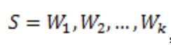

依据**贝叶斯法则**，它的概率可以表示为：

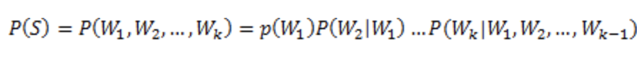

可是这样的方法存在两个致命的缺陷：

1. **參数空间过大**：条件概率P(wn|w1,w2,..,wn-1)的可能性太多，无法估算；
2. **数据稀疏严重**：对于非常多词对的组合，在语料库中都没有出现，依据最大似然估计得到的概率将会是0

## 1.1 N-Gram文法

为了解决参数空间过大的问题。引入了**马尔科夫假设**：**随意一个词出现的概率只与它前面出现的有限的一个或者几个词有关。**

下一个词出现的概率只依赖于它前面 n-1 个词，也称为 **N-1 阶马尔科夫链**：

- 1-gram，也称unigram，零阶马尔科夫链，不依赖前面任何词；
- 2-gram，也称bigram，一阶马尔科夫链，只依赖于前 1 个词；
- 3-gram，也称trigram，二阶马尔科夫链，只依赖于前 2 个词；

最常用的是 bigram (N = 2) 和 trigram (N = 3)，往后还有four-gram、five-gram等，不过大于n>5的应用很少见。而当模型从3到4时，效果的提升就不是很显著了，而资源的耗费却增加的非常快。

通过前 t-1 个词预测时刻 t 出现某词的概率，用**最大似然估计**，实际是**计算频数**：

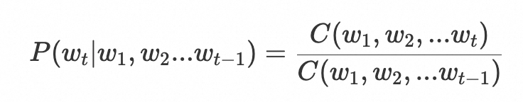

进一步地，一组词（也就是一个句子）出现的概率等于各个词出现的概率乘积，而各个词的概率可以通过语料中统计计算得到：

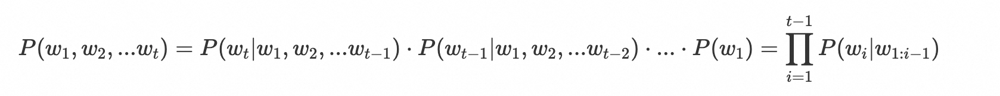

N-gram模型最大的问题就是**稀疏问题**。例如，在bi-gram中，若词库中有2万个词，那么两两组合就有近4亿个组合。其中的很多组合在语料库中都没有出现，根据极大似然估计得到的组合概率将会是0，从而整个句子的概率就会为0。最后的结果是，我们的模型只能计算零星的几个句子的概率，而大部分的句子算得的概率是0，这显然是不合理的。**为了解决稀疏问题，一般会引入平滑 / 回退 / 差值等方法来解决**。

其次是**N 的固定窗口取值问题**。N取值较小时，对长距离词依赖的情况会表现很差；如果把 N 值取很大来解决长距离词依赖，则会导致严重的数据稀疏（零频太多了），参数规模也会急速爆炸（高维向量计算）。试想，如果能有一个模型，可以处理任意长度的输入，而不是限定在固定窗口，该问题才不就解决了吗？**循环神经网络模型RNN**就是在这样的启发下浮出水面。

# 2、神经网络语言模型

传统的统计语言模型是一种**非参数化**的模型，参数并非训练得到，而是通过给定语料集的先验分布得到，它有着简单、易于“训练”（实际上不需要训练）的特点。但是其缺点也非常明显，运算的时间复杂度过高、平滑技术适用性差、模型泛化或迁移能力差等问题，这些问题直接导致了现在主流的语言模型基本放弃了统计语言模型。其数据的稀疏性、语义捕捉的局限性使其逐渐退出了主流舞台。

我们借鉴机器学习的思路来解决这个问题，一般性的机器学习的思路是：**对问题进行建模，然后设定一个目标优化函数，根据输入的数据，通过优化算法来训练模型的参数，最终用来进行预测**。

由于不是简单的计数统计，所以不再语料集中出现的词串也能基于词向量的相似性获得合理的概率估计，从而避免使用复杂的平滑和回退技术处理零概率的问题。基于参数化模型的基本思想可以将统计语言模型中的条件概率求解问题转化为如下形式的问题：

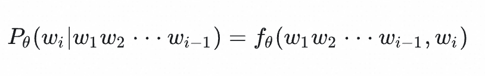

其中，函数 `fθ` 的两个输入变量为上文 `w1w2⋅⋅⋅wi−1` 和当前词 `wi` ，` θ `代表模型的参数。可以使用的模型有很多种，比如**前馈神经网络语言模型**、**循环神经网络语言模型**、**基于Transformer的神经语言模型**都可以抽象为上述形式。

## 2.1 FNN

**前馈神经网络**（Feedforward Neural Network, FNN）是一种基本的神经网络架构。"前馈"这个词指的是信息在网络中的流动方向：从输入层经过隐藏层最终到达输出层，且在这个过程中没有反馈连接。这意味着每一层的神经元只与下一层的神经元相连，**信息只能单向传递**。

一个典型的前馈神经网络由以下几部分组成：

1. **输入层**：
   - 输入是当前词的上下文（通常是前 n−1*n*−1 个词），这些词可以表示为词嵌入向量。
   - 例如，在三元模型中，输入是前两个词的词嵌入向量。
2. **隐藏层**：
   - 隐藏层可以有多层，每层包含多个神经元。
   - 每个神经元对输入进行加权求和，并通过激活函数进行非线性变换。
   - 通常使用ReLU激活函数，但也可能使用其他激活函数（如Tanh或Sigmoid）。
3. **输出层**：
   - 输出层产生词汇表中每个词的概率分布。
   - 通常使用Softmax激活函数，使得输出的概率之和为1。

2003年Bengio等人提出了一个**前馈神经网络语言模型**（Feed Forward Neural Language Model ），使用FNN来计算给定上下文的下一个词的概率分布。

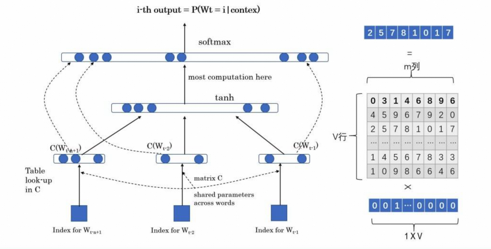

模型的学习任务是输入某个句中单词 `Wt="Bert"`前面句子的`t-1`个单词，要求网络正确预测单词Bert，即最大化：

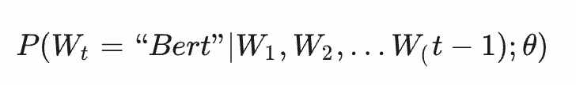

前面任意单词 `Wi` 用One-hot编码（比如：0001000）作为原始单词输入，之后乘以矩阵Q后获得向量 `C(Wi)` ，每个单词的 `C(Wi)` 拼接，上接隐层，然后接softmax去预测后面应该后续接哪个单词。这个 `C(Wi)` 是什么？这其实就是**单词对应的Word Embedding值**，那个矩阵Q包含V行，V代表词典大小，每一行内容代表对应单词的Word embedding值。只不过Q的内容也是网络参数，需要学习获得，训练刚开始用随机值初始化矩阵Q，当这个网络训练好之后，矩阵Q的内容被正确赋值，每一行代表一个单词对应的Word embedding值。所以，通过这个网络学习语言模型任务，这个网络不仅自己能够根据上文预测后接单词是什么，同时获得一个副产品，就是那个矩阵Q，这就是单词的Word Embedding是被如何学会的。

## 2.2 RNN

**循环神经网络**（Recurrent Neural Networks，RNN）是一类用于处理**序列数据**的神经网络。序列可以是时间序列，也可以是文字序列，总归序列数据有一个特点——**后面的数据跟前面的数据有关系**。

基础的神经网络只在层与层之间建立了权连接，RNN最大的不同之处就是**在层内的神经元之间也建立的权连接**。

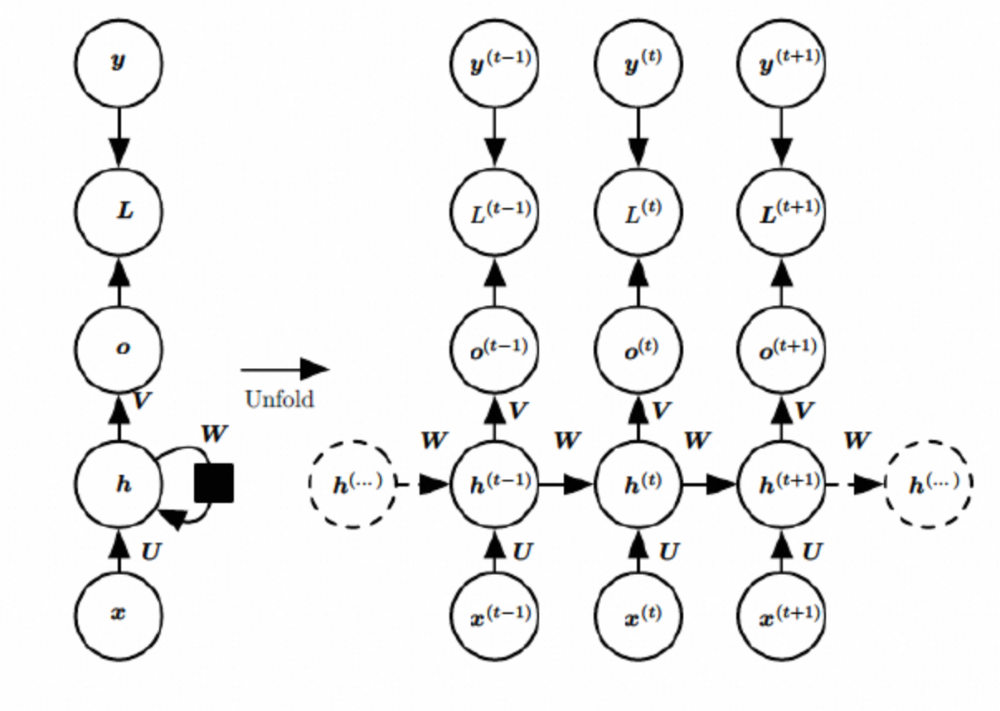

这是一个标准的RNN结构图，图中每个箭头代表做一次变换，也就是说箭头连接带有权值。左侧是折叠起来的样子，右侧是展开的样子，左侧中h旁边的箭头代表此结构中的“循环“体现在隐层。

在展开结构中我们可以观察到，在标准的RNN结构中，隐层的神经元之间也是带有权值的。也就是说，随着序列的不断推进，前面的隐层将会影响后面的隐层。图中O代表输出，y代表样本给出的确定值，L代表损失函数，我们可以看到，“损失“也是随着序列的推荐而不断积累的。

除上述特点之外，标准RNN的还有以下特点：

1、权值共享，图中的W全是相同的，U和V也一样。

2、每一个输入值都只与它本身的那条路线建立权连接，不会和别的神经元连接。

采用循环神经网络的神经语言模型理论上可以**使用任意长度的上文预测当前词**，RNN模型可以很好的通过隐层向量编码历史信息，从而使得神经语言模型的效果更好。当然，通过循环神经网络训练语言模型也同样可以得到词向量。

RNN的相比Bengio等人的前馈神经概率语言模型具有更强的表达能力，缺点是面临着**梯度消失**、**梯度爆炸**、只能提取单向编码信息等问题。

## 2.3 LSTM

RNN 的关键点之一就是他们可以用来连接先前的信息到当前的任务上，有时候，我们仅仅需要知道先前的少部分信息就可以执行当前的任务。例如，试着预测 “the clouds are in the sky” 最后的词，我们并不需要太多的前文就可以推断出是 sky。在这样的场景中，相关的信息和预测的词位置之间的间隔是非常小的，RNN 可以学会使用先前的信息。

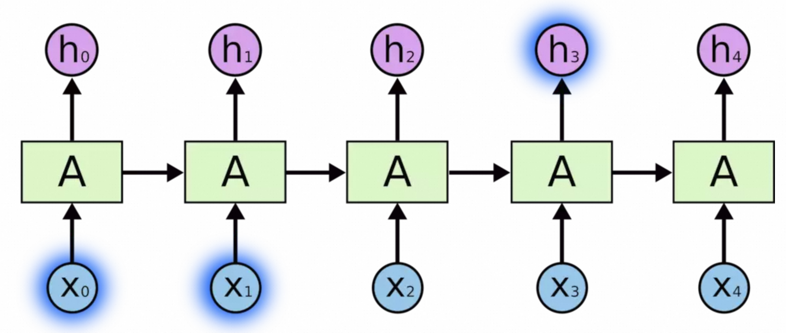

但是同样会有一些更加复杂的场景。假设我们试着去预测“I grew up in France… I speak fluent French”最后的词。当前的信息建议下一个词可能是一种语言的名字，但是如果我们需要弄清楚是什么语言，我们是需要先前提到的离当前位置很远的 France 的上下文的。这说明相关信息和当前预测位置之间的间隔就肯定变得相当的大。

不幸的是，在这个间隔不断增大时，RNN 会丧失学习到连接如此远的信息的能力。


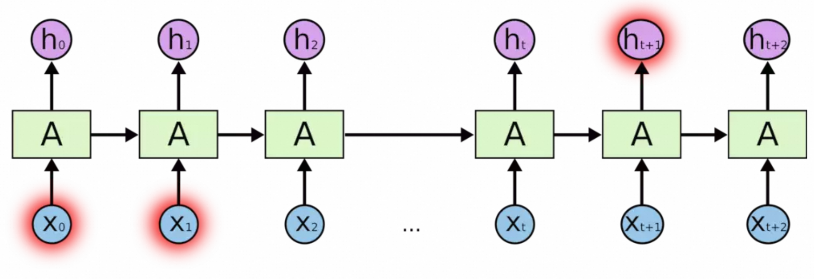

**长短时记忆网络**（ Long Short-Term Memory，LSTM）是RNN的一种变体，**RNN由于梯度消失的原因只能有短期记忆**，LSTM网络通过精妙的**门控制**将加法运算带入网络中，一定程度上解决了梯度消失的问题，能够**更好地捕捉长依赖关系**。

所有 RNN 都具有一种重复神经网络模块的链式的形式。在标准的 RNN 中，这个重复的模块只有一个非常简单的结构，例如一个 `tanh` 层。

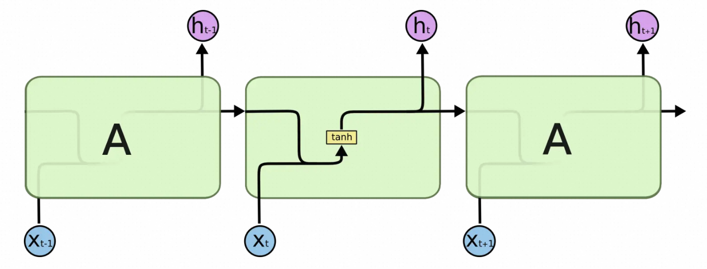

LSTM 同样是这样的结构，但是重复的模块拥有一个不同的结构。不同于 单一神经网络层，这里是有四个，以一种非常特殊的方式进行交互。

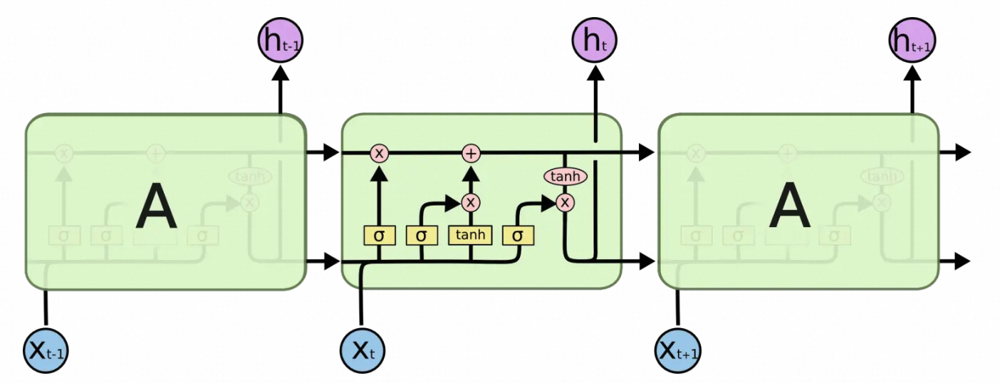

LSTM的核心是其独特的**细胞状态**（Cell State），它贯穿整个序列，并通过三个门（**输入门**、**遗忘门**和**输出门**）来控制信息的流入、保留和流出。

细胞状态类似于传送带。直接在整个链上运行，只有一些少量的线性交互。信息在上面流传保持不变会很容易。

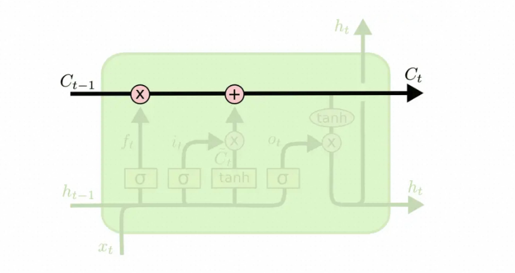


## 2.4 BiLSTM

利用LSTM对句子进行建模存在一个问题：**无法编码从后到前的信息**。在更细粒度的分类时，如对于强程度的褒义、弱程度的褒义、中性、弱程度的贬义、强程度的贬义的五分类任务需要注意情感词、程度词、否定词之间的交互。举一个例子，“这个餐厅脏得不行，没有隔壁好”，这里的“不行”是对“脏”的程度的一种修饰。

后期演化出了更强大的**双向长短期记忆网络**（Bidirectional Long Short-Term Memory, BiLSTM），它通过在序列的两个方向上（从前向后和从后向前）分别处理输入数据，从而更好地捕捉序列中的上下文信息。


# 3、大规模语言模型

**大规模语言模型**（Large Language Model, **LLM**），简称**大语言模型**、**大模型**，是一种基于深度学习的自然语言处理模型，通过海量文本数据的预训练学习语言规律，具备理解、生成和推理文本的能力。其核心特征包括：

1. **参数规模庞大**：通常包含数十亿至数千亿参数（如GPT-3的1750亿参数）。

2. **基于Transformer架构**：依赖自注意力机制处理长文本序列，显著提升并行计算效率。

3. **多阶段训练流程**：包括预训练（无监督学习）、微调（有监督学习）和RLHF（基于人类反馈的强化学习）。

与传统NLP依赖手工构建的规则和特征不同，LLM依赖于**数据驱动**的方法，通过**自动学习**数据中的语言模式和结构来实现对语言的处理。代表性的模型有**OpenAI的GPT系列**和**Google的BERT**。


## 3.1 Transformer

《**Attention Is All You Need**》 是 Google 于 2017 年发表的论文，这篇论文提出了一种新的神经网络架构 : **Transformer**，仅仅依赖于**注意力机制**就可处理序列数据，从而摈弃了 RNN 或 CNN。这个新的网络结构，刷爆了各大翻译任务，同时创造了多项新的记录（英-德的翻译任务，相比之前的最好记录提高了 2 个 BLEU 值）。而且，该模型的训练耗时短，并且对大数据或者有限数据集均有良好表现。

Transformer的意义体现在它的**长距离依赖关系处理**和**并行计算**，而这两点都离不开其提出的**自注意力机制**。

**注意力的提出对于NLP来说是一个里程碑式的事件**，注意力机制提出之前，对于文本的处理还是主要基于双向LSTM和双向GRU等模型结构，我们都知道LSTM的提出是为了解决RNN网络结构的短期记忆问题，因为本身网络架构的问题，总会出现**梯度消失**现象，这就意味着RNN网络对于上文信息只有短期依赖，捕捉不到长期依赖关系。打个比方“天空没有一片云彩，躺在草坪向上望着，那种沁人心脾的蓝，无比治愈。”，这个句子中，天空和蓝色显然是非常的相关，但是RNN有可能处理蓝的时候，早已无法捕捉到“天空”这个长期依赖信息，只能捕捉到“草坪”，所以这是LSTM所提倡解决的问题。

但是，LSTM的作用是有局限性的，有提升，但是还没那么理想。而**完全抛弃了迭代循环结构的注意力机制**的提出，就很好的解决了该问题。对于全连接的自注意力机制来说，**它可以考虑到任意位置的词语，计算与任意位置词语的相关性大小，从而加大该位置词语的权重，提取到更加重要的语义信息**。这与人类的注意力机制非常的近似，可以说这种注意力机制的提出大幅提升了NLP相关任务的表现。

Transformer之前的主流框架RNN和LSTM有一个共同缺陷，就是**程序难以并行化**。举个例子，我们期望用RNN来进行语言的翻译任务，即输入`I Love China`，输出`我爱中国`。对于RNN来说，要是现在我们要输出`中国`，就必须先输出`我`和`爱`，这个过程是难以并行的，即我们必须先得到一些东西才能进行下一步。

下图是 Transformer 用于中英文翻译的整体结构：

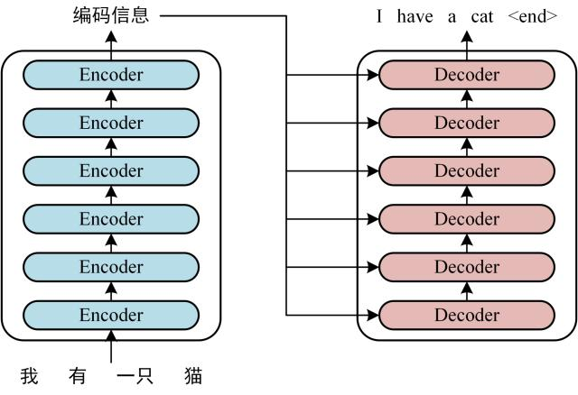

可以看到 **Transformer 由 Encoder 和 Decoder 两个部分组成**，Encoder 和 Decoder 都包含 6 个 block。Transformer 的工作流程大体如下：

**第一步：**获取输入句子的每一个单词的表示向量 **X**，**X**由单词的 Embedding（Embedding就是从原始数据提取出来的Feature） 和单词位置的 Embedding 相加得到。


**第二步：**将得到的单词表示向量矩阵 (如上图所示，每一行是一个单词的表示 **x**) 传入 Encoder 中，经过 6 个 Encoder block 后可以得到句子所有单词的编码信息矩阵 **C**，如下图。单词向量矩阵用 Xn×d 表示， n 是句子中单词个数，d 是表示向量的维度 。每一个 Encoder block 输出的矩阵维度与输入完全一致。

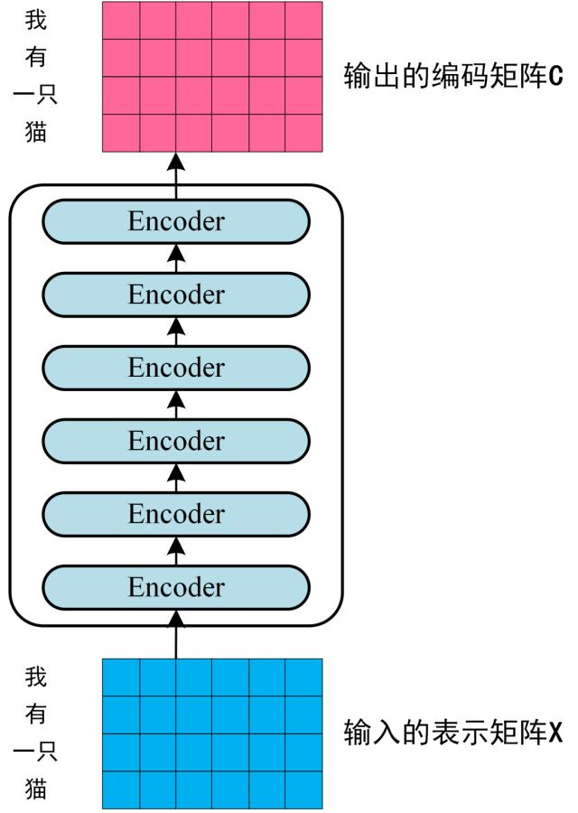

**第三步**：将 Encoder 输出的编码信息矩阵 **C**传递到 Decoder 中，Decoder 依次会根据当前翻译过的单词 1~ i 翻译下一个单词 i+1，如下图所示。在使用的过程中，翻译到单词 i+1 的时候需要通过 **Mask (掩盖)** 操作遮盖住 i+1 之后的单词。

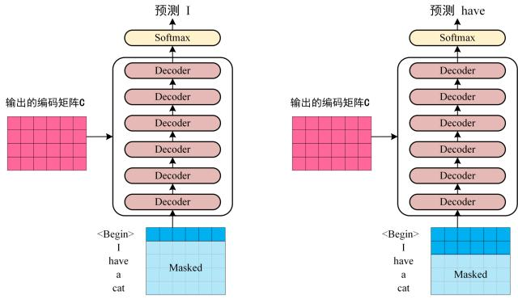

上图 Decoder 接收了 Encoder 的编码矩阵 **C**，然后首先输入一个翻译开始符 "<Begin>"，预测第一个单词 "I"；然后输入翻译开始符 "<Begin>" 和单词 "I"，预测单词 "have"，以此类推。

下面的动画同样展示了如何将 Transformer 应用到机器翻译中： Transformer 首先为每个单词生成初始表示或嵌入。这些由未填充的圆圈表示。然后，使用自注意力机制，它聚合来自所有其他单词的信息，根据整个上下文生成每个单词的新表征，由实心球表示。然后对所有单词并行重复此步骤多次，连续生成新的表征。


**Transformer诞生之后各主流语言模型要么基于 Encoder，要么基于 Decoder，要么基于 Encoder 和 Decoder 整体**，在AI的各个领域攻城略地，大有一统江湖之势，风头之盛，一时无两。

## 3.2 GPT-1（2018年6月）

在GPT出现之前，NLP 领域绝大多数的主流模型都是针对特定类型任务进行**监督学习**训练得到的，而监督学习模型有两个严重的限制：

1. **标注成本极高**：面对特定任务，需要大量的标注数据用于训练。
2. **泛化能力极差**：除了训练过的特定任务，模型很难泛化去做其他任务。

这两个问题不解决，AI 技术在 NLP 领域很难带来应用的广泛性。

**GPT 的出现拉开了 NLP 领域预训练大模型对任务大一统的大幕。而后 T5 模型则明确提出了这个断言，而后续 GPT-3 基本实现了这一点**。

OpenAI 在 2018 年 6 月发表了名为《Improving Language Understanding with Unsupervised Learning》的文章，文中提出了一种新模型，训练方法包括**预训练**（ Pre-training）和**微调**（Fine-tuning）两个关键阶段，在一系列不同语言任务上获得了业界领先的结果。

GPT 采用的 Transformer 模型变体：**只使用Decoder而不使用 Encoder** ，中间的 transformer blocks 一共用了 12 层（作为对比，后续的 GPT-2、GPT-3 分别达到了 48 层、96 层）。

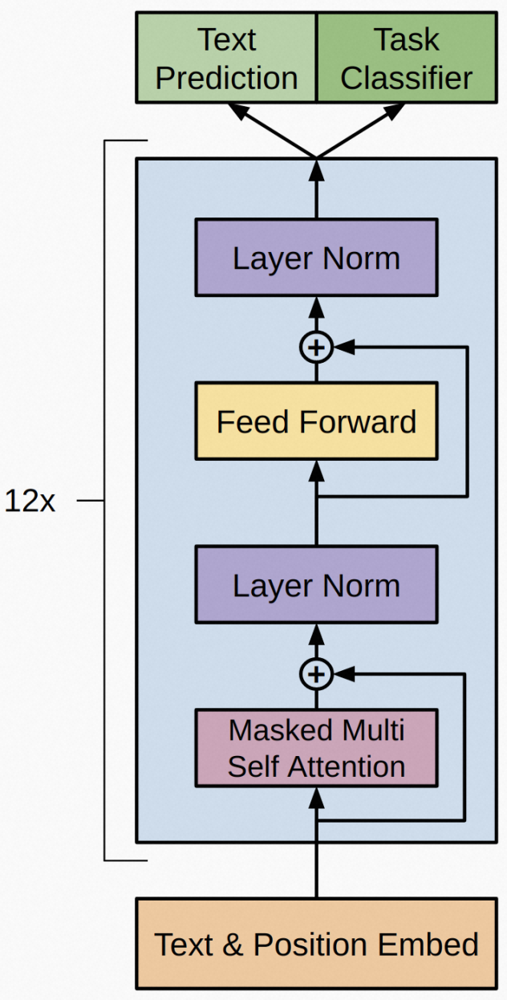

GPT-1 采用的是**无监督预训练 + 监督微调**，当时 OpenAI 把这种方法仍然归类为**半监督学习**，但后来学界和业界都把这种叫做**自监督学习**（Self-Supervised Learning），后面要介绍的 BERT 也采用这种方法。

GPT-1 给 NLP 领域带来了两个重要启示与指引：

1. GPT-1 基于 Transformer 架构，不同于当时主流模型采用的 LSTM。具体说，是 Transformer 的 Decoder 部分，并移除 Transformer 定义的 Encoder-Decoder Attention（毕竟没有 Encoder）。这样的架构，先天地可以实现无监督训练，让世界上所有自然语言（甚至代码）都有了成为其语料的可能。
2. 尽管并非 GPT-1 首创，但是它采用自监督学习的训练方法，具体是语言建模的无监督预训练 + 监督微调训练，为模型带来了更强的泛化能力、更快的收敛速度。

虽然那个时间点学界与业界觉得 GPT-1 规模不小，但现在回头看它的各维度都还不算暴力。预训练数据量为 4.6GB、上下文滑动窗口为 512 tokens、drop rate 为 0.1，其他基本信息如下：

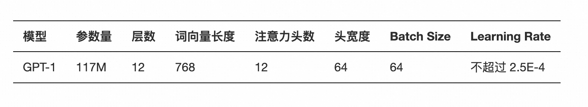

而就在 OpenAI 发布 GPT-1 后没多久，提出 Transformer 模型的 Google 发布了后来几年产生深远影响的、基于 Transformer Encoder 架构的语言模型 —— **BERT**。

##  3.3 BERT（2018 年 10 月）

OpenAI 发布 GPT-1 后，Google 大受震撼。在其发布 4 个月后的 2018 年 10 月，Google 终于推出了 **BERT**（Bidirectional Encoder Representations from Transformers），它有两个版本 **BERT-Base** 和 **BERT-Large**。从性能表现上看，参数规模相当的情况下，BERT-Base 超越 GPT-1，而参数规模更大的 BERT-Large 又远好于 BERT-Base，可以说 Google 又穿上了黄色领骑衫。

下面是 BERT 的基本信息：

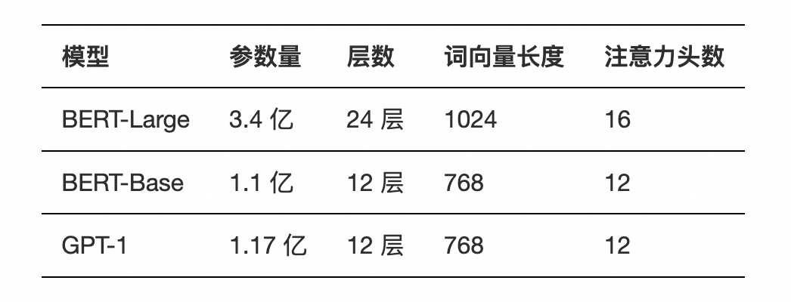

与 GPT 不同，**BERT 采用的是 Transformer 的编码器**。但是这样在技术路线上选择的分野，带来的影响非常的大。**Transformer 的编码器就像完形填空，在预测每个词时，是知道前后（过去和未来）的文本内容的；但是 Transformer 的解码器仅知道前面的文本（过去）来预测词，相当于在预测未来。**

这里将单向与双向作对比，举例来说，对于同一句话「I accessed the bank account」，GPT 单向语言模型的学习方法是：

```
I -> I accessed
I accessed -> I access the
I accessed the -> I accessed the bank
I accessed the bank -> I accessed the bank account
```

而 BERT、ELMo 双向语言模型的学习方法是：

```
I accessed the [MASK] account -> [MASK]=bank
```

BERT 也是采用**无监督预训练 + 监督微调**的方法，与 GPT-1 相同。但毕竟是**双向语言模型**，BERT 的预训练任务与 GPT-1 不同，有如下两个：Masked Language Modeling（在某些文献中也叫 Mask Language Modeling，MLM）和 Next Sentence Prediction（NSP）。

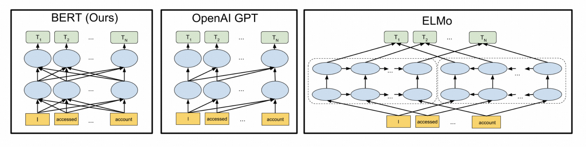

上图展示了 BERT 与当时另外两大主流 NLP 模型 GPT-1、ELMo 的对比。BERT 与 GPT 的共同点是都基于 Transformer 架构，而 BERT 与 ELMo 的共同点是都用了双向架构。

BERT给AI领域带了广泛而深刻的影响：

1. **用足够硬的打榜成绩夯实了「预训练 + 微调」学习范式**：过去我们都是针对某个任务进行训练，让模型成为这个任务领域的专家。但是 NLP 的很多知识是有交叉的，比如语言知识、推理能力等等，各个任务的边界并不泾渭分明，因此总是为了更好解决特定任务而要学习补充其他知识。逐渐地，领域知识的边界越来越模糊，知识范围越来越广，就逐渐自然地向着大语言模型的方向发展了，于是就出现了 GPT、BERT 这种「**预训练 + 微调**」的学习范式。但是 BERT 对特定任务微调后，由于参数被更新，相应地在其他一些任务上的表现可能就会下降，这就导致**模型的泛化能力受到局限**。而后来的 GPT-3、InstructGPT 到 ChatGPT，则是在预训练完成后并不针对任何下游任务更新参数。这样的好处是模型泛化能力很好，但是针对到特定任务身上，很肯定没有监督微调的 BERT 好，尤其是在 NLU 类型的任务上。
2. **开源并开放各种规格的模型下载**：成为了 2018 到几乎 ChatGPT 出现之前 NLP 领域研究的核心模型。
3. **Transformer Encoder 双向模型的特征抽取能力，被充分认可**。但其实**双向语言模型在生成类任务上并不符合人类自然的语言文字「从前向后」的交互模式，这也为后来 GPT 系列反超埋下伏笔**。可以说 OpenAI 做了一个价值更大、难度更大的技术选型，因此如果在类似数据规模、模型规模、训练方法的情况下，GPT 是难有超过 BERT 的表现的。BERT 问世后的几年内，学界与业界的很多人都以为 BERT 是一统江湖的正途，甚至都认为 OpenAI 的 GPT 选择错了技术路线还硬着头皮坚持。这与 2022 年底 ChatGPT 彻底轰动世界形成了鲜明的对比。

## 3.4 GPT-2（2019 年 2 月）

虽然 BERT 似乎在结果上打败了 GPT-1，但是用 Transformer Encoder（更容易）并且数据规模和参数规模都显著提升，多少有点胜之不武，OpenAI 自然不服。BERT 发布后又过了 4 个月，OpenAI 发布了比 BERT 更大的 GPT-2，俨然进入了军备竞赛。

2019 年的情人节之后，OpenAI发布了介绍 GPT-2 的论文《Language Models are Unsupervised Multitask Learners》。**GPT-2 是 GPT-1 的直接扩展，因此还是基于 Transformer Decoder 架构，但是参数扩 10 倍左右，训练数据集扩 10 倍左右**。GPT-2 的训练目标也很简单，就是**基于一段文本中前面的所有词，预测下一个词**。训练方法上，GPT-2 没有对任何任务的任何数据集做针对性的训练，都是直接评估并作为最终结果。

GPT-2 模型的基本信息如下表，其中可以看出 117M 参数版本的 GPT-2 是对标 BERT-Base，15 亿参数版本的 GPT-2 是对标 BERT-Large。

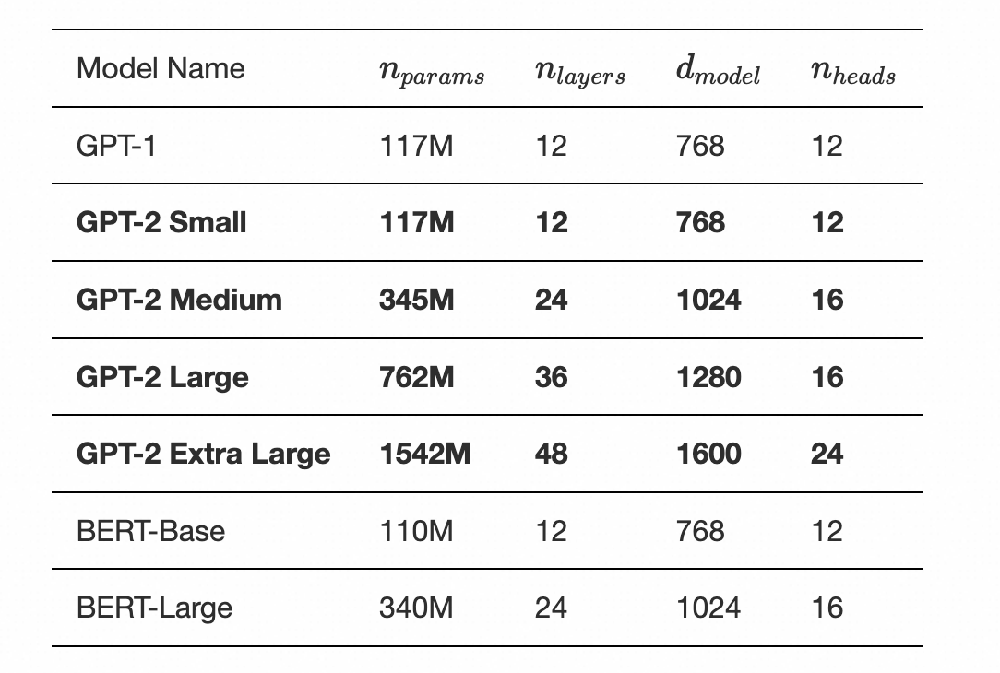


GPT-2 的核心亮点有两个：

- **Zero-Shot**：GPT-1 及当时所有语言模型的局限性在于，即便采取无监督预训练，仍然需要对特定任务进行监督微调。而 OpenAI 在 GPT-2 上验证了基于数以百万计网页上的无监督学习后就可以执行多种语言任务。简单来说，就是不只预训练过程无监督，**整个学习过程都可以无监督**。
- **Multitask Learning**：在无监督的情况下还可以把**多种不同的任务混合起来学**。

对于预训练数据集的处理，GPT-2 采用了最简单直接、符合我们目标期待的方式：不作任何处理，直接喂生数据。GPT-2 直接从原始文本开始学习，而不需要针对任务准备的训练数据，也不需要任何微调，尤其对于问答、阅读理解、summarization、translation 这些任务上，只需要**以正确的方式提示**经过训练的模型就能得到令人惊讶的结果。

这里已经基本预示着，投喂生文本数据，让模型囫囵吞枣地学会了不少东西，就像一个小孩子到父亲的书房里翻了很多很多书，知识都学杂了。但是如果启发教育问的好，给一些上下文提示语，模型就能给出很不错的响应。这也就引出了 **In-Context Learning**、**Prompt Engineering** 等一系列话题。


## 3.5 T5（2019 年 10 月）

Google 团队在 2019 年 10 月发布了一个对 NLP 任务大一统的 T5 模型《Exploring the Limits of Transfer Learning with a Unified Text-to-Text Transformer》。最直接的价值，就是提出**所有基于文本的语言问题，都可以转换成文本生成文本（text-to-text）形式**：

> In this paper, we explore the landscape of transfer learning techniques for NLP by introducing a unified framework that converts all text-based language problems into a text-to-text format.

具体地，只要在编码前，加上任务提示（比如 summarize、translate English to German）就可以在模型输出得到想要的结果。下面这张图可以说是提到 T5 模型必会引用的图。

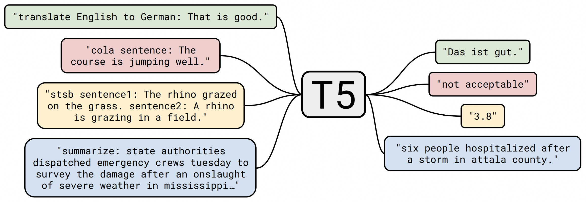

该图里举例了语言翻译、分类问题（来自 cola 数据集）、回归问题的语义文本相似评测（STSB）、摘要生成。除了图中提到这四种任务，T5 模型所有下游任务都可以转化（transfer）为 text-to-text 任务，所以这也是 T5 模型名称的由来：**Text-To-Text Transfer Transformer**。

尽管此前已经有人提出 NLP 的统一模型理念，比如 Salesforce Research 团队、DeepMind 团队、OpenAI 团队在发布 GPT-2 时。但 **NLP 领域比较确定性地进入通用任务的语言模型阶段，是从 T5 正式发布后**。


## 3.6 GPT-3（2020 年 5 月）

在 GPT-2 发布 1 年零 3 个月后的 2020 年 5 月，OpenAI 团队发布 GPT-3，从其论文《Language Models are Few-Shot Learners》可以看到，其最大亮点是**数据规模、参数规模都比 GPT-2 大 100 倍**。这么简单粗暴的办法，带来的是 GPT-3 表现上的炸裂。而其论文标题也点出了本文的主题：**语言模型就是要无监督预训练 + Few-Shot Prompt**。

对于模型架构，OpenAI 声称 GPT-3 与 GPT-2 是一样的。GPT-3 依然延续了此前 GPT-2 的基本架构和预训练方法：构建基于 Transformer Decoder 的自回归语言模型，然后进行无监督预训练，无针对特定任务的微调。

背后的变化是，GPT-3 没有放出源码、预训练好的模型参数等等，俨然变成了各国网友们调侃的 ClosedAI 了。

GPT-3的参数规模如下：

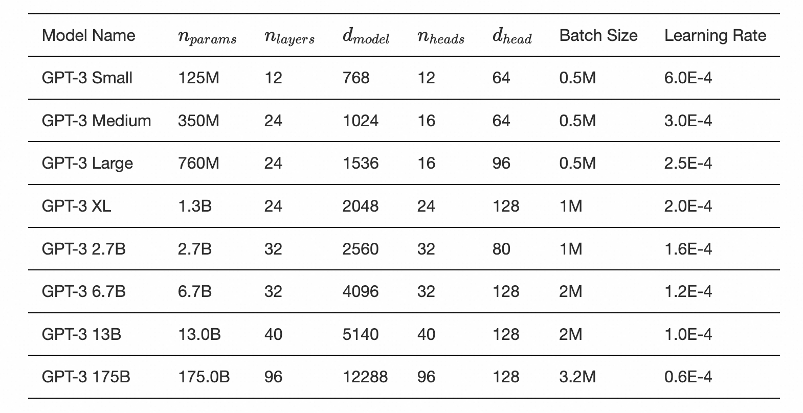

OpenAI 提到一个理念：**设计提示语，就相当于在用一些指令和少量例子给模型编程**。另外 OpenAI 还强调了在目标任务上的区别，就是 OpenAI 的 NLP 模型与其他 NLP 模型很大的一个区别是，它不是设计用来解决单一类型任务的，而是可以解决几乎各种类型的 NLP 任务。

OpenAI 在 GPT-3 发布中显式地提出了 **In-Context Learning**，即在无监督训练好的 GPT-3，使用时用少量示例就可以得到有较好的输出反馈，这就叫 **Few-Shot Prompt**。只有 1 个示例的时候就叫 One-Shot Prompt，没有示例的时候就叫 Zero-Shot。

**In-Context Learning 与 Fine-Tune 两者区别在于是否更新模型参数**。对于在使用时出现在输入中的这些示例，模型是不会更新其参数来做 fine-tune 的。那么模型是怎么从这些示例学到东西的呢？我们把这样的学习方法叫 In-Context Learning，即**模型从无监督的训练文本上下文里，完成了非显性的学习**。

#### InstructGPT：赋予GPT理解人类指令能力

2022年2月，OpenAI在GPT-3基础上进一步强化推出 **InstructGPT模型**，使用来自人类反馈的强化学习方案**RLHF**（ reinforcement learning from human feedback），训练出奖励模型（ reward model）去训练学习模型（ 即：**用AI训练AI**的思路）

训练步骤为： 对GPT-3监督微调->训练奖励模型（ reward model）->增强学习优化SFT (第二、第三步可以迭代循环多次)

InstructGPT通过对大语言模型进行微调，从而能够在参数减少的情况下，实现优于GPT-3的功能。

####  GPT-3.5：赋予GPT代码能力和思维链能力

2022 年 3 月 15 日，OpenAI 在其 API 中提供了新版本的 GPT-3 和 **Codex**（获取代码片段之间的统计相关性，解析自然语言并生成代码），具有编辑和插入功能。

与 GPT-3 相比，GPT-3.5 增加了代码训练与指示微调：

- 代码训练（Code-training）：让 GPT-3.5 模型具备更好的代码生成与代码理解能力，同时间接拥有了复杂推理能力；

- 指示微调（Instruction-tuning）：让 GPT-3.5 模型具备更好的泛化能力，同时模型的生成结果更加符合人类的预期。


####  ChatGPT：赋予GPT对话能力并提升了理解人类思维的准确性  

OpenAI于2022年11月推出其开发的人工智能聊天机器人程序**ChatGPT**，在此前基础上增加了Chat属性，且开放了公众测试。

ChatGPT目前以文字方式交互，但除了可以用人类自然对话方式来交互，还可以用于复杂的语言工作，包括自动生成文本、自动问答、自动摘要等多种任务。如：在自动文本生成方面，ChatGPT可以根据输入的文本自动生成类似的文本（剧本、歌曲、企划等），在自动问答方面，ChatGPT可以根据输入的问题自动生成答案。还有编写和调试计算机程序的能力。ChatGPT可写出相似真人的文章，并在许多知识领域给出详细和清晰的回答而迅速获得关注，证明了从前认为AI不会取代的知识型工作它也足以胜任，对人力市场的冲击相当大。

## 3.7 GPT-4（2023年3月）

GPT-4发布于2023年3月，是一个大型**多模态**模型，**能够接受图像和文本输入**，并生成文本输出。这里的“模”就是指不同的数据类型，OpenAI做ChatGPT的初衷就是要做AGI。

相较于其前身GPT-3.5，GPT-4在可靠性、创造性和处理细致指令的能力上有了比较大的提升。它在许多专业和学术基准测试中展现出与人类甚至超越人类的表现，例如在模拟律师考试中取得了前10%的成绩。

GPT-4的回答准确性不仅大幅提高，还具备更高水平的识图能力，且能够生成歌词、创意文本，实现风格变化。此外，GPT-4的文字输入限制也提升至2.5万字，且对于英语以外的语种支持有更多优化。


