# 1 引言

当下火爆异常的 **GPT** 全称是 `Generative Pre-trained Transformer`。其中“Generative”是“生成式”的意思，也就是说这个 AI 模型是用来生成内容的。“Pre-trained”是“预训练”的意思，就是说这个 AI 模型能有很强的能力，是因为它事先做了大量的训练，台上一分钟台下十年功。“Transformer”这个单词在日常英语中通常指“变压器”，而在流行文化中大家最熟悉的是“变形金刚”。在技术语境下，它常被译为“转换器”或“变革者”。

单从 GPT 这三个字母的组合就能看出来，“Generative”与“Pre-trained”都是定语，而**Transformer才是 GPT 的主体，才是 GPT 的灵魂**所在。可以说，理解透了 Transformer 的真正含义，才能初步地理解 GPT。

另一方面，Transformer 这个词也确实太重要了。它在这几年的人工智能领域大放异彩，不仅仅局限于 NLP 自然语言处理领域，它还有着更广阔的发展空间。Transformer 目前已经进入到了多模态领域，比如音频与视觉，甚至数学公式、代码编程等领域，著名的 Stable Diffusion 中也用到了 Transformer。可以说，**所有生成式人工智能领域的大模型中都有 Transformer 的身影**。

Transformer 最早是由 Google 的人工智能团队提出来的。在 2017 年 6 月发表的论文 ***《Attention Is All You Need》*** 中，他们首次提出了一种新的神经网络架构 Transformer。Transformer 依赖于一个叫“**自注意力机制**”（Self-Attention）的内部构件，可十分准确高效地对自然语言领域的问题进行处理，以完美地解决翻译、对话、论文写作甚至编程等复杂的问题。

顺藤摸瓜可以看出，**GPT 的核心是 Transformer，而 Transformer 的核心则是“自注意力机制”（Self-Attention）**。

我们可以用一个日常生活中的例子来类比自注意力机制，让它更容易理解。

想象一下你正在读书，遇到一个句子：

> “苹果公司今天宣布了一个新产品，它的售价比预期的便宜。”

如果你刚刚开始学中文，可能需要反复理解“苹果”到底指什么（是水果还是公司）。这时候，你的大脑会怎么做？

你可能会往后看，发现后面提到了“公司”，然后立刻回头修正对“苹果”的理解。

自注意力机制就是模拟这种“**自己参考自己**”的过程。

自注意力机制的核心思想：**每个单词（或信息）都会主动“关注”其他所有单词，判断哪些对它更重要，并据此调整自己的理解**。

简单来说，就像每个单词都在问自己：“我和其他词之间的关系是什么？哪些词能帮助我更好地被理解？”然后根据答案给自己和别人“打分”。

再举个生活化的例子：假设你在策划一场聚会，需要整理大家对场地的建议，有人提：“地点要安静，但交通要方便。”

自注意力机制就像你同时考虑这两句的关系：“安静”会关注“交通方便”之间的矛盾，并调整自己的理解（比如：需要找一个平衡的地方）。

每个词都在与其他词互动，而不是孤立地处理。

为什么叫“自”注意力呢？因为每个词自己主动关注其他词，不用依赖顺序或位置。不像传统的循环神经网络（RNN），需要一个词一个词按顺序处理，后面的信息不能影响前面的词；自注意力一次能看到所有词，直接让它们互相“对话”。

总之，自注意力机制就像是让句子中的每个词都成为“侦探”，自己主动搜集其他词提供的线索，根据线索的重要性来重新理解自己和整体语境，从而更精准地捕捉信息之间的关联。

这就是它为什么能帮助机器学习模型（比如 Transformer）在翻译、文本生成等任务中表现优异的原因——它让每个元素“通盘考虑”，而不是只看局部。

# 2 语言的数字化表达

Transformer 最开始应用于 NLP 领域的机器翻译任务，我们也从两个句子翻译开始：

- **句子 I：**The bank of the river.
- **句子 II：**Money in the bank.

在翻译成中文的过程中，机器算法是如何知道“句子 I”中的“bank”指的是自然环境中的“岸边”，而“句子 II”中的“bank”指的是金融体系中的“银行”呢？

该问题即是笼罩在 NLP 头上挥之不去的乌云——**多义词问题**。

实际上**人工智能的翻译过程是对我们人脑中的计算过程的模拟**。

参照上文中生活中的例子，人类为什么能区分多义词在某一句话中的具体含义呢？是因为会**根据前后文的语义对照**来确定结果，即看句子中其他相关联的单词是什么含义。在“句子 I”中，“river”这个词指明了自然环境，而在“句子 II”中，“money”这个词则指明了金融环境，所以两个句子中的多义词“bank”也就有了各自的定位。如果把这种方式总结成一种算法的话，自然就可以用于人工智能领域的语言处理了。

但人工智能作为一种计算机算法，它只能处理冷冰冰的数字，并不知道何为“自然环境”，何为“金融环境”，它又是怎么去判断“river”和“money”各自的含义呢？

实际上，机器算法并不知道“river”和“money”的具体含义。但是机器可以通过某种数字的方式来表达“river”和“money”，同时，通过数字的方式还表达了许许多多其他的词汇，其中必然会有一些词汇会与“river”和“money”有着很紧密的语义上的逻辑关系。通过判断“river”和“money”各与哪些词汇在语义上有紧密的逻辑关系，便可以知道这两个词各属于什么领域了。

其实，不像人类会对某个领域有一个具体的名称来命名，机器最终也不知道这个领域的统称到底叫什么名字，但它却知道这个领域中都包括了哪些词、哪些概念和哪些逻辑。机器不以单独名称来定义一个概念，而是**用很多其他相关的概念与逻辑来圈定这一个概念**。老子曾经曰过：道可道，非常道；名可名，非常名。

其实我们回想一下儿时的我们，那时我们同样不知道“自然环境”、“金融环境”这种抽象的概念，可是我们却知道妈妈带我们去过河边，看见过柳树、鱼、蝌蚪等等。后来长大一点去过了银行，看见了提款机、纸币、柜员等等。那时没有人灌输给我们这是“自然环境”和“金融环境”这些概念。但大脑中对这些事物已经进行界定和分类了，这也同样是 AI 对事物进行数字表达方式的界定分类框架。

## 2.1 One-hot

假设这个世界上有 100 万个单词，每一个单词都可以用一组 0 和 1 组成的向量（一组数字）来定义的话，那么每一个单词就可以被编码成 100 万维的向量。如下图：

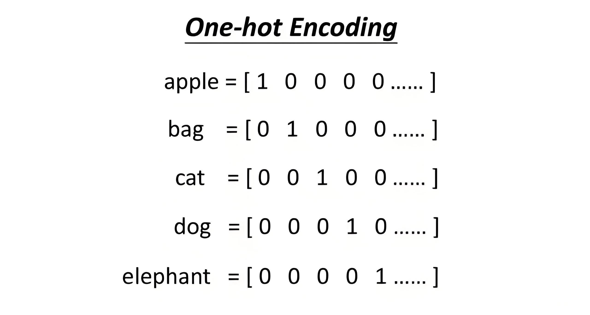

这种单词编码方法叫 `One-hot Encoding` “独热编码” 法。可是这样一维的编码方法将导致向量占用的空间过大，1 个单词用 100 万维的向量表达，世界上一共有 100 万个单词，那么就需要 1 万亿（100 万 * 100 万）的空间来把它们全部表达出来，很明显这种臃肿且极度消耗存储空间的结构不利于电脑高效计算。但最大的问题还不在于这个体积问题，而是语义联系问题。**独热编码使得单词与单词之间完全相互独立**，从每个单词的 100 万个单元的向量编码身上，根本看不出它与其他单词有何种语义内涵上的逻辑联系。比如，在这些编码数字中，我们无法知道 apple 和 bag 属于静物，区别于 cat 和 dog、elephant 属于动物且是哺乳动物，而 cat 和 dog 又属于小动物，且大多数为非野生，区别于 elephant 为大型的野生动物，等等等等，这些单词背后所蕴含的各种内在的逻辑联系和分类关系均无法从独热编码法中知晓。

## 2.2 Word Embedding

为了解决独热编码的问题，Word Embedding “词嵌入” 编码法诞生了，如下图：

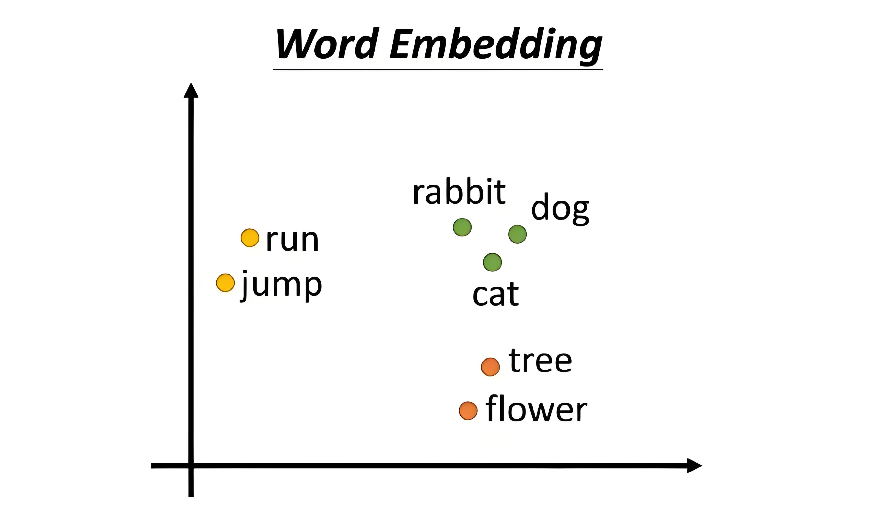

Word Embedding “词嵌入” 编码法**将语义上相近的、有关联的词汇在 Embedding 空间中生成相近的位置定位**。相对于“独热编码”法超长的一维数据，Embedding “词嵌入” 编码法提升了数据的表达维度，它更像是在一种“空间”中对词汇进行编码。

上图中为了表达方便，我们仅用二维空间来表达，实际上这个空间的维度很高，一般至少在 512 维之上。一维二维三维的空间大家都可以在脑中想象出来对应的画面，但是四维以上以至于 512 维就难以图形化的想象了。

在 Embedding 的二维空间中 dog、cat、rabbit 三个向量的坐标点位排布，可以看到三个绿色的点距离很近，是因为它们三个相对于其他来说语义上更接近。tree 和 flower 则离它们较远，但是 cat 会因为在很多语言的文章中都会有“爬树”的词汇出现在同一句话中，所以导致 cat 会与 tree 离得较近一些。同时 dog、rabbit 与 tree 的关系就较远。

实际上，在 Embedding 空间中，词与词之间的关系还不仅仅限于语义上的分类所导致的定位远近这么简单。一个词所代表的事物与其他词所代表的事物之间能产生内在联系的往往有成千上万种之多。比如 man 和 woman，它们之间的关系还会映射出 king 和 queen 之间的关系。你甚至可以用公式来计算它们：“king” - “man” + “woman” = “queen”。

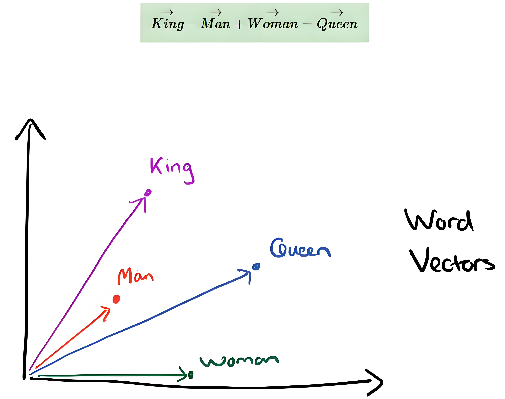

同时，语法也会带来一定的联系，比如在一个三维空间中由 walking 到 walked 的距离与斜率竟然与 swimming 到 swam 的距离与斜率一致（即向量的长度与斜率一致）。因为这背后是两组动作单词的现在分词形式和过去式形式的变化关系。我们可以尽情地想象，**凡是事物或概念有逻辑联系的，甚至是逻辑与逻辑之间的联系的，在 Embedding 向量空间中都可以得到远近亲疏的空间表达**。只不过这种“空间”要比我们能想象出的三维空间要高出很多维度。

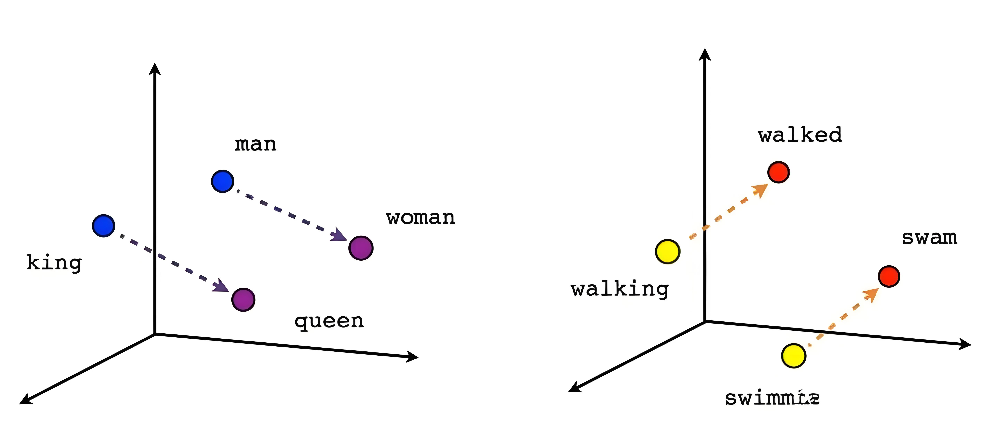

## 2.3 Sentence Embedding

Word Embedding 进一步扩展还可以做到 **Sentence Embedding**，不仅仅可以对单个词语进行定位，它甚至还可以做到对句子进行逻辑定位，如下图中所示。

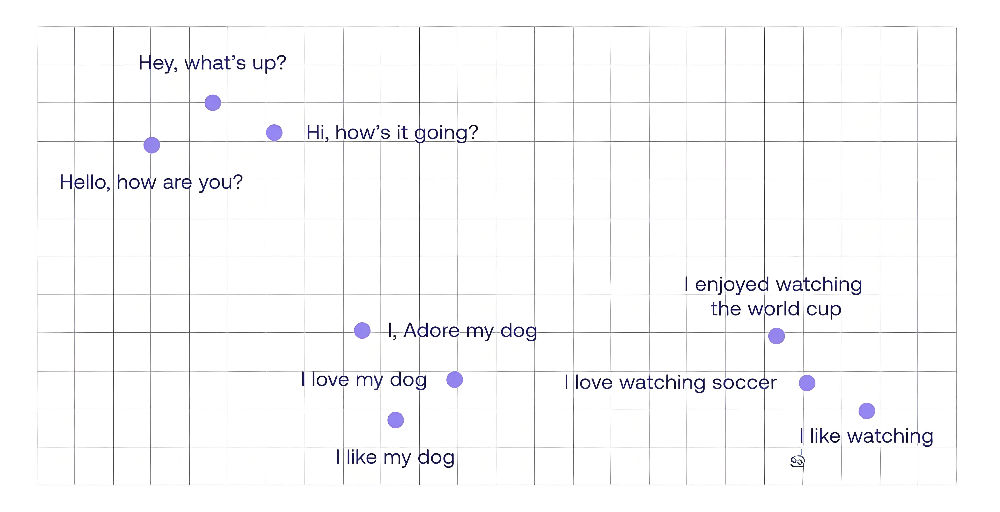

Word Embedding 和 Sentence Embedding 是**大语言模型**（Large Language Model，**LLM**）的重要基础组成部分。它们将人类语言转化为了计算机能够读懂的底层数字表达方式，并且通过多维度的空间定位捕捉了各个单词、短语、句子在语义上的细微差别，以及它们之间的逻辑联系。

这种底层的数字表达已经跨越了不同的语系语言，成为了全人类共用的最底层语言逻辑，甚至成为了一种世界语——**AI 世界语**，这对于翻译、搜索和理解不同语言语种具有非常重要的作用。可以说，巴别塔的魔咒自此被打破。

# 3 注意力机制

Word Embedding 之所以能给每一个单词做这样有意义的向量空间的标注，是因为 AI 科学家们事先用了全球十多种主流语言的大量语料给它进行了训练。这些语料有小说、论文、学术期刊、网络文章、新闻报道、论坛对话记录等等等等，应有尽有，数以百亿到千亿计。可以说，这些海量的文字资料都是人类从古至今感受发现这个世界各个方面的文字总结和积累。现实世界中各种事物之间的逻辑关系都被人类用这些文字记录了下来，只是有的是用严谨的论文方式，有的是用写意的小说方式，有的是用类似维基百科这样的系统梳理，有的则是人们在网络论坛中的对话记录...等等等等。但不管是什么方式，都是人类用语言对这个世界的描述，这其中含有各式各样的内在逻辑。

Word Embedding 词嵌入编码法，能让**每一个单词之间产生应有的语义上的以及背后逻辑关系上的联系**。这种联系越紧密，它们在 Embedding 空间中的位置距离越紧密，反之则越远。其实，你会发现 Embedding 空间中知识宝库的存在方式，仍然不像维基百科那样条理分明地一条一条地罗列好的，而是像一只巨碗盛载着浩瀚的知识粥。人类仍然无法直接从中看到那些逻辑线索。但这碗粥的好处就在于我们可以**通过大模型的训练和数据挖掘的方式从中找到事物背后的关联，以及关联背后的逻辑**。

## 3.1 Attention

所以再回过头来思考一下之前举例中的两句话时，就有了如下这样一幅景象：

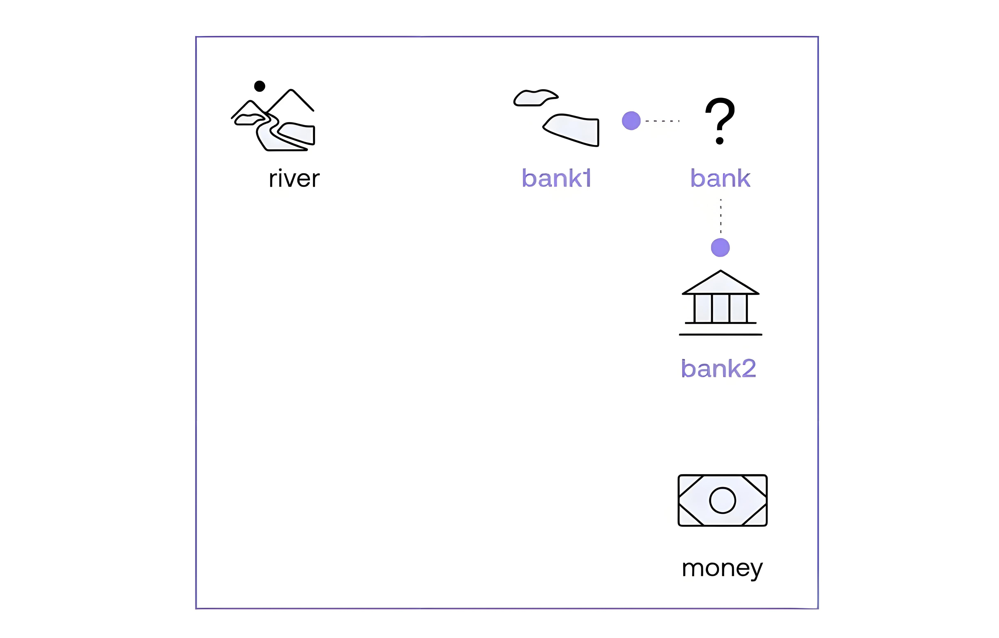

如上图，我们用一个简单的位置关系图来展示一下“bank”、“river”和“money”这几个单词在 Embedding 空间中的位置关系（在实际 Embedding 空间中的关系要比这个图复杂数百倍，这里只是为了让大家更好地理解关键逻辑而做了简化）。

由于 “bank” 是一个多义词，所以它在 Embedding 空间中的定位本来是有多个“分身”的，我们取其中的两个分身，暂用“bank1”和“bank2”来指代。那么，我们需要做的就是定位清楚“bank1”和“bank2”这两个单词在空间中各自离“river”和“money”哪个单词更近一些。在图中很明显，“bank1”离“river”更近，而“bank2”离“money”更近，于是这两句话就变成了：

- **变形后的句子 I：**The bank1 of the river.
- **变形后的句子 II：**Money in the bank2.

如之前所说，虽然此时机器算法压根也不知道“river”和“money”到底是何物，但它知道在 Embedding 空间中，“river”周边有很多和大自然有关的词汇，比如“water”、“tree”、“fish”等等。而“money”周边有许多与金融有关的词汇，比如“currency”、“cash”、“withdraw”等等。于是，机器算法知道了“bank1”代表的是与“river”有关的一个单词，与它们比较近的单词还有“water”、“tree”、“fish”等等。而“bank2”代表的是与“money”有关的一个单词，与它们比较接近的单词还有“currency”、“cash”、“withdraw”等等。

这就是“Attention 注意力机制”的工作原理：**让一个单词在上下文中找到与它产生强语义联系的其他单词，从而融合出一个带有上下文信息的“新向量”（或称“变体表示”）**。

## 3.2 Self-Attention

然后又有新的问题产生了，机器算法是如何知道一句话中只有“river”或“money”这两个词代表了上下文语义的强关联词汇，而不是“The”、“in”、“of”或其他单词呢？

实际上这依旧是 Embedding 空间中每一个单词的空间定位相近程度的问题。在 Embedding 空间中，不仅仅名词有各自的位置，动词、介词、形容词等等都有自己的位置，甚至**一个词组、一句话也会有自己的位置**。

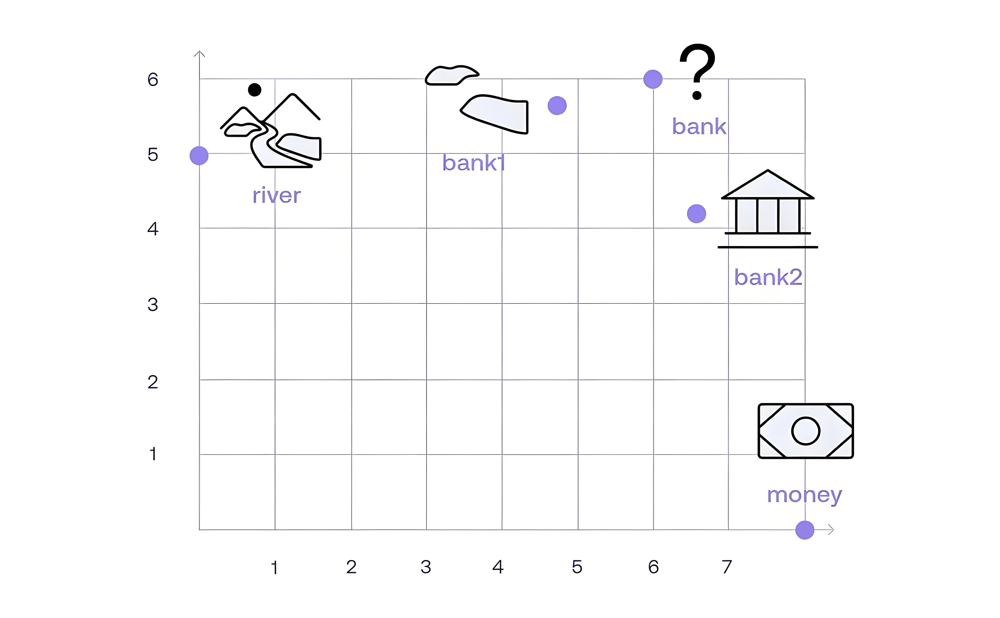

全句中的每一个单词都在 Embedding 空间中寻找与自己定位的相近度的其他单词，即机器算法会**对每一个单词与全句中其他单词逐一地配对，做语义关联程度的计算，然后最终汇总再进行比较**。我们可以通过下面的两个表格来观察这样计算后汇总的结果，颜色越深代表语义关联程度越高。

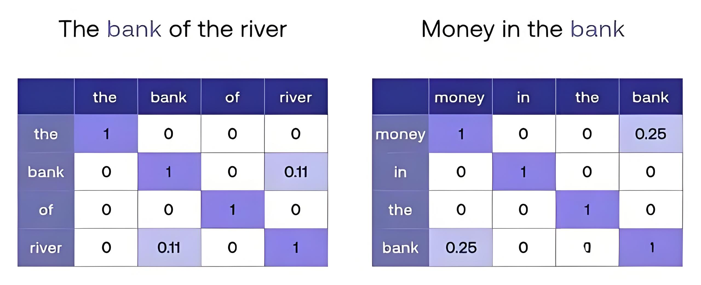

我们可以从表格中看出来：

- 每一个单词与自己的相似度为最高分“1”（一般用数值“1”来代表最大权重，这里的相似度用权重来表达）；
- 互不相关的单词之间的语义关联度为 0（其实可能是 0.001 之类的很小的数字，这里做了简化，即值太小则做归零处理）；
- “bank” 与 “river” 的相似度为 0.11；
- “bank” 与 “money” 的相似度为 0.25；

这样，**遍历全句中的所有单词，让每一个单词都对其他单词进行注意力机制的检查，得到的结果进行汇总比对，这样的机制，就叫“Self-Attention 自注意力机制”了。**

于是通过“自注意力机制”的语义关联比对后，我们便找出了“river”为“句子 I”全句中与“bank”关联度最大的词，“money”为“句子 II”全句中与“bank”关联度最大的单词，然后“句子 I”中的“bank”就被机器算法转换成了它的新变种“bank1”（“river-bank”）。而在“句子 II”中的“bank”则被机器算法转换成了它的新变种“bank2”（“money-bank”）。然后机器算法就可以继续往后进行翻译工作了。

但像上面例子中“The bank of the river.”这样的句子太短太简单了，它甚至都无法称为一个完整的句子。在实际项目中，输入给 Transformer 的语句会更长更复杂，往往在一句话中有可能出现三个以上的单词有语义关联的关系，甚至更多。 比如这一句：“The animal did not cross the street because it was too tired.”。很明显，在该句中和“it”有语义关系的词汇有两个，分别是“animal”和“street”。

对于这样的情况，处理机制和“The bank of the river.”的处理机制仍然是一样的。Self-Attention 同样会在 Embedding 空间中对全句的所有单词进行距离比较，即语义关联权重计算。

在“The animal did not cross the street because it was too tired.”中“it”与“animal”的语义关联权重比与“street”的语义关联权重要高。因此，Self-Attention 自注意力机制处理后的结果将以“animal”为主导来生成新的单词“it1”，即“it1”为“animal-it”。此时就变成了“The animal did not cross the street because it1 was too tired.”。翻译成中文则为：“这只动物没有过马路，因为它太累了。”

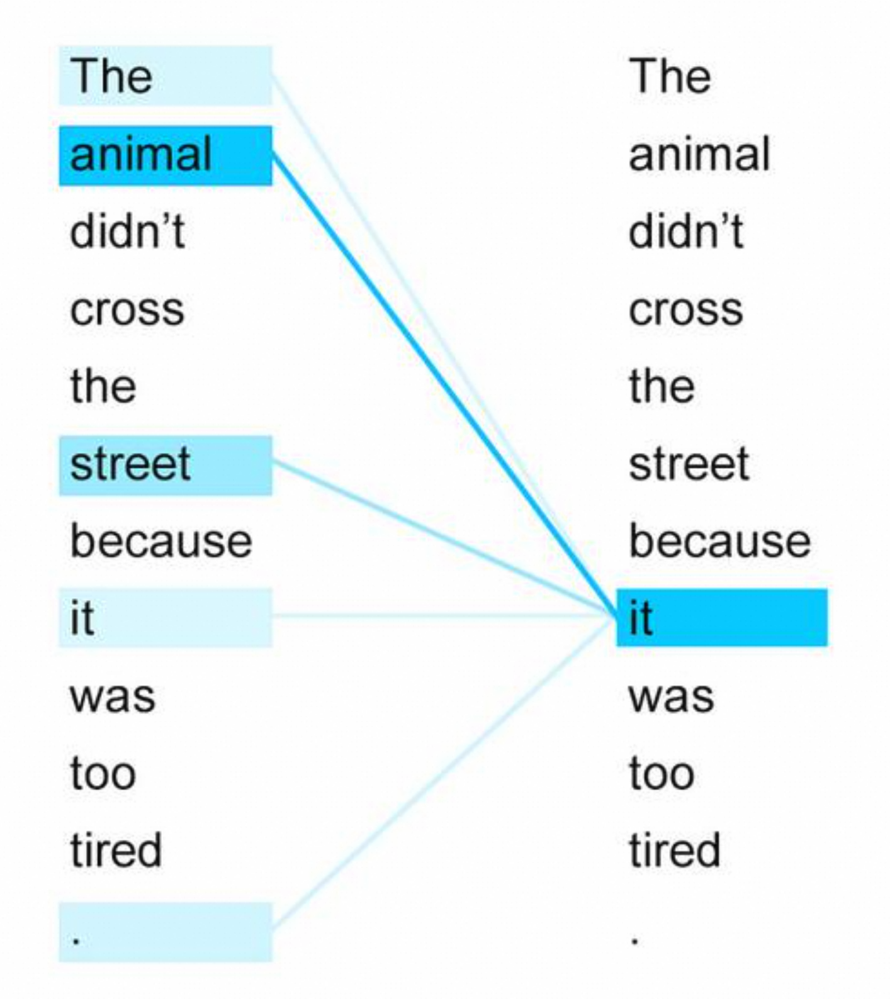

在另一句话中，“The animal did not cross the street because it was too wide.”，只是一字之差，“tired”变成了“wide”，导致了全句的语义发生了很大的变化，尤其是“it”所指的对象由“animal”变成了“street”。此时 Self-Attention 同样按照以前的方法进行语义关联度匹配，结果是“animal”和“street”的权重在全句中都很高，但是“street”是最高的，所以最终的结果将以“street”主导来生成新的“it2”，即“it2”为“street-it”。此时就变成了“The animal did not cross the street because it2 was too wide.”。翻译成中文为：“这只动物没有过马路，因为路太宽了。”

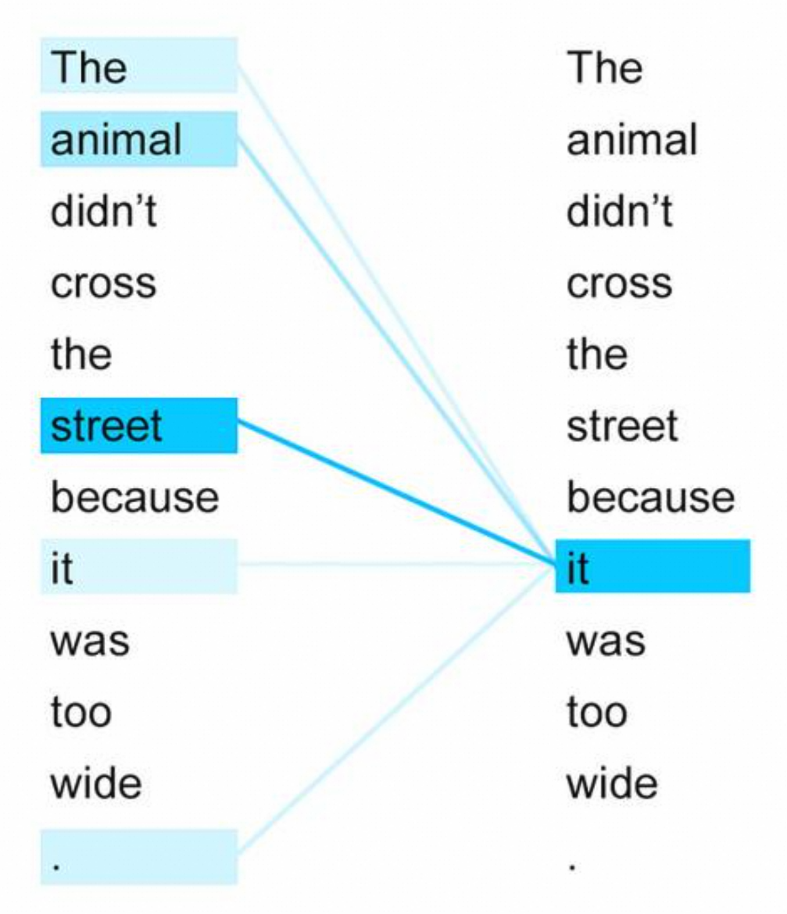

之所以 Transformer 可以把 Word Embedding 中的权重比较做得如此细腻，一方面是因为使用了千亿级的语料来训练 Word Embedding，另一方面是因为 Transformer 模型本身的架构核心也有与之匹配的超级强大的处理能力，它在超长语句上的处理能力远远超过了早先的 RNN，它不仅仅能对一句中所有单词做 Self-Attention 自注意力机制的审核，它还可以对一整段话，甚至全篇文章做审核。这就是我们通常说的要结合上下文来理解语句并翻译。

如今的大语言模型一次可以处理数百万个 Token（相当于数十万甚至上百万个单词），足以一次性读完多本长篇小说。这种百万级（如 1M 甚至 2M）的上下文处理能力，使得人工智能在处理超长对话或整本书籍时，再也不会“迷失方向”。

# 4 大模型之大

人类文明中比较高级的那部分文明，全都是在人类发明了语言文字后才诞生的——物理、数学、生物医药、金融体系、现代通信、航空航天、汽车工业、计算机科学等等。因为语言以及匹配语言的文字与符号让人类把对世界的感受与理解记录下来，形成了人类独有的知识宝库。全人类一代一代地不断完善这个宝库，并从中总结凝练、学习、创造、传承。

通过语言文字凝练下来的这个人类知识宝库现在变得越来越庞大、越来越复杂了。世界上没有任何一个血肉之躯的个体，有能力对宝库中的所有信息进行消化整理，因为内容体量过于庞大、过于复杂。而一个人阅览消化的速度却十分有限，以至于在他的有生之年，哪怕完成其中的万分之一都比登天还难。每个人类个体是不完美的，但又是有特点的，于是，迫不得已，人类才喊出了“闻道有先后，术业有专攻”，每个个体才转而去研究具体某一领域。换句话说，如果每个人是完美的智能体，是永生的无限可吸收知识的个体，谁又会偏安于只深度研究某一两个领域呢？为什么不把知识宝库中的所有内容都学精学透，然后继续探索宇宙以至于能站在造物主的视角面对这个世界呢？

另一方面，人类早期发明的纸张和印刷术，以至于后来的计算机芯片存储，倒是可以记录存储下来如此巨量的信息了，但却无法自发地、有机地分析汇总这所有信息之间的内在逻辑。以至于计算机存储的这些数据越积越多，犹如汪洋大海。这个知识宝库的结构就好比一棵万米高的巨大知识树，人类如同蚂蚁一样在树上摸索前行。人类只能将有限的肉身算力资源集中在主要的枝干，对于无数的细枝末节尚无暇顾及，但随着发现的主要枝干越来越多，细枝末节的信息量将呈爆炸般的方式展现出来。而对于这棵知识巨树的展示能力，却因为计算机时代的到来而大大加速了进程。

现在，这一探索知识巨树的任务落到了 AI 的身上，AI 的承载和运算能力超越了过往所有人类个体以及群体能力的总和。AI 通过事先的大量预训练，把这些海量文字用 Word Embedding 的方式抽象地汇总了起来。

AI 科学家用了至少千亿级的语料来训练单词在 Embedding 空间中的表达，其中**包含了全世界几乎所有语言的词汇量**。在这同一空间中，不仅仅有英文，也有中文、法文、德文...等等的 Embedding 词汇标注。那么基于 Embedding 空间表达的翻译就变成了现实。

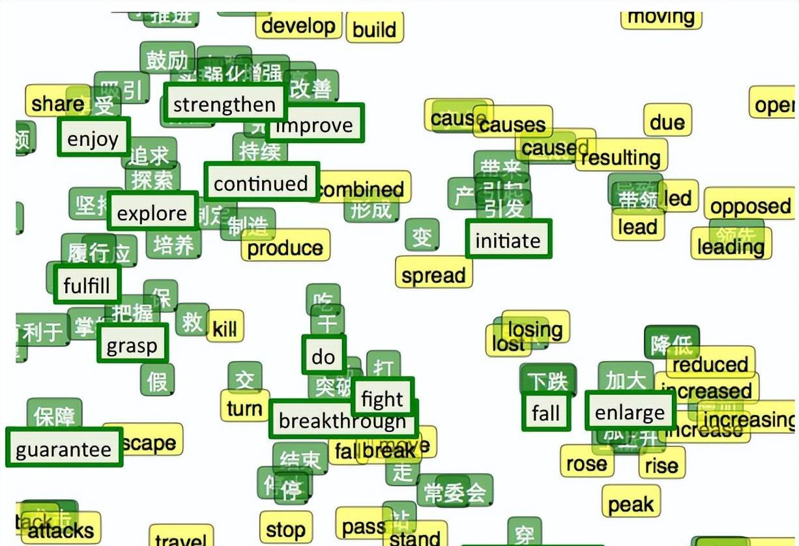

虽然，这些文字来源于世界各地各个民族、地区、不同性格或不同知识认知水平的写作者等等，这其中必然存在认知差异。但总的来说这些文字描绘的事物逻辑还逃不出一个地球一个太阳系，其中最普遍的规律是没有差异的。而那些由于地域、习俗等因素产生的差异，也早就被单独命名了，这些单独命名的事物在第一次展示给全人类时，虽还算是惊掉下巴的事情，但如今也已经被分门别类地归档做研究了。有了分门别类的归档，最终也就变成了普遍认知。

举个例子，比如“猫上树”这样的现象，世界各地人类普遍观察落实到文字中的数量就远远大于“狗上树”。这一点，至少目前在地球上哪个角落的历史文献描述中都是一致的。所以，在 Embedding 空间中，“猫”的空间点位一定是与“树”的点位很近的，而“狗”则离“树”很远。

对于差异巨大的事物，举个例子。比如，全世界对于死人的对待方式从古至今大都是土葬，现代的处理方式则有了火葬，后来也有海葬、树葬等等。但“天葬”的形式第一次听说时还是比较颠覆三观的，和其他的“葬”差异巨大。在 Embedding 空间中“葬”这个字一定是与“土”、“入土”、“埋”很近的，离“火”也不远。但离“秃鹫”等词汇距离就要远一些了。这个远近亲疏明显是与文字记载量有关的，越接近全人类普遍认知的记载量越大。但我们人类既然已经给这种特殊葬礼形式命名为“天葬”，那么，凡是“葬”前面加个“天”字的，这种葬礼形式，在 Embedding 空间中的定位一定就是和“秃鹫”离得最近了。

所以，这里就构成了一个以海量文字描述为基础的知识海洋、逻辑海洋。其中有着各种细分领域，包罗万象。各种语言文字对这些知识的描述形式也是趋同的。所以，基于 Embedding 空间，在不同语言文字间进行对照翻译就变得可行了。

中文的“河流”和英文的“river”在 Embedding 空间中的位置基本是一样的，而“钱”和“money”的位置基本一样，“岸边”和“bank1”的位置一样，“银行”和“bank2”的位置一样。于是，把这些不同语言的定位一一找出来，就实现了十分正确的翻译结果。

- **句子 I**：The bank1 of the river.
- **句子 I 翻译**：那个河流的岸边。
- **句子 II**：Money in the bank2.
- **句子 II 翻译**：银行中的钱。

至此，Transformer 和其中的核心部件 Self-Attention 对于语言翻译类信息处理的流程就被简要地讲清楚了。

既有“大力出奇迹”的训练内容，更有承载“大力出奇迹”的结构，最终导致 Transformer 必然产生了这样的“奇迹”，使它能够在机器翻译领域达到了人类翻译的“信达雅”的成就。

# 5 为 Transformer 正名

我们将单词“X”转化为“X1”。其中，“X”代表 Transformer 处理前的原始单词；而“X1”则代表经过 Self-Attention 处理后，融合了句子中其他强关联词汇信息的“变体表示”。其实，句子还是原来那个句子，单词还是那个单词，本质并没有变，但表达形式却变了。就如同“bank”被转变成了“bank1”一样。“bank1”的灵魂还是那个“bank”，但是“bank1”展示出来了隐藏在“bank”身体中的另一面“river-bank”。

所以，**用众所周知的“变形金刚 Transformer”来命名与解释**就再贴切不过了。“bank”变形成了“bank1”， “bank”与“bank1”异体同身。“大黄蜂”既是机器人，“大黄蜂”也是跑车。由车变形到机器人，再由机器人变形到车，万变不离其宗，都是“大黄蜂”，本质上并没有改变，但是，外观变了，用途也就变了。

在车的状态下，容易让人混淆（你本以为它是一辆车，但其实它是一个机器人，不变成人形，你还真认不出来）。就如同多义词一样，过往的翻译机制很难辨认出它在一句话中的确切含义，它们虽然也有上下文语义的兼顾理解能力，但是处理信息量还是太少，导致它们无法做到十分精准，经常造成单词虽然翻译对了，但放在句子里却容易产生含混不清甚至错误。但是通过 Transformer 的变形操作，“大黄蜂”的车状态就变形成了同样叫“大黄蜂”的机器人状态，再放回到句子中，则让它现了原型，于是其确切含义便一目了然。

Google 的技术团队就是用了“变形金刚 Transformer”这个梗。如此的诙谐幽默、简单直白，半开玩笑地就起了个技术名词。但也不得不承认“变形金刚 Transformer”这个词用在这里，用于这个技术名词的命名，也确实再贴切不过了，真正的名副其实。
