# 1 自注意力机制

## 1.1 公式表达

自注意力机制的核心是通过计算不同词之间的相关性，赋予不同权重（注意力分数），最终将这些加权后的信息重新组合成新的向量表示。其数学公式通常写成：

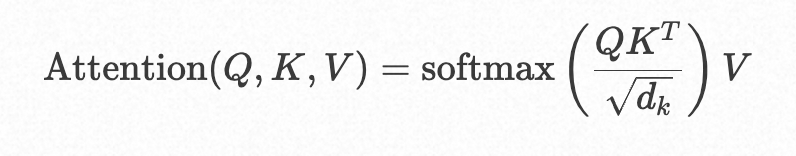

**解读各个部分的含义：**

- Q（Query）、K（Key）、V（Value）：每个词被分别映射成这三个不同维度的向量。例如，假设输入是一个句子中的词语，每个词先被转换为一个向量：
  - **Query**：表示“当前词需要关注什么信息”。
  - **Key**：表示“其他词能提供什么信息”。
  - **Value**：表示“其他词的具体内容”。
- $K^T$：将 Key 向量转置，使其可以与 Query 进行点积计算。
- $\frac{QK^T}{\sqrt{d_k}}$：计算 Query 与所有 Key 之间的点积，表示每个 Query 与其他 Key 的相关性。除以 $\sqrt{d_k}$ 是一种缩放操作（Scaled），目的是防止点积结果过大导致 Softmax 函数进入梯度极小的饱和区，从而保证反向传播时梯度的稳定性。
- **softmax**：将点积结果转化为概率分布（0 到 1 之间），表示每个 Value 的重要性权重。
- **最终输出**：通过权重分数与 Value 向量加权求和，得到新的上下文表示。

> **符号说明**：为了表述方便，本文用大写字母（如 Q、K、V）表示由整个句子所有词堆叠而成的矩阵，用小写字母（如 q1、k1、v1）表示单个词对应的向量，请读者注意区分。

假设有一句话：“苹果公司今天发布了自己的新产品，售价比预期更便宜。”

**目标**：计算每个词的自注意力，并生成新的上下文表示。

**Step 1：初始化矩阵**

假设每个词被编码为一个 d 维的向量（比如，词嵌入编码）。然后，通过三个全连接层生成 Q、K、V 矩阵。例如：

- 示例词：["苹果"]被嵌入为向量 x1，生成 Q1, K1, V1。

**Step 2：计算注意力矩阵**

- 对每个词 i，计算其与所有词 j 之间的“关系分数”：

  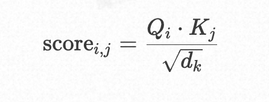

  例如，计算“苹果”与“公司”的分数：

  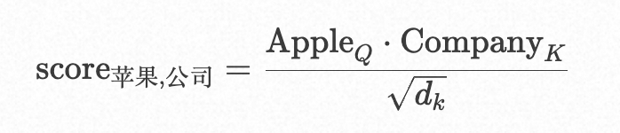

- 填充成矩阵并计算 softmax：

  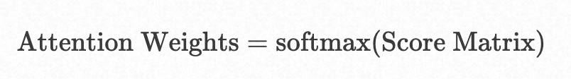

  这将生成一个注意力权重矩阵 A，其中每个元素 Ai, j 表示词 j 对词 i 的重要性。

**Step 3：加权求和得到输出**

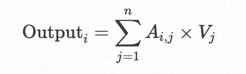

例如，新的“苹果”的表示 $O_{苹果}$ 是所有词的 Value 向量按权重求和的结果。

Q、K、V 做个类比的话：

- **Key**：像图书馆的“索引标签”，告诉模型“这个词应该被其他词如何关注”。
- **Query**：像“问题”，告诉模型“我要找什么信息”。
- **Value**：像“答案内容”，一旦被选中就会被整合到结果中。

假设你在图书馆找一本关于“苹果公司”的书：

- **Key**：书脊上的分类标签（比如“科技公司”“科技产品”）。
- **Query**：你想要的书籍关键词（“苹果公司”“新产品”）。
- **Value**：书的摘要内容。

你**通过扫描标签（Keys）找到匹配的书籍（高分数），然后整合摘要（Values）得到信息**。

关于 Q、K、V，还可以这样理解：

- V 是我们手头已经有的信息，可以作为一个知识库；
- Q 是我们待查询的东西，我们希望把 V 中和 Q 有关的信息都找出来；
- 而 K 是 V 这个知识库的钥匙，V 中每个位置的信息对应于一个 K。对于 V 中的每个位置的信息而言，如果 Q 和对应钥匙的匹配程度越高，那么就可以从该条信息中找到和 Q 更多的内容。

举个例子，我们现在希望给四不像找妈妈。以四不像作为 Q，以 `[鹿 ，牛 ，羊 ，驴，青蛙 ]` 作为 V 和 K，然后发现四不像和鹿的相似度为 1/3、和牛的相似度为 1/6，和羊、驴的相似度均为 1/4，和青蛙的相似度为 0，那么最终的查询结果就是：`1/3鹿+1/6牛+1/4羊+1/4驴+0青蛙`。

从上面的描述可以看出，计算注意力的流程可以分解为以下两个步骤：

1. 计算 Q 和 K 的相似度。
2. 根据计算得到的相似度，取出 V 每条信息中和 Q 有关的内容。

## 1.2 公式推导

### 1.2.1 注意力的计算

**step 1：获取 q、k、v**

首先，需要有一系列的输入，以三个输入 a1, a2, a3 为例，我们分别将 a1, a2, a3 乘以 Wq、Wk、Wv 矩阵得到对应的 q、k、v，如下图所示：

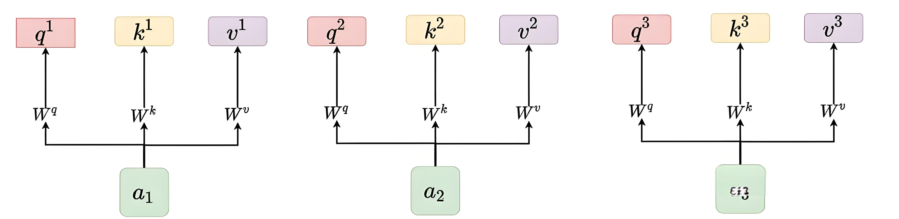

本质上是一些矩阵运算，如下图所示：

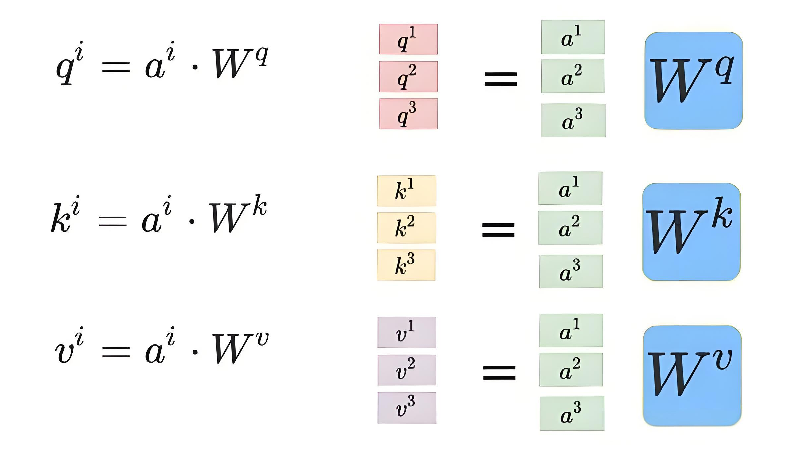

需要注意的是：Wq、Wk、Wv 是**随机初始化后，通过大模型训练而获得**。

**Wq、Wk、Wv 就是 Transformer 大模型在预训练阶段时，通过神经网络反向传播来训练出来的权重**（注意，这里提到的权重，是指神经网络中的连接权重），是 Transformer 大模型通过百万级的训练语料在 8 块 NVIDIA P100 GPU 上运算 3.5 天后的训练所得（当然，这是 2017 年 Google 团队首次提出 Transformer 时的事情了。如今到了 2026 年，前沿的多模态大模型在预训练时，往往采用数十万亿级别的 Token 语料库，并在由数万张 H100 或最新一代 B200 等高性能 GPU 组成的超级集群上并行运算数周乃至数月才能完成。随着模型能力的不断突破，这种训练所需的算力成本依然极其庞大）。

很多人会在这里感觉很迷惑， WQ, WK, WV 这三个矩阵到底是从何而来的，因为很多介绍 Transformer 的文章在这里都只是一笔带过，仅仅说了一下 WQ, WK, WV 这三个权重矩阵是随机初始化的，但并没有说明是在模型**“\*训练阶段\*”**随机初始化的，这造成了诸多的混淆。因为，不同于**“\*训练阶段\*”，**在模型的“***推理阶段（Inference Phase）\***”（模型预测阶段）这三个矩阵是固定的，即 Transformer 神经网络架构中的固定的节点连接权重，是早就被预先训练好的（Pre-Trained）。

**step 2：计算 attention score**

得到这些 q、k、v 后，分别用 q 去乘每一个 $k^T$ 得到一个数值 $a_i^j$：

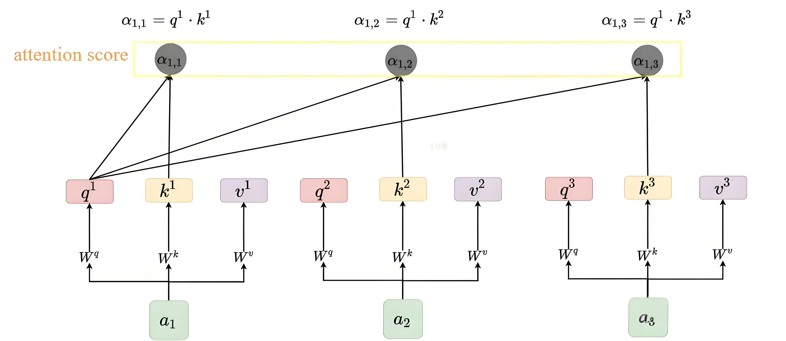

a1,1、a1,2、a1,3 是一个数值，我们称为 `attention score`，其表示的是每个输入的重要程度。这部分的图解公式如下：

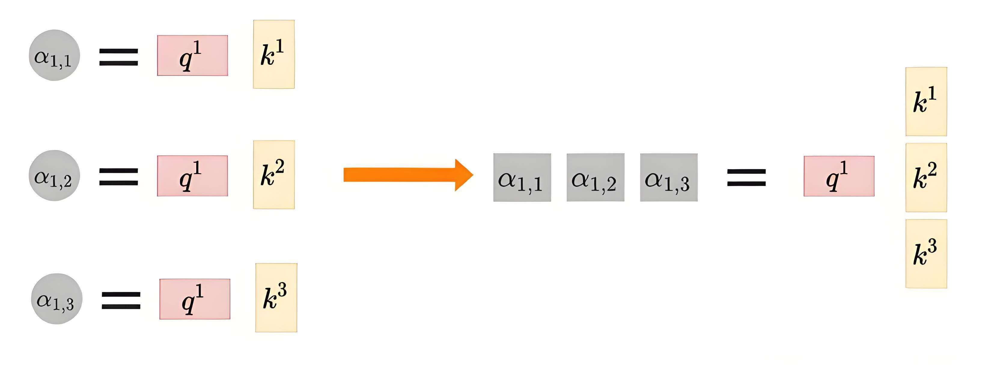

**step 3：通过 softmax 层**

这步就比较简单了，即把上步得到的 a1,1、a1,2、a1,3 经过一个 softmax 层：

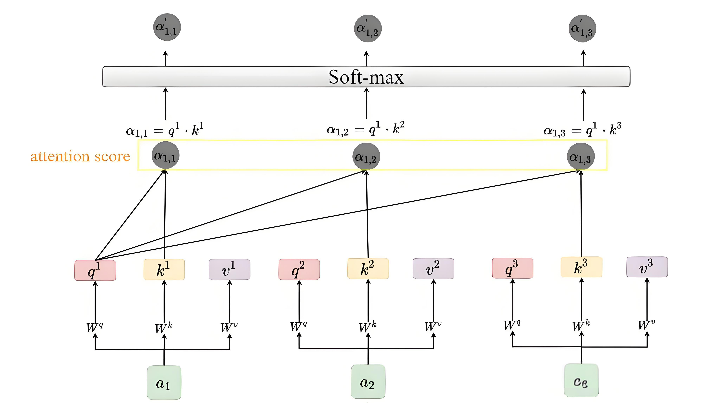

注意：在 softmax 层处理之前一般会除以 $\sqrt{d_k}$，起到一个归一化的作用，这里简化处理，省略了该步骤。

**经过 Softmax 处理后的 attention score 本质上就是一个概率分布，它基于 Q 和 K 之间的相似度计算而来**。

注意力机制本质上可以认为是求一个离散概率分布的数学期望。定义一个离散的随机变量 `X`，`X` 的所有可能取值为 `[X1, X2, X3]`，离散分布 `P = [p1, p2, p3]`，于是**注意力的计算结果就是随机变量 X 的数学期望**：

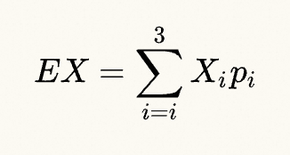

而离散分布 P 就是上文通过 Q 和 K 计算得到的 softmax 归一化之后的 attention。通过这里的解释，我们也可以更好地理解为什么计算 attention 的时候需要使用 softmax 函数进行归一化，归一化之后的每一个 attention 行向量都是一个离散的概率分布，具有更好的数学意义。

**step 4：得到输出 bi**

得到 a1,1′、a1,2′、a1,3′ 后，会让其分别乘 v1、v2、v3 再相加得到 b1，过程如下：

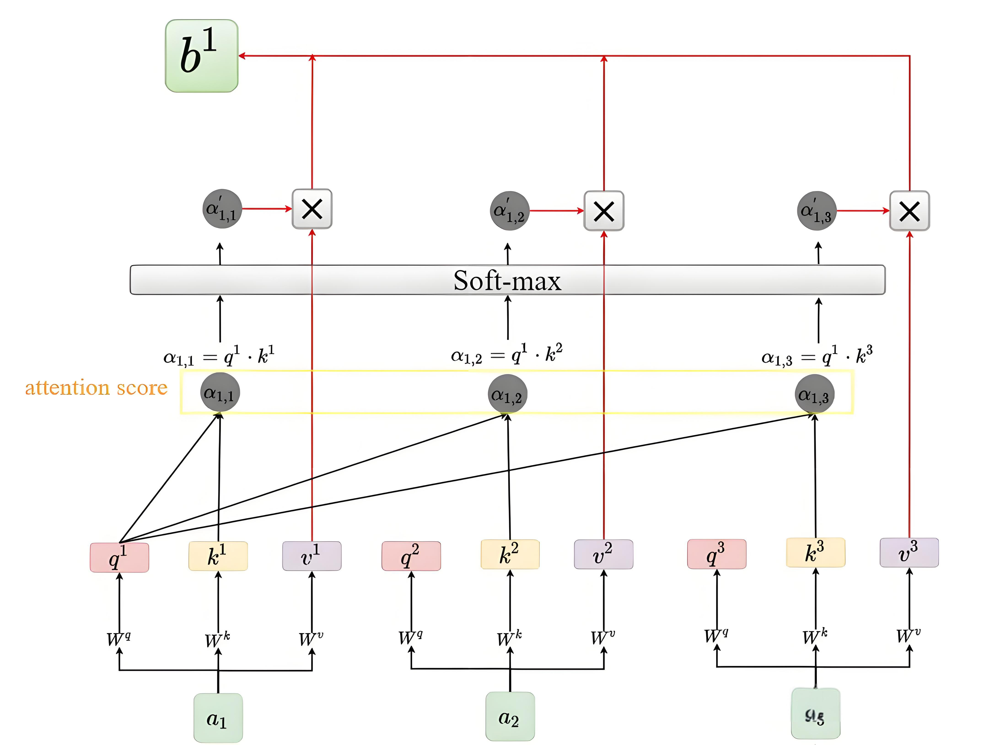

图解公式如下：

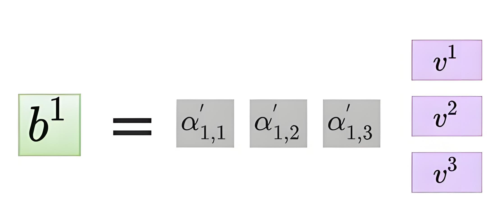

上文通过 q1 分别乘 k1^T、k2^T、k3^T 最终得到 b1，同理我们可以通过 q2 分别乘 k1^T、k2^T、k3^T 和 q3 分别乘 k1^T、k2^T、k3^T 得到 b2 和 b3。如下图所示：

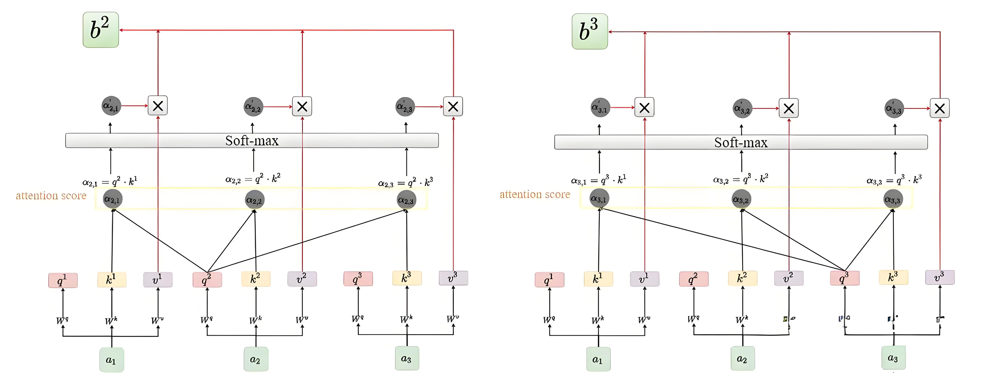

在上述 step 2、step 3 和 step 4 中，由于没有介绍 b2 和 b3 的生成过程，因此只给出了有关 b1 的图解公式。这里再补充上完整的图解公式，如下：

step 2:

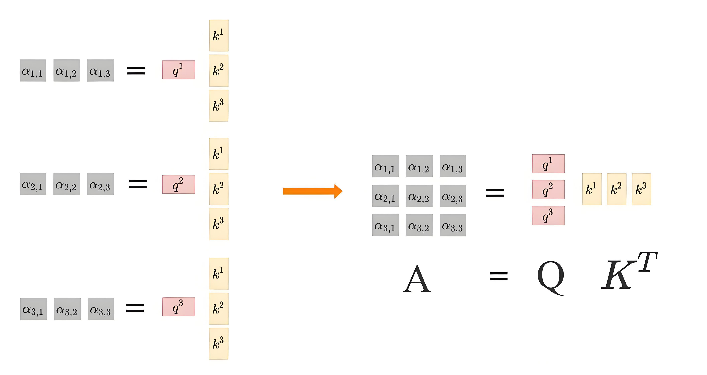

step 3:

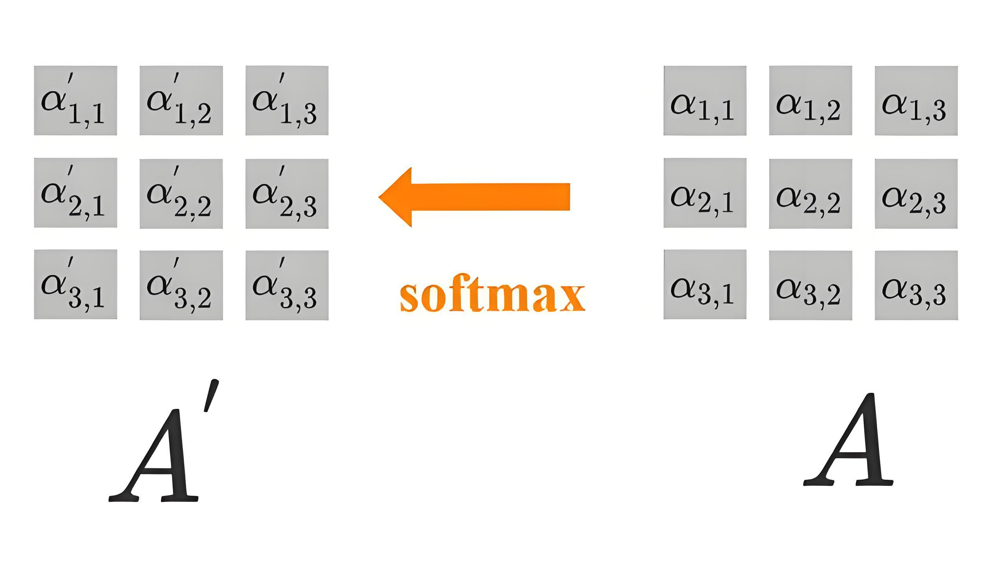

step 4:

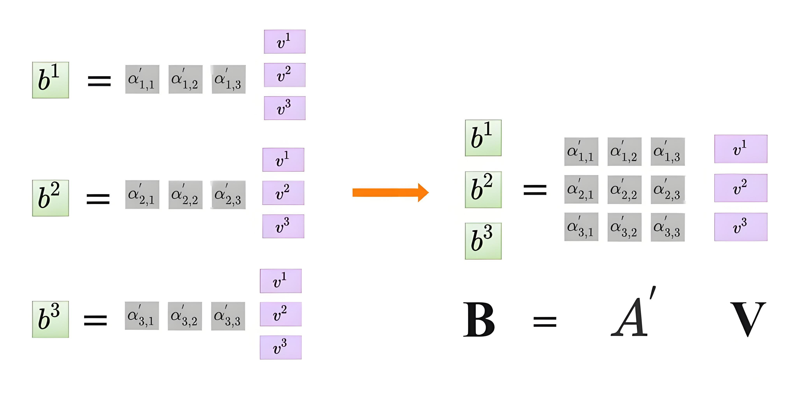

最后，为让大家理解此过程是并行的，将步骤 1 到步骤 4 的过程整合在一起，其中 I 表示输入的向量，通过下图可以很明显的看出这些矩阵运算是可以并行的，即我们把所有的输入 ai 拼在一起成为 I，将 I 输入网络进行一系列的矩阵运算。

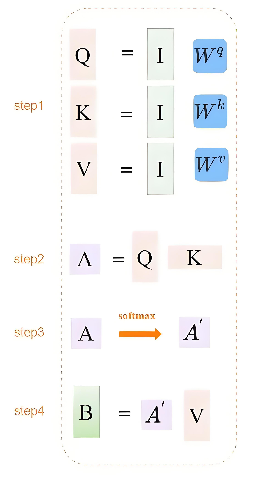

### 1.2.2 多头注意力的计算

在原始注意力模型的基础上，自注意力通常会并行计算多个不同的注意力分布（称为“头”），然后将结果组合起来，称为**多头注意力（Multi-Head Attention）**。

为什么需要多头呢？

因为**单个注意力头可能无法捕捉所有类型的语义关系**（比如有的关注逻辑关系，有的关注位置关系）。多头允许模型从不同“视角”（不同线性变换后的投影空间）观察问题，类似人类从多个角度观察事物。

例如：某个头专注“苹果公司”与后面的“新产品”关联；另一个头关注“售价”和“预期”的对比。最后组合所有头的输出，综合所有视角的信息。

**step 1：获取 q、k、v**

首先第一步和 Self-Attention 一模一样：

**step 2：分裂产生多个 q、k、v**

以下以两个 head 为例进行阐述，即将 q1 分裂成 q1,1 和 q1,2，将 q2 分裂成 q2,1 和 q2,2，将 q3 分裂成 q3,1 和 q3,2，如下图所示：

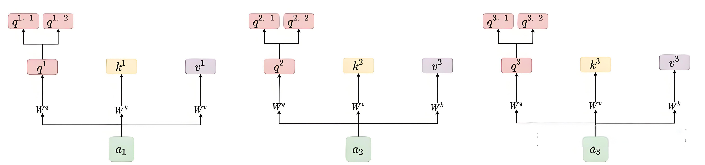

那么这个过程是怎么进行的呢，其实也很简单，只需要分别乘上两个矩阵 W1Q 和 W2Q 即可。

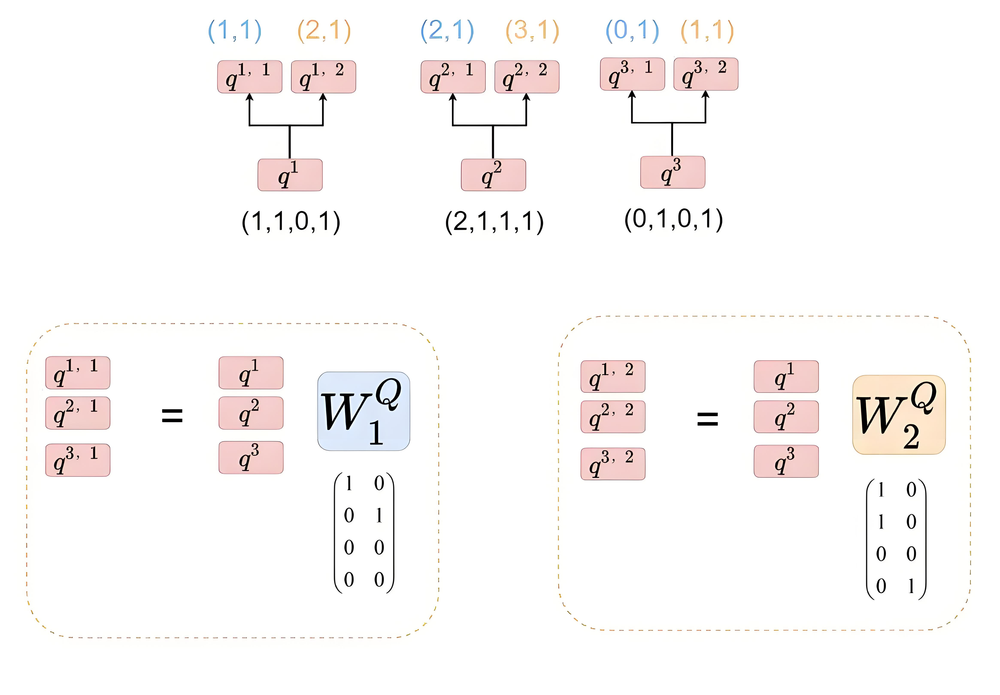

同理，我们可以对 k 和 v 采用同样的方法，即让它们分别乘以对应的两个矩阵进行分裂，结果如下图所示：

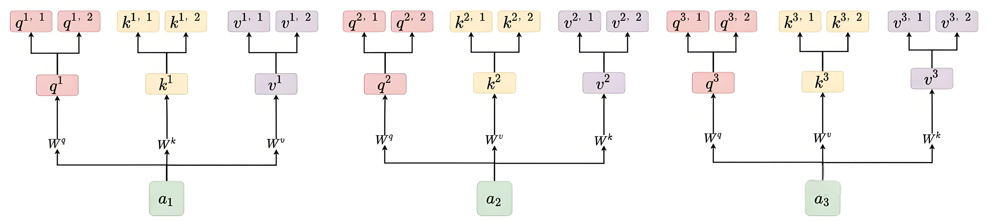

**step 3：对所有 head 使用 Self-Attention**

我们可以将上述结果分成两个 head 进行处理，如下图所示：

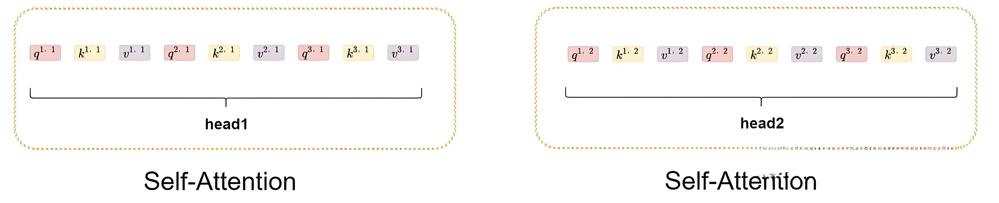

你会发现 head1 和 head2 就是我们前面所说的 Self-Attention 里面的元素，这样会从 head1 和 head2 得到对应输出，如下图所示：

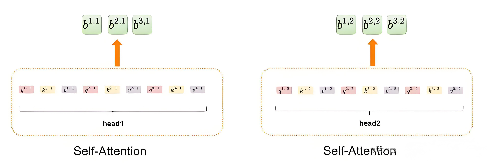

**step 4：拼接所有 head 输出的结果**

这一步我们会将上一步不同 head 输出的结果进行 Concat 拼接，如下图所示：

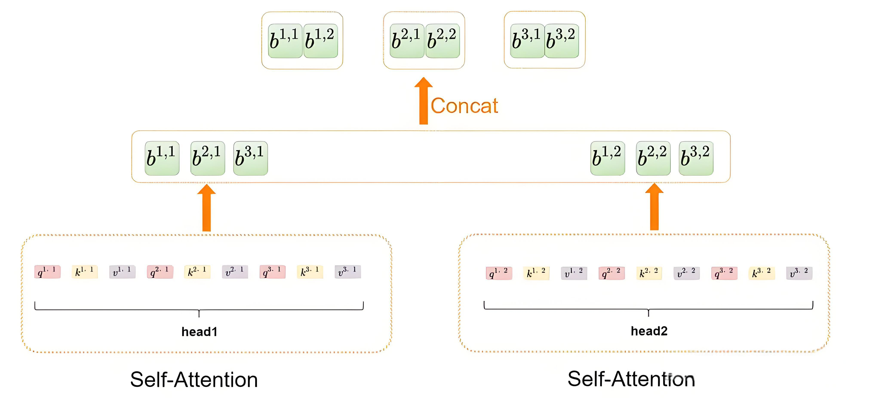

**step 5：Concat 后的结果乘上 Wo 矩阵**

这一步会乘上 Wo 矩阵，其作用主要是融合之前多个 head 的结果，并使我们的输出和输入时维度保持一致，如下图所示：

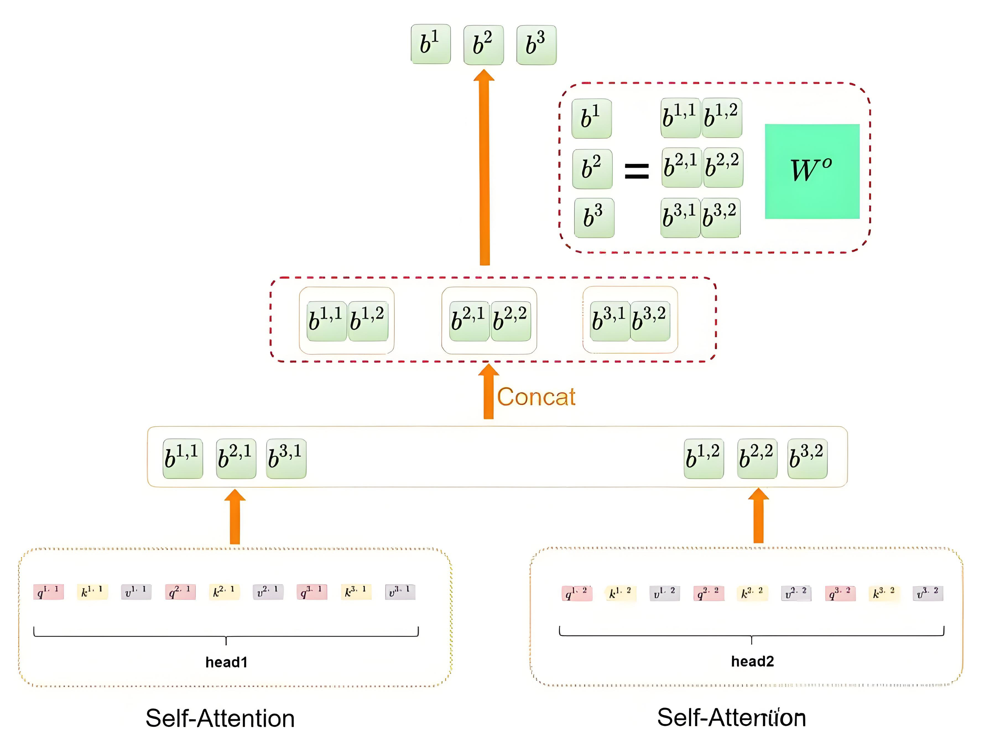

# 2 Transformer 架构

下图是简化的 Transformer 的模型架构示意图，先来大概看一下这张图，Transformer 模型的架构就是一个 **seq2seq 架构**，由多个 Encoder Decoder 堆叠而成。

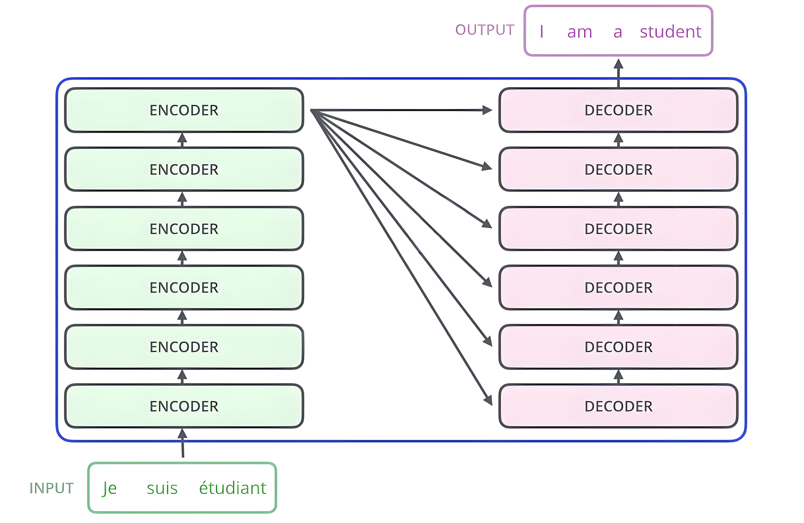

Encoder 由 Self-attention layer 和 Feed Forward 组成，而 Decoder 则由 Self-Attention、Encoder-Decoder Attention、Feed Forward 组成。

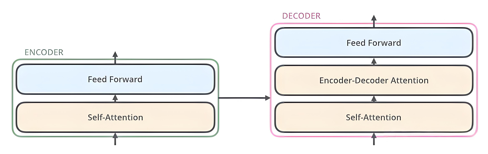

概括来说，我们输入法语：`je suis étudiant`，经过六个 Encoder 后得到了类似于 Context Vector 的东西，然后将得到的向量放进 Decoder 中，每个 Decoder 会对上一个 Decoder 的输出进行 Self-Attention 处理，同时会把得到的结果与 Encoder 传递过来的 Vector 进行 Encoder-Decoder Attention 处理，将结果放入前馈网络中，这算是一个 Decoder，而把六个 Decoder 叠加起来学习，便可得到最后的结果。这里叠起来的编解码器的数量不是固定的。

## 2.1 Encoder

下面是 Encoder 的示意图，在这里我们假设输入的句子只有两个词，简单高效地讲解 Encoder 的工作原理。

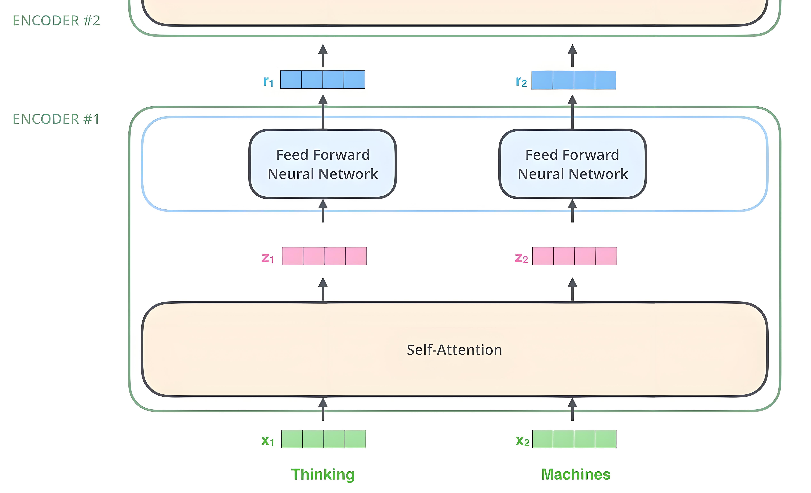

上图所示，我们输入了两个编码后的向量 x1, x2，其中 x1 是对单词 Thinking 的表示，x2 是对 Machines 单词的表示。通过 Encoder 模块得到了两个向量 r1, r2，虽然 r1, r2 也分别代表 Thinking、Machines 单词的信息，但是 r1, r2 是加权后的结果，也就是说 r1 中不仅仅包含 Thinking 单词的信息，而且还有 Machines 单词的信息，只不过 Thinking 单词信息占的比重可能很高，毕竟单词和单词本身的相关性是很高的（这里为了方便理解，举一个例子，**具体权重如何分配的是模型学习出来的**）。这里用两个词语举例子，如果输入的句子单词很多，可能不同单词之间的相关度就不一样，最后得到的 r 向量分配的权重也就不同。

所以，**原始输入的向量 x1、x2 各自包含各自的信息，而最后得到的 r1, r2 便分别包含了原始输入所有向量的信息，只是各占的比重不同**。

怎样才能每个单词的信息按不同权重糅合起来呢？没错，Self-Attention 机制。

### 2.1.1 Self-Attention

Self-Attention 中的细节如下图所示，当单词 Thinking、Machines 进行 Embedding 后，分别与矩阵 WQ, WK, WV 相乘。例如 Thinking 单词 Embedding 后变成 X1 向量，此向量与 WQ 相乘后为 q1 向量，也称为 Queries，X1 与 WK 相乘得到 k1 向量，以此类推。我们称 q1, k1, v1 向量分别为 Queries、Keys、Values 向量。

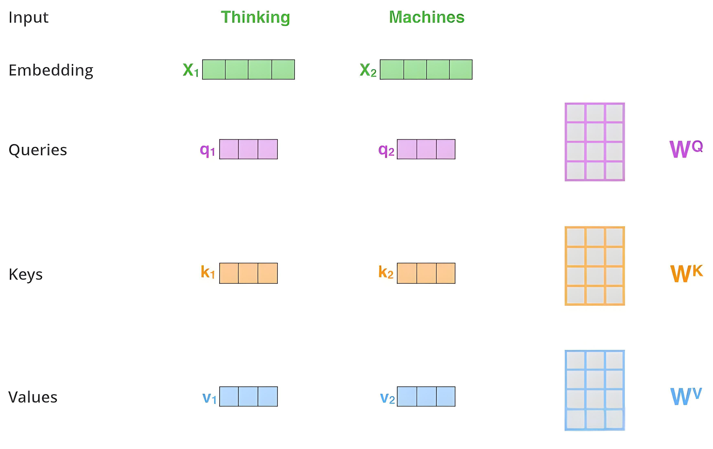

输入的每个单词都可以通过**同一个矩阵**计算得到对应的 qi, ki, vi 向量，x1 通过下图的过程生成 z1。用 q1 即 Thinking 单词的 Queries，分别与其它单词的 k1 向量相乘，比如 q1·k1 = 122，q1·k2 = 96。然后用得到的值除以根号下 dk（dk 为上方提及的矩阵的第一个维度）得到 14 和 12，对除法的结果进行 softmax，于是 Thinking 单词对应的比例是 0.88，而 Machines 对应比率的是 0.12，接下来使用 softmax 后得到的比率与对应的 Values 向量相乘，便得到了 v1 和 v2，v1 = 0.88 * v1，v2 = 0.12 * v2。由于 0.12 占的比例较小，得到的 v2 向量颜色较浅。最后将得到的 v1, v2 加起来便是 z1。

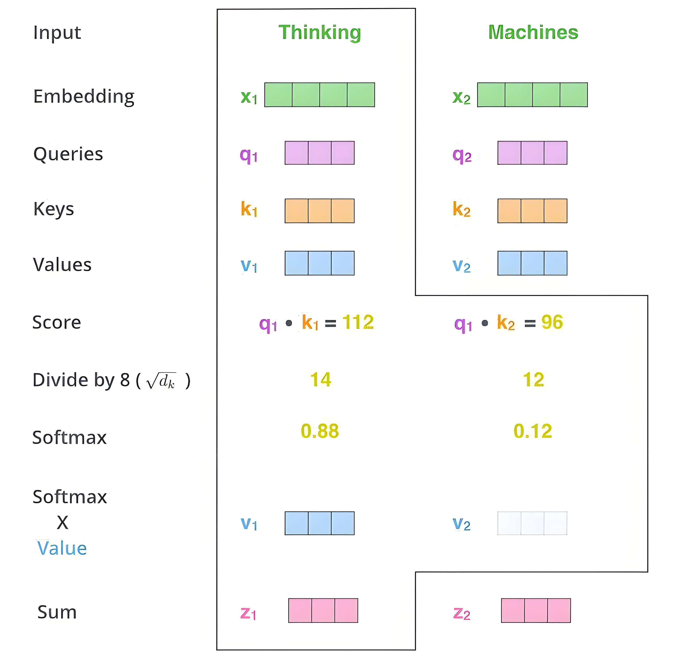

于是 z1 便包含了两个单词的信息，只不过 Thinking 单词的信息占的比重更大一些，而 Machines 单词的信息占的比例较小。

同样 z2 向量可以通过相同的方式计算出来，只不过计算 Score 的时候需要用 q2·k1、q2·k2。需要使用 q2 去分别乘 k1 和 k2。除以 8 并且 Softmax 后可以与 v1、v2 相乘，相加后便得到的 z2，z2 包含了两个单词的向量，只不过各占的比重不同。

当我们计算 q1, k1, v1 的时候，我们需要用向量 x1 分别与三个矩阵 WQ, WK, WV 相乘，而计算 q2, k2, v2 的时候又得需要进行三次乘法。这里仅仅有两个词就进行了 6 次运算。如果一个句子中有很多词呢？那对性能是不是非常大的消耗？这里就需要用到**向量化**的操作了，如下图所示，不再拿 x1, x2 分别去和三个矩阵相乘，而是将 x1, x2 叠加起来看作一个新的矩阵 X，再去和三个矩阵相乘。得到三个新的矩阵 Q, K, V，这三个矩阵的每一行代表着一个词转化后的值。

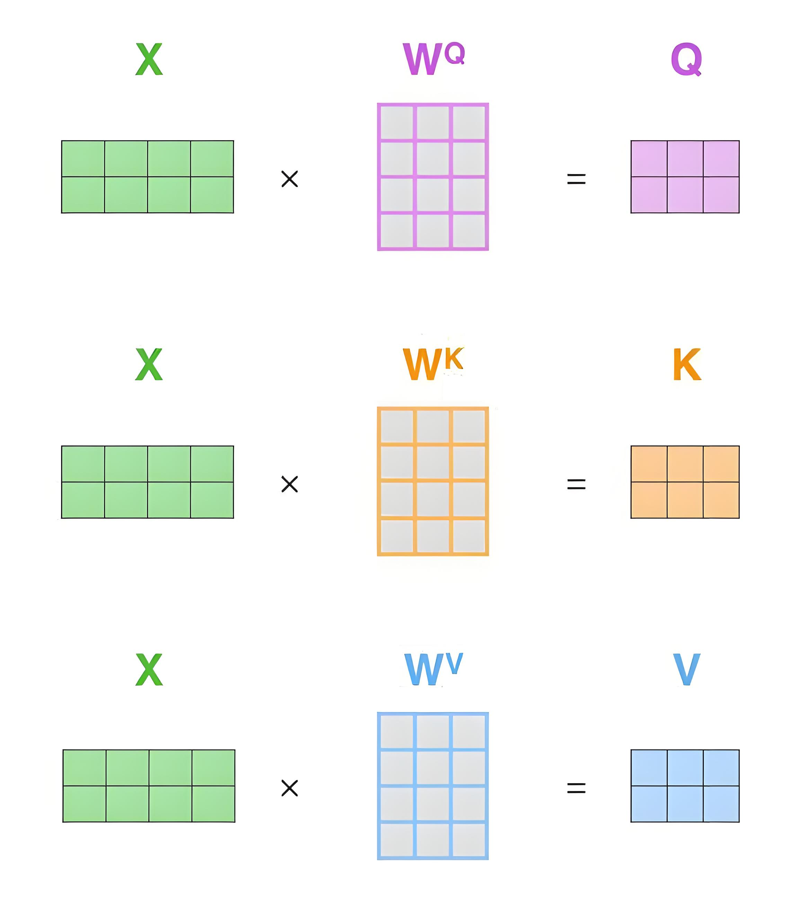

进行 z 值计算的时候也可以用向量化的思想，最后的矩阵 Z 就是 z1 和 z2 叠加在一起的结果。

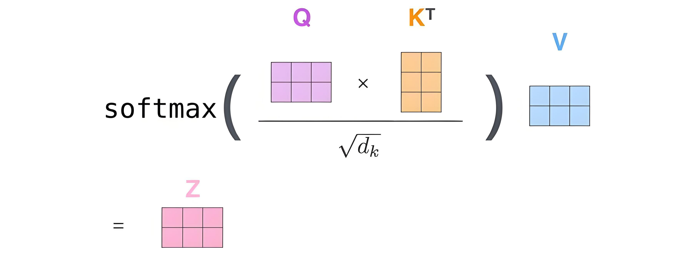

其中矩阵 WQ, WK, WV 是学习出来的，我们试图通过学习这三个矩阵，使 WQ, WK, WV 与 Embedding 向量相乘后得到的 Query、Key、Value 向量最契合当前的任务。因为矩阵 WQ, WK, WV 是学习出来的，所以得到的 Query、Key、Value 向量是比较抽象的。在这里，WQ, WK, WV **矩阵的功能相当于抽取特征**。这里的命名 Query、Key、Value 也非常有意思，大家自己想想每个向量的功能就能对应上了。这里应该是借鉴了信息检索的相关思想。

### 2.1.2 Positional Encoding

循环神经网络每个时间步输入一个单词，通过这样的迭代操作能够捕获输入句子中单词的位置信息。但是 Transformer 模型没有类似于循环神经网络的结构，所以**必须提供每个单词的位置信息给 Transformer，这样才能识别出语言中的顺序关系**。

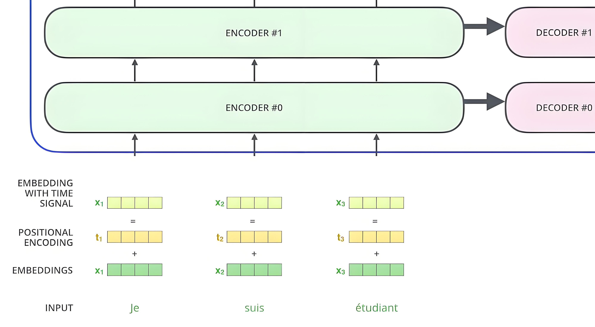

所以，输入进 encoder 中的向量不仅仅是单词的 embedding，而是**单词的 embedding 和 位置向量 positional encoding 融合后的结果**。

### 2.1.3 Layer normalization

Normalization 有很多种，但是它们都有一个共同的目的，那就是**把输入转化成均值为 0 方差为 1 的数据**。我们在把数据送入激活函数之前进行 normalization（归一化），因为我们不希望输入数据落在激活函数的饱和区。

提到 Normalization，就不得不提 Batch Normalization（批归一化）。BN 的主要思想就是：在每一层的每一批数据上进行归一化。我们可能会对输入数据进行归一化，但是经过该网络层的作用后，我们的数据已经不再是归一化的了。随着这种情况的发展，数据的偏差越来越大，反向传播需要考虑到这些大的偏差，这就迫使我们只能使用较小的学习率来防止梯度消失或者梯度爆炸。

然而，在自然语言处理中，由于输入句子的长度往往不一致，Batch Normalization 的效果并不理想。因此，Transformer 采用了 **Layer Normalization**，它是针对每一个样本的所有特征维度进行归一化，不受批次大小和序列长度的影响，非常适合 Transformer 架构。

### 2.1.4 Feed Forward

上文已经讲解了怎么把 x1 转化为 z1，接下来只需要把学习到的 zi 和原始输入进行融合和 Normalize 后输入到一个 feed forward neural network 中，这被称为**残差连接（Residual Connection / Skip-Connection）**，也就是下图中虚线箭头所代表的操作。看下面的图可得知，zi 进入 feed forward neural network 是单独进行的，没有揉合在一起。紧接着，feed forward neural network 的输出和它的输入再进行融合和 Layer Normalize 操作才得到了 ri。

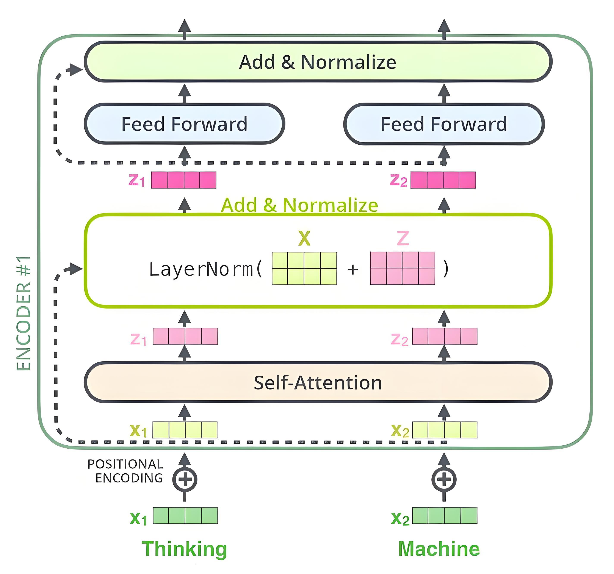

到此为止，把 encoder 的一个单元的原理讲清楚了，也就是如何将 xi 转化为 ri。

1. 对输入的数据进行 Embedding 得到 xi。
2. 把 Embedding 后的结果**融入 Positional 信息**后输入到 Encoder 网络中。
3. 输入信息输入到 Attention layer 中来捕获多维度的上下文信息，得到 zi。
4. 将注意力学习到的结果和原始输入进行融合后进入 Feed Forward 网络进一步学习。
5. 前馈网络的结果也会和前馈网络的输入做一个融合，类似于 skip-connection。
6. 这样便得到了一个 Encoder 单元后的结果 ri。

刚刚给出的一个 encoder 的设计细节，Transformer 是可以有很多 encoder 单元组合起来的，如下图所示是两个 encoder 单元叠加起来：

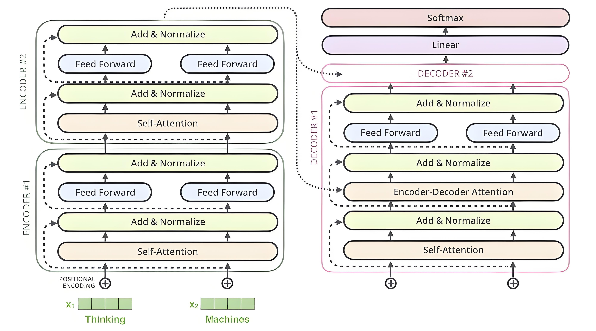

## 2.2 Decoder

Decoder 中的模块和 Encoder 中的模块类似，都是 Attention 层、前馈网络层、融合归一化层，不同的是 Decoder 中多了一个 Encoder-Decoder Attention 层。这里先明确一下 Decoder 模块的输入输出和解码过程：

- 输出：对应 i 位置的输出词的概率分布
- 输入：Encoder 模块的输出 & 对应 i−1 位置 Decoder 模块的输出。所以中间的 Encoder-Decoder Attention 不是 self-attention，它的 K，V 来自 Encoder 模块，Q 来自上一位置 Decoder 模块的输出
- 解码：**这里要特别注意一下，编码可以并行计算，一次性全部 encoding 出来，但解码在标准的自回归生成模式下不是一次把所有序列解出来的，而是像 RNN 一样一个一个解出来的**，因为要用上一个位置的输入当作 attention 的 query

输入序列经过 encoder 部分，然后**将最上面的 encoder 的输出变换成一组 attention 向量 K 和 V**，这些向量会用于每个 decoder 的 encoder-decoder attention 层，有助于解码器聚焦在输入序列中的合适位置。

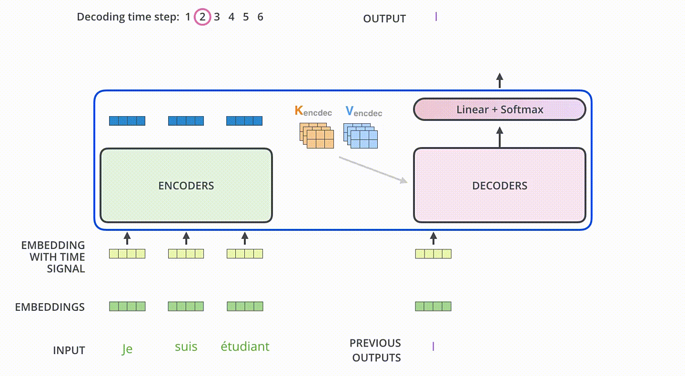

重复上面的过程，直到 decoder 完成了输出，每个时间步的输出都在下一个时间步时喂入给最底部的 decoder，同样，在这些 decoder 的输入中也加入了位置编码，来表示每个字的位置。

### 2.2.1 Mask

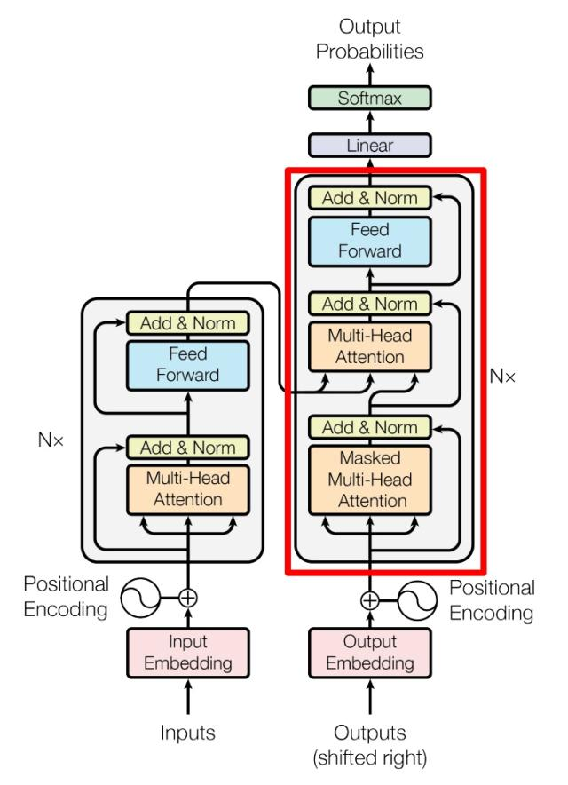

上图红色部分为 Transformer 的 Decoder block 结构。

Decoder block 的第一个 Multi-Head Attention 采用了 **Masked** 操作，因为在翻译的过程中是顺序翻译的，即翻译完第 i 个单词，才可以翻译第 i+1 个单词。通过 Masked 操作可以防止第 i 个单词知道 i+1 个单词之后的信息。下面以 "我有一只猫" 翻译成 "I have a cat" 为例，了解一下 Masked 操作。

下面的描述中使用了类似 **Teacher Forcing** 的概念。在 Decoder 的时候，是需要根据之前的翻译，求解当前最有可能的翻译，如下图所示。首先根据输入 "<Begin>" 预测出第一个单词为 "I"，然后根据输入 "<Begin> I" 预测下一个单词 "have"。

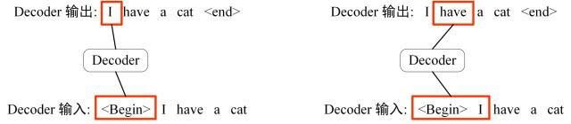

Decoder 可以在训练的过程中使用 Teacher Forcing 并且并行化训练，即将正确的单词序列 (<Begin> I have a cat) 和对应输出 (I have a cat <end>) 传递到 Decoder。那么在预测第 i 个输出时，就要将第 i+1 之后的单词掩盖住，**注意 Mask 操作是在 Self-Attention 的 Softmax 之前使用的，下面用 0 1 2 3 4 5 分别表示 "<Begin> I have a cat <end>"。**

**第一步：** 是 Decoder 的输入矩阵和 **Mask** 矩阵，输入矩阵包含 "<Begin> I have a cat" (0, 1, 2, 3, 4) 五个单词的表示向量，**Mask** 是一个 5×5 的矩阵。在 **Mask** 可以发现单词 0 只能使用单词 0 的信息，而单词 1 可以使用单词 0, 1 的信息，即只能使用之前的信息。

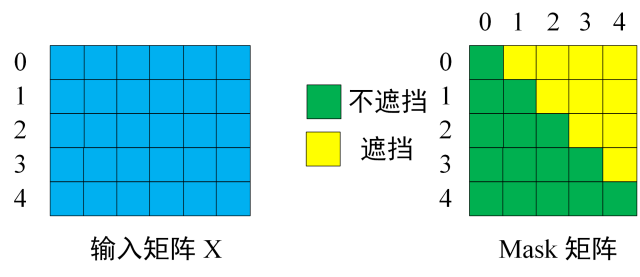

**第二步：** 接下来的操作和之前的 Self-Attention 一样，通过输入矩阵 **X** 计算得到 **Q, K, V** 矩阵。然后计算 **Q** 和 K^T 的乘积 QK^T。

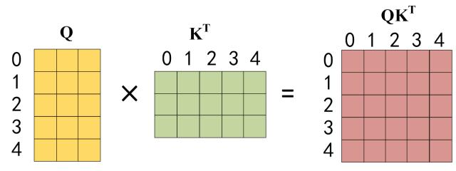

**第三步：** 在得到 QK^T 之后需要进行 Softmax，计算 attention score，我们在 Softmax 之前需要使用 **Mask** 矩阵遮挡住每一个单词之后的信息，遮挡操作如下：

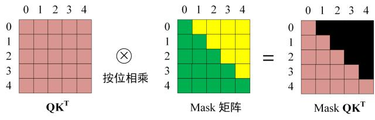

得到 **Mask** QK^T 之后在 **Mask** QK^T 上进行 Softmax，每一行的和都为 1。但是单词 0 在单词 1, 2, 3, 4 上的 attention score 都为 0。

**第四步：** 使用 **Mask** QK^T 与矩阵 **V** 相乘，得到输出 **Z**，则单词 1 的输出向量 Z1 是仅融合了单词 0 和单词 1 信息的，它无法“看到”单词 2、3、4 的信息。

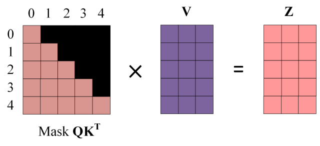

**第五步：** 通过上述步骤就可以得到一个 Mask Self-Attention 的输出矩阵 Zi，然后和 Encoder 类似，通过 Multi-Head Attention 拼接多个输出 Zi，然后计算得到第一个 Multi-Head Attention 的输出 **Z**，**Z** 与输入 **X** 维度一样。

