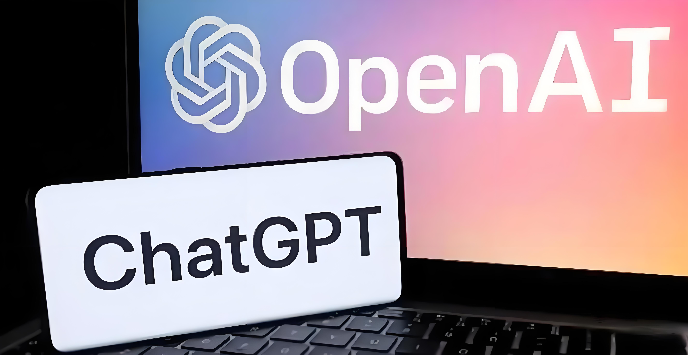
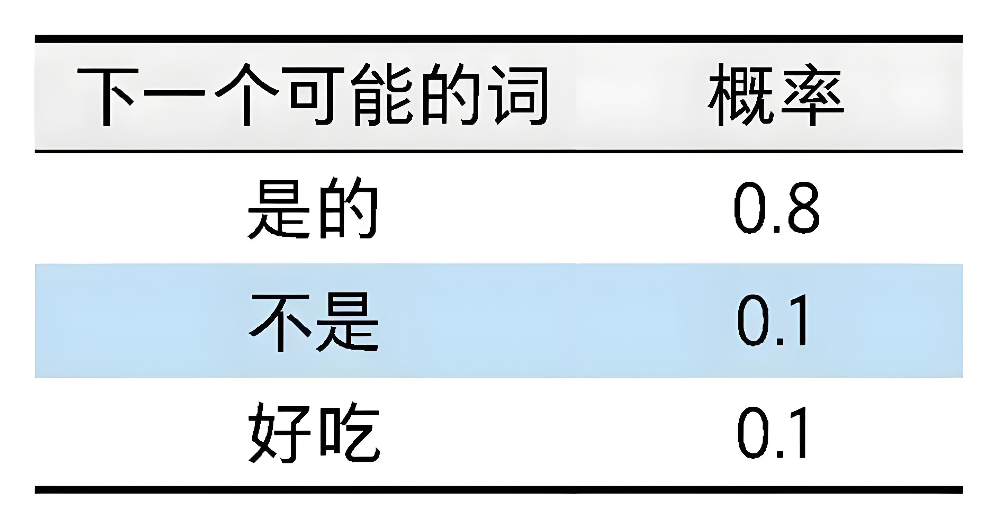
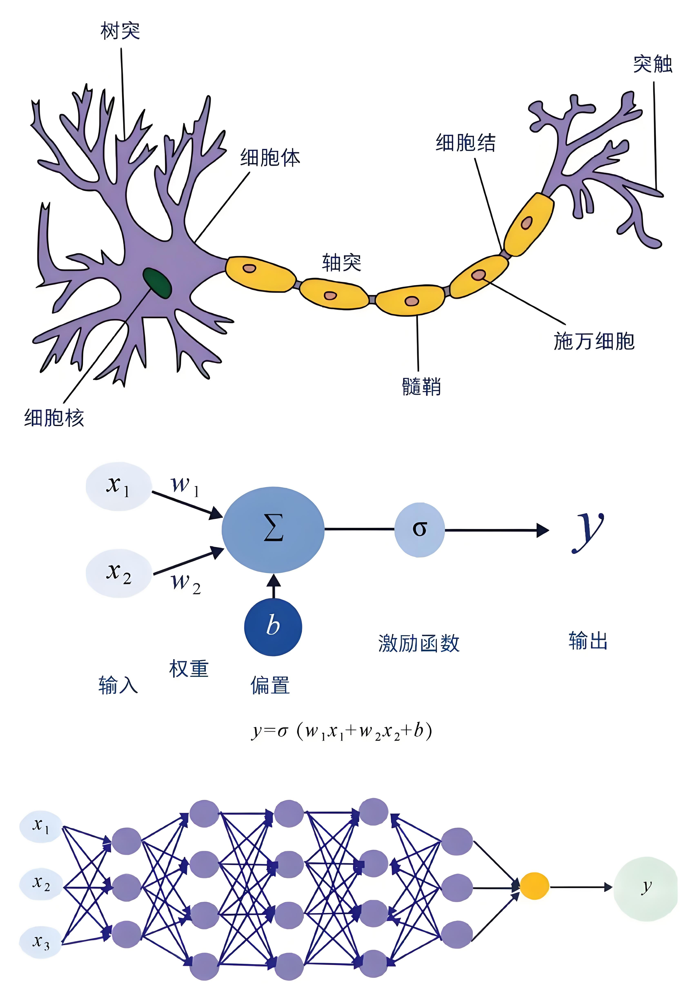
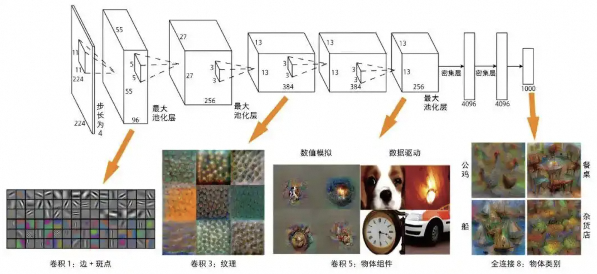
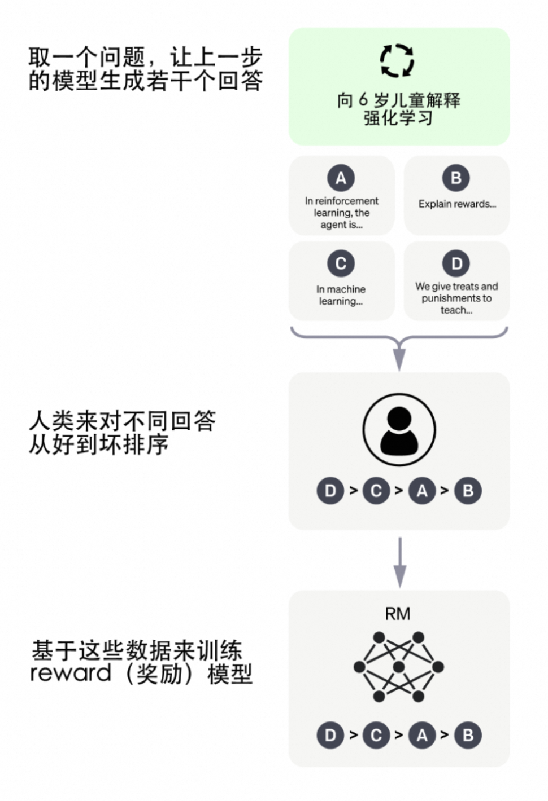
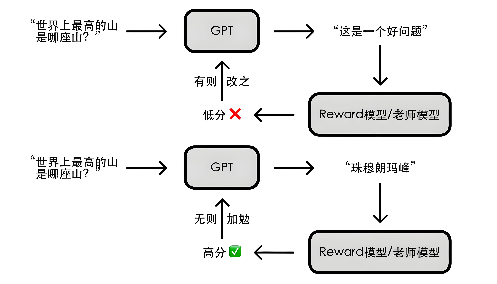

# OpenAI与GPT

2022年11月30日，一家名不见经传的公司——**OpenAI**悄悄上线了一个产品**ChatGPT**。彼时，谁也没有想到这款产品会在短短几个月内风靡全球，打破了有史以来科技产品用户数突破一亿的最短时间记录。



OpenAI总部位于美国旧金山，于2015 年 12 月由埃隆·马斯克（Elon Musk）、山姆·阿尔特曼（Sam Altman）等科技领袖共同创立。其初衷是推动人工智能技术的发展，同时确保 AI 技术对人类有益。成立初期，OpenAI 是一个**非营利组织**，旨在研究和开发安全、开放的人工智能技术。2019 年，OpenAI 转变为“**有限盈利**”模式（OpenAI LP），以吸引更多投资并支持大规模计算资源的需求。马斯克则在2018年时因公司发展方向分歧而离开。

从2018年起，OpenAI就开始发布生成式预训练语言模型**GPT**（Generative Pre-trained Transformer），可用于生成文章、代码、机器翻译、问答等各类内容。

每一代GPT模型的参数量都爆炸式增长，堪称“越大越好”。2019年2月发布的GPT-2参数量为15亿，而2020年5月的GPT-3，参数量达到了1750亿。


| **版本**    | **发布时间** | **参数量**                | **核心技术特点**                                             | **主要改进与功能**                                           | **意义与影响**                                               |
| ----------- | ------------ | ------------------------- | ------------------------------------------------------------ | ------------------------------------------------------------ | ------------------------------------------------------------ |
| **GPT-1**   | 2018 年 6 月 | 1.17 亿                   | - 基于 Transformer 架构。<br/> - 无监督预训练 + 有监督微调。 | - 首次展示大规模语言模型在多种任务中的潜力（如文本生成、问答）。 | - 开创了基于大规模预训练的语言模型研究方向。                 |
| **GPT-2**   | 2019 年 2 月 | 15 亿                     | - 引入零样本学习（zero-shot learning）。<br/> - 因滥用风险，分阶段开源。 | - 能够生成高质量的连贯文本。<br/> - 在零样本任务中表现出色（无需额外微调即可完成任务）。 | - 展示了大模型的生成能力，引发了关于 AI 安全性和伦理问题的讨论。 |
| **GPT-3**   | 2020 年 6 月 | 1750 亿                   | - 支持少样本学习（few-shot learning）和零样本学习。<br/> - 更大的参数量带来更强的泛化能力。 | - 在代码生成、翻译、对话等任务中表现卓越。<br/> - 提供 API 服务，推动商业化应用。 | - 标志大语言模型进入新阶段，展示了通用人工智能（AGI）的潜力。 |
| **GPT-3.5** | 2022 年      | 未公开，据推测与GPT-3接近 | - 基于指令微调（Instruction Tuning）和人类反馈强化学习（RLHF）。 - 更注重对话能力和安全性。 | - 推出了 ChatGPT，成为现象级产品。<br/> - 对话更加自然流畅，适合多轮交互场景。 | - 让公众首次体验到大语言模型的强大能力，推动了 AI 应用的普及。 |
| **GPT-4**   | 2023 年 3 月 | 未公开，据推测在万亿以上  | - 支持多模态输入（如图像和文本结合）。<br/> - 性能显著提升，逻辑推理和复杂任务处理能力更强。 | - 在逻辑推理、复杂任务（如编程、数学问题解决）中表现更佳。<br/> - 提高了安全性和可控性。 | - 进一步缩小人机交互差距，被认为是迈向 AGI 的重要一步。      |

# 2、文字接龙游戏

ChatGPT最令人印象深刻的能力是它能够通过对话的方式回答用户的问题，那么ChatGPT回答问题的原理是什么呢?

传统的问答系统本质上是基于数据库和搜索引擎，即通过搜索引擎在网络与数据库中搜索相关信息，然后把结果直接返回给用户。比如我们使用百度搜索“机器学习的原理是什么”，百度会跳转出各式各样的网站。这些网站是由各个企业早就开发好的，百度仅仅是根据相关度做了一个排序。

不同于传统问答系统中答案来源于现成的网络或者数据库，ChatGPT的回答是随着提问的进行自动生成的。这一点有点像文字接龙游戏，ChatGPT会**基于前面的话不断地生成下一个合适的词汇，直到觉得不必继续生成为止**。

比如我们问ChatGPT：“苹果是一种水果吗”，ChatGPT会基于这句话进行文字接龙，大概流程如下：

(1)考虑下一个可能的词汇及其对应的概率，如右表(为了方便理解只写了3个可能的形式)所示。



(2)基于上述概率分布，ChatGPT会选择概率最大的答案，即“是的”(因为其概率0.8明显大于其他选项)。

(3)此时这句话的内容变成 “苹果是一种水果么?是的”，ChatGPT会看下一个可能的词和对应概率是什么。

不断重复这个步骤，直到得到一个完整的回答。

从上面例子可以看出：

(1)不同于传统问答基于数据库或搜索引擎，ChatGPT的答案是在用户输入问题以后，随着问题自动生成的。

(2)这种生成**本质上是在做文字接龙**，简单来说是**不断在所有可能词汇中选择概率最大的词汇来生成**。

那么，ChatGPT是怎么知道该选择什么词汇，又是如何给出各个可能词汇的概率呢？答案是机器学习。

# 3、机器学习

ChatGPT是机器学习的一个非常典型的应用。

**机器学习整体思想是借鉴人类学习的过程。**人类观察、归纳客观世界的实际情况，并从中学到相关的规律，当面对某一未知情况的时候，会使用已经学到的规律来解决未知的问题。同理，我们希望计算机能够自动地从海量数据中发现某种“规律”，并将这种规律应用于一些新的问题。**这种规律在机器学习领域就被称为“模型”，学习的过程被称为对模型进行训练。**


**实际上所有机器学习模型背后都有一个假设：学习的规律是能够通过数学表示的。**

**机器学习的核心就是想办法找到一个数学函数，让这个函数尽可能接近真实世界的数学表达式**。然而很多时候人类并不知道真实的数学表示是什么形式，也无法通过传统数学推导的方式获得；人类唯一拥有的是一堆来源于真实情境的数据。机器学习的方法就是使用这些数据(训练数据)去训练我们的模型，让模型自动找到一个较好的近似结果。

比如人脸识别的应用，就是想找到一个函数，这个函数的输入是人脸照片，输出是判定这张照片对应哪个人。然而人类不知道人脸识别函数是什么形式，于是就拿来一大堆人脸的照片并且标记好每个脸对应的人，交给模型去训练，让模型自动找到一个较好的人脸识别函数。这就是机器学习在做的事情。

理解了机器学习是什么，另一个概念是机器学习模型的数学表达能力。机器学习模型本质上是想要尽可能接近真实世界对应的那个函数。然而正如我们不能指望仅仅通过几条直线就画出精美绝伦的美术作品，如果机器学习模型本身比较简单，比如高中学到的线性函数：

`Y=kx+b`

那么它无论如何也不可能学习出一个复杂的函数。因此机器学习模型的一个重要考虑点就是模型的数学表达能力，当面对一个复杂问题的时候，我们希望模型数学表达能力尽可能强，这样模型才有可能学好。


## 2.1 神经网络

过去几十年科学家发明了非常多不同的机器学习模型，而其中最具影响力的是一种叫作“**神经网络**”的模型。神经网络模型最初基于生物学的一个现象：人类神经元的基础架构非常简单，只能做一些基础的信号处理工作，但最终通过大脑能够完成复杂的思考。受此启发，科学家们开始思考是否可以构建一些简单的“神经元”，并通过神经元的连接形成网络，从而产生处理复杂信息的能力。

基于此，神经网络的基础单元是一个神经元的模型，其只能进行简单的计算。假设输入数据有2个维度(x, x)，那么这个神经网络可以写成：

`y=σ(wx+wx+b)`

上述神经元的数学表达能力非常弱，只是一个简单的线性函数和一个激活函数的组合;但是我们可以很轻松地把模型变得强大起来，方案就是增加更多的“**隐藏节点**”。在这个时候虽然每个节点依然进行非常简单的计算，但组合起来其数学表达能力就会变得很强。这个模型也是日后**深度学习**的基础模型，即**多层感知机**。



多层感知机的原理非常简单，但是透过它可以很好地了解神经网络的原理：**虽然单个神经元非常简单，但是通过大量节点的组合就可以让模型具备非常强大的数学表达能力**。而之后整个深度学习的技术路线，某种程度上就是沿着开发并训练更大更深的网络的路线前进的。


## 2.2 预训练+微调范式

深度学习领域从2012年开始蓬勃发展，更大更深且效果更好的模型不断出现。然而随着模型越来越复杂，从头训练模型的成本越来越高。于是有人提出，能否不从头训练，而是在别人训练好的模型基础上训练，从而用更低的成本达到更好的效果呢?

例如，科学家对一个图像分类模型进行拆分，希望研究深度学习模型里的那么多层都学到了什么东西。结果发现，**越接近输入层，模型学到的是越基础的信息**，比如边、角、纹理等；**越接近输出层，模型学到的是越接近高级组合的信息**，比如公鸡的形状、船的形状等。不仅仅在图像领域如此，在自然语言、语音等很多领域也存在这个特征。



**基础信息往往是领域通用的信息**，比如图像领域的边、角、纹理等，在各类图像识别中都会用到；而**高级组合信息往往是领域专用信息**，比如猫的形状只有在动物识别任务中才有用，在人脸识别的任务就没用。因此一个自然而然的逻辑是，通过领域常见数据训练出一个通用的模型，主要是学好领域通用信息；在面对某个具体场景时，只需要使用该场景数据做个小规模训练(微调)就可以了。这就是著名的**预训练+微调**的范式。

预训练+微调这一范式的出现与普及对领域产生了两个重大影响。一方面，在已有模型基础上微调大大降低了成本；另一方面，一个好的预训练模型的重要性也更加凸显，因此各大公司、科研机构更加愿意花大量成本来训练更加昂贵的基础模型。

那么大模型的效果到底与什么因素有关呢？

OpenAI在2020年提出了著名的**Scaling Law**，即当模型规模变大以后，模型的效果主要受到一下三个因素影响：

- 模型参数规模
- 训练数据规模
- 使用算力规模

并且为了获得最佳性能，所有三个因素**必须同时放大**。当不受其他两个因素的制约时，模型性能与每个单独的因素都有**幂律关系**。

Scaling Law积极的一面是为提升模型效果指明了方向，只要把模型和数据规模做得更大就可以，这也是为什么近年来大模型的规模在以指数级增长，以及基础算力资源图形处理器(graphics processing unit, GPU)总是供不应求。但Scaling Law也揭示了一个让很多科学家绝望的事实：即模型的每一步提升都需要人类用极为夸张的算力和数据成本来“交换”。大模型的成本门槛变得非常之高，从头训练大模型成了学界的奢望，以OpenAI、谷歌、Meta、阿里巴巴等企业为代表的业界开始发挥引领作用。

## 2.3 上下文学习

除了希望通过训练规模巨大的模型来提升效果以外，GPT模型在发展过程中还有一个非常雄大的野心：**上下文学习**(in-context learning)。

正如前文所述，在过去如果想要模型“学”到什么内容，需要用一大堆数据来训练我们的模型。哪怕是前文讲到的预训练+微调的范式，依然需要在已训练好的模型基础上，用一个小批量数据做训练(即微调)。因此在过去，“训练”一直是机器学习中最核心的概念。但OpenAI提出，训练本身既有成本又有门槛，希望模型面对新任务的时候不用额外训练，只需要在对话窗口里给模型一些例子，模型就自动学会了。这种模式就叫作上下文学习。

举一个中英文翻译的例子。过去做中英文翻译，需要使用海量的中英文数据集训练一个机器学习模型;而在上下文学习中，想要完成同样的任务，只需要给模型一些例子，比如告诉模型下面的话：

下面是一些中文翻译成英文的例子：

```
我爱中国 → I love China
我喜欢写代码 → I love coding
人工智能很重要 → AI is important
```

现在我有一句中文，请翻译成英文。这句话是：“我今天想吃苹果”。

这时候原本“傻傻的”模型就突然具备了翻译的能力，能够自动翻译了。

有过ChatGPT使用经历的读者会发现，这个输入就是**提示词**(prompt)。在ChatGPT使用已相当普及的今天，很多人意识不到这件事有多神奇。这就如同找一个没学过英语的孩子，给他看几个中英文翻译的句子，这个孩子就可以流畅地进行中英文翻译了。要知道这个模型可从来没有专门在中英文翻译的数据集上训练过，也就是说模型本身并没有中英文翻译的能力，但它竟然通过对话里的一些例子就突然脱胎换骨“顿悟”了中英文翻译，这真的非常神奇!

**上下文学习的相关机制到今天依然是学界讨论的热点，而恰恰因为GPT模型具有上下文学习的能力，一个好的提示词非常重要。**提示词工程逐步成为一个热门的领域，甚至出现了一种新的职业叫作“提示词工程师”(prompt engineer)，就是通过写出更好的提示词让ChatGPT发挥更大的作用。

# 4、ChatGPT的训练

GPT-3背后是一个非常庞大的神经网络，有1750亿个参数，基于庞大的神经网络，面对一句话时，模型可以准确给出候选词汇的概率，从而完成文字接龙的操作。这种有巨大规模进行语言处理的模型，也叫作**大语言模型**(large language model)。

ChatGPT是在GPT-3的基础上进行了改进的大模型，它可以与人类进行自然语言交互。要想了解 ChatGPT的核心，我们需要先明白GPT-3有哪些问题，以及ChatGPT是如何解决这些问题的。

GPT-3的最大问题是**它的训练目标和用户意图不一致**。也就是说，GPT-3并没有真正理解用户的意图，而只是根据语言的统计规律来生成文本。GPT-3本质上是一个语言模型，它的优化目标是最大化下一个词出现的概率。给定一个词序列作为输入，GPT-3模型要预测序列中的下一个词。例如，如果给模型输入句子：“猫坐在”，它可能会预测下一个词是“垫子”、“椅子”或“地板”，因为这些词在前面的上下文中出现的概率较高。

更一般地说，这些训练策略可能导致语言模型在一些需要更深入地理解语言含义的任务或上下文中出现偏差。因此，这样的模型很难泛化到不同类型和风格的问题上，并且很难理解用户的真实意图。经常会出现答非所问的情况。

因此，ChatGPT要解决的核心问题就是**如何让模型和用户对齐**。也就是说，如何让模型能够理解用户提出的不同类型和风格的问题，并且能够生成优质、有用、无害、不歧视的答案。

ChatGPT的核心方法就是引入“人工标注数据+强化学习”来不断微调预训练语言模型。在“人工标注数据+强化学习”框架下，训练ChatGPT主要分为以下三个阶段。

- **SFT 模型**（Supervised Fine-Tuning）：即有监督的调优，预训练的语言模型在少量已标注的数据上进行调优，以学习从给定的 prompt 列表生成输出的有监督的策略；
- **RM模型**（Reward Model）：即用训练回报模型来模拟人类偏好，标注者们对相对大量的 SFT 模型输出进行投票，这就创建了一个由比较数据组成的新数据集。在此数据集上继续训练新模型；
- **强化学习模型**：近端策略优化（PPO）：RM 模型用于进一步调优和改进 SFT 模型，PPO 输出结果是的策略模式。

步骤 1 只进行一次，而步骤 2 和步骤 3 可以持续重复进行：在当前最佳策略模型上收集更多的比较数据，用于训练新的 RM 模型，然后训练新的策略。

## 4.1 第一阶段：人类引导接龙方向——有监督微调

为了让ChatGPT能够理解用户提出的问题中所包含的意图，首先需要从用户提交的问题中随机抽取一部分，由专业的标注人员给出相应的高质量答案，然后用这些人工标注好的<提示, 答案> 数据来微调 GPT-3模型，如下图所示：


这便是**有监督训练**，即对于特定问题告诉 AI 人类认可的答案，让 AI 依葫芦画瓢。这种方法可以引导 AI 往人类期望的方向去做文字接龙，也就是给出正确且有用的回答。通过这种有监督训练的方法，我们可以得到一个简易版的 ChatGPT 模型。

需要注意的是，这里并不需要人类穷举出所有可能的问题和答案，这既代价高昂又不甚现实。实际上研究人员只提供了数万条数据让 AI 学习，因为 GPT 本来就有能力产生正确答案，只是尚不知道哪些是人类所需的；这几万条数据主要是为了告诉 AI 人类的喜好，提供一个文字接龙方向上的引导。


## 4.2 第二阶段：给 GPT 请个“好老师”——训练奖励模型

如何让这个简易版的 ChatGPT 模型变得更强呢？我们可以参考其他 AI 模型的训练思路，前几年轰动一时的围棋人工智能 AlphaGo，是通过海量的自我对弈优化模型，最终超越人类；能不能让 GPT 通过大量对话练习提升其回答问题的能力呢？可以，但缺少一个 “好老师”。

AlphaGo 自我对弈，最终胜负通过围棋的规则来决定；但 GPT 回答一个问题，谁来告诉 GPT 回答的好坏呢？总不能让人来一一评定吧？人的时间精力有限，但 AI 的精力是无限的，如果有个能辨别 GPT 回答好坏的「老师模型」（即 Reward 模型），以人类的评分标准对 GPT 所给出的答案进行评分，那不就能帮助 GPT 的回答更加符合人类的偏好了么？

于是研究人员让 GPT 对特定问题给出多个答案，**由人类来对这些答案的好坏做排序**（相比直接给出答案，让人类做排序要简单的多）。基于这些评价数据，研究人员训练了一个符合人类评价标准的 Reward 模型。



具体而言，从用户提交的问题中随机抽取一部分，使用第一阶段微调好的模型，对每个问题生成*K*个不同的答案（这里*K*是4到9之间的一个数）。这样就得到了<问题, 回答1>, <问题, 回答2>,…,< 问题, 回答*K*>数据。然后，标注人员根据多个标准（例如相关性、信息量、有害性等）综合考虑，对*K*个回答进行排序，给出*K* 个回答的排名顺序，这就是这个阶段人工标注的数据。

接下来，利用这个排序数据来训练奖励模型，采用的训练方法是成对学习（pair-wise learning）。对于*K*个排序结果，两两组合成训练数据对，ChatGPT采用成对学习损失值来训练奖励模型。奖励模型接受一个输入<问题, 回答>，输出一个评价答案质量高低的分数（score）。对于一对训练数据<回答1, 回答2>，假设人工排序中回答1排在回答2前面，那么损失函数就鼓励奖励模型对<问题, 回答1> 的分数要高于<问题, 回答2>的分数。


## 4.3 第三阶段：AI 指导 AI ——强化学习优化模型

“你们已经是成熟的 AI 了，该学会自己指导自己了”。要实现 AI 指导 AI，得借助强化学习技术；简单来说就是让 AI 通过不断尝试，有则改之、无则加勉，从而逐步变强。



具体步骤如下：首先，从用户提交的问题中随机抽取一些新的命令，并用第一阶段经过监督微调的模型初始化**近端策略优化**（Proximal Policy Optimization, PPO）模型的参数。然后，对于每个抽取的问题，用近端策略优化模型生成回答，并用奖励模型评估回答的质量得分。

# 5、ChatGPT的局限性


尽管ChatGPT表现出出色的上下文对话能力甚至编程能力，完成了大众对人机对话机器人（ChatBot）从“人工智障”到“有趣”的印象改观，我们也要看到，ChatGPT技术仍然有一些局限性，还在不断的进步。

（1）ChatGPT在其未经大量语料训练的领域缺乏“人类常识”和引申能力，甚至会**一本正经的“胡说八道”**。ChatGPT在很多领域可以“创造答案”，但当用户寻求正确答案时，ChatGPT也有可能给出有误导的回答，尤其在数理计算方面。例如让ChatGPT做一道小学应用题，尽管它可以写出一长串计算过程，但最后答案却是错误的。

（2）ChatGPT无法处理复杂冗长或者特别专业的语言结构。对于来自金融、自然科学或医学等非常专业领域的问题，如果没有进行足够的语料“喂食”，ChatGPT可能无法生成适当的回答。

（3）ChatGPT需要非常大量的算力（芯片）来支持其训练和部署。抛开需要大量语料数据训练模型不说，在目前，ChatGPT在应用时仍然需要大算力的服务器支持，而这些服务器的成本是普通用户无法承受的，即便数十亿个参数的模型也需要惊人数量的计算资源才能运行和训练。，如果面向真实搜索引擎的数以亿记的用户请求，如采取目前通行的免费策略，任何企业都难以承受这一成本。因此对于普通大众来说，还需等待更轻量型的模型或更高性价比的算力平台。

（4）ChatGPT还没法在线的把新知识纳入其中，而出现一些新知识就去重新预训练GPT模型也是不现实的，无论是训练时间或训练成本，都是普通训练者难以接受的。如果对于新知识采取在线训练的模式，看上去可行且语料成本相对较低，但是很容易由于新数据的引入而导致对原有知识的灾难性遗忘的问题。

（5）ChatGPT仍然是**黑盒模型**。目前还未能对ChatGPT的内在算法逻辑进行分解，因此并不能保证ChatGPT不会产生攻击甚至伤害用户的表述。
